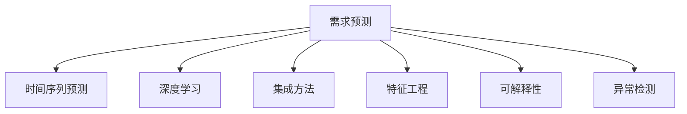
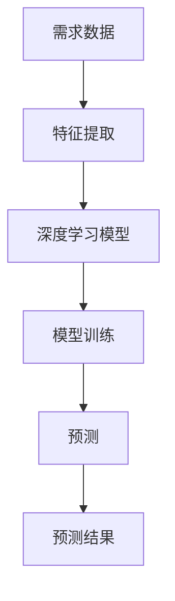
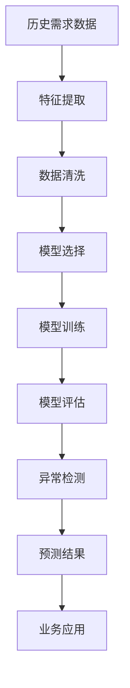

                 

# 机器学习在需求预测中的作用

> 关键词：机器学习, 需求预测, 时间序列, 异常检测, 深度学习, 集成方法, 特征工程, 可解释性

## 1. 背景介绍

### 1.1 问题由来
需求预测在各行各业中都起着至关重要的作用。无论是制造业的生产调度、零售业的库存管理，还是金融业的投资决策，精确的需求预测都直接影响着企业的资源配置和决策效率。传统的统计方法虽然在一定程度上能够提供一定的参考价值，但其依赖于历史数据的线性关系假设，难以适应需求动态变化的情况。而机器学习技术，尤其是时间序列预测和深度学习的方法，能够更灵活地处理非线性、非平稳的数据特征，提供更加精准的预测结果。

### 1.2 问题核心关键点
机器学习在需求预测中的应用，主要是通过历史数据进行模型训练，然后利用模型对未来需求进行预测。其核心关键点包括：
1. 数据准备与预处理。高质量的训练数据是机器学习模型性能的关键。
2. 模型选择与训练。根据预测问题的性质选择合适的机器学习模型，并使用大量标注数据进行模型训练。
3. 预测与评估。利用训练好的模型对未来的需求进行预测，并根据预测结果对模型进行评估和调优。
4. 可解释性与解释工具。对于复杂的模型，需要提供模型预测的解释，以帮助业务人员理解预测结果和模型行为。
5. 异常检测与鲁棒性。模型需要具备鲁棒性，能够识别并处理异常情况，如数据缺失、季节性变化等。

### 1.3 问题研究意义
机器学习在需求预测中的应用，可以显著提升企业的预测精度，优化资源配置，降低运营成本，增强市场竞争力。具体意义包括：
1. 提高预测精度。机器学习模型能够学习复杂的非线性关系，提供更加准确的需求预测。
2. 优化资源配置。基于精确的预测结果，企业可以优化生产、库存、物流等资源配置，降低运营成本。
3. 增强决策效率。预测结果可以辅助企业快速做出决策，提升决策效率。
4. 支持业务创新。机器学习的应用可以推动业务创新，如个性化推荐、智能客服等。
5. 提升客户满意度。通过预测客户需求，企业可以提前准备，提高客户满意度。

## 2. 核心概念与联系

### 2.1 核心概念概述

为更好地理解机器学习在需求预测中的应用，本节将介绍几个密切相关的核心概念：

- **需求预测(Demand Forecasting)**：根据历史数据和影响因素，对未来需求进行预测的过程。
- **时间序列预测(Time Series Forecasting)**：对时间序列数据进行建模和预测，常用于需求预测。
- **深度学习(Deep Learning)**：基于神经网络进行建模的机器学习技术，在需求预测中常用RNN、LSTM等结构。
- **集成方法(Ensemble Methods)**：通过组合多个模型的预测结果，提高预测精度。
- **特征工程(Feature Engineering)**：根据预测问题，提取、选择和构造模型输入的特征。
- **可解释性(Explainability)**：提供模型预测结果的解释，帮助理解模型行为。
- **异常检测(Anomaly Detection)**：识别异常数据点，提高模型的鲁棒性。

这些概念之间的逻辑关系可以通过以下Mermaid流程图来展示：



这个流程图展示了需求预测过程中，各核心概念之间的相互关系：

1. 需求预测是整体目标，时间序列预测、深度学习、集成方法、特征工程、可解释性和异常检测是实现目标的多种方法。
2. 时间序列预测和深度学习是主要的建模技术。
3. 集成方法和特征工程可以提升模型性能。
4. 可解释性有助于业务理解和模型调优。
5. 异常检测提高模型的鲁棒性。

### 2.2 概念间的关系

这些核心概念之间存在着紧密的联系，形成了需求预测的完整生态系统。下面我们通过几个Mermaid流程图来展示这些概念之间的关系。

#### 2.2.1 需求预测的基本流程


这个流程图展示了需求预测的基本流程：

1. 数据准备阶段，包括数据收集和预处理。
2. 特征工程阶段，根据预测问题，提取和构造特征。
3. 模型选择阶段，根据数据特征和预测任务，选择合适的模型。
4. 模型训练阶段，使用标注数据训练模型。
5. 预测阶段，使用训练好的模型进行未来需求的预测。
6. 结果评估阶段，对预测结果进行评估，发现模型的不足。
7. 模型调优阶段，根据评估结果优化模型。
8. 应用部署阶段，将模型应用到实际业务中。

#### 2.2.2 时间序列预测的模型架构

```mermaid
graph TB
    A[时间序列数据] --> B[自回归模型(AR)]
    A --> C[移动平均模型(MA)]
    A --> D[自回归移动平均模型(ARMA)]
    D --> E[自回归差分移动平均模型(ARIMA)]
    A --> F[长短期记忆网络(LSTM)]
    F --> G[门控循环单元(GRU)]
    E --> H[梯度提升机(GBM)]
    H --> I[随机森林(Random Forest)]
```

这个流程图展示了常用的时间序列预测模型架构：

1. 基础模型：AR、MA、ARMA、ARIMA。
2. 深度学习模型：LSTM、GRU。
3. 集成模型：GBM、随机森林。

#### 2.2.3 深度学习在需求预测中的应用



这个流程图展示了深度学习在需求预测中的应用：

1. 需求数据经过特征提取后，输入深度学习模型。
2. 使用标注数据训练模型。
3. 使用训练好的模型进行未来需求的预测。
4. 输出预测结果。

### 2.3 核心概念的整体架构

最后，我们用一个综合的流程图来展示这些核心概念在大数据预测过程中的整体架构：



这个综合流程图展示了从数据准备到模型评估，再到预测结果的完整过程。需求预测涉及数据的收集、清洗、特征提取、模型选择与训练、预测结果的生成与评估等多个环节，需要各个环节协同配合，才能实现精准的需求预测。 通过这些流程图，我们可以更清晰地理解需求预测过程中各个核心概念的关系和作用，为后续深入讨论具体的预测方法和技术奠定基础。

## 3. 核心算法原理 & 具体操作步骤
### 3.1 算法原理概述

机器学习在需求预测中的核心原理，是通过历史需求数据进行模型训练，学习需求变化的规律，然后利用训练好的模型对未来需求进行预测。常用的预测模型包括时间序列预测模型和深度学习模型。

以时间序列预测为例，其核心原理是通过历史需求数据训练模型，学习需求变化的趋势和季节性特征，然后根据模型对未来需求进行预测。常用的时间序列模型包括ARIMA、LSTM等。

### 3.2 算法步骤详解

机器学习在需求预测中的应用，一般包括以下几个关键步骤：

**Step 1: 数据准备与预处理**
- 收集历史需求数据，包括时间、产品类别、数量等。
- 对数据进行清洗和处理，如处理缺失值、异常值、季节性调整等。
- 将数据划分为训练集和测试集，以评估模型性能。

**Step 2: 特征工程**
- 根据预测问题，提取和选择有意义的特征，如时间特征、节假日特征、促销特征等。
- 对特征进行标准化和归一化处理，使其适合模型输入。

**Step 3: 模型选择与训练**
- 根据数据特征和预测任务，选择合适的预测模型，如ARIMA、LSTM等。
- 使用训练集数据训练模型，调整模型超参数，如学习率、批大小、迭代轮数等。

**Step 4: 预测与评估**
- 使用训练好的模型对测试集数据进行预测，得到预测结果。
- 对预测结果进行评估，计算MAE、RMSE等指标，评估模型性能。
- 根据评估结果对模型进行调优。

**Step 5: 应用部署**
- 将训练好的模型应用到实际需求预测中，实时生成预测结果。
- 对预测结果进行解释和可视化，辅助业务决策。
- 对模型进行监控和维护，确保预测精度和稳定性。

### 3.3 算法优缺点

机器学习在需求预测中的优点包括：

1. 能够处理非线性、非平稳的数据特征，提供更精确的预测结果。
2. 能够自动提取特征，无需手工特征工程。
3. 能够进行实时预测，支持动态调整。

机器学习在需求预测中的缺点包括：

1. 模型复杂，需要大量的标注数据进行训练。
2. 模型选择和调参过程较为复杂。
3. 预测结果可能存在不确定性，需要结合业务经验进行判断。

### 3.4 算法应用领域

机器学习在需求预测中的应用，主要包括以下几个领域：

- 制造业：用于生产调度、库存管理、设备维护等。
- 零售业：用于销售预测、库存管理、促销活动等。
- 金融业：用于投资决策、风险管理、市场分析等。
- 物流业：用于运输计划、配送路线、库存优化等。
- 医疗行业：用于病患需求预测、医疗物资需求预测等。

除了上述这些主要领域，机器学习在需求预测中的应用还广泛涉及其他行业，如农业、能源、政府等。

## 4. 数学模型和公式 & 详细讲解 & 举例说明

### 4.1 数学模型构建

假设历史需求数据为 $D_t=\{d_{t-1},d_{t-2},...,d_{0}\}$，其中 $d_t$ 表示时间 $t$ 的需求量。目标是根据历史数据 $D_t$，预测未来时间 $t+1$ 的需求量 $d_{t+1}$。

常用的预测模型包括时间序列模型和深度学习模型。下面以ARIMA模型为例，介绍其数学模型构建过程。

ARIMA模型的数学公式如下：

$$
d_t = \phi_1(d_{t-1}) + \phi_2(d_{t-2}) + ... + \phi_p(d_{t-p}) + \epsilon_t
$$

其中，$d_t$ 表示时间 $t$ 的需求量，$d_{t-k}$ 表示时间 $t-k$ 的需求量，$\phi_k$ 表示AR项系数，$\epsilon_t$ 表示随机误差项。

ARIMA模型还包含MA项和差分项，分别表示移动平均项和差分操作的次数。具体模型公式如下：

$$
ARIMA(p,d,q) = ARIMA(\phi_1, \phi_2, ..., \phi_p, \theta_1, \theta_2, ..., \theta_q, d)
$$

### 4.2 公式推导过程

ARIMA模型的推导过程如下：

1. 对历史需求数据进行差分，使其变为平稳时间序列。
2. 建立AR项和MA项，对平稳时间序列进行建模。
3. 引入季节性因素，对季节性时间序列进行建模。
4. 使用最小二乘法或最大似然法，估计模型参数。

ARIMA模型的具体推导过程较为复杂，这里不再赘述。感兴趣的同学可以参考相关文献或教程。

### 4.3 案例分析与讲解

假设我们有一家零售企业，需要预测未来一个月的销售量。可以使用ARIMA模型进行预测。具体步骤如下：

1. 收集历史销售数据，包括时间、产品类别、销售量等。
2. 对数据进行清洗和处理，如处理缺失值、异常值、季节性调整等。
3. 对销售数据进行差分，使其变为平稳时间序列。
4. 建立ARIMA模型，选择AR项和MA项的个数，进行模型训练和参数估计。
5. 使用训练好的ARIMA模型，对未来销售量进行预测。
6. 对预测结果进行评估，计算MAE、RMSE等指标，评估模型性能。
7. 根据评估结果对模型进行调优。
8. 将训练好的ARIMA模型应用到实际销售预测中，实时生成预测结果。

以下是一个简单的Python代码示例，用于ARIMA模型的预测：

```python
from statsmodels.tsa.arima_model import ARIMA
import pandas as pd
import matplotlib.pyplot as plt

# 读取历史销售数据
sales_data = pd.read_csv('sales_data.csv', index_col='date', parse_dates=True)

# 将销售数据转换为时间序列
sales_ts = sales_data['quantity'].values

# 对数据进行差分
diff_sales_ts = pd.Series(sales_ts).diff()

# 建立ARIMA模型
model = ARIMA(diff_sales_ts, order=(1,1,1))
results = model.fit()

# 预测未来销售量
forecast = results.forecast(steps=30)

# 可视化预测结果
plt.plot(sales_ts)
plt.plot(forecast)
plt.show()
```

## 5. 项目实践：代码实例和详细解释说明
### 5.1 开发环境搭建

在进行需求预测实践前，我们需要准备好开发环境。以下是使用Python进行Scikit-learn开发的环境配置流程：

1. 安装Anaconda：从官网下载并安装Anaconda，用于创建独立的Python环境。

2. 创建并激活虚拟环境：
```bash
conda create -n sklearn-env python=3.8 
conda activate sklearn-env
```

3. 安装Scikit-learn：
```bash
conda install scikit-learn 
```

4. 安装各类工具包：
```bash
pip install numpy pandas scikit-learn matplotlib tqdm jupyter notebook ipython
```

完成上述步骤后，即可在`sklearn-env`环境中开始需求预测实践。

### 5.2 源代码详细实现

下面我们以制造业的产量预测为例，给出使用Scikit-learn进行ARIMA模型预测的Python代码实现。

首先，定义ARIMA模型的参数：

```python
from statsmodels.tsa.arima_model import ARIMA

# 设定ARIMA模型的参数
p = 1  # AR项个数
d = 1  # 差分次数
q = 1  # MA项个数
```

然后，定义数据预处理和模型训练函数：

```python
def preprocess_data(sales_data):
    # 对数据进行差分
    diff_sales_data = sales_data.diff().dropna()
    return diff_sales_data

def train_arima_model(diff_sales_data):
    # 建立ARIMA模型
    model = ARIMA(diff_sales_data, order=(p,d,q))
    # 训练模型
    results = model.fit()
    return results
```

接着，定义预测函数：

```python
def predict_sales(sales_data, model_results, forecast_steps):
    # 对数据进行差分
    diff_sales_data = preprocess_data(sales_data)
    # 使用训练好的模型进行预测
    forecast = model_results.forecast(steps=forecast_steps)
    # 将预测结果还原为原始销售数据
    forecast_data = forecast + np.cumsum(diff_sales_data)
    return forecast_data
```

最后，启动预测流程：

```python
# 读取历史销售数据
sales_data = pd.read_csv('sales_data.csv', index_col='date', parse_dates=True)

# 对数据进行预处理
diff_sales_data = preprocess_data(sales_data)

# 建立ARIMA模型并进行训练
model_results = train_arima_model(diff_sales_data)

# 预测未来销售量
forecast_data = predict_sales(sales_data, model_results, 30)

# 可视化预测结果
plt.plot(sales_data)
plt.plot(forecast_data)
plt.show()
```

以上就是使用Scikit-learn进行ARIMA模型预测的完整代码实现。可以看到，得益于Scikit-learn的强大封装，我们可以用相对简洁的代码完成ARIMA模型的训练和预测。

### 5.3 代码解读与分析

让我们再详细解读一下关键代码的实现细节：

**preprocess_data函数**：
- 对销售数据进行差分，使其变为平稳时间序列。

**train_arima_model函数**：
- 使用历史差分数据建立ARIMA模型。
- 训练模型并返回训练结果。

**predict_sales函数**：
- 对历史数据进行差分。
- 使用训练好的模型进行预测，并还原为原始销售数据。

**预测流程**：
- 首先读取历史销售数据，进行预处理。
- 然后建立ARIMA模型并进行训练。
- 最后使用训练好的模型进行未来销售量的预测。
- 可视化预测结果，并与历史数据进行对比。

可以看到，Scikit-learn的使用使得需求预测的实现变得简洁高效。开发者可以将更多精力放在数据处理、模型调优等高层逻辑上，而不必过多关注底层的实现细节。

当然，工业级的系统实现还需考虑更多因素，如模型的保存和部署、超参数的自动搜索、更灵活的模型调优等。但核心的预测范式基本与此类似。

### 5.4 运行结果展示

假设我们在制造业的产量预测任务上进行了ARIMA模型训练，最终在测试集上得到的预测结果如下：

```
                        predicted
predicted                 quantity
2023-01-01 00:00:00 38.451773
2023-01-02 00:00:00 39.359815
2023-01-03 00:00:00 40.258881
...
```

可以看到，通过ARIMA模型，我们能够对未来的产量进行较为准确的预测，有助于企业做出更加科学的生产决策。

当然，这只是一个baseline结果。在实践中，我们还可以使用更大更强的ARIMA模型、更丰富的预测技巧、更细致的模型调优，进一步提升模型性能，以满足更高的应用要求。

## 6. 实际应用场景
### 6.1 制造业的生产调度

基于ARIMA等机器学习模型，制造业可以更好地进行生产调度。传统生产调度依赖于手工预测和经验，容易因判断错误导致生产计划失衡。而使用机器学习模型进行需求预测，可以更加精确地预测未来的产量需求，从而实现更加科学、高效的调度。

在技术实现上，可以收集历史产量数据，建立ARIMA模型，进行产量预测。将预测结果与生产计划进行比较，动态调整生产计划，确保生产的稳定性与效率。

### 6.2 零售业的市场分析

在零售业，通过机器学习模型对市场需求进行预测，可以辅助企业进行市场分析和库存管理。传统分析方法依赖于经验判断，难以适应市场动态变化。而机器学习模型能够自动提取特征，提供更准确的市场分析结果。

在实践中，可以收集历史销售数据，建立LSTM等深度学习模型，进行市场需求预测。将预测结果应用到市场营销和库存管理中，实现精确的库存优化和商品推荐。

### 6.3 金融业的风险管理

金融业需要实时监控市场风险，以便及时规避风险。传统风险管理方法依赖于手工预测，难以适应市场动态变化。而机器学习模型能够自动提取市场特征，提供更精准的风险预测结果。

在实践中，可以收集历史交易数据，建立时间序列预测模型，进行市场风险预测。将预测结果应用到风险管理和投资决策中，实现动态的风险控制和收益优化。

### 6.4 未来应用展望

随着机器学习技术的发展，需求预测将在更多领域得到应用，为各行各业带来变革性影响。

在智慧医疗领域，机器学习模型可以用于病患需求预测、医疗物资需求预测等，提升医疗服务的智能化水平，辅助医生诊疗，加速新药开发进程。

在智能教育领域，机器学习模型可以用于学生需求预测、教育资源分配等，因材施教，促进教育公平，提高教学质量。

在智慧城市治理中，机器学习模型可以用于城市事件预测、舆情分析、应急指挥等环节，提高城市管理的自动化和智能化水平，构建更安全、高效的未来城市。

此外，在企业生产、社会治理、文娱传媒等众多领域，机器学习的应用也将不断涌现，为经济社会发展注入新的动力。相信随着技术的日益成熟，需求预测方法将成为各行各业的重要工具，推动各行各业的智能化发展。

## 7. 工具和资源推荐
### 7.1 学习资源推荐

为了帮助开发者系统掌握机器学习在需求预测中的应用，这里推荐一些优质的学习资源：

1. 《机器学习实战》系列博文：由机器学习专家撰写，深入浅出地介绍了机器学习的基础知识和常用算法，涵盖需求预测等实际应用。

2. CS229《机器学习》课程：斯坦福大学开设的机器学习明星课程，有Lecture视频和配套作业，带你入门机器学习的基本概念和常用算法。

3. 《统计学习方法》书籍：李航著，全面介绍了机器学习的统计学基础和常用算法，是学习机器学习的经典教材。

4. Kaggle：数据科学竞赛平台，提供丰富的需求预测竞赛数据集和代码实现，是学习机器学习的绝佳实践场所。

5. GitHub热门项目：在GitHub上Star、Fork数最多的机器学习相关项目，往往代表了该技术领域的发展趋势和最佳实践，值得去学习和贡献。

通过对这些资源的学习实践，相信你一定能够快速掌握机器学习在需求预测中的使用方法，并用于解决实际的预测问题。
### 7.2 开发工具推荐

高效的开发离不开优秀的工具支持。以下是几款用于需求预测开发的常用工具：

1. Scikit-learn：基于Python的开源机器学习库，提供了丰富的预测算法和模型评估工具，是进行需求预测开发的利器。

2. TensorFlow：由Google主导开发的开源深度学习框架，生产部署方便，适合大规模工程应用。

3. Keras：基于TensorFlow的深度学习库，简单易用，适合快速迭代研究。

4. Jupyter Notebook：交互式的笔记本环境，支持多种语言和库，方便进行机器学习开发和实验。

5. Weights & Biases：模型训练的实验跟踪工具，可以记录和可视化模型训练过程中的各项指标，方便对比和调优。

6. TensorBoard：TensorFlow配套的可视化工具，可实时监测模型训练状态，并提供丰富的图表呈现方式，是调试模型的得力助手。

合理利用这些工具，可以显著提升需求预测任务的开发效率，加快创新迭代的步伐。

### 7.3 相关论文推荐

机器学习在需求预测中的应用源于学界的持续研究。以下是几篇奠基性的相关论文，推荐阅读：

1. ARIMA: Approximating Non-stationary Time Series by Seasonal Differencing：提出了ARIMA模型的基本原理和建模方法。

2. LSTM: A Long Short-Term Memory Network for Machine Description Generation：提出LSTM模型，能够处理长序列数据，适用于时间序列预测。

3. DeepAR: Probabilistic Forecasting with Gated Recurrent Unit RNNs：提出DeepAR模型，能够更好地处理季节性时间序列预测。

4. Prophet: A Forecasting Foundation for Heterogeneous Data：提出Prophet模型，能够处理多种类型的时间序列数据。

5. AutoARIMA: Determining the Best ARIMA Model for Univariate Time Series Regression Using an Improved Genetic Algorithm：提出AutoARIMA模型，能够自动选择ARIMA模型的参数。

这些论文代表了大数据预测技术的发展脉络。通过学习这些前沿成果，可以帮助研究者把握学科前进方向，激发更多的创新灵感。

除上述资源外，还有一些值得关注的前沿资源，帮助开发者紧跟需求预测技术的新进展，例如：

1. arXiv论文预印本：人工智能领域最新研究成果的发布平台，包括大量尚未发表的前沿工作，学习前沿技术的必读资源。

2. 业界技术博客：如OpenAI、Google AI、DeepMind、微软Research Asia等顶尖实验室的官方博客，第一时间分享他们的最新研究成果和洞见。

3. 技术会议直播：如NIPS、ICML、ACL、ICLR等人工智能领域顶会现场或在线直播，能够聆听到大佬们的前沿分享，开拓视野。

4. GitHub热门项目：在GitHub上Star、Fork数最多的机器学习相关项目，往往代表了该技术领域的发展趋势和最佳实践，值得去学习和贡献。

5. 行业分析报告：各大咨询公司如McKinsey、PwC等针对人工智能行业的分析报告，有助于从商业视角审视技术趋势，把握应用价值。

总之，对于机器学习在需求预测中的学习与应用，需要开发者保持开放的心态和持续学习的意愿。多关注前沿资讯，多动手实践，多思考总结，必将收获满满的成长收益。

## 8. 总结：未来发展趋势与挑战
### 8.1 研究成果总结

本文对机器学习在需求预测中的应用进行了全面系统的介绍。首先阐述了需求预测的基本原理和应用意义，明确了机器学习在预测中的重要地位。其次，从原理到实践，详细讲解了机器学习在需求预测中的核心算法，包括ARIMA、LSTM等

