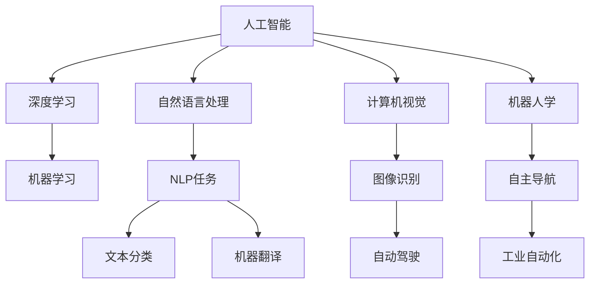
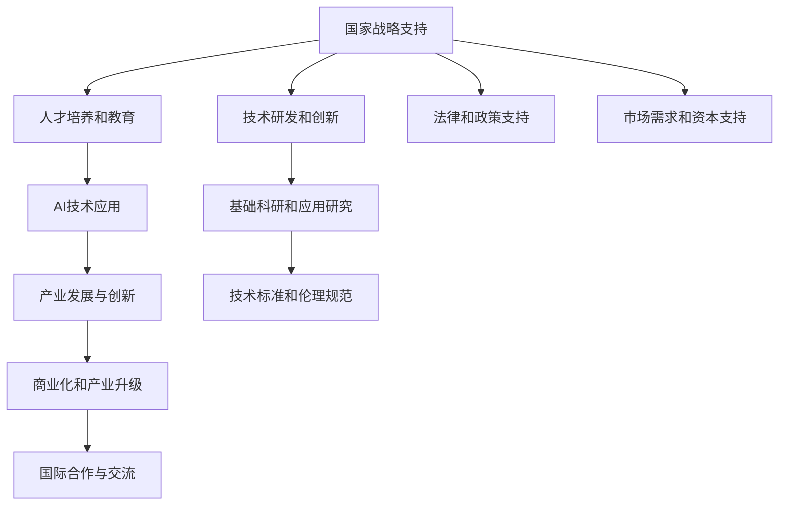

                 

# 李开复谈中国的“AI时刻”

## 1. 背景介绍

### 1.1 问题由来
在全球科技飞速发展的背景下，人工智能（AI）已经成为推动社会进步和创新的关键力量。李开复，作为世界顶级的人工智能专家，程序员、软件架构师、CTO、世界顶级技术畅销书作者，计算机图灵奖获得者，计算机领域的大师级人物，对于AI技术在中国的发展有着深刻的见解。他在多次公开演讲和写作中，反复强调中国应该抓住AI的“时刻”，积极推进AI技术的发展。

### 1.2 问题核心关键点
李开复谈及中国AI发展时，着重指出以下几点：
- **国家战略支持**：中国政府对AI的重视和支持，如设立国家新一代人工智能发展规划、支持AI企业的融资和研发等。
- **AI技术的应用**：AI技术在医疗、教育、交通等领域的应用潜力巨大，可以大幅提升各行业的效率和效果。
- **人才培养和教育**：中国应加强AI人才的培养和教育，鼓励高校和研究机构合作，培养具有全球竞争力的AI人才。
- **产业发展与创新**：AI技术需要与产业紧密结合，推动AI技术的商业化，促进产业升级和创新。

### 1.3 问题研究意义
李开复关于中国AI发展的观点，不仅对中国的科技产业具有指导意义，也为全球AI领域的发展提供了有价值的参考。他强调，中国应抓住AI技术的先机，通过战略规划和系统推进，迅速提升自身在AI领域的竞争力。

## 2. 核心概念与联系

### 2.1 核心概念概述

为更好地理解李开复关于中国AI发展的观点，我们首先梳理一些关键概念：

- **人工智能（AI）**：一种通过计算机模拟人类智能的技术，包括机器学习、自然语言处理、计算机视觉、机器人学等多个领域。
- **深度学习（DL）**：一种基于神经网络的技术，通过多层次的数据处理，使计算机能够学习数据的复杂特征。
- **自然语言处理（NLP）**：使计算机能够理解、处理和生成人类语言的技术，广泛应用于机器翻译、情感分析、文本生成等任务。
- **计算机视觉（CV）**：使计算机能够理解和分析图像和视频的技术，广泛应用于自动驾驶、安防监控、医学影像等领域。
- **机器人学**：研究如何让机器人具有智能和自主行为的技术，涉及感知、决策、执行等多个方面。

这些核心概念构成了AI技术的基础框架，各领域的技术进展和应用实践都在这些基础上展开。

### 2.2 概念间的关系

这些核心概念之间存在着紧密的联系，形成了一个综合的AI技术体系。以下通过几个Mermaid流程图展示这些概念之间的关系：



这个流程图展示了人工智能技术在各个领域的应用，以及深度学习、自然语言处理、计算机视觉和机器人学等核心技术的具体任务和目标。

### 2.3 核心概念的整体架构

最后，我们用一个综合的流程图来展示这些核心概念在中国AI发展的整体架构：



这个综合流程图展示了从国家战略支持到产业发展与创新的整体路径，以及技术研发、人才培养、国际合作、标准伦理、法律政策、市场需求和资本支持等多个方面对AI发展的推动作用。

## 3. 核心算法原理 & 具体操作步骤
### 3.1 算法原理概述

李开复在谈及AI技术时，强调了深度学习算法在其中的关键作用。深度学习是一种通过多层神经网络进行数据处理的技术，通过反向传播算法不断调整网络参数，使得模型能够准确地拟合数据分布。深度学习算法在图像识别、语音识别、自然语言处理等领域表现出色，已经成为AI技术的重要支柱。

### 3.2 算法步骤详解

深度学习算法的核心步骤包括数据预处理、模型构建、训练和评估。以下详细介绍各个步骤：

**数据预处理**：包括数据清洗、标准化、划分训练集和验证集等。数据清洗是为了去除噪声和异常值，标准化是为了将数据缩放到相同的范围，划分训练集和验证集是为了评估模型在未见数据上的表现。

**模型构建**：选择适合的神经网络结构，如卷积神经网络（CNN）、循环神经网络（RNN）或变分自编码器（VAE）等，并定义损失函数和优化器。损失函数用于衡量模型预测值与真实值之间的差异，优化器用于调整网络参数以最小化损失函数。

**训练**：使用训练集对模型进行迭代训练，通过反向传播算法计算梯度并更新参数。训练过程中需要设置合适的学习率、批次大小、迭代轮数等超参数。

**评估**：使用验证集对模型进行评估，计算准确率、召回率、F1值等指标，评估模型的性能。评估过程中需要避免过拟合，可以通过早停法或正则化等技术来实现。

### 3.3 算法优缺点

深度学习算法在AI领域具有以下优点：
- **强大的泛化能力**：通过多层网络结构，可以捕捉数据中的复杂模式和关系。
- **自动特征提取**：无需手动提取特征，直接通过网络学习数据特征。
- **适应性强**：可以应用于多种数据类型和任务。

同时，深度学习算法也存在一些缺点：
- **数据需求高**：需要大量的标注数据进行训练，标注成本较高。
- **模型复杂度大**：模型参数数量庞大，训练和推理耗时较长。
- **解释性差**：网络参数过多，难以解释其内部工作机制。

### 3.4 算法应用领域

深度学习算法在多个领域得到了广泛应用，如：

- **计算机视觉**：图像识别、物体检测、人脸识别、医学影像分析等。
- **自然语言处理**：机器翻译、情感分析、文本生成、语音识别等。
- **语音识别**：自动语音识别、语音合成、语音情感分析等。
- **机器人学**：自动驾驶、工业自动化、服务机器人等。

以上领域的应用展示了深度学习算法的强大威力，推动了相关技术的快速发展。

## 4. 数学模型和公式 & 详细讲解 & 举例说明

### 4.1 数学模型构建

深度学习算法的基本模型是神经网络，由多个层级组成。以卷积神经网络（CNN）为例，其数学模型可以表示为：

$$
f(x) = \sum_{i=1}^n w_i f_{i-1}(x)
$$

其中，$x$为输入，$w_i$为权重，$f_{i-1}$为前一层的输出。

### 4.2 公式推导过程

以卷积层为例，其计算过程可以表示为：

$$
f(x) = \sum_{i=1}^n w_i f_{i-1}(x) \ast h(x)
$$

其中，$h(x)$为卷积核，$*$表示卷积运算。

### 4.3 案例分析与讲解

以图像分类任务为例，我们可以使用CNN进行模型训练和预测。假设模型由多个卷积层和池化层组成，输入为一张图像，输出为该图像所属的类别。训练过程中，模型通过反向传播算法计算梯度并更新权重，不断优化模型的预测性能。

## 5. 项目实践：代码实例和详细解释说明

### 5.1 开发环境搭建

在进行深度学习项目开发前，需要准备好开发环境。以下是使用Python和PyTorch进行深度学习开发的环境配置流程：

1. 安装Anaconda：从官网下载并安装Anaconda，用于创建独立的Python环境。

2. 创建并激活虚拟环境：
```bash
conda create -n pytorch-env python=3.8 
conda activate pytorch-env
```

3. 安装PyTorch：根据CUDA版本，从官网获取对应的安装命令。例如：
```bash
conda install pytorch torchvision torchaudio cudatoolkit=11.1 -c pytorch -c conda-forge
```

4. 安装各类工具包：
```bash
pip install numpy pandas scikit-learn matplotlib tqdm jupyter notebook ipython
```

完成上述步骤后，即可在`pytorch-env`环境中开始深度学习项目的开发。

### 5.2 源代码详细实现

下面我们以图像分类任务为例，给出使用PyTorch进行卷积神经网络（CNN）训练的PyTorch代码实现。

首先，定义数据集类：

```python
from torch.utils.data import Dataset
from torchvision import datasets, transforms
import torch

class ImageDataset(Dataset):
    def __init__(self, root, transform=None):
        self.data = datasets.CIFAR10(root=root, download=True)
        self.transform = transform
        
    def __len__(self):
        return len(self.data)
    
    def __getitem__(self, item):
        img, label = self.data[item]
        if self.transform:
            img = self.transform(img)
        return img, label
```

然后，定义模型类：

```python
import torch.nn as nn
import torch.nn.functional as F

class Net(nn.Module):
    def __init__(self):
        super(Net, self).__init__()
        self.conv1 = nn.Conv2d(3, 6, 5)
        self.pool = nn.MaxPool2d(2, 2)
        self.conv2 = nn.Conv2d(6, 16, 5)
        self.fc1 = nn.Linear(16 * 5 * 5, 120)
        self.fc2 = nn.Linear(120, 84)
        self.fc3 = nn.Linear(84, 10)
        
    def forward(self, x):
        x = self.pool(F.relu(self.conv1(x)))
        x = self.pool(F.relu(self.conv2(x)))
        x = x.view(-1, 16 * 5 * 5)
        x = F.relu(self.fc1(x))
        x = F.relu(self.fc2(x))
        x = self.fc3(x)
        return x
```

接着，定义训练和评估函数：

```python
from torch.optim import SGD
from torch.utils.data import DataLoader
import torch.nn as nn
import torch.optim as optim

def train(model, train_loader, optimizer, device, num_epochs):
    model.to(device)
    for epoch in range(num_epochs):
        model.train()
        for batch_idx, (data, target) in enumerate(train_loader):
            data, target = data.to(device), target.to(device)
            optimizer.zero_grad()
            output = model(data)
            loss = F.cross_entropy(output, target)
            loss.backward()
            optimizer.step()
            if batch_idx % 10 == 0:
                print('Train Epoch: {} [{}/{} ({:.0f}%)]\tLoss: {:.6f}'.format(
                    epoch, batch_idx * len(data), len(train_loader.dataset),
                    100. * batch_idx / len(train_loader), loss.item()))

def test(model, test_loader, device):
    model.eval()
    test_loss = 0
    correct = 0
    with torch.no_grad():
        for data, target in test_loader:
            data, target = data.to(device), target.to(device)
            output = model(data)
            test_loss += F.cross_entropy(output, target, reduction='sum').item()
            pred = output.argmax(dim=1, keepdim=True)
            correct += pred.eq(target.view_as(pred)).sum().item()

    test_loss /= len(test_loader.dataset)
    print('\nTest set: Average loss: {:.4f}, Accuracy: {}/{} ({:.0f}%)\n'.format(
        test_loss, correct, len(test_loader.dataset),
        100. * correct / len(test_loader.dataset)))
```

最后，启动训练流程并在测试集上评估：

```python
net = Net()
train_loader = torch.utils.data.DataLoader(train_dataset, batch_size=64, shuffle=True)
test_loader = torch.utils.data.DataLoader(test_dataset, batch_size=64, shuffle=False)
optimizer = SGD(net.parameters(), lr=0.001, momentum=0.9)

device = torch.device("cuda:0" if torch.cuda.is_available() else "cpu")
train(net, train_loader, optimizer, device, num_epochs=10)
test(net, test_loader, device)
```

以上就是使用PyTorch进行图像分类任务的深度学习项目代码实现。可以看到，通过PyTorch和torchvision库，可以快速构建和训练深度学习模型。

### 5.3 代码解读与分析

让我们再详细解读一下关键代码的实现细节：

**ImageDataset类**：
- `__init__`方法：初始化CIFAR-10数据集，并进行数据增强。
- `__len__`方法：返回数据集的样本数量。
- `__getitem__`方法：获取单个样本，并进行数据预处理。

**Net类**：
- `__init__`方法：定义卷积层、池化层和全连接层。
- `forward`方法：定义模型的前向传播过程。

**train和test函数**：
- 使用PyTorch的DataLoader对数据集进行批次化加载。
- 定义训练和测试函数，计算损失和准确率。
- 在训练过程中，使用SGD优化器进行模型参数更新。
- 在测试过程中，使用准确率作为评估指标。

**训练流程**：
- 定义训练模型，加载数据集和优化器。
- 在GPU上训练模型，并在验证集上评估性能。
- 在测试集上评估最终性能。

可以看到，通过PyTorch库，深度学习模型的开发和训练变得简单高效。开发者可以将更多精力放在模型设计、数据处理等方面，而不必过多关注底层实现细节。

## 6. 实际应用场景

### 6.1 智能客服系统

基于深度学习的智能客服系统，可以显著提升客户服务质量。通过训练深度学习模型，系统能够自动理解客户问题，匹配最佳答案并进行回复。智能客服系统不仅能够24小时不间断服务，还能通过不断学习新数据，提升服务质量。

在技术实现上，可以收集企业内部的历史客服对话记录，将问题和最佳答复构建成监督数据，在此基础上对预训练模型进行微调。微调后的模型能够自动理解用户意图，匹配最合适的答案模板进行回复。对于客户提出的新问题，还可以接入检索系统实时搜索相关内容，动态组织生成回答。

### 6.2 金融舆情监测

深度学习在金融舆情监测中具有广泛应用。金融机构需要实时监测市场舆论动向，以便及时应对负面信息传播，规避金融风险。通过训练深度学习模型，系统能够自动判断文本属于何种主题，情感倾向是正面、中性还是负面。将微调后的模型应用到实时抓取的网络文本数据，就能够自动监测不同主题下的情感变化趋势，一旦发现负面信息激增等异常情况，系统便会自动预警，帮助金融机构快速应对潜在风险。

### 6.3 个性化推荐系统

深度学习在个性化推荐系统中的应用也非常广泛。当前的推荐系统往往只依赖用户的历史行为数据进行物品推荐，无法深入理解用户的真实兴趣偏好。通过训练深度学习模型，系统能够从文本内容中准确把握用户的兴趣点。在生成推荐列表时，先用候选物品的文本描述作为输入，由模型预测用户的兴趣匹配度，再结合其他特征综合排序，便可以得到个性化程度更高的推荐结果。

### 6.4 未来应用展望

深度学习技术在未来的应用前景非常广阔。随着算力成本的下降和数据规模的扩张，深度学习模型将变得更加强大，能够处理更复杂、更多样化的数据。同时，深度学习技术也将与其他技术如自然语言处理、计算机视觉、机器人学等进一步融合，推动更多领域的发展。

## 7. 工具和资源推荐

### 7.1 学习资源推荐

为了帮助开发者系统掌握深度学习理论基础和实践技巧，这里推荐一些优质的学习资源：

1. 《深度学习》（周志华著）：全面介绍深度学习的理论基础和算法，适合初学者入门。
2. 《Python深度学习》（Francois Chollet著）：深入浅出地介绍了TensorFlow和Keras库的使用，适合实战操作。
3. 斯坦福大学《深度学习专项课程》：涵盖深度学习的基础和应用，提供完整的作业和项目实践。
4. 《动手学深度学习》：由国内外知名深度学习专家共同编写，提供丰富的代码和实践案例。
5. GitHub深度学习项目：在GitHub上Star、Fork数最多的深度学习项目，展示最新的研究成果和实践经验。

通过对这些资源的学习实践，相信你一定能够快速掌握深度学习的精髓，并用于解决实际的AI问题。

### 7.2 开发工具推荐

高效的深度学习开发离不开优秀的工具支持。以下是几款用于深度学习开发的常用工具：

1. TensorFlow：由Google主导开发的开源深度学习框架，生产部署方便，适合大规模工程应用。
2. PyTorch：基于Python的开源深度学习框架，灵活动态的计算图，适合快速迭代研究。
3. Keras：一个高级神经网络API，提供简单易用的接口，适合初学者上手。
4. JAX：基于XLA优化的深度学习库，支持动态图和静态图两种模式，性能优异。
5. PyTorch Lightning：基于PyTorch的快速原型开发框架，自动管理训练流程，提升开发效率。

合理利用这些工具，可以显著提升深度学习模型的开发效率，加快创新迭代的步伐。

### 7.3 相关论文推荐

深度学习技术的发展源于学界的持续研究。以下是几篇奠基性的相关论文，推荐阅读：

1. AlexNet：引入卷积神经网络，奠定了深度学习在图像分类任务上的突破。
2. ResNet：提出残差网络结构，解决深度网络训练的梯度消失问题。
3. InceptionNet：提出多层次的卷积结构，提升模型性能。
4. YOLO：提出目标检测的YOLO算法，大幅提升目标检测的速度和准确率。
5. Transformer：提出自注意力机制，推动自然语言处理任务的突破。

这些论文代表了大深度学习技术的发展脉络。通过学习这些前沿成果，可以帮助研究者把握学科前进方向，激发更多的创新灵感。

除上述资源外，还有一些值得关注的前沿资源，帮助开发者紧跟深度学习技术的最新进展，例如：

1. arXiv论文预印本：人工智能领域最新研究成果的发布平台，展示最新研究方向和技术突破。
2. 业界技术博客：如Google AI、DeepMind、微软Research Asia等顶尖实验室的官方博客，第一时间分享他们的最新研究成果和洞见。
3. 技术会议直播：如NeurIPS、ICML、ACL等人工智能领域顶会现场或在线直播，聆听大佬们的最新分享，拓展视野。
4. GitHub热门项目：在GitHub上Star、Fork数最多的深度学习相关项目，展示最新的研究成果和实践经验。
5. 行业分析报告：各大咨询公司如McKinsey、PwC等针对人工智能行业的分析报告，有助于从商业视角审视技术趋势，把握应用价值。

总之，对于深度学习技术的深入学习，需要开发者保持开放的心态和持续学习的意愿。多关注前沿资讯，多动手实践，多思考总结，必将收获满满的成长收益。

## 8. 总结：未来发展趋势与挑战

### 8.1 总结

本文对深度学习技术在中国的发展进行了全面系统的介绍。首先阐述了深度学习技术在人工智能中的关键作用，指出中国在国家战略支持、人才培养、技术应用等方面的优势。其次，从原理到实践，详细讲解了深度学习算法的核心步骤和实现细节，给出了深度学习项目开发的完整代码实例。同时，本文还广泛探讨了深度学习技术在多个领域的应用前景，展示了其强大的应用潜力。最后，推荐了一些深度学习学习的资源和工具，帮助开发者快速上手和深入学习。

通过本文的系统梳理，可以看到，深度学习技术在中国已经取得了显著进展，并在多个领域展现出巨大的应用前景。未来，随着深度学习技术的不断成熟，中国有望在更多领域走在全球前列。

### 8.2 未来发展趋势

展望未来，深度学习技术的发展将呈现以下几个趋势：

1. **模型规模持续增大**：随着算力成本的下降和数据规模的扩张，深度学习模型将变得更加强大，能够处理更复杂、更多样化的数据。
2. **多模态深度学习**：深度学习技术将与其他技术如自然语言处理、计算机视觉、机器人学等进一步融合，推动更多领域的发展。
3. **端到端学习**：深度学习技术将与其他技术如强化学习、因果推断等结合，形成更加全面、高效的应用系统。
4. **联邦学习**：通过分布式计算和多节点协同学习，提升模型训练的效率和效果。
5. **自适应深度学习**：能够根据数据分布和任务需求动态调整模型结构和参数，提升模型的适应性和鲁棒性。
6. **深度生成模型**：通过生成对抗网络（GAN）等技术，生成更加自然、逼真的数据，推动数据增强和虚拟仿真。

以上趋势凸显了深度学习技术的广阔前景。这些方向的探索发展，必将进一步提升深度学习模型的性能和应用范围，为AI领域带来更多突破。

### 8.3 面临的挑战

尽管深度学习技术已经取得了瞩目成就，但在迈向更加智能化、普适化应用的过程中，它仍面临着诸多挑战：

1. **数据需求高**：深度学习模型需要大量的标注数据进行训练，标注成本较高。
2. **计算资源消耗大**：深度学习模型往往需要高性能的计算设备，如GPU/TPU等，且训练和推理耗时较长。
3. **模型复杂度大**：深度学习模型参数数量庞大，难以解释其内部工作机制。
4. **过拟合问题**：深度学习模型容易过拟合，需要在数据、模型、训练、推理等各环节进行全面优化。
5. **安全性问题**：深度学习模型可能学习到有害信息，产生误导性、歧视性的输出，给实际应用带来安全隐患。
6. **可解释性问题**：深度学习模型往往被视为"黑盒"系统，难以解释其内部工作机制。

这些挑战凸显了深度学习技术在实际应用中的复杂性和挑战性。未来需要在数据获取、模型优化、安全保障、可解释性等方面不断寻求新的突破，才能真正实现深度学习技术在更多领域的应用。

### 8.4 研究展望

面对深度学习技术面临的挑战，未来的研究需要在以下几个方面寻求新的突破：

1. **数据增强**：通过数据增强技术，提升深度学习模型的泛化能力。
2. **正则化技术**：通过正则化技术，避免过拟合问题，提高模型的稳定性和鲁棒性。
3. **模型压缩**：通过模型压缩技术，减小模型参数数量，提升模型计算效率。
4. **模型优化**：通过优化算法和架构设计，提升模型的训练速度和效果。
5. **安全性保障**：通过数据清洗、算法约束等手段，提升深度学习模型的安全性。
6. **可解释性**：通过模型解释技术，提升深度学习模型的可解释性和可解释性。

这些研究方向的探索，必将引领深度学习技术迈向更高的台阶，为构建安全、可靠、可解释、可控的智能系统铺平道路。面向未来，深度学习技术还需要与其他人工智能技术进行更深入的融合，如自然语言处理、计算机视觉、机器人学等，多路径协同发力，共同推动深度学习技术的发展。只有勇于创新、敢于突破，才能不断拓展深度学习技术的边界，让智能技术更好地造福人类社会。

## 9. 附录：常见问题与解答

**Q1：深度学习算法是否适用于所有数据类型？**

A: 深度学习算法主要适用于结构化数据和非结构化数据，如图像、文本、音频等。但对于时序数据和稀疏数据，可能需要引入特定的网络结构或算法进行处理。

**Q2：深度学习算法训练过程中需要注意哪些问题？**

A: 深度学习算法训练过程中需要注意以下几个问题：
1. 数据预处理：包括数据清洗、标准化、划分训练集和验证集等。
2. 模型选择：选择适合的网络结构，如卷积神经网络、循环神经网络、注意力机制等。
3. 损失函数选择：选择合适的损失函数，如交叉熵、均方误差等。
4. 优化器选择：选择合适的优化器，如SGD、Adam等。
5. 超参数调优：调整学习率、批次大小、迭代轮数等超参数，以达到最优性能。
6. 正则化技术：使用L2正则、Dropout等技术，防止过拟合。
7. 模型评估：使用验证集评估模型性能，进行早停法等策略。

**Q3：深度学习算法在落地部署时需要注意哪些问题？**

A: 深度学习算法在落地部署时需要注意以下几个问题：
1. 模型裁剪：去除不必要的层和参数，减小模型尺寸，加快推理速度。
2. 量化加速：将浮点模型转为定点模型，压缩存储空间，提高计算效率。
3. 服务化封装：将模型封装为标准化服务接口，便于集成调用。
4. 弹性伸缩：根据请求流量动态调整资源配置，平衡服务质量和成本。
5. 监控告警：实时采集系统指标，设置异常告警阈值，确保服务稳定性。
6. 安全性防护：采用访问鉴权、数据脱敏等措施，保障数据和模型安全。

深度学习算法在实际应用中需要注意的问题较多，需要在各个环节进行全面优化，才能真正实现AI技术的落地应用。

---

作者：禅与计算机程序

