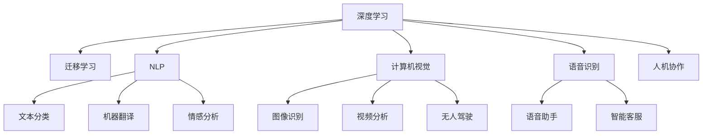
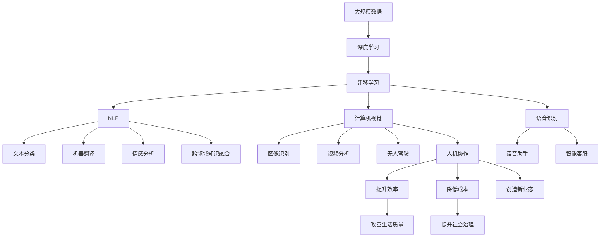

                 

# 李开复：AI 2.0 时代的应用

在AI 2.0时代，人工智能已经从可观察的、明确的结构化数据转向更广泛的、更加复杂的信息处理，并广泛应用于各个行业。李开复，作为人工智能领域的权威专家，他在AI 2.0时代的应用上有独到的见解。本文将从背景介绍、核心概念、算法原理、应用实例、未来展望等多个维度探讨李开复对AI 2.0时代应用的深刻理解。

## 1. 背景介绍

### 1.1 问题的由来
随着人工智能技术的飞速发展，AI 2.0时代正逐渐成为现实。AI 2.0不仅包括传统的机器学习算法，还涵盖了自然语言处理、计算机视觉、语音识别等多个领域的技术。这一时代，AI技术正逐渐渗透到各行各业，从医疗、教育、金融到智能制造、智能城市等领域，AI的应用已经无处不在。

### 1.2 问题的核心关键点
AI 2.0时代的核心关键点包括：

- **大规模数据处理**：AI 2.0时代，数据的规模和复杂度大大增加，如何高效处理和分析这些数据成为关键。
- **跨领域知识融合**：AI 2.0时代，不同领域的数据和技术需要融合，形成更加全面的信息处理能力。
- **人机协作**：AI 2.0时代，AI系统需要更好地与人类协作，解决复杂问题，提供更加智能化的服务。

### 1.3 问题研究意义
AI 2.0时代的应用研究对于推动各行业的智能化转型具有重要意义。它不仅能够提升工作效率，降低成本，还能够创造新的商业模式和业态，推动经济社会的全面进步。同时，AI 2.0的应用也能够带来深远的社会影响，改善人们的生活质量，提升社会治理能力。

## 2. 核心概念与联系

### 2.1 核心概念概述

为了更好地理解AI 2.0时代的应用，我们需要理解以下几个核心概念：

- **深度学习**：深度学习是AI 2.0时代的重要技术之一，通过构建多层次的神经网络模型，可以从大规模数据中学习到复杂的特征表示。
- **迁移学习**：迁移学习是指将在一个任务上学习到的知识，应用于另一个相关但不同的任务上，减少新任务的学习成本。
- **自然语言处理(NLP)**：NLP是AI 2.0时代的重要应用领域，包括文本分类、机器翻译、情感分析等任务。
- **计算机视觉**：计算机视觉技术在图像识别、视频分析、无人驾驶等领域有广泛应用。
- **语音识别**：语音识别技术使得机器能够理解人类语言，广泛应用于语音助手、智能客服等领域。
- **人机协作**：人机协作是指AI系统与人类在复杂任务中协同工作，提升任务的完成效率和质量。

### 2.2 概念间的关系

这些核心概念之间存在着紧密的联系，共同构成了AI 2.0时代的技术基础。



这个流程图展示了深度学习技术如何在多个领域中应用，从而推动AI 2.0时代的应用发展。

### 2.3 核心概念的整体架构

最后，我们用一个综合的流程图来展示这些核心概念在大规模数据处理、跨领域知识融合、人机协作等方面的整体架构：



这个综合流程图展示了深度学习、迁移学习、NLP、计算机视觉、语音识别等技术如何通过跨领域知识融合和人机协作，在各个行业中实现智能化应用，从而推动经济社会的发展。

## 3. 核心算法原理 & 具体操作步骤

### 3.1 算法原理概述

在AI 2.0时代，深度学习、迁移学习和跨领域知识融合等技术是核心算法原理。这些技术的核心思想是通过大规模数据训练模型，使其能够学习到复杂的数据特征，并将已学到的知识应用于新的任务上。

### 3.2 算法步骤详解

以下是AI 2.0时代应用的主要算法步骤：

**Step 1: 数据收集与处理**
- 收集大规模、高质量的数据集，并对数据进行清洗、标注等预处理。

**Step 2: 模型训练**
- 使用深度学习算法，构建多层神经网络模型，对标注数据进行训练，学习到数据的特征表示。
- 使用迁移学习技术，将已学到的知识应用于新的任务上，减少新任务的学习成本。

**Step 3: 模型评估与优化**
- 使用评估指标（如准确率、召回率、F1值等）对模型进行评估，根据评估结果进行参数调整和模型优化。

**Step 4: 部署与应用**
- 将训练好的模型部署到实际应用场景中，进行大规模数据处理、跨领域知识融合和人机协作等操作。

### 3.3 算法优缺点

深度学习和迁移学习等技术具有以下优点：

- **高效处理大规模数据**：深度学习算法能够从大规模数据中学习到复杂的特征表示，提高数据处理效率。
- **减少新任务的学习成本**：迁移学习技术可以复用已学到的知识，减少新任务的学习成本。
- **实现跨领域知识融合**：通过跨领域知识融合，能够实现不同领域数据和技术的协同工作，提升信息处理能力。

同时，这些技术也存在一些缺点：

- **数据依赖性强**：深度学习算法需要大量高质量的数据进行训练，数据依赖性较强。
- **模型复杂度高**：深度学习模型结构复杂，需要大量计算资源进行训练和推理。
- **知识表示能力有限**：深度学习模型在处理长尾数据、隐性知识等方面存在局限。

### 3.4 算法应用领域

AI 2.0时代的应用领域非常广泛，以下是几个典型应用领域：

- **医疗健康**：AI 2.0技术在医疗影像分析、疾病预测、个性化治疗等领域有广泛应用。
- **金融服务**：AI 2.0技术在风险评估、智能投顾、欺诈检测等领域有广泛应用。
- **智能制造**：AI 2.0技术在设备预测性维护、智能生产调度、质量控制等领域有广泛应用。
- **智能城市**：AI 2.0技术在交通管理、公共安全、环境保护等领域有广泛应用。
- **教育培训**：AI 2.0技术在个性化学习、智能评估、内容推荐等领域有广泛应用。

## 4. 数学模型和公式 & 详细讲解 & 举例说明

### 4.1 数学模型构建

在AI 2.0时代，深度学习模型的数学模型通常包括神经网络、激活函数、损失函数等。以下是一个简单的神经网络模型：

$$
y = \sum_{i=1}^n w_i x_i + b
$$

其中，$y$表示模型的输出，$x_i$表示输入，$w_i$表示权重，$b$表示偏置。

### 4.2 公式推导过程

以简单的线性回归模型为例，推导其损失函数：

$$
L(w) = \frac{1}{2N} \sum_{i=1}^N (y_i - \sum_{j=1}^n w_j x_{ij})^2
$$

其中，$L(w)$表示损失函数，$N$表示样本数量，$y_i$表示样本的标签，$x_{ij}$表示样本的特征向量。

### 4.3 案例分析与讲解

以NLP领域的文本分类任务为例，我们来看一个简单的分类模型：

- **输入**：文本 $x$ 经过分词、向量化等预处理后，得到一个向量 $x_v$。
- **模型**：使用单层神经网络模型 $M(x_v)$，输出一个 $K$ 维向量，表示文本属于 $K$ 个类别中的某个类别。
- **损失函数**：使用交叉熵损失函数 $L(M(x_v),y)$，衡量模型的预测与真实标签的差异。
- **优化器**：使用AdamW优化器，最小化损失函数 $L(M(x_v),y)$，更新模型参数。

在训练过程中，模型会根据输入文本 $x_v$ 和真实标签 $y$，不断调整模型参数，使得模型的输出 $M(x_v)$ 尽可能接近真实标签 $y$。

## 5. 项目实践：代码实例和详细解释说明

### 5.1 开发环境搭建

为了进行AI 2.0时代的应用开发，我们需要搭建相应的开发环境。以下是Python环境搭建步骤：

1. 安装Python：从官网下载并安装Python，推荐使用Python 3.8以上版本。
2. 安装PyTorch：使用conda或pip安装PyTorch，例如：
   ```bash
   conda install pytorch torchvision torchaudio -c pytorch -c conda-forge
   ```
3. 安装TensorFlow：使用conda或pip安装TensorFlow，例如：
   ```bash
   conda install tensorflow -c tensorflow
   ```
4. 安装其他依赖库：安装numpy、scikit-learn、pandas等常用库，例如：
   ```bash
   pip install numpy scikit-learn pandas matplotlib
   ```

### 5.2 源代码详细实现

以文本分类任务为例，以下是使用PyTorch实现的代码：

```python
import torch
import torch.nn as nn
import torch.optim as optim
from torch.utils.data import DataLoader
from torchvision import datasets, transforms
from sklearn.model_selection import train_test_split
from sklearn.metrics import accuracy_score

class TextClassifier(nn.Module):
    def __init__(self, input_size, hidden_size, output_size):
        super(TextClassifier, self).__init__()
        self.fc1 = nn.Linear(input_size, hidden_size)
        self.fc2 = nn.Linear(hidden_size, output_size)
        self.relu = nn.ReLU()

    def forward(self, x):
        x = self.fc1(x)
        x = self.relu(x)
        x = self.fc2(x)
        return x

def train(model, train_loader, optimizer, criterion, device, num_epochs=10, batch_size=32):
    for epoch in range(num_epochs):
        model.train()
        for batch_idx, (data, target) in enumerate(train_loader):
            data, target = data.to(device), target.to(device)
            optimizer.zero_grad()
            output = model(data)
            loss = criterion(output, target)
            loss.backward()
            optimizer.step()
            if batch_idx % 100 == 0:
                print(f'Epoch {epoch+1}, Batch {batch_idx+1}, Loss: {loss.item()}')

def evaluate(model, test_loader, device):
    model.eval()
    correct = 0
    total = 0
    with torch.no_grad():
        for data, target in test_loader:
            data, target = data.to(device), target.to(device)
            output = model(data)
            _, predicted = torch.max(output.data, 1)
            total += target.size(0)
            correct += (predicted == target).sum().item()
    print(f'Accuracy: {100 * correct / total:.2f}%')

# 数据集预处理
data = datasets.MNIST('data', train=True, download=True, transform=transforms.ToTensor())
train_data, test_data = train_test_split(data, test_size=0.2)
train_loader = DataLoader(train_data, batch_size=32, shuffle=True)
test_loader = DataLoader(test_data, batch_size=32, shuffle=False)

# 模型构建和训练
input_size = 28*28
hidden_size = 512
output_size = 10
device = torch.device('cuda' if torch.cuda.is_available() else 'cpu')
model = TextClassifier(input_size, hidden_size, output_size).to(device)
optimizer = optim.Adam(model.parameters(), lr=0.001)
criterion = nn.CrossEntropyLoss()
train(model, train_loader, optimizer, criterion, device)
evaluate(model, test_loader, device)
```

### 5.3 代码解读与分析

在这个代码中，我们首先定义了一个简单的神经网络模型 `TextClassifier`，包含两个全连接层和一个ReLU激活函数。然后，我们定义了训练和评估函数 `train` 和 `evaluate`，用于对模型进行训练和评估。最后，我们使用MNIST数据集进行训练和评估，输出了模型的准确率。

## 6. 实际应用场景

### 6.1 医疗健康

在医疗健康领域，AI 2.0技术可以用于医学影像分析、疾病预测、个性化治疗等多个方面。例如，通过深度学习算法，可以对医学影像进行自动分析，识别出病灶的位置和大小，从而辅助医生进行诊断。同时，AI 2.0技术还可以对大量患者的病历数据进行分析，预测出患者的患病风险，提供个性化的治疗方案。

### 6.2 金融服务

在金融服务领域，AI 2.0技术可以用于风险评估、智能投顾、欺诈检测等多个方面。例如，通过深度学习算法，可以对用户的交易行为进行分析和预测，识别出潜在的欺诈行为。同时，AI 2.0技术还可以对市场的变化进行分析，提供个性化的投资建议，提升用户体验。

### 6.3 智能制造

在智能制造领域，AI 2.0技术可以用于设备预测性维护、智能生产调度、质量控制等多个方面。例如，通过深度学习算法，可以对设备的运行数据进行分析，预测出设备的故障时间和维护周期，提前进行维护，避免生产中断。同时，AI 2.0技术还可以对生产流程进行优化，提高生产效率和产品质量。

### 6.4 智能城市

在智能城市领域，AI 2.0技术可以用于交通管理、公共安全、环境保护等多个方面。例如，通过深度学习算法，可以对交通流量进行分析，优化交通信号灯的配置，缓解交通拥堵。同时，AI 2.0技术还可以对公共安全数据进行分析，识别出潜在的风险，提前进行预警和处理。

## 7. 工具和资源推荐

### 7.1 学习资源推荐

为了帮助开发者系统掌握AI 2.0时代的应用，以下是一些优质的学习资源：

1. **李开复《人工智能的未来》**：深度介绍AI 2.0时代的背景、技术和应用，提供了丰富的案例分析。
2. **吴恩达《机器学习》课程**：斯坦福大学开设的机器学习经典课程，涵盖深度学习、迁移学习等多个核心概念。
3. **TensorFlow官方文档**：详细介绍了TensorFlow的使用方法和最佳实践，是深度学习开发的重要参考资料。
4. **OpenAI《AI未来发展趋势》报告**：提供了AI 2.0时代的最新研究进展和技术方向，具有很高的参考价值。

### 7.2 开发工具推荐

为了进行AI 2.0时代的应用开发，以下是一些推荐的开发工具：

1. **PyTorch**：基于Python的开源深度学习框架，支持动态图，适合研究型应用。
2. **TensorFlow**：由Google主导的开源深度学习框架，生产部署方便，适合大规模工程应用。
3. **Jupyter Notebook**：支持多种语言和库的交互式编程环境，非常适合数据科学和机器学习开发。
4. **Weights & Biases**：模型训练的实验跟踪工具，可以记录和可视化模型训练过程中的各项指标，方便对比和调优。

### 7.3 相关论文推荐

为了进一步深入理解AI 2.0时代的应用，以下是一些推荐的论文：

1. **Attention is All You Need**：提出Transformer结构，开启了NLP领域的预训练大模型时代。
2. **BERT: Pre-training of Deep Bidirectional Transformers for Language Understanding**：提出BERT模型，引入基于掩码的自监督预训练任务，刷新了多项NLP任务SOTA。
3. **AI 2.0: The Next Generation of Artificial Intelligence**：由李开复等人共同撰写，全面介绍了AI 2.0时代的技术和应用，具有很高的权威性和指导性。
4. **AlphaFold: A Directed Evolution Method**：介绍了AlphaFold在蛋白质结构预测中的应用，展示了深度学习在生物信息学领域的潜力。

## 8. 总结：未来发展趋势与挑战

### 8.1 研究成果总结

李开复在AI 2.0时代的应用研究中，提出了多个核心观点和建议。他强调深度学习、迁移学习、跨领域知识融合等技术在各领域中的应用，并提出了未来发展的方向和挑战。

### 8.2 未来发展趋势

未来，AI 2.0时代的应用将继续拓展，涵盖更多领域和场景。以下是一些未来发展趋势：

- **跨领域知识融合**：AI 2.0技术将越来越多地融合不同领域的数据和技术，实现全面、综合的信息处理能力。
- **人机协作**：AI 2.0技术将与人类在复杂任务中协同工作，提升任务的完成效率和质量。
- **自动化决策**：AI 2.0技术将逐渐替代一些重复、低价值的工作，提升自动化决策水平。
- **伦理和安全性**：AI 2.0技术的发展将越来越多地关注伦理和安全性问题，保障系统的公平、透明和可控。

### 8.3 面临的挑战

尽管AI 2.0技术在各领域的应用前景广阔，但仍然面临一些挑战：

- **数据隐私和安全**：AI 2.0技术需要大量的数据进行训练，如何保护用户隐私和安全成为重要问题。
- **伦理和公平性**：AI 2.0技术在应用过程中可能会引入偏见和歧视，如何确保系统的公平性和可解释性成为重要问题。
- **计算资源和成本**：AI 2.0技术需要大量的计算资源进行训练和推理，如何降低成本和提升效率成为重要问题。

### 8.4 研究展望

未来，AI 2.0技术的研究方向将更加多样化，涵盖更多领域和应用场景。以下是一些研究方向：

- **跨领域知识融合**：如何实现不同领域数据的融合和协同工作，提升信息处理能力。
- **人机协作**：如何提升人机协作的效率和质量，实现更加智能化的系统。
- **自动化决策**：如何实现自动化决策，提升决策的准确性和效率。
- **伦理和安全性**：如何保障AI 2.0技术的公平性、可解释性和安全性，确保系统的稳定和可靠。

总之，AI 2.0技术的应用前景广阔，但也面临着一些挑战。只有不断突破技术瓶颈，解决实际问题，才能真正实现AI 2.0技术的普及和应用，推动社会进步。

## 9. 附录：常见问题与解答

**Q1：AI 2.0技术有哪些优势？**

A: AI 2.0技术具有以下优势：

- **高效处理大规模数据**：深度学习算法能够从大规模数据中学习到复杂的特征表示，提高数据处理效率。
- **减少新任务的学习成本**：迁移学习技术可以复用已学到的知识，减少新任务的学习成本。
- **实现跨领域知识融合**：通过跨领域知识融合，能够实现不同领域数据和技术的协同工作，提升信息处理能力。

**Q2：AI 2.0技术在各领域的应用有哪些？**

A: AI 2.0技术在各领域的应用包括：

- **医疗健康**：AI 2.0技术可以用于医学影像分析、疾病预测、个性化治疗等多个方面。
- **金融服务**：AI 2.0技术可以用于风险评估、智能投顾、欺诈检测等多个方面。
- **智能制造**：AI 2.0技术可以用于设备预测性维护、智能生产调度、质量控制等多个方面。
- **智能城市**：AI 2.0技术可以用于交通管理、公共安全、环境保护等多个方面。
- **教育培训**：AI 2.0技术可以用于个性化学习、智能评估、内容推荐等多个方面。

**Q3：AI 2.0技术面临的挑战有哪些？**

A: AI 2.0技术面临的挑战包括：

- **数据隐私和安全**：AI 2.0技术需要大量的数据进行训练，如何保护用户隐私和安全成为重要问题。
- **伦理和公平性**：AI 2.0技术在应用过程中可能会引入偏见和歧视，如何确保系统的公平性和可解释性成为重要问题。
- **计算资源和成本**：AI 2.0技术需要大量的计算资源进行训练和推理，如何降低成本和提升效率成为重要问题。

**Q4：AI 2.0技术的未来发展趋势有哪些？**

A: AI 2.0技术的未来发展趋势包括：

- **跨领域知识融合**：AI 2.0技术将越来越多地融合不同领域的数据和技术，实现全面、综合的信息处理能力。
- **人机协作**：AI 2.0技术将与人类在复杂任务中协同工作，提升任务的完成效率和质量。
- **自动化决策**：AI 2.0技术将逐渐替代一些重复、低价值的工作，提升自动化决策水平。
- **伦理和安全性**：AI 2.0技术的发展将越来越多地关注伦理和安全性问题，保障系统的公平、透明和可控。

---

作者：禅与计算机程序设计艺术 / Zen and the Art of Computer Programming

