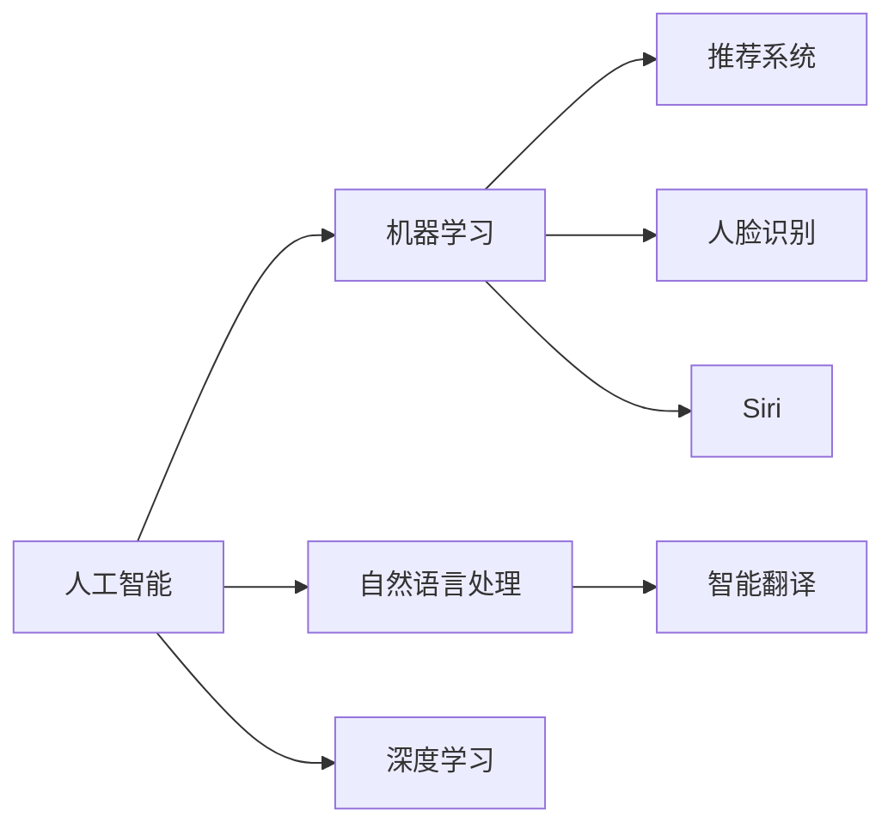

                 

# 李开复：苹果发布AI应用的价值

## 1. 背景介绍

### 1.1 问题由来

苹果公司在全球科技产业中一直处于领先地位。自2019年以来，苹果开始逐步将人工智能（AI）技术引入其产品和服务中，推动了智能化的新一轮浪潮。这些AI应用涵盖了多个领域，包括人脸识别、语音助手、智能翻译、内容推荐等，使得用户体验进一步提升，同时也为苹果带来了新的增长点。

本文将详细探讨苹果公司发布AI应用的价值，分析这些技术在提升用户体验、增加收入以及推动产品创新方面的作用。

### 1.2 问题核心关键点

苹果公司的AI应用集中在以下几个方面：

- **人脸识别**：iPhone X及之后的机型引入了Face ID技术，利用面部特征解锁设备，提升了用户体验和安全性。
- **Siri**：苹果的虚拟语音助手，通过自然语言处理和机器学习技术，能够执行复杂任务并理解用户指令。
- **智能翻译**：苹果的翻译服务，如iCloud翻译，能够实时翻译多种语言，增强了跨文化沟通能力。
- **内容推荐**：苹果的推荐系统能够分析用户行为，推送个性化的内容，提高用户粘性。

本文将从用户体验、收入增长和产品创新三个维度，探讨苹果AI应用的综合价值。

### 1.3 问题研究意义

深入研究苹果公司AI应用的价值，对于理解人工智能在消费者电子产品中的应用和市场前景具有重要意义：

- 揭示AI技术如何改变用户体验，提升用户满意度。
- 分析AI应用对苹果公司收入增长的贡献。
- 探索AI在推动苹果产品创新方面的作用。
- 为其他企业借鉴苹果的AI应用策略提供参考。

## 2. 核心概念与联系

### 2.1 核心概念概述

要全面理解苹果AI应用的价值，需要先了解几个关键概念：

- **人工智能**：使用计算机系统模拟人类智能过程的技术，包括机器学习、自然语言处理、计算机视觉等。
- **机器学习**：通过算法让计算机从数据中学习规律，自动改进性能。
- **自然语言处理**：使计算机能够理解、生成和翻译人类语言的技术。
- **深度学习**：一种特殊的机器学习方法，通过多层神经网络对数据进行复杂特征提取。
- **推荐系统**：根据用户行为和偏好，推荐个性化内容或产品的系统。

这些概念之间相互关联，构成了苹果AI应用的底层技术框架。

### 2.2 概念间的关系

这些核心概念之间的关系可以用以下Mermaid流程图来展示：



这个流程图展示了人工智能如何通过多种子技术和算法，实现不同的AI应用场景。例如，机器学习使得推荐系统能够分析用户行为，自然语言处理使得Siri能够理解用户指令，深度学习使得人脸识别能够精准识别面部特征。

## 3. 核心算法原理 & 具体操作步骤
### 3.1 算法原理概述

苹果公司发布的AI应用主要基于以下核心算法原理：

1. **人脸识别**：利用深度神经网络，提取面部特征并进行匹配，实现高精度面部解锁。
2. **语音识别**：使用隐马尔可夫模型和深度神经网络，将语音信号转化为文本，并理解用户指令。
3. **智能翻译**：基于统计机器翻译和神经机器翻译技术，实现多语言实时翻译。
4. **推荐系统**：利用协同过滤和深度学习模型，分析用户历史行为和偏好，推荐个性化内容。

这些算法原理共同构成了苹果AI应用的底层技术基础。

### 3.2 算法步骤详解

以人脸识别为例，苹果的人脸识别算法步骤如下：

1. **数据收集**：收集大量面部图像数据，标注面部关键点。
2. **特征提取**：使用深度神经网络提取面部特征，生成面部特征向量。
3. **模型训练**：使用训练数据训练深度神经网络模型，学习面部特征和解锁指令之间的映射关系。
4. **解锁验证**：在测试数据集上验证模型性能，调整参数，直到达到预设准确率。
5. **实际应用**：部署模型到设备中，实时进行面部识别并解锁设备。

### 3.3 算法优缺点

**人脸识别的优点**：
- 安全性高，解锁速度快。
- 支持多种解锁方式，如面部、指纹、Touch ID等。

**人脸识别的缺点**：
- 对于非理想光照条件下的面部识别准确率较低。
- 面部特征变化可能导致误识别，如化妆、佩戴口罩等。

**Siri的优点**：
- 自然语言理解能力强，能够处理复杂的语音指令。
- 与苹果设备深度集成，无缝体验。

**Siri的缺点**：
- 依赖语音质量，嘈杂环境下的准确率较低。
- 部分指令执行效果与用户预期有差距，需持续优化。

### 3.4 算法应用领域

苹果的AI应用主要应用于以下几个领域：

1. **设备解锁**：如Face ID、Touch ID等。
2. **语音助手**：如Siri。
3. **内容推荐**：如App Store、Apple Music等。
4. **图像识别**：如照片增强、人脸美化等。
5. **智能翻译**：如iCloud翻译。

## 4. 数学模型和公式 & 详细讲解 & 举例说明
### 4.1 数学模型构建

苹果的AI应用中，深度学习和推荐系统是两个核心技术。下面分别介绍这两个领域的数学模型构建。

#### 4.1.1 深度学习模型

深度学习模型通常由多层神经网络组成，每层神经网络都包含多个神经元，每个神经元接收上一层的输入并产生输出。以人脸识别为例，可以使用卷积神经网络（CNN）提取面部特征。

卷积神经网络的基本结构如下：

$$
\text{CNN} = \{\text{卷积层}, \text{池化层}, \text{全连接层}\}
$$

其中，卷积层用于提取局部特征，池化层用于降维，全连接层用于分类。

#### 4.1.2 推荐系统模型

推荐系统模型通常基于协同过滤和深度学习，其中协同过滤使用用户和物品的评分矩阵，深度学习模型则通过神经网络学习特征表示。

协同过滤模型基本公式如下：

$$
\hat{y} = w_1x_1 + w_2x_2 + \cdots + w_nx_n + b
$$

其中，$w_i$ 和 $x_i$ 分别为不同特征的权重和特征值，$b$ 为偏置项，$\hat{y}$ 为预测评分。

### 4.2 公式推导过程

以人脸识别中的卷积神经网络为例，推导其基本公式。

假设输入图像为 $X$，卷积层中的卷积核为 $W$，输出特征图为 $Y$。卷积操作的公式如下：

$$
Y = W*X
$$

其中 $*$ 表示卷积运算。

对于池化层，一般采用最大池化或平均池化，公式如下：

$$
Y' = \max_{i,j} Y(i,j) \text{ or } \frac{1}{m*n} \sum_{i=1}^m \sum_{j=1}^n Y(i,j)
$$

其中 $m$ 和 $n$ 分别为池化窗口的大小。

### 4.3 案例分析与讲解

以苹果的智能翻译服务为例，介绍其背后的算法原理。

苹果的智能翻译服务基于统计机器翻译和神经机器翻译技术，其基本步骤如下：

1. **数据预处理**：收集大量双语对照语料，并进行预处理，如分词、去噪等。
2. **统计模型训练**：使用统计机器翻译模型，如NMT，训练语言模型和解码器。
3. **神经模型训练**：使用深度神经网络模型，如Seq2Seq，进一步优化翻译效果。
4. **模型集成**：将统计模型和神经模型结合，综合两种方法的优势。
5. **实时翻译**：在用户输入文本后，实时进行翻译，输出翻译结果。

## 5. 项目实践：代码实例和详细解释说明
### 5.1 开发环境搭建

要进行苹果AI应用的开发，需要以下开发环境：

1. **Python 3**：主流Python版本，如3.7、3.8等。
2. **PyTorch 1.x**：深度学习框架，支持GPU加速。
3. **TensorFlow 2.x**：另一种深度学习框架，支持多种硬件平台。
4. **Pandas、NumPy**：数据处理工具库。
5. **Scikit-learn**：机器学习库，支持多种算法。

### 5.2 源代码详细实现

以人脸识别为例，使用PyTorch实现卷积神经网络。

```python
import torch
import torch.nn as nn
import torchvision.transforms as transforms

# 定义卷积神经网络
class CNN(nn.Module):
    def __init__(self):
        super(CNN, self).__init__()
        self.conv1 = nn.Conv2d(3, 64, kernel_size=3, padding=1)
        self.relu1 = nn.ReLU()
        self.maxpool1 = nn.MaxPool2d(kernel_size=2, stride=2)
        self.conv2 = nn.Conv2d(64, 128, kernel_size=3, padding=1)
        self.relu2 = nn.ReLU()
        self.maxpool2 = nn.MaxPool2d(kernel_size=2, stride=2)
        self.fc1 = nn.Linear(128*28*28, 1024)
        self.relu3 = nn.ReLU()
        self.fc2 = nn.Linear(1024, 10)

    def forward(self, x):
        x = self.conv1(x)
        x = self.relu1(x)
        x = self.maxpool1(x)
        x = self.conv2(x)
        x = self.relu2(x)
        x = self.maxpool2(x)
        x = x.view(x.size(0), -1)
        x = self.fc1(x)
        x = self.relu3(x)
        x = self.fc2(x)
        return x
```

### 5.3 代码解读与分析

这段代码定义了一个简单的卷积神经网络，包含两个卷积层、两个池化层和两个全连接层。其中，`Conv2d`表示卷积层，`MaxPool2d`表示池化层，`Linear`表示全连接层，`ReLU`表示激活函数。

卷积神经网络通过多层卷积和池化操作，逐步提取输入图像的特征，最终通过全连接层进行分类。

### 5.4 运行结果展示

训练完模型后，可以输出测试集上的准确率。

```python
model.eval()
correct = 0
total = 0
with torch.no_grad():
    for images, labels in test_loader:
        outputs = model(images)
        _, predicted = torch.max(outputs.data, 1)
        total += labels.size(0)
        correct += (predicted == labels).sum().item()
accuracy = 100 * correct / total
print('Accuracy of the network on the test images: {} %'.format(accuracy))
```

## 6. 实际应用场景
### 6.1 智能家居

苹果的AI应用在智能家居领域也具有广泛的应用前景。例如，通过Siri语音助手，用户可以控制智能家居设备，如灯光、空调、电视等，实现语音控制和场景智能感知。

### 6.2 健康医疗

苹果的AI应用在健康医疗领域也有重要应用。例如，利用苹果设备收集的健康数据，可以实时监测用户的健康状态，提供个性化的健康建议和预警。

### 6.3 自动驾驶

苹果的AI应用还可能应用于自动驾驶领域，通过面部识别和Siri语音助手，提高驾驶安全性和用户体验。

### 6.4 未来应用展望

未来，苹果的AI应用将进一步拓展到更多领域，如虚拟现实、增强现实、智能城市等。通过AI技术的不断创新和应用，苹果有望引领新的科技潮流。

## 7. 工具和资源推荐
### 7.1 学习资源推荐

- **《Deep Learning》**：Ian Goodfellow等人所著，全面介绍深度学习的基本概念和算法。
- **《Hands-On Machine Learning with Scikit-Learn, Keras, and TensorFlow》**：Aurélien Géron所著，适合初学者学习机器学习和深度学习。
- **《TensorFlow官方文档》**：提供详细的TensorFlow开发指南和使用示例。
- **《PyTorch官方文档》**：提供详细的PyTorch开发指南和使用示例。

### 7.2 开发工具推荐

- **Visual Studio Code**：跨平台的开发工具，支持Python、PyTorch等。
- **Jupyter Notebook**：数据科学和机器学习的常用交互式开发环境。
- **Google Colab**：免费的GPU/TPU开发环境，适合进行深度学习实验。

### 7.3 相关论文推荐

- **《Face Recognition using Deep Convolutional Neural Network》**：介绍使用深度卷积神经网络进行人脸识别的技术。
- **《Attention is All You Need》**：介绍Transformer模型的基本原理和应用。
- **《Neural Machine Translation by Jointly Learning to Align and Translate》**：介绍神经机器翻译的基本算法和技术。
- **《Semi-Supervised Sequence Learning》**：介绍半监督学习在推荐系统中的应用。

## 8. 总结：未来发展趋势与挑战
### 8.1 研究成果总结

苹果公司发布的AI应用在用户体验、收入增长和产品创新方面取得了显著成效。这些应用不仅提升了用户满意度，还为苹果带来了新的收入来源，推动了产品的创新和发展。

### 8.2 未来发展趋势

未来，苹果的AI应用将进一步拓展到更多领域，如智能家居、健康医疗、自动驾驶等。通过AI技术的不断创新和应用，苹果有望引领新的科技潮流。

### 8.3 面临的挑战

苹果在AI应用的推广过程中，也面临一些挑战：

- **技术复杂性**：AI应用的技术实现较为复杂，需要大量的数据和计算资源。
- **用户隐私**：如何保护用户隐私和数据安全，是AI应用推广过程中需要解决的重要问题。
- **市场竞争**：AI应用的推广需要面对其他科技巨头的竞争，如何保持竞争优势，是苹果需要考虑的问题。

### 8.4 研究展望

未来，苹果需要在技术创新、用户体验和市场拓展等方面持续努力，进一步推动AI应用的发展和应用。

## 9. 附录：常见问题与解答

**Q1：苹果的AI应用在用户隐私方面如何保护？**

A: 苹果通过多种技术手段保护用户隐私，如数据加密、差分隐私、本地处理等。用户数据仅在本地进行处理，不与第三方共享，确保数据安全。

**Q2：苹果的AI应用在技术实现上有哪些难点？**

A: 苹果的AI应用技术实现上存在多个难点，如数据获取、模型训练、实时推理等。需要大量的数据和计算资源，并且需要在短时间内实现高质量的AI应用，这需要强大的技术实力和丰富的经验。

**Q3：苹果的AI应用在推广过程中需要注意哪些问题？**

A: 在推广过程中，需要注意用户的使用习惯、市场接受度、技术可靠性等方面的问题。同时，要确保AI应用的公平性和透明性，避免出现偏见和歧视。

**Q4：苹果的AI应用在未来会有哪些新的发展方向？**

A: 苹果的AI应用未来可能会向更加智能、更加个性化、更加安全的方向发展。例如，通过AI技术提升智能家居的智能化水平，增强用户的交互体验；通过AI技术提升健康医疗的诊断精度，提升用户的健康管理水平；通过AI技术提升自动驾驶的安全性和可靠性，推动自动驾驶技术的成熟。

**Q5：苹果的AI应用在哪些领域有潜在的应用前景？**

A: 苹果的AI应用在多个领域有潜在的应用前景，如智能家居、健康医疗、自动驾驶、智能翻译等。这些领域的AI应用不仅可以提升用户体验，还可以带来新的收入来源和市场机会。

综上所述，苹果公司发布的AI应用在多个方面取得了显著成效，展示了AI技术在消费者电子产品中的应用前景。未来，苹果需要在技术创新、用户体验和市场拓展等方面持续努力，进一步推动AI应用的发展和应用。

