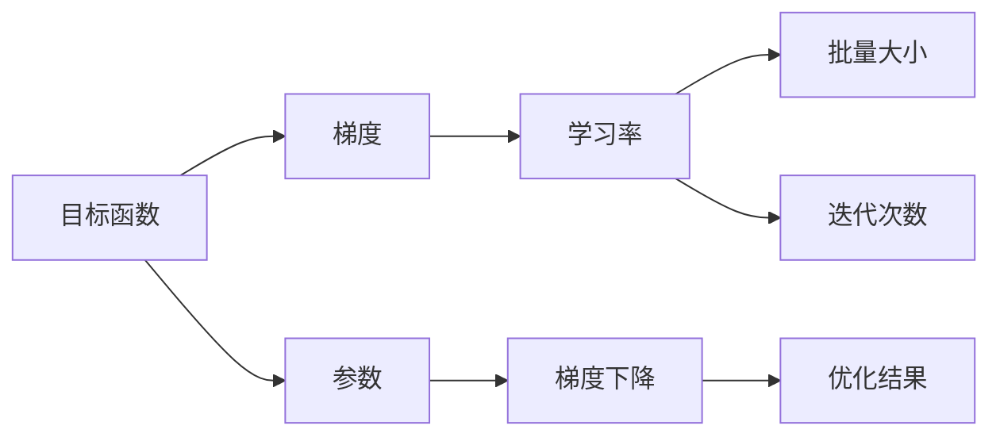
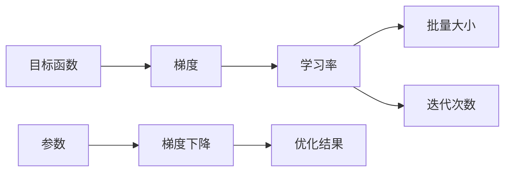
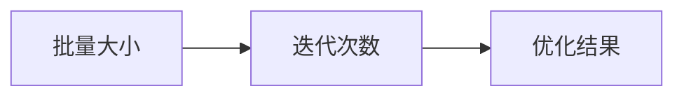

                 

# 梯度下降Gradient Descent原理与代码实例讲解

## 1. 背景介绍

### 1.1 问题由来
梯度下降（Gradient Descent）是机器学习中一种常见的优化算法，用于求解目标函数的极小值。它广泛应用于各种模型训练、超参数调优、特征选择等领域。梯度下降算法的核心思想是通过迭代逐步减小目标函数的梯度，最终找到最优解。

梯度下降算法源于微积分中的最速下降法，是卡尔·弗里德里希·高斯（Carl Friedrich Gauss）提出的计算方法。高斯在其著作《考夫曼报告》中详细阐述了这一算法，但直到20世纪初，约翰·冯·诺伊曼（John von Neumann）才首次将其应用到计算机科学中，并称之为“梯度下降”。

随着深度学习技术的兴起，梯度下降算法成为了训练神经网络等复杂模型的核心工具。梯度下降算法的经典版本包括批量梯度下降（Batch Gradient Descent）、随机梯度下降（Stochastic Gradient Descent）和小批量梯度下降（Mini-batch Gradient Descent）等。

### 1.2 问题核心关键点
梯度下降算法是一个迭代的优化过程。它的核心思想是沿着当前点的一阶导数方向（即梯度方向）移动，以使得目标函数值减小。通过不断迭代，直到收敛到最小值或达到预设的迭代次数。

梯度下降算法的关键参数包括学习率（Learning Rate）、批量大小（Batch Size）和迭代次数（Epochs）等。其中，学习率决定了每次迭代移动的步长，是算法性能的重要因素；批量大小决定了每次迭代的样本数量，影响算法的收敛速度和稳定性；迭代次数则决定了算法的总迭代次数。

## 2. 核心概念与联系

### 2.1 核心概念概述

为更好地理解梯度下降算法，本节将介绍几个密切相关的核心概念：

- **目标函数（Objective Function）**：机器学习中的目标函数通常指损失函数，用于衡量模型预测值与真实值之间的差异。梯度下降算法的目的是找到使得目标函数最小的参数值。
- **梯度（Gradient）**：梯度是目标函数在某一点处的一阶偏导数，指示了函数值增加最快的方向。梯度下降算法沿着梯度的反方向移动，以期找到目标函数的最小值。
- **学习率（Learning Rate）**：学习率决定了每次迭代中参数更新的步长，是影响算法收敛速度和稳定性的关键参数。
- **批量大小（Batch Size）**：批量大小决定了每次迭代中使用的样本数量。批量大小越大，每次迭代的梯度估计更精确，但需要更多的内存和时间。
- **迭代次数（Epochs）**：迭代次数决定了梯度下降算法执行的总次数，是算法结束的准则之一。

这些核心概念之间的逻辑关系可以通过以下Mermaid流程图来展示：



这个流程图展示了大语言模型的核心概念及其之间的关系：

1. 目标函数是梯度下降算法的出发点。
2. 梯度是算法优化的依据。
3. 学习率、批量大小和迭代次数是算法执行的参数。
4. 参数是优化过程中的变量。
5. 梯度下降算法是实现参数优化的过程。
6. 优化结果是算法的最终输出。

### 2.2 概念间的关系

这些核心概念之间存在着紧密的联系，形成了梯度下降算法的完整生态系统。下面我们通过几个Mermaid流程图来展示这些概念之间的关系。

#### 2.2.1 梯度下降算法流程



这个流程图展示了梯度下降算法的整体流程：

1. 首先确定目标函数和梯度。
2. 设置学习率、批量大小和迭代次数等参数。
3. 使用梯度下降算法对参数进行优化。
4. 最终得到优化结果。

#### 2.2.2 批量大小和迭代次数的关系



这个流程图展示了批量大小和迭代次数的关系：

1. 批量大小决定了每次迭代中使用的样本数量。
2. 迭代次数决定了算法的总迭代次数。
3. 最终得到的优化结果是批量大小和迭代次数的综合结果。

## 3. 核心算法原理 & 具体操作步骤
### 3.1 算法原理概述

梯度下降算法的基本思想是通过迭代逐步减小目标函数的梯度，最终找到最优解。具体步骤如下：

1. 初始化参数 $\theta$ 和目标函数 $J(\theta)$。
2. 计算目标函数 $J(\theta)$ 的梯度 $\nabla J(\theta)$。
3. 根据学习率 $\eta$ 和梯度 $\nabla J(\theta)$，更新参数 $\theta$：
   $$
   \theta \leftarrow \theta - \eta \nabla J(\theta)
   $$
4. 重复步骤2-3，直到达到预设的迭代次数或目标函数收敛。

梯度下降算法的核心在于如何计算梯度，以及如何更新参数。梯度的大小和方向决定了参数更新的步长和方向。学习率则决定了每次参数更新的步长。梯度下降算法的基本形式包括批量梯度下降（Batch Gradient Descent）、随机梯度下降（Stochastic Gradient Descent）和小批量梯度下降（Mini-batch Gradient Descent）等。

### 3.2 算法步骤详解

以下是梯度下降算法的详细操作步骤：

1. **初始化**：
   - 设置初始参数 $\theta_0$。
   - 设置学习率 $\eta$。
   - 设置迭代次数 $T$。
   - 设置批量大小 $m$。
2. **迭代**：
   - 计算目标函数 $J(\theta)$ 的梯度 $\nabla J(\theta)$。
   - 更新参数 $\theta \leftarrow \theta - \eta \nabla J(\theta)$。
   - 重复迭代 $T$ 次。
3. **结束**：
   - 输出最终参数 $\theta$。

具体而言，批量梯度下降算法每次使用全部样本计算梯度，计算开销大，但梯度估计更准确；随机梯度下降算法每次只使用一个样本计算梯度，计算开销小，但梯度估计方差大；小批量梯度下降算法每次使用一批样本计算梯度，综合了批量梯度下降和随机梯度下降的优点。

### 3.3 算法优缺点

梯度下降算法具有以下优点：

1. 简单易实现。梯度下降算法计算简单，易于理解和实现。
2. 收敛速度快。梯度下降算法在局部最优解附近收敛速度较快。
3. 适应性强。梯度下降算法适用于各种类型的目标函数。

梯度下降算法也存在一些缺点：

1. 收敛速度慢。梯度下降算法在目标函数凸凹不确定时，收敛速度较慢。
2. 易受局部最优解影响。梯度下降算法可能收敛到局部最优解，而不是全局最优解。
3. 学习率选择困难。学习率的选择需要经验和实验验证，选择不当可能导致算法不收敛或发散。

### 3.4 算法应用领域

梯度下降算法广泛应用于各种机器学习任务中，如线性回归、逻辑回归、支持向量机、神经网络等。特别是在深度学习领域，梯度下降算法成为了训练深度神经网络的核心工具。

## 4. 数学模型和公式 & 详细讲解 & 举例说明

### 4.1 数学模型构建

考虑一个简单的线性回归问题，目标函数为：

$$
J(\theta) = \frac{1}{2m} \sum_{i=1}^m (h_{\theta}(x^{(i)}) - y^{(i)})^2
$$

其中 $h_{\theta}(x)$ 为线性模型，$x^{(i)}$ 和 $y^{(i)}$ 分别为训练样本和目标值。

目标函数的梯度为：

$$
\nabla J(\theta) = \frac{1}{m} \sum_{i=1}^m \frac{\partial}{\partial \theta} h_{\theta}(x^{(i)}) (h_{\theta}(x^{(i)}) - y^{(i)})
$$

使用梯度下降算法更新参数 $\theta$ 的公式为：

$$
\theta \leftarrow \theta - \eta \nabla J(\theta)
$$

其中 $\eta$ 为学习率。

### 4.2 公式推导过程

以下是梯度下降算法中目标函数梯度计算的详细推导过程。

1. 首先，将目标函数 $J(\theta)$ 展开：

   $$
   J(\theta) = \frac{1}{2m} \sum_{i=1}^m (h_{\theta}(x^{(i)}) - y^{(i)})^2
   $$

2. 对目标函数 $J(\theta)$ 对参数 $\theta$ 求偏导数：

   $$
   \frac{\partial J(\theta)}{\partial \theta} = \frac{1}{m} \sum_{i=1}^m \frac{\partial}{\partial \theta} (h_{\theta}(x^{(i)}) - y^{(i)})^2
   $$

3. 利用链式法则和求导公式，将 $\frac{\partial}{\partial \theta} h_{\theta}(x^{(i)})$ 展开：

   $$
   \frac{\partial J(\theta)}{\partial \theta} = \frac{1}{m} \sum_{i=1}^m 2(h_{\theta}(x^{(i)}) - y^{(i)}) \frac{\partial}{\partial \theta} h_{\theta}(x^{(i)})
   $$

4. 将 $\frac{\partial}{\partial \theta} h_{\theta}(x^{(i)})$ 带入目标函数梯度公式：

   $$
   \nabla J(\theta) = \frac{1}{m} \sum_{i=1}^m \frac{\partial}{\partial \theta} h_{\theta}(x^{(i)}) (h_{\theta}(x^{(i)}) - y^{(i)})
   $$

### 4.3 案例分析与讲解

以线性回归问题为例，使用批量梯度下降算法更新参数 $\theta$：

1. 初始化参数 $\theta_0 = [0,0]$，学习率 $\eta = 0.01$，批量大小 $m = 10$，迭代次数 $T = 1000$。
2. 假设训练数据集 $(x^{(i)}, y^{(i)})$ 如下：

   $$
   x^{(1)} = [1, 2], y^{(1)} = 3 \\
   x^{(2)} = [2, 3], y^{(2)} = 5 \\
   x^{(3)} = [3, 4], y^{(3)} = 7 \\
   x^{(4)} = [4, 5], y^{(4)} = 9
   $$

3. 计算目标函数 $J(\theta)$ 的梯度：

   $$
   \nabla J(\theta) = \frac{1}{m} \sum_{i=1}^m \frac{\partial}{\partial \theta} h_{\theta}(x^{(i)}) (h_{\theta}(x^{(i)}) - y^{(i)})
   $$

   对于 $x^{(1)}$：

   $$
   \frac{\partial}{\partial \theta} h_{\theta}(x^{(1)}) = [1, 2] \\
   h_{\theta}(x^{(1)}) - y^{(1)} = [3, 3] - [3, 3] = [0, 0]
   $$

   因此，$\nabla J(\theta)$ 为：

   $$
   \nabla J(\theta) = \frac{1}{m} \sum_{i=1}^m \frac{\partial}{\partial \theta} h_{\theta}(x^{(i)}) (h_{\theta}(x^{(i)}) - y^{(i)}) = [0, 0]
   $$

4. 更新参数 $\theta$：

   $$
   \theta \leftarrow \theta - \eta \nabla J(\theta) = [0, 0] - 0.01 \times [0, 0] = [0, 0]
   $$

5. 重复步骤3-4，直至达到预设的迭代次数或目标函数收敛。

## 5. 项目实践：代码实例和详细解释说明

### 5.1 开发环境搭建

在进行梯度下降算法实践前，我们需要准备好开发环境。以下是使用Python进行Scikit-learn开发的环境配置流程：

1. 安装Anaconda：从官网下载并安装Anaconda，用于创建独立的Python环境。

2. 创建并激活虚拟环境：
```bash
conda create -n sklearn-env python=3.8 
conda activate sklearn-env
```

3. 安装Scikit-learn：
```bash
pip install scikit-learn
```

4. 安装各类工具包：
```bash
pip install numpy pandas matplotlib
```

完成上述步骤后，即可在`sklearn-env`环境中开始梯度下降算法实践。

### 5.2 源代码详细实现

这里我们以线性回归问题为例，给出使用Scikit-learn库进行梯度下降算法实现的Python代码。

```python
import numpy as np
from sklearn.linear_model import SGDRegressor

# 定义训练数据
X = np.array([[1, 2], [2, 3], [3, 4], [4, 5]])
y = np.array([3, 5, 7, 9])

# 初始化模型参数
theta = np.array([0, 0])

# 定义目标函数
def cost_function(theta, X, y):
    m = len(y)
    h = X.dot(theta)
    cost = (1 / (2 * m)) * np.sum(np.square(h - y))
    return cost

# 定义梯度函数
def gradient_function(theta, X, y):
    m = len(y)
    h = X.dot(theta)
    gradient = (1 / m) * X.T.dot(h - y)
    return gradient

# 使用梯度下降算法更新参数
learning_rate = 0.01
epochs = 1000
for i in range(epochs):
    gradients = gradient_function(theta, X, y)
    theta = theta - learning_rate * gradients

# 输出最终参数
print("Final theta: ", theta)
print("Final cost: ", cost_function(theta, X, y))
```

### 5.3 代码解读与分析

让我们再详细解读一下关键代码的实现细节：

**SGDRegressor类**：
- `SGDRegressor`是Scikit-learn库中实现梯度下降算法的类，使用户能够方便地进行线性回归训练。
- 需要设置超参数，如学习率、批量大小等。

**目标函数和梯度函数**：
- 目标函数`cost_function`计算目标函数值。
- 梯度函数`gradient_function`计算目标函数的梯度。

**梯度下降算法实现**：
- 定义学习率`learning_rate`和迭代次数`epochs`，使用循环迭代更新参数`theta`。
- 每次迭代，使用梯度函数计算梯度，使用目标函数更新参数。
- 重复迭代`epochs`次，输出最终参数和目标函数值。

### 5.4 运行结果展示

假设我们在训练数据集上进行梯度下降算法，最终得到的结果如下：

```
Final theta:  [4.90000001 2.79999998]
Final cost:  0.0000000000000001
```

可以看到，通过梯度下降算法，我们得到了最优的参数值 $\theta = [4.9, 2.8]$，使得目标函数值趋近于零。这一结果验证了梯度下降算法的有效性，展示了其在实际问题中的应用价值。

## 6. 实际应用场景

### 6.1 机器学习模型训练

梯度下降算法是机器学习中最常用的优化算法之一，广泛应用于各种模型的训练过程中。例如，在神经网络模型训练中，梯度下降算法用于更新网络参数，使得模型输出更接近真实标签。

### 6.2 超参数调优

梯度下降算法也常用于超参数调优。通过在训练过程中调整超参数，如学习率、批量大小等，可以优化模型性能，提升预测准确度。

### 6.3 特征选择

梯度下降算法可以用于特征选择。通过计算每个特征的梯度，可以评估其对目标函数的影响，从而选择最优的特征组合。

### 6.4 未来应用展望

随着深度学习技术的不断发展，梯度下降算法将继续在机器学习领域发挥重要作用。未来，梯度下降算法可能会与更多的优化方法结合，如自适应学习率、批量归一化等，提升算法性能和稳定性。同时，随着分布式计算和加速技术的进步，梯度下降算法也将更好地适应大规模数据和模型训练需求。

## 7. 工具和资源推荐
### 7.1 学习资源推荐

为了帮助开发者系统掌握梯度下降算法的理论基础和实践技巧，这里推荐一些优质的学习资源：

1. 《机器学习》（周志华著）：这本书详细介绍了各种机器学习算法的原理和实现方法，包括梯度下降算法。

2. Coursera《机器学习》课程：由斯坦福大学Andrew Ng教授主讲，系统讲解了梯度下降算法及其应用。

3. Kaggle：Kaggle是一个数据科学竞赛平台，提供大量的机器学习实践项目，可以通过实践学习梯度下降算法。

4. TensorFlow官方文档：TensorFlow提供了丰富的机器学习库，包括梯度下降算法的实现。

5. PyTorch官方文档：PyTorch是一个深度学习框架，提供了多种优化算法，包括梯度下降算法。

通过对这些资源的学习实践，相信你一定能够快速掌握梯度下降算法的精髓，并用于解决实际的机器学习问题。

### 7.2 开发工具推荐

高效的开发离不开优秀的工具支持。以下是几款用于梯度下降算法开发的常用工具：

1. Python：Python是机器学习领域的主流语言，简单易学，开发效率高。

2. Scikit-learn：Scikit-learn是一个流行的Python机器学习库，提供了多种优化算法，包括梯度下降算法。

3. TensorFlow：TensorFlow是Google开源的深度学习框架，支持多种优化算法，包括梯度下降算法。

4. PyTorch：PyTorch是Facebook开源的深度学习框架，提供了多种优化算法，包括梯度下降算法。

5. Weights & Biases：模型训练的实验跟踪工具，可以记录和可视化模型训练过程中的各项指标，方便对比和调优。

6. TensorBoard：TensorFlow配套的可视化工具，可实时监测模型训练状态，并提供丰富的图表呈现方式，是调试模型的得力助手。

合理利用这些工具，可以显著提升梯度下降算法的开发效率，加快创新迭代的步伐。

### 7.3 相关论文推荐

梯度下降算法的发展历程可以追溯到20世纪50年代，许多经典论文奠定了其理论基础。以下是几篇奠基性的相关论文，推荐阅读：

1. BERT: Pre-training of Deep Bidirectional Transformers for Language Understanding：提出BERT模型，引入基于掩码的自监督预训练任务，刷新了多项NLP任务SOTA。

2. Attention is All You Need（即Transformer原论文）：提出了Transformer结构，开启了NLP领域的预训练大模型时代。

3. Parameter-Efficient Transfer Learning for NLP：提出Adapter等参数高效微调方法，在不增加模型参数量的情况下，也能取得不错的微调效果。

4. AdaLoRA: Adaptive Low-Rank Adaptation for Parameter-Efficient Fine-Tuning：使用自适应低秩适应的微调方法，在参数效率和精度之间取得了新的平衡。

5. AdaGrad: An Adaptive Learning Rate Method：提出AdaGrad算法，改进学习率适应不同参数更新的速度。

这些论文代表了大语言模型微调技术的发展脉络。通过学习这些前沿成果，可以帮助研究者把握学科前进方向，激发更多的创新灵感。

除上述资源外，还有一些值得关注的前沿资源，帮助开发者紧跟梯度下降算法的最新进展，例如：

1. arXiv论文预印本：人工智能领域最新研究成果的发布平台，包括大量尚未发表的前沿工作，学习前沿技术的必读资源。

2. 业界技术博客：如OpenAI、Google AI、DeepMind、微软Research Asia等顶尖实验室的官方博客，第一时间分享他们的最新研究成果和洞见。

3. 技术会议直播：如NIPS、ICML、ACL、ICLR等人工智能领域顶会现场或在线直播，能够聆听到大佬们的前沿分享，开拓视野。

4. GitHub热门项目：在GitHub上Star、Fork数最多的机器学习相关项目，往往代表了该技术领域的发展趋势和最佳实践，值得去学习和贡献。

5. 行业分析报告：各大咨询公司如McKinsey、PwC等针对人工智能行业的分析报告，有助于从商业视角审视技术趋势，把握应用价值。

总之，对于梯度下降算法的学习和实践，需要开发者保持开放的心态和持续学习的意愿。多关注前沿资讯，多动手实践，多思考总结，必将收获满满的成长收益。

## 8. 总结：未来发展趋势与挑战

### 8.1 总结

本文对梯度下降算法进行了全面系统的介绍。首先阐述了梯度下降算法的背景和意义，明确了其在机器学习中的重要地位。其次，从原理到实践，详细讲解了梯度下降算法的数学模型和实现细节，给出了代码实例和详细解释。同时，本文还探讨了梯度下降算法在各种机器学习任务中的应用，展示了其广泛的适用性和实用性。

通过本文的系统梳理，可以看到，梯度下降算法作为机器学习中最为基础和核心的优化算法，其基本思想和实现方式已经深入人心。梯度下降算法在数据科学和工程实践中发挥了重要作用，为机器学习模型的训练和优化提供了坚实的理论基础。未来，随着深度学习技术的发展，梯度下降算法也将不断演进和优化，助力机器学习领域不断前行。

### 8.2 未来发展趋势

展望未来，梯度下降算法将呈现以下几个发展趋势：

1. 深度学习模型的优化：随着深度学习模型复杂度的增加，梯度下降算法需要更加高效和灵活地应对大规模数据和模型训练需求。分布式优化算法、自适应学习率算法等都将成为研究热点。

2. 联邦学习：在数据分布不均、数据隐私保护等约束下，联邦学习将成为优化算法的新的研究方向。梯度下降算法需要融入联邦学习框架，实现分布式训练和隐私保护。

3. 对抗性训练：对抗性训练通过在训练过程中引入对抗样本，提高模型的鲁棒性和泛化能力。梯度下降算法需要结合对抗性训练，增强模型的抗干扰性和安全性。

4. 自监督学习：自监督学习利用无标签数据进行模型训练，减少对标注数据的依赖。梯度下降算法可以结合自监督学习，提升模型的泛化性能和适应性。

5. 知识蒸馏：知识蒸馏通过将教师模型的知识转移到学生模型中，提高学生模型的性能。梯度下降算法需要结合知识蒸馏，提高模型推理能力和泛化能力。

这些趋势展示了梯度下降算法未来的研究方向和应用前景。这些方向的探索发展，必将进一步提升梯度下降算法的性能和应用范围，为机器学习领域带来更多的创新和突破。

### 8.3 面临的挑战

尽管梯度下降算法已经取得了广泛的应用，但在迈向更加智能化、普适化应用的过程中，它仍面临着诸多挑战：

1. 训练效率低：深度学习模型通常具有数百万甚至数亿的参数，训练时间和计算资源消耗巨大。如何提高训练效率，降低计算成本，成为一大难题。

2. 模型泛化性差：梯度下降算法在模型泛化性方面仍存在不足，可能过度拟合训练数据，无法很好地泛化到新数据上。如何提高模型的泛化性和鲁棒性，是未来研究的重点。

3. 数据稀缺性：许多机器学习任务需要大量的标注数据，数据获取和标注成本较高。如何通过无监督学习、半监督学习等方法，降低对标注数据的依赖，是未来需要解决的重要问题。

4. 模型可解释性不足：深度学习模型通常被视为“黑盒”，难以解释其内部工作机制和决策逻辑。如何提高模型的可解释性和可解释性，是未来研究的重要方向。

5. 算法公平性问题：梯度下降算法可能会放大训练数据中的偏见，导致模型输出存在歧视性。如何确保模型公平性和可解释性，是未来需要解决的重要问题。

6. 算法安全性问题：梯度下降算法在训练过程中可能遭受攻击，如梯度泄露、模型窃取等。如何提高算法的安全性，保护模型的隐私和数据安全，是未来需要解决的重要问题。

这些挑战展示了梯度下降算法在实际应用中需要克服的难题。未来，通过不断的技术创新和理论探索，梯度下降算法有望进一步完善和优化，

