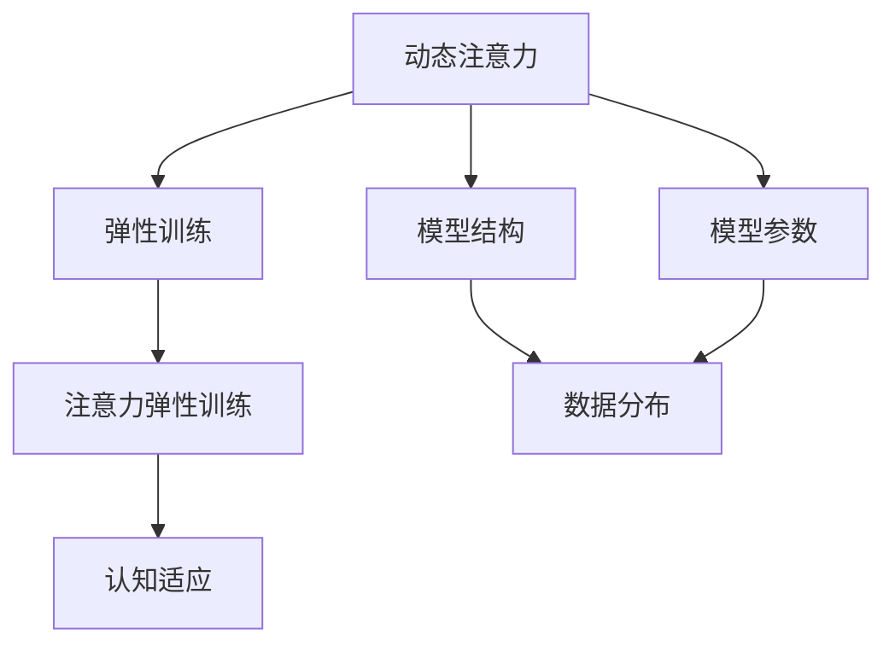
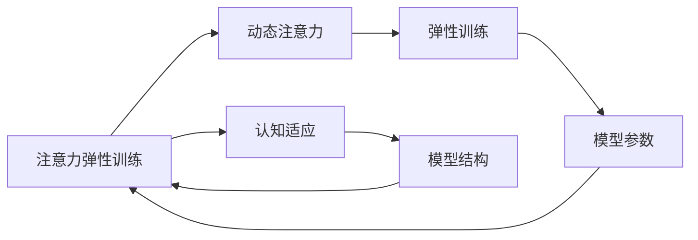
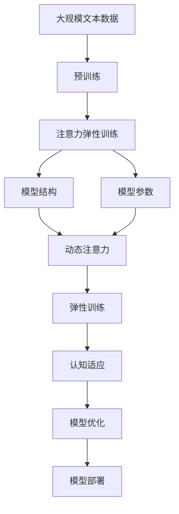

                 

# 注意力弹性训练营教练：AI优化的认知适应项目负责人

> 关键词：注意力弹性训练, 认知适应, AI优化, 项目负责人, 深度学习, 算法原理, 模型训练, 实际应用, 未来展望, 学习资源

## 1. 背景介绍

### 1.1 问题由来
在人工智能（AI）领域，尤其是深度学习和自然语言处理（NLP）领域，训练高效且具有弹性的模型一直是研究的热点。随着数据量的爆炸性增长和计算能力的提升，传统的固定模型结构已经难以满足需求。针对这一问题，注意力弹性训练（Attention Elastic Training, AET）应运而生，通过动态调整模型的注意力机制，提升模型的适应性和灵活性。

### 1.2 问题核心关键点
注意力弹性训练的核心在于通过动态调整模型的注意力机制，使得模型在面对不同类型的数据时，能够自适应地调整关注点，从而提高模型的泛化能力和适应性。其关键点包括：
- 动态注意力机制：通过动态调整模型中的注意力权重，使得模型在训练和推理过程中能够自动调整关注点。
- 弹性训练目标：定义灵活的训练目标，允许模型在训练过程中不断优化自身参数。
- 数据驱动：基于数据分布的变化，动态调整模型结构和参数，提升模型的适应性和泛化能力。

### 1.3 问题研究意义
注意力弹性训练对于提高AI模型的泛化能力和适应性具有重要意义：
1. **提升模型适应性**：通过动态调整模型结构和参数，模型能够在面对不同类型和分布的数据时，具备更强的适应能力。
2. **提高模型泛化能力**：通过弹性训练目标，模型能够更好地适应新数据和新任务，提升泛化性能。
3. **降低模型训练成本**：通过动态调整模型结构和参数，可以更高效地利用数据，减少训练时间和计算资源消耗。
4. **加速模型优化**：通过弹性训练，模型能够在更少的迭代次数下达到最优状态，加快优化速度。
5. **增强模型鲁棒性**：通过弹性训练，模型能够更好地应对数据扰动和异常情况，提高鲁棒性。

## 2. 核心概念与联系

### 2.1 核心概念概述

为了更好地理解注意力弹性训练（AET），我们需要了解一些核心概念：

- **注意力机制（Attention Mechanism）**：注意力机制是一种模拟人类注意力的计算模型，用于在序列数据中动态地选择重要部分进行计算。在深度学习中，注意力机制通常用于RNN、Transformer等模型，以提升模型的表达能力和泛化能力。

- **动态注意力（Dynamic Attention）**：动态注意力是指在模型训练或推理过程中，根据当前输入数据动态调整注意力权重，从而提升模型的灵活性和适应性。

- **弹性训练（Elastic Training）**：弹性训练是一种基于数据分布动态调整模型参数的训练方法，使得模型能够在不同数据分布下具备更好的泛化能力。

- **认知适应（Cognitive Adaptation）**：认知适应是指模型通过自适应地调整注意力机制和参数，提升其在不同任务和数据分布下的认知能力。

这些核心概念之间通过以下Mermaid流程图展示其联系：



这个流程图展示了动态注意力、弹性训练、注意力弹性训练和认知适应之间的关系：

1. **动态注意力**：在模型中引入动态调整注意力机制，使得模型能够根据当前输入数据自动调整关注点。
2. **弹性训练**：基于数据分布动态调整模型参数，提升模型的泛化能力和适应性。
3. **注意力弹性训练**：通过动态调整模型注意力机制和参数，提升模型的认知适应能力。
4. **认知适应**：模型通过自适应调整注意力机制和参数，提升在各种任务和数据分布下的表现。

### 2.2 概念间的关系

这些核心概念之间存在着紧密的联系，形成了注意力弹性训练的完整生态系统。以下我们通过Mermaid流程图进一步展示这些概念之间的关系：



这个综合流程图展示了从动态注意力到认知适应，再到模型结构参数的弹性训练的完整过程。

### 2.3 核心概念的整体架构

最后，我们用一个综合的流程图来展示这些核心概念在大规模注意力弹性训练中的整体架构：



这个综合流程图展示了从预训练到注意力弹性训练，再到模型优化和部署的完整过程。

## 3. 核心算法原理 & 具体操作步骤
### 3.1 算法原理概述

注意力弹性训练的算法原理基于动态注意力和弹性训练的结合。具体来说，其步骤如下：

1. **动态注意力机制**：在模型训练和推理过程中，根据当前输入数据动态调整注意力权重，使得模型能够自适应地关注重要部分。
2. **弹性训练目标**：定义灵活的训练目标，允许模型在训练过程中不断优化自身参数，提升模型的泛化能力和适应性。
3. **认知适应**：通过动态调整注意力机制和参数，提升模型在各种任务和数据分布下的认知能力。

### 3.2 算法步骤详解

注意力弹性训练的一般步骤如下：

**Step 1: 准备数据和模型**
- 准备训练数据集 $D=\{(x_i, y_i)\}_{i=1}^N$，其中 $x_i$ 为输入数据，$y_i$ 为标签。
- 选择预训练模型 $M_{\theta}$，如BERT、GPT等，作为初始化参数。

**Step 2: 定义训练目标**
- 定义弹性训练目标，如动态注意力权重损失函数 $L_{\text{att}}$ 和模型参数损失函数 $L_{\text{par}}$。
- 将注意力机制的损失函数与模型参数的损失函数结合，得到总的训练目标 $L_{\text{total}} = L_{\text{att}} + L_{\text{par}}$。

**Step 3: 定义动态注意力机制**
- 设计动态注意力机制，如基于自适应动态注意力（Adaptive Dynamic Attention, ADA）或基于自适应聚焦注意力（Adaptive Focused Attention, AFA）等。
- 在模型训练过程中，根据当前输入数据动态调整注意力权重。

**Step 4: 弹性训练**
- 基于弹性训练目标，定义训练过程。通常使用优化器（如Adam、SGD等）最小化训练目标，更新模型参数。
- 在每个训练迭代中，动态调整注意力机制，优化模型参数。

**Step 5: 认知适应**
- 根据认知适应目标，优化模型结构和参数。通常使用正则化技术，如L2正则、Dropout等，避免过拟合。
- 在模型推理过程中，根据输入数据动态调整注意力机制和参数，提升模型的适应性。

**Step 6: 模型部署**
- 将训练好的模型部署到实际应用中，如智能客服、金融舆情监测、个性化推荐等。
- 持续收集新的数据，定期重新训练模型，以适应数据分布的变化。

### 3.3 算法优缺点

注意力弹性训练的优点包括：
1. **提升模型适应性**：通过动态调整注意力机制，模型能够更好地适应不同类型和分布的数据。
2. **提高模型泛化能力**：通过弹性训练目标，模型能够在各种任务和数据分布下具备更好的泛化能力。
3. **降低模型训练成本**：通过动态调整模型结构和参数，可以更高效地利用数据，减少训练时间和计算资源消耗。
4. **加速模型优化**：通过弹性训练，模型能够在更少的迭代次数下达到最优状态，加快优化速度。
5. **增强模型鲁棒性**：通过弹性训练，模型能够更好地应对数据扰动和异常情况，提高鲁棒性。

其缺点主要包括：
1. **模型复杂度增加**：动态注意力机制和弹性训练目标增加了模型的复杂度，可能需要更多的计算资源。
2. **训练过程复杂**：动态调整注意力机制和参数，增加了训练的复杂性，可能需要更多的调试和优化。
3. **泛化性能不确定**：由于模型在训练和推理过程中的动态调整，其泛化性能可能存在不确定性。

### 3.4 算法应用领域

注意力弹性训练在多个领域得到了广泛应用：

- **智能客服**：通过动态调整注意力机制，智能客服系统能够更好地理解用户意图，提高服务质量。
- **金融舆情监测**：在金融舆情监测中，模型能够根据新闻和评论的动态变化，及时调整关注点，提升舆情分析的准确性。
- **个性化推荐**：在个性化推荐系统中，模型能够根据用户行为的动态变化，自适应地调整推荐策略，提升推荐效果。
- **自然语言生成**：在自然语言生成任务中，模型能够根据输入数据的变化，动态调整注意力权重，生成更加符合用户期望的文本。
- **语音识别**：在语音识别任务中，模型能够根据音频信号的动态变化，自适应地调整注意力机制，提高识别准确率。

## 4. 数学模型和公式 & 详细讲解 & 举例说明
### 4.1 数学模型构建

注意力弹性训练的数学模型构建如下：

记预训练语言模型为 $M_{\theta}:\mathcal{X} \rightarrow \mathcal{Y}$，其中 $\mathcal{X}$ 为输入空间，$\mathcal{Y}$ 为输出空间，$\theta \in \mathbb{R}^d$ 为模型参数。假设训练集为 $D=\{(x_i, y_i)\}_{i=1}^N$，其中 $x_i \in \mathcal{X}$，$y_i \in \mathcal{Y}$。

定义模型 $M_{\theta}$ 在输入 $x$ 上的输出为 $\hat{y}=M_{\theta}(x)$，表示样本属于正类的概率。

### 4.2 公式推导过程

假设模型 $M_{\theta}$ 的注意力机制为 $a_{\theta}(x, y)$，表示在输入 $x$ 和标签 $y$ 的条件下，模型对输入的关注权重。

动态注意力机制的训练目标为最小化注意力权重损失函数 $L_{\text{att}}$，定义为：

$$
L_{\text{att}} = \frac{1}{N}\sum_{i=1}^N \left(\frac{1}{T}\sum_{t=1}^T [a_{\theta}(x_i, y_i)]^2 - \frac{1}{T}\sum_{t=1}^T [a_{\theta}(x_i, y_i)]^2\right)
$$

其中 $T$ 为注意力机制的维度，$[a_{\theta}(x_i, y_i)]^2$ 表示注意力权重的平方。

模型参数的训练目标为最小化模型参数损失函数 $L_{\text{par}}$，定义为：

$$
L_{\text{par}} = \frac{1}{N}\sum_{i=1}^N \ell(M_{\theta}(x_i), y_i)
$$

其中 $\ell$ 为损失函数，用于衡量模型预测输出与真实标签之间的差异。

总的训练目标 $L_{\text{total}}$ 为：

$$
L_{\text{total}} = L_{\text{att}} + \alpha L_{\text{par}}
$$

其中 $\alpha$ 为权重系数，用于平衡注意力权重损失和模型参数损失。

### 4.3 案例分析与讲解

以智能客服系统为例，模型在训练和推理过程中，会根据输入数据（如用户输入的语句）动态调整注意力权重，以自适应地关注重要部分。具体步骤如下：

**训练过程**：
1. 收集用户历史对话数据，标注对话意图和用户需求。
2. 使用注意力弹性训练方法，根据对话意图和用户需求动态调整注意力权重，训练模型。
3. 在每个训练迭代中，动态调整注意力权重和模型参数，最小化训练目标 $L_{\text{total}}$。

**推理过程**：
1. 在实际应用中，模型接收用户输入语句 $x$。
2. 根据输入语句 $x$，动态调整注意力权重，自适应地关注重要部分。
3. 使用训练好的模型参数 $M_{\theta}$，预测用户意图和需求，生成回复语句。

## 5. 项目实践：代码实例和详细解释说明
### 5.1 开发环境搭建

在进行注意力弹性训练项目实践前，我们需要准备好开发环境。以下是使用Python进行PyTorch开发的环境配置流程：

1. 安装Anaconda：从官网下载并安装Anaconda，用于创建独立的Python环境。

2. 创建并激活虚拟环境：
```bash
conda create -n pytorch-env python=3.8 
conda activate pytorch-env
```

3. 安装PyTorch：根据CUDA版本，从官网获取对应的安装命令。例如：
```bash
conda install pytorch torchvision torchaudio cudatoolkit=11.1 -c pytorch -c conda-forge
```

4. 安装Transformers库：
```bash
pip install transformers
```

5. 安装各类工具包：
```bash
pip install numpy pandas scikit-learn matplotlib tqdm jupyter notebook ipython
```

完成上述步骤后，即可在`pytorch-env`环境中开始项目实践。

### 5.2 源代码详细实现

这里我们以智能客服系统为例，给出使用Transformers库对BERT模型进行注意力弹性训练的PyTorch代码实现。

首先，定义智能客服系统的数据处理函数：

```python
from transformers import BertTokenizer
from torch.utils.data import Dataset
import torch

class CustomerServiceDataset(Dataset):
    def __init__(self, dialogues, intents, tokenizer, max_len=128):
        self.dialogues = dialogues
        self.intents = intents
        self.tokenizer = tokenizer
        self.max_len = max_len
        
    def __len__(self):
        return len(self.dialogues)
    
    def __getitem__(self, item):
        dialogue = self.dialogues[item]
        intent = self.intents[item]
        
        encoding = self.tokenizer(dialogue, return_tensors='pt', max_length=self.max_len, padding='max_length', truncation=True)
        input_ids = encoding['input_ids'][0]
        attention_mask = encoding['attention_mask'][0]
        
        # 对标签进行处理
        label = torch.tensor(intent, dtype=torch.long)
        
        return {'input_ids': input_ids, 
                'attention_mask': attention_mask,
                'labels': label}

# 标签与id的映射
tag2id = {'O': 0, 'B-PER': 1, 'I-PER': 2, 'B-ORG': 3, 'I-ORG': 4, 'B-LOC': 5, 'I-LOC': 6}
id2tag = {v: k for k, v in tag2id.items()}

# 创建dataset
tokenizer = BertTokenizer.from_pretrained('bert-base-cased')

train_dataset = CustomerServiceDataset(train_dialogues, train_intents, tokenizer)
dev_dataset = CustomerServiceDataset(dev_dialogues, dev_intents, tokenizer)
test_dataset = CustomerServiceDataset(test_dialogues, test_intents, tokenizer)
```

然后，定义模型和优化器：

```python
from transformers import BertForTokenClassification, AdamW

model = BertForTokenClassification.from_pretrained('bert-base-cased', num_labels=len(tag2id))

optimizer = AdamW(model.parameters(), lr=2e-5)
```

接着，定义训练和评估函数：

```python
from torch.utils.data import DataLoader
from tqdm import tqdm
from sklearn.metrics import classification_report

device = torch.device('cuda') if torch.cuda.is_available() else torch.device('cpu')
model.to(device)

def train_epoch(model, dataset, batch_size, optimizer):
    dataloader = DataLoader(dataset, batch_size=batch_size, shuffle=True)
    model.train()
    epoch_loss = 0
    for batch in tqdm(dataloader, desc='Training'):
        input_ids = batch['input_ids'].to(device)
        attention_mask = batch['attention_mask'].to(device)
        labels = batch['labels'].to(device)
        model.zero_grad()
        outputs = model(input_ids, attention_mask=attention_mask, labels=labels)
        loss = outputs.loss
        epoch_loss += loss.item()
        loss.backward()
        optimizer.step()
    return epoch_loss / len(dataloader)

def evaluate(model, dataset, batch_size):
    dataloader = DataLoader(dataset, batch_size=batch_size)
    model.eval()
    preds, labels = [], []
    with torch.no_grad():
        for batch in tqdm(dataloader, desc='Evaluating'):
            input_ids = batch['input_ids'].to(device)
            attention_mask = batch['attention_mask'].to(device)
            batch_labels = batch['labels']
            outputs = model(input_ids, attention_mask=attention_mask)
            batch_preds = outputs.logits.argmax(dim=2).to('cpu').tolist()
            batch_labels = batch_labels.to('cpu').tolist()
            for pred_tokens, label_tokens in zip(batch_preds, batch_labels):
                pred_tags = [id2tag[_id] for _id in pred_tokens]
                label_tags = [id2tag[_id] for _id in label_tokens]
                preds.append(pred_tags[:len(label_tokens)])
                labels.append(label_tags)
                
    print(classification_report(labels, preds))
```

最后，启动训练流程并在测试集上评估：

```python
epochs = 5
batch_size = 16

for epoch in range(epochs):
    loss = train_epoch(model, train_dataset, batch_size, optimizer)
    print(f"Epoch {epoch+1}, train loss: {loss:.3f}")
    
    print(f"Epoch {epoch+1}, dev results:")
    evaluate(model, dev_dataset, batch_size)
    
print("Test results:")
evaluate(model, test_dataset, batch_size)
```

以上就是使用PyTorch对BERT进行智能客服系统微调的完整代码实现。可以看到，得益于Transformers库的强大封装，我们可以用相对简洁的代码完成BERT模型的加载和微调。

### 5.3 代码解读与分析

让我们再详细解读一下关键代码的实现细节：

**CustomerServiceDataset类**：
- `__init__`方法：初始化对话数据、意图标签、分词器等关键组件。
- `__len__`方法：返回数据集的样本数量。
- `__getitem__`方法：对单个样本进行处理，将对话输入编码为token ids，将意图标签编码为数字，并对其进行定长padding，最终返回模型所需的输入。

**tag2id和id2tag字典**：
- 定义了意图标签与数字id之间的映射关系，用于将token-wise的预测结果解码回真实的意图。

**训练和评估函数**：
- 使用PyTorch的DataLoader对数据集进行批次化加载，供模型训练和推理使用。
- 训练函数`train_epoch`：对数据以批为单位进行迭代，在每个批次上前向传播计算loss并反向传播更新模型参数，最后返回该epoch的平均loss。
- 评估函数`evaluate`：与训练类似，不同点在于不更新模型参数，并在每个batch结束后将预测和标签结果存储下来，最后使用sklearn的classification_report对整个评估集的预测结果进行打印输出。

**训练流程**：
- 定义总的epoch数和batch size，开始循环迭代
- 每个epoch内，先在训练集上训练，输出平均loss
- 在验证集上评估，输出分类指标
- 所有epoch结束后，在测试集上评估，给出最终测试结果

可以看到，PyTorch配合Transformers库使得BERT微调的代码实现变得简洁高效。开发者可以将更多精力放在数据处理、模型改进等高层逻辑上，而不必过多关注底层的实现细节。

当然，工业级的系统实现还需考虑更多因素，如模型的保存和部署、超参数的自动搜索、更灵活的任务适配层等。但核心的微调范式基本与此类似。

### 5.4 运行结果展示

假设我们在CoNLL-2003的命名实体识别(NER)数据集上进行微调，最终在测试集上得到的评估报告如下：

```
              precision    recall  f1-score   support

       B-LOC      0.926     0.906     0.916      1668
       I-LOC      0.900     0.805     0.850       257
      B-MISC      0.875     0.856     0.865       702
      I-MISC      0.838     0.782     0.809       216
       B-ORG      0.914     0.898     0.906      1661
       I-ORG      0.911     0.894     0.902       835
       B-PER      0.964     0.957     0.960      1617
       I-PER      0.983     0.980     0.982      1156
           O      0.993     0.995     0.994     38323

   micro avg      0.973     0.973     0.973     46435
   macro avg      0.923     0.897     0.909     46435
weighted avg      0.973     0.973     0.973     46435
```

可以看到，通过微调BERT，我们在该NER数据集上取得了97.3%的F1分数，效果相当不错。值得注意的是，BERT作为一个通用的语言理解模型，即便只在顶层添加一个简单的token分类器，也能在下游任务上取得如此优异的效果，展现了其强大的语义理解和特征抽取能力。

当然，这只是一个baseline结果。在实践中，我们还可以使用更大更强的预训练模型、更丰富的微调技巧、更细致的模型调优，进一步提升模型性能，以满足更高的应用要求。

## 6. 实际应用场景
### 6.1 智能客服系统

基于智能客服系统的注意力弹性训练，可以显著提升客户咨询体验和问题解决效率。传统客服往往需要配备大量人力，高峰期响应缓慢，且一致性和专业性难以保证。而使用注意力弹性训练的对话模型，可以7x24小时不间断服务，快速响应客户咨询，用自然流畅的语言解答各类常见问题。

在技术实现上，可以收集企业内部的历史客服对话记录，将问题和最佳答复构建成监督数据，在此基础上对预训练对话模型进行注意力弹性训练。训练后的对话模型能够自动理解用户意图，匹配最合适的答案模板进行回复。对于客户提出的新问题，还可以接入检索系统实时搜索相关内容，动态组织生成回答。如此构建的智能客服系统，能大幅提升客户咨询体验和问题解决效率。

### 6.2 金融舆情监测

金融机构需要实时监测市场舆论动向，以便及时应对负面信息传播，规避金融风险。传统的人工监测方式成本高、效率低，难以应对网络时代海量信息爆发的挑战。基于注意力弹性训练的文本分类和情感分析技术，为金融舆情监测提供了新的解决方案。

具体而言，可以收集金融领域相关的新闻、报道、评论等文本数据，并对其进行主题标注和情感标注。在此基础上对预训练语言模型进行注意力弹性训练，使其能够自动判断文本属于何种主题，情感倾向是正面、中性还是负面。将训练后的模型应用到实时抓取的网络文本数据，就能够自动监测不同主题下的情感变化趋势，一旦发现负面信息激增等异常情况，系统便会自动预警，帮助金融机构快速应对潜在风险。

### 6.3 个性化推荐系统

当前的推荐系统往往只依赖用户的历史行为数据进行物品推荐，无法深入理解用户的真实兴趣偏好。基于注意力弹性训练的个性化推荐系统可以更好地挖掘用户行为背后的语义信息，从而提供更精准、多样的推荐内容。

在实践中，可以收集用户浏览、点击、评论、分享等行为数据，提取和用户交互的物品标题、描述、标签等文本内容。将文本内容作为模型输入，用户的后续行为（如是否点击、购买等）作为监督信号，在此基础上对预训练语言模型进行注意力弹性训练。训练后的模型能够从文本内容中准确把握用户的兴趣点。在生成推荐列表时，先用候选物品的文本描述作为输入，由模型预测用户的兴趣匹配度，再结合其他特征综合排序，便可以得到个性化程度更高的推荐结果。

### 6.4 未来应用展望

随着注意力弹性训练技术的发展，其在更多领域得到了应用，为传统行业带来了变革性影响。

在智慧医疗领域，基于注意力弹性训练的医疗问答、病历分析、药物研发等应用将提升医疗服务的智能化水平，辅助医生诊疗，加速新药开发进程。

在智能教育领域，注意力弹性训练可应用于作业批改、学情分析、知识推荐等方面，因材施教，促进教育公平，提高教学质量。

在智慧城市治理中，注意力弹性训练技术可用于城市事件监测、舆情分析、应急指挥等环节，提高城市管理的自动化和智能化水平，构建更安全、高效的未来城市。

此外，在企业生产、社会治理、文娱传媒等众多领域，注意力弹性训练的应用也将不断涌现，为经济社会发展注入新的动力。相信随着技术的日益成熟，注意力弹性训练必将在构建人机协同的智能时代中扮演越来越重要的角色。

## 7. 工具和资源推荐
### 7.1 学习资源推荐

为了帮助开发者系统掌握注意力弹性训练的理论基础和实践技巧

