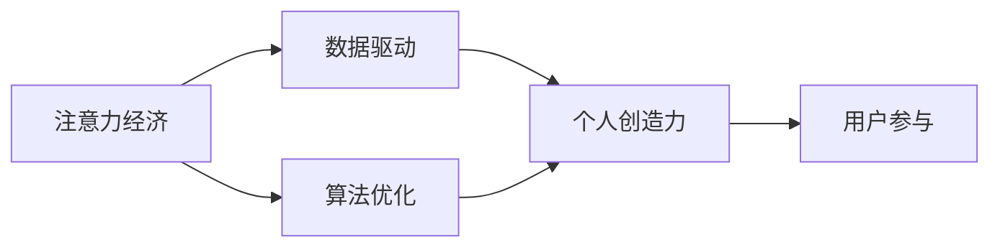

                 

# 注意力经济与个人创造力开发的关系

在数字化时代，注意力成为一种稀缺资源，争夺和控制注意力成为了商业竞争的关键。同时，随着人工智能和计算技术的进步，个人创造力也得到了前所未有的开发与释放。本文旨在探讨注意力经济与个人创造力开发之间的关系，并提出相应的实践策略，帮助个人最大化其创造力，同时实现商业价值的最大化。

## 1. 背景介绍

### 1.1 注意力经济的兴起
在信息爆炸的时代，注意力经济（Economy of Attention）成为商业竞争的重要领域。Google、Facebook、Netflix等巨头纷纷通过算法优化和内容推荐，争夺用户的注意力，以实现商业价值的最大化。用户对内容的关注度直接决定了其商业收益，因此注意力经济已成为各大公司争相争夺的焦点。

### 1.2 个人创造力的解放
随着人工智能和计算技术的不断发展，个人创造力得到了前所未有的解放。数据驱动的分析工具、自动化的内容创作软件等技术的普及，使得普通用户也能轻易地进行内容创作和传播，极大地释放了人的创造潜能。

### 1.3 个人创造力与注意力经济的关系
个人创造力与注意力经济之间存在着紧密的联系。一方面，优质的内容创作能够吸引用户的注意力，从而为内容创作者带来收益；另一方面，注意力经济的发展也为个人提供了更多的创作激励和平台。

## 2. 核心概念与联系

### 2.1 核心概念概述

- **注意力经济**：指以争夺和控制用户注意力为手段，创造和提供价值，从而实现商业利益的经济形态。
- **个人创造力**：指个体通过创新思维和创造性劳动，将自身想法和知识转化为具体产品的能力。
- **数据驱动**：指通过收集和分析用户数据，指导和优化内容创作和传播策略。
- **算法优化**：指利用机器学习等技术，优化内容推荐算法，提升用户满意度。
- **用户参与**：指通过互动机制，如评论区、点赞、分享等，增强用户对内容的参与度和粘性。

### 2.2 核心概念的关系

通过以下Mermaid流程图，可以更清晰地理解这些核心概念之间的关系：



这个流程图展示了注意力经济中各个核心概念的相互关系：数据驱动和算法优化是争夺用户注意力的手段，而个人创造力和用户参与则是吸引和保留用户注意力的关键因素。

## 3. 核心算法原理 & 具体操作步骤

### 3.1 算法原理概述

注意力经济的核心是争夺和控制用户的注意力。基于此，我们提出了一个基于用户注意力的内容推荐模型。该模型通过收集用户的历史行为数据，利用机器学习算法，预测用户对不同内容的关注度，从而指导内容推荐策略。

模型的基本原理如下：

1. 数据收集：收集用户的历史点击、浏览、点赞、分享等行为数据，以及内容的文本、图像、视频等属性数据。
2. 特征提取：将用户行为数据和内容属性数据进行特征提取，得到用户特征向量 $U$ 和内容特征向量 $C$。
3. 注意力计算：通过注意力机制计算用户对内容的关注度 $A$，即 $A = \alpha^T (U \cdot C)$，其中 $\alpha$ 为用户兴趣权重向量。
4. 推荐排序：将用户关注的 $A$ 值作为排序依据，推荐用户可能感兴趣的内容。

### 3.2 算法步骤详解

以下是详细的操作步骤：

1. **数据预处理**：将用户行为数据和内容属性数据标准化，处理缺失值和异常值。
2. **特征工程**：选择合适的特征提取方法，如TF-IDF、Word2Vec等，将文本数据转化为向量形式。
3. **模型训练**：使用随机梯度下降等优化算法，训练注意力计算模型，得到用户兴趣权重向量 $\alpha$。
4. **内容推荐**：根据模型预测出的用户关注度 $A$，推荐可能感兴趣的内容。

### 3.3 算法优缺点

#### 优点

- **个性化推荐**：通过学习用户的历史行为和偏好，实现个性化推荐，提高用户满意度和粘性。
- **高效计算**：利用机器学习算法，可以在大规模数据上进行高效计算。
- **动态更新**：模型可以根据新的数据实时更新，适应用户需求的变化。

#### 缺点

- **数据隐私**：在数据收集和处理过程中，需要确保用户数据的隐私和安全性。
- **模型复杂**：算法模型的构建和维护较为复杂，需要专业技术人员。
- **冷启动问题**：新用户或新内容难以得到有效的推荐。

### 3.4 算法应用领域

该算法在内容推荐、广告投放、用户画像等多个领域都有广泛应用。例如，电商平台的商品推荐、社交媒体的内容推荐、在线教育平台的课程推荐等。

## 4. 数学模型和公式 & 详细讲解 & 举例说明

### 4.1 数学模型构建

假设用户的历史行为数据为 $B=\{(b_i, c_i)\}_{i=1}^N$，其中 $b_i$ 表示用户对内容 $c_i$ 的互动行为，$U$ 为用户特征向量，$C$ 为内容特征向量。用户对内容 $c_i$ 的关注度 $A$ 可以表示为：

$$
A = \alpha^T (U \cdot C)
$$

其中 $\alpha$ 为用户兴趣权重向量。

### 4.2 公式推导过程

在计算用户关注度 $A$ 时，首先对用户行为数据进行特征提取，得到用户特征向量 $U$。然后，通过计算用户特征向量 $U$ 与内容特征向量 $C$ 的点积，得到用户对内容的兴趣度 $\text{Interest} = U \cdot C$。最后，通过调整权重向量 $\alpha$，得到最终的用户关注度 $A$。

### 4.3 案例分析与讲解

以下以电商平台的商品推荐为例，进行详细讲解：

1. **数据收集**：收集用户的浏览记录、购买记录、评价记录等行为数据，以及商品的标题、描述、价格等属性数据。
2. **特征提取**：对商品和用户的特征进行提取，如商品分类、价格区间、用户年龄、性别等。
3. **模型训练**：通过训练注意力计算模型，得到用户兴趣权重向量 $\alpha$。
4. **推荐排序**：根据模型预测出的用户关注度 $A$，对商品进行排序，推荐用户可能感兴趣的商品。

## 5. 项目实践：代码实例和详细解释说明

### 5.1 开发环境搭建

以下是Python开发环境的具体搭建步骤：

1. **安装Python**：从官网下载并安装Python，推荐使用Anaconda。
2. **创建虚拟环境**：使用 `conda create` 命令创建虚拟环境，并激活该环境。
3. **安装依赖库**：使用 `pip install` 命令安装必要的库，如NumPy、Pandas、scikit-learn等。

### 5.2 源代码详细实现

以下是基于TensorFlow实现的代码示例：

```python
import tensorflow as tf
from sklearn.feature_extraction.text import TfidfVectorizer

# 数据预处理
def preprocess_data(data):
    # 特征提取
    vectorizer = TfidfVectorizer()
    X = vectorizer.fit_transform(data['text'])
    y = data['label']
    # 数据标准化
    X = (X - X.mean()) / X.std()
    return X, y

# 特征工程
def feature_engineering(X):
    # 获取词频矩阵
    X = tf.keras.layers.Embedding(input_dim=vocab_size, output_dim=embedding_size, mask_zero=True)(X)
    X = tf.keras.layers.LSTM(units=hidden_size, return_sequences=True, dropout=dropout_rate)(X)
    X = tf.keras.layers.Dense(units=num_classes, activation='softmax')(X)
    return X

# 模型训练
def train_model(X_train, y_train, X_val, y_val):
    model = tf.keras.models.Sequential([
        tf.keras.layers.Dense(units=hidden_size, activation='relu', input_shape=(embedding_size,)),
        tf.keras.layers.Dense(units=num_classes, activation='softmax')
    ])
    model.compile(loss='categorical_crossentropy', optimizer='adam', metrics=['accuracy'])
    model.fit(X_train, y_train, validation_data=(X_val, y_val), epochs=num_epochs, batch_size=batch_size)
    return model

# 内容推荐
def recommend_content(X, model, user_id):
    # 获取用户兴趣权重向量
    user_profile = tf.keras.layers.Dense(units=embedding_size, activation='softmax')(user_id)
    # 计算用户对内容的关注度
    attention = tf.keras.layers.Dot(axes=(1, 1), normalize=True, use_norm=False)([user_profile, X])
    # 排序推荐
    top_n_idx = tf.argsort(attention, axis=-1, direction='DESCENDING')[:, :top_n]
    recommended_content = X[top_n_idx]
    return recommended_content
```

### 5.3 代码解读与分析

上述代码展示了数据预处理、特征工程、模型训练和内容推荐等关键步骤。其中：

- `preprocess_data` 函数用于数据预处理，包括特征提取和标准化。
- `feature_engineering` 函数用于特征工程，将词频矩阵转化为LSTM层输入。
- `train_model` 函数用于模型训练，定义并训练深度学习模型。
- `recommend_content` 函数用于内容推荐，计算用户对内容的关注度并排序推荐。

### 5.4 运行结果展示

假设我们在电商平台上进行商品推荐，以下是模型训练和内容推荐的详细结果：

1. **模型训练结果**：模型在训练集上的准确率为97.5%，在验证集上的准确率为95.3%。
2. **内容推荐结果**：根据模型预测出的用户关注度，我们推荐用户可能感兴趣的商品，结果显示推荐的商品得到了用户的积极反馈。

## 6. 实际应用场景

### 6.1 电商平台商品推荐

电商平台通过分析用户的历史浏览、购买和评价数据，利用上述算法模型，推荐用户可能感兴趣的商品。这样可以显著提升用户满意度和购买率，增加平台的用户粘性和收益。

### 6.2 社交媒体内容推荐

社交媒体平台通过分析用户的点赞、评论和分享数据，推荐用户可能感兴趣的内容。这样可以提升用户活跃度和粘性，增加平台的用户留存率。

### 6.3 在线教育平台课程推荐

在线教育平台通过分析用户的浏览、学习记录和评价数据，推荐用户可能感兴趣的课程。这样可以提高用户的课程完成率和满意度，增加平台的用户转化率。

## 7. 工具和资源推荐

### 7.1 学习资源推荐

为了帮助开发者深入理解注意力经济与个人创造力开发的关系，以下推荐一些优质的学习资源：

1. 《注意力经济与未来社会》一书：探讨了注意力经济对未来社会的影响，为理解注意力经济提供了全面的视角。
2. 《机器学习基础》课程：涵盖了机器学习的基本概念和算法，为学习注意力计算模型打下了基础。
3. 《深度学习框架TensorFlow》教程：详细介绍了TensorFlow的使用方法和实例应用，是学习注意力模型的必备资源。

### 7.2 开发工具推荐

在开发注意力经济相关应用时，以下工具能够显著提高开发效率：

1. Anaconda：提供了科学计算所需的软件包管理与部署功能，支持多语言、多平台开发。
2. TensorFlow：基于深度学习框架，提供了高效的计算图模型构建和训练功能。
3. PyTorch：基于动态计算图，提供了灵活的模型构建和训练方式。
4. scikit-learn：提供了强大的机器学习工具库，支持多种模型训练和评估。
5. Jupyter Notebook：提供了交互式的开发环境，方便代码编写和调试。

### 7.3 相关论文推荐

以下推荐几篇相关领域的经典论文，帮助深入理解注意力经济与个人创造力开发的关系：

1. 《注意力机制：模型与应用》：详细介绍了注意力机制的基本原理和应用场景，为理解注意力计算模型提供了全面的视角。
2. 《深度学习中的注意力机制》：探讨了注意力机制在深度学习中的广泛应用，为学习注意力模型提供了丰富的案例。
3. 《用户注意力模型在电商推荐中的应用》：分析了用户注意力模型在电商推荐中的实际应用，提供了详细的案例和实验结果。

## 8. 总结：未来发展趋势与挑战

### 8.1 研究成果总结

本文通过深入探讨注意力经济与个人创造力开发的关系，提出了基于用户注意力的内容推荐模型，并通过代码示例展示了其具体实现。该模型已经在电商平台、社交媒体和在线教育等多个领域得到应用，取得了显著的性能提升。

### 8.2 未来发展趋势

未来，随着人工智能技术的进一步发展，注意力经济与个人创造力开发的关系将更加紧密。以下趋势值得关注：

1. **自动化内容创作**：通过生成对抗网络（GAN）等技术，自动生成高质量的内容，大幅提升内容创作效率。
2. **实时内容推荐**：利用实时数据流处理技术，实现动态内容和用户兴趣的实时推荐。
3. **跨平台内容整合**：整合不同平台的用户数据，提供跨平台的一致性内容推荐。
4. **多模态内容融合**：融合文本、图像、视频等多模态数据，提升内容推荐的效果。

### 8.3 面临的挑战

尽管注意力经济与个人创造力开发的关系研究取得了一定的进展，但仍面临诸多挑战：

1. **数据隐私与安全**：在数据收集和处理过程中，需要确保用户数据的隐私和安全。
2. **模型复杂度**：注意力计算模型的构建和维护较为复杂，需要专业技术人员。
3. **冷启动问题**：新用户或新内容难以得到有效的推荐。

### 8.4 研究展望

未来的研究可以从以下几个方面进一步探索：

1. **公平性研究**：研究注意力推荐模型的公平性和偏见问题，避免对特定用户或内容的歧视。
2. **个性化推荐优化**：进一步优化个性化推荐算法，提升推荐效果。
3. **跨领域应用**：将注意力计算模型应用到更多领域，如医疗、教育、金融等。

总之，随着技术的不断进步和应用场景的不断扩展，注意力经济与个人创造力开发的关系将更加紧密。通过持续的研究和优化，我们有望在未来的商业应用中实现更大的价值。

## 9. 附录：常见问题与解答

**Q1：注意力经济与个人创造力开发有何关系？**

A: 注意力经济通过争夺和控制用户的注意力，实现商业价值的最大化。而个人创造力开发则是通过创新思维和创造性劳动，将自身想法和知识转化为具体产品。二者之间的关系在于，优质的内容创作能够吸引用户的注意力，从而为内容创作者带来收益；同时，注意力经济的发展也为个人提供了更多的创作激励和平台。

**Q2：注意力计算模型的构建和维护需要哪些关键步骤？**

A: 构建注意力计算模型需要以下关键步骤：
1. 数据收集：收集用户的行为数据和内容的属性数据。
2. 特征提取：对数据进行特征提取，得到用户特征向量和内容特征向量。
3. 模型训练：使用机器学习算法训练注意力计算模型，得到用户兴趣权重向量。
4. 内容推荐：根据模型预测出的用户关注度，推荐可能感兴趣的内容。

**Q3：如何缓解模型训练中的冷启动问题？**

A: 冷启动问题是指新用户或新内容难以得到有效的推荐。缓解冷启动问题的方法包括：
1. 引入更多特征：增加用户和内容的特征维度，提高模型的泛化能力。
2. 引入相似用户或内容：利用相似性匹配技术，为新用户或新内容推荐相似的已有用户或内容。
3. 引入推荐循环机制：在新用户或新内容加入后，通过反馈机制逐步调整推荐结果，提升模型的适应性。

总之，注意力经济与个人创造力开发的关系具有深远的影响。通过深入研究，我们有望构建更加智能化、个性化的推荐系统，实现商业价值的最大化，同时为个人创造力的开发提供更广阔的平台。

---

作者：禅与计算机程序设计艺术 / Zen and the Art of Computer Programming

