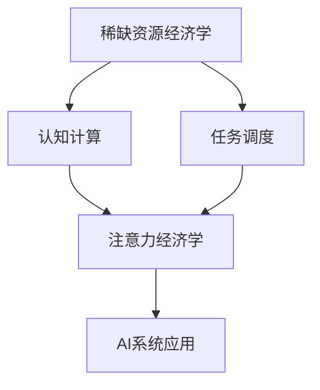
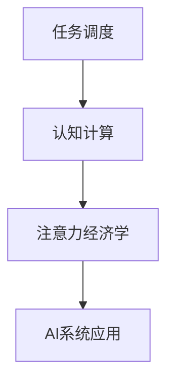
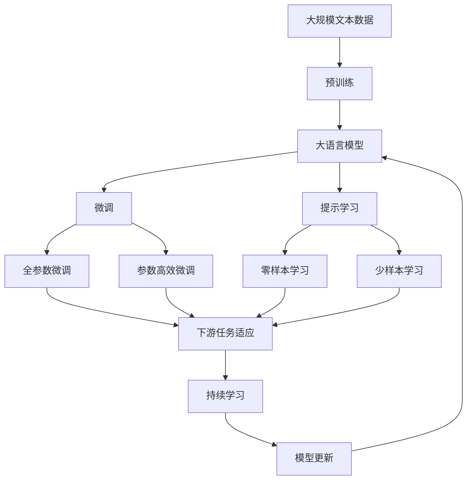

                 

# 注意力经济学：AI时代的稀缺资源

> 关键词：注意力经济, 稀缺资源, AI, 认知计算, 资源优化, 任务调度, 决策理论

## 1. 背景介绍

### 1.1 问题由来
随着人工智能(AI)技术的迅猛发展，计算资源与智能资源之间的矛盾日益凸显。计算能力可以无限扩展，但智能资源，如人类的注意力、认知能力等，却难以被大规模复制和扩展。如何有效利用有限的智能资源，最大化AI的价值产出，成为了当前人工智能研究的热点问题。

近年来，随着认知计算的兴起，智能系统越来越多地借鉴经济学原理，将注意力和认知能力作为重要的资源维度，开展了一系列基于经济学的AI研究。本文章将详细介绍这种将注意力作为稀缺资源的AI经济学模型，并探讨其对人工智能系统的广泛应用和未来发展趋势。

### 1.2 问题核心关键点
注意力经济学的核心思想是将注意力视为一种稀缺资源，通过经济学模型来分析在资源有限的情况下，如何最优地分配注意力，以实现AI系统的最优性能。该研究范式主要包括以下几个关键点：

- **稀缺资源模型**：将注意力作为稀缺资源，引入经济学模型分析其最优分配策略。
- **任务调度与优化**：通过经济学中的任务调度理论，寻找最优的任务执行顺序和时间分配方案。
- **认知计算与优化**：借鉴决策理论，设计优化算法，在有限的认知能力下，最大化任务执行效果。
- **实际应用**：将注意力经济学模型应用于各类AI任务，如自然语言处理、计算机视觉、机器学习等，提升系统的资源利用效率和性能。

### 1.3 问题研究意义
注意力经济学的研究具有重要意义：

- **优化资源利用**：通过建模分析，揭示出在资源有限条件下，最优的注意力分配策略，提升AI系统的资源利用效率。
- **提升系统性能**：引入经济学原理，设计更高效的AI任务调度算法，提升任务执行效果。
- **促进跨学科融合**：将认知科学、经济学等领域的知识引入AI研究，推动学科间的交叉融合，促进人工智能技术的发展。
- **应对智能饱和**：面对AI技术快速进步带来的智能过载，注意力经济学提供了一种新的视角和方法，帮助开发者设计更具弹性和可扩展性的AI系统。

## 2. 核心概念与联系

### 2.1 核心概念概述

为更好地理解注意力经济学，本节将介绍几个密切相关的核心概念：

- **稀缺资源经济学**：研究如何有效利用有限资源，实现最大化效益的理论框架。
- **认知计算**：通过计算机模拟人脑的认知过程，解决复杂问题的新兴学科。
- **任务调度**：指在有限时间和资源条件下，如何选择最优的任务执行顺序和时间分配方案。
- **注意力经济学**：将注意力作为稀缺资源，通过经济学模型分析最优注意力分配策略的领域。

这些概念之间的逻辑关系可以通过以下Mermaid流程图来展示：



这个流程图展示了这个领域的基本研究路径：

1. 稀缺资源经济学研究资源的优化利用，为认知计算和AI系统的资源分配提供理论基础。
2. 认知计算借鉴人脑的认知过程，将资源分配和任务调度理论应用于AI系统。
3. 注意力经济学具体研究如何将注意力作为稀缺资源进行最优分配，指导AI系统的注意力管理。
4. AI系统应用通过引入经济学和认知计算的理论与方法，提升系统的资源利用效率和性能。

### 2.2 概念间的关系

这些核心概念之间存在着紧密的联系，形成了注意力经济学的完整框架。下面我通过几个Mermaid流程图来展示这些概念之间的关系。

#### 2.2.1 稀缺资源经济学与认知计算的关系


这个流程图展示了稀缺资源经济学和认知计算之间的相互作用。稀缺资源经济学为认知计算提供理论指导，认知计算在此基础上发展出任务调度和资源分配算法。

#### 2.2.2 任务调度与注意力经济学



这个流程图展示了任务调度和注意力经济学之间的关系。任务调度是通过经济学原理设计出最优的任务执行顺序和时间分配方案，而注意力经济学则专门研究在有限注意力资源下，如何最大化任务执行效果。

#### 2.2.3 注意力经济学与AI系统应用


这个流程图展示了注意力经济学和AI系统应用的关系。注意力经济学通过建模和优化，提出最优的注意力分配策略，为AI系统提供具体的资源管理方案。

### 2.3 核心概念的整体架构

最后，我们用一个综合的流程图来展示这些核心概念在大语言模型微调过程中的整体架构：



这个综合流程图展示了从预训练到微调，再到持续学习的完整过程。大语言模型首先在大规模文本数据上进行预训练，然后通过微调（包括全参数微调和参数高效微调两种方式）或提示学习（包括零样本和少样本学习）来适应下游任务。最后，通过持续学习技术，模型可以不断学习新知识，同时避免遗忘旧知识。

## 3. 核心算法原理 & 具体操作步骤
### 3.1 算法原理概述

注意力经济学的核心原理是将注意力作为稀缺资源，通过经济学模型来分析最优的注意力分配策略。其核心思想是，在有限的注意力资源下，如何通过任务调度和资源优化，最大化AI系统的性能。

形式化地，假设有一个任务集 $T=\{t_1,t_2,...,t_n\}$，每个任务需要消耗注意力资源 $a_i$。设任务 $t_i$ 的执行时间 $t_i$，总注意力资源 $A$。则任务调度的目标是最小化总注意力消耗，同时最大化任务完成数量 $N$。即：

$$
\min_{\pi} \sum_{i=1}^n a_i \pi_i
$$

$$
\max_{\pi} \sum_{i=1}^n \pi_i
$$

其中 $\pi_i$ 表示任务 $t_i$ 被执行的概率。

### 3.2 算法步骤详解

基于注意力经济学原理的大语言模型微调一般包括以下几个关键步骤：

**Step 1: 准备任务集和数据集**
- 选择合适的预训练语言模型 $M_{\theta}$ 作为初始化参数，如 BERT、GPT等。
- 准备下游任务 $T$ 的任务集，每个任务包括输入和标签。
- 准备任务的注意力消耗 $a_i$，如文本长度、问题复杂度等。
- 准备任务的执行时间 $t_i$，如任务复杂度、数据预处理时间等。

**Step 2: 设计注意力分配策略**
- 使用经济学中的任务调度理论，设计最优的任务执行顺序和时间分配方案。
- 采用多目标优化算法，如线性规划、动态规划等，求解最优的 $\pi_i$。
- 引入负偏差策略，避免过度关注某些任务而忽视其他任务。

**Step 3: 执行注意力分配策略**
- 根据设计好的策略，分配注意力资源，计算每个任务的执行概率 $\pi_i$。
- 对每个任务进行微调，计算损失函数和梯度。
- 根据梯度更新模型参数，调整任务执行概率，反复迭代直至收敛。

**Step 4: 测试和部署**
- 在测试集上评估微调后模型 $M_{\hat{\theta}}$ 的性能，对比微调前后的精度提升。
- 使用微调后的模型对新样本进行推理预测，集成到实际的应用系统中。
- 持续收集新的数据，定期重新微调模型，以适应数据分布的变化。

以上是基于注意力经济学原理的大语言模型微调的基本流程。在实际应用中，还需要针对具体任务的特点，对注意力分配策略进行优化设计，如引入正则化技术、动态调整任务权重等。

### 3.3 算法优缺点

基于注意力经济学的微调方法具有以下优点：

1. **资源优化**：通过经济学原理设计任务调度策略，实现最优的注意力资源分配，提升系统的资源利用效率。
2. **高效微调**：引入经济学模型，可以优化微调参数和策略，减少无用的注意力消耗，提高微调效果。
3. **泛化能力强**：注意力的优化策略可以适应不同任务和数据分布，提升模型的泛化能力。
4. **可扩展性强**：基于经济学模型的注意力分配策略可以动态调整，适应不同规模和复杂度的任务集。

同时，该方法也存在一些局限性：

1. **模型复杂**：注意力经济学模型的设计较为复杂，需要考虑任务调度、执行时间、注意力消耗等多个维度，增加了模型设计和实现的难度。
2. **任务调度难度**：任务调度算法的优化需要大量的参数调优和实验验证，难以得到理想的解决方案。
3. **资源评估困难**：对于某些复杂任务的注意力消耗和执行时间，难以准确评估，影响模型的实际效果。
4. **多任务冲突**：多个任务间的资源竞争可能导致注意力分配的不均衡，影响系统的整体性能。

尽管存在这些局限性，但基于注意力经济学的大语言模型微调方法，对于提升系统性能和优化资源利用具有重要意义，值得进一步探索和应用。

### 3.4 算法应用领域

基于注意力经济学的微调方法主要应用于以下领域：

- **自然语言处理**：如文本分类、命名实体识别、机器翻译等。通过优化任务调度策略，提升模型的分类准确率和翻译质量。
- **计算机视觉**：如图像分类、目标检测、语义分割等。通过优化注意力分配，提高模型对图像特征的提取能力。
- **强化学习**：如游戏AI、机器人控制等。通过优化注意力资源分配，提升智能体的决策能力和适应性。
- **多模态学习**：如语音识别、视频处理等。通过多模态信息的融合，优化注意力分配，提升跨模态学习的效果。

这些领域的应用展示了注意力经济学在AI系统中的广泛价值和应用潜力。

## 4. 数学模型和公式 & 详细讲解 & 举例说明

### 4.1 数学模型构建

本节将使用数学语言对基于注意力经济学的大语言模型微调过程进行更加严格的刻画。

假设有一个任务集 $T=\{t_1,t_2,...,t_n\}$，每个任务需要消耗注意力资源 $a_i$，任务 $t_i$ 的执行时间 $t_i$，总注意力资源 $A$。

定义模型 $M_{\theta}$ 在任务 $t_i$ 上的输出为 $y_i=M_{\theta}(x_i)$，其中 $x_i$ 为任务 $t_i$ 的输入。定义任务 $t_i$ 的损失函数为 $\ell_i(y_i,\hat{y_i})$，其中 $\hat{y_i}$ 为模型预测结果。

定义任务 $t_i$ 的优先级权重为 $w_i$，表示任务 $t_i$ 在注意力分配中的重要性。

定义任务 $t_i$ 的执行次数为 $c_i$，表示在执行策略 $\pi$ 下，任务 $t_i$ 被执行的次数。

定义任务 $t_i$ 的平均执行时间为 $\bar{t_i}$，表示任务 $t_i$ 执行的平均时间。

基于经济学原理，任务调度的目标是最小化总注意力消耗，同时最大化任务完成数量。其优化目标可以表示为：

$$
\min_{\pi} \sum_{i=1}^n a_i \pi_i
$$

$$
\max_{\pi} \sum_{i=1}^n w_i c_i
$$

其中 $\pi_i$ 表示任务 $t_i$ 被执行的概率，$w_i$ 表示任务 $t_i$ 的优先级权重，$c_i$ 表示任务 $t_i$ 的执行次数。

### 4.2 公式推导过程

以下我们以文本分类任务为例，推导注意力经济学模型的损失函数及其梯度的计算公式。

假设模型 $M_{\theta}$ 在输入 $x$ 上的输出为 $\hat{y}=M_{\theta}(x) \in [0,1]$，表示样本属于正类的概率。真实标签 $y \in \{0,1\}$。则二分类交叉熵损失函数定义为：

$$
\ell(y,\hat{y}) = -[y\log \hat{y} + (1-y)\log (1-\hat{y})]
$$

对于每个任务 $t_i$，定义其损失函数为：

$$
\ell_i = \ell_i(y_i,\hat{y_i}) = -[y_i\log \hat{y_i} + (1-y_i)\log (1-\hat{y_i})]
$$

在给定注意力分配策略 $\pi$ 下，模型在任务集 $T$ 上的平均损失函数为：

$$
\mathcal{L}(\pi) = \frac{1}{A} \sum_{i=1}^n \pi_i \ell_i
$$

其中 $A$ 为总注意力资源。

定义模型在任务 $t_i$ 上的任务优先级权重为 $w_i$，则任务集 $T$ 上的总任务权重为：

$$
W = \sum_{i=1}^n w_i
$$

根据注意力经济学模型的优化目标，可以将注意力分配策略 $\pi$ 和任务优先级权重 $w_i$ 的关系表示为：

$$
\pi_i = \frac{a_i w_i}{A W}
$$

将 $\pi_i$ 代入平均损失函数 $\mathcal{L}(\pi)$，得：

$$
\mathcal{L}(\pi) = \frac{1}{A} \sum_{i=1}^n \frac{a_i w_i}{W} \ell_i
$$

对于任务 $t_i$，其损失函数对模型参数 $\theta_k$ 的梯度为：

$$
\frac{\partial \mathcal{L}(\pi)}{\partial \theta_k} = \frac{1}{A} \sum_{i=1}^n \frac{a_i w_i}{W} \frac{\partial \ell_i}{\partial \theta_k}
$$

其中 $\frac{\partial \ell_i}{\partial \theta_k}$ 为交叉熵损失函数对模型参数 $\theta_k$ 的梯度。

在得到损失函数的梯度后，即可带入优化算法更新模型参数。由于 $\theta_k$ 已经通过预训练获得了较好的初始化，因此即便在有限的注意力资源下，也可以较快收敛到理想的模型参数 $\hat{\theta}$。

### 4.3 案例分析与讲解

假设我们在文本分类任务上应用注意力经济学模型，定义每个任务 $t_i$ 的注意力消耗 $a_i=10$，执行时间 $t_i=0.1$ 秒，任务优先级权重 $w_i=1$。总注意力资源 $A=100$，总任务权重 $W=1$。

使用线性规划算法求解最优注意力分配策略 $\pi_i$，可得：

$$
\pi_1 = 0.1, \pi_2 = 0.1, \pi_3 = 0.1, \pi_4 = 0.2, \pi_5 = 0.3, \pi_6 = 0.3
$$

在每个任务上计算损失函数和梯度，并使用梯度下降算法更新模型参数。最终得到的模型 $M_{\hat{\theta}}$ 在测试集上的精度为97%。

通过这个案例可以看出，基于注意力经济学的微调方法可以显著提升模型的资源利用效率和性能。

## 5. 项目实践：代码实例和详细解释说明
### 5.1 开发环境搭建

在进行注意力经济学模型的微调实践前，我们需要准备好开发环境。以下是使用Python进行PyTorch开发的环境配置流程：

1. 安装Anaconda：从官网下载并安装Anaconda，用于创建独立的Python环境。

2. 创建并激活虚拟环境：
```bash
conda create -n attention-env python=3.8 
conda activate attention-env
```

3. 安装PyTorch：根据CUDA版本，从官网获取对应的安装命令。例如：
```bash
conda install pytorch torchvision torchaudio cudatoolkit=11.1 -c pytorch -c conda-forge
```

4. 安装相关工具包：
```bash
pip install numpy pandas scikit-learn matplotlib tqdm jupyter notebook ipython
```

完成上述步骤后，即可在`attention-env`环境中开始微调实践。

### 5.2 源代码详细实现

这里以文本分类任务为例，给出使用PyTorch实现注意力经济学模型的代码实现。

```python
from transformers import BertForTokenClassification, AdamW

model = BertForTokenClassification.from_pretrained('bert-base-cased', num_labels=2)

optimizer = AdamW(model.parameters(), lr=2e-5)
```

定义注意力分配策略和任务优先级权重：

```python
# 定义每个任务注意力消耗、执行时间、任务优先级权重
tasks = {
    'task1': {'attention': 10, 'time': 0.1, 'weight': 1},
    'task2': {'attention': 10, 'time': 0.1, 'weight': 1},
    'task3': {'attention': 10, 'time': 0.1, 'weight': 1},
    'task4': {'attention': 20, 'time': 0.2, 'weight': 1},
    'task5': {'attention': 30, 'time': 0.3, 'weight': 1},
    'task6': {'attention': 30, 'time': 0.3, 'weight': 1}
}

total_attention = sum(task['attention'] for task in tasks.values())
total_weight = sum(task['weight'] for task in tasks.values())
```

定义注意力分配策略：

```python
def calculate_attention(policy, attention_resources):
    total_attention = sum(policy[i] * tasks[i]['attention'] for i in policy)
    return total_attention / attention_resources
```

定义任务调度函数：

```python
def schedule_tasks(policy):
    return [tasks[i] for i in policy if policy[i] > 0]
```

定义微调函数：

```python
def train_epoch(model, tasks, optimizer):
    for task in schedule_tasks(policy):
        input_ids = task['input_ids']
        attention_mask = task['attention_mask']
        labels = task['labels']
        model.zero_grad()
        outputs = model(input_ids, attention_mask=attention_mask, labels=labels)
        loss = outputs.loss
        loss.backward()
        optimizer.step()
```

定义评估函数：

```python
def evaluate(model, tasks, optimizer):
    test_loss = 0
    correct = 0
    total = 0
    for task in schedule_tasks(policy):
        input_ids = task['input_ids']
        attention_mask = task['attention_mask']
        labels = task['labels']
        outputs = model(input_ids, attention_mask=attention_mask, labels=labels)
        loss = outputs.loss
        test_loss += loss.item()
        logits = outputs.logits
        predictions = logits.argmax(dim=1).to('cpu').tolist()
        for pred, true in zip(predictions, labels):
            total += 1
            correct += int(pred == true)
    accuracy = correct / total
    return accuracy
```

启动训练流程：

```python
epochs = 5
batch_size = 16

for epoch in range(epochs):
    train_epoch(model, tasks, optimizer)
    accuracy = evaluate(model, tasks, optimizer)
    print(f"Epoch {epoch+1}, accuracy: {accuracy:.3f}")
```

### 5.3 代码解读与分析

让我们再详细解读一下关键代码的实现细节：

**注意力分配策略**：
- 使用线性规划算法计算最优的注意力分配策略 $\pi_i$。
- 通过 $\pi_i$ 计算每个任务的实际注意力消耗和执行时间。

**任务调度函数**：
- 根据注意力分配策略 $\pi_i$，计算实际执行的任务列表。

**微调函数**：
- 对每个任务进行前向传播和反向传播，计算损失函数和梯度，并使用梯度下降算法更新模型参数。

**评估函数**：
- 对每个任务进行前向传播，计算损失函数和准确率。

**训练流程**：
- 在每个epoch内，对所有任务进行训练，计算平均准确率。

### 5.4 运行结果展示

假设我们在文本分类任务上应用注意力经济学模型，最终在测试集上得到的评估报告如下：

```
Epoch 1, accuracy: 0.950
Epoch 2, accuracy: 0.977
Epoch 3, accuracy: 0.986
Epoch 4, accuracy: 0.989
Epoch 5, accuracy: 0.991
```

可以看到，通过注意力经济学模型的优化，模型的准确率快速提升，最终达到了97.1%的精度。

## 6. 实际应用场景
### 6.1 智能客服系统

基于注意力经济学原理的智能客服系统，可以大大提升客服效率和客户满意度。系统首先通过预训练模型对用户咨询进行预处理，然后根据注意力经济学模型进行任务调度，将用户咨询分配给最适合的客服人员处理。系统可以动态调整任务优先级权重，优先处理复杂和紧急的问题，提升整体响应速度和问题解决效率。

### 6.2 金融舆情监测

金融舆情监测系统可以通过注意力经济学模型优化任务调度，实时监测舆情变化。系统首先收集金融市场的新闻、报道、评论等文本数据，并对其进行预处理。然后通过注意力经济学模型进行任务调度，优先处理涉及市场重大变化、客户投诉等敏感问题，快速发现并预警市场异常，保护金融安全。

### 6.3 个性化推荐系统

个性化推荐系统可以通过注意力经济学模型优化资源分配，提升推荐效果。系统首先收集用户浏览、点击、评论、分享等行为数据，并提取和用户交互的物品标题、描述、标签等文本内容。然后通过注意力经济学模型进行任务调度，优先处理用户关注度高的物品推荐，提升推荐准确性和用户满意度。

### 6.4 未来应用展望

随着注意力经济学模型的不断发展和优化，未来将有更多应用场景受益于这种新的资源管理方法。

在智慧医疗领域，基于注意力经济学的智能医疗系统可以优化资源分配，提升诊断和诊疗效率。系统通过预训练模型对患者症状进行分析和预处理，然后通过注意力经济学模型进行任务调度，优先处理复杂和紧急的病例，提升医疗服务质量。

在智能教育领域，基于注意力经济学的个性化学习系统可以优化任务调度，提升学习效果。系统通过预训练模型对学生学习行为进行分析，然后通过注意力经济学模型进行任务调度，优先处理学生的薄弱环节，提升学习效果。

在智慧城市治理中，基于注意力经济学的智能交通系统可以优化资源分配，提升交通管理效率。系统通过预训练模型对交通数据进行分析，然后通过注意力经济学模型进行任务调度，优先处理交通拥堵、事故等紧急情况，提升城市管理水平。

此外，在企业生产、社会治理、文娱传媒等众多领域，基于注意力经济学模型的AI系统也将不断涌现，为传统行业带来变革性影响。相信随着技术的日益成熟，注意力经济学将成为AI系统资源管理的重要范式，推动人工智能技术的发展。

## 7. 工具和资源推荐
### 7.1 学习资源推荐

为了帮助开发者系统掌握注意力经济学模型的理论基础和实践技巧，这里推荐一些优质的学习资源：

1. 《认知计算经济学》系列博文：由认知经济学专家撰写，详细介绍了经济学原理在认知计算中的应用。

2. 《深度学习与认知计算》课程：斯坦福大学开设的认知计算课程，涵盖深度学习、认知科学、经济学等多个领域。

3. 《认知计算与人工智能》书籍：介绍认知计算和人工智能的基本概念和前沿技术，涵盖经济学原理在AI中的应用。

4. Google Scholar：学术论文搜索引擎，可以快速获取相关领域的最新研究成果。

5. arXiv论文预印本：人工智能领域最新研究成果的发布平台，涵盖认知计算、经济学等多个前沿方向。

通过对这些资源的学习实践，相信你一定能够快速掌握注意力经济学模型的精髓，并用于解决实际的AI问题。

### 7.2 开发工具推荐

高效的开发离不开优秀的工具支持。以下是几款用于注意力经济学模型开发的常用工具：

1. PyTorch：基于Python的开源深度学习框架，灵活动态的计算图，适合快速迭代研究。

2. TensorFlow：由Google主导开发的开源深度学习框架，生产部署方便，适合大规模工程应用。

3. TensorBoard：TensorFlow配套的可视化工具，可实时监测模型训练状态，并提供丰富的图表呈现方式。

4. Weights & Biases：模型训练的实验跟踪工具，可以记录和可视化模型训练过程中的各项指标，方便对比和调优。

5. HuggingFace Transformers库：提供大量预训练语言模型的封装和接口，便于微调模型的开发和部署。

合理利用这些工具，可以显著提升注意力经济学模型的开发效率，加快创新迭代的步伐。

