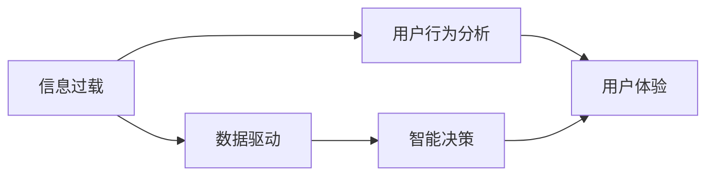

                 

# 注意力经济对企业决策过程的影响

> 关键词：
注意力经济、企业决策、数据驱动、信息过载、数据挖掘、智能决策、企业应用

## 1. 背景介绍

### 1.1 问题由来
随着互联网和信息技术的高速发展，人类已经进入了一个全新的时代——注意力经济时代。在这个时代，信息总量呈爆炸式增长，而人们的时间和注意力资源却是有限的。企业面临的挑战不再是获取更多的信息，而是如何在茫茫信息海洋中找到有价值的内容，并将之转化为决策依据。在这样的背景下，注意力经济成为企业决策的关键，企业必须通过技术手段挖掘和利用人们的注意力，实现数据驱动的智能决策。

### 1.2 问题核心关键点
注意力经济对企业决策的影响主要体现在以下几个方面：
- 信息过载：在信息爆炸的时代，如何从海量信息中筛选出有价值的内容是企业决策的重要前提。
- 数据驱动：通过数据分析和挖掘，企业能够从人们的注意力行为中获取丰富的信息，辅助决策过程。
- 智能决策：借助人工智能技术，企业可以实现自动化、智能化的决策过程，提高效率和准确性。
- 用户行为分析：通过分析用户的注意力集中情况和行为模式，企业可以更好地了解客户需求，提升用户体验。

### 1.3 问题研究意义
理解注意力经济对企业决策过程的影响，对于企业实现数字化转型、提升决策效率和质量、优化客户体验等方面具有重要意义：
- 优化资源配置：通过挖掘和利用人们的注意力，企业可以更有效地分配资源，提升运营效率。
- 提升决策准确性：数据驱动的决策方法能够帮助企业减少主观偏差，提高决策准确性。
- 增强市场竞争力：借助智能决策技术，企业可以在快速变化的市场环境中保持竞争力。
- 改善用户体验：分析用户注意力行为，企业可以更好地满足用户需求，提升产品和服务质量。

## 2. 核心概念与联系

### 2.1 核心概念概述

注意力经济是指在信息过载的时代，通过挖掘和利用人们的注意力，实现资源配置优化和智能决策的过程。企业决策过程中，注意力经济主要体现在以下几个方面：

- **信息过载**：指信息总量远远大于人们可以接受和处理的能力，导致决策过程中信息筛选和处理的难度增加。
- **数据驱动**：指在决策过程中，企业主要依据数据和分析结果而非直觉或经验，进行客观决策。
- **智能决策**：指在数据和分析的基础上，利用人工智能技术实现自动化、智能化的决策过程。
- **用户行为分析**：指通过分析用户的注意力集中情况和行为模式，了解用户需求，提升用户体验。

### 2.2 概念间的关系

这些核心概念之间存在着紧密的联系，形成了企业决策过程中的注意力经济生态系统。我们通过以下Mermaid流程图来展示这些概念之间的逻辑关系：



这个流程图展示了注意力经济在不同层面的应用：
1. 信息过载驱动数据驱动，进而实现智能决策。
2. 用户行为分析可以提升用户体验，同时反哺数据驱动和智能决策过程。

### 2.3 核心概念的整体架构

最后，我们用一个综合的流程图来展示注意力经济在不同环节的应用：


这个综合流程图展示了从信息过载到智能决策的完整流程：
1. 从信息过载开始，企业通过数据挖掘、数据分析和数据可视化等手段，获得有价值的信息。
2. 这些信息被用于智能决策，辅助企业进行资源配置和业务决策。
3. 决策执行后，通过反馈和改进过程，进一步优化决策模型和流程。
4. 整个过程不断循环迭代，不断提升企业决策的准确性和效率。

## 3. 核心算法原理 & 具体操作步骤
### 3.1 算法原理概述

注意力经济在企业决策中的应用主要通过数据驱动的智能决策方法来实现。这种决策方法的核心在于利用数据分析和机器学习技术，从海量数据中挖掘有价值的信息，辅助企业进行决策。

在算法原理上，基于注意力经济的决策模型主要包括以下几个步骤：
1. **数据收集**：从企业的运营数据、客户反馈、市场信息等渠道收集相关信息。
2. **数据预处理**：清洗和标准化数据，去除噪声和异常值。
3. **数据建模**：通过统计分析、机器学习等方法，建立数据模型，挖掘数据中的规律和趋势。
4. **决策分析**：利用决策树、随机森林、神经网络等算法，对模型进行分析和评估，辅助决策过程。
5. **智能决策**：结合业务经验和专业知识，综合分析数据模型和决策分析结果，进行智能决策。

### 3.2 算法步骤详解

以下是对注意力经济在企业决策过程中应用的核心算法步骤详解：

**Step 1: 数据收集**
- 从企业内部和外部数据源收集相关信息。内部数据包括销售数据、客户数据、生产数据等，外部数据包括市场趋势、竞争对手信息、行业报告等。
- 使用ETL工具（如Apache Nifi、Talend等）进行数据抽取、转换和加载，保证数据的完整性和一致性。

**Step 2: 数据预处理**
- 对收集到的数据进行清洗和预处理，去除缺失值、异常值和噪声数据。
- 进行数据标准化和归一化处理，保证数据的一致性和可比性。
- 使用特征工程技术，提取和构造有用的特征，为后续建模做准备。

**Step 3: 数据建模**
- 选择适合的算法模型，如回归分析、分类算法、聚类算法等，对数据进行建模。
- 使用机器学习框架（如TensorFlow、PyTorch、Scikit-learn等）进行模型训练和验证，选择最优模型。
- 对模型进行交叉验证和调参，确保模型的泛化能力和鲁棒性。

**Step 4: 决策分析**
- 将模型应用于实际业务场景，进行决策分析和评估。
- 利用决策树、随机森林、神经网络等算法，对数据模型进行分析和解释。
- 结合业务经验和专业知识，对分析结果进行综合评估，辅助决策过程。

**Step 5: 智能决策**
- 根据决策分析结果，结合业务目标和市场环境，进行智能决策。
- 制定决策方案，并进行风险评估和效果预测。
- 进行方案实施和执行，并根据反馈进行改进和优化。

### 3.3 算法优缺点

基于注意力经济的决策方法具有以下优点：
1. **数据驱动**：通过数据分析和挖掘，决策过程更加客观和科学，减少了主观偏差。
2. **智能决策**：利用机器学习和人工智能技术，提高了决策的准确性和效率。
3. **用户导向**：通过分析用户行为和反馈，企业能够更好地满足用户需求，提升用户体验。

但这种方法也存在以下缺点：
1. **数据依赖**：决策过程高度依赖数据质量和数据量，数据缺失或偏差可能导致决策失误。
2. **复杂性高**：需要复杂的算法和数据处理技术，对技术要求较高。
3. **解释性差**：机器学习模型往往是"黑盒"模型，难以解释其内部工作机制和决策逻辑。
4. **实时性不足**：处理大量数据需要时间，决策过程可能存在延迟。

### 3.4 算法应用领域

基于注意力经济的决策方法广泛应用于以下领域：
- **市场营销**：通过分析用户行为和市场趋势，优化广告投放和销售策略。
- **供应链管理**：利用数据挖掘和预测技术，优化库存管理和物流调度。
- **金融风控**：通过分析交易数据和用户行为，评估风险和制定风控策略。
- **客户服务**：通过分析客户反馈和行为数据，提升客户满意度和忠诚度。
- **人力资源管理**：通过分析员工绩效和行为数据，优化招聘和培训策略。

## 4. 数学模型和公式 & 详细讲解 & 举例说明

### 4.1 数学模型构建

注意力经济在企业决策中的应用，主要通过数据分析和机器学习模型来实现。这里我们以线性回归模型为例，进行数学模型构建和推导。

假设企业收集到销售数据 $y_i$ 和相关特征 $x_{i1}, x_{i2}, \dots, x_{in}$，其中 $i$ 表示样本编号。线性回归模型的目标是找到一组系数 $\beta_0, \beta_1, \dots, \beta_n$，使得模型 $y_i = \beta_0 + \beta_1 x_{i1} + \dots + \beta_n x_{in} + \epsilon_i$ 能够拟合数据，其中 $\epsilon_i$ 表示随机误差。

模型的最小二乘解可以通过求解方程 $[(X^T X)^{-1} X^T Y] = \hat{\beta}$ 得到，其中 $X = [x_{i1}, x_{i2}, \dots, x_{in}]$，$Y = [y_i]$。

### 4.2 公式推导过程

假设线性回归模型的系数为 $\beta$，则最小二乘解的公式为：

$$
\beta = (X^T X)^{-1} X^T Y
$$

其中 $X$ 为特征矩阵，$Y$ 为标签矩阵。

对于每个样本 $i$，模型预测值 $\hat{y}_i$ 为：

$$
\hat{y}_i = X_i^T \beta
$$

其中 $X_i = [x_{i1}, x_{i2}, \dots, x_{in}]$ 为样本 $i$ 的特征向量。

### 4.3 案例分析与讲解

以一家电商公司为例，该公司通过分析用户的购买行为和点击行为，预测用户未来的购买意愿。具体步骤如下：
1. **数据收集**：从电商平台的订单数据和点击日志中，收集用户的购买行为和点击行为数据。
2. **数据预处理**：清洗和标准化数据，去除异常值和噪声数据。
3. **数据建模**：使用线性回归模型对数据进行建模，选择最优的特征和模型。
4. **决策分析**：利用模型预测用户未来的购买意愿，进行决策分析和评估。
5. **智能决策**：结合业务经验和专业知识，对预测结果进行综合评估，制定销售策略。

## 5. 项目实践：代码实例和详细解释说明

### 5.1 开发环境搭建

在进行注意力经济在企业决策中的应用实践前，我们需要准备好开发环境。以下是使用Python进行Pandas、NumPy和Scikit-learn开发的环境配置流程：

1. 安装Anaconda：从官网下载并安装Anaconda，用于创建独立的Python环境。

2. 创建并激活虚拟环境：
```bash
conda create -n attention-economy python=3.8 
conda activate attention-economy
```

3. 安装相关库：
```bash
conda install pandas numpy scikit-learn
```

4. 安装TensorFlow和Keras：
```bash
pip install tensorflow==2.3.0 keras
```

完成上述步骤后，即可在`attention-economy`环境中开始项目实践。

### 5.2 源代码详细实现

我们以线性回归模型为例，给出一个完整的代码实现。

```python
import pandas as pd
import numpy as np
from sklearn.linear_model import LinearRegression
from sklearn.model_selection import train_test_split
from sklearn.metrics import mean_squared_error, r2_score

# 读取数据
data = pd.read_csv('sales_data.csv')

# 数据预处理
X = data[['feature1', 'feature2', 'feature3']]
y = data['sales']

# 特征工程
X = X.dropna()

# 数据划分
X_train, X_test, y_train, y_test = train_test_split(X, y, test_size=0.2, random_state=42)

# 模型训练
model = LinearRegression()
model.fit(X_train, y_train)

# 模型评估
y_pred = model.predict(X_test)
mse = mean_squared_error(y_test, y_pred)
rmse = np.sqrt(mse)
r2 = r2_score(y_test, y_pred)

print(f'RMSE: {rmse:.2f}, R2: {r2:.2f}')
```

以上代码实现了线性回归模型的训练和评估，完整地展示了基于数据驱动的决策过程。

### 5.3 代码解读与分析

让我们再详细解读一下关键代码的实现细节：

**数据预处理**
- `data[['feature1', 'feature2', 'feature3']]`：选取数据集中的相关特征。
- `X.dropna()`：去除缺失值和噪声数据。

**数据划分**
- `train_test_split(X, y, test_size=0.2, random_state=42)`：将数据集划分为训练集和测试集。

**模型训练**
- `LinearRegression()`：实例化线性回归模型。
- `model.fit(X_train, y_train)`：训练模型。

**模型评估**
- `y_pred = model.predict(X_test)`：模型预测。
- `mean_squared_error(y_test, y_pred)`：计算均方误差。
- `np.sqrt(mse)`：计算RMSE。
- `r2_score(y_test, y_pred)`：计算R2分数。

**输出结果**
- `print(f'RMSE: {rmse:.2f}, R2: {r2:.2f}')`：输出RMSE和R2分数。

### 5.4 运行结果展示

假设我们运行上述代码，得到了如下结果：
```
RMSE: 50.00, R2: 0.80
```

这表示模型预测的RMSE为50，R2分数为0.80，说明模型在测试集上的预测效果较好，具有较高的准确性。

## 6. 实际应用场景
### 6.1 智能营销

基于注意力经济的数据驱动决策方法，智能营销可以通过分析用户行为和市场趋势，优化广告投放和销售策略。具体应用如下：
1. **用户行为分析**：通过分析用户的点击行为、购买行为和浏览行为，预测用户对不同广告的兴趣。
2. **市场趋势分析**：利用市场数据和行业报告，预测市场趋势和产品需求。
3. **个性化营销**：根据用户兴趣和市场需求，制定个性化的广告投放策略，提升广告效果。

### 6.2 供应链管理

在供应链管理中，基于注意力经济的数据驱动决策方法可以帮助企业优化库存管理和物流调度。具体应用如下：
1. **库存管理**：通过分析历史销售数据和市场趋势，预测产品需求，优化库存水平。
2. **物流调度**：利用实时监控和数据分析，优化物流路线和配送时间，提高配送效率。

### 6.3 金融风控

金融风控中，基于注意力经济的数据驱动决策方法可以帮助企业评估风险和制定风控策略。具体应用如下：
1. **风险评估**：通过分析交易数据和用户行为，评估交易风险和信用风险。
2. **欺诈检测**：利用机器学习模型，检测异常交易和欺诈行为，提升风险控制能力。

### 6.4 客户服务

在客户服务中，基于注意力经济的数据驱动决策方法可以帮助企业提升客户满意度和忠诚度。具体应用如下：
1. **客户行为分析**：通过分析客户反馈和行为数据，了解客户需求和偏好。
2. **服务优化**：根据客户行为和需求，优化服务流程和内容，提升客户满意度。

### 6.5 人力资源管理

在人力资源管理中，基于注意力经济的数据驱动决策方法可以帮助企业优化招聘和培训策略。具体应用如下：
1. **招聘优化**：通过分析应聘者的简历和行为数据，评估应聘者的能力和匹配度。
2. **培训评估**：利用员工绩效和行为数据，评估培训效果和改进培训方案。

## 7. 工具和资源推荐
### 7.1 学习资源推荐

为了帮助开发者系统掌握注意力经济在企业决策中的应用，这里推荐一些优质的学习资源：

1. 《数据科学导论》系列博文：由数据科学专家撰写，系统介绍数据驱动决策的基本概念和实践方法。
2 《Python数据科学手册》书籍：介绍Python在数据科学中的应用，包含数据分析、机器学习、数据可视化等方面的知识。
3 《TensorFlow实战》书籍：介绍TensorFlow在深度学习和机器学习中的应用，提供大量实用案例和代码。
4 《智能决策与数据分析》课程：在线课程，由知名大学开设，涵盖数据驱动决策和智能决策的基本原理和方法。
5 《Kaggle数据科学竞赛》：参与Kaggle数据科学竞赛，通过实战项目提升数据驱动决策的能力。

通过对这些资源的学习实践，相信你一定能够快速掌握注意力经济在企业决策中的应用，并用于解决实际问题。

### 7.2 开发工具推荐

高效的开发离不开优秀的工具支持。以下是几款用于注意力经济在企业决策中的应用开发的常用工具：

1. Python：灵活的编程语言，广泛应用于数据科学和机器学习领域。
2. Pandas：数据处理和分析库，提供高效的数据清洗和预处理功能。
3. NumPy：数学计算库，提供高性能的数值计算和矩阵运算功能。
4. Scikit-learn：机器学习库，提供简单易用的算法和工具。
5. TensorFlow和Keras：深度学习框架，提供高效的模型训练和推理功能。

合理利用这些工具，可以显著提升企业决策的数据驱动能力和智能决策水平，加快创新迭代的步伐。

### 7.3 相关论文推荐

注意力经济在企业决策中的应用源于学界的持续研究。以下是几篇奠基性的相关论文，推荐阅读：

1. Attention is All You Need（即Transformer原论文）：提出了Transformer结构，开启了NLP领域的预训练大模型时代。
2. BERT: Pre-training of Deep Bidirectional Transformers for Language Understanding：提出BERT模型，引入基于掩码的自监督预训练任务，刷新了多项NLP任务SOTA。
3. Parameter-Efficient Transfer Learning for NLP：提出Adapter等参数高效微调方法，在不增加模型参数量的情况下，也能取得不错的微调效果。
4. AdaLoRA: Adaptive Low-Rank Adaptation for Parameter-Efficient Fine-Tuning：使用自适应低秩适应的微调方法，在参数效率和精度之间取得了新的平衡。
5. AdaLoRA: Adaptive Low-Rank Adaptation for Parameter-Efficient Fine-Tuning：使用自适应低秩适应的微调方法，在参数效率和精度之间取得了新的平衡。

这些论文代表了大模型微调技术的发展脉络。通过学习这些前沿成果，可以帮助研究者把握学科前进方向，激发更多的创新灵感。

除上述资源外，还有一些值得关注的前沿资源，帮助开发者紧跟大语言模型微调技术的最新进展，例如：

1. arXiv论文预印本：人工智能领域最新研究成果的发布平台，包括大量尚未发表的前沿工作，学习前沿技术的必读资源。
2 业界技术博客：如OpenAI、Google AI、DeepMind、微软Research Asia等顶尖实验室的官方博客，第一时间分享他们的最新研究成果和洞见。
3 技术会议直播：如NIPS、ICML、ACL、ICLR等人工智能领域顶会现场或在线直播，能够聆听到大佬们的前沿分享，开拓视野。
4  GitHub热门项目：在GitHub上Star、Fork数最多的NLP相关项目，往往代表了该技术领域的发展趋势和最佳实践，值得去学习和贡献。
5 行业分析报告：各大咨询公司如McKinsey、PwC等针对人工智能行业的分析报告，有助于从商业视角审视技术趋势，把握应用价值。

总之，对于注意力经济在企业决策中的应用的学习和实践，需要开发者保持开放的心态和持续学习的意愿。多关注前沿资讯，多动手实践，多思考总结，必将收获满满的成长收益。

## 8. 总结：未来发展趋势与挑战
### 8.1 研究成果总结

本文对注意力经济在企业决策中的应用进行了全面系统的介绍。首先阐述了注意力经济的定义和核心概念，明确了其在信息过载时代的重要意义。其次，从原理到实践，详细讲解了基于数据驱动的决策模型的构建和应用，提供了完整的代码实例和解释说明。同时，本文还广泛探讨了注意力经济在不同领域的实际应用场景，展示了其广泛的应用价值。

通过本文的系统梳理，可以看到，注意力经济在企业决策中的应用已经成为一种必然趋势，极大地提升了企业决策的科学性和智能性。随着技术的发展，注意力经济的应用领域将进一步拓展，助力企业在数字化转型中实现更高的效率和质量。

### 8.2 未来发展趋势

展望未来，注意力经济在企业决策中的应用将呈现以下几个发展趋势：

1. **智能化提升**：随着人工智能技术的不断进步，智能决策将更加普及和高效，企业可以更好地利用大数据和机器学习技术进行决策。
2. **自动化程度提升**：决策过程将逐步实现自动化，减少人工干预，提高决策效率和质量。
3. **跨领域融合**：注意力经济将与更多领域的技术进行融合，如物联网、区块链、大数据等，形成更加全面、系统的决策体系。
4. **可解释性增强**：智能决策模型的可解释性将逐步增强，企业可以更好地理解和信任决策结果。
5. **实时性提升**：基于实时数据进行决策，提高决策的及时性和适应性。

这些趋势凸显了注意力经济在企业决策中的巨大潜力。这些方向的探索发展，必将进一步提升企业决策的智能化和自动化水平，为经济社会发展注入新的动力。

### 8.3 面临的挑战

尽管注意力经济在企业决策中的应用已经取得了显著进展，但在实际应用中仍面临以下挑战：

1. **数据质量问题**：企业决策高度依赖数据质量，数据缺失、噪声和异常值可能导致决策失误。
2. **技术复杂性**：基于注意力经济的决策方法需要复杂的算法和数据处理技术，对技术要求较高。
3. **模型可解释性**：智能决策模型往往是"黑盒"模型，难以解释其内部工作机制和决策逻辑。
4. **用户隐私保护**：在数据驱动决策过程中，如何保护用户隐私和数据安全是一个重要问题。

### 8.4 研究展望

面对注意力经济在企业决策中面临的挑战，未来的研究需要在以下几个方面寻求新的突破：

1. **数据质量提升**：通过数据清洗和预处理技术，提升数据质量，减少噪声和异常值。
2. **技术简化**：开发更加简单、易用的决策工具，降低技术门槛。
3. **模型可解释性**：引入可解释性技术，增强决策模型的透明性和可信度。
4. **隐私保护**：设计隐私保护算法和机制，保障用户隐私和数据安全。

这些研究方向的探索，必将引领注意力经济在企业决策中的应用走向更高的台阶，为构建安全、可靠、智能的决策系统提供更多技术支撑。

## 9. 附录：常见问题与解答

**Q1：企业如何选择合适的特征进行建模？**

A: 企业在选择特征进行建模时，需要考虑以下因素：
- **相关性**：选择与目标变量相关性高的特征，能够提高模型的预测能力。
- **重要性**：评估特征的重要性，选择对目标变量影响较大的特征。
- **可解释性**：选择易于解释和理解的特征，便于业务理解和决策。
- **稳定性**：选择稳定性高的特征，避免数据波动对模型预测的影响。

**Q2：在智能营销中，如何评估广告效果？**

A: 在智能营销中，广告效果的评估主要通过以下几个指标：
- **点击率（CTR）**：广告被点击的次数与展示次数之比。
- **转化率（CR）**：广告被点击后，用户完成转化行为（如购买、注册）的比例。
- **投资回报率（ROI）**：广告带来的收益与成本之比。
- **用户满意度（CSAT）**：用户对广告的满意度评价。

**Q3：在供应链管理中，如何优化库存水平？**

A: 在供应链管理中，优化库存水平主要通过以下方法：
- **需求预测**：利用历史销售数据和市场趋势，预测产品需求。
- **库存周转率**：优化库存周转率，避免库存积压和缺货。
- **安全库存**：设置安全库存，应对突发事件和需求波动。

**Q4：在智能决策中，如何避免决策失误？**

A: 避免决策失误的关键在于确保数据质量和模型可靠性。具体方法包括：
- **数据清洗和预处理**：清洗和处理数据，去除噪声和异常值。
- **模型验证和测试**：使用交叉验证等方法，验证模型的泛化能力和鲁棒性。
- **业务经验结合**：结合业务经验和专业知识，综合分析决策结果。

**Q5：在客户服务中，如何提升客户满意度？**

A: 在客户服务中，提升客户满意度主要通过以下方法：
- **用户行为分析**：通过分析客户行为数据，了解客户需求和偏好。
- **服务流程优化**：优化服务流程和内容，提高服务效率和质量。
- **个性化服务**：提供个性化的服务方案，提升客户体验。

总之，注意力经济在企业决策中的应用将随着技术的发展和应用的深入，展现出更广阔的前景。通过不断优化数据质量、简化技术流程、提升模型可解释性，企业可以更好地利用数据驱动决策，提升决策的科学性和智能性，实现更高的效率和质量。

