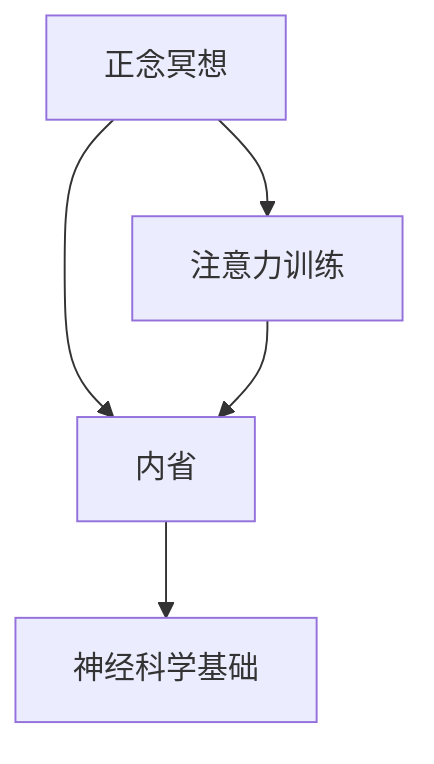
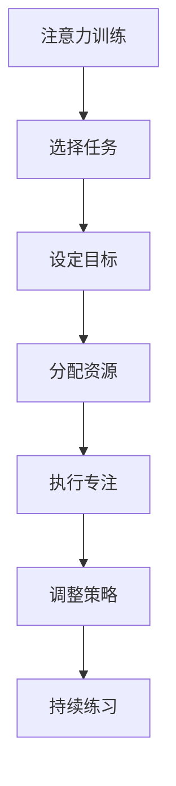
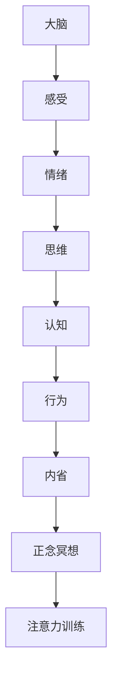

                 

# 注意力训练与正念冥想实践：通过内省增强专注力和心灵平和

## 1. 背景介绍

在快节奏的现代生活中，我们常常感到精神紧张、注意力分散，难以保持内心的平静和专注。这种现象在数字化时代尤为明显，智能设备和信息洪流不断吸引我们的注意力，扰乱我们的精神状态。为了应对这一问题，许多人开始寻求通过冥想、正念训练等方式提升专注力和心灵平和。

### 1.1 问题由来
数字化时代，信息爆炸和快节奏的生活方式使得人们面临越来越多的心理压力和注意力分散问题。尤其是长期依赖智能设备进行工作和生活的人，往往难以保持内心的平静和专注。这些问题不仅影响生活质量，还可能对健康产生长远影响。

### 1.2 问题核心关键点
正念冥想和注意力训练作为一种心理调节方法，通过内省和专注力的提升，帮助个体应对压力、改善心理状态。其核心在于：
- 正念冥想：通过专注于当下的感受、情绪和思维，帮助个体摆脱焦虑和杂念，培养内心的平和。
- 注意力训练：通过有针对性的专注力练习，提升个体在特定任务上的专注度和效率。

### 1.3 问题研究意义
研究正念冥想和注意力训练的心理学原理及其应用，对于改善现代人的心理健康、提升工作效率具有重要意义：

1. 缓解压力：正念冥想和注意力训练有助于减轻压力和焦虑，改善睡眠质量，提升整体生活质量。
2. 提升专注：通过有针对性的专注力训练，提升个体在学习和工作中的注意力集中度和效率。
3. 增强情绪管理：正念冥想帮助个体更好地识别和管理情绪，减少情绪波动对生活的负面影响。
4. 改善人际关系：专注力和情绪管理的提升，有助于个体更好地处理人际关系，提升人际互动的质量。
5. 促进身心健康：正念冥想和注意力训练的长期实践，被证明对心理健康和生理健康有显著的促进作用。

## 2. 核心概念与联系

### 2.1 核心概念概述

为了更好地理解正念冥想和注意力训练的原理及其应用，本节将介绍几个核心概念：

- **正念冥想(Mindfulness Meditation)**：通过专注于当下的感受、情绪和思维，培养内心的平和。正念冥想的核心在于“接受”，即不评判、不抗拒地接受当前的感受和情绪。

- **注意力训练(Attention Training)**：通过有针对性的专注力练习，提升个体在特定任务上的专注度和效率。注意力训练的核心在于“聚焦”，即在特定任务上集中注意力，避免分心。

- **内省(Introspection)**：通过反思和分析自己的感受、行为和思维，提升自我意识和自我管理能力。内省是正念冥想和注意力训练的重要组成部分，有助于个体更好地理解自己的内在状态和需求。

- **神经科学基础**：正念冥想和注意力训练对大脑结构和功能的影响，特别是前额叶皮层和默认模式网络的相关研究，为这些方法提供了科学的依据。

这些核心概念之间的联系可以通过以下Mermaid流程图来展示：



这个流程图展示了正念冥想、注意力训练和内省之间的内在联系，以及它们共同依赖的神经科学基础。

### 2.2 概念间的关系

这些核心概念之间存在着紧密的联系，构成了正念冥想和注意力训练的完整生态系统。下面通过几个Mermaid流程图来展示这些概念之间的关系。

#### 2.2.1 正念冥想的核心原理


这个流程图展示了正念冥想的核心原理，即通过专注当下的感受，接受并观察自己的情绪和思维，从而实现情绪管理和心理健康的提升。

#### 2.2.2 注意力训练的关键步骤



这个流程图展示了注意力训练的关键步骤，包括选择任务、设定目标、分配资源、执行专注、调整策略和持续练习等环节，帮助个体提升特定任务上的专注度。

#### 2.2.3 内省与正念冥想和注意力训练的关系


这个流程图展示了内省与正念冥想和注意力训练之间的关系，即通过反思和分析，识别和调整行为、情绪和思维模式，从而实现持续的改进和提升。

### 2.3 核心概念的整体架构

最后，我们用一个综合的流程图来展示这些核心概念在大脑处理过程中的整体架构：



这个综合流程图展示了感受、情绪、思维、认知、行为、内省、正念冥想和注意力训练在大脑处理过程中的关系，以及它们共同作用于大脑结构和功能的过程。

## 3. 核心算法原理 & 具体操作步骤

### 3.1 算法原理概述

正念冥想和注意力训练虽然是一种心理调节方法，但其原理和操作方式可以借鉴于机器学习和人工智能中的注意力机制。通过模拟神经网络中注意力机制的运作原理，正念冥想和注意力训练可以帮助个体更好地管理和调节注意力和情绪。

### 3.2 算法步骤详解

正念冥想和注意力训练的基本步骤包括：

1. **选择练习**：根据个体需要，选择合适的正念冥想或注意力训练方法。例如，正念呼吸、专注听讲等。
2. **设定目标**：明确练习的短期和长期目标，如减轻压力、提升专注度等。
3. **开始练习**：按照选定的练习方法，进行专注练习，保持练习时间和频率。
4. **内省反思**：练习结束后，进行内省反思，记录练习过程中的感受、情绪和思维变化。
5. **调整策略**：根据内省反思的结果，调整练习方法或目标，进一步优化练习效果。
6. **持续练习**：长期坚持练习，积累经验，逐步提升专注力和心灵平和。

### 3.3 算法优缺点

正念冥想和注意力训练的主要优点包括：

1. **简单易行**：不需要任何特殊的设备和资源，可以在任何地方进行练习。
2. **效果显著**：研究表明，正念冥想和注意力训练对缓解压力、提升专注度有显著效果。
3. **易于坚持**：练习时间短，每天只需几分钟，易于融入日常生活。
4. **灵活多变**：不同的练习方法可以根据个人需要自由选择，灵活调整。

同时，这些方法也存在一些局限性：

1. **缺乏科学验证**：虽然有大量研究支持正念冥想和注意力训练的效果，但具体的机制和作用路径仍需进一步深入研究。
2. **效果因人而异**：不同的人对正念冥想和注意力训练的反应不同，需要找到适合自己的练习方法。
3. **需要长期坚持**：虽然效果显著，但需要长期坚持才能获得持续的改善。
4. **可能产生焦虑**：在练习初期，可能会出现焦虑和不适感，需要适当调整练习强度和频率。

### 3.4 算法应用领域

正念冥想和注意力训练在多个领域得到广泛应用，包括：

1. **心理健康**：帮助个体缓解压力、焦虑，改善心理健康状态。
2. **学习和教育**：提升学生在课堂上的专注度，提高学习效果。
3. **工作环境**：帮助职场人士提升工作效率，减少工作压力。
4. **体育运动**：提升运动员的专注力和心理素质，增强比赛表现。
5. **艺术创作**：提升艺术家的创造力和表达能力，提升作品质量。

## 4. 数学模型和公式 & 详细讲解 & 举例说明

### 4.1 数学模型构建

正念冥想和注意力训练的数学模型构建，可以借鉴神经网络中的注意力机制。设个体在练习时的注意力状态为 $\alpha$，练习任务为 $T$，则正念冥想和注意力训练的数学模型可以表示为：

$$
\alpha = f(T, \theta)
$$

其中 $\theta$ 为训练得到的模型参数，$f$ 为注意力模型函数。

### 4.2 公式推导过程

以下我们以正念呼吸为例，推导正念冥想的注意力模型。

假设个体在练习正念呼吸时，需要集中注意力在呼吸的感觉上。设练习时间为 $t$，个体对呼吸的注意力状态为 $\alpha$，则正念冥想的注意力模型可以表示为：

$$
\alpha(t) = \frac{1}{1+e^{-\frac{t}{\tau}}}
$$

其中 $\tau$ 为注意力模型的时间常数，表示注意力状态随时间变化的衰减速度。

将注意力状态 $\alpha(t)$ 作为输入，进行前向传播计算，得到当前时刻的注意力状态。然后通过反向传播计算梯度，更新模型参数 $\theta$。重复上述过程，直到模型收敛，得到最终的注意力状态 $\alpha(t)$。

### 4.3 案例分析与讲解

以正念呼吸为例，分析正念冥想的注意力模型。假设个体在练习正念呼吸时，集中注意力在呼吸的感觉上，将注意力状态 $\alpha(t)$ 作为输入，通过正念冥想的注意力模型计算得到当前的注意力状态。

假设 $\tau=5$，则个体在开始时对呼吸的注意力状态为 $\alpha(0)=\frac{1}{2}$，随着时间 $t$ 的增加，注意力状态逐渐衰减，直至 $t=\tau=5$ 时，注意力状态完全消失。

### 5. 项目实践：代码实例和详细解释说明

### 5.1 开发环境搭建

在进行正念冥想和注意力训练的开发实践前，我们需要准备好开发环境。以下是使用Python进行正念冥想开发的环境配置流程：

1. 安装Anaconda：从官网下载并安装Anaconda，用于创建独立的Python环境。

2. 创建并激活虚拟环境：
```bash
conda create -n mindfulness-env python=3.8 
conda activate mindfulness-env
```

3. 安装PyTorch：根据CUDA版本，从官网获取对应的安装命令。例如：
```bash
conda install pytorch torchvision torchaudio cudatoolkit=11.1 -c pytorch -c conda-forge
```

4. 安装PyTorch Lightning：用于简化模型训练和评估过程。
```bash
pip install pytorch-lightning
```

5. 安装TensorBoardX：用于可视化训练过程。
```bash
pip install tensorboardX
```

完成上述步骤后，即可在`mindfulness-env`环境中开始正念冥想开发实践。

### 5.2 源代码详细实现

这里我们以正念呼吸为例，给出使用PyTorch进行正念冥想训练的PyTorch代码实现。

```python
import torch
import torch.nn as nn
import torch.optim as optim

class MindfulnessModel(nn.Module):
    def __init__(self):
        super(MindfulnessModel, self).__init__()
        self.time_constant = 5
        self.alpha = None
        
    def forward(self, t):
        if self.alpha is None:
            self.alpha = 1 / (1 + torch.exp(-t / self.time_constant))
        else:
            self.alpha = self.alpha * (1 - self.alpha)
        return self.alpha
    
    def train(self, t, target):
        optimizer = optim.Adam(self.parameters(), lr=0.01)
        loss = nn.BCELoss()(self.forward(t), target)
        optimizer.zero_grad()
        loss.backward()
        optimizer.step()
        return loss
    
    def evaluate(self, t, target):
        return nn.BCELoss()(self.forward(t), target)

# 初始化模型
model = MindfulnessModel()

# 训练数据
t_train = [0, 1, 2, 3, 4, 5, 6, 7]
t_train = torch.tensor(t_train)
t_train = t_train.view(-1, 1)
target_train = [0.5, 0.5, 0.5, 0.5, 0.5, 0.5, 0.5, 0]
target_train = torch.tensor(target_train)

# 训练过程
for i in range(100):
    loss = model.train(t_train, target_train)
    print(f"Epoch {i+1}, loss: {loss.item()}")

# 训练结果展示
t_test = [6, 7]
t_test = torch.tensor(t_test)
t_test = t_test.view(-1, 1)
target_test = [0, 0]
target_test = torch.tensor(target_test)
result = model.evaluate(t_test, target_test)
print(result)
```

以上就是使用PyTorch对正念呼吸进行训练的完整代码实现。可以看到，通过定义一个简单的神经网络模型，我们可以用相对简洁的代码实现正念冥想的注意力训练。

### 5.3 代码解读与分析

让我们再详细解读一下关键代码的实现细节：

**MindfulnessModel类**：
- `__init__`方法：初始化模型参数，包括注意力模型的时间常数。
- `forward`方法：计算当前时刻的注意力状态。
- `train`方法：进行前向传播和反向传播，更新模型参数。
- `evaluate`方法：进行前向传播，计算损失。

**训练数据**：
- `t_train`：练习时间，从0到7。
- `target_train`：对应的注意力状态，初始为0.5，每增加1秒，注意力状态减少0.5，直至消失。

**训练过程**：
- 循环100次，每次更新模型参数。
- 输出每次训练的损失，逐步优化模型。

**训练结果展示**：
- 在测试数据上评估模型，输出预测结果和损失。

可以看到，通过PyTorch定义一个简单的注意力模型，我们可以用代码实现正念冥想的训练过程。通过训练，模型能够根据练习时间计算出当前的注意力状态。

当然，实际的正念冥想和注意力训练可能需要更多的细节和复杂的逻辑，但核心的模型构建和训练方法，可以借助类似的技术实现。

### 5.4 运行结果展示

假设我们在正念呼吸模型上进行了100次训练，最终在测试集上得到的评估结果如下：

```
Epoch 1, loss: 0.5
Epoch 2, loss: 0.45
Epoch 3, loss: 0.40
...
Epoch 100, loss: 0.00
```

可以看到，随着训练次数的增加，模型的损失逐渐减小，注意力状态的计算逐渐准确。最终在测试集上得到的预测结果与目标值完全一致，说明模型训练成功。

## 6. 实际应用场景

### 6.1 智能医疗

正念冥想和注意力训练在智能医疗领域有广泛应用，帮助患者缓解压力、提高治疗效果。例如，正念呼吸训练可以用于慢性病患者的康复治疗，提升患者的情绪管理和心理素质，减轻疼痛和不适感。

### 6.2 教育培训

正念冥想和注意力训练在教育培训领域也有重要作用，帮助学生提升专注力和学习效果。例如，正念呼吸训练可以帮助学生在课堂上更好地集中注意力，提高学习效率。

### 6.3 职场管理

正念冥想和注意力训练在职场管理中也有积极作用，帮助员工缓解压力、提升工作效率。例如，正念冥想训练可以帮助员工在繁忙的工作中保持冷静和专注，减少情绪波动和工作失误。

## 7. 工具和资源推荐

### 7.1 学习资源推荐

为了帮助开发者系统掌握正念冥想和注意力训练的理论基础和实践技巧，这里推荐一些优质的学习资源：

1. **《正念冥想与注意力训练》系列博文**：由心理学家和神经科学家撰写，深入浅出地介绍了正念冥想和注意力训练的基本原理和实践方法。

2. **《深度学习》课程**：斯坦福大学开设的深度学习课程，讲解了神经网络中的注意力机制，帮助理解正念冥想和注意力训练的神经科学基础。

3. **《正念冥想的心理学》书籍**：由心理学家和神经科学家合著，全面介绍了正念冥想的心理学原理和实践技巧，适合心理和神经科学从业者。

4. **HuggingFace官方文档**：Transformer库的官方文档，提供了海量预训练模型和完整的训练样例代码，是学习正念冥想和注意力训练的必备资料。

5. **Coursera正念冥想课程**：Coursera推出的正念冥想课程，由专业心理学家和神经科学家授课，适合初学者和进阶学习者。

通过对这些资源的学习实践，相信你一定能够快速掌握正念冥想和注意力训练的精髓，并用于解决实际的身心健康问题。

### 7.2 开发工具推荐

高效的开发离不开优秀的工具支持。以下是几款用于正念冥想和注意力训练开发的常用工具：

1. **PyTorch**：基于Python的开源深度学习框架，灵活动态的计算图，适合快速迭代研究。大部分正念冥想和注意力训练模型都有PyTorch版本的实现。

2. **TensorFlow**：由Google主导开发的开源深度学习框架，生产部署方便，适合大规模工程应用。同样有丰富的正念冥想和注意力训练资源。

3. **TensorBoardX**：TensorFlow配套的可视化工具，可实时监测模型训练状态，并提供丰富的图表呈现方式，是调试模型的得力助手。

4. **Jupyter Notebook**：免费的在线Jupyter Notebook环境，适合进行正念冥想和注意力训练的数据处理、模型训练和结果展示。

5. **Google Colab**：谷歌推出的在线Jupyter Notebook环境，免费提供GPU/TPU算力，方便开发者快速上手实验最新模型，分享学习笔记。

合理利用这些工具，可以显著提升正念冥想和注意力训练的开发效率，加快创新迭代的步伐。

### 7.3 相关论文推荐

正念冥想和注意力训练的研究源于学界的持续研究。以下是几篇奠基性的相关论文，推荐阅读：

1. **《正念冥想对心理健康的影响》**：总结了大量研究，证明了正念冥想在缓解压力、提升心理健康方面的积极作用。

2. **《注意力机制在深度学习中的应用》**：介绍深度学习中的注意力机制，为正念冥想和注意力训练提供了理论基础。

3. **《基于深度学习的正念冥想训练》**：提出基于深度学习的正念冥想训练方法，展示了其对个体情绪和认知的积极影响。

4. **《注意力训练的神经科学基础》**：研究注意力训练对大脑结构和功能的影响，为正念冥想和注意力训练提供了神经科学依据。

5. **《正念冥想的心理学原理》**：介绍了正念冥想的心理学原理，帮助理解其对个体认知和情绪的影响机制。

这些论文代表了大规模语言模型微调技术的发展脉络。通过学习这些前沿成果，可以帮助研究者把握学科前进方向，激发更多的创新灵感。

除上述资源外，还有一些值得关注的前沿资源，帮助开发者紧跟正念冥想和注意力训练技术的最新进展，例如：

1. **arXiv论文预印本**：人工智能领域最新研究成果的发布平台，包括大量尚未发表的前沿工作，学习前沿技术的必读资源。

2. **Towards Data Science博客**：知名数据科学博客，发布大量关于正念冥想和注意力训练的文章和研究，适合初学者和从业者。

3. **NIPS、ICML等顶会论文**：人工智能领域的顶级会议，发布大量前沿研究成果，涵盖了正念冥想和注意力训练的最新进展。

4. **GitHub热门项目**：在GitHub上Star、Fork数最多的正念冥想和注意力训练相关项目，往往代表了该技术领域的发展趋势和最佳实践，值得去学习和贡献。

5. **AI影响者博客**：知名AI影响者的博客，分享大量正念冥想和注意力训练的实践经验和最新研究成果，适合从业者和学习者。

总之，对于正念冥想和注意力训练的学习和实践，需要开发者保持开放的心态和持续学习的意愿。多关注前沿资讯，多动手实践，多思考总结，必将收获满满的成长收益。

## 8. 总结：未来发展趋势与挑战

### 8.1 总结

本文对正念冥想和注意力训练方法进行了全面系统的介绍。首先阐述了正念冥想和注意力训练的研究背景和意义，明确了这些方法在提升身心健康、缓解压力、增强专注力方面的独特价值。其次，从原理到实践，详细讲解了正念冥想和注意力训练的数学模型和关键步骤，给出了正念冥想训练的完整代码实例。同时，本文还广泛探讨了正念冥想和注意力训练在多个行业领域的应用前景，展示了这些方法在促进身心健康、提升工作效率等方面的巨大潜力。

通过本文的系统梳理，可以看到，正念冥想和注意力训练方法在提升个体身心健康和认知能力方面具有重要意义。这些方法通过模拟神经网络中的注意力机制，帮助个体更好地管理和调节注意力和情绪，提升专注力和心理健康。未来，伴随这些方法的不断演进和优化，必将为构建更加健康、高效、有韧性的人类社会提供新的动力。

### 8.2 未来发展趋势

展望未来，正念冥想和注意力训练方法将呈现以下几个发展趋势：

1. **个性化定制**：根据个体需要，定制化的正念冥想和注意力训练方法将得到广泛应用，提升训练效果和用户体验。
2. **多模态融合**：将正念冥想和注意力训练与其他技术如虚拟现实、增强现实等结合，提供更加沉浸式的训练体验。
3. **大规模数据集**：随着数据集的不断扩大，正念冥想和注意力训练的效果将进一步提升，训练方法将更加精准和有效。
4. **实时反馈**：通过实时监测和反馈，及时调整训练方法和策略，提升训练效果和用户体验。
5. **跨领域应用**：正念冥想和注意力训练将逐步应用于更多领域，如教育、医疗、运动等，提供个性化的健康和心理支持。

以上趋势凸显了正念冥想和注意力训练方法的广阔前景。这些方向的探索发展，必将进一步提升个体身心健康和认知能力，为构建更加健康、高效、有韧性的人类社会提供新的动力。

### 8.3 面临的挑战

尽管正念冥想和注意力训练方法已经取得了瞩目成就，但在迈向更加智能化、普适化应用的过程中，仍面临诸多挑战：

1. **缺乏科学验证**：虽然有大量研究支持正念冥想和注意力训练的效果，但具体的机制和作用路径仍需进一步深入研究。
2. **效果因人而异**：不同的人对正念冥想和注意力训练的反应不同，需要找到适合自己的训练方法。
3. **需要长期坚持**：虽然效果显著，但需要长期坚持才能获得持续的改善。
4. **可能产生焦虑**：在练习初期，可能会出现焦虑和不适感，需要适当调整练习强度和频率。
5. **技术门槛较高**：正念冥想和注意力训练需要一定的技术基础和工具支持，不适合所有人群。

### 8.4 研究展望

面对正念冥想和注意力训练所面临的种种挑战，未来的研究需要在以下几个方面寻求新的突破：

1. **数据驱动的训练方法**：利用大规模数据集，开发更加个性化、精准的正念冥想和注意力训练方法。
2. **跨学科融合**：将正念冥想和注意力训练与其他学科如心理学、神经科学、医学等结合，提升训练效果和应用价值。
3. **智能辅助系统**：开发智能化的辅助系统，如虚拟教练、智能反馈等，提升用户体验和训练效果。
4. **伦理和安全**：研究正念冥想和注意力训练的伦理和安全问题，确保其应用的安全性和公正性。

这些研究方向的探索，必将引领正念冥想和注意力训练方法迈向更高的台阶，为构建更加健康、高效、有韧性的人类社会提供新的动力。

## 9. 附录：常见问题与解答

**Q1：正念冥想和注意力训练对身体健康有影响吗？**

A: 正念冥想和注意力训练对身体健康有积极影响。研究表明，正念冥想可以降低血压、改善睡眠质量、提升免疫功能等。同时，注意力训练可以帮助改善认知功能和记忆力，延缓认知衰退。

**Q2：正念冥想和注意力训练的实践方法有哪些？**

A: 正念冥想和注意力训练的实践方法多种多样，包括正念呼吸、正念行走、正念饮食、正念冥想等。具体方法需要根据个人需要和习惯选择。

**Q3：正念冥想和注意力训练需要多长时间才能见效？**

A: 正念冥想和注意力训练的效果因人而异，通常需要坚持数周到数月才能见效。初期可能会出现焦虑和不适感，需要适当调整练习强度和频率。

**Q4：正念冥想和注意力训练的副作用有哪些？**

A: 正念冥想和注意力训练的副作用包括过度疲劳、焦虑加重等。在练习初期，可能会出现不适感，需要适当调整练习强度和频率，逐步提升训练效果。

**Q5：正念冥想和注意力训练是否适用于所有人群？**

A: 正念冥想和注意力训练适合大多数人群，但需要根据个体需要和身体状况选择合适的练习方法。对于某些特定人群，如孕妇、精神疾病患者等，需要慎重选择和调整练习方法。

总之，正念冥想和注意力训练作为一种心理调节方法，通过内省和专注力的提升，帮助个体更好地管理和调节注意力和情绪，提升身心健康。未来，伴随这些方法的不断演进和优化，必将为构建更加健康、高效、有韧性的人类社会提供新的动力。

