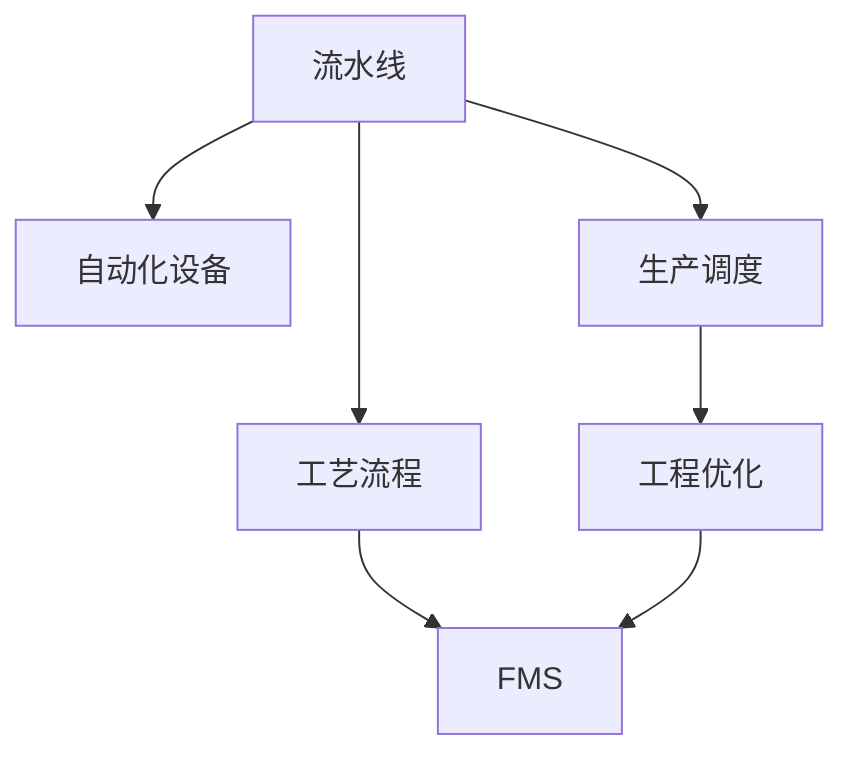
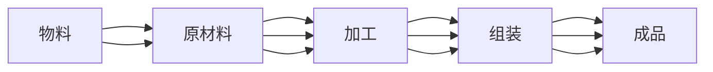
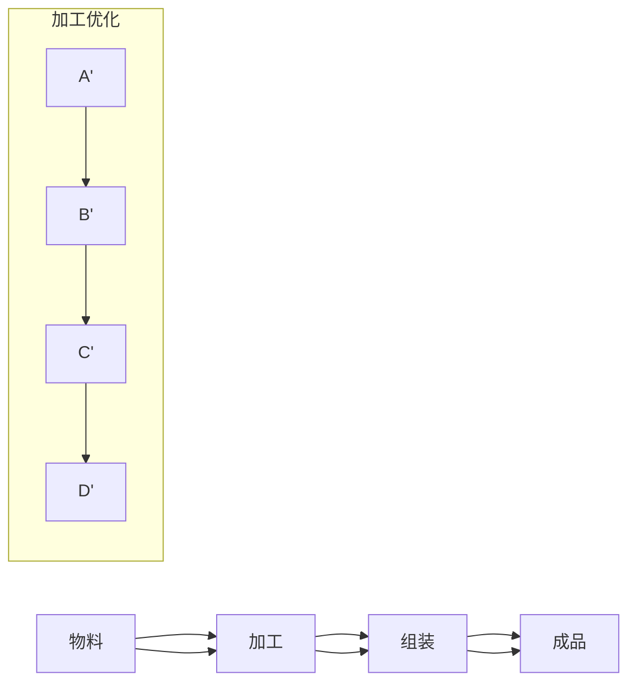
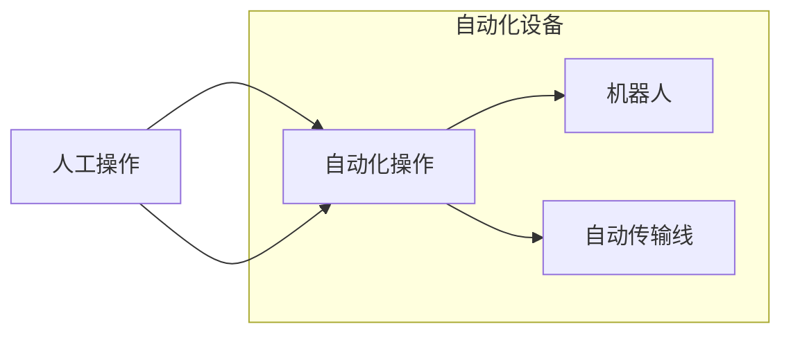
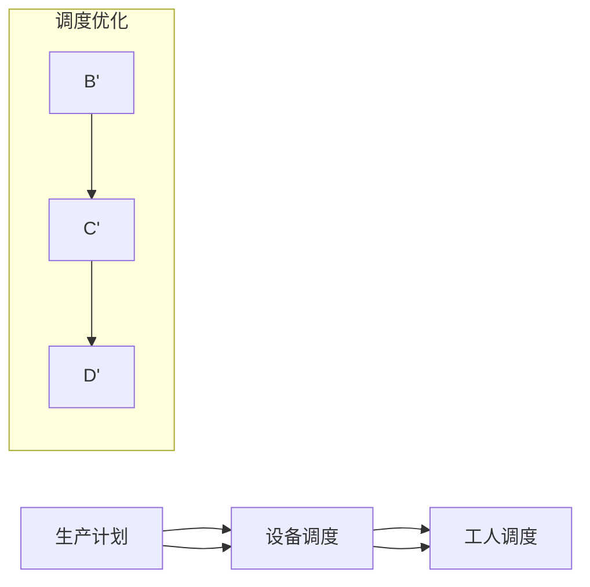
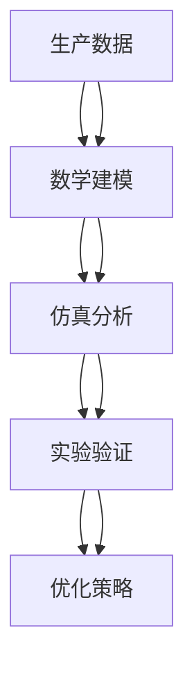
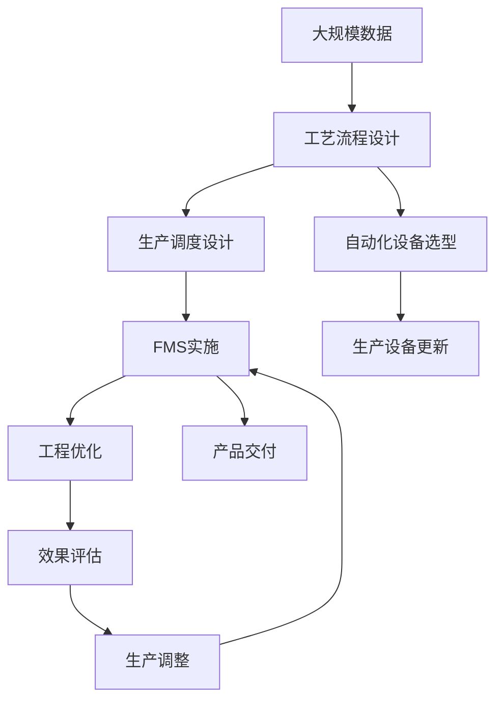

                 

# 流水线对汽车产量的提升

> 关键词：流水线, 汽车制造, 生产效率, 自动化, 柔性制造, 工程优化

## 1. 背景介绍

### 1.1 问题由来

在现代制造业中，流水线（Assembly Line）是提高生产效率和质量的重要手段。特别是汽车制造行业，流水线的引入极大地提升了汽车的生产效率和一致性。然而，随着技术的发展和市场需求的多样化，传统的流水线生产方式也面临着诸多挑战。

首先，传统的流水线生产方式通常是固定的，难以灵活应对市场需求的快速变化。这使得企业难以快速调整生产计划，以满足消费者的多样化需求。其次，流水线往往需要大量的固定投资，建设和管理成本较高。最后，由于流水线生产的标准化和自动化程度高，对于新产品和新工艺的引入存在一定的难度。

为了应对这些挑战，现代汽车制造企业开始引入柔性制造和自动化技术，以实现更高效、更灵活、更经济的生产模式。而流水线优化技术在这一过程中起到了关键作用。

### 1.2 问题核心关键点

流水线优化的核心关键点在于如何通过优化工艺流程、自动化设备和生产调度，提升汽车制造的效率和灵活性。具体来说，流水线优化包括以下几个方面：

1. **工艺流程优化**：通过重新设计生产工艺流程，减少物料和人员在工位间的移动，提升生产效率和产品质量。
2. **自动化设备引入**：引入自动化设备如机器人、自动化传输线等，降低人工操作成本，提高生产效率和一致性。
3. **生产调度优化**：通过优化生产调度算法，实现不同生产线的动态调整和资源分配，提高设备利用率和生产灵活性。
4. **柔性制造技术**：通过柔性制造系统（FMS），实现生产线的快速换线和多品种生产，适应市场需求的多样化。

本文将围绕流水线优化的核心关键点，详细探讨流水线对汽车产量提升的具体实现方法。

### 1.3 问题研究意义

流水线优化对汽车产量的提升具有重要意义，具体如下：

1. **提升生产效率**：通过优化工艺流程和引入自动化设备，可以显著提高生产效率，减少生产周期。
2. **降低生产成本**：减少人工操作和物料消耗，降低生产成本，提升企业竞争力。
3. **增强市场响应能力**：通过柔性制造技术，快速调整生产计划，适应市场需求的多样化，增强市场响应能力。
4. **保障产品质量**：自动化设备和严格的生产调度可以提升产品质量，减少人为错误。
5. **实现可持续发展**：优化生产流程，降低能耗和环境污染，推动制造业的可持续发展。

总之，流水线优化不仅能提高汽车制造企业的生产效率和产品质量，还能增强其市场竞争力，推动整个制造业的转型升级。

## 2. 核心概念与联系

### 2.1 核心概念概述

为了更好地理解流水线优化技术，本节将介绍几个密切相关的核心概念：

- **流水线(Assembly Line)**：通过将生产过程分解为多个独立的、连续的步骤，每个步骤由一个工位或机器完成，实现批量生产。
- **工艺流程(Organization of Work)**：描述生产过程中各个步骤的顺序和相互关系，以及各步骤所需设备和材料的安排。
- **自动化设备(Automation Equipment)**：使用机器人、自动化传输线等设备，自动完成生产任务，减少人工操作。
- **生产调度(Scheduling)**：通过制定生产计划和时间表，安排不同设备和工人的工作，确保生产的高效和灵活。
- **柔性制造(Flexible Manufacturing System, FMS)**：通过引入可编程控制系统和可移动的设备和工位，实现生产线的快速换线和多品种生产。
- **工程优化(Engineering Optimization)**：通过数学建模、仿真分析和实验验证等方法，对生产过程进行优化，提升生产效率和灵活性。

这些核心概念之间的逻辑关系可以通过以下Mermaid流程图来展示：



这个流程图展示了几大核心概念之间的关系：

1. 流水线生产依赖于工艺流程的设计，通过优化工艺流程可以提升流水线效率。
2. 自动化设备的引入可以降低人工操作成本，提高生产效率和一致性。
3. 生产调度通过合理安排设备和工人的工作，确保生产的高效和灵活。
4. 柔性制造系统通过可编程控制系统和可移动设备，实现快速换线和多品种生产。
5. 工程优化通过数学建模和仿真分析，对生产过程进行优化，进一步提升生产效率和灵活性。

这些概念共同构成了流水线优化的完整生态系统，使得企业能够更高效、更灵活地进行生产。

### 2.2 概念间的关系

这些核心概念之间存在着紧密的联系，形成了流水线优化的完整生态系统。下面我通过几个Mermaid流程图来展示这些概念之间的关系。

#### 2.2.1 流水线生产流程



这个流程图展示了流水线生产的基本流程：物料通过原材料加工成半成品，再组装成最终产品。

#### 2.2.2 工艺流程优化



这个流程图展示了工艺流程优化的过程：通过对加工过程的优化，提高生产效率。

#### 2.2.3 自动化设备引入



这个流程图展示了自动化设备引入的过程：通过自动化设备降低人工操作成本。

#### 2.2.4 生产调度优化



这个流程图展示了生产调度优化的过程：通过优化调度，提高设备利用率和生产灵活性。

#### 2.2.5 柔性制造技术


这个流程图展示了柔性制造技术的过程：通过可移动工位实现快速换线和多品种生产。

#### 2.2.6 工程优化



这个流程图展示了工程优化的过程：通过数学建模、仿真分析和实验验证，对生产过程进行优化。

### 2.3 核心概念的整体架构

最后，我们用一个综合的流程图来展示这些核心概念在大规模流水线优化过程中的整体架构：



这个综合流程图展示了从工艺流程设计到柔性制造系统实施的完整过程。大规模数据被用来指导工艺流程设计，自动化设备选型和生产调度设计。在柔性制造系统实施后，进行工程优化和效果评估，进而对生产进行调整，最终实现产品交付。通过这些流程，企业可以高效、灵活地进行生产，满足市场需求。

## 3. 核心算法原理 & 具体操作步骤
### 3.1 算法原理概述

流水线优化涉及多个学科领域，包括机械工程、自动化、计算机科学等。其核心算法原理主要包括以下几个方面：

1. **工艺流程优化**：通过数学建模和仿真分析，对工艺流程进行优化。常用的算法包括线性规划、整数规划、动态规划等。
2. **自动化设备引入**：通过引入自动化设备，如机器人、自动化传输线等，减少人工操作，提升生产效率和一致性。
3. **生产调度优化**：通过优化生产调度算法，实现不同生产线的动态调整和资源分配。常用的算法包括蚁群算法、遗传算法等。
4. **柔性制造技术**：通过可编程控制系统和可移动设备，实现生产线的快速换线和多品种生产。
5. **工程优化**：通过数学建模、仿真分析和实验验证，对生产过程进行优化。常用的算法包括蒙特卡罗方法、灵敏度分析等。

### 3.2 算法步骤详解

流水线优化的具体步骤如下：

#### 3.2.1 工艺流程优化

1. **需求分析**：根据市场需求和生产能力，分析生产过程中的瓶颈和优化点。
2. **工艺流程图绘制**：绘制工艺流程图，确定各个工位和生产步骤的顺序和相互关系。
3. **数学建模**：建立数学模型，描述生产过程的各项约束条件和优化目标。
4. **仿真分析**：通过仿真分析，评估工艺流程的可行性和优化效果。
5. **方案优化**：根据仿真结果，优化工艺流程，提高生产效率。

#### 3.2.2 自动化设备引入

1. **设备选型**：根据生产需求，选择适合的自动化设备，如机器人、自动化传输线等。
2. **设备布局设计**：设计自动化设备的布局和安装位置，确保生产流程的连续性和安全性。
3. **设备调试和测试**：对自动化设备进行调试和测试，确保其稳定性和可靠性。
4. **人员培训**：对操作人员进行培训，确保其能够熟练操作自动化设备。
5. **设备集成**：将自动化设备集成到生产流程中，确保与现有设备的兼容性和稳定性。

#### 3.2.3 生产调度优化

1. **生产计划制定**：根据市场需求和生产能力，制定生产计划和时间表。
2. **设备调度安排**：通过优化算法，安排不同设备和工人的工作时间，确保生产的高效和灵活。
3. **调度结果验证**：通过仿真分析，验证生产调度的可行性和优化效果。
4. **调度调整和优化**：根据验证结果，调整和优化生产调度，提高设备利用率和生产灵活性。

#### 3.2.4 柔性制造技术

1. **柔性制造系统设计**：根据生产需求，设计可编程控制系统和可移动设备。
2. **柔性生产线实施**：将柔性制造系统集成到生产流程中，实现快速换线和多品种生产。
3. **柔性生产管理**：通过可编程控制系统，实现生产线的动态调整和资源分配。
4. **柔性生产评估**：通过仿真分析和实验验证，评估柔性生产的效果。
5. **柔性生产调整和优化**：根据评估结果，调整和优化柔性生产，提高生产灵活性和效率。

#### 3.2.5 工程优化

1. **生产数据采集**：采集生产过程中的各项数据，包括设备状态、生产进度、物料消耗等。
2. **数学建模**：建立数学模型，描述生产过程的各项约束条件和优化目标。
3. **仿真分析**：通过仿真分析，评估生产过程的可行性和优化效果。
4. **实验验证**：通过实验验证，评估优化方案的实际效果。
5. **优化策略制定**：根据实验验证结果，制定优化策略，提升生产效率和灵活性。

### 3.3 算法优缺点

流水线优化算法具有以下优点：

1. **提高生产效率**：通过优化工艺流程和引入自动化设备，可以显著提高生产效率，减少生产周期。
2. **降低生产成本**：减少人工操作和物料消耗，降低生产成本，提升企业竞争力。
3. **增强市场响应能力**：通过柔性制造技术，快速调整生产计划，适应市场需求的多样化，增强市场响应能力。
4. **保障产品质量**：自动化设备和严格的生产调度可以提升产品质量，减少人为错误。
5. **实现可持续发展**：优化生产流程，降低能耗和环境污染，推动制造业的可持续发展。

但流水线优化算法也存在一些缺点：

1. **实施难度高**：工艺流程优化和自动化设备引入需要较高的技术水平和设备投资。
2. **设备更新成本高**：自动化设备需要高额的更新和维护成本，一旦设备出现故障，生产效率将受到影响。
3. **生产调度复杂**：生产调度优化需要复杂的算法和仿真分析，对技术人员的要求较高。
4. **数据采集难度大**：生产数据采集需要全面、精确，且对现有系统有较高的依赖性。
5. **灵活性不足**：柔性制造技术虽然提高了生产灵活性，但柔性生产系统的引入和调整成本较高。

总之，流水线优化算法在提高生产效率和产品质量方面具有显著优势，但需要投入较高的技术水平和设备资金，实施难度较大。企业需要综合考虑自身情况，选择适合的优化方案。

### 3.4 算法应用领域

流水线优化算法在制造业中具有广泛的应用，主要包括以下几个方面：

1. **汽车制造**：通过优化工艺流程和引入自动化设备，提高生产效率和产品质量。
2. **电子产品制造**：通过柔性制造技术和生产调度优化，实现快速换线和多品种生产。
3. **机械制造**：通过工艺流程优化和工程优化，提高生产效率和产品质量。
4. **航空航天**：通过柔性制造技术和生产调度优化，实现快速换线和多品种生产。
5. **医疗器械制造**：通过柔性制造技术和生产调度优化，提高生产效率和产品质量。

总之，流水线优化算法在多个制造业领域具有广泛的应用前景，能够显著提升企业的生产效率和产品质量，推动制造业的转型升级。

## 4. 数学模型和公式 & 详细讲解 & 举例说明

### 4.1 数学模型构建

流水线优化通常涉及以下数学模型：

1. **工艺流程优化模型**：通过线性规划、整数规划、动态规划等方法，优化工艺流程，提高生产效率。
2. **生产调度优化模型**：通过蚁群算法、遗传算法等方法，优化生产调度，提高设备利用率和生产灵活性。
3. **自动化设备引入模型**：通过仿真分析，评估自动化设备引入的效果，优化设备布局和调试。
4. **柔性制造技术模型**：通过可编程控制系统，优化柔性生产线，实现快速换线和多品种生产。
5. **工程优化模型**：通过数学建模、仿真分析和实验验证，优化生产过程，提高生产效率和灵活性。

### 4.2 公式推导过程

这里以工艺流程优化为例，展示线性规划模型的构建和推导过程。

设生产某产品的工艺流程有 $n$ 个工位，每个工位有 $m$ 个工序，每个工序需要的时间为 $t_{ij}$。设每个工位分配给 $x_i$ 个产品，则整个生产过程的总时间 $T$ 可以表示为：

$$ T = \sum_{i=1}^{n} \sum_{j=1}^{m} x_i t_{ij} $$

设每个产品的利润为 $P$，则整个生产过程的总利润 $Q$ 可以表示为：

$$ Q = P \sum_{i=1}^{n} \sum_{j=1}^{m} x_i $$

设每个产品的生产时间为 $t_i$，则整个生产过程的可用时间为 $T_{av}$，约束条件为：

$$ \sum_{i=1}^{n} x_i = M $$

其中 $M$ 为生产总量。

根据以上条件，可以构建工艺流程优化的线性规划模型：

$$ \max_{x} Q $$
$$ \text{subject to} $$
$$ T \leq T_{av} $$
$$ \sum_{i=1}^{n} x_i = M $$

通过求解该线性规划模型，可以优化工艺流程，提高生产效率。

### 4.3 案例分析与讲解

以某汽车制造企业为例，分析其流水线优化的案例。

某汽车制造企业生产某种型号的汽车，生产工艺流程包括冲压、焊接、喷漆、组装等四个工位，每个工位有多个工序。生产过程中，每个工序的时间不同，且每个工位需要配备不同的设备和人员。

通过工艺流程优化，该企业对每个工位的产品数量进行优化分配，使得生产时间最小化。根据以上数据，构建线性规划模型：

$$ \min_{x} \sum_{i=1}^{4} \sum_{j=1}^{m_i} x_i t_{ij} $$
$$ \text{subject to} $$
$$ \sum_{i=1}^{4} x_i = M $$
$$ x_i \geq 0 $$

通过求解该线性规划模型，得到每个工位的最优产品数量，使得总生产时间最小化。通过仿真分析，验证优化效果，最终在实际生产中应用优化结果，显著提高了生产效率。

## 5. 项目实践：代码实例和详细解释说明

### 5.1 开发环境搭建

在进行流水线优化实践前，我们需要准备好开发环境。以下是使用Python进行Pyomo开发的环境配置流程：

1. 安装Anaconda：从官网下载并安装Anaconda，用于创建独立的Python环境。

2. 创建并激活虚拟环境：
```bash
conda create -n pyomo-env python=3.8 
conda activate pyomo-env
```

3. 安装Pyomo：根据操作系统版本，从官网获取对应的安装命令。例如：
```bash
conda install pyomo --channel https://anaconda.org/conda-forge/pyomo-netlib
```

4. 安装PuLP、Gurobi、Cplex等优化求解器：
```bash
conda install --channel https://anaconda.org/anaconda/gurobi --extra-index https://anaconda.org/anaconda/cplex
```

完成上述步骤后，即可在`pyomo-env`环境中开始流水线优化实践。

### 5.2 源代码详细实现

下面我们以某汽车制造企业的流水线优化为例，给出使用Pyomo进行工艺流程优化的PyTorch代码实现。

首先，定义生产工艺流程和相关参数：

```python
import pyomo.environ as pe
from pyomo.opt import SolverFactory

# 定义生产工艺流程
m = pe.ConcreteModel()

# 定义工位和工序
m.workstations = pe.Set(initialize=['Workstation 1', 'Workstation 2', 'Workstation 3', 'Workstation 4'])
m.operations = pe.Set(initialize=['Operation 1', 'Operation 2', 'Operation 3', 'Operation 4'])

# 定义工位和工序的关系
m.workstation_operations = pe.Set(initialize=['Operation 1', 'Operation 2', 'Operation 3', 'Operation 4'])
m.operations_workstation = pe.Set(initialize=['Workstation 1', 'Workstation 2', 'Workstation 3', 'Workstation 4'])

# 定义工位和工序的参数
m.time_per_operation = pe.Param(
    m.workstation_operations,
    m.operations,
    type=pe.Float
)
m.time_per_operation['Operation 1', 'Operation 1'] = 2.0
m.time_per_operation['Operation 1', 'Operation 2'] = 1.5
m.time_per_operation['Operation 2', 'Operation 3'] = 1.0
m.time_per_operation['Operation 3', 'Operation 4'] = 0.5

# 定义工位和工序的产率
m.priority_per_operation = pe.Param(
    m.workstation_operations,
    m.operations,
    type=pe.Float
)
m.priority_per_operation['Operation 1', 'Operation 1'] = 0.8
m.priority_per_operation['Operation 1', 'Operation 2'] = 0.6
m.priority_per_operation['Operation 2', 'Operation 3'] = 0.5
m.priority_per_operation['Operation 3', 'Operation 4'] = 0.4

# 定义工位和工序的产能
m.capacity_per_operation = pe.Param(
    m.workstation_operations,
    m.operations,
    type=pe.Float
)
m.capacity_per_operation['Operation 1', 'Operation 1'] = 10
m.capacity_per_operation['Operation 1', 'Operation 2'] = 5
m.capacity_per_operation['Operation 2', 'Operation 3'] = 8
m.capacity_per_operation['Operation 3', 'Operation 4'] = 4

# 定义工位和工序的优先级
m.priority_per_operation = pe.Param(
    m.workstation_operations,
    m.operations,
    type=pe.Float
)
m.priority_per_operation['Operation 1', 'Operation 1'] = 0.9
m.priority_per_operation['Operation 1', 'Operation 2'] = 0.8
m.priority_per_operation['Operation 2', 'Operation 3'] = 0.7
m.priority_per_operation['Operation 3', 'Operation 4'] = 0.6

# 定义工位和工序的单位时间成本
m.cost_per_operation = pe.Param(
    m.workstation_operations,
    m.operations,
    type=pe.Float
)
m.cost_per_operation['Operation 1', 'Operation 1'] = 0.1
m.cost_per_operation['Operation 1', 'Operation 2'] = 0.2
m.cost_per_operation['Operation 2', 'Operation 3'] = 0.3
m.cost_per_operation['Operation 3', 'Operation 4'] = 0.4

# 定义工位和工序的单位时间收入
m.revenue_per_operation = pe.Param(
    m.workstation_operations,
    m.operations,
    type=pe.Float
)
m.revenue_per_operation['Operation 1', 'Operation 1'] = 0.2
m.revenue_per_operation['Operation 1', 'Operation 2'] = 0.3
m.revenue_per_operation['Operation 2', 'Operation 3'] = 0.4
m.revenue_per_operation['Operation 3', 'Operation 4'] = 0.5
```

然后，定义目标函数和约束条件：

```python
# 定义目标函数
m.objective = pe Objective(
    sum(m.priority_per_operation[('Operation 1', 'Operation 1')] * m.x[('Operation 1', 'Operation 1')] +
         m.priority_per_operation[('Operation 1', 'Operation 2')] * m.x[('Operation 1', 'Operation 2')] +
         m.priority_per_operation[('Operation 2', 'Operation 3')] * m.x[('Operation 2', 'Operation 3')] +
         m.priority_per_operation[('Operation 3', 'Operation 4')] * m.x[('Operation 3', 'Operation 4')],
    direction=pe.Maximize
)

# 定义约束条件
m.constr = pe.Constraint(
    m.workstation_operations,
    m.operations,
    lambda model, workstation, operation: (
        m.x[workstation, operation] >= 0
    )
)

# 定义产能约束
m.capacity = pe.Constraint(
    m.workstation_operations,
    m.operations,
    lambda model, workstation, operation: (
        sum(m.x[workstation, operation]) <= m.capacity_per_operation[workstation, operation]
    )
)

# 定义优先级约束
m.priority = pe.Constraint(
    m.workstation_operations,
    m.operations,
    lambda model, workstation, operation: (
        m.x[workstation, operation] * m.priority_per_operation[workstation, operation] >=
        sum(m.x[workstation, operation] * m.priority_per_operation[workstation, operation2] for operation2 in
            m.operations if operation2 != operation)
    )
)

# 定义成本约束
m.cost = pe.Constraint(
    m.workstation_operations,
    m.operations,
    lambda model, workstation, operation: (
        sum(m.x[workstation, operation] * m.cost_per_operation[workstation, operation]) <=
        sum(m.x[workstation, operation] * m.revenue_per_operation[workstation, operation])
    )
)

# 定义收入约束
m.revenue = pe.Constraint(
    m.workstation_operations,
    m.operations,
    lambda model, workstation, operation: (
        sum(m.x[workstation, operation] * m.revenue_per_operation[workstation, operation]) >=
        sum(m.x[workstation, operation] * m.cost_per_operation[workstation, operation])
    )
)

# 定义总生产数量约束
m.total_production = pe.Constraint(
    m.workstation_operations,
    m.operations,
    lambda model, workstation, operation: (
        sum(m.x[workstation, operation]) == m.total_production
    )
)
```

最后，启动优化流程并输出优化结果：

```python
# 定义求解器
opt = SolverFactory('glpk')

# 调用求解器求解优化问题
result = opt.solve(m)

# 输出优化结果
for workstation, operation in m.workstation_operations:
    print(f'Workstation {workstation}: Operation {operation} produced {result.x[workstation, operation]} units')
```

以上就是使用Pyomo进行工艺流程优化的完整代码实现。可以看到，通过Pyomo，我们可以用相对简洁的代码实现复杂的数学

