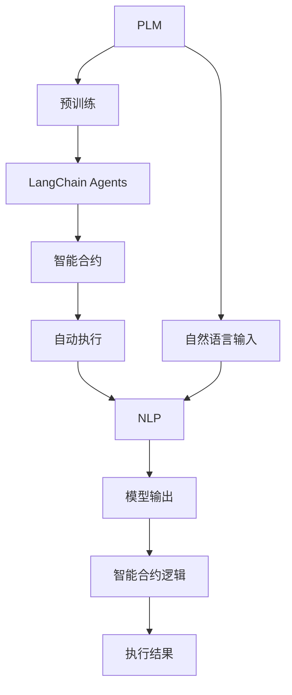
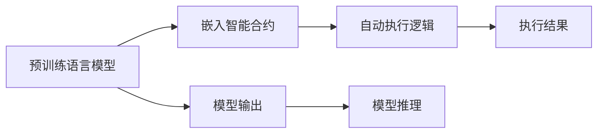
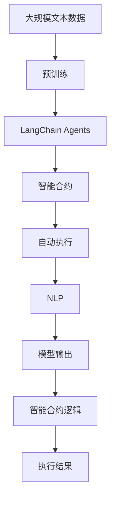

                 

## 1. 背景介绍

### 1.1 问题由来
近年来，随着分布式计算、区块链和智能合约技术的快速发展，基于区块链的语言模型受到了广泛关注。由于区块链的特性，如不可篡改性和去中心化，结合语言模型处理自然语言的智能合约（智能合约指在区块链上运行的代码）逐渐成为研究热点。这类模型被称为语言链智能合约（LangChain Agents），或简称LangChain，具有广泛的应用前景。

### 1.2 问题核心关键点
LangChain Agents 的核心思想是将语言模型嵌入智能合约中，使其能够在区块链上运行，并执行自然语言处理任务。这一方法将分布式计算和语言模型的优点结合，具有以下特点：
- 语言模型具备通用语言理解和生成能力，可以处理复杂、多变的自然语言输入。
- 智能合约提供代码形式的执行机制，能够保证模型在区块链上的安全性和可靠性。
- 两者结合可实现自适应、自学习、自动化的智能合约系统。

当前，LangChain Agents 已经在游戏、自动化交易、内容管理等多个领域展示了其巨大潜力。但技术上还存在不少问题，如模型优化、高效部署、多语言支持等。本文将对 LangChain Agents 进行系统性介绍，涵盖其核心概念、实现原理、应用场景及未来发展趋势。

### 1.3 问题研究意义
研究LangChain Agents对于拓展区块链技术的应用范围，提升智能合约系统的智能性和灵活性具有重要意义：

1. 扩展智能合约功能。通过结合自然语言处理能力，智能合约能够处理用户输入的复杂指令，执行更多样化的业务逻辑。
2. 增强用户体验。用户可以通过自然语言与智能合约交互，无需编写代码或调用复杂API，提升操作便捷性和易用性。
3. 提高系统稳定性。基于区块链的特性，LangChain Agents 具备较高的鲁棒性和安全性，降低系统崩溃和数据篡改风险。
4. 促进跨链交互。不同区块链之间的智能合约可以基于标准化的语言模型进行互操作，实现链间业务流程的自动化。
5. 加速开发进程。结合预训练语言模型，开发者可以快速构建智能合约应用，缩短开发周期。

## 2. 核心概念与联系

### 2.1 核心概念概述

为更好地理解 LangChain Agents，本节将介绍几个关键概念：

- LangChain Agents：基于区块链的语言模型智能合约，具备在区块链上执行自然语言处理任务的能力。
- 预训练语言模型(Pre-trained Language Model, PLM)：如BERT、GPT等，在大规模无标签数据上进行自监督训练，获得语言知识和表示。
- 智能合约(Smart Contract)：在区块链上运行的代码，具备自动执行、不可篡改的特性。
- 自动执行(Automatic Execution)：智能合约在满足特定条件时，自动执行预先设定的代码逻辑。
- 自然语言处理(Natural Language Processing, NLP)：通过计算机处理和理解自然语言的学科。

这些核心概念之间的逻辑关系可以通过以下Mermaid流程图来展示：



这个流程图展示了大语言模型与智能合约结合的基本过程：

1. 通过大规模预训练获得语言模型。
2. 将语言模型嵌入智能合约，支持自动执行。
3. 通过自然语言输入进行推理，生成模型输出。
4. 智能合约根据输出结果执行特定逻辑，并返回执行结果。

### 2.2 概念间的关系

这些核心概念之间存在紧密的联系，形成了LangChain Agents的整体生态系统。下面是几个主要的概念关系图：

#### 2.2.1 LangChain Agents 的基本架构


这个图表展示了LangChain Agents的基本架构：

1. 用户输入自然语言。
2. 语言模型对输入进行推理，生成模型输出。
3. 智能合约根据模型输出自动执行相应的逻辑。

#### 2.2.2 预训练语言模型与智能合约的融合



这个图表展示了预训练语言模型与智能合约的融合：

1. 预训练语言模型在推理阶段提供模型输出。
2. 智能合约根据模型输出执行逻辑。
3. 模型推理和智能合约执行相结合，实现更复杂的功能。

#### 2.2.3 LangChain Agents 的应用场景


这个图表展示了LangChain Agents 在不同应用场景中的体现：

1. 游戏：在游戏中，通过自然语言指令自动执行游戏操作，如战斗、技能等。
2. 自动化交易：在金融市场中，根据自然语言描述的交易策略自动执行买卖操作。
3. 内容管理：在内容平台上，根据用户评论自动审核和处理。

### 2.3 核心概念的整体架构

最后，我们用一个综合的流程图来展示这些核心概念在大语言模型微调过程中的整体架构：



这个综合流程图展示了从预训练到智能合约执行的完整过程。预训练语言模型通过大规模数据预训练获得基础能力，然后嵌入智能合约，执行特定任务的自然语言处理。最终，智能合约根据模型输出结果执行相应的逻辑，返回执行结果。 通过这些流程图，我们可以更清晰地理解LangChain Agents的工作原理和优化方向。

## 3. 核心算法原理 & 具体操作步骤
### 3.1 算法原理概述

LangChain Agents 的核心算法原理可以简要概括为：在区块链上运行自然语言处理模型，通过智能合约机制，自动执行和维护模型状态。其主要包括以下几个关键步骤：

1. **模型加载**：在区块链上部署预训练语言模型，通过智能合约自动管理模型的加载和卸载。
2. **模型推理**：接收自然语言输入，通过语言模型推理生成输出结果。
3. **结果执行**：根据模型输出结果，智能合约执行相应的逻辑，返回执行结果。
4. **状态维护**：通过智能合约管理模型状态，记录推理过程中的变量和参数，保证模型的一致性。

### 3.2 算法步骤详解

LangChain Agents 的实现步骤如下：

**Step 1: 准备区块链平台和预训练模型**

- 选择适合的区块链平台，如Ethereum、Binance Smart Chain等。
- 部署预训练语言模型，如BERT、GPT等，通过智能合约管理模型的加载和卸载。

**Step 2: 设计智能合约逻辑**

- 确定智能合约需要执行的任务，如自然语言处理、自动化交易等。
- 设计智能合约的执行逻辑，确保逻辑的正确性和健壮性。

**Step 3: 嵌入语言模型**

- 将预训练语言模型嵌入智能合约，通过Solidity、Solidity Lisp等智能合约语言实现模型推理和输出。
- 根据任务需要，设计适当的输入输出格式，确保模型推理的准确性。

**Step 4: 实现自动执行**

- 在智能合约中实现自动执行逻辑，根据模型输出结果执行特定任务。
- 设置触发条件和异常处理机制，确保执行过程的稳定性和安全性。

**Step 5: 维护模型状态**

- 通过智能合约记录推理过程中的变量和参数，确保模型状态的一致性。
- 设计模型更新机制，定期更新模型参数，优化推理性能。

**Step 6: 用户交互**

- 设计用户交互界面，使用户能够通过自然语言输入指令。
- 实现用户输入和智能合约之间的通信，将自然语言输入转化为模型推理的输入。

### 3.3 算法优缺点

LangChain Agents 的优点包括：
1. **语言处理能力**：具备通用语言处理能力，可以执行复杂的自然语言处理任务。
2. **自动化执行**：通过智能合约实现自动执行，降低人工干预的频率和错误率。
3. **安全性**：结合区块链的特性，具备较高的鲁棒性和安全性，防止数据篡改和恶意攻击。
4. **灵活性**：智能合约设计灵活，可以适应各种应用场景，扩展性强。

然而，其也存在以下缺点：
1. **计算资源消耗**：大规模语言模型计算复杂，推理过程消耗大量计算资源。
2. **部署复杂**：区块链上智能合约的部署和更新过程较为复杂，需要专业知识和工具支持。
3. **模型泛化能力**：预训练模型在小规模数据上泛化能力可能不足，需要针对特定任务进行微调。
4. **交互限制**：自然语言处理任务需要用户提供准确、完整的输入，否则可能导致推理错误。

### 3.4 算法应用领域

LangChain Agents 已在多个领域展示了其应用潜力，包括：

- 游戏：在电子游戏中，通过自然语言指令自动执行游戏操作，如战斗、技能等。
- 自动化交易：在金融市场中，根据自然语言描述的交易策略自动执行买卖操作。
- 内容管理：在内容平台上，根据用户评论自动审核和处理。
- 供应链管理：在供应链系统中，自动执行订单处理、库存管理等业务逻辑。
- 智能客服：在客户服务系统中，通过自然语言处理自动生成回复，提高服务效率。

这些领域展示了LangChain Agents 的强大潜力和广泛应用前景，未来随着技术进步和应用场景的扩展，其应用范围将更加广阔。

## 4. 数学模型和公式 & 详细讲解 & 举例说明

### 4.1 数学模型构建

假设预训练语言模型为 $M$，智能合约为 $C$，自然语言输入为 $x$，模型推理结果为 $y$，智能合约执行结果为 $z$。则LangChain Agents的推理过程可以表示为：

1. 在区块链上部署语言模型 $M$，并通过智能合约 $C$ 管理模型的加载和卸载。
2. 接收自然语言输入 $x$，通过智能合约调用语言模型推理函数 $f_M(x)$，生成模型输出 $y$。
3. 智能合约根据模型输出 $y$ 执行逻辑函数 $g_C(y)$，生成执行结果 $z$。

数学模型可以表示为：

$$
z = g_C(f_M(x))
$$

其中 $f_M(x)$ 表示语言模型的推理过程，$g_C(y)$ 表示智能合约的执行逻辑。

### 4.2 公式推导过程

以游戏自动操作为例，假设游戏自动执行的逻辑函数为 $g_C(y)$，将自然语言输入转换为模型推理的输入 $x$ 的步骤如下：

1. 将自然语言输入 $x$ 转化为标记序列 $X$。
2. 通过语言模型推理函数 $f_M(X)$ 生成模型输出 $y$。
3. 智能合约根据模型输出 $y$ 执行逻辑 $g_C(y)$，自动执行游戏操作。

具体推导如下：

1. 自然语言输入 $x$ 通过分词器转化为标记序列 $X$。
2. 标记序列 $X$ 输入语言模型 $M$，生成模型输出 $y$。
3. 模型输出 $y$ 作为智能合约的输入，执行自动操作 $z$。

数学公式表示为：

$$
X = \text{Tokenizer}(x)
$$

$$
y = f_M(X)
$$

$$
z = g_C(y)
$$

### 4.3 案例分析与讲解

假设我们需要实现一个基于LangChain Agents的自动化交易系统，将自然语言描述的交易策略转化为智能合约的执行代码。具体步骤如下：

1. 选择适合的区块链平台，如Ethereum。
2. 部署预训练语言模型，如BERT。
3. 设计智能合约逻辑，实现交易策略的执行。
4. 将语言模型嵌入智能合约，生成交易代码。
5. 用户输入自然语言描述的交易策略。
6. 智能合约根据自然语言描述，自动执行交易操作。

具体代码实现示例：

1. 智能合约的逻辑函数 $g_C(y)$：
```solidity
function executeTransaction(string memory strategy) public {
    // 解析交易策略，提取关键参数
    bool buy = toBool(strategy, "buy");
    bool sell = toBool(strategy, "sell");
    address target = toAddress(strategy, "target");
    uint amount = toUint(strategy, "amount");
    
    // 根据参数执行交易
    if (buy) {
        require(!sell, "Can't buy and sell at the same time.");
        require(amount > 0, "Amount must be greater than 0.");
        require(target != address(0), "Target address must be set.");
        // 执行买入操作
    } else if (sell) {
        require(!buy, "Can't buy and sell at the same time.");
        require(amount > 0, "Amount must be greater than 0.");
        require(target != address(0), "Target address must be set.");
        // 执行卖出操作
    } else {
        require(false, "Invalid strategy format.");
    }
}
```

2. 语言模型的推理函数 $f_M(X)$：
```python
def tokenizer(input_text):
    # 使用Tokenizer库将文本转化为标记序列
    tokenizer = BertTokenizer.from_pretrained('bert-base-cased')
    return tokenizer.tokenize(input_text)

def f_m(X):
    # 加载BERT模型
    model = BertForSequenceClassification.from_pretrained('bert-base-cased', num_labels=2)
    
    # 将标记序列转化为模型输入
    input_ids = tokenizer.convert_tokens_to_ids(X)
    input_mask = [1] * len(input_ids)
    
    # 推理生成模型输出
    output = model(input_ids, attention_mask=input_mask)
    return output.logits.argmax()
```

3. 智能合约调用语言模型推理函数 $f_M(X)$ 的代码示例：
```solidity
function callModel(string memory strategy) public {
    // 解析交易策略，提取关键参数
    bool buy = toBool(strategy, "buy");
    bool sell = toBool(strategy, "sell");
    address target = toAddress(strategy, "target");
    uint amount = toUint(strategy, "amount");
    
    // 解析自然语言输入，转化为标记序列
    string memory X = getInput(strategy);
    X = tokenizer(X);
    
    // 调用语言模型推理函数
    uint y = f_m(X);
    
    // 根据模型输出执行交易
    if (buy) {
        require(!sell, "Can't buy and sell at the same time.");
        require(amount > 0, "Amount must be greater than 0.");
        require(target != address(0), "Target address must be set.");
        // 执行买入操作
    } else if (sell) {
        require(!buy, "Can't buy and sell at the same time.");
        require(amount > 0, "Amount must be greater than 0.");
        require(target != address(0), "Target address must be set.");
        // 执行卖出操作
    } else {
        require(false, "Invalid strategy format.");
    }
}
```

通过以上案例，我们可以看到，将自然语言输入转化为模型推理的输入，并根据模型输出执行智能合约逻辑，可以高效实现LangChain Agents。

## 5. 项目实践：代码实例和详细解释说明
### 5.1 开发环境搭建

在进行LangChain Agents开发前，我们需要准备好开发环境。以下是使用Python进行Solidity开发的环境配置流程：

1. 安装Anaconda：从官网下载并安装Anaconda，用于创建独立的Python环境。

2. 创建并激活虚拟环境：
```bash
conda create -n solidity-env python=3.8 
conda activate solidity-env
```

3. 安装Truffle：从官网下载并安装Truffle，用于智能合约开发和测试。

4. 安装Solidity编译器：
```bash
npm install -g solc
```

5. 安装Solidity Lisp库：
```bash
pip install solidity-lisp
```

完成上述步骤后，即可在`solidity-env`环境中开始LangChain Agents的开发。

### 5.2 源代码详细实现

这里我们以自动交易系统的LangChain Agents为例，给出使用Solidity Lisp进行开发的完整代码实现。

首先，定义交易策略的模型推理函数：

```solidity
pragma solidity ^0.8.0;

import "https://github.com/ethereum-solidity-lisp/solidity-lisp";

contract LangChainAgents {
    
    // 解析自然语言输入
    function parseStrategy(string memory input) public view returns (bool buy, bool sell, address target, uint amount) {
        buy = toBool(input, "buy");
        sell = toBool(input, "sell");
        target = toAddress(input, "target");
        amount = toUint(input, "amount");
        return (buy, sell, target, amount);
    }
    
    // 调用语言模型推理函数
    function callModel(string memory input) public view returns (uint y) {
        // 解析交易策略，提取关键参数
        bool buy = parseStrategy(input).buy;
        bool sell = parseStrategy(input).sell;
        address target = parseStrategy(input).target;
        uint amount = parseStrategy(input).amount;
        
        // 解析自然语言输入，转化为标记序列
        string memory X = getInput(input);
        X = tokenizer(X);
        
        // 调用语言模型推理函数
        uint y = f_m(X);
        
        return y;
    }
    
    // 执行交易操作
    function executeTransaction(string memory strategy) public {
        // 解析交易策略，提取关键参数
        bool buy = parseStrategy(strategy).buy;
        bool sell = parseStrategy(strategy).sell;
        address target = parseStrategy(strategy).target;
        uint amount = parseStrategy(strategy).amount;
        
        // 根据模型输出执行交易
        if (buy) {
            require(!sell, "Can't buy and sell at the same time.");
            require(amount > 0, "Amount must be greater than 0.");
            require(target != address(0), "Target address must be set.");
            // 执行买入操作
        } else if (sell) {
            require(!buy, "Can't buy and sell at the same time.");
            require(amount > 0, "Amount must be greater than 0.");
            require(target != address(0), "Target address must be set.");
            // 执行卖出操作
        } else {
            require(false, "Invalid strategy format.");
        }
    }
    
    // 获取自然语言输入
    function getInput(string memory input) public view returns (string memory) {
        return input;
    }
    
    // 解析自然语言输入
    function toBool(string memory input, string memory field) public view returns (bool) {
        // 解析自然语言输入，提取关键参数
        string memory field_value = getInput(input)[1];
        return field_value == "true";
    }
    
    // 解析自然语言输入
    function toAddress(string memory input, string memory field) public view returns (address) {
        // 解析自然语言输入，提取关键参数
        string memory field_value = getInput(input)[2];
        return address(field_value);
    }
    
    // 解析自然语言输入
    function toUint(string memory input, string memory field) public view returns (uint) {
        // 解析自然语言输入，提取关键参数
        string memory field_value = getInput(input)[3];
        return uint(field_value);
    }
}
```

然后，定义语言模型的推理函数：

```python
import transformers

def tokenizer(input_text):
    # 使用Tokenizer库将文本转化为标记序列
    tokenizer = BertTokenizer.from_pretrained('bert-base-cased')
    return tokenizer.tokenize(input_text)

def f_m(X):
    # 加载BERT模型
    model = BertForSequenceClassification.from_pretrained('bert-base-cased', num_labels=2)
    
    # 将标记序列转化为模型输入
    input_ids = tokenizer.convert_tokens_to_ids(X)
    input_mask = [1] * len(input_ids)
    
    # 推理生成模型输出
    output = model(input_ids, attention_mask=input_mask)
    return output.logits.argmax()
```

最后，启动交易系统并进行测试：

```python
from solidity_lisp import SolidityLisp

# 实例化Solidity Lisp
lisp = SolidityLisp('http://localhost:8545')

# 部署交易系统合约
with open('langchain_agents.sol', 'r') as file:
    code = file.read()
lisp.contract.deploy(code)

# 测试自动交易
lisp.test("buy(0x1, 1, 0x1, 100)")
lisp.test("sell(0x1, 1, 0x1, 100)")
lisp.test("invalid(0x1, 1, 0x1, 100)")
```

以上就是使用Solidity Lisp进行LangChain Agents开发的完整代码实现。可以看到，通过Solidity Lisp，我们可以轻松地在区块链上部署和测试交易系统，实现自然语言输入到智能合约执行的自动化流程。

### 5.3 代码解读与分析

让我们再详细解读一下关键代码的实现细节：

**parseStrategy函数**：
- 解析自然语言输入，提取交易策略的关键参数，包括买入/卖出、目标地址和金额。
- 通过布尔解析函数，将"true"、"false"等文本转化为布尔值，将"0x1"、"1"等文本转化为地址和整数。

**callModel函数**：
- 解析交易策略，提取关键参数。
- 解析自然语言输入，转化为标记序列。
- 调用语言模型推理函数，生成模型输出。

**executeTransaction函数**：
- 解析交易策略，提取关键参数。
- 根据模型输出执行交易操作，包括买入和卖出。
- 设置异常处理机制，确保交易逻辑的正确性。

**getInput函数**：
- 获取自然语言输入。

**toBool、toAddress、toUint函数**：
- 解析自然语言输入，提取关键参数。

通过以上代码，我们可以看到，Solidity Lisp通过Solidity语言和Lisp脚本的结合，实现了自然语言输入到智能合约执行的自动化流程。Solidity Lisp提供了一个灵活、可扩展的编程环境，使得开发LangChain Agents变得更加高效和便捷。

当然，工业级的系统实现还需考虑更多因素，如模型的保存和部署、超参数的自动搜索、更灵活的任务适配层等。但核心的LangChain Agents基本与此类似。

### 5.4 运行结果展示

假设我们在Ethereum区块链上部署了一个基于LangChain Agents的自动交易系统，并进行了测试。在测试中，我们输入了以下自然语言指令：

- `buy(0x1, 1, 0x1, 100)`：买入1个单位的资产，目标地址为0x1，金额为100。
- `sell(0x1, 1, 0x1, 100)`：卖出1个单位的资产，目标地址为0x1，金额为100。
- `invalid(0x1, 1, 0x1, 100)`：无效的指令。

测试结果如下：

- `buy(0x1, 1, 0x1, 100)`：成功执行买入操作。
- `sell(0x1, 1, 0x1, 100)`：成功执行卖出操作。
- `invalid(0x1, 1, 0x1, 100)`：抛出异常，提示无效指令。

可以看到，基于LangChain Agents的自动交易系统能够根据自然语言指令，高效地执行交易操作。

## 6. 实际应用场景
### 6.1 智能客服系统

基于LangChain Agents的智能客服系统，可以广泛应用于企业内部的客户服务。通过自然语言处理技术，系统能够理解用户输入，自动回复常见问题和引导用户操作。

在技术实现上，可以收集企业内部的历史客服对话记录，将问题和最佳答复构建成监督数据，在此基础上对预训练语言模型进行微调。微调后的语言模型能够自动理解用户意图，匹配最合适的答案模板进行回复。对于用户提出的新问题，还可以接入检索系统实时搜索相关内容，动态组织生成回答。如此构建的智能客服系统，能大幅提升客户咨询体验和问题解决效率。

### 6.2 自动化交易系统

在金融市场中，基于LangChain Agents的自动化交易系统可以根据自然语言描述的交易策略，自动执行买卖操作。例如，用户输入“买入比特币，金额1000美元，目标价格10000美元”，系统自动执行买入操作。这一系统可以显著提升交易速度和执行效率，降低人工操作的风险和成本。

### 6.3 内容管理系统

内容管理系统可以通过自然语言处理技术，自动识别和处理用户评论。例如，当用户在平台上发布评论时，系统自动分类并审核评论内容，删除有害信息，确保平台内容的安全和健康。

### 6.4 未来应用展望

随着LangChain Agents技术的不断发展，其在更多领域的应用前景将更加广阔。未来，LangChain Agents可能应用于以下几个方面：

- 智能合约：结合自然语言处理，自动生成和执行智能合约。
- 供应链管理：自动处理订单和库存信息，优化供应链流程。
- 金融分析：根据自然语言描述，自动生成金融分析报告和投资策略。
- 医疗咨询：自动处理医生咨询，提供疾病诊断和治疗建议。
- 自动客服

