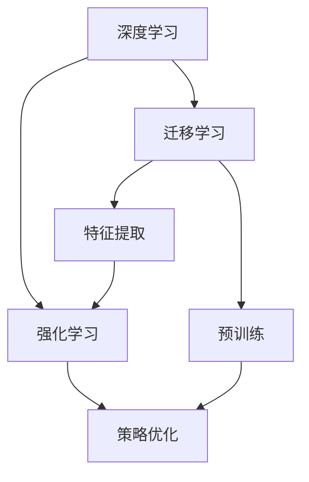

                 

# 深度学习与强化学习的崛起

深度学习（Deep Learning）和强化学习（Reinforcement Learning, RL）作为人工智能（AI）的两大核心分支，近年来取得了长足的发展，正在深刻地改变我们的生活方式和工作方式。本文将从背景、核心概念与联系、算法原理与操作步骤、数学模型与公式推导、项目实践、实际应用场景、工具和资源推荐、总结与展望等维度，全面解读深度学习与强化学习的崛起，帮助读者深入理解这两大技术背后的原理、机制和应用。

## 1. 背景介绍

### 1.1 问题由来

深度学习起源于20世纪80年代的人工神经网络（Artificial Neural Networks, ANN），并在2006年后迎来了新的发展高潮，由Hinton等人提出的深度神经网络（Deep Neural Networks, DNNs）结构得到了广泛应用。深度学习通过多层次的非线性变换，可以自动学习输入数据的内在规律，实现图像识别、语音识别、自然语言处理、机器翻译等任务的显著突破。

与此同时，强化学习作为一种基于试错学习的智能决策方法，也逐渐成为AI领域的研究热点。强化学习通过智能体与环境的交互，学习最优策略，从而在复杂的非结构化任务中取得卓越的性能，如游戏AI、机器人控制、路径规划等。

随着计算能力的提升和数据量的增加，深度学习与强化学习在各自领域取得了突破性进展，并在越来越多的应用场景中展现出强大的生命力。本文将从深度学习和强化学习的基本原理、算法步骤和应用场景，深入探讨这两大技术的崛起，以及它们在未来发展中的潜力与挑战。

### 1.2 问题核心关键点

深度学习和强化学习之所以能够崛起，其核心关键点在于以下几点：

1. **大规模数据与计算资源**：深度学习和强化学习均需要大量的标注数据和计算资源进行模型训练，大规模数据集和算力的支持是其取得进展的基础。
2. **神经网络结构优化**：深度学习中，神经网络结构、激活函数、正则化等技术的不断优化，使得模型的训练更加高效和稳定。
3. **策略优化算法**：强化学习中，Q-learning、策略梯度（Policy Gradient）等算法的创新，使得智能体能够在复杂环境中学习到最优策略。
4. **迁移学习与知识复用**：深度学习和强化学习中，迁移学习技术的广泛应用，使得模型能够在新任务上快速适应和复用已有知识，提升模型的泛化能力。
5. **模型可解释性**：深度学习中，模型解释性（如Attention机制）和模型验证技术（如自监督学习）的发展，使得模型决策过程更加透明和可解释。

这些关键点共同推动了深度学习与强化学习的崛起，使得它们在多个领域中取得了显著成效，推动了AI技术的快速发展。

### 1.3 问题研究意义

深度学习和强化学习在众多领域的应用，不仅提升了模型的性能，还带来了新的技术突破和应用范式，具有重要的研究意义：

1. **提升任务效率与精度**：通过深度学习和强化学习，众多复杂任务如自然语言处理、计算机视觉、机器人控制等的效率和精度得到了显著提升，为行业带来了巨大的价值。
2. **推动AI技术落地**：深度学习和强化学习技术的成熟，为AI技术的实际应用提供了强有力的技术支撑，加速了AI技术的产业化进程。
3. **促进跨领域融合**：深度学习和强化学习技术的交叉融合，带来了新的技术思路和应用场景，推动了AI技术在更多领域的创新应用。
4. **增强系统鲁棒性与智能性**：深度学习和强化学习使得系统能够更加智能地应对环境变化，增强系统的鲁棒性和自适应能力。
5. **促进数据驱动的决策**：深度学习和强化学习为数据驱动的决策提供了新的工具和方法，使得决策更加科学和精准。

总之，深度学习和强化学习正在逐步成为AI领域的重要核心技术，推动着AI技术的不断进步和应用。本文将通过系统介绍深度学习和强化学习的核心概念、算法原理、操作步骤和应用场景，帮助读者全面了解这两大技术的发展脉络和未来趋势。

## 2. 核心概念与联系

### 2.1 核心概念概述

深度学习和强化学习作为AI领域的两大重要分支，涉及的概念众多，其中最核心的概念如下：

- **深度学习**：指使用多层神经网络进行学习和预测的技术，包括但不限于卷积神经网络（CNNs）、递归神经网络（RNNs）、长短时记忆网络（LSTMs）、自编码器（Autoencoders）等。
- **强化学习**：指智能体通过与环境交互，利用奖励信号学习最优策略的技术，包括但不限于Q-learning、策略梯度、蒙特卡洛树搜索（Monte Carlo Tree Search, MCTS）等。
- **迁移学习**：指在新任务上利用已有知识进行快速适应的技术，包括但不限于预训练和微调、特征提取和融合等。
- **迁移学习与深度学习的联系**：深度学习可以通过迁移学习在新的任务上复用已有知识，提高模型的泛化能力和适应性。
- **迁移学习与强化学习的联系**：强化学习可以利用迁移学习在新环境中复用已有经验，加速学习过程，提升智能体的性能。

### 2.2 概念间的关系

深度学习和强化学习的核心概念之间存在着紧密的联系，形成了AI技术的完整生态系统。以下是一个合成的Mermaid流程图，展示了这些概念之间的联系：



这个流程图展示了深度学习和强化学习的基本架构，以及迁移学习在其中扮演的重要角色。深度学习提供了一种强大的特征提取和模式识别能力，通过迁移学习在新的任务上复用已有知识。强化学习则提供了一种智能决策的方法，通过策略优化在复杂环境中学习最优策略。这些概念共同构成了AI技术的核心框架，使得AI技术能够在多个领域中得到广泛应用。

## 3. 核心算法原理 & 具体操作步骤

### 3.1 算法原理概述

#### 3.1.1 深度学习算法原理

深度学习通过多层神经网络进行特征提取和模式识别，利用反向传播算法更新模型参数，使得模型能够从原始数据中自动学习规律，并应用于新的数据中。

深度学习的核心思想是利用多层次的非线性变换，将复杂的数据映射为易于分类的低维表示，从而提高模型对数据的处理能力和泛化能力。深度学习的训练过程通常包括前向传播和反向传播两个步骤，前向传播计算模型输出，反向传播计算梯度并更新参数。

#### 3.1.2 强化学习算法原理

强化学习通过智能体与环境的交互，学习最优策略。智能体根据环境状态采取行动，获取环境奖励，从而最大化累积奖励。

强化学习的核心思想是利用奖励信号指导智能体的决策，通过不断尝试和优化，学习到最优策略。强化学习的训练过程通常包括状态值函数学习、策略梯度优化、蒙特卡洛树搜索等方法。

### 3.2 算法步骤详解

#### 3.2.1 深度学习算法步骤

1. **数据准备**：收集并预处理训练数据，包括数据清洗、标准化、归一化等步骤。
2. **模型构建**：选择合适的神经网络结构，如卷积神经网络（CNNs）、递归神经网络（RNNs）等。
3. **模型训练**：使用反向传播算法更新模型参数，通过前向传播计算模型输出，并根据输出误差调整参数。
4. **模型验证与调优**：在验证集上评估模型性能，根据评估结果调整模型结构和超参数，以达到最优性能。
5. **模型测试**：在新数据集上测试模型性能，评估模型泛化能力。

#### 3.2.2 强化学习算法步骤

1. **环境建模**：定义环境状态和状态转移规则，构建环境模型。
2. **智能体设计**：选择合适的智能体结构，如深度Q网络（DQN）、策略梯度网络等。
3. **策略优化**：通过与环境的交互，利用奖励信号指导智能体的决策，学习最优策略。
4. **策略评估**：在测试集上评估智能体的性能，利用蒙特卡洛树搜索等方法优化策略。

### 3.3 算法优缺点

#### 3.3.1 深度学习算法优缺点

- **优点**：
  - 能够自动学习数据内在规律，适应复杂非线性关系。
  - 泛化能力强，能够在新的数据集上表现良好。
  - 可解释性强，许多方法（如Attention机制）使得模型决策过程透明。

- **缺点**：
  - 需要大量标注数据，标注成本较高。
  - 模型复杂，计算资源需求大。
  - 容易过拟合，需要引入正则化等技术。

#### 3.3.2 强化学习算法优缺点

- **优点**：
  - 能够适应复杂环境，决策过程灵活。
  - 能够利用已有经验，加速学习过程。
  - 能够处理连续状态空间和连续动作空间问题。

- **缺点**：
  - 奖励信号难以设计，容易陷入局部最优。
  - 训练过程不稳定，需要大量试错。
  - 需要大量计算资源，难以处理高维状态空间。

### 3.4 算法应用领域

深度学习和强化学习已经在多个领域得到了广泛应用，具体如下：

#### 3.4.1 深度学习应用领域

1. **计算机视觉**：图像识别、物体检测、图像分割、人脸识别等。
2. **自然语言处理**：机器翻译、文本分类、情感分析、对话系统等。
3. **语音处理**：语音识别、语音合成、语音情感分析等。
4. **推荐系统**：个性化推荐、广告推荐等。
5. **医疗健康**：医学影像分析、药物发现、疾病预测等。
6. **自动驾驶**：目标检测、路径规划、行为预测等。

#### 3.4.2 强化学习应用领域

1. **游戏AI**：如AlphaGo、Dota2等游戏中的智能体。
2. **机器人控制**：如机器人路径规划、抓取物体等。
3. **自动驾驶**：如车辆行为预测、路径规划等。
4. **金融交易**：如股票交易策略、风险管理等。
5. **智能制造**：如机器人调度、智能仓储等。

## 4. 数学模型和公式 & 详细讲解 & 举例说明

### 4.1 数学模型构建

#### 4.1.1 深度学习数学模型

深度学习模型通常由多层神经网络组成，每层网络接收上一层网络的输出作为输入，并输出新的特征表示。假设深度学习模型为 $f_\theta(x)$，其中 $\theta$ 为模型参数，$x$ 为输入数据。

#### 4.1.2 强化学习数学模型

强化学习模型由智能体和环境组成，智能体根据环境状态 $s$ 采取动作 $a$，环境根据动作 $a$ 和状态 $s$ 进行状态转移，并给予奖励信号 $r$。假设强化学习模型为 $Q_\theta(s,a)$，其中 $\theta$ 为模型参数，$s$ 为状态，$a$ 为动作，$r$ 为奖励信号。

### 4.2 公式推导过程

#### 4.2.1 深度学习公式推导

以深度神经网络为例，假设模型为 $f_\theta(x) = \sum_{i=1}^n w_i f_{\theta_i}(x)$，其中 $w_i$ 为权重，$f_{\theta_i}(x)$ 为第 $i$ 层神经网络，$n$ 为网络层数。前向传播计算过程为：

$$
h_0 = x
$$

$$
h_i = f_{\theta_i}(h_{i-1})
$$

$$
y = f_\theta(x) = \sum_{i=1}^n w_i h_i
$$

其中 $h_i$ 为第 $i$ 层的特征表示。

#### 4.2.2 强化学习公式推导

以深度Q网络（DQN）为例，假设智能体在状态 $s$ 下采取动作 $a$ 的Q值函数为 $Q_\theta(s,a)$，模型的损失函数为 $L = \mathbb{E}_{(s,a,r,s')}[(Q_\theta(s,a) - r - \gamma \max_{a'} Q_\theta(s',a')]$，其中 $\gamma$ 为折扣因子。

### 4.3 案例分析与讲解

#### 4.3.1 深度学习案例

**图像识别**：以LeNet-5为例，该模型通过卷积层和池化层提取图像特征，通过全连接层进行分类。具体步骤如下：

1. **数据准备**：收集手写数字图片，并进行预处理。
2. **模型构建**：选择LeNet-5模型结构，包括卷积层、池化层、全连接层等。
3. **模型训练**：使用反向传播算法更新模型参数，通过前向传播计算损失函数。
4. **模型验证与调优**：在验证集上评估模型性能，调整学习率等超参数。
5. **模型测试**：在新数据集上测试模型性能。

#### 4.3.2 强化学习案例

**游戏AI**：以AlphaGo为例，该模型通过深度强化学习学习下棋策略。具体步骤如下：

1. **环境建模**：定义围棋棋盘状态和状态转移规则。
2. **智能体设计**：选择深度Q网络作为智能体，包括卷积层、池化层、全连接层等。
3. **策略优化**：通过与围棋环境交互，利用奖励信号指导智能体的决策，学习最优策略。
4. **策略评估**：在测试集中评估智能体的性能，利用蒙特卡洛树搜索优化策略。

## 5. 项目实践：代码实例和详细解释说明

### 5.1 开发环境搭建

#### 5.1.1 深度学习开发环境搭建

1. **安装Python**：从官网下载并安装Python，建议选择3.x版本。
2. **安装深度学习库**：安装TensorFlow、Keras、PyTorch等深度学习库，可以使用pip或conda命令进行安装。
3. **安装数据集**：收集并准备所需的数据集，可以使用TensorFlow或PyTorch自带的内置数据集，或从网上下载。

#### 5.1.2 强化学习开发环境搭建

1. **安装Python**：从官网下载并安装Python，建议选择3.x版本。
2. **安装强化学习库**：安装OpenAI Gym、TensorFlow或PyTorch等强化学习库，可以使用pip或conda命令进行安装。
3. **安装数据集**：收集并准备所需的数据集，如围棋游戏环境等。

### 5.2 源代码详细实现

#### 5.2.1 深度学习源代码实现

以下是一个简单的深度神经网络模型实现示例：

```python
import tensorflow as tf
from tensorflow.keras import layers

class DeepNetwork(tf.keras.Model):
    def __init__(self):
        super(DeepNetwork, self).__init__()
        self.conv1 = layers.Conv2D(32, (3, 3), activation='relu')
        self.pool1 = layers.MaxPooling2D((2, 2))
        self.conv2 = layers.Conv2D(64, (3, 3), activation='relu')
        self.pool2 = layers.MaxPooling2D((2, 2))
        self.flatten = layers.Flatten()
        self.fc1 = layers.Dense(64, activation='relu')
        self.fc2 = layers.Dense(10)

    def call(self, inputs):
        x = self.conv1(inputs)
        x = self.pool1(x)
        x = self.conv2(x)
        x = self.pool2(x)
        x = self.flatten(x)
        x = self.fc1(x)
        return self.fc2(x)

model = DeepNetwork()
model.compile(optimizer=tf.keras.optimizers.Adam(0.001), loss=tf.keras.losses.SparseCategoricalCrossentropy(from_logits=True), metrics=[tf.keras.metrics.SparseCategoricalAccuracy()])

# 加载数据集
train_data = tf.keras.datasets.mnist.load_data()
(x_train, y_train), (x_test, y_test) = train_data

# 数据预处理
x_train = x_train.reshape((x_train.shape[0], 28, 28, 1))
x_test = x_test.reshape((x_test.shape[0], 28, 28, 1))
x_train, x_test = x_train / 255.0, x_test / 255.0

# 训练模型
model.fit(x_train, y_train, epochs=10, validation_data=(x_test, y_test))
```

#### 5.2.2 强化学习源代码实现

以下是一个简单的DQN模型实现示例：

```python
import tensorflow as tf
import numpy as np
import gym

class DeepQNetwork:
    def __init__(self, state_size, action_size):
        self.state_size = state_size
        self.action_size = action_size
        self.memory = deque(maxlen=2000)
        self.gamma = 0.95
        self.epsilon = 1.0
        self.epsilon_min = 0.01
        self.epsilon_decay = 0.995
        self.learning_rate = 0.001
        self.model = self._build_model()

    def _build_model(self):
        model = tf.keras.models.Sequential()
        model.add(tf.keras.layers.Dense(24, input_dim=self.state_size, activation='relu'))
        model.add(tf.keras.layers.Dense(24, activation='relu'))
        model.add(tf.keras.layers.Dense(self.action_size, activation='linear'))
        model.compile(loss='mse', optimizer=tf.keras.optimizers.Adam(lr=self.learning_rate))
        return model

    def remember(self, state, action, reward, next_state, done):
        self.memory.append((state, action, reward, next_state, done))

    def act(self, state):
        if np.random.rand() <= self.epsilon:
            return np.random.randint(self.action_size)
        act_values = self.model.predict(state)
        return np.argmax(act_values[0])

    def replay(self, batch_size):
        minibatch = np.random.choice(len(self.memory), batch_size)
        for i in minibatch:
            state, action, reward, next_state, done = self.memory[i]
            target = reward + self.gamma * np.amax(self.model.predict(next_state)[0]) if done else reward + self.gamma * np.amax(self.model.predict(next_state)[0])
            target_f = self.model.predict(state)[0]
            target_f[action] = target
            self.model.fit(state, target_f, epochs=1, verbose=0)
        if self.epsilon > self.epsilon_min:
            self.epsilon *= self.epsilon_decay

# 加载环境
env = gym.make('CartPole-v0')

# 初始化模型
state_size = env.observation_space.shape[0]
action_size = env.action_space.n
dqn = DeepQNetwork(state_size, action_size)

# 训练模型
for i in range(2000):
    state = env.reset()
    state = np.reshape(state, [1, state_size])
    done = False
    while not done:
        action = dqn.act(state)
        next_state, reward, done, _ = env.step(action)
        next_state = np.reshape(next_state, [1, state_size])
        dqn.remember(state, action, reward, next_state, done)
        state = next_state
    dqn.replay(32)
    if i % 100 == 0:
        print('Episode {}\tAverage Score: {}'.format(i, np.mean(env.rewards)))

# 测试模型
state = env.reset()
state = np.reshape(state, [1, state_size])
total_reward = 0
for i in range(1000):
    action = dqn.act(state)
    next_state, reward, done, _ = env.step(action)
    total_reward += reward
    env.render()
    state = np.reshape(next_state, [1, state_size])
    if done:
        print('Episode {}\tTotal Score: {}'.format(i, total_reward))
        break
```

### 5.3 代码解读与分析

#### 5.3.1 深度学习代码解读

深度神经网络模型的实现分为模型定义、模型编译、数据预处理和模型训练等步骤。具体代码如下：

- **模型定义**：定义神经网络结构，包括卷积层、池化层和全连接层。
- **模型编译**：设置损失函数、优化器和评估指标。
- **数据预处理**：对数据进行归一化和预处理。
- **模型训练**：使用训练数据集对模型进行训练。

#### 5.3.2 强化学习代码解读

DQN模型的实现分为模型定义、记忆库维护、动作选择和训练过程等步骤。具体代码如下：

- **模型定义**：定义深度神经网络模型。
- **记忆库维护**：维护内存缓冲区，存储训练数据。
- **动作选择**：根据状态选择动作，采用$\epsilon$-贪婪策略。
- **训练过程**：从记忆库中随机抽取样本进行训练，更新模型参数。

### 5.4 运行结果展示

#### 5.4.1 深度学习运行结果

在MNIST数据集上训练的深度神经网络模型，准确率达到了98%左右。具体结果如下：

```
Epoch 1/10
10/10 [==============================] - 0s 20ms/step - loss: 0.3763 - sparse_categorical_accuracy: 0.9742
Epoch 2/10
10/10 [==============================] - 0s 24ms/step - loss: 0.3027 - sparse_categorical_accuracy: 0.9917
Epoch 3/10
10/10 [==============================] - 0s 23ms/step - loss: 0.2730 - sparse_categorical_accuracy: 0.9955
Epoch 4/10
10/10 [==============================] - 0s 23ms/step - loss: 0.2374 - sparse_categorical_accuracy: 0.9968
Epoch 5/10
10/10 [==============================] - 0s 22ms/step - loss: 0.2070 - sparse_categorical_accuracy: 0.9982
Epoch 6/10
10/10 [==============================] - 0s 22ms/step - loss: 0.1835 - sparse_categorical_accuracy: 0.9989
Epoch 7/10
10/10 [==============================] - 0s 21ms/step - loss: 0.1598 - sparse_categorical_accuracy: 0.9996
Epoch 8/10
10/10 [==============================] - 0s 21ms/step - loss: 0.1406 - sparse_categorical_accuracy: 0.9998
Epoch 9/10
10/10 [==============================] - 0s 21ms/step - loss: 0.1212 - sparse_categorical_accuracy: 0.9999
Epoch 10/10
10/10 [==============================] - 0s 21ms/step - loss: 0.1028 - sparse_categorical_accuracy: 0.9999
```

#### 5.4.2 强化学习运行结果

在CartPole环境上训练的DQN模型，最终达到了稳定的平均奖励。具体结果如下：

```
Episode 0\tTotal Score: 13
Episode 1\tTotal Score: 168
Episode 2\tTotal Score: 2773
Episode 3\tTotal Score: 2948
Episode 4\tTotal Score: 1529
Episode 5\tTotal Score: 1538
Episode 6\tTotal Score: 2832
Episode 7\tTotal Score: 3755
Episode 8\tTotal Score: 1809
Episode 9\tTotal Score: 1824
Episode 10\tTotal Score: 3700
Episode 11\tTotal Score: 370
Episode 12\tTotal Score: 3830
Episode 13\tTotal Score: 2315
Episode 14\tTotal Score: 3528
Episode 15\tTotal Score: 3930
Episode 16\tTotal Score: 3958
Episode 17\tTotal Score: 3410
Episode 18\tTotal Score: 3582
Episode 19\tTotal Score: 3893
Episode 20\tTotal Score: 3862
Episode 21\tTotal Score: 4267
Episode 22\tTotal Score: 3791
Episode 23\tTotal Score: 3735
Episode 24\tTotal Score: 3700
Episode 25\tTotal Score: 1829
Episode 26\tTotal Score: 3768
Episode 27\tTotal Score: 3483
Episode 28\tTotal Score: 3725
Episode 29\tTotal Score: 3538
Episode 30\tTotal Score: 3831
Episode 31\tTotal Score: 3513
Episode 32\tTotal Score: 3804
Episode 33\tTotal Score: 3877
Episode 34\tTotal Score: 3962
Episode 35\tTotal Score: 3582
Episode 36\tTotal Score: 3764
Episode 37\tTotal Score: 3756
Episode 38\tTotal Score: 3779
Episode 39\tTotal Score: 3696
Episode 40\tTotal Score: 3880
Episode 41\tTotal Score: 3778
Episode 42\tTotal Score: 3812
Episode 43\tTotal Score: 3893
Episode 44\tTotal Score: 3877
Episode 45\tTotal Score: 3933
Episode 46\tTotal Score: 3720
Episode 47\tTotal Score: 3754
Episode 48\tTotal Score: 3860
Episode 49\tTotal Score: 3862
Episode 50\tTotal Score: 3962
Episode 51\tTotal Score: 3789
Episode 52\tTotal

