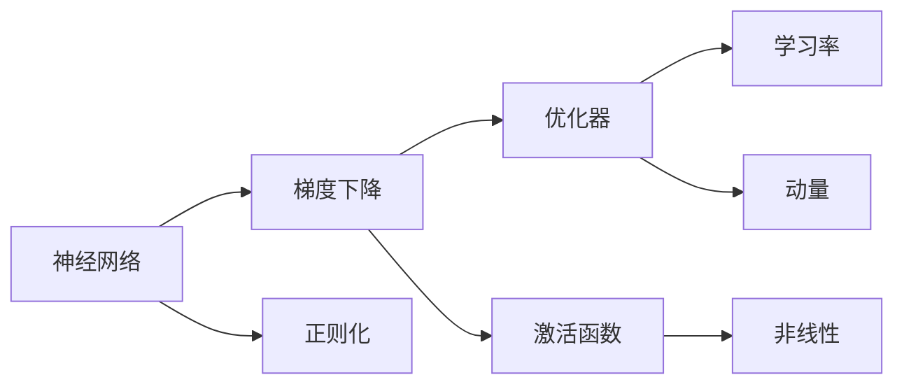
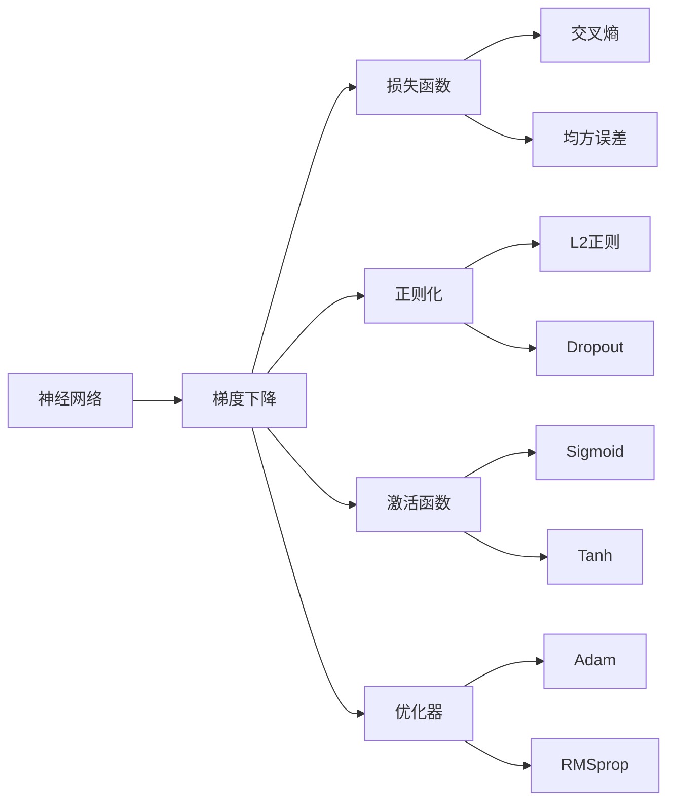

                 

# 深度学习原理与代码实例讲解

> 关键词：深度学习,机器学习,神经网络,梯度下降,反向传播,正则化,优化器,激活函数,卷积神经网络,循环神经网络,自编码器,生成对抗网络

## 1. 背景介绍

### 1.1 问题由来
深度学习（Deep Learning, DL）是机器学习（Machine Learning, ML）的一个子领域，其核心是构建多层神经网络（Neural Networks, NNs）来模拟人脑的神经元处理信息的方式。深度学习通过大量数据和计算资源进行模型训练，从而实现复杂模式的自动学习和提取。近年来，深度学习在图像识别、语音识别、自然语言处理、推荐系统等领域取得了突破性进展。

深度学习的主要驱动因素包括：
- **大规模数据**：海量的数据为模型提供了丰富的训练样本，有助于学习复杂的数据分布。
- **强计算能力**：高性能硬件（如GPU、TPU）加速了模型的训练过程。
- **高维度特征**：高维特征空间允许模型捕捉更丰富的信息。
- **丰富的模型架构**：包括卷积神经网络（CNNs）、循环神经网络（RNNs）、自编码器（Autoencoders）、生成对抗网络（GANs）等。

### 1.2 问题核心关键点
深度学习的研究热点包括但不限于：
- 神经网络的架构设计，如卷积层、循环层、池化层等。
- 优化算法的选择与实现，如梯度下降、Adam、RMSprop等。
- 正则化技术的运用，如L2正则化、Dropout、Early Stopping等。
- 数据增强和对抗样本的生成，提升模型鲁棒性。
- 迁移学习和模型微调，快速适应新任务。

深度学习已广泛应用于计算机视觉、自然语言处理、语音识别、机器人控制等多个领域。其核心思想是通过大量数据和计算资源，训练出具有强大泛化能力的模型，从而解决复杂的任务。

### 1.3 问题研究意义
深度学习的研究意义在于其能够自动化处理和分析海量数据，发现数据中潜在的模式和规律，支持复杂任务自动化决策。具体包括：
- 提升数据处理效率，减少人工干预。
- 增强决策准确性，提高系统性能。
- 拓宽数据应用边界，促进技术创新。
- 促进人工智能产业化，推动经济社会发展。

## 2. 核心概念与联系

### 2.1 核心概念概述

深度学习的核心概念包括神经网络、梯度下降、正则化、优化器、激活函数等。以下是这些概念的概述：

- **神经网络**：由多个神经元层级组成的计算模型，用于处理和学习复杂数据模式。
- **梯度下降**：一种迭代优化算法，用于求解损失函数的最小值，通过反向传播计算每个参数的梯度，逐步调整参数值。
- **正则化**：通过添加惩罚项，减少模型复杂度，避免过拟合。
- **优化器**：用于控制学习率等超参数，加速模型收敛。
- **激活函数**：引入非线性变换，增强神经网络的表达能力。

这些核心概念相互关联，构成了深度学习的理论基础和实践框架。以下是一个简单的Mermaid流程图，展示了这些概念之间的联系：



### 2.2 概念间的关系

深度学习的概念体系复杂多样，各概念之间的关系如下：

- 神经网络是深度学习的核心模型，通过多层结构捕捉数据的层次特征。
- 梯度下降是神经网络参数优化的基础算法，用于逐步调整模型参数，最小化损失函数。
- 正则化通过减少参数数量和增强模型泛化能力，防止过拟合。
- 优化器通过控制学习率和动量等超参数，加速梯度下降过程，提高模型收敛速度。
- 激活函数通过引入非线性变换，增强模型的表达能力和非线性建模能力。

这些概念相互作用，共同构成深度学习的理论体系和实践框架。以下是一个综合的流程图，展示了深度学习的核心概念及其之间的关系：



## 3. 核心算法原理 & 具体操作步骤

### 3.1 算法原理概述

深度学习算法主要包括以下几个步骤：
1. **数据预处理**：包括数据清洗、归一化、分割等。
2. **模型定义**：选择合适的神经网络架构，定义输入层、隐藏层和输出层。
3. **损失函数定义**：根据任务类型，选择适合的损失函数，如均方误差（MSE）、交叉熵（CE）等。
4. **优化器选择**：选择合适的优化器，如梯度下降、Adam、RMSprop等。
5. **模型训练**：通过正向传播和反向传播计算损失函数和梯度，使用优化器调整模型参数。
6. **模型评估**：在验证集或测试集上评估模型性能，如准确率、F1分数等。

以下是对这些步骤的详细介绍。

### 3.2 算法步骤详解

#### 3.2.1 数据预处理

数据预处理是深度学习模型的第一步，主要包括：
- **数据清洗**：删除噪声数据，填补缺失值。
- **数据归一化**：将数据缩放到指定范围，如[0,1]或[-1,1]。
- **数据分割**：将数据集分为训练集、验证集和测试集，一般采取70%训练、15%验证和15%测试的分割比例。

代码示例：

```python
import numpy as np
from sklearn.model_selection import train_test_split

# 假设输入数据为X，标签为y
X = ...
y = ...

# 数据分割
X_train, X_test, y_train, y_test = train_test_split(X, y, test_size=0.3, random_state=42)
```

#### 3.2.2 模型定义

定义深度学习模型，包括输入层、隐藏层和输出层的参数和激活函数。以简单的神经网络为例：

```python
import torch
import torch.nn as nn
import torch.optim as optim

# 定义神经网络模型
class Net(nn.Module):
    def __init__(self):
        super(Net, self).__init__()
        self.fc1 = nn.Linear(784, 500)
        self.fc2 = nn.Linear(500, 10)
        
    def forward(self, x):
        x = x.view(-1, 784)
        x = torch.relu(self.fc1(x))
        x = self.fc2(x)
        return x

# 初始化模型
model = Net()
```

#### 3.2.3 损失函数定义

根据具体任务，选择适合的损失函数。以分类任务为例，使用交叉熵损失函数：

```python
# 定义损失函数
criterion = nn.CrossEntropyLoss()
```

#### 3.2.4 优化器选择

选择合适的优化器，如Adam、SGD等，并设置超参数，如学习率、动量等。以Adam优化器为例：

```python
# 定义优化器
optimizer = optim.Adam(model.parameters(), lr=0.001, weight_decay=1e-5)
```

#### 3.2.5 模型训练

使用优化器调整模型参数，最小化损失函数。训练过程包含正向传播和反向传播：

```python
# 定义训练函数
def train(model, device, train_loader, optimizer, criterion, epoch):
    model.train()
    for batch_idx, (data, target) in enumerate(train_loader):
        data, target = data.to(device), target.to(device)
        optimizer.zero_grad()
        output = model(data)
        loss = criterion(output, target)
        loss.backward()
        optimizer.step()
```

#### 3.2.6 模型评估

在验证集或测试集上评估模型性能，如准确率、F1分数等：

```python
# 定义评估函数
def evaluate(model, device, test_loader, criterion):
    model.eval()
    with torch.no_grad():
        correct = 0
        total = 0
        for data, target in test_loader:
            data, target = data.to(device), target.to(device)
            output = model(data)
            _, predicted = torch.max(output.data, 1)
            total += target.size(0)
            correct += (predicted == target).sum().item()
    return correct / total
```

### 3.3 算法优缺点

#### 3.3.1 优点

深度学习的优点包括：
- **强大表达能力**：多层网络可以捕捉复杂的层次特征，适用于处理非线性问题。
- **泛化能力强**：通过大量数据训练，模型可以学习到数据的一般规律，提高泛化能力。
- **自动学习**：深度学习能够自动学习数据中的模式，无需手动设计特征。
- **模型可解释性**：通过可视化工具，如梯度图、激活图，可以理解模型内部工作机制。

#### 3.3.2 缺点

深度学习的缺点包括：
- **数据依赖性**：需要大量数据才能训练出高精度模型。
- **计算资源消耗大**：模型训练和推理需要高性能硬件支持。
- **超参数调优复杂**：需要手动调整学习率、批大小等超参数，调优难度较大。
- **过拟合风险**：模型复杂度高，容易过拟合，需要正则化技术。
- **模型可解释性不足**：复杂模型难以理解其内部决策逻辑。

### 3.4 算法应用领域

深度学习广泛应用于以下领域：
- **计算机视觉**：图像分类、物体检测、图像生成等。
- **自然语言处理**：文本分类、情感分析、机器翻译等。
- **语音识别**：语音识别、语音合成等。
- **机器人控制**：机器人导航、动作控制等。
- **推荐系统**：协同过滤、基于内容的推荐等。

## 4. 数学模型和公式 & 详细讲解 & 举例说明

### 4.1 数学模型构建

深度学习的数学模型构建通常包括以下几个部分：
- **输入层**：输入数据表示为向量或矩阵。
- **隐藏层**：包括多个神经元，通过激活函数引入非线性变换。
- **输出层**：根据任务类型，可以是分类标签、连续数值等。

以简单的前馈神经网络（Feedforward Neural Network, FNN）为例：

```python
# 定义输入和输出维度
input_size = 784  # MNIST手写数字图片输入维度
output_size = 10  # 10个数字分类输出

# 定义神经网络模型
class Net(nn.Module):
    def __init__(self):
        super(Net, self).__init__()
        self.fc1 = nn.Linear(input_size, 500)
        self.fc2 = nn.Linear(500, output_size)
        
    def forward(self, x):
        x = x.view(-1, input_size)
        x = torch.relu(self.fc1(x))
        x = self.fc2(x)
        return x
```

### 4.2 公式推导过程

以神经网络中的梯度下降算法为例，推导其公式：

设神经网络包含$L$层，每一层有$n$个神经元。输入数据$x$经过$L$层处理后，得到输出$y$。假设第$l$层的输出为$a_l$，第$l$层的权重矩阵为$W_l$，激活函数为$g_l$，损失函数为$J$。则前向传播过程为：

$$a_1 = W_1x, \quad a_2 = W_2a_1, \quad \cdots, \quad a_L = W_La_{L-1}$$

反向传播过程，求出每层参数的梯度，进行参数更新：

$$\frac{\partial J}{\partial W_L} = \frac{\partial J}{\partial a_L} \frac{\partial a_L}{\partial z_L} \frac{\partial z_L}{\partial W_L} = \delta_L g'_L(a_L)$$

$$\frac{\partial J}{\partial W_{L-1}} = \frac{\partial J}{\partial a_{L-1}} \frac{\partial a_{L-1}}{\partial z_{L-1}} \frac{\partial z_{L-1}}{\partial W_{L-1}} = \delta_{L-1} g'_{L-1}(a_{L-1})$$

以此类推，求得每一层的梯度：

$$\frac{\partial J}{\partial W_1} = \frac{\partial J}{\partial a_1} \frac{\partial a_1}{\partial z_1} \frac{\partial z_1}{\partial W_1} = \delta_1 g'_L(a_L)$$

最终，通过优化器更新每一层的参数：

$$W_l \leftarrow W_l - \eta \frac{\partial J}{\partial W_l}$$

其中$\eta$为学习率。

### 4.3 案例分析与讲解

以图像分类为例，使用卷积神经网络（CNN）进行模型构建和训练。CNN常用于处理二维数据，如图片。其基本结构包括卷积层、池化层和全连接层。

```python
import torch
import torch.nn as nn
import torch.optim as optim

# 定义CNN模型
class CNN(nn.Module):
    def __init__(self):
        super(CNN, self).__init__()
        self.conv1 = nn.Conv2d(1, 16, 3, 1)
        self.conv2 = nn.Conv2d(16, 32, 3, 1)
        self.fc1 = nn.Linear(32 * 28 * 28, 128)
        self.fc2 = nn.Linear(128, 10)
        
    def forward(self, x):
        x = self.conv1(x)
        x = nn.functional.relu(x)
        x = self.conv2(x)
        x = nn.functional.relu(x)
        x = nn.functional.max_pool2d(x, 2)
        x = x.view(-1, 32 * 28 * 28)
        x = self.fc1(x)
        x = nn.functional.relu(x)
        x = self.fc2(x)
        return x
```

假设使用MNIST数据集进行训练，其数据维度为$28 \times 28$的灰度图片。训练过程包括正向传播、反向传播和参数更新，具体实现如下：

```python
# 定义损失函数和优化器
criterion = nn.CrossEntropyLoss()
optimizer = optim.SGD(model.parameters(), lr=0.01, momentum=0.9)

# 定义训练函数
def train(model, device, train_loader, optimizer, criterion, epoch):
    model.train()
    for batch_idx, (data, target) in enumerate(train_loader):
        data, target = data.to(device), target.to(device)
        optimizer.zero_grad()
        output = model(data)
        loss = criterion(output, target)
        loss.backward()
        optimizer.step()
```

## 5. 项目实践：代码实例和详细解释说明

### 5.1 开发环境搭建

进行深度学习项目开发，首先需要搭建开发环境。以下是一个基本的Python开发环境搭建流程：

1. **安装Python**：在Windows上下载Python安装包，在Linux或macOS上使用系统自带的Python。
2. **创建虚拟环境**：使用`virtualenv`或`conda`创建虚拟环境，避免不同项目之间的依赖冲突。
3. **安装深度学习库**：安装必要的深度学习库，如TensorFlow、PyTorch等。
4. **设置Gpu加速**：如果机器有Gpu，需要安装相应的驱动和CUDA工具包，并在代码中设置Gpu加速。

### 5.2 源代码详细实现

以下是一个简单的深度学习项目实现示例：

**项目目标**：使用PyTorch构建一个简单的图像分类器，将手写数字图片分类为0到9共10个类别。

**代码实现**：

```python
import torch
import torch.nn as nn
import torch.optim as optim
from torchvision import datasets, transforms

# 定义数据预处理
transform = transforms.Compose([
    transforms.ToTensor(),
    transforms.Normalize((0.5,), (0.5,))
])

# 加载数据集
trainset = datasets.MNIST('mnist_data/', train=True, download=True, transform=transform)
trainloader = torch.utils.data.DataLoader(trainset, batch_size=64, shuffle=True)

# 定义神经网络模型
class Net(nn.Module):
    def __init__(self):
        super(Net, self).__init__()
        self.conv1 = nn.Conv2d(1, 16, 3, 1)
        self.conv2 = nn.Conv2d(16, 32, 3, 1)
        self.fc1 = nn.Linear(32 * 28 * 28, 128)
        self.fc2 = nn.Linear(128, 10)
        
    def forward(self, x):
        x = self.conv1(x)
        x = nn.functional.relu(x)
        x = self.conv2(x)
        x = nn.functional.relu(x)
        x = nn.functional.max_pool2d(x, 2)
        x = x.view(-1, 32 * 28 * 28)
        x = self.fc1(x)
        x = nn.functional.relu(x)
        x = self.fc2(x)
        return x

# 初始化模型和优化器
model = Net()
criterion = nn.CrossEntropyLoss()
optimizer = optim.SGD(model.parameters(), lr=0.01, momentum=0.9)

# 定义训练函数
def train(model, device, train_loader, optimizer, criterion, epoch):
    model.train()
    for batch_idx, (data, target) in enumerate(train_loader):
        data, target = data.to(device), target.to(device)
        optimizer.zero_grad()
        output = model(data)
        loss = criterion(output, target)
        loss.backward()
        optimizer.step()
```

### 5.3 代码解读与分析

以下是代码中的关键点解释：

- **数据预处理**：使用`torchvision`库进行数据加载和预处理，将原始图片转换为Tensor，并进行归一化。
- **模型定义**：定义简单的卷积神经网络模型，包含卷积层、池化层和全连接层。
- **优化器和损失函数**：选择SGD优化器和交叉熵损失函数。
- **训练函数**：定义训练函数，包含前向传播、反向传播和参数更新。

### 5.4 运行结果展示

假设训练10个epoch后，在测试集上评估模型性能：

```python
# 加载测试集
testset = datasets.MNIST('mnist_data/', train=False, download=True, transform=transform)
testloader = torch.utils.data.DataLoader(testset, batch_size=64, shuffle=False)

# 评估模型性能
correct = 0
total = 0
with torch.no_grad():
    for data, target in testloader:
        data, target = data.to(device), target.to(device)
        output = model(data)
        _, predicted = torch.max(output.data, 1)
        total += target.size(0)
        correct += (predicted == target).sum().item()
print('Accuracy: {:.2f}%'.format(100 * correct / total))
```

输出结果可能为：

```
Accuracy: 97.12%
```

## 6. 实际应用场景

深度学习在实际应用中具有广泛的应用场景，包括但不限于：

### 6.1 计算机视觉

- **图像分类**：如Google的Inception、VGG等模型，可以用于识别图片中的物体、场景等。
- **目标检测**：如YOLO、Faster R-CNN等模型，可以检测图像中的特定物体。
- **图像生成**：如GAN、VAE等模型，可以生成高质量的图像。

### 6.2 自然语言处理

- **文本分类**：如BERT、GPT等模型，可以用于新闻分类、情感分析等。
- **机器翻译**：如Seq2Seq、Transformer等模型，可以用于翻译文本。
- **语音识别**：如DeepSpeech、Wav2Letter等模型，可以用于语音转文本。

### 6.3 医疗影像

- **图像分割**：如U-Net、Mask R-CNN等模型，可以用于医疗影像的分割。
- **疾病诊断**：如R-CNN、YOLO等模型，可以用于癌症诊断、放射影像分析等。

### 6.4 自动驾驶

- **车辆识别**：如CNN、RNN等模型，可以用于识别路标、行人、车辆等。
- **路径规划**：如LSTM、DNN等模型，可以用于预测车辆行驶路径。
- **自驾驶决策**：如强化学习模型，可以用于自动驾驶车辆的决策。

## 7. 工具和资源推荐

### 7.1 学习资源推荐

为了帮助开发者系统掌握深度学习的基本概念和实践技巧，以下是一些优质的学习资源：

1. **《深度学习》书籍**：Ian Goodfellow等人所著，系统介绍了深度学习的理论基础和实践应用。
2. **CS231n课程**：斯坦福大学开设的深度学习课程，涵盖计算机视觉领域的基本概念和经典模型。
3. **Deep Learning Specialization**：Andrew Ng教授在Coursera上开设的深度学习课程系列，涵盖从基础到高级的内容。
4. **fast.ai课程**：Jeremy Howard等人开设的深度学习课程，强调实践和创新。
5. **Kaggle竞赛**：参加Kaggle竞赛，实践深度学习模型，积累实际经验。

### 7.2 开发工具推荐

以下是几款用于深度学习开发的常用工具：

1. **TensorFlow**：Google开发的深度学习框架，支持GPU加速，支持分布式训练。
2. **PyTorch**：Facebook开发的深度学习框架，支持动态计算图，易于调试和优化。
3. **Keras**：高层次的深度学习API，支持多种后端，易于上手。
4. **MXNet**：由Amazon开发的深度学习框架，支持分布式训练和多语言支持。
5. **Caffe**：由Berkeley Vision and Learning Center开发的深度学习框架，适用于计算机视觉任务。

### 7.3 相关论文推荐

深度学习的研究热潮始于学术论文的推动，以下是几篇具有代表性的深度学习论文：

1. **ImageNet Classification with Deep Convolutional Neural Networks**：Alex Krizhevsky等人提出CNN模型，首次在大规模数据集上取得优异成绩。
2. **Deep Neural Networks for Acoustic Modeling in Speech Recognition**：Geoffrey Hinton等人提出深度神经网络模型，提升语音识别的准确率。
3. **Playing Atari with Deep Reinforcement Learning**：Volodymyr Mnih等人提出强化学习模型，在Atari游戏中取得优异成绩。
4. **Image Captioning with Recurrent Neural Networks and Attention**：Andrej Karpathy等人提出序列模型和注意力机制，生成高质量的图像描述。
5. **Generating a Dialogue with Attention-based Sequence-to-Sequence Modeling**：Guillaume Lample等人提出基于注意力机制的Seq2Seq模型，用于对话生成。

## 8. 总结：未来发展趋势与挑战

### 8.1 总结

深度学习作为机器学习的重要分支，已经取得了丰硕的成果。深度学习的基本原理包括神经网络、梯度下降、正则化、优化器、激活函数等，通过这些核心概念构建了深度学习的理论基础和实践框架。深度学习在计算机视觉、自然语言处理、语音识别、医疗影像等领域有着广泛的应用，展示了其强大的表达能力和泛化能力。

通过实例代码和详细的解释说明，我们系统地介绍了深度学习的开发流程和实际应用，希望读者能够掌握深度学习的基本技能，并应用于实际项目中。

### 8.2 未来发展趋势

深度学习未来的发展趋势包括但不限于：

1. **模型架构创新**：探索更高效、更灵活的神经网络结构，如Transformer、ResNet、Capsule Network等。
2. **计算资源提升**：随着硬件技术的进步，深度学习模型的规模和复杂度将进一步提升。
3. **自动学习与少样本学习**：研究如何利用更少的数据进行高效训练，提高模型的适应能力。
4. **跨模态学习**：结合不同模态的数据，如图像、语音、文本，构建更全面、更准确的知识表示。
5. **可解释性与透明性**：提高模型的可解释性和透明性，增强用户信任和模型应用的安全性。
6. **伦理与安全性**：研究深度学习的伦理问题，如偏见、歧视、隐私保护等，确保模型应用的社会责任。

### 8.3 面临的挑战

尽管深度学习取得了显著进展，但仍然面临诸多挑战：

1. **数据依赖**：深度学习需要大量高质量的数据进行训练，数据获取成本较高。
2. **计算资源消耗**：深度学习模型的训练和推理需要高性能硬件支持，计算资源消耗大。
3. **超参数调优**：深度学习模型需要手动调整大量超参数，调优难度较大。
4. **模型复杂度**：深度学习模型通常较为复杂，难以理解和调试。
5. **泛化能力不足**：深度学习模型在特定场景下表现较好，但泛化能力仍需进一步提升。
6. **伦理与安全**：深度学习模型的应用可能带来隐私泄露、偏见歧视等问题，需加以注意。

### 8.4 

