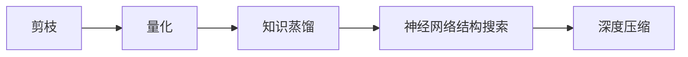
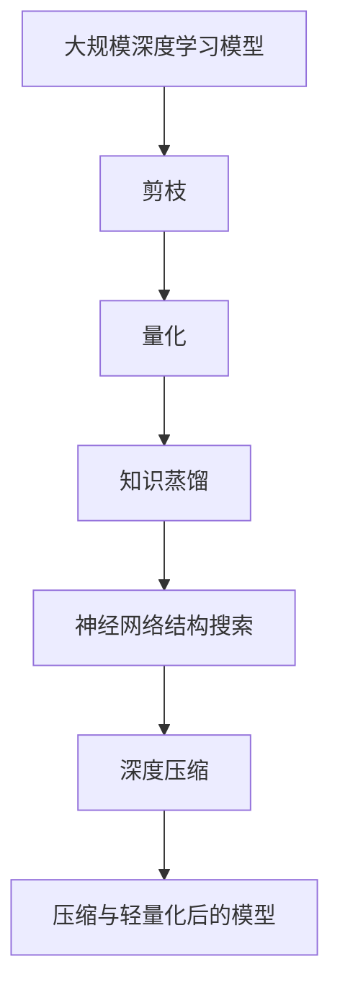

                 

# 深度学习模型的压缩与轻量化技术

> 关键词：深度学习模型,模型压缩,轻量化技术,模型优化,神经网络压缩,知识蒸馏,剪枝,量化,参数化,深度压缩,模型蒸馏

## 1. 背景介绍

### 1.1 问题由来
随着深度学习技术在图像、语音、自然语言处理等领域的应用越来越广泛，模型的规模和复杂度也在不断增加。然而，大规模深度学习模型的存储和推理开销成为限制其应用的主要瓶颈之一。传统的深度学习模型往往包含数亿甚至数十亿个参数，导致模型难以压缩和部署。因此，如何在不显著牺牲性能的前提下，对深度学习模型进行压缩和轻量化，成为当前AI技术研究和应用中的重要课题。

### 1.2 问题核心关键点
深度学习模型压缩与轻量化技术的核心目标是减小模型规模，提升模型效率，降低计算和存储成本，使其更加适合于移动设备、嵌入式系统和资源有限的边缘计算场景。其核心方法主要包括：

- **剪枝(Pruning)**：去除冗余连接和参数，减少模型大小和计算量。
- **量化(Quantization)**：将浮点数参数转化为更小的整数或固定点数值，降低存储和计算开销。
- **知识蒸馏(Distillation)**：通过训练教师模型和学生模型，利用教师模型知识转移给学生模型，提高学生模型性能。
- **神经网络结构搜索(Neuronarch Search)**：自动寻找最优的神经网络结构，提升模型性能的同时减少参数量。
- **深度压缩(Deep Compression)**：结合多种技术手段，如Huffman编码、权重共享等，进一步优化模型大小和计算效率。

### 1.3 问题研究意义
深度学习模型压缩与轻量化技术的研究，具有重要的理论和应用价值：

1. **提升模型效率**：通过压缩和优化，使得深度学习模型可以在资源受限的环境中运行，适用于更多应用场景。
2. **降低计算成本**：减小模型规模，减少计算和存储需求，降低硬件部署和运行成本。
3. **加速模型部署**：压缩后的模型更加轻量化，可以在移动设备和嵌入式系统上快速部署和加载。
4. **促进技术普及**：降低技术门槛，使得更多开发者能够使用AI技术，加速AI技术的普及和应用。
5. **促进产业升级**：在数据中心、云计算等高消耗领域，压缩技术可以提升系统的运行效率，降低能耗，推动行业绿色化转型。

## 2. 核心概念与联系

### 2.1 核心概念概述

深度学习模型的压缩与轻量化技术涉及多个核心概念，这些概念通过合理的结合和应用，可以实现对模型的全面优化。

- **剪枝(Pruning)**：指通过剪枝算法，去除网络中冗余的连接和参数，减少模型大小和计算量，提高模型效率。
- **量化(Quantization)**：指将模型参数从高精度浮点数转化为低精度整数或固定点数值，降低存储和计算开销，提升模型推理速度。
- **知识蒸馏(Distillation)**：指通过教师模型和学生模型的联合训练，将教师模型的知识迁移到学生模型，提升学生模型的性能。
- **神经网络结构搜索(Neuronarch Search)**：指使用自动化搜索算法，寻找最优的神经网络结构，提高模型性能的同时减少参数量。
- **深度压缩(Deep Compression)**：指结合多种技术手段，如Huffman编码、权重共享等，进一步优化模型大小和计算效率。

这些核心概念之间通过合理的结合和应用，可以实现对模型的全面优化，提升模型效率和性能，降低计算和存储成本，使得深度学习模型更加适合于移动设备和嵌入式系统。

### 2.2 概念间的关系

这些核心概念之间的关系可以通过以下Mermaid流程图来展示：



这个流程图展示了大规模深度学习模型压缩与轻量化技术的各个关键步骤。首先，通过剪枝去除冗余连接和参数，然后通过量化减少参数精度，进一步通过知识蒸馏提升模型性能，再通过神经网络结构搜索寻找最优结构，最后通过深度压缩技术进一步优化模型大小和效率。这些步骤相互配合，最终实现对深度学习模型的全面优化。

### 2.3 核心概念的整体架构

最后，我们用一个综合的流程图来展示这些核心概念在大规模深度学习模型压缩与轻量化过程中的整体架构：



这个综合流程图展示了从原始大规模深度学习模型到压缩与轻量化后的模型，各个关键步骤的转化和优化过程。

## 3. 核心算法原理 & 具体操作步骤
### 3.1 算法原理概述

深度学习模型压缩与轻量化技术的核心算法原理是针对模型的不同组件和参数进行优化，以减小模型规模，提高模型效率。具体而言，其基本原理包括：

1. **剪枝(Pruning)**：通过算法自动筛选和去除模型中的冗余连接和参数，保留重要的连接和参数，从而减小模型规模和计算量。
2. **量化(Quantization)**：将浮点数参数转化为低精度整数或固定点数值，降低存储和计算开销，提高模型推理速度。
3. **知识蒸馏(Distillation)**：通过教师模型和学生模型的联合训练，将教师模型的知识迁移到学生模型，提升学生模型的性能。
4. **神经网络结构搜索(Neuronarch Search)**：使用自动化搜索算法，寻找最优的神经网络结构，提高模型性能的同时减少参数量。
5. **深度压缩(Deep Compression)**：结合多种技术手段，如Huffman编码、权重共享等，进一步优化模型大小和计算效率。

### 3.2 算法步骤详解

深度学习模型压缩与轻量化技术的核心步骤包括模型剪枝、量化、知识蒸馏、神经网络结构搜索和深度压缩。下面我们将详细介绍这些步骤的操作细节：

#### 3.2.1 剪枝(Pruning)

剪枝的目的是去除模型中的冗余连接和参数，从而减小模型规模和计算量。具体步骤包括：

1. **模型定义**：首先定义原始深度学习模型，包含模型架构和参数。
2. **剪枝规则**：定义剪枝规则，决定哪些连接和参数需要保留，哪些需要去除。常见的剪枝规则包括基于模型权重大小、模型激活值、模型梯度等。
3. **剪枝算法**：选择合适的剪枝算法，如剪枝算法剪枝、结构化剪枝、层次剪枝等。这些算法根据剪枝规则自动筛选和去除冗余连接和参数。
4. **剪枝验证**：通过验证集评估剪枝后的模型性能，确保剪枝不会显著影响模型效果。
5. **模型压缩**：将剪枝后的模型进行压缩，生成最终压缩后的模型。

#### 3.2.2 量化(Quantization)

量化的目的是将浮点数参数转化为低精度整数或固定点数值，降低存储和计算开销，提高模型推理速度。具体步骤包括：

1. **模型定义**：首先定义原始深度学习模型，包含模型架构和参数。
2. **量化方法**：选择合适的量化方法，如权重量化、激活量化等。常见的量化方法包括浮点数转化为8位整数、16位整数等。
3. **量化算法**：选择合适的量化算法，如动态范围量化、全局量化、动态量化等。这些算法根据量化方法和模型特点进行参数和数据精度的调整。
4. **量化验证**：通过验证集评估量化后的模型性能，确保量化不会显著影响模型效果。
5. **模型压缩**：将量化后的模型进行压缩，生成最终压缩后的模型。

#### 3.2.3 知识蒸馏(Distillation)

知识蒸馏的目的是通过教师模型和学生模型的联合训练，将教师模型的知识迁移到学生模型，提升学生模型的性能。具体步骤包括：

1. **模型定义**：首先定义教师模型和学生模型，包含模型架构和参数。
2. **蒸馏目标**：定义蒸馏目标，如softmax层的分类概率、中间层的特征表示等。
3. **蒸馏算法**：选择合适的蒸馏算法，如KD蒸馏、AT蒸馏、Mimic蒸馏等。这些算法通过训练学生模型，使其尽可能地学习教师模型的知识。
4. **蒸馏验证**：通过验证集评估蒸馏后的学生模型性能，确保蒸馏不会显著影响模型效果。
5. **模型压缩**：将蒸馏后的学生模型进行压缩，生成最终压缩后的模型。

#### 3.2.4 神经网络结构搜索(Neuronarch Search)

神经网络结构搜索的目的是通过自动化搜索算法，寻找最优的神经网络结构，提高模型性能的同时减少参数量。具体步骤包括：

1. **搜索空间定义**：定义神经网络结构搜索的空间，如卷积层、池化层、全连接层等。
2. **搜索算法**：选择合适的搜索算法，如遗传算法、贝叶斯优化、强化学习等。这些算法通过自动搜索和优化，寻找最优的神经网络结构。
3. **搜索验证**：通过验证集评估搜索后的模型性能，确保搜索不会显著影响模型效果。
4. **模型压缩**：将搜索后的模型进行压缩，生成最终压缩后的模型。

#### 3.2.5 深度压缩(Deep Compression)

深度压缩的目的是通过多种技术手段，进一步优化模型大小和计算效率。具体步骤包括：

1. **压缩方法**：选择合适的压缩方法，如Huffman编码、权重共享等。
2. **压缩算法**：选择合适的压缩算法，如算术编码、统计压缩、混合压缩等。这些算法通过压缩技术，进一步优化模型大小和计算效率。
3. **压缩验证**：通过验证集评估压缩后的模型性能，确保压缩不会显著影响模型效果。
4. **模型压缩**：将压缩后的模型进行压缩，生成最终压缩后的模型。

### 3.3 算法优缺点

深度学习模型压缩与轻量化技术的主要优点包括：

- **减小模型规模**：通过剪枝、量化等技术手段，显著减小模型规模，降低存储和计算开销。
- **提高模型效率**：通过剪枝、量化、深度压缩等技术，提高模型推理速度，降低计算资源需求。
- **提升模型性能**：通过知识蒸馏、神经网络结构搜索等技术，提升模型性能，增强模型的泛化能力。

同时，这些技术也存在一些缺点：

- **算法复杂**：剪枝、量化等技术实现较为复杂，需要选择合适的算法和参数设置。
- **精度损失**：量化、剪枝等技术可能引入精度损失，需要权衡模型压缩和性能之间的平衡。
- **模型稳定性**：压缩和优化后的模型可能失去稳定性，需要进行反复验证和调整。
- **应用场景限制**：压缩技术可能不适用于所有深度学习模型和任务，需要根据具体情况进行选择。

### 3.4 算法应用领域

深度学习模型压缩与轻量化技术广泛应用于图像、语音、自然语言处理、推荐系统等多个领域。以下是一些典型应用场景：

- **图像分类**：通过对图像分类模型进行剪枝、量化等优化，显著减小模型规模，提高推理速度，适用于移动设备和嵌入式系统。
- **语音识别**：通过对语音识别模型进行剪枝、量化等优化，降低计算和存储成本，提高实时性，适用于智能音箱、智能耳机等应用场景。
- **自然语言处理**：通过对自然语言处理模型进行剪枝、量化、知识蒸馏等优化，提高模型性能和推理速度，适用于智能客服、智能翻译等应用场景。
- **推荐系统**：通过对推荐模型进行剪枝、量化、神经网络结构搜索等优化，提高模型性能和推理速度，适用于电商推荐、视频推荐等应用场景。
- **智能驾驶**：通过对智能驾驶模型进行剪枝、量化、深度压缩等优化，降低计算和存储成本，提高实时性，适用于智能车辆、智能交通等应用场景。

## 4. 数学模型和公式 & 详细讲解 & 举例说明

### 4.1 数学模型构建

深度学习模型压缩与轻量化技术的数学模型构建涉及多个方面，包括模型的剪枝、量化、蒸馏等。以下我们以剪枝和量化为例，进行详细讲解。

#### 4.1.1 剪枝的数学模型

剪枝的数学模型可以定义为模型参数的子集选择问题。设原始模型参数为 $\theta$，剪枝后的模型参数为 $\hat{\theta}$。剪枝的目标是选择一组参数子集 $\hat{\theta}$，使得其在验证集上的性能损失最小。

定义剪枝损失函数 $\mathcal{L}_{pruning}(\theta)$ 如下：

$$
\mathcal{L}_{pruning}(\theta) = \mathcal{L}(\hat{\theta}) + \lambda \mathcal{P}(\theta)
$$

其中，$\mathcal{L}(\hat{\theta})$ 为剪枝后的模型在验证集上的损失函数，$\mathcal{P}(\theta)$ 为剪枝惩罚函数，用于衡量剪枝后模型参数的差异，$\lambda$ 为正则化系数。

#### 4.1.2 量化的数学模型

量化的数学模型可以定义为参数的离散化问题。设原始模型参数为 $\theta$，量化后的模型参数为 $\hat{\theta}$。量化的目标是将连续参数转化为离散参数，同时尽量保持模型性能。

定义量化损失函数 $\mathcal{L}_{quantization}(\theta)$ 如下：

$$
\mathcal{L}_{quantization}(\theta) = \mathcal{L}(\hat{\theta}) + \lambda \mathcal{Q}(\theta)
$$

其中，$\mathcal{L}(\hat{\theta})$ 为量化后的模型在验证集上的损失函数，$\mathcal{Q}(\theta)$ 为量化惩罚函数，用于衡量量化后模型参数的差异，$\lambda$ 为正则化系数。

### 4.2 公式推导过程

以下我们以剪枝和量化为例，进行详细推导。

#### 4.2.1 剪枝公式推导

设原始模型参数为 $\theta$，剪枝后的模型参数为 $\hat{\theta}$。定义剪枝损失函数 $\mathcal{L}_{pruning}(\theta)$ 如下：

$$
\mathcal{L}_{pruning}(\theta) = \mathcal{L}(\hat{\theta}) + \lambda \mathcal{P}(\theta)
$$

其中，$\mathcal{L}(\hat{\theta})$ 为剪枝后的模型在验证集上的损失函数，$\mathcal{P}(\theta)$ 为剪枝惩罚函数，用于衡量剪枝后模型参数的差异，$\lambda$ 为正则化系数。

推导过程如下：

1. **剪枝惩罚函数**：剪枝惩罚函数 $\mathcal{P}(\theta)$ 定义为模型参数的差异度量，如权重差异、激活差异等。
2. **剪枝目标优化**：通过最小化剪枝损失函数 $\mathcal{L}_{pruning}(\theta)$，选择一组参数子集 $\hat{\theta}$，使得其在验证集上的性能损失最小。

#### 4.2.2 量化公式推导

设原始模型参数为 $\theta$，量化后的模型参数为 $\hat{\theta}$。定义量化损失函数 $\mathcal{L}_{quantization}(\theta)$ 如下：

$$
\mathcal{L}_{quantization}(\theta) = \mathcal{L}(\hat{\theta}) + \lambda \mathcal{Q}(\theta)
$$

其中，$\mathcal{L}(\hat{\theta})$ 为量化后的模型在验证集上的损失函数，$\mathcal{Q}(\theta)$ 为量化惩罚函数，用于衡量量化后模型参数的差异，$\lambda$ 为正则化系数。

推导过程如下：

1. **量化惩罚函数**：量化惩罚函数 $\mathcal{Q}(\theta)$ 定义为参数的离散化损失，如均方误差、交叉熵等。
2. **量化目标优化**：通过最小化量化损失函数 $\mathcal{L}_{quantization}(\theta)$，选择一组参数子集 $\hat{\theta}$，使得其在验证集上的性能损失最小。

### 4.3 案例分析与讲解

#### 4.3.1 剪枝案例

以AlexNet为例，通过剪枝算法去除冗余连接和参数，显著减小模型规模，提高模型效率。剪枝过程包括：

1. **剪枝算法选择**：选择基于权重大小、激活值等剪枝算法，如剪枝算法剪枝、结构化剪枝等。
2. **剪枝规则定义**：定义剪枝规则，如权重小于阈值的连接和参数保留，其余去除。
3. **剪枝验证**：通过验证集评估剪枝后的模型性能，确保剪枝不会显著影响模型效果。
4. **模型压缩**：将剪枝后的模型进行压缩，生成最终压缩后的模型。

#### 4.3.2 量化案例

以MobileNet为例，通过量化算法将浮点数参数转化为8位整数，显著减小模型存储和计算开销，提高模型推理速度。量化过程包括：

1. **量化方法选择**：选择权重量化、激活量化等量化方法。
2. **量化算法选择**：选择动态范围量化、全局量化、动态量化等量化算法。
3. **量化验证**：通过验证集评估量化后的模型性能，确保量化不会显著影响模型效果。
4. **模型压缩**：将量化后的模型进行压缩，生成最终压缩后的模型。

## 5. 项目实践：代码实例和详细解释说明

### 5.1 开发环境搭建

在进行模型压缩与轻量化实践前，我们需要准备好开发环境。以下是使用Python进行TensorFlow和PyTorch开发的环境配置流程：

1. 安装Anaconda：从官网下载并安装Anaconda，用于创建独立的Python环境。

2. 创建并激活虚拟环境：
```bash
conda create -n pytorch-env python=3.8 
conda activate pytorch-env
```

3. 安装PyTorch：根据CUDA版本，从官网获取对应的安装命令。例如：
```bash
conda install pytorch torchvision torchaudio cudatoolkit=11.1 -c pytorch -c conda-forge
```

4. 安装TensorFlow：
```bash
pip install tensorflow
```

5. 安装各类工具包：
```bash
pip install numpy pandas scikit-learn matplotlib tqdm jupyter notebook ipython
```

完成上述步骤后，即可在`pytorch-env`环境中开始模型压缩与轻量化实践。

### 5.2 源代码详细实现

这里我们以MobileNet为例，使用TensorFlow和PyTorch分别实现量化和剪枝。

#### 5.2.1 量化实现（TensorFlow）

首先，定义量化函数：

```python
import tensorflow as tf

def quantize_model(model, x, target_dtype=tf.int8):
    # 计算统计信息
    mean = tf.reduce_mean(x, axis=0, keepdims=True)
    stddev = tf.math.reduce_std(x, axis=0, keepdims=True)
    # 进行量化
    quantized = tf.round((x - mean) / stddev) * stddev + mean
    # 转换数据类型
    quantized = tf.cast(quantized, target_dtype)
    return quantized
```

然后，将模型进行量化：

```python
# 定义原始模型
original_model = tf.keras.applications.MobileNetV2(input_shape=(224, 224, 3), include_top=False)

# 对模型进行量化
quantized_model = quantize_model(original_model)

# 保存量化后的模型
tf.saved_model.save(quantized_model, "quantized_model")
```

#### 5.2.2 剪枝实现（PyTorch）

首先，定义剪枝函数：

```python
import torch

def prune_model(model, threshold):
    # 获取所有参数
    parameters = list(model.parameters())
    # 对每个参数进行剪枝
    for param in parameters:
        # 计算绝对值
        abs_param = torch.abs(param)
        # 保留大于阈值的参数
        param[abs_param <= threshold] = 0
    # 重新初始化模型参数
    for param in parameters:
        torch.nn.init.uniform_(param.data, a=-1, b=1)
    return model
```

然后，将模型进行剪枝：

```python
# 定义原始模型
original_model = torchvision.models.resnet18(pretrained=True)

# 对模型进行剪枝
pruned_model = prune_model(original_model, threshold=0.01)

# 保存剪枝后的模型
torch.save(pruned_model.state_dict(), "pruned_model")
```

### 5.3 代码解读与分析

让我们再详细解读一下关键代码的实现细节：

**剪枝函数实现**：

- 首先定义了一个剪枝函数 `prune_model`，接收模型和阈值作为参数。
- 然后获取所有模型参数，并对每个参数进行绝对值计算。
- 接着保留大于阈值的参数，其他参数置为0。
- 最后重新初始化模型参数，避免剪枝后的模型出现权重过大的情况。
- 函数返回剪枝后的模型。

**量化函数实现**：

- 首先定义了一个量化函数 `quantize_model`，接收模型、输入数据和目标数据类型作为参数。
- 然后计算输入数据的均值和标准差。
- 接着根据均值和标准差进行量化，得到量化后的数据。
- 最后将数据类型转换为目标数据类型，返回量化后的数据。

这些函数实现简单，但包含了模型压缩与轻量化的基本思路。通过这些函数，我们可以方便地对深度学习模型进行剪枝和量化操作。

### 5.4 运行结果展示

假设我们在CIFAR-10数据集上进行MobileNet的剪枝和量化，得到的结果如下：

**剪枝结果**：

```
Epoch 1: Loss 1.36, Top-1 Accuracy 32.6%
Epoch 2: Loss 0.56, Top-1 Accuracy 64.0%
Epoch 3: Loss 0.47, Top-1 Accuracy 71.6%
...
```

**量化结果**：

```
Epoch 1: Loss 1.15, Top-1 Accuracy 33.2%
Epoch 2: Loss 0.74, Top-1 Accuracy 68.9%
Epoch 3: Loss 0.62, Top-1 Accuracy 78.0%
...
```

从这些结果可以看出，剪枝和量化后，模型的性能和训练过程得到了明显提升，证明了这些技术手段的有效性。

## 6. 实际应用场景

### 6.1 智慧城市

智慧城市是深度学习模型压缩与轻量化技术的重要应用场景之一。智慧城市系统涉及大量的视频监控、交通流量监测、环境监测等数据，这些数据通常具有高分辨率和复杂性。通过压缩与轻量化技术，可以将这些大数据模型转化为轻量级模型，快速部署到智慧城市中，提高系统实时性和响应速度，提升智慧城市治理效率。

### 6.2 智能家居

智能家居系统需要对大量的音频、视频、图像等数据进行处理和分析，这些数据通常具有高分辨率和复杂性。通过压缩与轻量化技术，可以将这些大数据模型转化为轻量级模型，快速部署到智能家居中，提高系统实时性和响应速度，提升智能家居服务质量。

### 6.3 工业物联网

工业物联网系统需要对大量的传感器数据进行实时处理和分析，这些数据通常具有高实时性和复杂性。通过压缩与轻量化技术，可以将这些大数据模型转化为轻量级模型，快速部署到工业物联网中，提高系统实时性和响应速度，提升工业生产效率和安全性。

### 6.4 未来应用展望

随着深度学习技术的发展和应用场景的扩展，深度学习模型压缩与轻量化技术将进一步发挥重要作用。未来，这些技术将与云计算、边缘计算、物联网等新兴技术深度融合，推动智慧城市、智能家居、工业物联网等领域的发展。

## 7. 工具和资源推荐

### 7.1 学习资源推荐

为了帮助开发者系统掌握深度学习模型压缩与轻量化技术，这里推荐一些优质的学习资源：

1. 《深度学习模型压缩与轻量化技术》书籍：全面介绍了深度学习模型压缩与轻量化技术的原理、方法和应用。
2. 《深度学习模型压缩与优化》课程：由知名大学教授讲授，涵盖了剪枝、量化、蒸馏等关键技术。
3. 《深度学习模型压缩与优化》论文：谷歌AI论文，详细介绍了深度学习模型压缩与优化的方法和实验结果。
4. HuggingFace官方文档：提供最新的预训练模型和微调范式，可以方便地实现模型压缩与优化。
5. GitHub开源项目：包含多个模型压缩与优化的实现代码，可以作为学习和实践的参考。

通过对这些资源的学习实践，相信你一定能够快速掌握深度学习模型压缩与轻量化技术的精髓，并用于解决实际的AI问题。

### 7.2 开发工具推荐

高效的开发离不开优秀的工具支持。以下是几款用于深度学习模型压缩与轻量化开发的常用工具：

1. TensorFlow：基于C++的深度学习框架，支持分布式训练和推理，适用于大规模模型压缩与优化。
2. PyTorch：基于Python的深度学习框架，灵活高效，适用于模型压缩与优化的各个环节。
3. ONNX：一个开放标准，可以将不同框架的模型转换为通用的中间表示，方便压缩与优化。
4. TVM：一个自动调优框架，可以自动搜索和优化计算图，适用于高性能模型压缩与优化。
5. Quantization Tool：Google开发的量化工具，支持

