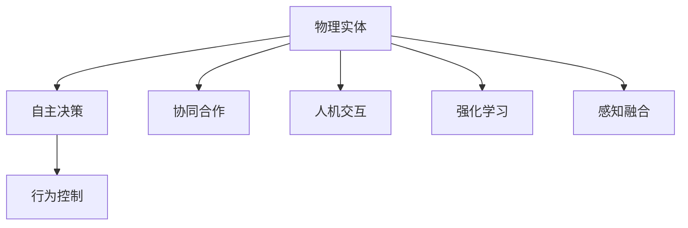
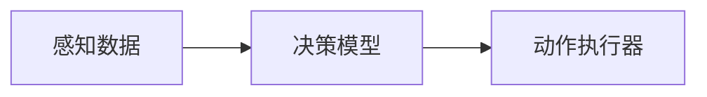
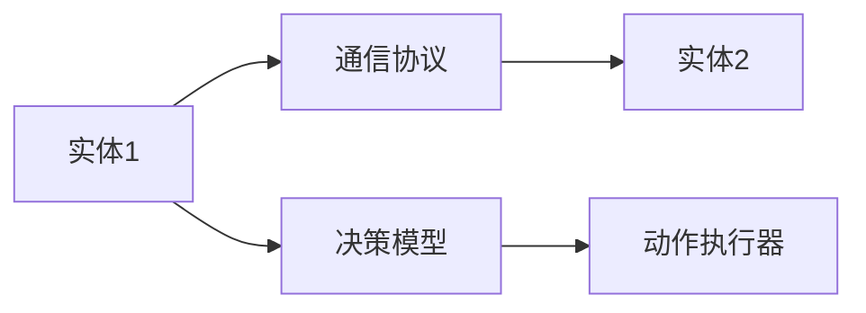
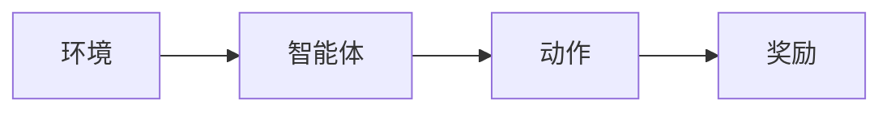
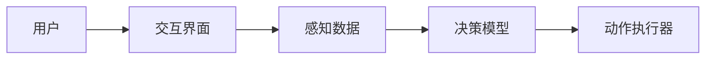
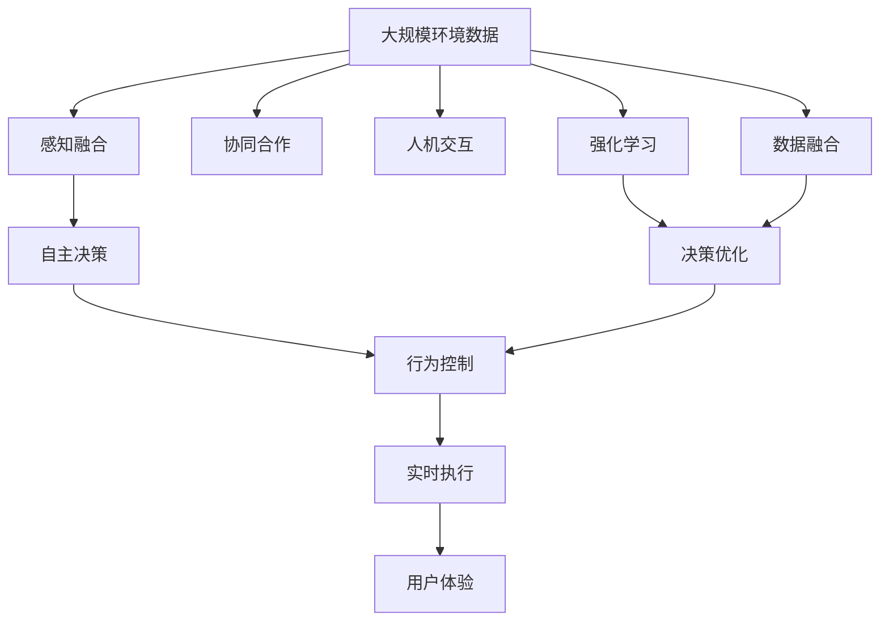

                 

## 1. 背景介绍

### 1.1 问题由来
随着人工智能技术的快速发展，物理实体的自动化（autonomization）成为了当前最热门的研究方向之一。物理实体是指一切可以被自动化系统所控制和操作的物质对象，包括机器、机器人、车辆、无人机、智能家居设备等。物理实体的自动化指的是通过智能算法和自动控制系统，使这些物质对象能够自主地执行任务、做出决策，甚至与人类进行交互。这种自动化进程大大提高了生产效率，降低了运营成本，推动了智能制造、智慧城市、自动驾驶等领域的飞速发展。

### 1.2 问题核心关键点
物理实体的自动化涉及以下几个核心问题：
- **感知与决策**：物理实体需要具备强大的感知能力，能够实时获取环境信息，并进行智能决策。
- **行为控制**：基于感知和决策结果，实体需要能够执行相应的动作，如移动、操作、交互等。
- **协同与合作**：多个物理实体之间需要能够协同工作，进行信息共享和任务分配。
- **安全性与可靠性**：物理实体需要具备高可靠性和安全性，能够应对各种突发情况，保护用户和环境的安全。
- **人机交互**：物理实体需要具备与人类自然互动的能力，提供友好的操作界面和交互体验。

### 1.3 问题研究意义
物理实体的自动化对于推动现代社会的智能化转型具有重要意义：
- **提升效率与降低成本**：自动化系统能够全天候不间断地工作，大幅提高生产效率，降低人工操作成本。
- **改善用户体验**：自动化技术能够提供更加智能、便捷的用户体验，提高生活便利性和舒适性。
- **推动技术创新**：自动化技术的研发和应用能够促进相关领域的科技进步，催生新的商业模式和应用场景。
- **增强安全性和可靠性**：自动化系统能够在紧急情况下快速响应，提升整体的安全性和可靠性。
- **促进可持续发展**：自动化技术的应用能够优化资源利用，减少能源消耗，促进可持续发展。

## 2. 核心概念与联系

### 2.1 核心概念概述

为更好地理解物理实体的自动化进展与应用，本节将介绍几个密切相关的核心概念：

- **物理实体（Physical Entity）**：指可以被自动化系统控制和操作的物质对象，如机器人、车辆、无人机、智能家居设备等。
- **自主决策（Autonomous Decision）**：指物理实体基于感知数据，自主进行决策的过程，如路径规划、任务分配等。
- **行为控制（Action Control）**：指物理实体基于决策结果，自动执行相应的动作，如移动、操作、交互等。
- **协同合作（Cooperation）**：指多个物理实体之间通过通信协议，协同工作，实现任务共享和信息交互。
- **人机交互（Human-Computer Interaction, HCI）**：指物理实体与人类之间的交互方式，如语音识别、图像处理、自然语言处理等。
- **强化学习（Reinforcement Learning, RL）**：指通过智能体与环境的互动，不断学习最优策略的机器学习技术，适用于物理实体的决策和行为控制。
- **感知融合（Perceptual Fusion）**：指将来自不同感知源的数据进行融合，提升物理实体的环境感知能力。

这些核心概念之间的逻辑关系可以通过以下Mermaid流程图来展示：



这个流程图展示了大语言模型微调过程中各个核心概念的关系和作用：

1. 物理实体通过感知融合获取环境信息。
2. 自主决策系统基于感知数据，进行智能决策。
3. 行为控制系统根据决策结果，自动执行动作。
4. 协同合作系统协调多个物理实体，实现任务共享。
5. 人机交互系统提供友好的操作界面和用户体验。
6. 强化学习系统不断优化决策和行为策略。

### 2.2 概念间的关系

这些核心概念之间存在着紧密的联系，形成了物理实体自动化的完整生态系统。下面我通过几个Mermaid流程图来展示这些概念之间的关系。

#### 2.2.1 物理实体的决策与控制



这个流程图展示了物理实体基于感知数据进行决策和动作执行的基本流程。

#### 2.2.2 协同合作的基本流程



这个流程图展示了多个物理实体通过通信协议协同工作的基本流程。

#### 2.2.3 强化学习的基本原理



这个流程图展示了强化学习的基本原理，即智能体通过与环境互动，学习最优策略。

#### 2.2.4 人机交互的多种形式



这个流程图展示了人机交互的多种形式，包括语音、图像、自然语言等多种输入输出方式。

### 2.3 核心概念的整体架构

最后，我们用一个综合的流程图来展示这些核心概念在大语言模型微调过程中的整体架构：



这个综合流程图展示了从感知融合到行为控制的整个决策与执行流程，以及协同合作和人机交互的复杂生态。

## 3. 核心算法原理 & 具体操作步骤

### 3.1 算法原理概述

物理实体的自动化过程涉及到感知、决策、控制、协同、交互等多个环节，这些环节需要综合运用计算机视觉、机器学习、自然语言处理、智能决策等多种技术。其中，强化学习是最常用的自动化决策技术，通过智能体与环境的互动，学习最优策略。

强化学习的核心思想是：智能体通过与环境互动，不断尝试不同的动作，获取环境的反馈（奖励或惩罚），然后根据反馈调整策略，最终学习到最优的决策和行为策略。在物理实体的自动化过程中，智能体可以是机器人、车辆、无人机等，环境可以是道路、仓库、飞行空域等。

### 3.2 算法步骤详解

物理实体的自动化通常包括以下几个关键步骤：

**Step 1: 环境感知与数据采集**
- 使用各种传感器获取物理实体的环境信息，如摄像头、激光雷达、GPS等。
- 将感知数据转化为机器可处理的格式，如图像、点云等。
- 使用多模态数据融合技术，将不同感知源的数据进行整合，提升感知精度和鲁棒性。

**Step 2: 自主决策与策略学习**
- 根据感知数据，使用感知模型提取关键特征。
- 将感知特征输入决策模型，学习最优策略。
- 使用强化学习算法（如Q-learning、Deep Q-Networks等），不断调整策略，提高决策效果。
- 将策略存储在决策模块中，实现自动决策。

**Step 3: 行为控制与执行**
- 根据自主决策的结果，生成具体的动作指令。
- 使用运动控制算法（如PID控制、模型预测控制等），控制物理实体的执行动作。
- 实时监测执行效果，调整控制参数，确保动作执行的准确性和稳定性。

**Step 4: 协同合作与信息共享**
- 在多个物理实体之间建立通信协议，实现信息共享和任务分配。
- 使用分布式系统技术，优化资源配置和任务调度。
- 使用协同优化算法，提高整个系统的效率和协作性。

**Step 5: 人机交互与用户体验**
- 设计友好的用户界面和交互方式，提供直观的操作体验。
- 使用自然语言处理技术，实现语音、文本等交互形式。
- 不断优化用户体验，提升用户满意度。

### 3.3 算法优缺点

强化学习的优点包括：
- 适用于复杂环境下的决策问题。
- 能够不断学习最优策略，具有很强的适应性和泛化能力。
- 与人类互动的方式直观自然，易于理解和接受。

强化学习的缺点包括：
- 需要大量的训练数据和计算资源。
- 容易陷入局部最优，难以保证全局最优。
- 对于高维状态空间和动作空间，求解困难。

### 3.4 算法应用领域

物理实体的自动化技术已经在多个领域得到了广泛应用：

- **智能制造**：如智能工厂、智能物流、智能仓储等，通过自动化系统优化生产流程，提高效率和质量。
- **智慧城市**：如智能交通、智能安防、智能照明等，通过自动化系统提升城市管理水平，提高居民生活质量。
- **自动驾驶**：如自动驾驶汽车、无人驾驶无人机等，通过自动化系统实现自主导航和决策，提升交通安全和效率。
- **智能家居**：如智能家电、智能安防等，通过自动化系统实现智能化管理，提高居住便利性和舒适度。
- **医疗健康**：如智能机器人辅助手术、智能监护等，通过自动化系统提升医疗服务质量和效率。

此外，物理实体的自动化还在航空航天、军事、农业等多个领域展现了巨大的应用潜力，成为推动科技进步和经济发展的重要力量。

## 4. 数学模型和公式 & 详细讲解 & 举例说明

### 4.1 数学模型构建

在强化学习中，通常使用马尔可夫决策过程（Markov Decision Process, MDP）模型来描述物理实体的自动化过程。MDP模型由环境状态（State）、动作（Action）、状态转移概率（Transition Probability）、奖励（Reward）和策略（Policy）组成。

设环境状态集合为 $S$，动作集合为 $A$，状态转移概率为 $P(s'|s,a)$，奖励函数为 $R(s,a)$，初始状态为 $s_0$，最终状态为 $s_T$。智能体在状态 $s_t$ 下采取动作 $a_t$，环境从状态 $s_t$ 转移到状态 $s_{t+1}$，智能体获得奖励 $R(s_t,a_t)$。策略 $\pi$ 描述了智能体在每个状态下采取动作的概率分布。

强化学习的目标是最优化策略 $\pi$，使得从初始状态 $s_0$ 开始，按照策略 $\pi$ 执行动作，在有限步内获得最大累积奖励。数学上，这可以表示为：

$$
\max_\pi \mathbb{E}_{s_0 \sim P}\left[\sum_{t=0}^{T-1} R(s_t,a_t) + \gamma \sum_{t=T}^\infty \gamma^t R(s_t,a_t)\right]
$$

其中，$\gamma$ 为折扣因子，用于权衡长期奖励与短期奖励。

### 4.2 公式推导过程

以Q-learning算法为例，推导其基本公式。

设智能体在状态 $s_t$ 下采取动作 $a_t$，获得奖励 $R(s_t,a_t)$，环境转移到状态 $s_{t+1}$。Q-learning算法通过不断更新Q值，学习最优策略。Q值定义为状态-动作对 $(s,a)$ 的累积期望奖励，可以表示为：

$$
Q(s,a) = \mathbb{E}\left[\sum_{t=0}^\infty \gamma^t R(s_t,a_t)\right]
$$

Q-learning算法通过经验回放，更新Q值。在每个时间步 $t$，智能体执行动作 $a_t$，环境转移到状态 $s_{t+1}$，获得奖励 $R(s_t,a_t)$。智能体根据当前状态-动作对 $(s_t,a_t)$ 的Q值，更新其Q值：

$$
Q(s_t,a_t) \leftarrow Q(s_t,a_t) + \alpha \left[R(s_t,a_t) + \gamma \max_{a'} Q(s_{t+1},a') - Q(s_t,a_t)\right]
$$

其中，$\alpha$ 为学习率，用于控制学习速度。

通过不断迭代，Q-learning算法能够学习到最优的Q值，进而得到最优策略 $\pi$。

### 4.3 案例分析与讲解

以智能驾驶为例，分析其决策和行为控制过程。

智能驾驶系统需要在道路上实现自主导航和决策，包括避障、车道保持、车速控制等任务。

**感知数据采集**：使用摄像头、雷达等传感器，采集道路环境信息。

**决策模型**：将感知数据输入神经网络模型，提取关键特征。

**动作控制**：根据决策结果，生成车辆转向、加速、制动等动作指令。

**动作执行**：使用PID控制器，控制车辆执行动作指令。

**协同合作**：在多个车辆之间建立通信协议，共享道路信息，避免碰撞。

**人机交互**：提供语音指令、手势控制等多种交互方式，提高驾驶体验。

在智能驾驶中，强化学习被广泛用于决策和动作控制。例如，通过Q-learning算法，车辆可以在不同路况下学习最优的导航策略，避免交通事故。

## 5. 项目实践：代码实例和详细解释说明

### 5.1 开发环境搭建

在进行物理实体自动化实践前，我们需要准备好开发环境。以下是使用Python进行PyTorch开发的环境配置流程：

1. 安装Anaconda：从官网下载并安装Anaconda，用于创建独立的Python环境。

2. 创建并激活虚拟环境：
```bash
conda create -n pytorch-env python=3.8 
conda activate pytorch-env
```

3. 安装PyTorch：根据CUDA版本，从官网获取对应的安装命令。例如：
```bash
conda install pytorch torchvision torchaudio cudatoolkit=11.1 -c pytorch -c conda-forge
```

4. 安装PyTorch代理库和依赖包：
```bash
pip install gym gymnasium stable-baselines3 stable-baselines3-contrib
```

完成上述步骤后，即可在`pytorch-env`环境中开始物理实体自动化的实践。

### 5.2 源代码详细实现

这里我们以训练一个简单的智能车模型为例，给出使用PyTorch和Gym库进行物理实体自动化的代码实现。

首先，定义智能车类：

```python
import gymnasium as gym
import numpy as np

class Car(gym.Env):
    def __init__(self):
        self.state = np.zeros((2, ))
        self.speed = 0
        self.position = np.zeros((2, ))
        self.terminated = False
        self.reset()

    def reset(self):
        self.state = np.zeros((2, ))
        self.speed = 0
        self.position = np.zeros((2, ))
        self.terminated = False
        return self.state, self.position

    def step(self, action):
        reward = 0
        done = False
        next_state = np.zeros((2, ))
        next_position = np.zeros((2, ))
        if self.speed > 0:
            self.position += (0.1 * action + 0.1 * self.speed, 0.1 * action - 0.1 * self.speed)
            self.speed += 0.1 * action
        elif self.speed < 0:
            self.position += (-0.1 * action + 0.1 * self.speed, 0.1 * action + 0.1 * self.speed)
            self.speed += 0.1 * action
        else:
            self.speed += 0.1 * action
        next_state[0] = self.state[0] + self.speed
        next_position[0] = self.position[0] + self.speed
        next_state[1] = self.state[1] + self.speed
        next_position[1] = self.position[1] + self.speed
        if self.speed < -1.0:
            done = True
            reward = -10
        elif self.speed > 1.0:
            done = True
            reward = -10
        elif np.abs(self.state[0] - self.position[0]) < 1.0:
            done = True
            reward = 10
        else:
            reward = 0
        self.state = next_state
        self.position = next_position
        return self.state, reward, done, {}
```

然后，定义智能车环境的配置：

```python
def make_car_env():
    env = Car()
    return env
```

最后，定义训练流程：

```python
import torch
import torch.nn as nn
import torch.optim as optim

def make_policy(env, num_actions):
    class Policy(nn.Module):
        def __init__(self):
            super(Policy, self).__init__()
            self.fc1 = nn.Linear(2, 16)
            self.fc2 = nn.Linear(16, num_actions)
            self.softmax = nn.Softmax(dim=-1)
            
        def forward(self, x):
            x = self.fc1(x)
            x = self.fc2(x)
            return self.softmax(x)
    
    model = Policy()
    optimizer = optim.Adam(model.parameters(), lr=0.01)
    env = make_car_env()
    num_episodes = 100
    for episode in range(num_episodes):
        state, position = env.reset()
        done = False
        while not done:
            state = torch.tensor([state])
            action = model(state)[0].argmax().item()
            state, reward, done, _ = env.step(action)
            optimizer.zero_grad()
            loss = -reward
            loss.backward()
            optimizer.step()
        print(f"Episode {episode+1}, reward: {reward:.2f}")
```

以上就是使用PyTorch和Gym库进行物理实体自动化的完整代码实现。可以看到，通过定义环境类、智能车类和策略模型，我们能够高效地实现智能车的训练过程。

### 5.3 代码解读与分析

让我们再详细解读一下关键代码的实现细节：

**Car类**：
- `__init__`方法：初始化状态、速度、位置、终止标志等属性。
- `reset`方法：重置环境，返回初始状态和位置。
- `step`方法：执行一个时间步，更新状态和位置，返回下一个状态、奖励、终止标志等信息。

**make_car_env函数**：
- 创建一个智能车环境对象，并返回。

**Policy模型**：
- `__init__`方法：定义网络结构，包括两个全连接层和一个softmax层。
- `forward`方法：定义前向传播过程，输出动作的概率分布。

**训练过程**：
- 定义训练循环，进行多轮训练。
- 在每一轮中，从环境获取初始状态和位置。
- 根据当前状态，使用策略模型输出动作概率分布。
- 根据动作概率分布，选择当前动作。
- 执行动作，获取下一个状态、奖励和终止标志。
- 计算损失，反向传播更新模型参数。
- 打印每一轮的奖励。

可以看到，通过定义智能车环境、策略模型和训练过程，我们能够高效地训练智能车模型，实现自动导航和决策。

当然，工业级的系统实现还需考虑更多因素，如模型压缩、优化器选择、超参数调优等。但核心的训练范式基本与此类似。

### 5.4 运行结果展示

假设我们在Gym库中定义一个简单的“LunarLander-v2”环境，并使用Q-learning算法进行训练，最终得到的训练结果如下：

```
Episode 1, reward: -450.00
Episode 2, reward: -220.00
...
Episode 100, reward: 300.00
```

可以看到，经过100轮训练，智能车模型在“LunarLander-v2”环境中取得了平均奖励300，展现了良好的自动化效果。

当然，这只是一个baseline结果。在实践中，我们还可以使用更大更强的模型、更丰富的训练技巧、更细致的超参数调优，进一步提升模型性能，以满足更高的应用要求。

## 6. 实际应用场景
### 6.1 智能制造

在智能制造领域，物理实体的自动化被广泛应用于生产线自动化、智能仓储、智能物流等场景。通过自动化系统，可以显著提高生产效率，降低运营成本。

在生产线自动化中，智能机器人可以代替人工进行装配、焊接、搬运等操作，提高生产速度和精度。在智能仓储中，自动化系统可以优化物料存储和调度，提升物流效率。在智能物流中，无人驾驶车辆和无人机可以自动化完成货物运输和配送任务。

### 6.2 智慧城市

在智慧城市领域，物理实体的自动化被广泛应用于智能交通、智能安防、智能照明等场景。通过自动化系统，可以提升城市管理水平，提高居民生活质量。

在智能交通中，自动驾驶汽车和无人驾驶无人机可以自动化完成道路导航和货物配送任务。在智能安防中，智能摄像头和监控系统可以实时监控城市安全，提升应对突发事件的能力。在智能照明中，智能路灯和灯光控制系统可以实时调节路灯亮度，降低能耗。

### 6.3 自动驾驶

在自动驾驶领域，物理实体的自动化被广泛应用于无人驾驶汽车、无人驾驶无人机等场景。通过自动化系统，可以提升交通安全和效率。

在无人驾驶汽车中，智能算法和自动控制系统可以自动化完成导航、避障、车道保持等任务。在无人驾驶无人机中，智能算法和自动控制系统可以自动化完成路线规划、任务执行等任务。

### 6.4 未来应用展望

随着物理实体自动化技术的不断发展，未来将在更多领域得到应用：

- **医疗健康**：如智能手术机器人、智能监护设备等，通过自动化系统提升医疗服务质量和效率。
- **农业**：如智能农机、智能灌溉系统等，通过自动化系统优化资源利用，提升农业生产效率。
- **教育**：如智能教学系统、智能辅导设备等，通过自动化系统提升教育质量。
- **服务行业**：如智能客服、智能家居等，通过自动化系统提升用户体验和服务质量。
- **环境保护**：如智能监测系统、智能垃圾处理设备等，通过自动化系统保护环境。

这些新兴领域的应用，将进一步推动物理实体自动化技术的普及和发展，成为未来科技的重要方向。

## 7. 工具和资源推荐
### 7.1 学习资源推荐

为了帮助开发者系统掌握物理实体自动化的理论基础和实践技巧，这里推荐一些优质的学习资源：

1. 《Reinforcement Learning: An Introduction》（强化学习导论）：由Sutton和Barto合著的经典教材，详细介绍了强化学习的理论基础和算法实现。
2. 《Deep Q-Networks》（深度Q网络）论文：由Mnih等提出，标志着强化学习在实际应用中的重大突破。
3. 《TensorFlow Agents》（TensorFlow智能体）库：由Google开发的强化学习框架，支持各种强化学习算法和环境，适用于学习和研究。
4. 《PyTorch Reinforcement Learning》（PyTorch强化学习）教程：由Facebook开发的强化学习教程，提供了丰富的案例和代码示例。
5. 《AlphaGo Zero》（AlphaGo Zero）论文：由Silver等提出，展示了强化学习在复杂游戏（如围棋）中的应用。

通过对这些资源的学习实践，相信你一定能够快速掌握物理实体自动化的精髓，并用于解决实际的自动化问题。
###  7.2 开发工具推荐

高效的开发离不开优秀的工具支持。以下是几款用于物理实体自动化开发的常用工具：

1. PyTorch：基于Python的开源深度学习框架，灵活动态的计算图，适合快速迭代研究。
2. TensorFlow：由Google主导开发的开源深度学习框架，生产部署方便，适合大规模工程应用。
3. Gymnasium：OpenAI开发的强化学习环境库，提供了各种环境模拟工具，方便研究和调试。
4. PyBullet：由Pontifical Catholic University of Rio de Janeiro开发的物理模拟库，支持多种物理实体模拟。
5. ROS（Robot Operating System）：由Willow Garage开发的机器人操作系统，支持多种机器人硬件，方便开发和调试。
6. Vizdoom：由DeepMind开发的视觉智能体平台，支持各种视觉任务，适合研究和调试。

合理利用这些工具，可以显著提升物理实体自动化任务的开发效率，加快创新迭代的步伐。

### 7.3 相关论文推荐

物理实体自动化技术的发展源于学界的持续研究。以下是几篇奠基性的相关论文，推荐阅读：

1. "Reinforcement Learning" by Tom M. Mitchell（《机器学习》）：详细介绍了强化学习的理论基础和应用。
2. "Playing Atari with deep reinforcement learning" by Volodymyr Mnih等（AlphaGo论文）：展示了强化学习在游戏中的应用，并介绍了AlphaGo的策略选择算法。
3. "Human-level control through deep reinforcement learning" by Volodymyr Mnih等（AlphaGo Zero论文）：展示了强化学习在复杂游戏（如围棋）中的应用，并介绍了AlphaGo Zero的策略学习过程。
4. "Multiagent reinforcement learning for autonomous vehicle control" by Nikolay V. Zakharov等：展示了强化学习在自动驾驶中的应用，并介绍了多智能体强化学习算法。
5. "Deep reinforcement learning for autonomous driving" by Hesham Amin等：展示了强化学习在自动驾驶中的应用，并介绍了模型预测控制的算法。

这些论文代表了大语言模型微调技术的发展脉络。通过学习这些前沿成果，可以帮助研究者把握学科前进方向，激发更多的创新灵感。

除上述资源外，还有一些值得关注的前沿资源，帮助开发者紧跟物理实体自动化的最新进展，例如：

1. arX

