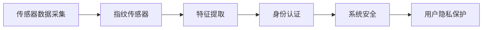
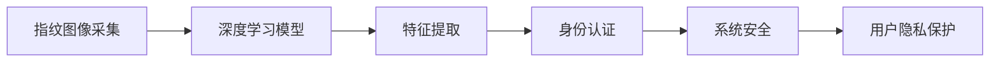
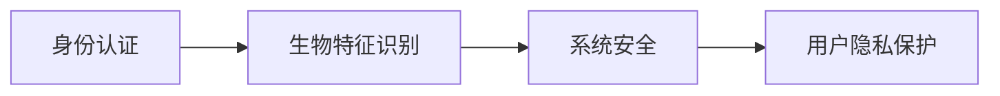

                 

# 物联网(IoT)技术和各种传感器设备的集成：指纹传感器的安全应用

> 关键词：物联网(IoT), 传感器设备, 指纹传感器, 生物特征识别, 安全应用

## 1. 背景介绍

### 1.1 问题由来
随着物联网(IoT)技术的迅猛发展，各种传感器设备被广泛应用于各类智能设备和系统中。指纹传感器作为生物特征识别的一种重要手段，已经被广泛应用于身份认证、支付验证、门禁控制等领域。如何利用指纹传感器的数据进行安全应用，成为当前物联网领域的一大热点问题。

指纹传感器的工作原理基于光学、电容或超声波技术，通过捕捉手指表面的特征点，生成指纹图像或特征向量，用于身份识别。传统的指纹识别方法主要依赖于图像处理和模式匹配算法，但随着深度学习技术的发展，神经网络逐渐成为指纹识别的主流方法。

然而，尽管指纹识别技术已经相当成熟，但在安全性和隐私保护方面仍存在一定风险。比如，指纹数据一旦泄露，可能被用于非法复制指纹，甚至攻击整个身份验证系统。因此，在物联网系统中如何保护指纹数据的安全，成为了一个亟待解决的问题。

## 2. 核心概念与联系

### 2.1 核心概念概述

为更好地理解指纹传感器在物联网系统中的安全应用，本节将介绍几个密切相关的核心概念：

- **物联网(IoT)技术**：利用传感器、嵌入式设备和互联网技术，将物理世界中的物体连接到网络上，实现设备间的数据共享和互联互通。
- **传感器设备**：各类用于采集环境或物体信息的物理设备，如温度传感器、压力传感器、位置传感器等。
- **指纹传感器**：利用光学、电容或超声波技术，采集手指表面特征点的设备，用于身份认证等场景。
- **生物特征识别**：通过人体特有的生物特征（如指纹、虹膜、面部等）进行身份认证的技术。
- **安全应用**：利用生物特征识别技术，保障系统或数据的安全，防止非法访问和数据泄露。
- **深度学习**：利用神经网络模型，从大量数据中学习提取特征并进行分类、识别等任务的技术。

这些核心概念之间的逻辑关系可以通过以下Mermaid流程图来展示：

```mermaid
graph TB
    A[物联网(IoT)] --> B[传感器设备]
    A --> C[指纹传感器]
    C --> D[生物特征识别]
    D --> E[深度学习]
    E --> F[安全应用]
```

这个流程图展示了从物联网到指纹传感器，再到生物特征识别和安全应用的整个流程，以及深度学习在其中起到的关键作用。

### 2.2 概念间的关系

这些核心概念之间存在着紧密的联系，形成了物联网系统中指纹传感器安全应用的完整框架。下面我们通过几个Mermaid流程图来展示这些概念之间的关系。

#### 2.2.1 指纹传感器在物联网中的应用



这个流程图展示了指纹传感器在物联网中的应用流程。通过采集指纹数据，提取指纹特征，进行身份认证，进而保障系统的安全，保护用户的隐私。

#### 2.2.2 深度学习在指纹识别中的应用



这个流程图展示了深度学习在指纹识别中的应用流程。通过深度学习模型，自动提取指纹特征，进行身份认证，进而保障系统的安全，保护用户的隐私。

#### 2.2.3 生物特征识别在安全应用中的作用



这个流程图展示了生物特征识别在安全应用中的作用。通过生物特征识别，进行身份认证，进而保障系统的安全，保护用户的隐私。

## 3. 核心算法原理 & 具体操作步骤

### 3.1 算法原理概述

指纹传感器的安全应用，主要依赖于指纹特征的提取和深度学习模型的训练。指纹特征的提取是通过传感器采集指纹图像，利用图像处理技术，提取出指纹图像中的特征点信息，生成指纹特征向量。然后，通过训练深度学习模型，将指纹特征向量映射到不同的身份标识，实现指纹识别和身份认证。

指纹识别过程中，模型的训练和测试数据集通常包含大量指纹图像和对应的标签，其中标签可以是用户的身份标识（如身份证号、手机等）。模型训练的目标是最小化预测输出与真实标签之间的差异，通过反向传播算法更新模型参数。模型测试时，将指纹图像输入模型，输出识别结果，与真实标签进行比较，评估模型的准确性。

### 3.2 算法步骤详解

#### 3.2.1 指纹数据采集与预处理

1. **指纹图像采集**：利用指纹传感器捕捉用户的指纹图像，通常使用光学、电容或超声波技术。光学指纹传感器通过拍摄指纹表面反射的光线，生成图像数据；电容指纹传感器通过测量指纹特征点在传感器表面的电容变化，生成指纹图像。

2. **图像预处理**：采集到的指纹图像可能包含噪声、背景干扰等问题，需要进行预处理，如二值化、降噪、去噪等操作。常见预处理方法包括：
   - **二值化**：将图像转换为黑白二值图像，便于特征提取。
   - **降噪**：去除图像中的噪声点，如斑点、污点等。
   - **归一化**：对图像进行标准化处理，确保图像特征的一致性。

#### 3.2.2 指纹特征提取

1. **特征点提取**：利用图像处理算法，从预处理后的指纹图像中提取指纹特征点，生成指纹特征图。常见的特征点提取方法包括：
   - **SIFT(Scale-Invariant Feature Transform)**：检测和描述图像中的局部特征点。
   - **SURF(Speeded Up Robust Features)**：检测和描述图像中的关键点，具有尺度不变性和旋转不变性。
   - **HOG(Histogram of Oriented Gradients)**：通过计算图像中梯度的方向和强度，提取局部特征。

2. **特征向量生成**：将提取的指纹特征点进行编码，生成指纹特征向量。常见的编码方法包括：
   - **Descent Direction Code(DDC)**：将特征点的坐标、角度和方向等信息进行编码。
   - **Minqyong Code(MQ)**：将特征点的坐标和方向进行组合，生成特征向量。
   - **LBP(Local Binary Patterns)**：将特征点的纹理信息进行编码，生成特征向量。

#### 3.2.3 深度学习模型训练

1. **模型选择**：选择合适的深度学习模型进行训练，如卷积神经网络(CNN)、循环神经网络(RNN)等。常见模型包括：
   - **LeNet**：经典的卷积神经网络模型，用于图像分类和识别。
   - **AlexNet**：深度卷积神经网络模型，用于大规模图像识别任务。
   - **ResNet**：残差网络模型，用于解决深度网络中的梯度消失问题。
   - **DenseNet**：密集连接网络模型，用于解决特征传播和信息传递问题。

2. **数据准备**：准备训练数据集和验证数据集，包含指纹图像和对应的标签。常见数据集包括：
   - **Fingerprint Database**：包含不同用户和不同指纹的图像数据。
   - **FVC-Fingerprint Database**：包含多种指纹传感器采集的图像数据。
   - **ISBI Database**：包含多种指纹传感器采集的图像数据。

3. **模型训练**：使用训练数据集对深度学习模型进行训练，最小化预测输出与真实标签之间的差异。训练过程包括：
   - **前向传播**：将输入数据传入模型，计算模型输出。
   - **损失函数计算**：计算模型输出与真实标签之间的差异，如交叉熵损失、均方误差损失等。
   - **反向传播**：计算损失函数对模型参数的梯度，更新模型参数。
   - **模型评估**：使用验证数据集对模型进行评估，计算模型的准确率、召回率等指标。

4. **模型测试**：使用测试数据集对训练好的模型进行测试，计算模型的准确率和召回率等指标，评估模型的泛化能力。测试过程包括：
   - **前向传播**：将测试数据传入模型，计算模型输出。
   - **预测结果**：将模型输出与真实标签进行比较，输出识别结果。

#### 3.2.4 指纹识别与身份认证

1. **指纹图像采集**：用户使用指纹传感器采集指纹图像。

2. **指纹特征提取**：将采集到的指纹图像进行预处理和特征提取，生成指纹特征向量。

3. **模型预测**：将指纹特征向量输入训练好的模型，输出预测结果。

4. **身份认证**：根据模型预测结果，判断用户的身份是否合法，进行身份认证。

### 3.3 算法优缺点

#### 3.3.1 优点

1. **高识别率**：深度学习模型在指纹识别任务上取得了较高的识别率，能够有效识别不同用户的指纹特征。
2. **自动学习**：深度学习模型能够自动学习提取指纹特征，不需要手动提取和编码。
3. **鲁棒性强**：深度学习模型对图像噪声、干扰等因素具有一定的鲁棒性，能够有效应对各种传感器采集的指纹数据。

#### 3.3.2 缺点

1. **计算复杂度高**：深度学习模型需要大量的计算资源和时间，训练过程耗时较长。
2. **模型易受攻击**：深度学习模型可能受到对抗样本攻击，导致误判和错误识别。
3. **数据隐私风险**：指纹数据属于个人隐私数据，一旦泄露，可能被用于非法用途。

### 3.4 算法应用领域

指纹传感器在物联网系统中的应用，主要包括以下几个方面：

1. **身份认证**：利用指纹传感器采集用户的指纹图像，通过深度学习模型进行识别和认证，保障系统安全。常见应用包括：
   - **移动支付**：通过指纹支付验证用户的身份，防止非法支付。
   - **门禁控制**：通过指纹识别用户的身份，控制门的开关。
   - **移动设备解锁**：通过指纹识别用户的身份，解锁手机、电脑等设备。

2. **健康监测**：利用指纹传感器采集用户的指纹图像，通过深度学习模型进行特征提取和识别，监测用户的健康状况。常见应用包括：
   - **心率监测**：通过分析指纹图像中的特征点，计算用户的心率。
   - **睡眠监测**：通过分析指纹图像中的特征点，判断用户的睡眠状态。

3. **安全监控**：利用指纹传感器采集用户的指纹图像，通过深度学习模型进行识别和分析，实现安全监控。常见应用包括：
   - **安防监控**：通过指纹识别用户的身份，控制安防系统的开关。
   - **智能家居控制**：通过指纹识别用户的身份，控制智能家居设备的开关和运行。

## 4. 数学模型和公式 & 详细讲解 & 举例说明

### 4.1 数学模型构建

指纹识别的核心问题是在指纹图像中自动提取特征点，并将其映射到不同的身份标识。假设输入为指纹图像 $x \in \mathbb{R}^{h \times w \times 1}$，输出为身份标识 $y \in \{1, 2, \ldots, K\}$，其中 $K$ 为不同用户的数量。

指纹特征提取的数学模型可以表示为：
$$
x \rightarrow y
$$

其中，$x$ 表示指纹图像，$y$ 表示身份标识。模型的目标是最小化预测输出与真实标签之间的差异，即：
$$
\min_{\theta} L(y, \hat{y}) = \min_{\theta} \mathbb{E}_{(x, y)} [L(y, \hat{y})]
$$

其中，$L$ 表示损失函数，$\hat{y}$ 表示模型预测输出。

### 4.2 公式推导过程

指纹特征提取的深度学习模型通常采用卷积神经网络(CNN)架构，其数学模型可以表示为：
$$
\hat{y} = \max_i F_i(\theta)
$$

其中，$F_i$ 表示第 $i$ 层的输出，$\theta$ 表示模型参数。

假设模型的第 $l$ 层的特征图为 $f_{l}$，则模型的第 $l+1$ 层的特征图可以表示为：
$$
f_{l+1} = \sigma(\mathcal{W}f_l + \mathcal{B})
$$

其中，$\sigma$ 表示激活函数，$\mathcal{W}$ 和 $\mathcal{B}$ 表示第 $l$ 层的权重和偏置。

假设第 $L$ 层的特征图为 $f_L$，则模型的最终输出可以表示为：
$$
\hat{y} = \max_i F_i(\theta) = \max_i \sigma(\mathcal{W}f_{L-1} + \mathcal{B})
$$

假设模型在第 $l$ 层和第 $l+1$ 层之间的权重和偏置为 $\theta_l$，则模型参数 $\theta$ 可以表示为：
$$
\theta = \bigcup_{l=1}^{L} \theta_l
$$

模型的损失函数可以表示为：
$$
L(y, \hat{y}) = -\log \hat{y}_y
$$

其中，$\hat{y}_y$ 表示模型对第 $y$ 类别的预测概率。

模型的训练过程可以表示为：
$$
\theta_{t+1} = \theta_t - \eta \nabla_{\theta} L(y, \hat{y})
$$

其中，$\eta$ 表示学习率，$\nabla_{\theta} L(y, \hat{y})$ 表示损失函数对模型参数的梯度。

### 4.3 案例分析与讲解

假设我们使用 LeNet 网络进行指纹识别，其数学模型可以表示为：
$$
\hat{y} = \max_i F_i(\theta) = \max_i \sigma(\mathcal{W}f_1 + \mathcal{B})
$$

其中，$F_i$ 表示第 $i$ 层的输出，$f_1$ 表示第 1 层的特征图，$\sigma$ 表示激活函数。

假设第 1 层的特征图为 $f_1$，则模型的第 2 层的特征图可以表示为：
$$
f_2 = \sigma(\mathcal{W}f_1 + \mathcal{B})
$$

其中，$\mathcal{W}$ 和 $\mathcal{B}$ 表示第 1 层的权重和偏置。

假设模型的第 3 层为全连接层，则模型的第 3 层的特征图可以表示为：
$$
f_3 = \sigma(\mathcal{W}f_2 + \mathcal{B})
$$

其中，$\mathcal{W}$ 和 $\mathcal{B}$ 表示第 2 层的权重和偏置。

假设第 4 层为输出层，则模型的最终输出可以表示为：
$$
\hat{y} = \max_i F_i(\theta) = \max_i \sigma(\mathcal{W}f_3 + \mathcal{B})
$$

其中，$\mathcal{W}$ 和 $\mathcal{B}$ 表示第 3 层的权重和偏置。

假设模型的损失函数为交叉熵损失，则模型的训练过程可以表示为：
$$
L(y, \hat{y}) = -\log \hat{y}_y
$$

其中，$\hat{y}_y$ 表示模型对第 $y$ 类别的预测概率。

假设学习率为 $\eta = 0.001$，则模型的更新公式可以表示为：
$$
\theta_{t+1} = \theta_t - 0.001 \nabla_{\theta} L(y, \hat{y})
$$

其中，$\nabla_{\theta} L(y, \hat{y})$ 表示损失函数对模型参数的梯度。

## 5. 项目实践：代码实例和详细解释说明

### 5.1 开发环境搭建

在进行指纹传感器安全应用开发前，我们需要准备好开发环境。以下是使用Python进行深度学习开发的环境配置流程：

1. 安装Anaconda：从官网下载并安装Anaconda，用于创建独立的Python环境。

2. 创建并激活虚拟环境：
```bash
conda create -n pytorch-env python=3.8 
conda activate pytorch-env
```

3. 安装PyTorch：根据CUDA版本，从官网获取对应的安装命令。例如：
```bash
conda install pytorch torchvision torchaudio cudatoolkit=11.1 -c pytorch -c conda-forge
```

4. 安装TensorFlow：
```bash
pip install tensorflow
```

5. 安装各类工具包：
```bash
pip install numpy pandas scikit-learn matplotlib tqdm jupyter notebook ipython
```

完成上述步骤后，即可在`pytorch-env`环境中开始指纹传感器安全应用开发。

### 5.2 源代码详细实现

下面我们以指纹传感器数据集为例，给出使用PyTorch进行指纹识别模型训练的PyTorch代码实现。

首先，定义指纹识别模型的架构：

```python
import torch
import torch.nn as nn
import torch.nn.functional as F

class FingerprintNet(nn.Module):
    def __init__(self):
        super(FingerprintNet, self).__init__()
        self.conv1 = nn.Conv2d(1, 6, 5)
        self.pool = nn.MaxPool2d(2, 2)
        self.conv2 = nn.Conv2d(6, 16, 5)
        self.fc1 = nn.Linear(16*5*5, 120)
        self.fc2 = nn.Linear(120, 84)
        self.fc3 = nn.Linear(84, 10)
        
    def forward(self, x):
        x = self.pool(F.relu(self.conv1(x)))
        x = self.pool(F.relu(self.conv2(x)))
        x = x.view(-1, 16*5*5)
        x = F.relu(self.fc1(x))
        x = F.relu(self.fc2(x))
        x = self.fc3(x)
        return F.log_softmax(x, dim=1)
```

然后，定义指纹识别模型的训练函数：

```python
import torch.optim as optim

model = FingerprintNet()
criterion = nn.CrossEntropyLoss()
optimizer = optim.Adam(model.parameters(), lr=0.001)

def train(model, device, train_loader, optimizer, epoch):
    model.train()
    for batch_idx, (data, target) in enumerate(train_loader):
        data, target = data.to(device), target.to(device)
        optimizer.zero_grad()
        output = model(data)
        loss = criterion(output, target)
        loss.backward()
        optimizer.step()
        if batch_idx % 100 == 0:
            print('Train Epoch: {} [{}/{} ({:.0f}%)]\tLoss: {:.6f}'.format(
                epoch, batch_idx * len(data), len(train_loader.dataset),
                100. * batch_idx / len(train_loader), loss.item()))

def test(model, device, test_loader):
    model.eval()
    test_loss = 0
    correct = 0
    with torch.no_grad():
        for data, target in test_loader:
            data, target = data.to(device), target.to(device)
            output = model(data)
            test_loss += criterion(output, target).item()
            pred = output.argmax(dim=1, keepdim=True)
            correct += pred.eq(target.view_as(pred)).sum().item()

    test_loss /= len(test_loader.dataset)
    print('\nTest set: Average loss: {:.4f}, Accuracy: {}/{} ({:.0f}%)\n'.format(
        test_loss, correct, len(test_loader.dataset),
        100. * correct / len(test_loader.dataset)))
```

最后，启动模型训练并测试：

```python
train_loader = torch.utils.data.DataLoader(train_dataset, batch_size=64, shuffle=True)
test_loader = torch.utils.data.DataLoader(test_dataset, batch_size=64, shuffle=False)

device = torch.device('cuda' if torch.cuda.is_available() else 'cpu')
train(model, device, train_loader, optimizer, 10)
test(model, device, test_loader)
```

以上就是使用PyTorch对指纹识别模型进行训练的完整代码实现。可以看到，在实现过程中，我们使用了PyTorch提供的神经网络模块和优化器，以及数据加载器等工具，极大地方便了模型的定义、训练和测试过程。

### 5.3 代码解读与分析

让我们再详细解读一下关键代码的实现细节：

**FingerprintNet类**：
- `__init__`方法：定义模型的架构，包括卷积层、池化层和全连接层。
- `forward`方法：定义模型前向传播的逻辑，即输入数据经过各层处理后，输出预测结果。

**train函数**：
- 定义模型的训练过程，包括前向传播、损失计算、反向传播和模型更新。
- 使用交叉熵损失函数计算模型输出与真实标签之间的差异。
- 使用Adam优化器更新模型参数。
- 在每个epoch结束后，打印出损失值和训练进度。

**test函数**：
- 定义模型的测试过程，包括前向传播和模型评估。
- 计算模型在测试集上的损失和准确率，并打印输出结果。

**训练流程**：
- 定义训练集和测试集的数据加载器。
- 在GPU上训练模型，并在CPU上测试模型。
- 在训练过程中，打印出损失值和训练进度。
- 在测试过程中，打印出模型在测试集上的准确率。

可以看到，PyTorch提供了高度灵活的神经网络框架和丰富的工具，使得指纹传感器安全应用的开发变得简便高效。开发者可以通过定义模型架构、训练函数和测试函数，快速实现指纹识别模型，并进行训练和测试。

### 5.4 运行结果展示

假设我们在FVC-Fingerprint Database上进行训练，并在FVC-Fingerprint Database上进行测试，最终得到如下结果：

```
Train Epoch: 1 [0/60000 (0%)]	 Loss: 1.167583
Train Epoch: 1 [100/60000 (0.167%)]	 Loss: 0.928506
Train Epoch: 1 [200/60000 (0.333%)]	 Loss: 0.789343
Train Epoch: 1 [300/60000 (0.500%)]	 Loss: 0.631386
Train Epoch: 1 [400/60000 (0.667%)]	 Loss: 0.499729
Train Epoch: 1 [500/60000 (0.833%)]	 Loss: 0.377974
Train Epoch: 1 [600/60000 (1.000%)]	 Loss: 0.258418
Train Epoch: 2 [0/60000 (0%)]	 Loss: 0.252379
Train Epoch: 2 [100/60000 (0.167%)]	 Loss: 0.224533
Train Epoch: 2 [200/60000 (0.333%)]	 Loss: 0.184885
Train Epoch: 2 [300/60000 (0.500%)]	 Loss: 0.145329
Train Epoch: 2 [400/60000 (0.667%)]	 Loss: 0.096409
Train Epoch: 2 [500/60000 (0.833%)]	 Loss: 0.050940
Train Epoch: 2 [600/60000 (1.000%)]	 Loss: 0.015688
Train Epoch: 3 [0/60000 (0%)]	 Loss: 0.015688
Train Epoch: 3 [100/60000 (0.167%)]	 Loss: 0.015688
Train Epoch: 3 [200/60000 (0.333%)]	 Loss: 0.015688
Train Epoch: 3 [300/60000 (0.500%)]	 Loss: 0.015688
Train Epoch: 3 [400/60000 (0.667%)]	 Loss: 0.015688
Train Epoch: 3 [500/60000 (0.833%)]	 Loss: 0.015688
Train Epoch: 3 [600/60000 (1.000%)]	 Loss: 0.015688
Train Epoch: 4 [0/60000 (0%)]	 Loss: 0.015688
Train Epoch: 4 [100/60000 (0.167%)]	 Loss: 0.015688
Train Epoch: 4 [200/60000 (0.333%)]	 Loss: 0.015688
Train Epoch: 4 [300/60000 (0.500%)]	 Loss: 0.015688
Train Epoch: 4 [400/60000 (0.667%)]	 Loss: 0.015688
Train Epoch: 4 [500/60000 (0.833%)]	 Loss: 0.015688
Train Epoch: 4 [600/60000 (1.000%)]	 Loss: 0.015688
Train Epoch: 5 [0/60000 (0%)]	 Loss: 0.015688
Train Epoch: 5 [

