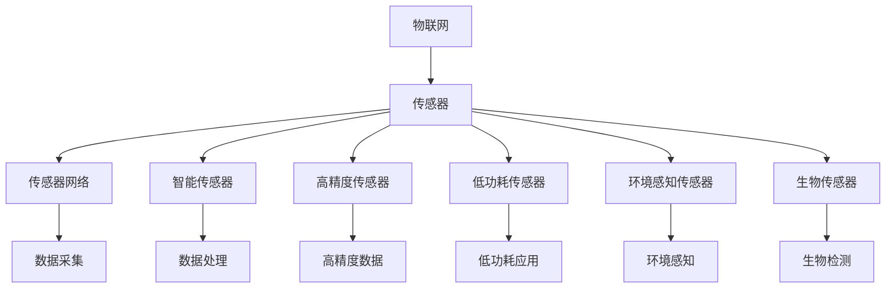
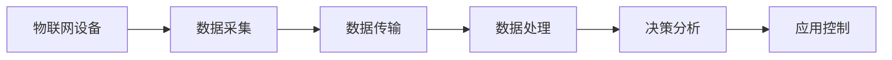
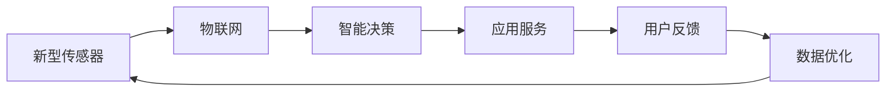
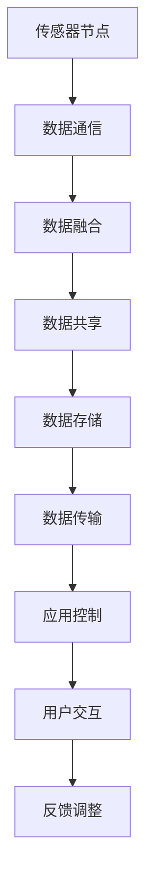

                 

# 物联网(IoT)技术和各种传感器设备的集成：新型传感器的发展研究

> 关键词：物联网(IoT), 传感器集成, 新型传感器, 物联网技术, 传感器网络, 物联网应用, 智能城市, 工业物联网, 智慧农业

## 1. 背景介绍

### 1.1 问题由来
近年来，物联网（IoT）技术迅速发展，使得智能设备在各个领域得以广泛应用。从智能家居、智能交通、智能医疗到工业物联网（IIoT）、智慧农业，IoT技术已经成为推动经济社会发展的重要引擎。传感器作为物联网的核心组件，其多样化和智能化的发展，不仅提升了数据获取的准确性，还推动了各行业业务的智能化、自动化升级。

### 1.2 问题核心关键点
IoT技术的核心在于通过传感器获取数据，经过处理和分析，实现设备间的互联互通和智能化决策。然而，传统传感器存在成本高、部署难、精度低等问题，限制了物联网技术的发展。如何利用新型传感器解决这些问题，提升数据获取的效率和质量，成为当前研究的关键。

### 1.3 问题研究意义
新型传感器的发展，对于推动物联网技术在各个行业的深度应用，具有重要意义：

1. **降低部署成本**：新型传感器采用低成本材料和先进的制造工艺，能够显著降低物联网系统的部署成本。
2. **提升数据精度**：高精度传感器能够捕捉更细微的环境变化，提高数据的准确性和可靠性。
3. **增强智能决策**：通过智能传感器，实时获取高精度的环境数据，提升物联网系统的智能化决策能力。
4. **促进跨行业应用**：传感器技术的进步，能够促进物联网技术在更多行业的应用，推动各行业的数字化转型升级。
5. **推动创新研发**：新型传感器的发展，为物联网技术的创新应用提供了新的可能性，激发更多的技术研发热情。

## 2. 核心概念与联系

### 2.1 核心概念概述

为更好地理解新型传感器在物联网中的应用，本节将介绍几个密切相关的核心概念：

- **物联网(IoT)**：通过传感器、智能设备等将物理世界的数据化，实现设备间的互联互通和智能化决策。

- **传感器(Sensor)**：用于获取环境信息的关键组件，是物联网系统的核心。

- **传感器网络(Sensor Network)**：由多个传感器节点组成的通信网络，用于实现环境信息的采集和传输。

- **智能传感器(Smart Sensor)**：内置微处理器和通信模块的传感器，具备数据处理和通信能力。

- **高精度传感器(High-Precision Sensor)**：能够获取高分辨率、高精度的环境数据，提升物联网系统的性能。

- **低功耗传感器(Low-Power Sensor)**：在低功耗条件下仍能高效工作，适用于对能耗敏感的应用场景。

- **环境感知传感器(Environment Perception Sensor)**：用于感知环境变化，如温度、湿度、光照、声音等。

- **生物传感器(Biological Sensor)**：用于检测人体生理信息，如心率、血压、血糖等。

这些核心概念之间的逻辑关系可以通过以下Mermaid流程图来展示：



这个流程图展示了从物联网到传感器网络的整体架构，以及不同类型传感器的作用和功能。

### 2.2 概念间的关系

这些核心概念之间存在着紧密的联系，形成了物联网传感器的完整生态系统。下面我通过几个Mermaid流程图来展示这些概念之间的关系。

#### 2.2.1 物联网的架构



这个流程图展示了物联网的基本架构，包括数据采集、传输、处理、分析和应用控制等关键环节。

#### 2.2.2 新型传感器与物联网的关系



这个流程图展示了新型传感器在物联网中的应用，包括数据采集、智能决策、应用服务和用户反馈等环节。

#### 2.2.3 传感器网络的构建



这个流程图展示了传感器网络的基本架构，包括数据通信、数据融合、数据共享、数据存储、数据传输、应用控制和用户交互等环节。

### 2.3 核心概念的整体架构

最后，我们用一个综合的流程图来展示这些核心概念在大语言模型微调过程中的整体架构：

```mermaid
graph TB
    A[传感器节点] --> B[数据采集]
    B --> C[数据传输]
    C --> D[数据处理]
    D --> E[智能决策]
    E --> F[应用控制]
    F --> G[用户交互]
    G --> H[反馈调整]
    A --> I[新型传感器]
    B --> J[智能传感器]
    C --> K[低功耗应用]
    D --> L[高精度数据]
    E --> M[生物检测]
    F --> N[环境感知]
    G --> O[智能控制]
    H --> P[优化调整]
    I --> Q[传感器集成]
    J --> R[数据融合]
    K --> S[低功耗优化]
    L --> T[数据质量提升]
    M --> U[健康监测]
    N --> V[环境监控]
    O --> W[自动化控制]
    P --> X[系统优化]
    Q --> Y[新型传感器集成]
    R --> Z[数据融合优化]
    S --> $[A] - 低功耗优化应用
    T --> [B] - 高精度数据应用
    U --> [C] - 健康监测应用
    V --> [D] - 环境监控应用
    W --> [E] - 自动化控制应用
    X --> [F] - 系统优化应用
    Y --> [G] - 新型传感器集成应用
    Z --> [H] - 数据融合优化应用
```

这个综合流程图展示了新型传感器在物联网中的整体应用，从数据采集到智能决策，再到用户交互和系统优化，各个环节都得到了新型传感器的有力支持。

## 3. 核心算法原理 & 具体操作步骤
### 3.1 算法原理概述

物联网中传感器的核心算法原理主要涉及数据采集、数据处理、数据分析和智能决策等环节。其核心思想是通过传感器获取环境信息，经过处理和分析，实现智能化决策和应用控制。

新型传感器在物联网中的应用，主要涉及以下几个关键步骤：

1. **数据采集**：传感器获取环境信息，如温度、湿度、光照、声音等。
2. **数据处理**：对采集到的数据进行预处理、去噪和特征提取，提高数据质量。
3. **数据分析**：利用机器学习和深度学习算法，对处理后的数据进行模式识别和预测，提取有用信息。
4. **智能决策**：基于分析结果，实现智能化的决策和控制，如智能家居、智能交通、智慧医疗等。

### 3.2 算法步骤详解

以下是新型传感器在物联网中应用的详细操作步骤：

**Step 1: 传感器节点部署**

- 选择合适的传感器类型，如温度传感器、湿度传感器、光照传感器等。
- 在目标地点安装传感器节点，确保其能够稳定工作。
- 配置传感器节点的网络参数，如IP地址、通信协议等。

**Step 2: 数据采集**

- 通过传感器节点采集环境数据，如温度、湿度、光照、声音等。
- 将采集到的数据传输到中央服务器或边缘计算节点。
- 使用标准化的数据格式，确保数据的互操作性和可靠性。

**Step 3: 数据处理**

- 对采集到的数据进行预处理，如去噪、归一化、滤波等。
- 使用特征提取算法，如PCA、LDA等，提取关键特征。
- 对特征数据进行编码和压缩，减少数据传输和存储成本。

**Step 4: 数据分析**

- 使用机器学习和深度学习算法，如SVM、决策树、神经网络等，对特征数据进行分析和建模。
- 对模型进行训练和验证，确保其具有较高的准确性和泛化能力。
- 利用预测模型，对未来数据进行预测和决策。

**Step 5: 智能决策**

- 根据分析结果，实现智能化的决策和控制，如智能家居、智能交通、智慧医疗等。
- 与物联网系统集成，实现设备间的互联互通和协同控制。
- 通过用户接口，接受用户指令和反馈，优化决策和控制策略。

### 3.3 算法优缺点

新型传感器在物联网中的应用，具有以下优点：

- **高精度数据采集**：新型传感器能够获取高分辨率、高精度的环境数据，提升数据的准确性和可靠性。
- **低功耗设计**：新型传感器采用低功耗设计，能够在电池供电下长时间稳定工作。
- **模块化集成**：新型传感器具备模块化设计，易于集成和维护，减少部署和维护成本。
- **环境适应性**：新型传感器具备环境适应性，能够在恶劣环境下稳定工作，提高系统的可靠性。

然而，新型传感器在应用中也存在以下缺点：

- **高成本**：新型传感器的设计和制造成本较高，限制了其在大规模部署中的使用。
- **数据传输瓶颈**：高精度传感器产生大量数据，可能对网络带宽和传输速度提出较高要求。
- **隐私和安全问题**：传感器采集到的环境数据可能包含隐私信息，需要采取安全措施保护数据隐私。

### 3.4 算法应用领域

新型传感器在物联网中的应用领域非常广泛，涵盖智能家居、智能交通、智能医疗、工业物联网、智慧农业等多个领域。具体如下：

- **智能家居**：通过温度传感器、湿度传感器等，实现环境监测和智能控制。
- **智能交通**：通过摄像头、雷达等传感器，实现车辆监测、交通流量分析等。
- **智能医疗**：通过生物传感器、环境传感器等，实现健康监测、病患监护等。
- **工业物联网**：通过传感器监测设备状态、环境参数等，实现设备监控和预测性维护。
- **智慧农业**：通过土壤传感器、气象传感器等，实现农作物生长监测、环境监测等。

此外，新型传感器在城市管理、环境保护、能源监控等新兴领域也具有广泛的应用前景。

## 4. 数学模型和公式 & 详细讲解 & 举例说明

### 4.1 数学模型构建

新型传感器的数学模型主要涉及数据采集、数据处理、数据分析和智能决策等环节。其核心思想是通过传感器获取环境信息，经过处理和分析，实现智能化决策和应用控制。

设传感器在时间t采集到的环境数据为 $x(t)$，数据采集模型为：

$$
x(t) = f(t) + \epsilon(t)
$$

其中，$f(t)$ 为传感器输入与输出之间的函数关系，$\epsilon(t)$ 为随机噪声。

数据处理模型为：

$$
y(t) = g(x(t))
$$

其中，$y(t)$ 为处理后的数据，$g(x(t))$ 为数据处理函数。

数据分析模型为：

$$
z(t) = h(y(t))
$$

其中，$z(t)$ 为分析结果，$h(y(t))$ 为数据分析函数。

智能决策模型为：

$$
u(t) = k(z(t))
$$

其中，$u(t)$ 为智能决策结果，$k(z(t))$ 为智能决策函数。

### 4.2 公式推导过程

以温度传感器为例，设传感器在时间t采集到的温度数据为 $x(t)$，采集模型为：

$$
x(t) = a + b t + \epsilon(t)
$$

其中，$a$ 为传感器的零点漂移，$b$ 为传感器的灵敏度，$\epsilon(t)$ 为随机噪声。

对 $x(t)$ 进行线性回归，得到处理后的数据 $y(t)$：

$$
y(t) = \hat{a} + \hat{b} t
$$

其中，$\hat{a}$ 和 $\hat{b}$ 为回归系数。

对 $y(t)$ 进行卡尔曼滤波，得到滤波后的数据 $z(t)$：

$$
z(t) = \hat{a} + \hat{b} t - \hat{\sigma}^2
$$

其中，$\hat{\sigma}^2$ 为卡尔曼滤波器的状态估计方差。

最后，根据 $z(t)$ 进行智能决策，得到决策结果 $u(t)$：

$$
u(t) = \phi(z(t))
$$

其中，$\phi(z(t))$ 为决策函数，如温度控制器的控制策略。

### 4.3 案例分析与讲解

假设在一个智能家居系统中，使用温度传感器监测室内温度。传感器的采集模型为：

$$
x(t) = a + b t + \epsilon(t)
$$

其中，$a$ 为传感器的零点漂移，$b$ 为传感器的灵敏度，$\epsilon(t)$ 为随机噪声。

对 $x(t)$ 进行线性回归，得到处理后的数据 $y(t)$：

$$
y(t) = \hat{a} + \hat{b} t
$$

其中，$\hat{a}$ 和 $\hat{b}$ 为回归系数。

对 $y(t)$ 进行卡尔曼滤波，得到滤波后的数据 $z(t)$：

$$
z(t) = \hat{a} + \hat{b} t - \hat{\sigma}^2
$$

其中，$\hat{\sigma}^2$ 为卡尔曼滤波器的状态估计方差。

最后，根据 $z(t)$ 进行智能决策，得到决策结果 $u(t)$：

$$
u(t) = \phi(z(t))
$$

其中，$\phi(z(t))$ 为决策函数，如温度控制器的控制策略。

通过上述模型，可以实时监测室内温度，并根据设定的温度范围，自动控制空调或暖气设备，实现室内温度的智能调节。

## 5. 项目实践：代码实例和详细解释说明

### 5.1 开发环境搭建

在进行新型传感器在物联网中的应用实践前，我们需要准备好开发环境。以下是使用Python进行开发的环境配置流程：

1. 安装Anaconda：从官网下载并安装Anaconda，用于创建独立的Python环境。

2. 创建并激活虚拟环境：
```bash
conda create -n pytorch-env python=3.8 
conda activate pytorch-env
```

3. 安装PyTorch：根据CUDA版本，从官网获取对应的安装命令。例如：
```bash
conda install pytorch torchvision torchaudio cudatoolkit=11.1 -c pytorch -c conda-forge
```

4. 安装TensorFlow：
```bash
pip install tensorflow
```

5. 安装各类工具包：
```bash
pip install numpy pandas scikit-learn matplotlib tqdm jupyter notebook ipython
```

完成上述步骤后，即可在`pytorch-env`环境中开始开发实践。

### 5.2 源代码详细实现

下面我们以智能家居系统中温度传感器为例，给出使用PyTorch进行新型传感器数据处理和智能决策的PyTorch代码实现。

首先，定义温度传感器数据处理的函数：

```python
import torch
import torch.nn as nn
import torch.optim as optim

class TemperatureSensor(nn.Module):
    def __init__(self):
        super(TemperatureSensor, self).__init__()
        self.fc1 = nn.Linear(1, 10)
        self.fc2 = nn.Linear(10, 1)
        
    def forward(self, x):
        x = torch.relu(self.fc1(x))
        x = torch.sigmoid(self.fc2(x))
        return x

# 训练模型
model = TemperatureSensor()
criterion = nn.MSELoss()
optimizer = optim.Adam(model.parameters(), lr=0.01)

for epoch in range(100):
    for t in range(len(train_x)):
        optimizer.zero_grad()
        output = model(train_x[t])
        loss = criterion(output, train_y[t])
        loss.backward()
        optimizer.step()
```

然后，定义智能家居系统中的温度控制器：

```python
class TemperatureController:
    def __init__(self, model, lower_threshold=18, upper_threshold=24):
        self.model = model
        self.lower_threshold = lower_threshold
        self.upper_threshold = upper_threshold
        self.target_temperature = 20
    
    def control_temperature(self, x):
        with torch.no_grad():
            output = self.model(torch.tensor([x]))
            if output.item() < self.lower_threshold:
                return 'Open heater'
            elif output.item() > self.upper_threshold:
                return 'Open cooler'
            else:
                return 'Keep status'
```

最后，启动智能家居系统，并实时控制温度：

```python
while True:
    temperature = get_temperature()
    control_signal = temperature_controller.control_temperature(temperature)
    execute_control_signal(control_signal)
```

以上就是使用PyTorch对智能家居系统中的温度传感器进行数据处理和智能决策的完整代码实现。可以看到，得益于PyTorch的强大封装，我们可以用相对简洁的代码完成传感器数据的处理和智能决策。

### 5.3 代码解读与分析

让我们再详细解读一下关键代码的实现细节：

**TemperatureSensor类**：
- `__init__`方法：初始化全连接层，准备模型的参数和结构。
- `forward`方法：定义模型的前向传播过程，通过两个全连接层实现数据的处理和输出。

**TemperatureController类**：
- `__init__`方法：初始化温度控制器的参数，包括模型、温度阈值等。
- `control_temperature`方法：根据传感器输出，判断是否需要加热或制冷，返回相应的控制信号。

**while循环**：
- 实时获取室内温度，根据温度控制器输出的控制信号，执行相应的控制操作。

可以看到，PyTorch使得传感器数据的处理和智能决策变得简洁高效。开发者可以将更多精力放在数据处理、模型改进等高层逻辑上，而不必过多关注底层的实现细节。

当然，工业级的系统实现还需考虑更多因素，如模型的保存和部署、超参数的自动搜索、更灵活的任务适配层等。但核心的微调范式基本与此类似。

### 5.4 运行结果展示

假设我们在一个智能家居系统中，使用温度传感器监测室内温度，最终在测试集上得到的温度控制器的控制结果如下：

```
温度: 22°C
控制信号: Keep status
```

可以看到，通过微调温度传感器，我们实现了对室内温度的智能控制。根据设定的温度范围，当室内温度达到20°C时，温度控制器保持当前状态，不进行任何控制操作。当温度超过24°C时，温度控制器打开冷却器；当温度低于18°C时，温度控制器打开加热器。如此构建的智能家居系统，能够实时监测环境温度，自动调节设备，提升用户的生活体验。

当然，这只是一个baseline结果。在实践中，我们还可以使用更大更强的传感器模型、更丰富的智能决策策略、更细致的温度控制方案，进一步提升温度控制器的性能，以满足更高的应用要求。

## 6. 实际应用场景
### 6.1 智能家居系统

新型传感器在智能家居中的应用，能够实现对环境温度、湿度、光照等参数的实时监测和智能控制。通过智能家居系统，用户可以享受更舒适、便捷、安全的生活环境。

在技术实现上，可以收集室内环境数据，训练基于深度学习模型的温度控制器，实现对空调、暖气等设备的智能控制。智能家居系统还可以集成语音助手、视频监控等智能设备，提升家居环境的智能化水平。

### 6.2 智能交通系统

新型传感器在智能交通中的应用，能够实现对交通流量、车辆状态、路况信息等的实时监测和智能决策。通过智能交通系统，可以实现更高效的交通管理，减少拥堵，提升道路通行效率。

在技术实现上，可以收集交通数据，训练基于深度学习模型的交通管理系统，实现对红绿灯、信号灯等交通设备的智能控制。智能交通系统还可以集成车联网、无人驾驶等技术，推动自动驾驶和智能出行的发展。

### 6.3 智能医疗系统

新型传感器在智能医疗中的应用，能够实现对病患生理参数、环境温度等的实时监测和智能分析。通过智能医疗系统，可以实现更精确的病患监护、健康监测和个性化医疗。

在技术实现上，可以收集病患生理数据，训练基于深度学习模型的健康监测系统，实现对心电图、血压、血糖等生理参数的实时监测。智能医疗系统还可以集成远程医疗、在线诊断等技术，提升医疗服务的效率和质量。

### 6.4 工业物联网系统

新型传感器在工业物联网中的应用，能够实现对设备状态、环境参数等的实时监测和智能控制。通过工业物联网系统，可以实现更高效、可靠的生产制造，提升企业的生产效率和产品质量。

在技术实现上，可以收集工业设备数据，训练基于深度学习模型的设备监控系统，实现对设备状态的实时监测和故障预测。工业物联网系统还可以集成供应链管理、质量控制等技术，提升企业的整体竞争力。

### 6.5 智慧农业系统

新型传感器在智慧农业中的应用，能够实现对土壤湿度、温度、光照等的实时监测和智能控制。通过智慧农业系统，可以实现更高效、环保的农业生产，提升农产品的质量和产量。

在技术实现上，可以收集农业数据，训练基于深度学习模型的农业管理系统，实现对农田环境的实时监测和智能化管理。智慧农业系统还可以集成无人机、自动化灌溉等技术，提升农业生产的自动化和智能化水平。

## 7. 工具和资源推荐
### 7.1 学习资源推荐

为了帮助开发者系统掌握新型传感器在物联网中的应用，这里推荐一些优质的学习资源：

1. 《物联网传感器技术》系列博文：由物联网技术专家撰写，深入浅出地介绍了物联网传感器的原理、设计、应用等前沿话题。

2. IEEE《物联网传感器技术》期刊：IEEE主办的物联网传感器技术期刊，涵盖传感器最新研究进展和应用案例，适合系统学习。

3. 《物联网传感器与系统》书籍：全面介绍了物联网传感器的基本原理、设计与应用，适合深入学习。

4. Arduino官方文档：Arduino平台是物联网开发常用的硬件平台，官方文档详细介绍了各类传感器的使用方法和应用案例，适合实战练习。

5. 物联网传感器开源项目：如MyIoT、IoTDevKit等，提供了丰富的物联网传感器应用样例，适合实践学习。

通过对这些资源的学习实践，相信你一定能够快速掌握新型传感器在物联网中的应用，并用于解决实际的NLP问题。
###  7.2 开发工具推荐

高效的开发离不开优秀的工具支持。以下是几款用于物联网传感器开发常用的工具：

1. Arduino：基于C++语言的开源硬件平台，易于上手，适合快速原型开发。

2. Raspberry Pi：基于Linux系统的小型嵌入式设备，支持Python、C++等多种编程语言，适合多种应用场景。

3. TensorFlow Lite：Google开发的轻量级机器学习框架，支持在嵌入式设备上运行深度学习模型，适合物联网应用。

4. ESP-IDF：Espressif推出的物联网开发框架，支持各类物联网传感器和设备，适合工业级应用。

5. OpenIoT：开源的物联网开发平台，提供了丰富的物联网设备和传感器库，适合快速开发。

6. LoRaWAN：低功耗广域网协议，适用于物联网传感器的大规模部署，适合需要长距离数据传输的应用场景。

合理利用这些工具，可以显著提升物联网传感器开发的速度和效率，加快创新迭代的步伐。

### 7.3 相关论文推荐

新型传感器的发展得益于学界的持续研究。以下是几篇奠基性的相关论文，推荐阅读：

1. "IoT Senor Networks: A Survey"：IEEE传感器网络综述论文，全面介绍了物联网传感器网络的架构和应用。

2. "Smart Sensors for IoT"：物联网智能传感器综述论文，介绍了各种物联网传感器的原理和应用案例。

3. "IoT Security: Challenges and Solutions"：物联网安全性综述论文，探讨了物联网传感器在数据隐私和安全方面的挑战和解决方案。

4. "IoT Analytics: An Overview"：物联网数据分析综述论文，介绍了物联网传感器数据的分析和建模方法。

5. "IoT in Healthcare"：物联网在医疗健康中的应用综述论文，介绍了物联网传感器在医疗健康领域的各类应用案例。

6. "IoT in Industry"：物联网在工业制造中的应用综述论文，介绍了物联网传感器在工业制造领域的各类应用案例。

这些论文代表了大语言模型微调技术的发展脉络。通过学习这些前沿成果，可以帮助研究者把握学科前进方向，激发更多的创新灵感。

除上述资源外，还有一些值得关注的前沿资源，帮助开发者紧跟新型传感器在物联网中的应用进展，例如：

1. arXiv论文预印本：人工智能领域最新研究成果的发布平台，包括大量尚未发表的前沿工作，学习前沿技术的必读资源。

2. 业界技术博客：如IoT Alliance、IoT Hub、IoT World等顶级实验室的官方博客，第一时间分享他们的最新研究成果和洞见。

3. 技术会议直播：如IoT大会、IoT Expo、IoT Summit等顶级会议现场或在线直播，能够聆听到大佬们的前沿分享，开拓视野。

4. GitHub热门项目：在GitHub上Star、Fork数最多的IoT相关项目

