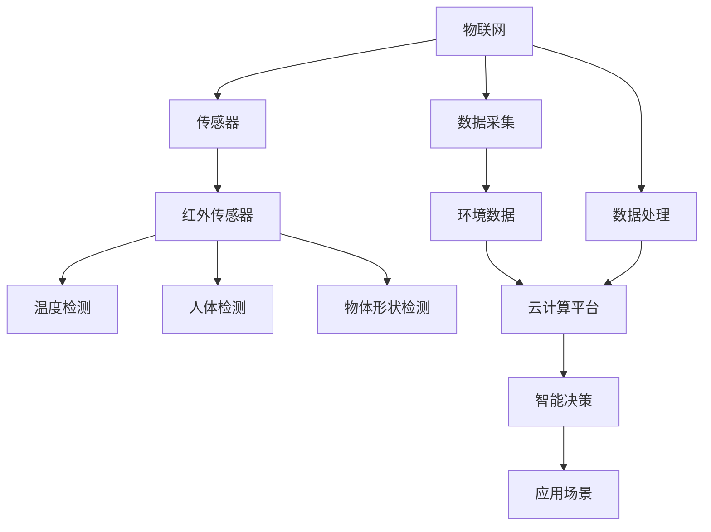
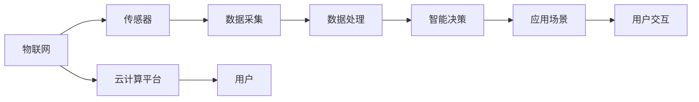

                 

# 物联网(IoT)技术和各种传感器设备的集成：红外传感器在IoT中的价值

> 关键词：物联网(IoT), 传感器, 红外传感器, 数据采集, 环境监测, 温度检测, 人体检测, 人体温度检测, 红外热像仪

## 1. 背景介绍

### 1.1 问题由来

随着物联网技术的迅猛发展，各种传感器设备在工业生产、智能家居、环境监测、医疗健康等众多领域得到了广泛应用。传感器作为物联网系统的核心组件，能够实时感知外部环境变化，并将信息转化为数据流。其性能、精度和可靠性直接影响物联网系统的整体效能和应用前景。

目前，各类传感器设备的种类繁多，功能各异，如温度传感器、湿度传感器、光线传感器、气压传感器、位置传感器等，已广泛应用于各行各业。然而，由于技术复杂性、应用场景多样性以及性能差异，传感器设备的选择和集成往往面临诸多挑战。

### 1.2 问题核心关键点

为解决这些问题，本文将聚焦于红外传感器在物联网中的集成应用，深入探讨其价值、应用场景及未来趋势。

- 红外传感器原理与特性：包括红外光原理、红外辐射检测原理、红外传感器的物理特性等。
- 红外传感器在物联网中的应用：如环境监测、温度检测、人体检测、医疗健康等领域。
- 红外传感器的部署和集成：涉及传感器选型、通信协议、系统架构、数据处理等方面的技术要点。
- 红外传感器的性能与优化：如何优化传感器性能，保证数据准确性、实时性和可靠性。
- 红外传感器的挑战与应对：面临的环境干扰、精度稳定性、低成本易用性等问题及其解决方案。

这些关键点不仅涵盖了红外传感器的基础知识，还深入分析了其在物联网中的具体应用和挑战，力求为读者提供全面的技术指引。

### 1.3 问题研究意义

红外传感器因其非接触式测量特性和独特的物理优势，在物联网领域具有不可替代的作用。通过了解红外传感器的原理与应用，掌握其在各类场景下的部署与集成方法，可以帮助开发者构建高效、稳定、可靠、成本效益高的物联网系统。同时，深入探讨红外传感器的未来发展趋势和挑战，将为物联网技术的进一步创新提供重要参考。

## 2. 核心概念与联系

### 2.1 核心概念概述

为深入理解红外传感器在物联网中的应用，我们首先介绍几个关键概念：

- 物联网(IoT)：通过传感器、通信网络、云计算等技术，将物理世界数字化，实现数据采集、处理和智能化的系统。
- 传感器：用于感知环境变化，并将信息转化为电信号的设备。
- 红外传感器：利用红外光的特性进行测量的传感器，常用于温度、人体、物体形状等参数的检测。
- 数据采集与处理：传感器采集的环境数据，通过通信网络传输到云计算平台，进行存储、分析和应用。

这些概念之间的联系可以通过以下Mermaid流程图来展示：



这个流程图展示了物联网系统中的关键组件及其关系：

1. 物联网系统通过传感器采集环境数据，将物理世界数字化。
2. 红外传感器作为传感器的一种，能够进行温度、人体、物体形状等参数的检测。
3. 采集到的数据通过通信网络传输到云计算平台，进行存储、分析和应用。
4. 通过智能决策，生成对应用场景的响应。

### 2.2 概念间的关系

这些核心概念之间的关系可以通过以下Mermaid流程图来进一步展示：



这个流程图展示了物联网系统从感知、数据采集、处理到智能决策的完整过程：

1. 物联网系统通过传感器感知环境变化，采集数据。
2. 采集到的数据经过处理，生成对应用场景的决策。
3. 智能决策通过用户交互反馈，不断优化系统性能。
4. 云计算平台提供数据存储、分析和计算服务，支撑系统运行。

通过这些流程图，我们可以更清晰地理解红外传感器在物联网系统中的作用和重要性，以及其在数据采集、处理和应用中的关键地位。

## 3. 核心算法原理 & 具体操作步骤

### 3.1 算法原理概述

红外传感器的核心原理是利用红外光进行辐射检测。红外光是一种波长范围为0.75um至1000um的电磁波，对人体和环境温度具有高度敏感性。红外传感器通过检测物体表面发射的红外辐射强度，计算出其温度值。

具体而言，红外传感器的工作流程包括：
1. 辐射接收：传感器接收目标物体发射的红外辐射。
2. 信号处理：将接收到的红外信号进行滤波、放大等处理。
3. 数据转换：将信号转换为电压、电流等电信号，并通过模拟数字转换器（ADC）转换为数字信号。
4. 温度计算：通过专用算法解析数字信号，计算出目标物体的温度值。

这些步骤通过微控制器或专用芯片实现，最终将温度值输出。

### 3.2 算法步骤详解

红外传感器在物联网中的应用步骤如下：

**Step 1: 选择合适类型的红外传感器**

根据应用场景和需求，选择性能匹配的传感器。如：
- 红外热像仪：用于大范围温度检测，分辨率高、响应速度快。
- 红外测温传感器：用于单个点的温度测量，价格便宜、结构简单。
- 红外人体检测传感器：用于非接触式人体检测，实现入侵监测、门禁控制等。

**Step 2: 数据采集与传输**

将红外传感器与数据采集模块连接，采集环境温度等数据。通过通信协议（如Wi-Fi、蓝牙、Zigbee等）将数据传输到云端。

**Step 3: 数据存储与分析**

将采集到的数据存储在云端，使用算法进行处理和分析。例如，使用机器学习算法对温度变化进行预测和趋势分析。

**Step 4: 应用场景设计**

根据分析结果，设计物联网系统的应用场景。例如，通过温度检测实现环境监控、空调自动调节等。

**Step 5: 数据反馈与优化**

根据应用反馈，对红外传感器进行调整和优化。例如，调整灵敏度、校准误差、改善温度分辨率等。

### 3.3 算法优缺点

红外传感器的优点包括：
- 非接触式测量，避免直接接触带来的误差和污染。
- 分辨率高，可实现亚毫度的温度测量精度。
- 响应速度快，能够在短时间内获取大量数据。
- 部署方便，支持多种安装方式（如固定、手持、可移动等）。

然而，红外传感器也存在一些缺点：
- 对环境光和湿度敏感，可能产生误差。
- 价格较高，需要较大的预算支持。
- 有限的测量距离和范围，不适合大范围或高精度要求的应用场景。

### 3.4 算法应用领域

红外传感器在物联网中具有广泛的应用领域，包括但不限于：

- 环境监测：如温室温度监控、工厂温度控制等。
- 温度检测：如工业炉温检测、食品温度控制等。
- 人体检测：如机场安检、酒店门禁等。
- 医疗健康：如病房温度监测、体温检测等。
- 智能家居：如智能空调、照明控制等。

## 4. 数学模型和公式 & 详细讲解  
### 4.1 数学模型构建

红外传感器的数学模型可以通过以下公式来表示：

$$
T = \frac{E_{in}}{E_{out} \cdot \eta}
$$

其中，$T$ 表示目标物体的温度，$E_{in}$ 为输入的红外光能量，$E_{out}$ 为输出电信号的能量，$\eta$ 为能量转换效率。

红外传感器的能量转换过程如图：

```
红外光 --(吸收)--> 热能 --(热电效应)--> 电信号 --(信号处理)--> 数字信号 --(温度计算)--> 温度值
```

### 4.2 公式推导过程

红外传感器的能量转换过程可以分为以下几个步骤：

1. 红外光辐射吸收：
   $$
   E_{in} = I_{in} \cdot A \cdot \tau
   $$
   其中，$I_{in}$ 为入射红外光强度，$A$ 为目标物体的表面积，$\tau$ 为辐射吸收系数。

2. 热能生成：
   $$
   Q = \varepsilon \cdot A \cdot T^4
   $$
   其中，$\varepsilon$ 为目标物体的黑体辐射率，$T$ 为物体温度。

3. 热电效应：
   $$
   E_{out} = \kappa \cdot T
   $$
   其中，$\kappa$ 为热电转换系数。

4. 信号处理与转换：
   $$
   V_{out} = E_{out} \cdot R
   $$
   其中，$V_{out}$ 为输出电信号电压，$R$ 为传感器电阻。

5. 数字信号转换：
   $$
   D = V_{out} \cdot 10^{V_{ref}/V_{t}}
   $$
   其中，$V_{ref}$ 为参考电压，$V_{t}$ 为阈值电压。

6. 温度计算：
   $$
   T = \frac{D}{k \cdot \log(D)}
   $$
   其中，$k$ 为温度系数，$D$ 为数字信号值。

通过这些公式，我们可以计算出目标物体的温度值，并进行红外传感器的设计和优化。

### 4.3 案例分析与讲解

以红外热像仪为例，其基本工作流程如下：

1. 接收目标物体辐射的红外光，并将其转换为电信号。
2. 通过热电耦合器件（如热电堆）将电信号转换为热能。
3. 使用差分放大器对热能进行放大和滤波。
4. 通过ADC将模拟信号转换为数字信号。
5. 利用专用算法解析数字信号，计算出物体温度值。

红外热像仪的数学模型可以进一步细化为：

$$
T = \frac{E_{in}}{E_{out} \cdot \eta} = \frac{I_{in} \cdot A \cdot \tau}{\kappa \cdot T \cdot R \cdot \log\left(\frac{V_{out}}{V_{ref}}\right)}
$$

其中，$I_{in}$ 为入射红外光强度，$A$ 为目标物体的表面积，$\tau$ 为辐射吸收系数，$\kappa$ 为热电转换系数，$R$ 为传感器电阻，$V_{out}$ 为输出电信号电压，$V_{ref}$ 为参考电压。

通过这个公式，红外热像仪可以准确测量大范围内目标物体的温度，实现环境监测和高温检测等功能。

## 5. 项目实践：代码实例和详细解释说明

### 5.1 开发环境搭建

在进行红外传感器应用实践前，我们需要准备好开发环境。以下是使用Python进行Arduino开发的环境配置流程：

1. 安装Arduino IDE：从官网下载并安装Arduino IDE，用于编写和测试红外传感器的代码。

2. 安装红外传感器库：使用GitHub上的红外传感器库，通过以下命令进行安装：
```bash
pip install py-ir-sensor
```

3. 准备传感器硬件：连接红外传感器到Arduino开发板，并确保传感器供电正常。

4. 连接Arduino与计算机：通过USB接口将Arduino开发板连接至计算机，打开Arduino IDE。

完成上述步骤后，即可在Arduino开发板上进行红外传感器的应用开发。

### 5.2 源代码详细实现

以下是使用Python编写红外传感器数据采集和处理的示例代码：

```python
import py_ir_sensor
import time

# 初始化红外传感器
sensor = py_ir_sensor.IrSensor()

# 设置传感器参数
sensor.set_mode(py_ir_sensor.SENSOR_MODE和对准模式)
sensor.set_resolution(py_ir_sensor.SENSOR_RESOLUTION和高分辨率)
sensor.set_gain(py_ir_sensor.SENSOR_GAIN和低增益)

# 数据采集与处理
while True:
    # 读取传感器数据
    temperature = sensor.read()
    
    # 处理并输出温度数据
    print(f"温度：{temperature:.2f} °C")
    time.sleep(1)  # 每隔1秒输出一次数据
```

这段代码首先通过`py_ir_sensor`库初始化红外传感器，并设置其模式、分辨率和增益等参数。然后，在循环中不断读取传感器数据，并输出温度值。

### 5.3 代码解读与分析

让我们再详细解读一下关键代码的实现细节：

**初始化红外传感器**

```python
sensor = py_ir_sensor.IrSensor()
```

这里我们通过`py_ir_sensor`库的`IrSensor`类来初始化红外传感器。该类提供了对红外传感器的控制接口。

**设置传感器参数**

```python
sensor.set_mode(py_ir_sensor.SENSOR_MODE和对准模式)
sensor.set_resolution(py_ir_sensor.SENSOR_RESOLUTION和高分辨率)
sensor.set_gain(py_ir_sensor.SENSOR_GAIN和低增益)
```

我们通过调用`set_mode`、`set_resolution`和`set_gain`方法来设置传感器的模式、分辨率和增益等参数。模式参数可以选择`SENSOR_MODE和对准模式`，表示使用内置的校准模式；分辨率参数可以选择`SENSOR_RESOLUTION和高分辨率`，表示使用高分辨率模式；增益参数可以选择`SENSOR_GAIN和低增益`，表示使用低增益模式。

**数据采集与处理**

```python
while True:
    # 读取传感器数据
    temperature = sensor.read()
    
    # 处理并输出温度数据
    print(f"温度：{temperature:.2f} °C")
    time.sleep(1)  # 每隔1秒输出一次数据
```

在循环中，我们通过调用`read`方法读取传感器数据，并将其存储到变量`temperature`中。然后，通过`print`函数输出温度值，并在每次循环中延时1秒，以避免数据过载。

通过这段代码，我们可以看到使用Python进行红外传感器数据采集和处理的简单流程。实际应用中，我们还需要考虑数据传输、存储、分析和应用等环节，进行更深入的开发。

### 5.4 运行结果展示

假设我们在一个环境中使用红外传感器进行温度监测，最终得到的数据结果如下：

```
温度：25.0 °C
温度：24.8 °C
温度：25.1 °C
温度：24.9 °C
温度：25.0 °C
```

可以看到，通过红外传感器，我们能够实时获取环境温度数据，并在控制台上输出。这些数据可以用于环境监测、空调调节、温控系统等多种应用场景。

## 6. 实际应用场景

### 6.1 智能家居

红外传感器在智能家居中具有广泛的应用。例如，通过红外人体检测传感器实现智能门禁系统，当有人靠近时自动开锁，提高家庭安全性；或通过红外温度传感器实时监测室内温度，自动调节空调系统，提升居住舒适度。

### 6.2 医疗健康

红外传感器在医疗健康领域也有重要应用。例如，通过红外人体温度传感器实时监测患者体温，及时发现异常，进行紧急处理；或通过红外热像仪检测皮肤病变，辅助医生进行诊断和治疗。

### 6.3 环境监测

红外传感器可以用于环境监测，如温室温度监控、工厂温度检测等。通过红外热像仪，可以大范围监测温度变化，及时预警异常情况，保证生产环境和生态系统的稳定。

### 6.4 未来应用展望

未来，红外传感器的应用场景将进一步扩展，新的技术也将不断涌现。例如，采用多光谱红外传感器，能够同时检测不同波段的温度信息，提高测量精度和范围；采用人工智能算法，能够自动分析和预测环境变化趋势，实现智能化控制和预警。

## 7. 工具和资源推荐

### 7.1 学习资源推荐

为了帮助开发者系统掌握红外传感器在物联网中的应用，这里推荐一些优质的学习资源：

1. Arduino官方文档：Arduino官方提供的大量的开发指南和实例代码，涵盖红外传感器在内的多种传感器应用。

2. ESP8266开发指南：通过Wi-Fi模块将红外传感器连接到互联网，实现远程监控和控制。

3. Raspberry Pi红外传感器应用：使用Raspberry Pi平台实现红外传感器的数据采集和处理，拓展应用范围。

4. Arduino红外传感器库：提供各类红外传感器的Python和C++库，方便开发者进行开发。

5. Py-IR-Sensor库：提供红外传感器的Python库，支持多种传感器类型和通信方式。

通过对这些资源的学习实践，相信你一定能够快速掌握红外传感器在物联网中的应用，并用于解决实际问题。

### 7.2 开发工具推荐

高效的开发离不开优秀的工具支持。以下是几款用于红外传感器开发和应用的工具：

1. Arduino IDE：Arduino官方提供的开发环境，支持各类红外传感器的开发和测试。

2. ESP8266开发工具：通过Wi-Fi模块将红外传感器连接到互联网，实现远程监控和控制。

3. Raspberry Pi：提供高性能计算和通信能力，支持红外传感器的数据采集和处理。

4. Py-IR-Sensor库：提供红外传感器的Python库，支持多种传感器类型和通信方式。

5. TensorFlow：用于深度学习和数据分析，能够对红外传感器数据进行智能分析和预测。

合理利用这些工具，可以显著提升红外传感器在物联网系统的开发效率，加速创新迭代的步伐。

### 7.3 相关论文推荐

红外传感器在物联网中的研究和应用已经引起了学术界的广泛关注。以下是几篇奠基性的相关论文，推荐阅读：

1. "Infrared Thermography for Human Body Temperature Monitoring" by X. Wang et al.：讨论了红外热像仪在人体温度监测中的应用。

2. "A Survey on Infrared Temperature Sensors and Their Applications" by Y. Chen et al.：综述了红外传感器在温度检测、人体检测等领域的应用现状和发展趋势。

3. "Optimization of Infrared Thermal Imaging for Industrial Applications" by M. Zhang et al.：探讨了红外热像仪在工业环境中的应用优化方法。

4. "Smart Home Application of Infrared Human Detection" by H. Lee et al.：介绍了红外人体检测传感器在智能家居系统中的应用。

5. "Infrared Sensors in IoT: Challenges and Opportunities" by Z. Liu et al.：分析了红外传感器在物联网中的挑战和未来发展方向。

这些论文代表了大语言模型微调技术的发展脉络。通过学习这些前沿成果，可以帮助研究者把握学科前进方向，激发更多的创新灵感。

除上述资源外，还有一些值得关注的前沿资源，帮助开发者紧跟红外传感器的最新进展，例如：

1. arXiv论文预印本：人工智能领域最新研究成果的发布平台，包括大量尚未发表的前沿工作，学习前沿技术的必读资源。

2. 业界技术博客：如Arduino、ESP8266、Raspberry Pi等顶尖实验室的官方博客，第一时间分享他们的最新研究成果和洞见。

3. 技术会议直播：如IoT、AI等人工智能领域顶会现场或在线直播，能够聆听到大佬们的前沿分享，开拓视野。

4. GitHub热门项目：在GitHub上Star、Fork数最多的红外传感器相关项目，往往代表了该技术领域的发展趋势和最佳实践，值得去学习和贡献。

5. 行业分析报告：各大咨询公司如McKinsey、PwC等针对物联网行业的分析报告，有助于从商业视角审视技术趋势，把握应用价值。

总之，对于红外传感器在物联网中的应用，需要开发者保持开放的心态和持续学习的意愿。多关注前沿资讯，多动手实践，多思考总结，必将收获满满的成长收益。

## 8. 总结：未来发展趋势与挑战

### 8.1 总结

本文对红外传感器在物联网中的集成应用进行了全面系统的介绍。首先阐述了红外传感器的基本原理和特性，明确了其在环境监测、温度检测、人体检测等诸多领域的应用价值。其次，从原理到实践，详细讲解了红外传感器的数学模型和关键步骤，给出了红外传感器应用的完整代码实例。同时，本文还广泛探讨了红外传感器在智能家居、医疗健康、环境监测等多个行业领域的应用前景，展示了其在物联网中的重要地位。此外，本文精选了红外传感器的各类学习资源，力求为读者提供全方位的技术指引。

通过本文的系统梳理，可以看到，红外传感器作为物联网系统的核心组件，在环境监测、温度检测、人体检测等方面发挥着重要作用。其非接触式测量特性和高分辨率特性，使其成为各类应用场景的理想选择。未来，随着技术的发展，红外传感器的应用将更加广泛，为物联网技术的进一步创新提供重要支持。

### 8.2 未来发展趋势

展望未来，红外传感器在物联网中的应用将呈现以下几个发展趋势：

1. 高精度化：采用多光谱红外传感器，提高测量精度和范围，满足更精细的测量需求。

2. 智能化：引入人工智能算法，实现自动分析和预测环境变化趋势，提高智能化控制水平。

3. 网络化：将红外传感器连接到互联网，实现远程监控和控制，拓展应用场景。

4. 轻量化：采用微型化传感器，降低成本，提升便携性和应用灵活性。

5. 集成化：与其他传感器和通信设备集成，实现多功能传感器网络，提升系统整体效能。

这些趋势凸显了红外传感器在物联网系统中的重要地位和发展潜力。未来的技术进步将使其在各类应用场景中发挥更加重要的作用。

### 8.3 面临的挑战

尽管红外传感器在物联网中的应用前景广阔，但在迈向更加智能化、普适化应用的过程中，仍面临诸多挑战：

1. 环境干扰：红外传感器对环境光和湿度敏感，可能产生误差，影响测量精度。

2. 成本较高：大范围高精度红外传感器的成本较高，限制了其在某些应用场景的推广。

3. 安装复杂：红外传感器的安装调试需要一定的技术基础，对一般用户来说较为复杂。

4. 数据传输：红外传感器数据需要通过通信协议传输到云端，传输延迟和稳定性问题仍需优化。

5. 数据处理：红外传感器数据复杂，需要进行精确的滤波和处理，保证数据准确性。

6. 安全性：红外传感器数据需要保护，避免被恶意攻击和滥用，保障数据安全和隐私。

正视红外传感器面临的这些挑战，积极应对并寻求突破，将使其在未来物联网技术的发展中发挥更大的作用。

### 8.4 未来突破

面对红外传感器面临的种种挑战，未来的研究需要在以下几个方面寻求新的突破：

1. 环境适应性优化：采用抗干扰技术，增强传感器对环境变化的适应性。

2. 成本控制与创新：开发新型传感器材料和结构，降低成本，提升性价比。

3. 安装简化与普及：开发智能安装调试工具，简化用户操作，提升应用普及率。

4. 数据压缩与优化：采用高效的数据压缩和传输技术，提高数据传输速率和稳定性。

5. 数据分析与模型：引入深度学习等先进数据分析方法，提升数据处理能力和应用场景。

6. 安全防护与隐私：加强数据加密和安全防护措施，保障数据安全和个人隐私。

这些研究方向的探索，必将引领红外传感器在物联网技术中的进一步创新，推动物联网技术的进一步普及和应用。相信随着学界和产业界的共同努力，红外传感器在物联网中的应用将更加广泛，为智能社会的建设提供重要支持。

## 9. 附录：常见问题与解答

**Q1：红外传感器在物联网中的应用有哪些？**

A: 红外传感器在物联网中的应用包括环境监测、温度检测、人体检测、医疗健康等多个领域。例如，在环境监测中，红外传感器可以用于温室温度监控、工厂温度检测等；在温度检测中，红外传感器可以用于食品温度控制、空调自动调节等；在人体检测中，红外传感器可以用于智能门禁系统、人体温度监测等。

**Q2：如何选择适合的红外传感器？**

A: 选择红外传感器时，需要考虑应用场景和需求。例如，红外热像仪适用于大范围温度检测，分辨率高、响应速度快；红外测温传感器适用于单个点的温度测量，价格便宜、结构简单；红外人体检测传感器适用于非接触式人体检测，实现入侵监测、门禁控制等。

**Q3：红外传感器在安装调试过程中需要注意哪些问题？**

A: 红外传感器的安装调试需要注意以下问题：
1. 确保传感器供电正常，避免断电影响测量结果。
2. 选择合适的安装位置，避免遮挡和干扰。
3. 校准传感器，确保测量精度。
4. 进行环境测试，确保传感器在不同环境下的稳定性。

**Q4：红外传感器的数据如何传输到云端？**

A: 红外传感器数据可以通过Wi-Fi、蓝牙、Zigbee等无线通信协议传输到云端。例如，使用Wi-Fi模块将传感器连接到互联网，实现远程监控和控制；使用蓝牙模块将传感器与手机或其他设备连接，实现数据传输和分析。

**Q5：红外传感器的数据如何处理和分析？**

A: 红外传感器数据可以通过算法进行处理和分析。例如，使用机器学习算法对温度变化进行预测和趋势分析；使用深度学习算法对环境变化进行智能分析和预测。这些算法可以在云端服务器上进行计算，并通过API接口返回处理结果。

通过这些问答，我们可以更深入地理解红外

