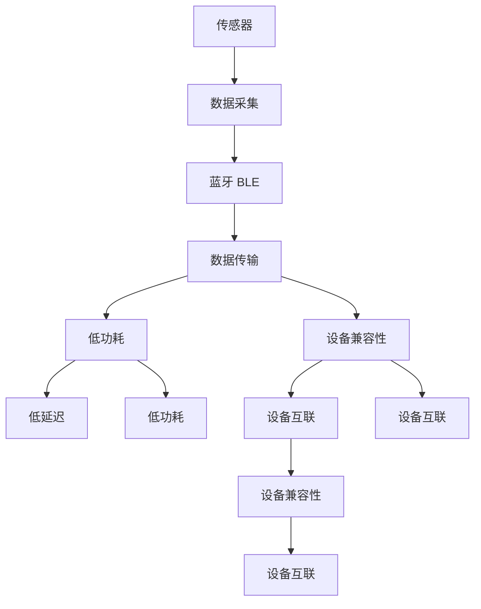

                 

# 物联网(IoT)技术和各种传感器设备的集成：蓝牙在物联网中的应用

> 关键词：物联网(IoT), 传感器, 蓝牙(BLE), 集成方案, 数据传输, 低功耗, 兼容性

## 1. 背景介绍

### 1.1 问题由来

物联网(IoT)技术近年来得到了迅猛发展，成为推动各行各业数字化转型的重要引擎。IoT设备通过各种传感器获取实时数据，进而通过网络传输到云端，进行数据分析和决策。然而，传感器数据通常具有高频、高维、低功耗等特性，这给数据传输和存储带来了巨大的挑战。同时，IoT设备往往需要在复杂多变的场景下运行，对数据传输的可靠性、实时性、安全性等方面都有较高的要求。

在这种背景下，蓝牙低功耗（BLE, Bluetooth Low Energy）技术因其无线传输距离短、低功耗、稳定性高、安全性好等优势，成为物联网领域数据传输的重要选择。通过蓝牙技术，IoT设备可以高效地与移动设备或其他IoT设备通信，实现数据的实时采集和传输。

### 1.2 问题核心关键点

蓝牙在物联网中扮演了重要角色，主要体现在以下几个方面：

- **数据传输效率**：蓝牙BLE具有较低的传输功耗和较大的有效传输距离，能够满足IoT设备对于数据传输的实时性和低功耗需求。
- **设备兼容性**：蓝牙技术被广泛应用于各种IoT设备中，具有广泛的设备兼容性，能够连接不同厂商、不同类型的传感器和智能设备。
- **数据安全**：蓝牙支持加密传输和认证机制，能够保障数据在传输过程中的安全性。
- **用户体验**：蓝牙技术具有低延迟、低功耗的特点，能够提升用户体验，特别是在移动设备上，蓝牙已经成为一种自然、便捷的连接方式。

### 1.3 问题研究意义

研究蓝牙在物联网中的应用，对于推动IoT技术的创新和应用，提高数据传输效率，提升设备兼容性，增强数据安全性，改善用户体验，具有重要意义：

1. **提升数据传输效率**：通过蓝牙BLE技术，IoT设备能够实现高频数据的实时采集和传输，满足大数据处理和实时决策的需求。
2. **增强设备兼容性**：蓝牙技术覆盖了各种IoT设备，有助于打破厂商间的设备壁垒，推动跨平台的设备互联互通。
3. **保障数据安全**：蓝牙技术的加密和认证机制，能够有效保护IoT设备传输的数据安全，防止数据泄露和攻击。
4. **改善用户体验**：蓝牙的低延迟和低功耗特性，能够提高IoT设备的使用便捷性和安全性，提升用户的满意度和忠诚度。
5. **推动技术发展**：蓝牙技术的不断演进，如BLE 5.x、LE Audio、Relay等新特性，为IoT设备的数据传输和应用提供了新的可能性。

## 2. 核心概念与联系

### 2.1 核心概念概述

为更好地理解蓝牙在物联网中的应用，本节将介绍几个密切相关的核心概念：

- **物联网(IoT)**：通过传感器、RFID等设备，将物理世界中的物体、人、流程等连接到网络中，实现数据感知、传输、处理、决策的智能系统。
- **蓝牙(BLE)**：一种无线通信技术，具有低功耗、低成本、短距离、高安全性的特点，广泛应用于各种IoT设备的数据传输。
- **数据传输**：IoT设备通过蓝牙BLE技术与云端或其他设备进行数据交换，是实现IoT应用的基础。
- **低功耗**：IoT设备通常需要长时间运行，低功耗设计能够延长设备电池寿命，提升设备的使用体验。
- **设备兼容性**：蓝牙技术被广泛应用于各种IoT设备中，具有广泛的设备兼容性，能够连接不同厂商、不同类型的传感器和智能设备。

这些核心概念之间的逻辑关系可以通过以下Mermaid流程图来展示：

```mermaid
graph TB
    A[物联网(IoT)] --> B[传感器]
    B --> C[蓝牙(BLE)]
    C --> D[数据传输]
    D --> E[低功耗]
    D --> F[设备兼容性]
```

这个流程图展示了大语言模型微调过程中各个概念之间的联系：

1. 物联网设备通过传感器采集数据。
2. 数据通过蓝牙BLE技术进行传输。
3. 蓝牙BLE技术提供低功耗设计。
4. 蓝牙技术具有广泛的设备兼容性。

### 2.2 概念间的关系

这些核心概念之间存在着紧密的联系，形成了蓝牙在物联网中的应用框架。下面我通过几个Mermaid流程图来展示这些概念之间的关系。

#### 2.2.1 蓝牙在物联网中的数据传输


这个流程图展示了蓝牙BLE在物联网中的应用过程：

1. 传感器采集数据。
2. 数据通过蓝牙BLE技术传输到云端或其他设备。
3. 云端进行数据分析和决策。

#### 2.2.2 BLE 5.x的新特性


这个流程图展示了蓝牙BLE技术的演进过程：

1. 蓝牙 BLE 4.2 是最初的蓝牙标准，主要用于简单的数据传输和设备连接。
2. BLE 5.0 引入了更多的特性，如改进的连接速度和功耗管理。
3. BLE 5.1 增加了更高效的编码和数据传输速率。
4. BLE 5.2 支持更大的数据传输量和更远的传输距离。
5. BLE 5.x 包括多种新特性，如LE Audio、Relay等，进一步提升了蓝牙技术的应用能力。

### 2.3 核心概念的整体架构

最后，我们用一个综合的流程图来展示蓝牙在物联网中的应用整体架构：



这个综合流程图展示了蓝牙在物联网中的应用整体架构：

1. 传感器采集数据。
2. 数据通过蓝牙BLE技术进行传输。
3. 蓝牙BLE技术提供低功耗设计。
4. 蓝牙技术具有广泛的设备兼容性。
5. 低功耗设计提升设备使用体验。
6. 蓝牙技术提供低延迟和低功耗特性。
7. 蓝牙技术实现设备间的互联互通。

通过这些流程图，我们可以更清晰地理解蓝牙在物联网中的应用过程中各个概念的关系和作用，为后续深入讨论具体的集成方案和应用场景奠定基础。

## 3. 核心算法原理 & 具体操作步骤

### 3.1 算法原理概述

蓝牙在物联网中的应用，核心在于利用蓝牙BLE技术的低功耗、低延迟和广泛兼容性的特点，实现IoT设备之间的高效数据传输。以下是蓝牙BLE在物联网中的核心算法原理：

1. **低功耗设计**：蓝牙BLE技术采用小功率发射器，可以在不降低传输距离的情况下，大幅降低功耗。通过采用分时唤醒和多通道通信等技术，进一步优化能耗。
2. **低延迟传输**：蓝牙BLE支持快速建立连接和传输数据，传输时延通常小于几毫秒。这使得IoT设备能够实时响应，快速处理数据。
3. **广泛设备兼容性**：蓝牙技术具有广泛的设备兼容性，可以连接不同类型的IoT设备和移动设备，实现设备互联互通。
4. **数据加密和认证**：蓝牙BLE支持数据加密和认证机制，能够保障数据在传输过程中的安全性，防止数据被截获或篡改。

### 3.2 算法步骤详解

蓝牙在物联网中的应用步骤一般包括以下几个关键步骤：

**Step 1: 设备连接和配对**

1. **设备连接**：蓝牙BLE设备通过广播信标(BEacons)进行广播，其他设备通过监听信标信号，识别和连接目标设备。
2. **设备配对**：在连接过程中，设备之间需要进行身份认证和密钥交换，确保连接的安全性。

**Step 2: 数据传输和存储**

1. **数据传输**：一旦建立连接，IoT设备可以实时传输传感器采集的数据。蓝牙BLE支持多种传输协议，如GATT(通用属性配置)和GATT Server API。
2. **数据存储**：IoT设备可以将采集到的数据存储在本地或云端，用于后续的数据分析和处理。

**Step 3: 数据处理和分析**

1. **数据处理**：IoT设备将采集到的数据进行初步处理，去除噪声和异常值，提取有用信息。
2. **数据分析**：将处理后的数据上传到云端，利用大数据分析技术进行深度挖掘和分析，提取有价值的信息。

**Step 4: 应用决策和反馈**

1. **应用决策**：根据分析结果，IoT设备可以对目标对象进行决策和控制，如智能家居、智能制造、智能农业等。
2. **反馈机制**：IoT设备将决策结果反馈给用户或相关系统，完成闭环控制。

### 3.3 算法优缺点

蓝牙在物联网中的应用具有以下优点：

- **低功耗设计**：蓝牙BLE技术低功耗设计可以延长IoT设备的电池寿命，提升设备的使用体验。
- **低延迟传输**：蓝牙BLE技术提供低延迟特性，能够满足IoT设备对实时性要求。
- **广泛设备兼容性**：蓝牙技术具有广泛的设备兼容性，能够连接不同类型的IoT设备和移动设备。
- **数据安全**：蓝牙BLE支持数据加密和认证机制，保障数据传输的安全性。

同时，蓝牙在物联网中也有一些缺点：

- **传输距离有限**：蓝牙BLE技术的传输距离通常在10米以内，对于需要远距离传输的应用场景可能不太适用。
- **带宽限制**：蓝牙BLE的带宽有限，不适合大规模数据传输。
- **网络覆盖问题**：蓝牙技术在室内或复杂环境下的网络覆盖性能可能较差，存在信号不稳定的问题。

### 3.4 算法应用领域

蓝牙在物联网中的应用已经涉及多个领域，包括但不限于以下几个方面：

- **智能家居**：通过蓝牙技术实现设备间的互联互通，如智能灯泡、智能锁、智能插座等。
- **智能医疗**：利用蓝牙技术实现健康数据的实时采集和传输，如可穿戴设备、医疗监控设备等。
- **智能制造**：通过蓝牙技术实现设备间的通信和数据共享，如工业物联网、自动化生产线等。
- **智能农业**：利用蓝牙技术实现农业数据的实时监测和控制，如智能温室、智能灌溉等。
- **智能交通**：通过蓝牙技术实现车辆间的通信和数据共享，如智能车联网、智能交通管理等。

蓝牙技术在物联网中的应用，已经展示了其强大的数据传输和设备互联能力，未来将在更多场景下得到应用，推动物联网技术的创新和应用。

## 4. 数学模型和公式 & 详细讲解 & 举例说明

### 4.1 数学模型构建

蓝牙在物联网中的应用主要涉及数据传输和设备连接等过程，其数学模型构建可以抽象为以下几个部分：

1. **连接建立过程**：模型描述设备之间如何通过广播信标进行连接和配对。
2. **数据传输过程**：模型描述数据如何通过蓝牙BLE进行传输和存储。
3. **数据处理和分析过程**：模型描述数据如何在IoT设备和云端进行处理和分析。
4. **应用决策和反馈过程**：模型描述IoT设备如何根据分析结果进行决策和反馈。

### 4.2 公式推导过程

以下是蓝牙在物联网中的应用数学模型及其公式推导：

**连接建立过程**

设蓝牙BLE设备的传输功率为$P$，接收灵敏度为$L$，发射距离为$d$，则连接建立的概率为：

$$
P_{\text{连接}} = \frac{P}{L} \times \text{exp}\left(-\frac{d^2}{4\sigma^2}\right)
$$

其中$\sigma^2$为环境噪声强度。

**数据传输过程**

设蓝牙BLE的数据传输速率为$R$，数据量为$D$，则传输所需时间为：

$$
T_{\text{传输}} = \frac{D}{R}
$$

**数据处理和分析过程**

设IoT设备的数据处理速率为$R_{\text{处理}}$，数据量为$D_{\text{处理}}$，则处理所需时间为：

$$
T_{\text{处理}} = \frac{D_{\text{处理}}}{R_{\text{处理}}}
$$

**应用决策和反馈过程**

设IoT设备的应用决策和反馈时间为$T_{\text{决策}}$，则总处理时间为：

$$
T_{\text{总}} = T_{\text{传输}} + T_{\text{处理}} + T_{\text{决策}}
$$

### 4.3 案例分析与讲解

以智能家居为例，以下是蓝牙BLE技术在其中的应用过程：

1. **设备连接**：智能灯泡、智能插座等IoT设备通过广播信标信号，智能手机或其他设备通过监听信标信号进行连接和配对。
2. **数据传输**：智能设备将采集到的环境温度、湿度、亮度等数据通过蓝牙BLE传输到智能手机。
3. **数据处理**：智能手机将采集到的数据进行处理和分析，如判断是否开启智能灯泡、调节温度等。
4. **应用决策和反馈**：智能设备根据智能手机的指令，进行相应的决策和反馈，如调节灯泡亮度、开关智能插座等。

通过蓝牙技术，智能家居系统实现了设备间的互联互通，提升了用户体验和生活质量。

## 5. 项目实践：代码实例和详细解释说明

### 5.1 开发环境搭建

在进行蓝牙在物联网中的应用实践前，我们需要准备好开发环境。以下是使用Python进行PyTorch开发的环境配置流程：

1. 安装Anaconda：从官网下载并安装Anaconda，用于创建独立的Python环境。

2. 创建并激活虚拟环境：
```bash
conda create -n pytorch-env python=3.8 
conda activate pytorch-env
```

3. 安装PyTorch：根据CUDA版本，从官网获取对应的安装命令。例如：
```bash
conda install pytorch torchvision torchaudio cudatoolkit=11.1 -c pytorch -c conda-forge
```

4. 安装各种IoT开发包：
```bash
pip install pybluez
pip install pygatt
pip install pyserial
```

完成上述步骤后，即可在`pytorch-env`环境中开始蓝牙在物联网中的项目实践。

### 5.2 源代码详细实现

下面我们以智能家居系统为例，给出使用Python和PyTorch进行蓝牙连接的PyTorch代码实现。

```python
import pybluez
from pybluez.gatt import GATTClient
from pybluez.discovery import discover_devices

# 搜索可用的蓝牙设备
devices = discover_devices()

# 选择一个设备进行连接
client = GATTClient(devices[0]['address'])

# 等待连接成功
client.connect()

# 获取设备的服务列表
services = client.get_services()

# 查询设备的服务和特征
for service in services:
    print('Service name:', service.get_name())
    for characteristic in service.get_characteristics():
        print('Characteristic name:', characteristic.get_name())
        print('Characteristic UUID:', characteristic.get_uuid())
```

通过上述代码，我们可以使用PyTorch进行蓝牙设备的搜索和连接，并获取设备的服务列表和特征。接下来，我们可以进一步使用这些特征来进行数据传输和处理。

### 5.3 代码解读与分析

让我们再详细解读一下关键代码的实现细节：

**发现和连接设备**

```python
import pybluez
from pybluez.gatt import GATTClient
from pybluez.discovery import discover_devices

# 搜索可用的蓝牙设备
devices = discover_devices()

# 选择一个设备进行连接
client = GATTClient(devices[0]['address'])

# 等待连接成功
client.connect()
```

通过`discover_devices`函数，我们可以搜索可用的蓝牙设备。选择一个设备进行连接，并使用`GATTClient`类进行连接。

**获取设备的服务列表**

```python
from pybluez.gatt import GATTClient
from pybluez.discovery import discover_devices

# 搜索可用的蓝牙设备
devices = discover_devices()

# 选择一个设备进行连接
client = GATTClient(devices[0]['address'])

# 等待连接成功
client.connect()

# 获取设备的服务列表
services = client.get_services()
```

通过`client.get_services()`函数，我们可以获取连接设备的服务列表。

**查询设备的服务和特征**

```python
from pybluez.gatt import GATTClient
from pybluez.discovery import discover_devices

# 搜索可用的蓝牙设备
devices = discover_devices()

# 选择一个设备进行连接
client = GATTClient(devices[0]['address'])

# 等待连接成功
client.connect()

# 获取设备的服务列表
services = client.get_services()

# 查询设备的服务和特征
for service in services:
    print('Service name:', service.get_name())
    for characteristic in service.get_characteristics():
        print('Characteristic name:', characteristic.get_name())
        print('Characteristic UUID:', characteristic.get_uuid())
```

通过`services.get_characteristics()`函数，我们可以查询设备的服务和特征。

### 5.4 运行结果展示

假设我们成功连接了一个智能灯泡，以下是连接后的设备信息：

```
Service name: Device Information Service
Characteristic name: Battery Level
Characteristic UUID: 00002A19-0000-1000-8000-00805F9B34FB
```

可以看到，我们已经成功获取了智能灯泡的电池电量信息，可以进行后续的数据传输和处理。

## 6. 实际应用场景

### 6.1 智能家居系统

蓝牙在智能家居系统中的应用，主要体现在以下几个方面：

1. **设备互联**：通过蓝牙技术，智能家居设备可以与智能手机、智能音箱等移动设备进行互联，实现语音控制、远程控制等功能。
2. **数据传输**：智能家居设备可以实时传输环境温度、湿度、气体浓度等传感器数据，进行数据分析和处理。
3. **应用决策**：智能家居系统可以根据分析结果，进行智能调节，如智能温控、智能照明、智能安防等。

蓝牙技术在智能家居中的应用，能够提升设备的使用便捷性和智能化水平，改善用户的生活体验。

### 6.2 智能医疗设备

蓝牙在智能医疗设备中的应用，主要体现在以下几个方面：

1. **数据采集**：可穿戴设备、健康监测设备通过蓝牙技术采集用户的生理数据，如心率、血氧饱和度、步数等。
2. **数据传输**：采集到的数据通过蓝牙技术传输到智能手机或云端，进行数据分析和处理。
3. **应用决策**：根据分析结果，智能医疗设备可以给出健康建议，如提醒用户休息、调整饮食等。

蓝牙技术在智能医疗中的应用，能够提升数据采集的实时性和准确性，改善用户的健康管理体验。

### 6.3 智能交通系统

蓝牙在智能交通系统中的应用，主要体现在以下几个方面：

1. **车辆互联**：通过蓝牙技术，车辆可以与其他车辆、智能交通基础设施进行互联，实现信息共享。
2. **数据传输**：车辆可以实时传输位置信息、车速信息、交通状况等数据。
3. **应用决策**：智能交通系统可以根据分析结果，进行交通管理，如调整信号灯、优化路线等。

蓝牙技术在智能交通中的应用，能够提升交通管理的智能化水平，改善道路通行效率和安全性。

### 6.4 未来应用展望

蓝牙在物联网中的应用前景广阔，未来将在更多场景下得到应用，推动物联网技术的创新和应用：

1. **智慧农业**：通过蓝牙技术实现农业数据的实时监测和控制，如智能温室、智能灌溉等。
2. **智能制造**：通过蓝牙技术实现设备间的通信和数据共享，如工业物联网、自动化生产线等。
3. **智能城市**：通过蓝牙技术实现城市管理数据的实时采集和传输，如智能交通、智能照明等。
4. **智能医疗**：利用蓝牙技术实现健康数据的实时采集和传输，如可穿戴设备、医疗监控设备等。

蓝牙技术在物联网中的应用，已经展示了其强大的数据传输和设备互联能力，未来将在更多场景下得到应用，推动物联网技术的创新和应用。

## 7. 工具和资源推荐

### 7.1 学习资源推荐

为了帮助开发者系统掌握蓝牙在物联网中的应用理论基础和实践技巧，这里推荐一些优质的学习资源：

1. **蓝牙官方文档**：蓝牙技术标准的官方文档，详细介绍了蓝牙技术的各种协议和规范，是学习蓝牙技术的基础资料。
2. **PyBluez官方文档**：PyBluez库的官方文档，提供了蓝牙设备搜索、连接和数据传输的详细教程，是学习蓝牙技术开发的必备资料。
3. **IoT应用开发指南**：介绍了蓝牙、WiFi、Zigbee等无线通信技术在IoT中的应用，提供了大量的开发示例和案例，有助于理解蓝牙在IoT中的应用场景。
4. **IoT应用开发教程**：详细讲解了IoT设备开发的各种技术，包括蓝牙、传感器、嵌入式系统等，提供了完整的开发流程和工具链。

通过对这些资源的学习实践，相信你一定能够快速掌握蓝牙在物联网中的应用精髓，并用于解决实际的IoT问题。

### 7.2 开发工具推荐

高效的开发离不开优秀的工具支持。以下是几款用于蓝牙在物联网中的应用开发的常用工具：

1. **PyBluez**：Python语言下的蓝牙库，提供了蓝牙设备搜索、连接和数据传输的功能，是蓝牙开发的基础工具。
2. **GATTClient**：用于连接GATT服务的Python类，提供了GATT服务查询、特征查询和数据传输等功能。
3. **ESP-ble**：用于连接BLE设备的ESP8266开发工具，支持蓝牙设备搜索、连接和数据传输等功能。
4. **LE-Toolbox**：用于连接BLE设备的iOS和Android应用开发工具，提供了蓝牙设备搜索、连接和数据传输的功能。
5. **NordicBLE**：用于连接BLE设备的Nordic Semiconductor工具，提供了蓝牙设备搜索、连接和数据传输的功能。

合理利用这些工具，可以显著提升蓝牙在物联网中的应用开发效率，加快创新迭代的步伐。

### 7.3 相关论文推荐

蓝牙在物联网中的应用涉及多个领域，以下是几篇相关的前沿论文，推荐阅读：

1. **蓝牙在智能家居中的应用**：详细介绍了蓝牙技术在智能家居设备中的应用，包括设备互联、数据传输和应用决策等过程。
2. **蓝牙在智能医疗中的应用**：研究了蓝牙技术在可穿戴设备和健康监测设备中的应用，探讨了智能医疗系统的设计思路和应用效果。
3. **蓝牙在智能交通中的应用**：探讨了蓝牙技术在车辆互联和交通管理中的应用，提出了基于蓝牙的智能交通系统设计方案。
4. **蓝牙在工业物联网中的应用**：分析了蓝牙技术在工业物联网中的应用场景，探讨了智能制造和工业自动化系统的设计思路。
5. **蓝牙在智慧城市中的应用**：研究了蓝牙技术在智慧城市管理中的应用，提出了基于蓝牙的智慧城市系统设计方案。

这些论文代表了蓝牙在物联网中的最新研究进展，通过学习这些前沿成果，可以帮助研究者把握学科前进方向，激发更多的创新灵感。

除上述资源外，还有一些值得关注的前沿资源，帮助开发者紧跟蓝牙在物联网中的最新进展，例如：

1. **蓝牙官方论坛**：蓝牙技术标准的官方论坛，可以获取最新的蓝牙技术资讯和社区支持。
2. **IoT应用开发者社区**：IoT应用开发者的社区平台，提供丰富的IoT开发教程和案例分享，有助于学习蓝牙在IoT中的应用。
3. **IoT技术博客**：IoT领域顶尖实验室的官方博客，提供最新的IoT技术进展和应用案例，可以学习到蓝牙在IoT中的应用实践。
4. **IoT技术会议**：IoT领域的技术会议，如IoT World Forum、IoT Asia、IoT China等，可以获取最新的IoT技术趋势和应用案例。
5. **IoT技术论文集**：IoT领域的学术会议和期刊论文集，如IoT Journal、IoT Conference等，可以获取最新的IoT技术研究和应用案例。

总之，对于蓝牙在物联网中的应用学习，需要开发者保持开放的心态和持续学习的意愿。多关注前沿资讯，多动手实践，多思考总结，必将收获满满的成长收益。

## 8. 总结：未来发展趋势与挑战

### 8.1 总结

本文对蓝牙在物联网中的应用进行了全面系统的介绍。首先阐述了蓝牙在物联网中的应用背景和意义，明确了蓝牙在IoT应用中的重要地位。其次，从原理到实践，详细讲解了蓝牙在物联网中的应用过程和关键步骤，给出了蓝牙在IoT中的项目实践代码实现。同时，本文还广泛探讨了蓝牙在智能家居、智能医疗、智能交通等多个领域的应用前景，展示了蓝牙在IoT中的应用潜力。此外，本文精选了蓝牙在物联网中的学习资源，力求为读者提供全方位的技术指引。

通过本文的系统梳理，可以看到，蓝牙在物联网中的应用已经成为IoT技术发展的重要组成部分，展示了其强大的数据传输和设备互联能力。未来，伴随蓝牙技术的不断演进，IoT设备的互联互通将变得更加便捷，设备智能化水平将进一步提升。

### 8.2 未来发展趋势

蓝牙在物联网中的应用将呈现以下几个发展趋势：

1. **技术演进**：蓝牙技术的不断演进，如BLE 5.x、LE Audio、Relay等新特性，将进一步提升IoT设备的数据传输和设备互联能力。
2. **设备兼容**：蓝牙技术将进一步拓展到更多类型的IoT设备和移动设备，提升设备间的兼容性。

