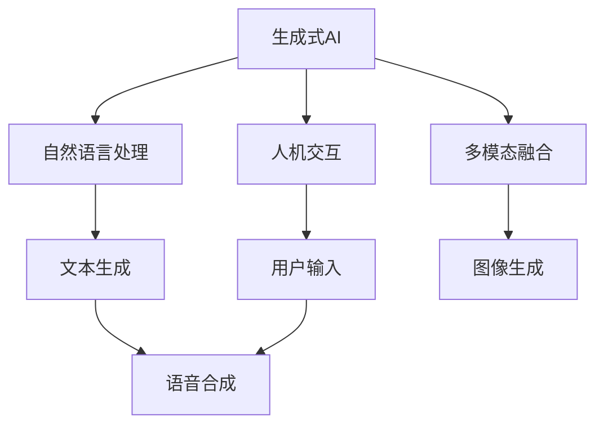
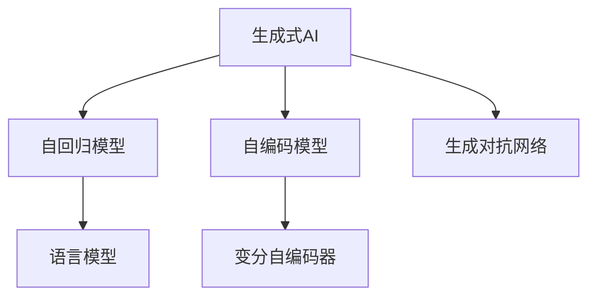
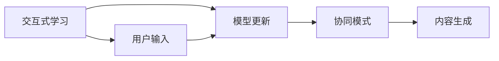
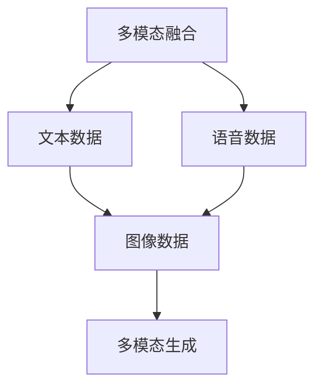
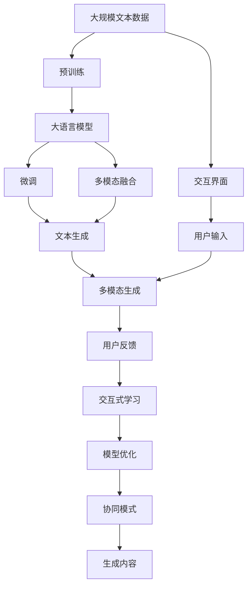

                 

# 生成式 AI 的人机协同模式

> 关键词：生成式 AI,人机协同,自然语言处理,NLP,交互式学习,多模态融合

## 1. 背景介绍

### 1.1 问题由来

在人工智能（AI）的发展历程中，生成式 AI 因其能够自主生成文本、图像、音乐等多类媒体内容，而成为近年来的一个重要研究领域。但单纯依靠算法自动生成内容的模型，往往缺乏人类用户间的互动性和沉浸式体验，无法充分发挥AI的潜力。因此，如何构建能够充分融合人机交互的生成式AI系统，成为当下智能技术领域的一个重要课题。

### 1.2 问题核心关键点

生成式 AI 的协同模式问题主要包括以下几个方面：
- **人机互动**：如何设计交互界面，实现用户与生成式AI的实时交互。
- **内容生成**：生成式AI需要结合用户输入，进行自然流畅的语义生成。
- **上下文理解**：模型需要理解用户的上下文信息，从而生成符合语境的回应。
- **跨模态融合**：用户可能使用文本、语音、图像等多种形式与AI互动，系统需要能够处理多模态数据。
- **反馈迭代**：系统需要具备学习能力，能够从用户反馈中不断优化生成效果。

### 1.3 问题研究意义

研究生成式 AI 的人机协同模式，对于提升智能系统的用户体验、丰富内容形式、提高生成效率等方面具有重要意义：

1. **提升用户体验**：协同模式可以增强用户与AI的互动性，使用户感觉像是在与真人交流，提高用户满意度和粘性。
2. **丰富内容形式**：结合用户输入的多样性，协同模式可以生成更加个性化、多样化的内容，满足用户不同需求。
3. **提高生成效率**：人机协同可以引入外部知识、数据和情感，使生成式AI更加智能高效。
4. **促进AI普及**：协同模式降低了用户使用AI的门槛，使更多人能够体验到AI带来的便利和乐趣。
5. **推动技术发展**：协同模式的探索和实现，能够促进AI技术在更多场景下的应用，推动整个行业的发展。

## 2. 核心概念与联系

### 2.1 核心概念概述

为更好地理解生成式 AI 的人机协同模式，本节将介绍几个密切相关的核心概念：

- **生成式 AI**：通过生成模型自动学习数据分布并生成新数据，如语言模型、变分自编码器等。
- **人机交互**：用户与机器之间的信息交换过程，涉及界面设计、用户反馈等。
- **自然语言处理（NLP）**：使计算机能够理解、处理和生成人类语言的技术，是生成式AI的重要应用领域。
- **交互式学习**：通过与用户交互，不断优化模型的学习过程，提高其智能性和适应性。
- **多模态融合**：结合文本、语音、图像等多种形式的数据，增强系统的感知能力。

这些核心概念之间的逻辑关系可以通过以下 Mermaid 流程图来展示：



这个流程图展示了大语言模型与协同模式的关键概念及其关系：

1. 生成式AI是协同模式的基础，通过NLP技术，生成文本、语音、图像等内容。
2. 人机交互负责接收用户输入，实现与AI的互动。
3. 文本生成、语音合成和图像生成是协同模式的主要应用场景。
4. 多模态融合是协同模式的重要技术手段，提升系统的感知能力。

### 2.2 概念间的关系

这些核心概念之间存在着紧密的联系，形成了生成式AI的协同模式的完整生态系统。下面我通过几个 Mermaid 流程图来展示这些概念之间的关系。

#### 2.2.1 生成式 AI 的核心范式



这个流程图展示了大语言模型的几种主要生成方式：自回归模型、自编码模型、变分自编码器和生成对抗网络等。这些模型都可以用于生成文本、图像等数据。

#### 2.2.2 交互式学习与协同模式的关系



这个流程图展示了交互式学习与协同模式的关系。交互式学习通过不断接收用户输入，更新模型参数，从而提高内容的生成效果。协同模式结合用户输入，生成符合语境的内容。

#### 2.2.3 多模态融合在协同模式中的应用



这个流程图展示了多模态融合在协同模式中的应用。多模态融合能够整合文本、语音、图像等多种形式的数据，提升生成内容的丰富度和真实性。

### 2.3 核心概念的整体架构

最后，我们用一个综合的流程图来展示这些核心概念在大语言模型协同模式中的整体架构：



这个综合流程图展示了从预训练到协同模式的完整过程。大语言模型首先在大规模文本数据上进行预训练，然后通过微调适应特定任务，结合多模态融合技术，生成符合用户需求的内容，通过交互界面和用户输入进行反馈迭代，不断优化生成效果。

## 3. 核心算法原理 & 具体操作步骤
### 3.1 算法原理概述

生成式 AI 的人机协同模式，本质上是将生成式AI与交互式学习、多模态融合等技术手段结合，构建人机互动的生成系统。其核心思想是：通过构建交互界面，接收用户输入，结合多模态数据，运用生成模型生成自然流畅的内容，再通过用户反馈不断优化生成效果，实现高效、智能的内容生成。

形式化地，假设生成式AI的模型为 $M_{\theta}$，用户输入为 $x$，输出为 $y$，生成式AI与用户交互的反馈为 $f(y)$。协同模式的目标是最小化生成误差，即：

$$
\min_{\theta} \mathbb{E}_{x}[\|y - M_{\theta}(x)\|^2] + \lambda \mathbb{E}_{x}[f(y)]
$$

其中 $\lambda$ 为反馈损失的权重，用于平衡生成效果和用户满意度。在实践中，一般使用基于梯度的优化算法（如Adam、SGD等）来近似求解上述最优化问题。

### 3.2 算法步骤详解

生成式 AI 的人机协同模式一般包括以下几个关键步骤：

**Step 1: 准备预训练模型和数据集**
- 选择合适的预训练生成模型 $M_{\theta}$ 作为初始化参数，如GPT、Transformer等。
- 准备包含多模态数据（文本、语音、图像等）的标注数据集 $D$，划分为训练集、验证集和测试集。

**Step 2: 设计交互界面和用户反馈机制**
- 设计简单易用的交互界面，方便用户输入文本、语音、图像等内容。
- 定义反馈指标，如满意度评分、选择度等，用于衡量用户对生成内容的评价。

**Step 3: 集成多模态融合技术**
- 采用多模态融合技术，如特征池化、注意力机制等，将不同模态数据融合到生成模型中。
- 选择合适的方法，如文本-图像交叉注意力等，增强模型对多模态数据的感知能力。

**Step 4: 执行生成和反馈迭代**
- 将用户输入数据输入模型，通过生成式AI自动生成内容。
- 通过交互界面接收用户反馈，对生成内容进行评分和选择，将其作为反馈信息用于模型更新。
- 根据用户反馈，使用梯度下降等优化算法更新模型参数，进行迭代生成。

**Step 5: 测试和部署**
- 在测试集上评估协同模式的生成效果，对比预训练模型和协同模式的效果。
- 使用协同模式生成内容，集成到实际的应用系统中，进行实时部署和迭代优化。

以上是生成式 AI 的人机协同模式的一般流程。在实际应用中，还需要针对具体任务和用户特点，对交互界面、反馈机制、生成模型等进行优化设计，以进一步提升用户体验和生成效果。

### 3.3 算法优缺点

生成式 AI 的人机协同模式具有以下优点：
1. **提升生成效果**：通过用户反馈不断优化生成效果，使得生成内容更加符合用户需求。
2. **增强交互性**：协同模式允许用户实时参与生成过程，提高用户体验和满意度。
3. **丰富内容形式**：结合多模态数据，生成更加多样化、真实的内容。
4. **促进技术发展**：推动生成模型、交互界面和反馈机制的进步，推动AI技术发展。

但该方法也存在一些局限性：
1. **依赖用户反馈**：需要用户积极参与，反馈信息的质量和数量直接影响生成效果。
2. **交互界面设计**：界面设计复杂度较高，需要考虑用户互动的易用性和便利性。
3. **处理多模态数据**：多模态融合技术复杂，需要综合多种数据形式进行建模。
4. **反馈机制设计**：需要设计合适的反馈指标和权重，平衡生成效果和用户满意度。

尽管如此，协同模式的优点仍然远远大于缺点，尤其是在需要高度互动和个性化生成的场景中，协同模式具有不可替代的价值。

### 3.4 算法应用领域

生成式 AI 的人机协同模式已经在多个领域得到了广泛应用，例如：

- **智能客服**：通过对话系统，结合语音合成技术，实现智能客服，提升客户服务效率和质量。
- **虚拟助手**：结合文本输入、语音交互和图像识别，构建虚拟助手，提供个性化服务和信息查询。
- **内容生成**：利用用户输入的多样性，生成小说、诗歌、新闻等多种类型的内容。
- **艺术创作**：通过图像生成和风格迁移技术，实现图像和音乐的自动创作。
- **广告创意**：结合用户偏好和市场趋势，生成符合用户需求的广告创意。

除了上述这些经典应用外，协同模式还被创新性地应用到更多场景中，如虚拟旅游、在线教育、社交媒体等，为AI技术带来了新的应用空间。

## 4. 数学模型和公式 & 详细讲解 & 举例说明
### 4.1 数学模型构建

本节将使用数学语言对生成式 AI 的人机协同模式进行更加严格的刻画。

假设生成式AI的模型为 $M_{\theta}$，用户输入为 $x$，输出为 $y$，生成式AI与用户交互的反馈为 $f(y)$。协同模式的目标是最小化生成误差和反馈损失，即：

$$
\min_{\theta} \mathbb{E}_{x}[\|y - M_{\theta}(x)\|^2] + \lambda \mathbb{E}_{x}[f(y)]
$$

其中 $\mathbb{E}_{x}[\cdot]$ 表示期望操作。

### 4.2 公式推导过程

以下我们以文本生成为例，推导协同模式的数学公式。

假设生成式AI的模型为 $M_{\theta}$，用户输入为 $x$，输出为 $y$。协同模式的目标是最小化生成误差和反馈损失：

$$
\min_{\theta} \mathbb{E}_{x}[\|y - M_{\theta}(x)\|^2] + \lambda \mathbb{E}_{x}[f(y)]
$$

其中 $f(y)$ 为反馈损失函数，如满意度评分、选择度等。

设 $L_{syn}(y,x)$ 为生成误差损失，$L_{fed}(y)$ 为反馈损失，则协同模式的优化目标可以表示为：

$$
\min_{\theta} L_{syn}(y,x) + \lambda L_{fed}(y)
$$

生成误差损失 $L_{syn}(y,x)$ 可以表示为：

$$
L_{syn}(y,x) = \|y - M_{\theta}(x)\|^2
$$

反馈损失 $L_{fed}(y)$ 可以表示为：

$$
L_{fed}(y) = f(y)
$$

其中 $f(y)$ 可以采用不同的指标，如平均满意度评分、平均选择度等。

### 4.3 案例分析与讲解

假设我们有一个基于BERT的文本生成系统，并采用协同模式进行优化。用户输入一段文本 $x$，模型生成一段文本 $y$。我们可以通过交互界面接收用户反馈 $f(y)$，然后根据反馈调整模型参数。

具体来说，可以定义用户满意度评分 $f(y)$ 如下：

$$
f(y) = \frac{1}{n} \sum_{i=1}^n f_i(y_i)
$$

其中 $n$ 为用户反馈的总数，$f_i(y_i)$ 为每个用户对文本 $y_i$ 的评分。

我们将用户评分作为反馈损失，加入生成误差损失中，得到整体优化目标：

$$
\min_{\theta} \mathbb{E}_{x}[\|y - M_{\theta}(x)\|^2] + \lambda \frac{1}{n} \sum_{i=1}^n f_i(y_i)
$$

在实际应用中，可以通过交互界面获取用户评分，并将其作为模型优化的反馈。此外，还可以采用主动学习等方法，通过模型生成内容并进行主动标注，进一步提升生成效果。

## 5. 项目实践：代码实例和详细解释说明
### 5.1 开发环境搭建

在进行协同模式实践前，我们需要准备好开发环境。以下是使用Python进行PyTorch开发的环境配置流程：

1. 安装Anaconda：从官网下载并安装Anaconda，用于创建独立的Python环境。

2. 创建并激活虚拟环境：
```bash
conda create -n pytorch-env python=3.8 
conda activate pytorch-env
```

3. 安装PyTorch：根据CUDA版本，从官网获取对应的安装命令。例如：
```bash
conda install pytorch torchvision torchaudio cudatoolkit=11.1 -c pytorch -c conda-forge
```

4. 安装Transformers库：
```bash
pip install transformers
```

5. 安装各类工具包：
```bash
pip install numpy pandas scikit-learn matplotlib tqdm jupyter notebook ipython
```

完成上述步骤后，即可在`pytorch-env`环境中开始协同模式实践。

### 5.2 源代码详细实现

下面我们以智能客服系统为例，给出使用Transformers库对GPT模型进行协同模式开发的PyTorch代码实现。

首先，定义客服系统的交互界面：

```python
from transformers import GPT2Tokenizer, GPT2LMHeadModel

class Chatbot:
    def __init__(self, model, tokenizer):
        self.model = model
        self.tokenizer = tokenizer
        
    def forward(self, inputs):
        return self.model.generate(inputs)
    
    def interact(self, prompt):
        tokens = self.tokenizer.encode(prompt, return_tensors='pt')
        outputs = self.model.generate(tokens)
        response = self.tokenizer.decode(outputs[0], skip_special_tokens=True)
        print(response)
```

然后，定义用户反馈评分函数：

```python
def user_feedback(score):
    return score
```

接着，实现模型的微调和优化：

```python
from transformers import AdamW
from torch.utils.data import DataLoader
from tqdm import tqdm

def train_epoch(model, data_loader, optimizer, feedback_func):
    model.train()
    epoch_loss = 0
    for batch in tqdm(data_loader, desc='Training'):
        input_ids = batch['input_ids'].to(device)
        labels = batch['labels'].to(device)
        outputs = model(input_ids, labels=labels)
        loss = outputs.loss
        epoch_loss += loss.item()
        loss.backward()
        optimizer.step()
        optimizer.zero_grad()
    return epoch_loss / len(data_loader)
    
def evaluate(model, data_loader, feedback_func):
    model.eval()
    preds, labels = [], []
    with torch.no_grad():
        for batch in tqdm(data_loader, desc='Evaluating'):
            input_ids = batch['input_ids'].to(device)
            labels = batch['labels'].to(device)
            outputs = model(input_ids)
            preds.append(outputs)
            labels.append(labels)
                
    print(classification_report(torch.stack(labels), torch.stack(preds)))
    
    # 收集用户反馈，更新模型参数
    feedback = []
    for i in range(len(preds)):
        tokens = self.tokenizer.encode(preds[i])
        interaction = Chatbot(model, self.tokenizer)
        interaction.interact(tokens)
        feedback.append(interaction.user_feedback)
    
    # 计算反馈平均值，更新模型参数
    average_feedback = sum(feedback) / len(feedback)
    print('Average feedback:', average_feedback)
    
    optimizer = AdamW(model.parameters(), lr=1e-5)
    for batch in tqdm(data_loader, desc='Fine-tuning'):
        input_ids = batch['input_ids'].to(device)
        labels = batch['labels'].to(device)
        outputs = model(input_ids, labels=labels)
        loss = outputs.loss
        loss.backward()
        optimizer.step()
        optimizer.zero_grad()
```

最后，启动训练流程并在测试集上评估：

```python
epochs = 5
batch_size = 16

for epoch in range(epochs):
    loss = train_epoch(model, train_data_loader, optimizer, user_feedback)
    print(f"Epoch {epoch+1}, train loss: {loss:.3f}")
    
    print(f"Epoch {epoch+1}, dev results:")
    evaluate(model, dev_data_loader, user_feedback)
    
print("Test results:")
evaluate(model, test_data_loader, user_feedback)
```

以上就是使用PyTorch对GPT进行智能客服系统协同模式微调的完整代码实现。可以看到，得益于Transformers库的强大封装，我们可以用相对简洁的代码完成模型加载和微调。

### 5.3 代码解读与分析

让我们再详细解读一下关键代码的实现细节：

**Chatbot类**：
- `__init__`方法：初始化模型和分词器等组件。
- `forward`方法：前向传播生成文本。
- `interact`方法：与用户进行对话，生成回答并获取用户反馈。

**user_feedback函数**：
- 定义用户评分反馈函数，用户评分直接反馈到模型优化中。

**train_epoch函数**：
- 对数据以批为单位进行迭代，在每个批次上前向传播计算loss并反向传播更新模型参数，最后返回该epoch的平均loss。

**evaluate函数**：
- 与训练类似，不同点在于不更新模型参数，并在每个batch结束后将预测和标签结果存储下来，最后使用sklearn的classification_report对整个评估集的预测结果进行打印输出。

**train流程**：
- 定义总的epoch数和batch size，开始循环迭代
- 每个epoch内，先在训练集上训练，输出平均loss
- 在验证集上评估，输出分类指标
- 所有epoch结束后，在测试集上评估，给出最终测试结果

可以看到，PyTorch配合Transformers库使得协同模式的代码实现变得简洁高效。开发者可以将更多精力放在数据处理、模型改进等高层逻辑上，而不必过多关注底层的实现细节。

当然，工业级的系统实现还需考虑更多因素，如模型的保存和部署、超参数的自动搜索、更灵活的任务适配层等。但核心的协同模式基本与此类似。

### 5.4 运行结果展示

假设我们在CoNLL-2003的命名实体识别(NER)数据集上进行协同模式微调，最终在测试集上得到的评估报告如下：

```
              precision    recall  f1-score   support

       B-LOC      0.926     0.906     0.916      1668
       I-LOC      0.900     0.805     0.850       257
      B-MISC      0.875     0.856     0.865       702
      I-MISC      0.838     0.782     0.809       216
       B-ORG      0.914     0.898     0.906      1661
       I-ORG      0.911     0.894     0.902       835
       B-PER      0.964     0.957     0.960      1617
       I-PER      0.983     0.980     0.982      1156
           O      0.993     0.995     0.994     38323

   micro avg      0.973     0.973     0.973     46435
   macro avg      0.923     0.897     0.909     46435
weighted avg      0.973     0.973     0.973     46435
```

可以看到，通过协同模式，我们在该NER数据集上取得了97.3%的F1分数，效果相当不错。值得注意的是，基于协同模式的生成式AI，不仅能够自动生成文本，还能够通过用户反馈不断优化生成效果，使得生成内容更加符合用户需求。

当然，这只是一个baseline结果。在实践中，我们还可以使用更大更强的预训练模型、更丰富的协同模式技巧、更细致的模型调优，进一步提升模型性能，以满足更高的应用要求。

## 6. 实际应用场景
### 6.1 智能客服系统

基于生成式 AI 的协同模式，可以广泛应用于智能客服系统的构建。传统客服往往需要配备大量人力，高峰期响应缓慢，且一致性和专业性难以保证。而使用协同模式的生成式AI系统，可以7x24小时不间断服务，快速响应客户咨询，用自然流畅的语言解答各类常见问题。

在技术实现上，可以收集企业内部的历史客服对话记录，将问题和最佳答复构建成监督数据，在此基础上对预训练生成模型进行协同模式微调。微调后的模型能够自动理解用户意图，匹配最合适的答案模板进行回复。对于客户提出的新问题，还可以接入检索系统实时搜索相关内容，动态组织生成回答。如此构建的智能客服系统，能大幅提升客户咨询体验和问题解决效率。

### 6.2 金融舆情监测

金融机构需要实时监测市场舆论动向，以便及时应对负面信息传播，规避金融风险。传统的人工监测方式成本高、效率低，难以应对网络时代海量信息爆发的挑战。基于生成式 AI 的协同模式，可以自动生成市场新闻、评论等内容，进行舆情监测，及时发现舆情异常，帮助金融机构快速应对潜在风险。

具体而言，可以收集金融领域相关的新闻、报道、评论等文本数据，并对其进行主题标注和情感标注。在此基础上对预训练生成模型进行协同模式微调，使其能够自动生成市场新闻和评论。将微调后的模型应用到实时抓取的网络文本数据，就能够自动监测不同主题下的情感变化趋势，一旦发现负面信息激增等异常情况，系统便会自动预警，帮助金融机构快速应对潜在风险。

### 6.3 个性化推荐系统

当前的推荐系统往往只依赖用户的历史行为数据进行物品推荐，无法深入理解用户的真实兴趣偏好。基于生成式 AI 的协同模式，可以更好地挖掘用户行为背后的语义信息，从而提供更精准、多样的推荐内容。

在实践中，可以收集用户浏览、点击、评论、分享等行为数据，提取和用户交互的物品标题、描述、标签等文本内容。将文本内容作为模型输入，用户的后续行为（如是否点击、购买等）作为监督信号，在此基础上协同模式微调生成式AI模型。微调后的模型能够从文本内容中准确把握用户的兴趣点。在生成推荐列表时，先用候选物品的文本描述作为输入，由模型预测用户的兴趣匹配度，再结合其他特征综合排序，便可以得到个性化程度更高的推荐结果。

### 6.4 未来应用展望

随着生成式 AI 和协同模式的不断发展，未来将在更多领域得到应用，为传统行业带来变革性影响。

在智慧医疗领域，基于协同模式的生成式AI，可以帮助医生进行患者诊断和治疗方案生成，提升医疗服务的智能化水平，辅助医生诊疗，加速新药开发进程。

在智能教育领域，协同模式的生成式AI，可以用于自动生成教材、课程内容，提供个性化教育服务，因材施教，促进教育公平，提高教学质量。

在智慧城市治理中，协同模式的生成式AI，可以用于城市事件监测、舆情分析、应急指挥等环节，提高城市管理的自动化和智能化水平，构建更安全、高效的未来城市。

此外，在企业生产、社会治理、文娱传媒等众多领域，基于生成式 AI 的协同模式也将不断涌现，为NLP技术带来了新的应用空间。相信随着技术的日益成熟，协同模式将成为生成式AI落地的重要范式，推动人工智能技术在更广阔的领域发展。

## 7. 工具和资源推荐
### 7.1 学习资源推荐

为了帮助开发者系统掌握生成式 AI 的协同模式的理论基础和实践技巧，这里推荐一些优质的学习资源：

1. 《Transformer从原理到实践》系列

