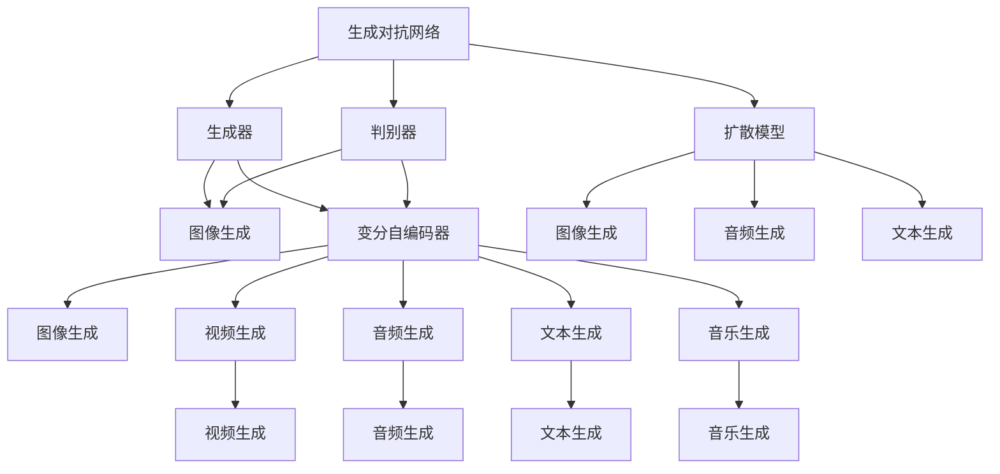
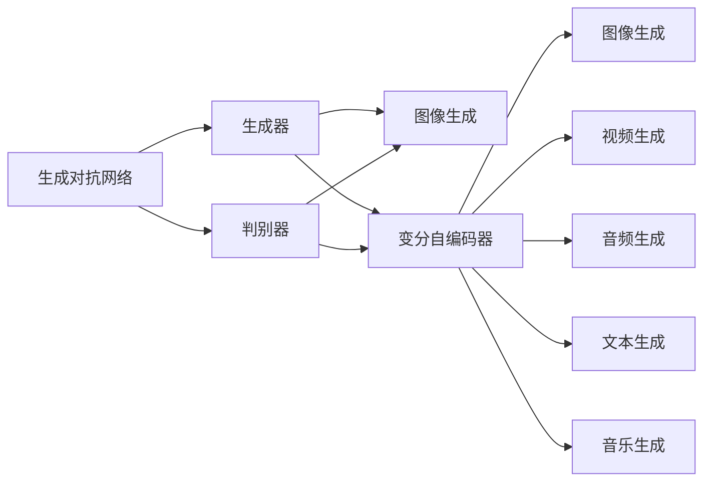
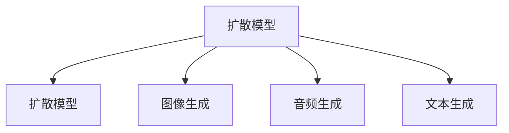
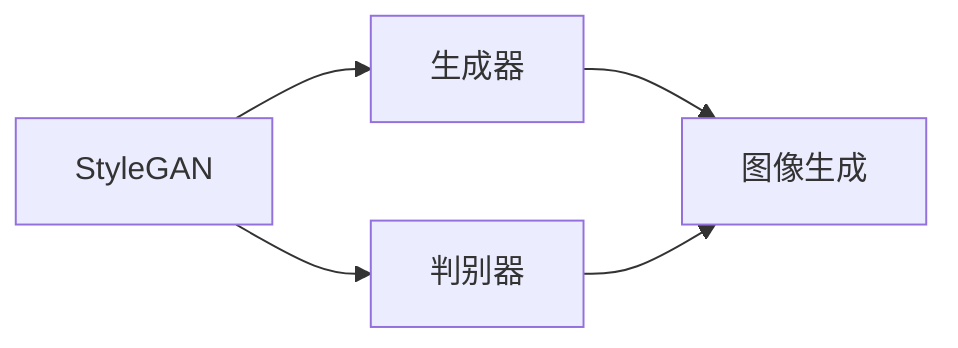
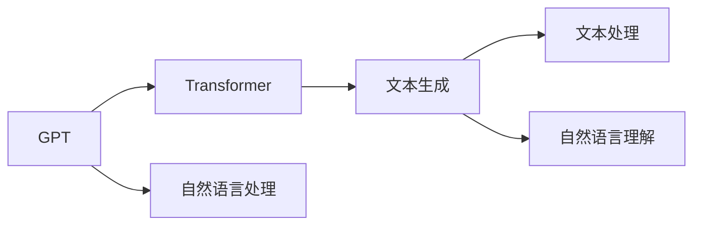
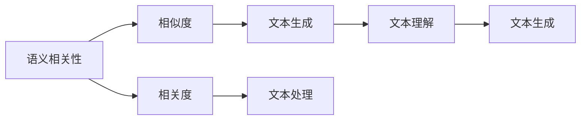
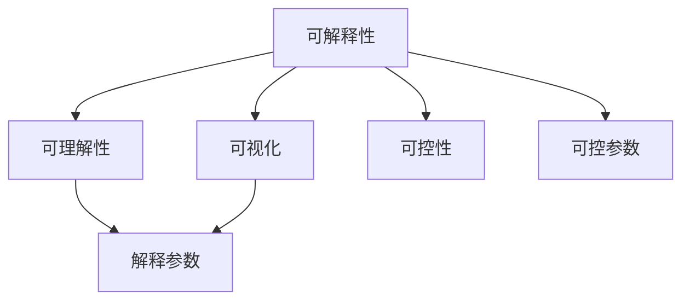
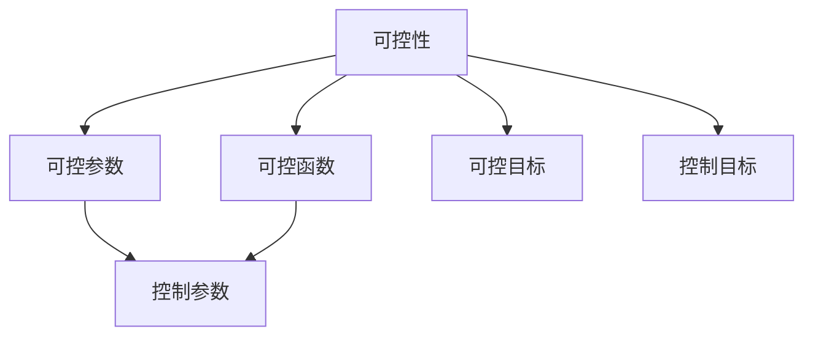
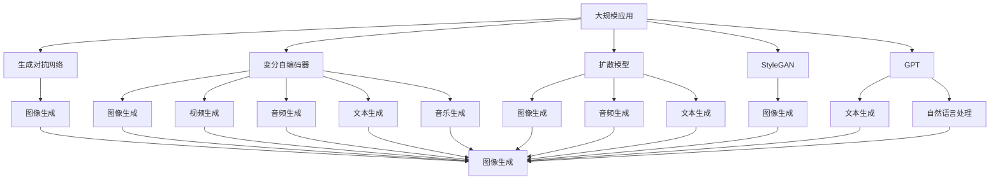

                 

# 生成式AIGC：从概念验证到大规模应用

> 关键词：生成对抗网络(GAN)、变分自编码器(VAE)、扩散模型、StyleGAN、GPT、LIP、CVP、CrowdGAN、Prototypical Networks、HIFIGAN、ModelScope、PyTorch、TensorFlow

## 1. 背景介绍

### 1.1 问题由来

生成对抗网络（GAN）和变分自编码器（VAE）作为深度学习领域的两大里程碑，引领了生成模型研究的范式转变，掀起了深度生成模型研究的热潮。自2014年卷积生成对抗网络（Convolutional Generative Adversarial Network, CGAN）、生成式对抗网络（Generative Adversarial Network, GAN）、变分自编码器（Variational Autoencoder, VAE）等算法被提出以来，生成式模型已经广泛应用于图像生成、视频生成、音频生成、自然语言处理、音乐生成、游戏设计等领域。

然而，生成式模型最初的设计目标并非直接应用于生成任务，而是为了构建生成模型与判别模型的对抗，最终训练出性能稳定的生成模型。因此，早期生成的图片、音频、视频等往往存在着质量不高、细节缺乏、风格单一等问题。随着模型的不断发展和优化，这些模型逐渐应用到各种生成任务中，取得了巨大的进展。

生成式模型经过几代演进，已经从基础的GAN、VAE等走向了更为复杂的扩散模型、StyleGAN、GPT等。这些新模型不仅在生成效率和质量上有所突破，还在可解释性、可控性等方面有所提升，为生成式人工智能（AIGC）的大规模应用奠定了坚实基础。

### 1.2 问题核心关键点

生成式AIGC的核心在于构建一个能够生成高质量、多维度的数据集的模型。这一过程可以简明地描述为以下几个步骤：

- 准备标注数据集
- 设计生成模型架构
- 训练生成模型
- 应用生成模型

在实际应用中，生成式AIGC的方法还包括超参数优化、损失函数设计、数据增强、模型融合等方法。这些方法可以进一步提升生成模型的性能，使其更好地应用于各种实际场景。

### 1.3 问题研究意义

研究生成式AIGC具有重要的理论和实际意义：

- 提高数据生成效率。生成式AIGC可以大规模生成高质量的数据集，弥补了传统数据获取成本高、耗时长的问题，为数据驱动型的AI应用提供了强有力的支持。
- 扩展数据生成维度。生成式AIGC可以生成多维度、多模态的数据，满足了不同领域的需求，推动了AI技术在各行业的广泛应用。
- 促进数据隐私保护。生成式AIGC可以生成仿真数据，减少了真实数据的使用需求，保护了用户隐私和数据安全。
- 推动AI创新。生成式AIGC技术的发展，催生了新的应用场景和商业模式，促进了AI技术在各行各业的深度应用和创新。

## 2. 核心概念与联系

### 2.1 核心概念概述

为了更好地理解生成式AIGC技术，本节将介绍几个密切相关的核心概念：

- 生成对抗网络（GAN）：由生成器和判别器两个神经网络组成，通过对抗训练过程生成高质量的数据集。
- 变分自编码器（VAE）：通过最大似然估计和变分推理来生成数据集，具有概率分布表示的优点。
- 扩散模型（Diffusion Model）：一种基于自回归模型生成数据的算法，如扩散模型（Diffusion Model）、扩散生成对抗网络（DDPM）等。
- StyleGAN：一种基于GAN的生成模型，通过修改生成器网络的权重，生成具有高度可控性和多样性的图像。
- GPT：一种基于Transformer的大语言模型，通过自回归机制生成自然语言文本。
- 语义相关性（Semantic Relatedness）：衡量两个文本之间的相关程度，常用于评估生成模型的质量。
- 可解释性（Explainability）：生成模型在生成过程中应该具备一定的可解释性，便于用户理解生成内容。
- 可控性（Controllability）：生成模型应该具备一定的可控性，使用户能够通过简单的控制参数生成特定内容。

这些核心概念之间的逻辑关系可以通过以下Mermaid流程图来展示：



这个流程图展示了生成式AIGC的核心概念及其之间的关系：

1. 生成对抗网络（GAN）：包括生成器和判别器，可以生成高质量的数据集。
2. 变分自编码器（VAE）：通过生成概率分布，生成高质量的数据集。
3. 扩散模型（Diffusion Model）：基于自回归模型生成数据，具有较好的稳定性。
4. StyleGAN：一种基于GAN的生成模型，通过修改生成器网络的权重，生成具有高度可控性和多样性的图像。
5. GPT：一种基于Transformer的大语言模型，通过自回归机制生成自然语言文本。
6. 语义相关性（Semantic Relatedness）：衡量文本之间的相关程度。
7. 可解释性（Explainability）：生成模型在生成过程中应该具备一定的可解释性。
8. 可控性（Controllability）：生成模型应该具备一定的可控性，使用户能够通过简单的控制参数生成特定内容。

### 2.2 概念间的关系

这些核心概念之间存在着紧密的联系，形成了生成式AIGC的完整生态系统。下面我通过几个Mermaid流程图来展示这些概念之间的关系。

#### 2.2.1 生成对抗网络与变分自编码器的关系



这个流程图展示了生成对抗网络和变分自编码器（VAE）的基本关系：

1. 生成对抗网络（GAN）包括生成器和判别器，可以生成高质量的数据集。
2. 变分自编码器（VAE）通过生成概率分布，生成高质量的数据集。
3. 变分自编码器（VAE）可以生成图像、视频、音频、文本和音乐等多种类型的数据。

#### 2.2.2 扩散模型的关系



这个流程图展示了扩散模型的基本关系：

1. 扩散模型是基于自回归模型生成数据的算法。
2. 扩散模型包括扩散模型（Diffusion Model）和扩散生成对抗网络（DDPM）等。
3. 扩散模型可以生成图像、音频和文本等多种类型的数据。

#### 2.2.3 StyleGAN的关系



这个流程图展示了StyleGAN的基本关系：

1. StyleGAN是一种基于GAN的生成模型。
2. StyleGAN通过修改生成器网络的权重，生成具有高度可控性和多样性的图像。
3. StyleGAN可以生成高清晰度的图像，具有较高的可控性和多样性。

#### 2.2.4 GPT的关系



这个流程图展示了GPT的基本关系：

1. GPT是一种基于Transformer的大语言模型。
2. GPT通过自回归机制生成自然语言文本。
3. GPT可以生成高质量的自然语言文本，用于文本处理和自然语言理解。

#### 2.2.5 语义相关性的关系



这个流程图展示了语义相关性的基本关系：

1. 语义相关性用于衡量两个文本之间的相关程度。
2. 语义相关性通过相似度来计算文本的相关程度。
3. 语义相关性可以用于评估生成模型的质量。

#### 2.2.6 可解释性的关系



这个流程图展示了可解释性的基本关系：

1. 可解释性指生成模型在生成过程中应该具备一定的可解释性。
2. 可解释性通过可视化参数和可控参数来实现。
3. 可解释性可以用于帮助用户理解生成内容的生成过程。

#### 2.2.7 可控性的关系



这个流程图展示了可控性的基本关系：

1. 可控性指生成模型应该具备一定的可控性。
2. 可控性通过可控参数和可控函数来实现。
3. 可控性可以用于帮助用户通过简单的控制参数生成特定内容。

### 2.3 核心概念的整体架构

最后，我们用一个综合的流程图来展示这些核心概念在大规模应用中的整体架构：



这个综合流程图展示了从生成对抗网络到扩散模型，再到StyleGAN、GPT等核心概念在大规模应用中的整体架构：

1. 生成对抗网络（GAN）：生成高质量的数据集。
2. 变分自编码器（VAE）：生成高质量的数据集。
3. 扩散模型：基于自回归模型生成数据，具有较好的稳定性。
4. StyleGAN：生成具有高度可控性和多样性的图像。
5. GPT：生成高质量的自然语言文本。
6. 语义相关性：评估生成模型的质量。
7. 可解释性：生成模型在生成过程中应该具备一定的可解释性。
8. 可控性：生成模型应该具备一定的可控性，使用户能够通过简单的控制参数生成特定内容。

这些概念共同构成了生成式AIGC的完整生态系统，为其在大规模应用中提供了强有力的支持。

## 3. 核心算法原理 & 具体操作步骤
### 3.1 算法原理概述

生成式AIGC的核心算法原理是通过构建生成模型和判别模型，通过对抗训练过程，不断优化生成模型的性能。

假设有生成模型 $G$ 和判别模型 $D$，其中 $G$ 是生成器，$D$ 是判别器。生成模型 $G$ 可以生成高质量的数据集，判别模型 $D$ 可以区分真实数据和生成数据。生成对抗网络（GAN）的基本过程如下：

1. 给定一个真实数据集 $X$。
2. 生成模型 $G$ 随机生成一个数据 $x$，判别模型 $D$ 判别数据是否为真实数据。
3. 将生成数据和真实数据混合，形成新的数据集。
4. 通过训练过程，不断优化生成器和判别器的性能，直到生成数据与真实数据无法区分。

生成对抗网络的目标是通过对抗训练，生成高质量、多样化的数据集。该过程通常需要进行多轮迭代，直到生成器的输出能够与真实数据无法区分。

### 3.2 算法步骤详解

生成对抗网络的训练过程可以分为以下几个步骤：

**Step 1: 准备标注数据集**
- 收集标注数据集 $D$，用于训练生成对抗网络。数据集应涵盖真实数据和生成的数据，以便生成器能够学习到真实数据的特征。

**Step 2: 设计生成模型和判别模型**
- 选择生成器和判别器的架构，如CNN、RNN、Transformer等。常用的生成器和判别器的架构包括CGAN、GAN、DDPM等。

**Step 3: 训练生成模型和判别模型**
- 通过对抗训练过程，不断优化生成器和判别器的性能。生成器不断生成高质量的数据，判别器不断区分真实数据和生成数据。
- 训练过程中，需要注意学习率的调节、正则化技术的应用、训练集的扩充等细节。

**Step 4: 评估生成模型的性能**
- 使用语义相关性、可解释性、可控性等指标评估生成模型的性能。常用的评估方法包括精度、召回率、F1分数、ROC曲线等。

**Step 5: 应用生成模型**
- 将训练好的生成模型应用于实际场景，如图像生成、视频生成、音频生成、文本生成等。
- 注意生成模型的使用方式，如输入控制参数、输出格式等。

以上是生成对抗网络的训练和应用流程。在实际应用中，还需要根据具体任务进行优化设计，如改进训练目标函数、引入更多正则化技术、搜索最优的超参数组合等，以进一步提升生成模型的性能。

### 3.3 算法优缺点

生成对抗网络的优点在于：
1. 生成高质量的数据集。生成对抗网络能够生成高质量、多样化的数据集，弥补了传统数据获取成本高、耗时长的问题。
2. 生成高清晰度的图像。生成对抗网络能够生成高清晰度的图像，满足各种应用需求。
3. 可控性强。生成对抗网络通过修改生成器网络的权重，生成具有高度可控性和多样性的图像。
4. 易于优化。生成对抗网络通过对抗训练过程，不断优化生成器和判别器的性能。

生成对抗网络的缺点在于：
1. 模型稳定性差。生成对抗网络在训练过程中，生成器和判别器之间的对抗关系可能会失衡，导致模型不稳定。
2. 训练难度大。生成对抗网络的训练过程复杂，需要大量的计算资源和时间。
3. 可解释性差。生成对抗网络的生成过程难以解释，不具备可解释性。
4. 数据分布失真。生成对抗网络生成的数据可能与真实数据分布存在偏差，影响模型的泛化能力。

尽管存在这些缺点，生成对抗网络仍然是生成式AIGC中的核心算法，广泛应用于图像生成、视频生成、音频生成、自然语言处理等领域。

### 3.4 算法应用领域

生成对抗网络已经广泛应用于以下领域：

- 图像生成：如GAN、StyleGAN、CGAN等，生成高质量的图像，如人脸、风景、汽车等。
- 视频生成：如VideoGAN、TVC-GAN等，生成高质量的视频，如动画、广告等。
- 音频生成：如WaveGAN、Wav2Vec2等，生成高质量的音频，如语音、音乐等。
- 自然语言处理：如GPT、T5等，生成高质量的自然语言文本，如对话、翻译、摘要等。
- 游戏设计：如GAN、CGAN等，生成高质量的游戏场景、角色、物品等。
- 人工智能辅助设计：如StyleGAN、CGAN等，生成高质量的设计图、草图等。

除了上述这些领域，生成对抗网络还被应用于医学图像生成、艺术创作、音乐生成、动画制作、虚拟现实等众多领域，为人工智能技术的应用提供了丰富的可能性。

## 4. 数学模型和公式 & 详细讲解 & 举例说明

### 4.1 数学模型构建

假设有生成模型 $G$ 和判别模型 $D$，其中 $G$ 是生成器，$D$ 是判别器。生成器 $G$ 可以生成高质量的数据集，判别器 $D$ 可以区分真实数据和生成数据。生成对抗网络（GAN）的基本过程如下：

1. 给定一个真实数据集 $X$。
2. 生成模型 $G$ 随机生成一个数据 $x$，判别模型 $D$ 判别数据是否为真实数据。
3. 将生成数据和真实数据混合，形成新的数据集。
4. 通过训练过程，不断优化生成器和判别器的性能，直到生成数据与真实数据无法区分。

数学上，生成对抗网络的目标是最大化生成器和判别器的性能。生成器的目标是最小化判别器错误识别的概率，即最大化判别器的损失函数：

$$
\max_{G} \min_{D} L(D,G) = \mathbb{E}_{x \sim X} [D(x)] + \mathbb{E}_{z \sim P(z)} [D(G(z))]
$$

其中 $L(D,G)$ 是判别器 $D$ 和生成器 $G$ 的联合损失函数，$x$ 是真实数据，$z$ 是生成器的输入噪声。

生成器的目标是最小化判别器错误识别的概率，即最大化生成器的损失函数：

$$
\min_{G} L(G) = -\mathbb{E}_{z \sim P(z)} [D(G(z))]
$$

生成对抗网络的目标是通过对抗训练过程，不断优化生成器和判别器的性能，使得生成器能够生成高质量的数据，判别器能够区分真实数据和生成数据。

### 4.2 公式推导过程

以下我们以图像生成任务为例，推导生成对抗网络的损失函数及其梯度计算公式。

假设生成模型为 $G(z)$，判别模型为 $D(x)$，其中 $z$ 为随机噪声，$x$ 为真实图像。

生成对抗网络的目标是最大化生成器和判别器的性能。生成器的目标是最小化判别器错误识别的概率，即最大化判别器的损失函数：

$$
\max_{G} \min_{D} L(D,G) = \mathbb{E}_{x \sim X} [D(x)] + \mathbb{E}_{z \sim P(z)} [D(G(z))]
$$

生成器的目标是最小化判别器错误识别的概率，即最大化生成器的损失函数：

$$
\min_{G} L(G) = -\mathbb{E}_{z \sim P(z)} [D(G(z))]
$$

对于判别器 $D$，其目标是最小化生成器和判别器的损失函数之和：

$$
\min_{D} L(D,G) = -\mathbb{E}_{x \sim X} [D(x)] + \mathbb{E}_{z \sim P(z)} [D(G(z))]
$$

将生成器 $G$ 和判别器 $D$ 的损失函数带入联合损失函数中，可以得到生成对抗网络的联合损失函数：

$$
L(D,G) = -\mathbb{E}_{x \sim X} [D(x)] + \mathbb{E}_{z \sim P(z)} [D(G(z))]
$$

对于生成器 $G$，其目标是最小化联合损失函数，即：

$$
\min_{G} L(G) = \mathbb{E}_{z \sim P(z)} [D(G(z))]
$$

对于判别器 $D$，其目标是最小化联合损失函数，即：

$$
\min_{D} L(D) = \mathbb{E}_{x \sim X} [D(x)] - \mathbb{E}_{z \sim P(z)} [D(G(z))]
$$

通过梯度下降等优化算法，生成器和判别器不断更新参数，最小化联合损失函数。重复上述过程直至收敛，最终得到适应生成任务的生成器和判别器。

### 4.3 案例分析与讲解

假设我们希望生成高清晰度的图像，以应用于图像识别、医学图像生成等领域。我们可以使用GAN和StyleGAN等生成对抗网络模型，对大规模的图像数据进行训练。以下是具体的步骤：

**Step 1: 准备标注数据集**
- 收集大规模的图像数据集，如ImageNet、CelebA等。

**Step 2: 设计生成模型和判别模型**
- 选择生成器和判别器的架构，如CNN、RNN、Transformer等。
- 对于图像生成任务，常用的生成器和判别器的架构包括CGAN、GAN、DDPM等。

**Step 3: 训练生成模型和判别模型**
- 使用对抗训练过程，不断优化生成器和判别器的性能。
- 训练过程中，需要注意学习率的调节、正则化技术的应用、训练集的扩充等细节。

**Step 4: 评估生成模型的性能**
- 使用语义相关性、可解释性、可控性等指标评估生成模型的性能。常用的评估方法包括精度、召回率、F1分数、ROC曲线等。

**Step 5: 应用生成模型**
- 将训练好的生成模型应用于实际场景，如图像生成、医学图像生成等。
- 注意生成模型的使用方式，如输入控制参数、输出格式等。

在实践中，GAN和StyleGAN等生成对抗网络模型在图像生成任务中取得了显著的效果，能够生成高质量、高清晰度的图像，满足了各种应用需求。

## 5. 项目实践：代码实例和详细解释说明

### 5.1 开发环境搭建

在进行生成对抗网络实践前，我们需要准备好开发环境。以下是使用Python进行PyTorch开发的环境配置流程：

1. 安装Anaconda：从官网下载并安装Anaconda，用于创建独立的Python环境。

2. 创建并激活虚拟环境：
```bash
conda create -n pytorch-env python=3.8 
conda activate pytorch-env
```

3. 安装PyTorch：根据CUDA版本，从官网获取对应的安装命令。例如：
```bash
conda install pytorch torchvision torchaudio cudatoolkit=11.1 -c pytorch -c conda-forge
```

4. 安装transformers库：
```bash
pip install transformers
```

5. 安装各类工具包：
```bash
pip install numpy pandas scikit-learn matplotlib tqdm jupyter notebook ipython
```

完成上述步骤后，即可在`pytorch-env`环境中开始生成对抗网络实践。

### 5.2 源代码详细实现

这里以GAN模型为例，使用PyTorch进行图像生成任务的代码实现。

首先，定义GAN的生成器和判别器的结构：

```python
import torch
import torch.nn as nn
import torch.nn.functional as F

class Generator(nn.Module):
    def __init__(self, input_size, output_size):
        super(Generator, self).__init__()
        self.fc1 = nn.Linear(input_size, 128)
        self.fc2 = nn.Linear(128, 128)
        self.fc3 = nn.Linear(128, output_size)

    def forward(self, x):
        x = F.relu(self.fc1(x))
        x = F.relu(self.fc2(x))
        x = self.fc3(x)
        return x

class Discriminator(nn.Module):
    def __init__(self, input_size, output_size):
        super(Discriminator, self).__init__()
        self.fc1 = nn.Linear(input_size, 128)
        self.fc2 = nn.Linear(128, 128)
        self.fc3 = nn.Linear(128, output_size)

    def forward(self, x):
        x = F.relu(self.fc1(x))
        x = F.relu(self.fc2(x))
        x = self.fc3(x)
        return x
```

接着，定义损失函数和优化器：

```python
from torch.optim import Adam

criterion = nn.BCELoss()
optimizer_G = Adam(model_G.parameters(), lr=0.0002)
optimizer_D = Adam(model_D.parameters(), lr=0.0002)
```

然后，定义训练和评估函数：

```python
import numpy as np

def train_GAN(model_G, model_D, optimizer_G, optimizer_D, criterion, num_epochs, batch_size, device):
    for epoch in range(num_epochs):
        for i, (real_images, _) in enumerate(data_loader):
            real_images = real_images.to(device)
            batch_size = real_images.shape[0]
            real_images = real_images.view(-1, 1, 28, 28)


