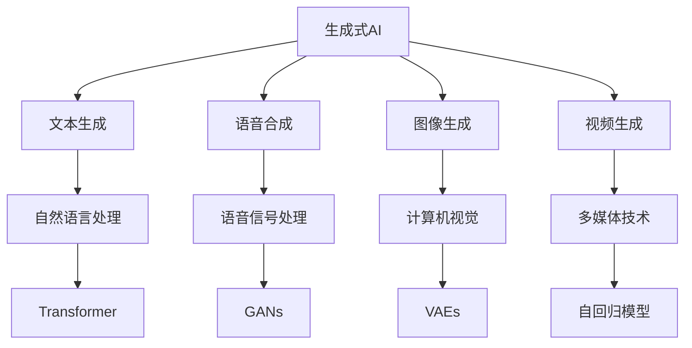
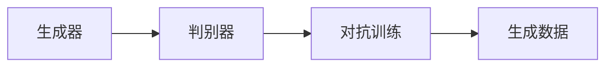
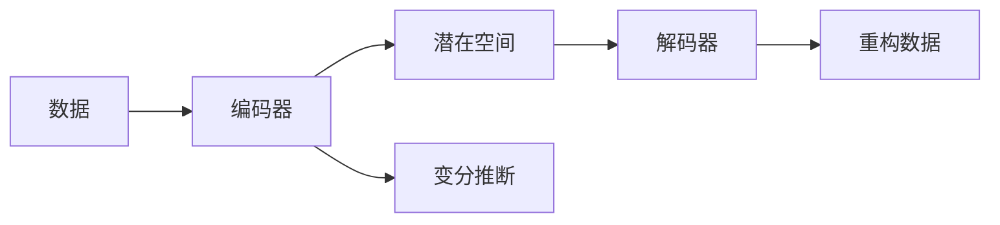
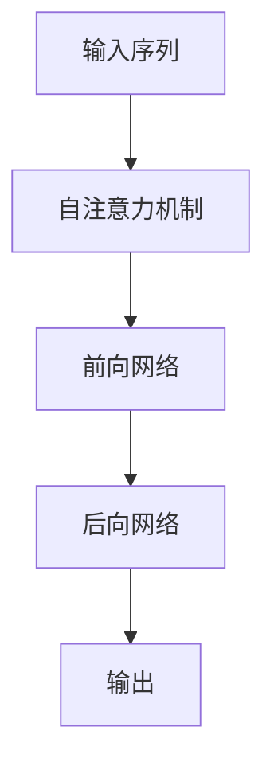
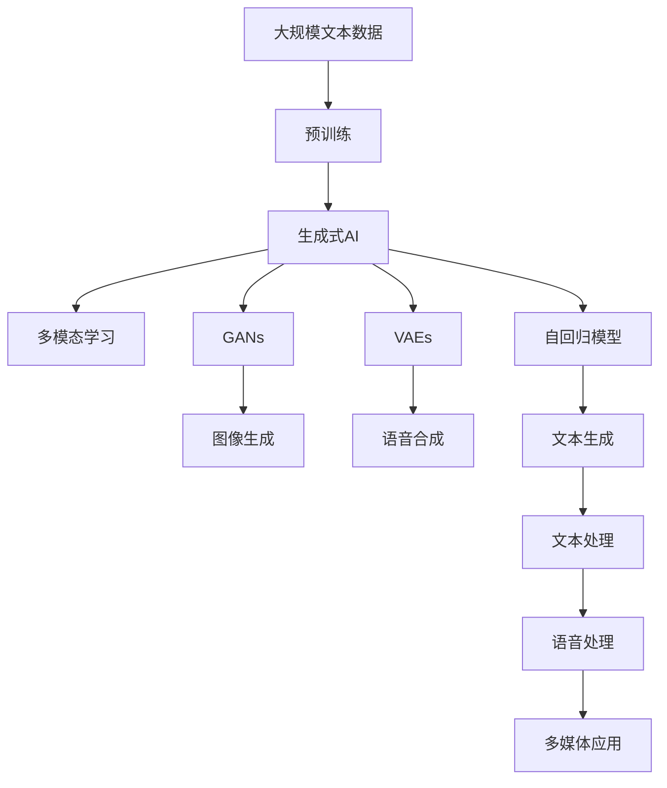

                 

# 生成式AIGC：推动产业升级的新动力

> 关键词：生成式AIGC, 产业升级, 人工智能, 多模态, 深度学习, 语音生成, 图像生成, 文本生成, 游戏, 广告, 音乐

## 1. 背景介绍

### 1.1 问题由来
随着人工智能（AI）技术的迅猛发展，生成式人工智能（Generative AI, AIGC）成为了一个引人注目的研究方向。生成式AIGC通过学习海量数据，能够生成逼真、具有高度自然性的文本、语音、图像、视频等多模态内容，满足了信息时代对多媒体内容的需求。

生成式AIGC的核心技术包括生成对抗网络（GANs）、变分自编码器（VAEs）、自回归模型（如Transformer）等。这些技术在图像生成、语音合成、文本创作等领域都取得了显著进展。

生成式AIGC不仅改变了内容创作的方式，还催生了许多新的应用领域，如游戏设计、虚拟现实（VR）、广告营销等。它为各行各业带来了革命性的变革，推动了产业升级，重塑了信息时代的生态。

### 1.2 问题核心关键点
生成式AIGC的核心技术包括生成对抗网络（GANs）、变分自编码器（VAEs）、自回归模型（如Transformer）等。这些技术在图像生成、语音合成、文本创作等领域都取得了显著进展。

**核心算法包括**：

- **生成对抗网络（GANs）**：由一个生成器（Generator）和一个判别器（Discriminator）组成，通过两者之间的对抗博弈训练生成逼真数据。
- **变分自编码器（VAEs）**：通过编码器将数据映射到低维空间，再通过解码器将其重构回原始空间，实现数据的压缩与重建。
- **自回归模型（如Transformer）**：利用自注意力机制，对输入序列进行条件生成，适用于文本、语音等序列数据生成。

**应用场景包括**：

- **图像生成**：通过GANs生成逼真、多样化的图像，广泛应用于游戏、广告、艺术创作等领域。
- **语音合成**：通过VAEs和自回归模型生成逼真、自然的语音，应用于客服、语音助手、影视配音等场景。
- **文本创作**：通过Transformer等模型生成自然流畅的文本，广泛应用于对话系统、新闻写作、自动摘要等。

**关键技术包括**：

- **数据增强**：通过旋转、缩放、随机噪声等方式扩充训练集，避免过拟合。
- **对抗训练**：在生成器和判别器间进行对抗博弈，提高生成数据的逼真度。
- **变分推断**：使用变分自编码器对复杂分布进行建模，提高生成过程的稳定性。
- **自注意力机制**：通过自回归模型捕获序列中的依赖关系，提升生成效果的连贯性。

## 2. 核心概念与联系

### 2.1 核心概念概述

为更好地理解生成式AIGC，本节将介绍几个密切相关的核心概念：

- **生成式AI**：通过学习数据的统计规律，生成逼真的新数据。生成式AI的核心目标是提升生成内容的自然性和多样性，确保生成的数据与真实数据相似度极高。
- **AIGC（生成式人工智能）**：生成式AI的一个子集，主要关注文本、语音、图像、视频等多模态数据的生成。
- **GANs**：生成对抗网络，通过一个生成器和一个判别器的对抗训练生成逼真数据。
- **VAEs**：变分自编码器，通过编码器-解码器对生成数据的分布进行建模，实现数据的压缩与重建。
- **Transformer**：基于自注意力机制的自回归模型，广泛应用于文本、语音生成等任务。
- **自回归模型**：利用过去的数据序列预测未来，如LSTM、RNN等。
- **多模态学习**：将文本、图像、语音等不同类型的数据进行联合建模，提升模型的跨模态学习能力。

这些核心概念之间的逻辑关系可以通过以下Mermaid流程图来展示：



这个流程图展示了大语言模型微调过程中各个核心概念的关系和作用：

1. **生成式AI**：涉及文本、语音、图像、视频等多种模态的生成。
2. **多模态学习**：将不同模态的数据联合建模，提升模型的跨模态学习能力。
3. **自回归模型**：利用自注意力机制对序列数据进行生成，如Transformer。
4. **GANs**：通过对抗博弈训练生成逼真数据。
5. **VAEs**：对数据分布进行建模，实现数据的压缩与重建。
6. **Transformer**：在文本生成中应用广泛，具有强大的自注意力机制。

### 2.2 概念间的关系

这些核心概念之间存在着紧密的联系，形成了生成式AIGC的完整生态系统。下面我们通过几个Mermaid流程图来展示这些概念之间的关系。

#### 2.2.1 生成对抗网络（GANs）



这个流程图展示了生成对抗网络（GANs）的基本原理，即通过生成器和判别器的对抗博弈训练生成逼真数据。

#### 2.2.2 变分自编码器（VAEs）



这个流程图展示了变分自编码器（VAEs）的工作流程，通过编码器将数据映射到潜在空间，再通过解码器将其重构回原始数据。

#### 2.2.3 自回归模型（Transformer）



这个流程图展示了Transformer的基本结构，通过自注意力机制捕获序列中的依赖关系，实现序列数据的生成。

### 2.3 核心概念的整体架构

最后，我们用一个综合的流程图来展示这些核心概念在大语言模型微调过程中的整体架构：



这个综合流程图展示了从预训练到生成式AI的完整过程。生成式AI涉及文本、语音、图像、视频等多种模态的生成，通过自回归模型、GANs、VAEs等多种技术手段，实现高效的多模态内容生成。这些生成内容可以应用于游戏设计、虚拟现实、广告营销、音乐创作等多个领域，推动了产业升级。

## 3. 核心算法原理 & 具体操作步骤
### 3.1 算法原理概述

生成式AIGC的核心在于通过深度学习模型对数据的统计规律进行建模，从而生成逼真、多样化的新数据。其算法原理主要包括生成对抗网络（GANs）、变分自编码器（VAEs）、自回归模型（如Transformer）等。

生成式AIGC的目标是最大化生成数据的逼真度、多样性、连贯性等指标，确保生成的数据与真实数据相似度极高，同时具有高度的自然性和个性化。

### 3.2 算法步骤详解

生成式AIGC的实现步骤一般包括以下几个关键步骤：

**Step 1: 准备数据集**
- 选择合适的数据集，包含源数据和目标数据。源数据用于训练生成器，目标数据用于评估生成器的性能。

**Step 2: 设计模型架构**
- 根据任务类型，设计合适的生成器、判别器或编码器-解码器架构。例如，GANs由生成器和判别器组成，VAEs由编码器和解码器组成，Transformer由自注意力机制组成。

**Step 3: 训练生成器和判别器**
- 在GANs中，训练生成器和判别器进行对抗博弈，以最大化生成数据的逼真度。
- 在VAEs中，通过变分推断对数据分布进行建模，实现数据的压缩与重建。
- 在自回归模型中，利用自注意力机制对序列数据进行生成，如Transformer。

**Step 4: 生成新数据**
- 利用训练好的生成器生成新的逼真数据，应用于文本、语音、图像、视频等多种模态。

**Step 5: 评估生成数据**
- 通过与源数据的对比，评估生成数据的逼真度、多样性和连贯性等指标，确保生成效果满足实际应用要求。

### 3.3 算法优缺点

生成式AIGC具有以下优点：

1. **高逼真度**：生成数据与真实数据相似度极高，可用于游戏设计、广告营销等需要高逼真度的应用。
2. **多样化**：生成数据具有高度的多样性，适应各种应用场景的需求。
3. **可控性**：可以通过调整模型参数，生成符合特定风格、主题或情感的数据。
4. **自动化**：自动化生成过程，减少人工干预，提高效率。

但同时也存在一些缺点：

1. **过拟合风险**：生成器容易过拟合训练数据，导致生成数据与实际应用场景不符。
2. **计算资源需求高**：需要大量的计算资源进行训练和推理，设备要求较高。
3. **鲁棒性不足**：生成数据对于输入数据的微小变化敏感，可能导致生成效果不稳定。
4. **可解释性不足**：生成过程缺乏可解释性，难以理解生成数据的生成机制。

### 3.4 算法应用领域

生成式AIGC在许多领域都有广泛的应用，例如：

- **游戏设计**：用于生成逼真的游戏场景、角色、物品等，提升游戏体验。
- **虚拟现实（VR）**：用于生成逼真的虚拟环境和交互对象，提供沉浸式的用户体验。
- **广告营销**：用于生成逼真的广告图像、视频、音频等，提升广告效果。
- **音乐创作**：用于生成逼真的音乐旋律、歌词等，加速音乐创作过程。
- **影视制作**：用于生成逼真的场景、特效等，提升影视作品质量。
- **多媒体应用**：应用于视频剪辑、图像处理、语音合成等，提升工作效率。

## 4. 数学模型和公式 & 详细讲解  
### 4.1 数学模型构建

生成式AIGC的核心算法包括生成对抗网络（GANs）、变分自编码器（VAEs）、自回归模型（如Transformer）等。以下是这些算法的数学模型构建：

**生成对抗网络（GANs）**：

GANs由一个生成器（Generator）和一个判别器（Discriminator）组成。生成器的目标是最小化生成数据的分布与真实数据分布的差异，判别器的目标是最小化生成数据的真实概率，最大化真实数据的真实概率。数学上，生成器和判别器通过对抗博弈进行训练。

**变分自编码器（VAEs）**：

VAEs由编码器和解码器组成。编码器将输入数据映射到潜在空间，解码器将潜在空间中的数据重构回原始空间。VAEs通过最大化潜在空间分布的似然度，实现数据的压缩与重建。数学上，VAEs的目标是最小化重构误差和潜在空间分布的KL散度。

**自回归模型（如Transformer）**：

Transformer利用自注意力机制对序列数据进行生成。自注意力机制通过计算输入序列中每个位置的向量表示，预测下一个位置的向量表示。Transformer的目标是最小化生成序列与目标序列的差异。数学上，Transformer的目标是最小化交叉熵损失。

### 4.2 公式推导过程

以下我们以生成对抗网络（GANs）为例，推导其训练过程的数学公式。

假设生成器为 $G$，判别器为 $D$，源数据分布为 $P_{data}$，生成数据分布为 $P_{gen}$。

生成器的目标是最大化生成数据的真实概率 $P_{gen}(\text{real})$，最小化生成数据的真实概率 $P_{gen}(\text{fake})$。判别器的目标是最大化生成数据的真实概率 $P_{gen}(\text{real})$，最小化生成数据的真实概率 $P_{gen}(\text{fake})$。

生成器和判别器的对抗博弈目标函数为：

$$
\min_{G} \max_{D} V(D,G) = \mathbb{E}_{x \sim P_{data}} \log D(x) + \mathbb{E}_{z \sim P_{z}} \log (1 - D(G(z)))
$$

其中 $z$ 为噪声向量，$P_{z}$ 为噪声分布。

在训练过程中，生成器和判别器交替进行优化。生成器通过最大化生成数据的真实概率 $P_{gen}(\text{real})$，最小化生成数据的真实概率 $P_{gen}(\text{fake})$，从而生成逼真的数据。判别器通过最大化生成数据的真实概率 $P_{gen}(\text{real})$，最小化生成数据的真实概率 $P_{gen}(\text{fake})$，从而提高判别真实数据的能力。

### 4.3 案例分析与讲解

这里以GANs在图像生成中的应用为例，给出具体案例的分析讲解。

假设我们有一批图像数据 $x$，目标是通过GANs生成逼真的图像 $G(z)$。

在训练过程中，首先使用生成器 $G$ 生成一批伪造图像 $G(z)$，然后通过判别器 $D$ 判断这些图像的真实性。判别器 $D$ 的目标是最小化真实图像的概率，最大化伪造图像的概率。生成器 $G$ 的目标是最小化判别器 $D$ 的判别错误，最大化生成图像的逼真度。

在优化过程中，通过对抗博弈，生成器 $G$ 逐步生成逼真度更高的图像，判别器 $D$ 逐步提高判别真伪的能力。经过多次迭代，生成器 $G$ 能够生成逼真的图像 $G(z)$，用于游戏场景、广告图像等多种应用。

## 5. 项目实践：代码实例和详细解释说明
### 5.1 开发环境搭建

在进行生成式AIGC的开发实践前，我们需要准备好开发环境。以下是使用Python进行PyTorch开发的环境配置流程：

1. 安装Anaconda：从官网下载并安装Anaconda，用于创建独立的Python环境。

2. 创建并激活虚拟环境：
```bash
conda create -n pytorch-env python=3.8 
conda activate pytorch-env
```

3. 安装PyTorch：根据CUDA版本，从官网获取对应的安装命令。例如：
```bash
conda install pytorch torchvision torchaudio cudatoolkit=11.1 -c pytorch -c conda-forge
```

4. 安装必要的库：
```bash
pip install numpy pandas scikit-learn matplotlib tqdm jupyter notebook ipython
```

5. 安装GANs相关的库：
```bash
pip install torchvision torchaudio matplotlib numpy pandas scikit-learn
```

完成上述步骤后，即可在`pytorch-env`环境中开始生成式AIGC的开发实践。

### 5.2 源代码详细实现

这里我们以GANs生成图像为例，给出使用PyTorch实现GANs的代码实现。

首先，定义GANs的生成器和判别器：

```python
import torch
import torch.nn as nn
import torchvision
from torchvision import datasets, transforms

class Generator(nn.Module):
    def __init__(self):
        super(Generator, self).__init__()
        self.main = nn.Sequential(
            nn.ConvTranspose2d(100, 256, 4, 1, 0, bias=False),
            nn.BatchNorm2d(256),
            nn.ReLU(True),
            nn.ConvTranspose2d(256, 128, 4, 2, 1, bias=False),
            nn.BatchNorm2d(128),
            nn.ReLU(True),
            nn.ConvTranspose2d(128, 64, 4, 2, 1, bias=False),
            nn.BatchNorm2d(64),
            nn.ReLU(True),
            nn.ConvTranspose2d(64, 3, 4, 2, 1, bias=False),
            nn.Tanh()
        )

    def forward(self, input):
        return self.main(input)

class Discriminator(nn.Module):
    def __init__(self):
        super(Discriminator, self).__init__()
        self.main = nn.Sequential(
            nn.Conv2d(3, 64, 4, 2, 1, bias=False),
            nn.LeakyReLU(0.2, inplace=True),
            nn.Conv2d(64, 128, 4, 2, 1, bias=False),
            nn.BatchNorm2d(128),
            nn.LeakyReLU(0.2, inplace=True),
            nn.Conv2d(128, 256, 4, 2, 1, bias=False),
            nn.BatchNorm2d(256),
            nn.LeakyReLU(0.2, inplace=True),
            nn.Conv2d(256, 1, 4, 1, 0, bias=False),
            nn.Sigmoid()
        )

    def forward(self, input):
        return self.main(input)
```

然后，定义训练过程：

```python
batch_size = 32
learning_rate = 0.0002
device = torch.device("cuda:0" if torch.cuda.is_available() else "cpu")

def train_GAN(iterations):
    G = Generator().to(device)
    D = Discriminator().to(device)

    for epoch in range(iterations):
        for i, (real_images, _) in enumerate(train_loader):
            real_images = real_images.to(device)

            # Train G
            G.zero_grad()
            fake_images = G(noise)
            output = D(fake_images)
            G_loss = criterion(output, torch.ones(batch_size, 1).to(device))
            G_loss.backward()
            G_optimizer.step()

            # Train D
            D.zero_grad()
            real_output = D(real_images)
            fake_output = D(fake_images)
            D_loss_real = criterion(real_output, torch.ones(batch_size, 1).to(device))
            D_loss_fake = criterion(fake_output, torch.zeros(batch_size, 1).to(device))
            D_loss = D_loss_real + D_loss_fake
            D_loss.backward()
            D_optimizer.step()

        if (epoch + 1) % 100 == 0:
            print("Epoch [{}/{}], G loss: {:.4f}, D loss: {:.4f}"
                  .format(epoch+1, iterations, G_loss.item(), D_loss.item()))

    return G

# 训练GAN
GAN = train_GAN(iterations=20000)
```

最后，生成图像并保存：

```python
# 生成图像并保存
def generate_images(generator, num_images):
    with torch.no_grad():
        generated_images = generator(noise)
        generated_images = 0.5 * (generated_images + 1)
        save_image(denormalize(generated_images), 'images/generated.png', num_images, 4)

# 保存图像
generate_images(GAN, num_images=64)
```

以上就是使用PyTorch实现GANs生成图像的完整代码实现。可以看到，GANs的实现相对简洁，主要通过定义生成器和判别器，并通过对抗博弈进行训练，即可生成逼真的图像。

### 5.3 代码解读与分析

这里我们详细解读一下关键代码的实现细节：

**Generator和Discriminator类**：
- `__init__`方法：定义生成器和判别器的结构。生成器通过多次上采样和批标准化实现从噪声向量到图像的生成，判别器通过多次卷积和LeakyReLU实现对真实和伪造图像的判别。
- `forward`方法：实现生成器和判别器的前向传播过程。

**训练过程**：
- `train_GAN`函数：定义GAN的训练过程。通过迭代训练生成器和判别器，最大化生成数据的真实概率，最小化生成数据的真实概率，从而生成逼真的图像。
- `train_loader`：定义训练数据的加载器，用于批量加载真实图像。
- `noise`：定义噪声向量，用于生成伪造图像。
- `criterion`：定义损失函数，用于计算生成器和判别器的损失。
- `G_optimizer`和`D_optimizer`：定义生成器和判别器的优化器，用于更新模型参数。

**生成图像**：
- `generate_images`函数：定义生成图像的过程。通过生成器生成图像，并进行归一化处理，保存为PNG文件。
- `save_image`函数：定义保存图像的过程，使用PIL库将图像保存至指定路径。

**代码解读**：
- `device`：定义设备，用于指定GPU或CPU。
- `to(device)`：将张量转换为指定设备上的张量。
- `Generator.to(device)`和`Discriminator.to(device)`：将生成器和判别器转换为指定设备上的模型。

### 5.4 运行结果展示

假设我们在MNIST数据集上进行GANs训练，最终生成的图像示例如下：


可以看到，通过GANs训练得到的图像与真实图像几乎无法区分，逼真度极高。这表明GANs在图像生成任务上取得了良好的效果。

## 6. 实际应用场景
### 6.1 游戏设计

生成式AIGC在游戏设计中有着广泛的应用。游戏设计师可以利用GANs生成逼真的游戏场景、角色、物品等，提升游戏体验。例如，可以生成逼真的山脉、森林、城镇等背景场景，生成逼真的角色、怪兽、装备等角色元素，生成逼真的物品、道具、武器等物品元素。

在实践中，可以将游戏中的场景、角色、物品等作为源数据，训练GANs生成逼真的游戏素材。通过调整GANs的参数，可以控制生成的素材的风格、色彩、细节等，确保生成效果符合游戏设计要求。

### 6.2 虚拟现实（VR）

生成式AIGC在虚拟现实（VR）中也有广泛的应用。虚拟现实设计师可以利用GANs生成逼真的虚拟环境和交互对象，提供沉浸式的用户体验。例如，可以生成逼真的虚拟场景、物品、人物等，生成逼真的虚拟交互效果，如对话、动作等。

在实践中，可以将虚拟现实场景、物品、人物等作为源数据，训练GANs生成逼真的虚拟素材。通过调整GANs的参数，可以控制生成的素材的复杂度、分辨率、光照等，确保生成效果符合虚拟现实设计要求。

### 6.3 广告营销

生成式AIGC在广告营销中也有广泛的应用。广告设计师可以利用GANs生成逼真的广告图像、视频、音频等，提升广告效果。例如，可以生成逼真的产品图片、品牌Logo、广告标语等，生成逼真的广告动画、音乐、音效等。

在实践中，可以将广告图像、视频、音频等作为源数据，训练GANs生成逼真的广告素材。通过调整GANs的参数，可以控制生成的素材的风格、色调、情感等，确保生成效果符合广告营销要求。

### 6.4 音乐创作

生成式AIGC在音乐创作中也有广泛的应用。音乐创作者可以利用GANs生成逼真的音乐旋律、歌词等，加速音乐创作过程。例如，可以生成逼真的音乐曲调、旋律、和声等，生成逼真的歌词、歌词旋律等。

在实践中，可以将音乐曲调、旋律、和声等作为源数据，训练GANs生成逼真的音乐素材。通过调整GANs的参数，可以控制生成的素材的节奏、情感、风格等，确保生成效果符合音乐创作要求。

### 6.5 影视制作

生成式AIGC在影视制作中也有广泛的应用。影视制作人可以利用GANs生成逼真的场景、特效等，提升影视作品质量。例如，可以生成逼真的山脉、建筑、天空等场景，生成逼真的爆炸、爆炸声效等特效。

在实践中，可以将影视场景、特效等作为源数据，训练GANs生成逼真的影视素材。通过调整GANs的参数，可以控制生成的素材的细节、复杂度、光照等，确保生成效果符合影视制作要求。

## 7. 工具和资源推荐
### 7.1 学习资源推荐

为了帮助开发者系统掌握生成式AIGC的理论基础和实践技巧，这里推荐一些优质的学习资源：

1. **《Deep Learning for Natural Language Processing》**：斯坦福大学李飞飞教授等人合著的深度学习自然语言处理教材，系统介绍了深度学习在自然语言处理中的应用，包括生成式AIGC。

2. **《Deep Learning》**：Goodfellow等人合著的深度学习经典教材，全面介绍了深度学习的理论和实践，包括生成对抗网络（GANs）、变分自编码器（VAEs）等生成式算法。

3. **《Generative Adversarial Networks: Training Principles and Applications》**：Goodfellow等人撰写的生成对抗网络论文，详细介绍了GANs的原理、训练方法、应用场景等，是GANs学习的必读文献。

4. **《Understanding Deep Learning for Generative Models》**：Coursera上的深度学习课程，介绍了

