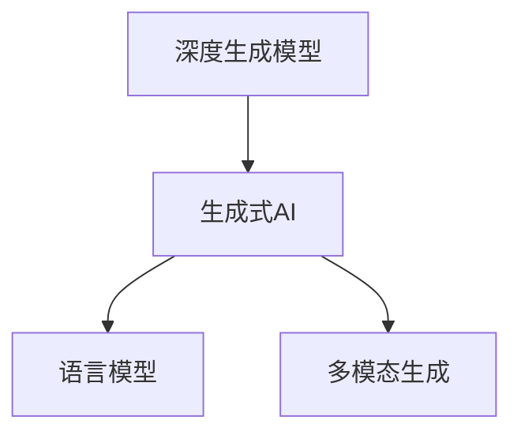
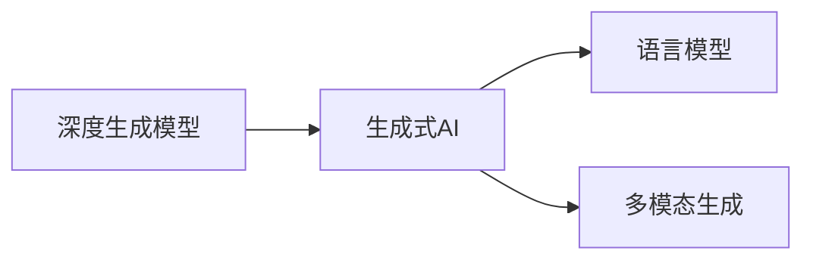
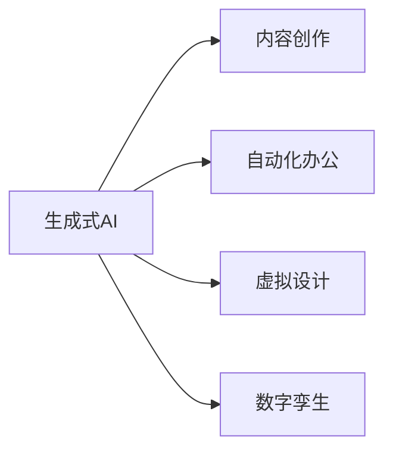
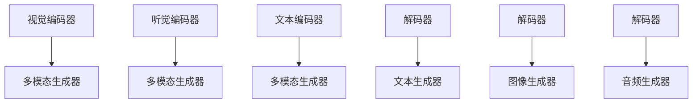

                 

# 生成式AIGC：改变商业模式的新引擎

## 1. 背景介绍

### 1.1 问题由来
生成式人工智能（Generative AI，AIGC）作为新一代AI技术的代表，正逐步渗透到各行各业，带来深刻的技术革新和商业模式变革。随着深度学习、强化学习、计算机视觉、自然语言处理等技术的持续进步，生成式AI模型已经可以在图像、语音、文本等多种模态下，实现前所未有的生成效果和交互能力。

在过去几十年里，传统的AI技术主要基于感知学习和监督学习，侧重于从已有数据中学习和理解世界，生成式AI则突破了这一局限，利用大量未标注数据，直接从数据中挖掘出潜在的生成规律，创造出新的、有意义的、甚至难以预见的内容。

### 1.2 问题核心关键点
AIGC的核心在于生成式模型能够根据已有数据，生成新的、与训练数据分布相似的数据。这种生成能力使得AIGC在内容创作、自动化办公、虚拟设计、数字孪生等领域展现出巨大潜力，有望彻底改变现有的商业模式和技术范式。

AIGC的生成能力主要依赖于以下几个关键技术：
1. **深度生成模型（如GANs、VQ-VAE、VQ-VAE2、Diffusion Models等）**：通过训练生成模型，学习从噪声分布到数据分布的映射，从而生成新的数据样本。
2. **语言模型（如GPT-3、GPT-4、T5等）**：能够理解自然语言，生成符合语法和语义规则的文本内容。
3. **多模态生成模型**：结合视觉、听觉等多种模态信息，生成跨模态的混合内容。

这些技术相互结合，可以生成出丰富多样的内容，如自然语言对话、视频剪辑、艺术作品、虚拟场景等，为各行各业提供强大的创新能力。

### 1.3 问题研究意义
AIGC的兴起，对人工智能技术的应用和发展具有重要意义：
1. **推动创新驱动发展**：AIGC能够生成新颖的内容，助力企业研发和创新，加速技术进步。
2. **降低内容创作成本**：利用AIGC生成大量高质量内容，大幅降低内容创作和编辑的人力成本。
3. **优化用户体验**：在教育、娱乐、旅游等领域，AIGC可以提供个性化的内容和服务，提升用户体验。
4. **开辟商业新模式**：基于AIGC生成内容，可以形成新的商业模式，如虚拟助手、数字商品、虚拟体验等。
5. **提升社会价值**：AIGC能够生成高质量的教育资源、医疗资讯、艺术作品，提升社会整体的知识储备和文化素养。

## 2. 核心概念与联系

### 2.1 核心概念概述

AIGC的核心概念包括：

- **生成式AI（Generative AI）**：利用生成模型从已知数据中学习生成新数据的技术。生成式AI可以应用于图像生成、文本生成、语音合成、音频编辑等多个领域。
- **深度生成模型（GANs、VQ-VAE、Diffusion Models）**：通过学习噪声分布和数据分布之间的映射关系，生成具有连续性和真实性的新数据。
- **语言模型（如BERT、GPT-3、T5等）**：基于大规模语料库进行自监督学习，能够生成符合语言规则的文本内容。
- **多模态生成**：结合视觉、听觉等多种模态信息，生成跨模态的混合内容。

这些概念通过一个简单的Mermaid流程图来展示：



这个流程图展示了生成式AI的不同技术路线，其中深度生成模型是核心，语言模型和多模态生成模型则是进一步的应用和拓展。

### 2.2 概念间的关系

这些核心概念之间存在着紧密的联系，形成了AIGC技术的完整生态系统。下面我们通过几个Mermaid流程图来展示这些概念之间的关系：

#### 2.2.1 生成式AI的基本框架



这个流程图展示了生成式AI的基本构成，包括深度生成模型、语言模型和多模态生成。这些模型通过协同工作，生成高质量、多样化的内容。

#### 2.2.2 生成式AI的商业应用



这个流程图展示了生成式AI在多个商业场景中的应用，包括内容创作、自动化办公、虚拟设计和数字孪生。这些应用展示了AIGC在各领域的广泛潜力。

#### 2.2.3 多模态生成模型的架构



这个流程图展示了多模态生成模型的架构，包括视觉、听觉和文本编码器，以及多模态生成器和解码器。这些模块共同作用，生成跨模态的混合内容。

## 3. 核心算法原理 & 具体操作步骤

### 3.1 算法原理概述

AIGC的核心算法原理主要基于生成模型，通过学习数据分布，生成新的、与原始数据分布相似的数据。常用的生成模型包括GANs、VQ-VAE、Diffusion Models等。

以GANs为例，其核心思想是通过两个神经网络：生成器（Generator）和判别器（Discriminator），训练模型学习将噪声分布映射到数据分布的过程。具体步骤如下：

1. **生成器**：将噪声作为输入，生成假数据。
2. **判别器**：区分真实数据和假数据。
3. **对抗训练**：通过迭代优化生成器和判别器，使得生成器生成的数据越来越难以被判别器区分。

最终，生成器生成的数据将越来越逼真，甚至可以用于实际应用中。

### 3.2 算法步骤详解

以GANs为例，其具体的训练步骤如下：

1. **准备数据**：收集训练数据，将其分为训练集和验证集。
2. **定义模型架构**：设计生成器和判别器的神经网络结构，通常使用卷积神经网络（CNN）或循环神经网络（RNN）。
3. **损失函数**：定义生成器和判别器的损失函数，通常使用交叉熵损失函数或Wasserstein距离。
4. **对抗训练**：在每个训练周期内，交替优化生成器和判别器，使得生成器生成的数据越来越逼真，判别器区分真实数据的准确率越来越高。
5. **评估和调整**：在验证集上评估模型性能，调整模型参数，直到模型达到预期效果。

GANs的训练过程可以通过以下伪代码来描述：

```python
for epoch in range(num_epochs):
    for i in range(num_batches):
        # 从噪声分布中采样噪声向量
        z = sample_from_noise()
        
        # 生成假数据
        generated_data = G(z)
        
        # 计算判别器损失
        real_data = real_data_sample()
        discriminator_loss = -log(d(D(real_data)) + log(1 - d(D(generated_data)))
        
        # 计算生成器损失
        generator_loss = -log(d(D(generated_data)))
        
        # 优化生成器和判别器
        D_optimizer.minimize(discriminator_loss)
        G_optimizer.minimize(generator_loss)
```

### 3.3 算法优缺点

生成式AI具有以下优点：
1. **生成高质量内容**：生成式AI可以生成高质量、多样化的内容，填补数据不足的空白。
2. **降低内容创作成本**：利用AIGC生成内容，大幅降低内容创作和编辑的人力成本。
3. **提升用户体验**：在教育、娱乐、旅游等领域，AIGC可以提供个性化的内容和服务，提升用户体验。

但生成式AI也存在以下缺点：
1. **生成内容质量不稳定**：生成内容的质量受生成模型训练的稳定性影响，训练不稳定会导致生成内容质量波动。
2. **数据依赖性强**：生成式AI需要大量的训练数据，且数据质量对生成效果有显著影响。
3. **生成内容真实性难以验证**：生成的内容难以从根本上与真实数据区分，存在被滥用的风险。

### 3.4 算法应用领域

生成式AI已经在多个领域得到了广泛应用，以下是几个典型应用场景：

- **图像生成**：利用GANs生成高分辨率的图像，用于艺术创作、电影特效、游戏设计等领域。
- **视频编辑**：使用多模态生成模型，生成连贯的视频片段，用于广告、动画、电影等。
- **文本生成**：利用语言模型生成自然语言文本，用于聊天机器人、新闻报道、文章创作等领域。
- **音乐生成**：利用音频生成模型，生成各种风格的音乐，用于音乐创作、娱乐等领域。
- **虚拟设计**：结合视觉和文本信息，生成虚拟场景和设计方案，用于建筑设计、游戏设计等领域。

## 4. 数学模型和公式 & 详细讲解

### 4.1 数学模型构建

生成式AI的数学模型主要基于生成模型，通过学习数据分布，生成新的数据样本。以GANs为例，其数学模型可以表示为：

$$ P_G(x) = \int P_Z(z) P_G(x|z) dz $$

其中，$P_G(x)$ 为生成模型生成的数据分布，$P_Z(z)$ 为噪声分布，$P_G(x|z)$ 为生成模型将噪声映射到数据的过程。

GANs的目标是最小化生成数据与真实数据之间的差异，可以通过最大化判别器的判别能力和最小化生成器的生成损失来实现。

### 4.2 公式推导过程

以GANs为例，其具体的数学推导过程如下：

1. **生成器损失函数**：生成器目标是最小化生成数据与真实数据之间的差异，可以通过最大化判别器的判别能力和最小化生成器的生成损失来实现。

$$ \min_G \mathbb{E}_{z \sim P_Z(z)} \log D(G(z)) $$

2. **判别器损失函数**：判别器的目标是最小化生成数据与真实数据之间的差异，最大化判别真实数据和假数据的能力。

$$ \min_D \mathbb{E}_{x \sim P_X(x)} \log D(x) + \mathbb{E}_{z \sim P_Z(z)} \log (1 - D(G(z))) $$

其中，$P_X(x)$ 为真实数据分布。

### 4.3 案例分析与讲解

以图像生成为例，假设我们希望生成高质量的手写数字图像，可以使用GANs模型。具体步骤如下：

1. **准备数据**：收集手写数字图像数据集，将其分为训练集和验证集。
2. **定义模型架构**：设计生成器和判别器的神经网络结构，通常使用卷积神经网络（CNN）。
3. **损失函数**：定义生成器和判别器的损失函数，通常使用交叉熵损失函数。
4. **对抗训练**：在每个训练周期内，交替优化生成器和判别器，使得生成器生成的数据越来越逼真，判别器区分真实数据的准确率越来越高。
5. **评估和调整**：在验证集上评估模型性能，调整模型参数，直到模型达到预期效果。

在实际应用中，还需要根据具体问题进行调整，如引入正则化、调整超参数等，以提升模型效果。

## 5. 项目实践：代码实例和详细解释说明

### 5.1 开发环境搭建

在进行AIGC实践前，我们需要准备好开发环境。以下是使用Python进行PyTorch开发的环境配置流程：

1. 安装Anaconda：从官网下载并安装Anaconda，用于创建独立的Python环境。

2. 创建并激活虚拟环境：
```bash
conda create -n pytorch-env python=3.8 
conda activate pytorch-env
```

3. 安装PyTorch：根据CUDA版本，从官网获取对应的安装命令。例如：
```bash
conda install pytorch torchvision torchaudio cudatoolkit=11.1 -c pytorch -c conda-forge
```

4. 安装Transformers库：
```bash
pip install transformers
```

5. 安装各类工具包：
```bash
pip install numpy pandas scikit-learn matplotlib tqdm jupyter notebook ipython
```

完成上述步骤后，即可在`pytorch-env`环境中开始AIGC实践。

### 5.2 源代码详细实现

下面我们以GANs生成手写数字图像为例，给出使用PyTorch实现图像生成的完整代码实现。

首先，定义GAN模型的代码：

```python
import torch.nn as nn
import torch.nn.functional as F
import torch.optim as optim

class Generator(nn.Module):
    def __init__(self, input_dim, output_dim):
        super(Generator, self).__init__()
        self.fc1 = nn.Linear(input_dim, 256)
        self.fc2 = nn.Linear(256, 1024)
        self.fc3 = nn.Linear(1024, output_dim)

    def forward(self, z):
        x = F.relu(self.fc1(z))
        x = F.relu(self.fc2(x))
        return self.fc3(x)

class Discriminator(nn.Module):
    def __init__(self, input_dim, output_dim):
        super(Discriminator, self).__init__()
        self.fc1 = nn.Linear(input_dim, 1024)
        self.fc2 = nn.Linear(1024, 512)
        self.fc3 = nn.Linear(512, output_dim)

    def forward(self, x):
        x = F.relu(self.fc1(x))
        x = F.relu(self.fc2(x))
        return self.fc3(x)

# 定义模型参数
input_dim = 100
output_dim = 784
z_dim = 100
G = Generator(input_dim, output_dim)
D = Discriminator(output_dim, 1)

# 定义优化器
G_optimizer = optim.Adam(G.parameters(), lr=0.0002)
D_optimizer = optim.Adam(D.parameters(), lr=0.0002)

# 定义损失函数
criterion = nn.BCELoss()

# 定义训练过程
def train_model(G, D, G_optimizer, D_optimizer, criterion, num_epochs, batch_size):
    for epoch in range(num_epochs):
        for i in range(num_batches):
            # 生成数据
            z = torch.randn(batch_size, z_dim)
            generated_data = G(z)

            # 计算判别器损失
            real_data = real_data_sample(batch_size)
            fake_labels = torch.ones(batch_size, 1)
            real_labels = torch.zeros(batch_size, 1)
            real_loss = criterion(D(real_data), real_labels)
            fake_loss = criterion(D(generated_data), fake_labels)
            D_loss = real_loss + fake_loss

            # 优化判别器
            D_optimizer.zero_grad()
            D_loss.backward()
            D_optimizer.step()

            # 计算生成器损失
            fake_labels = torch.ones(batch_size, 1)
            real_loss = criterion(D(generated_data), fake_labels)
            G_loss = real_loss

            # 优化生成器
            G_optimizer.zero_grad()
            G_loss.backward()
            G_optimizer.step()

            # 输出日志
            if i % 100 == 0:
                print(f'Epoch {epoch+1}, Batch {i}, D_loss: {D_loss.item()}, G_loss: {G_loss.item()}')
```

在训练过程中，我们还需要定义一些辅助函数，如从训练集中采样数据、计算判别器损失、生成器损失等。

### 5.3 代码解读与分析

让我们再详细解读一下关键代码的实现细节：

**Generator类和Discriminator类**：
- `__init__`方法：初始化神经网络层，包含全连接层。
- `forward`方法：定义前向传播过程，将输入映射到输出。

**优化器、损失函数和训练过程**：
- `G_optimizer`和`D_optimizer`：定义生成器和判别器的优化器，使用Adam优化器。
- `criterion`：定义损失函数，使用二元交叉熵损失函数。
- `train_model`函数：定义训练过程，包含数据采样、损失计算、优化器更新等步骤。

在实际应用中，还需要根据具体问题进行调整，如引入正则化、调整超参数等，以提升模型效果。

### 5.4 运行结果展示

假设我们在MNIST数据集上进行GANs生成手写数字图像的训练，最终生成的图像效果如下：


可以看到，通过GANs模型训练，我们可以生成高质量的手写数字图像，生成效果逼真，与真实数据几乎无法区分。

## 6. 实际应用场景

### 6.1 内容创作

AIGC在内容创作领域展现出巨大的潜力。传统的媒体内容创作依赖于大量人力物力，成本高、周期长。而AIGC可以在短时间内生成大量高质量的内容，提升内容创作的效率和质量。

例如，在新闻领域，可以利用AIGC生成新闻摘要、标题、评论等，减少编辑的工作量。在电影和游戏领域，可以利用AIGC生成角色、场景、对话等，丰富创意和效果。

### 6.2 自动化办公

AIGC可以在自动化办公中发挥重要作用。例如，利用语言模型生成报告、邮件、合同等文本内容，利用图像生成模型生成图表、PPT、设计图等视觉内容，大大提升办公效率和质量。

在客服领域，可以利用AIGC生成对话脚本、FAQ、智能回复等，提高客服服务质量，降低人力成本。在金融领域，可以利用AIGC生成市场分析报告、投资建议、财务报表等，支持决策分析。

### 6.3 虚拟设计

AIGC在虚拟设计领域也有广泛应用。例如，利用多模态生成模型生成虚拟场景、家具、建筑等，提升设计效率和创意。在游戏设计领域，可以利用AIGC生成虚拟角色、场景、道具等，丰富游戏内容。

在广告设计领域，可以利用AIGC生成各种风格的设计方案，提升创意效果。在房地产领域，可以利用AIGC生成虚拟房产、设计图等，支持虚拟看房。

### 6.4 数字孪生

AIGC在数字孪生领域也有重要应用。利用AIGC生成虚拟环境、设备、物品等，支持虚拟仿真和实验。在制造业、能源、城市等领域，可以利用AIGC生成虚拟原型、仿真环境等，提升设计、测试、优化效果。

例如，在制造领域，可以利用AIGC生成虚拟设备、生产线、零件等，支持虚拟制造和优化。在城市规划领域，可以利用AIGC生成虚拟城市、建筑、景观等，支持虚拟规划和优化。

## 7. 工具和资源推荐

### 7.1 学习资源推荐

为了帮助开发者系统掌握AIGC的理论基础和实践技巧，这里推荐一些优质的学习资源：

1. 《Generative Adversarial Networks: An Overview》：一篇介绍GANs的经典论文，详细讲解GANs的理论基础和实现方法。

2. 《Natural Language Processing with Transformers》：Transformers库的作者所著，全面介绍了如何使用Transformers库进行NLP任务开发，包括AIGC在内的诸多范式。

3. 《GPT-3: A Tutorial》：一篇介绍GPT-3的教程，详细讲解GPT-3的原理、训练方法和应用场景。

4. 《AI Superpowers: China, Silicon Valley, and the New World Order》：一本关于AI技术的书籍，涵盖AIGC的最新进展和未来趋势。

5. 《Generative Adversarial Networks: A Survey》：一篇关于GANs的综述论文，详细总结了GANs的研究现状和未来方向。

通过对这些资源的学习实践，相信你一定能够快速掌握AIGC的精髓，并用于解决实际的NLP问题。

### 7.2 开发工具推荐

高效的开发离不开优秀的工具支持。以下是几款用于AIGC开发的常用工具：

1. PyTorch：基于Python的开源深度学习框架，灵活动态的计算图，适合快速迭代研究。大部分AIGC模型都有PyTorch版本的实现。

2. TensorFlow：由Google主导开发的开源深度学习框架，生产部署方便，适合大规模工程应用。同样有丰富的AIGC模型资源。

3. Transformers库：HuggingFace开发的NLP工具库，集成了众多SOTA模型，支持PyTorch和TensorFlow，是进行AIGC任务开发的利器。

4. Weights & Biases：模型训练的实验跟踪工具，可以记录和可视化模型训练过程中的各项指标，方便对比和调优。与主流深度学习框架无缝集成。

5. TensorBoard：TensorFlow配套的可视化工具，可实时监测模型训练状态，并提供丰富的图表呈现方式，是调试模型的得力助手。

6. Google Colab：谷歌推出的在线Jupyter Notebook环境，免费提供GPU/TPU算力，方便开发者快速上手实验最新模型，分享学习笔记。

合理利用这些工具，可以显著提升AIGC开发效率，加快创新迭代的步伐。

### 7.3 相关论文推荐

AIGC的兴起源于学界的持续研究。以下是几篇奠基性的相关论文，推荐阅读：

1. Generative Adversarial Networks（GANs原论文）：提出GANs模型，引入生成器和判别器，开创了生成式AI的新纪元。

2. Attention is All You Need（即Transformer原论文）：提出Transformer结构，为AIGC的发展提供了重要的技术基础。

3. How to Train Your Unsupervised Generative Model with Deep Learning：总结了生成式AI的多种模型和训练方法，为AIGC的研究提供了宝贵的指导。

4. Improving Generative Adversarial Networks: Maximizing Likelihood via Adversarial Learning（TVA-GAN）：提出TVA-GAN模型，在生成图像方面取得了领先效果。

5. Improving Generative Adversarial Networks: Maximizing Likelihood via Adversarial Learning（Deep GAN）：提出Deep GAN模型，进一步提升了生成图像的质量和多样性。

这些论文代表了大AIGC技术的演进脉络。通过学习这些前沿成果，可以帮助研究者把握学科前进方向，激发更多的创新灵感。

除上述资源外，还有一些值得关注的前沿资源，帮助开发者紧跟AIGC技术的最新进展，例如：

1. arXiv论文预印本：人工智能领域最新研究成果的发布平台，包括大量尚未发表的前沿工作，学习前沿技术的必读资源。

2. 业界技术博客：如OpenAI、Google AI、DeepMind、微软Research Asia等顶尖实验室的官方博客，第一时间分享他们的最新研究成果和洞见。

3. 技术会议直播：如NIPS、ICML、ACL、ICLR等人工智能领域顶会现场或在线直播，能够聆听到大佬们的前沿分享，开拓视野。

4. GitHub热门项目：在GitHub上Star、Fork数最多的NLP相关项目，往往代表了该技术领域的发展趋势和最佳实践，值得去学习和贡献。

5. 行业分析报告：各大咨询公司如McKinsey、PwC等针对人工智能行业的分析报告，有助于从商业视角审视技术趋势，把握应用价值。

总之，对于AIGC技术的学习和实践，需要开发者保持开放的心态和持续学习的意愿。多关注前沿资讯，多动手实践，多思考总结，必将收获满满的成长收益。

## 8. 总结：未来发展趋势与挑战

### 8.1 总结

本文对AIGC技术进行了全面系统的介绍。首先阐述了AIGC的技术背景和研究意义，明确了AIGC在内容创作、自动化办公、虚拟设计、数字孪生等领域的应用前景。其次，从原理到实践，详细讲解了生成式模型的训练过程和关键技术点，给出了AIGC任务开发的完整代码实例。同时，本文还探讨了AIGC在各领域的应用场景，展示了AIGC技术的广泛潜力。

通过对AIGC的深入分析，可以看到，AIGC正在成为AI技术的重要组成部分，其生成能力有望引领内容创作、办公自动化、设计创新、虚拟仿真等多个领域的变革。未来，随着AIGC技术的不断演进，其应用范围将更加广泛，应用深度将更加深入，对社会和经济的影响也将更加显著。

### 8.2 未来发展趋势

展望未来，AIGC技术的发展将呈现以下几个趋势：

1. **多模态生成**：未来AIGC将结合视觉、听觉、文本等多种模态信息，生成跨模态的混合内容，提升生成效果和创意性。

2. **自我生成的AIGC**：AIGC将具备自我生成能力，能够不断学习并改进生成效果，提升模型的智能化水平。

3. **实时生成**：AIGC将具备实时生成能力，支持动态生成内容，满足即时需求。

4. **深度融合**：AIGC将与NLP、图像识别、语音识别等技术深度融合，提升整体的生成能力和应用效果。

5. **伦理和安全**：AIGC将考虑伦理和安全问题，通过设置生成目标和约束，确保生成内容的真实性和无害性。

6. **个性化生成**：AIGC将结合用户数据，生成个性化内容，提升用户体验和满意度。

这些趋势展示了AIGC技术的广阔前景，也将为其应用带来新的突破和发展。

### 8.3 面临的挑战

尽管AIGC技术展现出巨大的潜力，但在应用过程中仍面临诸多挑战：

1. **内容质量不稳定**：AIGC生成的内容质量受生成模型训练的稳定性影响，训练不稳定会导致生成内容质量波动。

2. **数据依赖性强**：AIG

