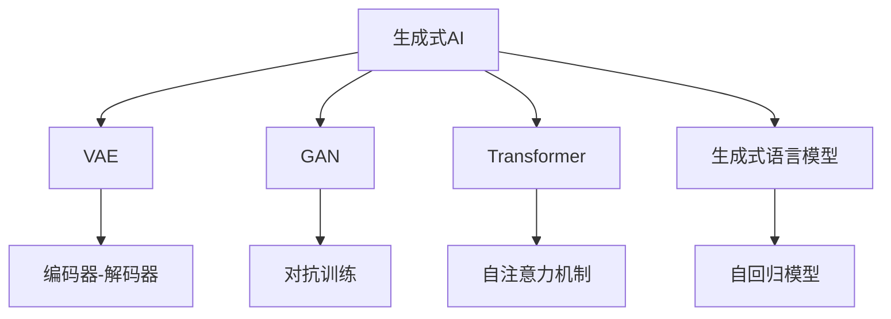

                 

# 生成式AIGC：数据与算法的完美结合

> 关键词：生成式AI、AIGC、深度学习、Transformer、变分自编码器(VAE)、生成对抗网络(GAN)、GPT-3、扩散模型、AI绘画、音乐创作

## 1. 背景介绍

### 1.1 问题由来

随着人工智能技术的飞速发展，尤其是深度学习在图像、语音、自然语言处理等领域的突破性应用，生成式人工智能(Generative AI, GAI)逐渐成为引领技术趋势的重要方向。GAI通过深度学习模型，可以从已有数据中学习到数据的生成过程，并能够根据给定输入生成新的数据，具有广泛的应用前景。

生成式AI最典型的应用场景包括：

- 图像生成：如GANs可以生成高质量的图片，进行风格迁移和图像修复。
- 音乐创作：通过生成模型自动作曲，进行音乐转换和风格混搭。
- 文本创作：生成对抗网络可以生成具有创意的文本，如故事、对话、新闻等。
- 视频生成：利用视频生成模型自动剪辑和渲染，制作动画和虚拟人物。

近年来，生成式AI的研究和应用取得了显著进展。例如，GPT-3作为生成式语言模型，已经展示了强大的文本生成能力，成为自然语言处理领域的一大突破。类似地，GANs、VAEs等生成模型也在图像生成、视频创作等领域取得了重要成果。

然而，生成式AI仍面临着一些挑战。如模型的生成质量、多样性、可解释性等问题，以及如何更好地与用户进行交互，提升生成内容的价值等。

### 1.2 问题核心关键点

生成式AI的核心在于通过深度学习模型学习数据的生成规律，并在此基础上生成新的数据。这涉及到模型设计、数据准备、算法训练和结果评估等多个环节。

- **模型设计**：选择合适的生成模型结构，包括卷积神经网络(CNN)、循环神经网络(RNN)、变分自编码器(VAE)、生成对抗网络(GAN)等。
- **数据准备**：收集和处理训练数据，构建数据增强和样本生成策略，提升模型泛化能力。
- **算法训练**：选择合适的优化算法和损失函数，通过反向传播等技术优化模型参数，训练生成模型。
- **结果评估**：定义合理的评价指标，如Fréchet inception distance (FID)、Inception score (IS)、人类感知评估等，评估生成模型的性能。

## 2. 核心概念与联系

### 2.1 核心概念概述

为更好地理解生成式AI的原理和应用，本节将介绍几个关键概念：

- **生成式AI**：通过深度学习模型学习数据的生成规律，并生成新的数据。
- **变分自编码器(VAE)**：一种生成模型，通过学习数据的分布进行编码和解码，生成新的数据。
- **生成对抗网络(GAN)**：一种生成模型，通过两个对抗网络(生成器和判别器)的协同训练，生成高质量的数据。
- **Transformer**：一种神经网络架构，适用于处理序列数据，包括文本、音频、图像等，具有高效的并行计算能力和出色的生成能力。
- **生成式语言模型**：如GPT-3，能够生成流畅、连贯的文本，广泛应用于自然语言处理领域。

这些核心概念之间通过以下Mermaid流程图展示了它们之间的关系：



这个流程图展示了生成式AI和主要生成模型的关系：

- **VAE**：通过学习数据的分布进行编码和解码，生成新的数据。
- **GAN**：通过对抗训练，生成高质量的数据。
- **Transformer**：通过自注意力机制，生成高质量的序列数据。
- **生成式语言模型**：通过自回归模型，生成流畅、连贯的文本。

### 2.2 概念间的关系

这些核心概念之间存在着紧密的联系，形成了生成式AI的完整生态系统。

- **VAE与GAN**：都是生成模型，但VAE通过学习数据的分布进行生成，GAN通过对抗训练生成数据。两者都可以用于图像生成、视频生成等场景。
- **Transformer**：主要用于文本生成任务，但在图像、音频等序列数据生成中也有广泛应用。
- **生成式语言模型**：如GPT-3，能够生成流畅、连贯的文本，广泛应用于自然语言处理领域。

通过理解这些核心概念，我们可以更好地把握生成式AI的工作原理和优化方向。

## 3. 核心算法原理 & 具体操作步骤
### 3.1 算法原理概述

生成式AI的生成过程通常分为两个阶段：编码和解码。编码阶段将输入数据转换为低维编码向量，解码阶段将编码向量转换为生成的数据。生成式AI的核心在于选择合适的编码器和解码器，优化训练过程，生成高质量的数据。

生成式AI的主要算法包括：

- **VAE**：通过学习数据的分布进行编码和解码，生成新的数据。
- **GAN**：通过对抗训练，生成高质量的数据。
- **Transformer**：适用于序列数据的生成，通过自注意力机制进行编码和解码。
- **生成式语言模型**：如GPT-3，通过自回归模型生成文本。

这些算法的基本原理都是通过深度学习模型学习数据的生成规律，并在此基础上生成新的数据。具体的算法步骤和具体操作将在后续章节详细讲解。

### 3.2 算法步骤详解

#### 3.2.1 VAE算法步骤

VAE的训练过程分为两个步骤：编码和解码。具体步骤如下：

1. **编码**：将输入数据 $x$ 映射到一个低维编码向量 $z$，使用一个全连接神经网络作为编码器。编码器的目标是最小化编码向量 $z$ 与输入数据 $x$ 之间的重构误差，即：

   $$
   \mathcal{L}_{recon}=\mathbb{E}_{x}\left\|\mathbf{z}-\hat{\mathbf{z}}\right\|^{2}
   $$

2. **解码**：将编码向量 $z$ 映射回输入数据 $x$，使用一个解码器。解码器的目标是最小化编码向量 $z$ 与输入数据 $x$ 之间的重构误差，即：

   $$
   \mathcal{L}_{dec}=\mathbb{E}_{z}\left\|\mathbf{x}-\hat{\mathbf{x}}\right\|^{2}
   $$

3. **变分推断**：通过变分推断方法，将编码向量 $z$ 和输入数据 $x$ 的分布关联起来。使用一个均值 $\mu$ 和方差 $\sigma$ 的先验分布，得到编码向量 $z$ 的后验分布：

   $$
   p_{z|x}(\mathbf{z}|x)=\frac{p_{x|\mathbf{z}}(x|\mathbf{z}) p_{z}(\mathbf{z})}{p_{x}(x)}
   $$

   其中，$p_{x|\mathbf{z}}(x|\mathbf{z})$ 表示在编码向量 $\mathbf{z}$ 下输入数据 $x$ 的似然分布，$p_{z}(\mathbf{z})$ 表示编码向量 $\mathbf{z}$ 的先验分布。

4. **训练**：最小化编码器与解码器的重构误差，以及编码向量 $z$ 与输入数据 $x$ 之间的KL散度，即：

   $$
   \mathcal{L}_{VAE}=\mathcal{L}_{recon}+\beta\mathbb{E}_{x} K L\left(p_{z|x}\left(\mathbf{z}|x\right) \| p_{z}(\mathbf{z})\right)
   $$

   其中，$\beta$ 为KL散度的正则化系数。

#### 3.2.2 GAN算法步骤

GAN的训练过程分为两个对抗网络：生成器和判别器。具体步骤如下：

1. **判别器训练**：判别器的目标是最小化将真实数据 $x$ 和生成数据 $\tilde{x}$ 区分开来。使用一个二分类神经网络作为判别器，最小化判别器在真实数据 $x$ 上的正确率，即：

   $$
   \mathcal{L}_{d}=-C_{b}\mathbb{E}_{x}\left[\log D\left(\mathbf{x}\right)\right]+C_{a}\mathbb{E}_{\tilde{x}}\left[\log \left(1-D\left(\tilde{x}\right)\right)\right]
   $$

   其中，$C_{b}$ 和 $C_{a}$ 分别表示真实数据和生成数据在判别器上的损失权重。

2. **生成器训练**：生成器的目标是最小化判别器无法正确识别生成数据 $\tilde{x}$ 为真实数据 $x$。使用一个生成网络作为生成器，最小化生成数据 $\tilde{x}$ 在判别器上的正确率，即：

   $$
   \mathcal{L}_{g}=C_{a}\mathbb{E}_{\tilde{x}}\left[\log D\left(\tilde{x}\right)\right]
   $$

3. **对抗训练**：通过交替训练生成器和判别器，生成高质量的数据。生成器和判别器的训练目标分别为：

   $$
   \min _{\theta_{g}} \max _{\theta_{d}} \mathcal{L}_{g}+\mathcal{L}_{d}
   $$

#### 3.2.3 Transformer算法步骤

Transformer的生成过程分为两个阶段：编码和解码。具体步骤如下：

1. **编码**：将输入序列 $x$ 映射到一个高维编码向量 $h$，使用多个自注意力和前馈神经网络进行编码。编码器的目标是最小化编码向量 $h$ 与输入序列 $x$ 之间的重构误差，即：

   $$
   \mathcal{L}_{recon}=\mathbb{E}_{x}\left\|\mathbf{h}-\hat{\mathbf{h}}\right\|^{2}
   $$

2. **解码**：将编码向量 $h$ 映射回输入序列 $x$，使用解码器。解码器的目标是最小化编码向量 $h$ 与输入序列 $x$ 之间的重构误差，即：

   $$
   \mathcal{L}_{dec}=\mathbb{E}_{h}\left\|\mathbf{x}-\hat{\mathbf{x}}\right\|^{2}
   $$

3. **自注意力机制**：Transformer的核心是自注意力机制，通过多个头进行编码和解码。自注意力机制的目标是最小化编码向量 $h$ 与输入序列 $x$ 之间的重构误差，即：

   $$
   \mathcal{L}_{attn}=\mathbb{E}_{x}\left\|\mathbf{h}-\hat{\mathbf{h}}\right\|^{2}
   $$

4. **训练**：最小化编码器与解码器的重构误差，以及编码向量 $h$ 与输入序列 $x$ 之间的KL散度，即：

   $$
   \mathcal{L}_{Transformer}=\mathcal{L}_{recon}+\beta\mathbb{E}_{x} K L\left(p_{h|x}\left(\mathbf{h}|x\right) \| p_{h}(\mathbf{h})\right)
   $$

#### 3.2.4 生成式语言模型算法步骤

生成式语言模型的生成过程分为两个阶段：预测和解码。具体步骤如下：

1. **预测**：使用一个语言模型对下一个单词进行预测，使用一个全连接神经网络作为语言模型。预测的目标是最小化预测结果与真实结果之间的交叉熵，即：

   $$
   \mathcal{L}_{pred}=-\sum_{i=1}^{T} \log p\left(\mathbf{y}_{i} \mid \mathbf{y}_{1:i-1}\right)
   $$

2. **解码**：通过预测结果进行解码，生成完整的序列。解码的目标是最小化解码结果与真实结果之间的交叉熵，即：

   $$
   \mathcal{L}_{dec}=-\sum_{i=1}^{T} \log p\left(\mathbf{y}_{i} \mid \mathbf{y}_{1:i-1}\right)
   $$

3. **训练**：最小化预测损失和解码损失，即：

   $$
   \mathcal{L}_{LM}=\mathcal{L}_{pred}+\beta\mathbb{E}_{y}\left\|\mathbf{y}-\hat{\mathbf{y}}\right\|^{2}
   $$

### 3.3 算法优缺点

生成式AI的主要算法包括VAE、GAN、Transformer、生成式语言模型等。这些算法各有优缺点：

- **VAE**：优点是能够生成高质量的连续数据，缺点是重构误差较高，生成数据较为模糊。
- **GAN**：优点是生成数据质量高，缺点是训练过程不稳定，存在模式崩溃等问题。
- **Transformer**：优点是适用于序列数据的生成，生成效果好，缺点是计算复杂度高，需要大量计算资源。
- **生成式语言模型**：优点是生成流畅、连贯的文本，缺点是依赖大量的文本数据进行训练。

这些算法在不同的应用场景下具有不同的优缺点，选择合适的算法可以提升生成式AI的性能。

### 3.4 算法应用领域

生成式AI的主要应用领域包括：

- **图像生成**：如GANs可以生成高质量的图片，进行风格迁移和图像修复。
- **音乐创作**：通过生成模型自动作曲，进行音乐转换和风格混搭。
- **文本创作**：生成对抗网络可以生成具有创意的文本，如故事、对话、新闻等。
- **视频生成**：利用视频生成模型自动剪辑和渲染，制作动画和虚拟人物。

## 4. 数学模型和公式 & 详细讲解 & 举例说明

### 4.1 数学模型构建

生成式AI的生成过程通常分为两个阶段：编码和解码。编码阶段将输入数据转换为低维编码向量，解码阶段将编码向量转换为生成的数据。生成式AI的核心在于选择合适的编码器和解码器，优化训练过程，生成高质量的数据。

生成式AI的主要算法包括：

- **VAE**：通过学习数据的分布进行编码和解码，生成新的数据。
- **GAN**：通过对抗训练，生成高质量的数据。
- **Transformer**：适用于序列数据的生成，通过自注意力机制进行编码和解码。
- **生成式语言模型**：如GPT-3，通过自回归模型生成文本。

这些算法的数学模型如下：

#### VAE的数学模型

VAE的生成过程包括编码和解码两个阶段。编码阶段将输入数据 $x$ 映射到一个低维编码向量 $z$，解码阶段将编码向量 $z$ 映射回输入数据 $x$。

VAE的数学模型如下：

$$
p\left(\mathbf{x} \mid \mathbf{z}\right) \propto \mathcal{N}\left(\mathbf{x} ;\mathbf{\mu}_{\mathbf{z}}, \sigma_{\mathbf{z}}\right)
$$

$$
p\left(\mathbf{z} \mid \mathbf{x}\right) \propto \mathcal{N}\left(\mathbf{z} ;\mathbf{\mu}_{\mathbf{x}}, \sigma_{\mathbf{x}}\right)
$$

其中，$\mathbf{\mu}_{\mathbf{z}}$ 和 $\sigma_{\mathbf{z}}$ 表示编码器输出的均值和方差，$\mathbf{\mu}_{\mathbf{x}}$ 和 $\sigma_{\mathbf{x}}$ 表示解码器输出的均值和方差。

#### GAN的数学模型

GAN的生成过程包括生成器和判别器两个对抗网络。生成器将随机噪声 $\mathbf{z}$ 映射到生成数据 $\tilde{x}$，判别器将生成数据 $\tilde{x}$ 与真实数据 $x$ 进行区分。

GAN的数学模型如下：

$$
p_{G}\left(\tilde{x} \mid \mathbf{z}\right)=\mathcal{N}\left(\mathbf{z};\mathbf{\mu}_{G}, \sigma_{G}\right)
$$

$$
p_{D}\left(x \mid \tilde{x}\right) \propto D\left(\tilde{x}\right)
$$

其中，$\mathbf{\mu}_{G}$ 和 $\sigma_{G}$ 表示生成器的输出均值和方差，$D\left(\tilde{x}\right)$ 表示判别器的输出。

#### Transformer的数学模型

Transformer的生成过程包括编码和解码两个阶段。编码阶段将输入序列 $x$ 映射到一个高维编码向量 $h$，解码阶段将编码向量 $h$ 映射回输入序列 $x$。

Transformer的数学模型如下：

$$
\mathbf{h}=\mathbf{x} W_{\text {dec }}
$$

其中，$W_{\text {dec }}$ 表示编码器输出的权重矩阵。

#### 生成式语言模型的数学模型

生成式语言模型的生成过程包括预测和解码两个阶段。预测阶段使用一个语言模型对下一个单词进行预测，解码阶段通过预测结果进行解码。

生成式语言模型的数学模型如下：

$$
p_{LM}\left(\mathbf{y}_{1:T} \mid \mathbf{y}_{1:T-1}\right)=\prod_{t=1}^{T} p_{LM}\left(y_{t} \mid y_{1:t-1}\right)
$$

其中，$p_{LM}\left(y_{t} \mid y_{1:t-1}\right)$ 表示语言模型对下一个单词的预测概率。

### 4.2 公式推导过程

#### VAE的公式推导

VAE的编码器输出为一个均值 $\mu$ 和方差 $\sigma$，解码器输出为一个均值 $\mu'$ 和方差 $\sigma'$。

$$
\mathbf{z}=\mu+\sigma\mathbf{u}
$$

其中，$\mathbf{u}$ 为标准正态分布的随机变量。

VAE的损失函数包括重构误差和KL散度。重构误差定义为输入数据 $x$ 与解码器输出的重构数据 $\tilde{x}$ 之间的均方误差。KL散度定义为编码器输出的均值和方差与标准正态分布之间的KL散度。

$$
\mathcal{L}_{VAE}=\mathbb{E}_{x}\left[\left\|\mathbf{x}-\tilde{\mathbf{x}}\right\|^{2}\right]+\beta K L\left(p_{z}(\mathbf{z}) \| q_{z}(\mathbf{z})\right)
$$

其中，$\beta$ 为KL散度的正则化系数。

#### GAN的公式推导

GAN的生成器将随机噪声 $\mathbf{z}$ 映射到生成数据 $\tilde{x}$，判别器将生成数据 $\tilde{x}$ 与真实数据 $x$ 进行区分。

$$
\tilde{\mathbf{x}}=\mathbf{z} W_{G}
$$

其中，$W_{G}$ 表示生成器的权重矩阵。

GAN的损失函数包括判别器的损失和生成器的损失。判别器的损失定义为将真实数据 $x$ 和生成数据 $\tilde{x}$ 区分开来的均值。生成器的损失定义为生成数据 $\tilde{x}$ 在判别器上的正确率。

$$
\mathcal{L}_{d}=-C_{b}\mathbb{E}_{x}\left[\log D\left(\mathbf{x}\right)\right]+C_{a}\mathbb{E}_{\tilde{x}}\left[\log \left(1-D\left(\tilde{x}\right)\right)\right]
$$

$$
\mathcal{L}_{g}=C_{a}\mathbb{E}_{\tilde{x}}\left[\log D\left(\tilde{x}\right)\right]
$$

其中，$C_{b}$ 和 $C_{a}$ 分别表示真实数据和生成数据在判别器上的损失权重。

#### Transformer的公式推导

Transformer的生成过程包括自注意力机制和前馈神经网络。自注意力机制通过多个头进行编码和解码，前馈神经网络用于提高生成效果。

$$
\mathbf{h}=\mathbf{x} W_{\text {dec }}
$$

其中，$W_{\text {dec }}$ 表示编码器输出的权重矩阵。

#### 生成式语言模型的公式推导

生成式语言模型的生成过程包括预测和解码两个阶段。预测阶段使用一个语言模型对下一个单词进行预测，解码阶段通过预测结果进行解码。

$$
p_{LM}\left(\mathbf{y}_{1:T} \mid \mathbf{y}_{1:T-1}\right)=\prod_{t=1}^{T} p_{LM}\left(y_{t} \mid y_{1:t-1}\right)
$$

其中，$p_{LM}\left(y_{t} \mid y_{1:t-1}\right)$ 表示语言模型对下一个单词的预测概率。

### 4.3 案例分析与讲解

以生成式图像为例，分析VAE和GAN在生成图像时的效果。

#### VAE生成图像

VAE的生成过程包括编码和解码两个阶段。编码器将输入图像 $x$ 映射到一个低维编码向量 $z$，解码器将编码向量 $z$ 映射回生成图像 $\tilde{x}$。

VAE生成的图像较为模糊，重构误差较高，但可以生成高质量的连续数据。

#### GAN生成图像

GAN的生成过程包括生成器和判别器两个对抗网络。生成器将随机噪声 $\mathbf{z}$ 映射到生成图像 $\tilde{x}$，判别器将生成图像 $\tilde{x}$ 与真实图像 $x$ 进行区分。

GAN生成的图像质量高，但训练过程不稳定，存在模式崩溃等问题。

## 5. 项目实践：代码实例和详细解释说明

### 5.1 开发环境搭建

在进行生成式AI项目实践前，我们需要准备好开发环境。以下是使用Python进行PyTorch开发的环境配置流程：

1. 安装Anaconda：从官网下载并安装Anaconda，用于创建独立的Python环境。

2. 创建并激活虚拟环境：
```bash
conda create -n pytorch-env python=3.8 
conda activate pytorch-env
```

3. 安装PyTorch：根据CUDA版本，从官网获取对应的安装命令。例如：
```bash
conda install pytorch torchvision torchaudio cudatoolkit=11.1 -c pytorch -c conda-forge
```

4. 安装TensorFlow：从官网下载并安装TensorFlow，并配置GPU/TPU。

5. 安装Transformers库：
```bash
pip install transformers
```

6. 安装各类工具包：
```bash
pip install numpy pandas scikit-learn matplotlib tqdm jupyter notebook ipython
```

完成上述步骤后，即可在`pytorch-env`环境中开始生成式AI项目实践。

### 5.2 源代码详细实现

这里我们以生成对抗网络(GAN)为例，给出使用PyTorch实现图像生成的PyTorch代码实现。

首先，定义GAN的生成器和判别器：

```python
import torch
import torch.nn as nn
import torch.nn.functional as F
import torch.optim as optim
from torchvision import datasets, transforms

class Generator(nn.Module):
    def __init__(self, latent_dim=100, output_dim=784):
        super(Generator, self).__init__()
        self.main = nn.Sequential(
            nn.Linear(latent_dim, 256),
            nn.LeakyReLU(0.2),
            nn.Linear(256, 512),
            nn.LeakyReLU(0.2),
            nn.Linear(512, output_dim),
            nn.Tanh()
        )
        
    def forward(self, x):
        return self.main(x)

class Discriminator(nn.Module):
    def __init__(self, input_dim=784):
        super(Discriminator, self).__init__()
        self.main = nn.Sequential(
            nn.Linear(input_dim, 512),
            nn.LeakyReLU(0.2),
            nn.Linear(512, 256),
            nn.LeakyReLU(0.2),
            nn.Linear(256, 1),
            nn.Sigmoid()
        )
        
    def forward(self, x):
        return self.main(x)
```

然后，定义训练函数：

```python
def train(model, dataloader, device, epoch, batch_size, learning_rate):
    G, D = model
    G_optimizer = optim.Adam(G.parameters(), lr=learning_rate)
    D_optimizer = optim.Adam(D.parameters(), lr=learning_rate)
    
    for epoch in range(epoch):
        for batch_idx, (data, _) in enumerate(dataloader):
            data = data.to(device)
            G.zero_grad()
            D.zero_grad()
            real_outputs = D(data)
            fake = G(torch.randn(batch_size, G.input_dim).to(device))
            fake_outputs = D(fake)
            D_loss = -torch.mean(torch.log(real_outputs)) - torch.mean(torch.log(1-fake_outputs))
            G_loss = -torch.mean(torch.log(fake_outputs))
            D_loss.backward()
            G_loss.backward()
            G_optimizer.step()
            D_optimizer.step()
            if (batch_idx+1) % 100 == 0:
                print(f'Epoch

