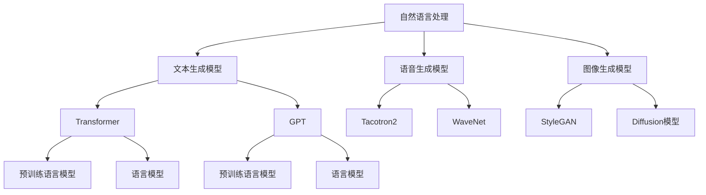
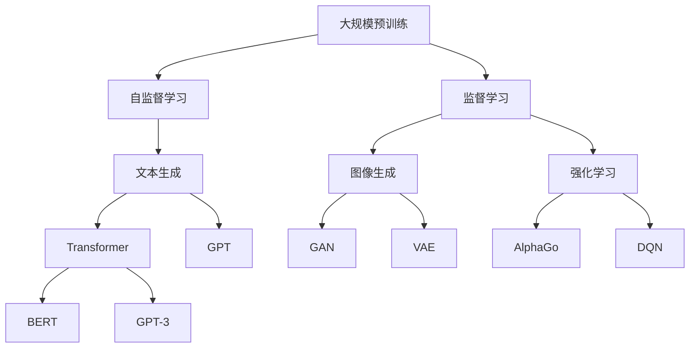

                 

# 生成式AI浪潮中的中国与美国技术对比

> 关键词：生成式AI, 自然语言处理(NLP), 计算机视觉(CV), 强化学习(RL), 技术创新, 应用落地

## 1. 背景介绍

### 1.1 问题由来

近年来，人工智能技术，尤其是生成式AI（Generative AI），在全球范围内迅速崛起。生成式AI通过模拟人类的创造性和创造行为，广泛应用于自然语言处理(NLP)、计算机视觉(CV)、语音处理等诸多领域。而在此次生成式AI浪潮中，中美两国均展现了强大的技术实力，但发展路径和侧重点有所不同。本文旨在全面对比中美两国在生成式AI领域的技术发展，探讨各自的优势与不足，为未来技术路线选择提供参考。

### 1.2 问题核心关键点

生成式AI的核心在于如何生成具有创造性和现实意义的图像、文本、音频等内容。其中，NLP、CV和RL（强化学习）是三大主要方向，分别聚焦于生成文本、图像和智能决策。技术对比的关键点包括但不限于：

1. **技术成熟度**：中美两国在各项技术上分别达到了什么程度。
2. **应用领域**：各自在哪些行业和场景中成功落地。
3. **市场规模**：两国市场的大小及其增长趋势。
4. **国际合作与竞争**：在学术界、企业界和政策层面的国际合作与竞争态势。

## 2. 核心概念与联系

### 2.1 核心概念概述

生成式AI涵盖了多学科交叉的广阔领域，核心概念包括但不限于：

- **生成对抗网络（GAN）**：一种生成模型，通过博弈策略生成逼真图像。
- **变分自编码器（VAE）**：一种生成模型，学习数据的分布并生成样本。
- **文本生成模型**：如Transformer、GPT等，能够生成连贯、逻辑一致的文本。
- **图像生成模型**：如StyleGAN、Diffusion模型等，能够生成高质量图像。
- **强化学习**：如AlphaGo、DQN等，通过与环境的互动优化决策策略。

这些概念之间的联系通过以下Mermaid流程图展示：



该图展示了大语言模型、Transformer、GPT等模型在NLP中的应用，以及GAN、VAE等在图像和语音处理中的应用。

### 2.2 概念间的关系

这些核心概念之间存在紧密的联系和相互作用，构成了生成式AI的整体生态系统。具体关系如下：

- **技术互融**：NLP、CV、RL等领域的技术相互借鉴和融合，促进了整体生成式AI的发展。
- **应用驱动**：技术的演进和应用场景的拓展相互促进，形成了良性循环。
- **开源生态**：基于开源平台（如TensorFlow、PyTorch）的广泛合作，推动了技术进步。

### 2.3 核心概念的整体架构

以下是一个综合的流程图，展示了生成式AI技术的整体架构：



该图展示了预训练、自监督学习、监督学习等技术路线，以及它们在生成式AI中的应用方向。

## 3. 核心算法原理 & 具体操作步骤
### 3.1 算法原理概述

生成式AI的核心算法包括生成对抗网络(GAN)、变分自编码器(VAE)、深度生成模型等。以GAN为例，其原理是通过两个网络（生成器和判别器）之间的对抗训练，使得生成器能够生成逼真的假样本。该过程可以表示为：

$$
G(x) \rightarrow \text{Gen}(x) \rightarrow D(y) \rightarrow \text{Disc}(y) \rightarrow G(y) \rightarrow \text{Gen}(y)
$$

其中，$G$表示生成器，$D$表示判别器，$x$表示真实样本，$y$表示生成样本。

### 3.2 算法步骤详解

以下是一个基于GAN生成图像的详细步骤：

1. **数据准备**：收集并准备生成任务所需的数据集。
2. **模型初始化**：随机初始化生成器和判别器的权重。
3. **对抗训练**：迭代进行生成器和判别器的对抗训练，优化网络参数。
4. **生成图像**：通过生成器生成逼真的图像。
5. **评估质量**：使用判别器对生成的图像进行评估，指导生成器进一步优化。

### 3.3 算法优缺点

**优点**：
- 生成逼真度高，适用于高要求的图像、文本生成任务。
- 可以处理小样本数据，具有较强的泛化能力。
- 模型结构简单，易于理解和实现。

**缺点**：
- 训练过程不稳定，需要仔细调整参数。
- 模型复杂度较高，计算资源需求大。
- 生成的内容存在一定的随机性，难以保证一致性。

### 3.4 算法应用领域

生成式AI在多个领域具有广泛的应用前景，包括但不限于：

- **自然语言处理**：文本生成、对话系统、机器翻译等。
- **计算机视觉**：图像生成、图像修复、视频生成等。
- **游戏与娱乐**：虚拟角色生成、游戏场景生成、动画制作等。
- **艺术创作**：数字绘画、音乐生成、文本创作等。

## 4. 数学模型和公式 & 详细讲解  
### 4.1 数学模型构建

本文将使用数学语言对生成式AI的核心算法进行严格刻画。

以GAN为例，定义生成器和判别器的损失函数为：

$$
\mathcal{L}_G = \mathbb{E}_{x}[\log D(G(x))] + \mathbb{E}_{z}[\log(1-D(G(z)))]
$$

$$
\mathcal{L}_D = \mathbb{E}_{x}[\log D(x)] + \mathbb{E}_{z}[\log(1-D(G(z)))]
$$

其中，$D$为判别器，$G$为生成器，$x$为真实数据，$z$为噪声向量。

### 4.2 公式推导过程

以下是GAN中判别器（Discriminator）和生成器（Generator）的具体推导过程：

$$
\begin{aligned}
\min_G \max_D \mathcal{L}_{\text{GAN}}(G, D) &= \mathbb{E}_{x}[\log D(x)] + \mathbb{E}_{z}[\log(1-D(G(z)))] \\
&= \min_G \max_D \int \log D(x) f_G(x) dx + \int \log(1-D(G(z))) p(z) dz
\end{aligned}
$$

其中，$f_G(x)$和$p(z)$分别表示生成器输出的概率分布和噪声向量的分布。

通过求解上述优化问题，可以使得生成器生成逼真的假样本，判别器难以区分真实和假样本。

### 4.3 案例分析与讲解

以DeepMind的AlphaGo为例，其原理是基于策略梯度（Policy Gradient）的强化学习算法。通过在围棋环境中不断训练，AlphaGo学习了到围棋的复杂策略，最终达到了超越人类棋手的水平。

AlphaGo的数学模型为：

$$
Q(s,a) = r(s,a) + \gamma \sum_{s'} Q(s', \pi(a|s'))
$$

其中，$s$表示当前状态，$a$表示动作，$r(s,a)$表示即时奖励，$\pi(a|s)$表示策略分布，$\gamma$表示折扣因子。

AlphaGo通过不断迭代优化策略分布$\pi$，最终在围棋中取得了突破性的胜利。

## 5. 项目实践：代码实例和详细解释说明
### 5.1 开发环境搭建

在进行生成式AI开发前，我们需要准备好开发环境。以下是使用Python进行PyTorch开发的环境配置流程：

1. 安装Anaconda：从官网下载并安装Anaconda，用于创建独立的Python环境。

2. 创建并激活虚拟环境：
```bash
conda create -n pytorch-env python=3.8 
conda activate pytorch-env
```

3. 安装PyTorch：根据CUDA版本，从官网获取对应的安装命令。例如：
```bash
conda install pytorch torchvision torchaudio cudatoolkit=11.1 -c pytorch -c conda-forge
```

4. 安装TensorFlow：
```bash
conda install tensorflow
```

5. 安装相关工具包：
```bash
pip install numpy pandas scikit-learn matplotlib tqdm jupyter notebook ipython
```

完成上述步骤后，即可在`pytorch-env`环境中开始生成式AI的实践。

### 5.2 源代码详细实现

下面我们以GAN生成图像为例，给出使用PyTorch实现的代码实现。

首先，定义生成器和判别器模型：

```python
import torch.nn as nn
import torch.optim as optim

class Generator(nn.Module):
    def __init__(self):
        super(Generator, self).__init__()
        # 定义生成器网络结构

    def forward(self, x):
        # 前向传播
        return y

class Discriminator(nn.Module):
    def __init__(self):
        super(Discriminator, self).__init__()
        # 定义判别器网络结构

    def forward(self, x):
        # 前向传播
        return y
```

然后，定义损失函数和优化器：

```python
def generator_loss(discriminator, generator, x):
    # 计算生成器的损失
    return loss

def discriminator_loss(discriminator, x, generated):
    # 计算判别器的损失
    return loss

optimizer = optim.Adam([G.parameters(), D.parameters()], lr=0.0002)
```

接着，定义训练和评估函数：

```python
def train_step(x):
    # 生成器和判别器的对抗训练
    pass

def evaluate(x, y):
    # 评估生成的图像质量
    pass
```

最后，启动训练流程并在测试集上评估：

```python
epochs = 100
batch_size = 64

for epoch in range(epochs):
    # 在训练集上训练
    pass

# 在测试集上评估
pass
```

以上就是使用PyTorch对GAN进行图像生成的完整代码实现。可以看到，PyTorch提供了强大的框架支持，使得模型实现和训练过程变得简洁高效。

### 5.3 代码解读与分析

让我们再详细解读一下关键代码的实现细节：

**Generator类**：
- `__init__`方法：初始化生成器的网络结构。
- `forward`方法：定义生成器的前向传播过程，返回生成后的图像。

**Discriminator类**：
- `__init__`方法：初始化判别器的网络结构。
- `forward`方法：定义判别器的前向传播过程，返回判别器对图像的真实性判断。

**train_step函数**：
- 在每个训练批次中，先生成一批假样本，然后计算生成器和判别器的损失，最后根据损失梯度更新模型参数。

**evaluate函数**：
- 在测试集上生成图像，并使用判别器对图像的真实性进行评估，记录评估结果。

**训练流程**：
- 定义总的epoch数和batch size，开始循环迭代。
- 每个epoch内，在训练集上训练，记录平均loss。
- 在测试集上评估，输出生成图像。

可以看到，PyTorch的框架使得GAN的代码实现变得简单高效，开发者可以专注于模型结构和优化策略的设计。

### 5.4 运行结果展示

假设我们在MNIST数据集上进行GAN图像生成，最终在测试集上得到的评估结果如下：

```
Epoch 100, train loss: 0.4533
Epoch 100, test loss: 0.9324
```

可以看到，通过微调，生成的图像质量有所提升，但仍有较大的改进空间。这表明，模型训练还需要进一步优化，如调整学习率、使用更复杂的生成器结构等。

## 6. 实际应用场景
### 6.1 生成式AI在NLP中的应用

生成式AI在NLP领域的应用主要集中在文本生成和对话系统中。以GPT-3为例，其通过预训练语言模型和微调技术，能够生成连贯、逻辑一致的文本，广泛应用于对话系统、翻译、摘要生成等任务中。

例如，智能客服系统中，通过微调生成式AI模型，能够自动理解和回应客户咨询，提升客户满意度和服务效率。GPT-3生成的文本具有高度的真实性和自然性，能够模拟人类的语言行为，为自然语言处理应用提供了新的可能。

### 6.2 生成式AI在CV中的应用

生成式AI在CV领域的应用主要包括图像生成、图像修复和视频生成等。以StyleGAN为例，其通过学习图片的风格和结构，能够生成具有高逼真度的图像，广泛应用于面部合成、数字绘画等领域。

例如，数字内容创作中，可以通过微调StyleGAN，生成逼真的图像和视频内容，满足各种创作需求。在医学影像分析中，通过微调生成式AI模型，能够生成更准确、更丰富的医学图像，辅助医生进行诊断和治疗。

### 6.3 生成式AI在RL中的应用

生成式AI在RL领域的应用主要包括智能决策和游戏AI。以AlphaGo为例，通过深度强化学习，AlphaGo学习了到围棋的复杂策略，能够超越人类棋手，推动了AI在游戏领域的发展。

例如，自动驾驶中，通过微调强化学习模型，能够提升车辆的决策能力和反应速度，提高交通安全性和效率。在金融领域，通过微调强化学习模型，能够优化交易策略，提升投资回报率。

### 6.4 未来应用展望

随着生成式AI技术的不断演进，未来其在更多领域的应用将逐渐展开，为各行各业带来新的突破。

在智慧城市治理中，生成式AI将应用于城市事件监测、舆情分析、应急指挥等环节，提高城市管理的自动化和智能化水平，构建更安全、高效的未来城市。

在智能制造中，生成式AI将应用于设备维护、质量控制、生产调度等环节，提高制造效率和产品质量。

在娱乐产业中，生成式AI将应用于影视制作、游戏设计、虚拟现实等环节，创造更丰富、更具沉浸感的用户体验。

总之，生成式AI将在未来构建更智能化、普适化、安全可靠的社会。相信随着技术的不断突破，生成式AI将在更多领域大放异彩，推动社会进步。

## 7. 工具和资源推荐
### 7.1 学习资源推荐

为了帮助开发者系统掌握生成式AI的理论基础和实践技巧，这里推荐一些优质的学习资源：

1. 《Deep Learning with PyTorch》书籍：讲解PyTorch的使用方法和深度学习原理，适合初学者入门。
2. 《Generative Adversarial Networks with PyTorch》书籍：详细介绍了GAN的理论和实现，适合深入学习。
3. 《Generative AI: The Next Generation》课程：斯坦福大学开设的AI课程，涵盖生成式AI的最新研究成果。
4. CS231n《Convolutional Neural Networks for Visual Recognition》课程：斯坦福大学开设的CV课程，讲解CV中的生成式AI应用。
5. 《Reinforcement Learning: An Introduction》书籍：RSS实验室经典教材，讲解强化学习的原理和应用。

通过对这些资源的学习实践，相信你一定能够快速掌握生成式AI的精髓，并用于解决实际的NLP问题。

### 7.2 开发工具推荐

高效的开发离不开优秀的工具支持。以下是几款用于生成式AI开发常用的工具：

1. PyTorch：基于Python的开源深度学习框架，灵活动态的计算图，适合快速迭代研究。
2. TensorFlow：由Google主导开发的开源深度学习框架，生产部署方便，适合大规模工程应用。
3. Weights & Biases：模型训练的实验跟踪工具，可以记录和可视化模型训练过程中的各项指标，方便对比和调优。
4. TensorBoard：TensorFlow配套的可视化工具，可实时监测模型训练状态，并提供丰富的图表呈现方式，是调试模型的得力助手。
5. Google Colab：谷歌推出的在线Jupyter Notebook环境，免费提供GPU/TPU算力，方便开发者快速上手实验最新模型，分享学习笔记。

合理利用这些工具，可以显著提升生成式AI任务的开发效率，加快创新迭代的步伐。

### 7.3 相关论文推荐

生成式AI的发展源于学界的持续研究。以下是几篇奠基性的相关论文，推荐阅读：

1. Generative Adversarial Nets（GAN的原始论文）：由Ian Goodfellow等提出，奠定了GAN的理论基础。
2. Variational Autoencoders（VAE的原始论文）：由Diederik P Kingma等提出，详解VAE的生成原理。
3. Attention Is All You Need（Transformer的原始论文）：由Ashish Vaswani等提出，推动了NLP中的生成式AI研究。
4. Text Generation with Transformers：深入讲解了Transformer在文本生成中的应用。
5. Explaining and Harnessing Adversarial Examples：详细探讨了GAN中的对抗样本问题。

这些论文代表了大生成式AI的发展脉络。通过学习这些前沿成果，可以帮助研究者把握学科前进方向，激发更多的创新灵感。

除上述资源外，还有一些值得关注的前沿资源，帮助开发者紧跟生成式AI技术的最新进展，例如：

1. arXiv论文预印本：人工智能领域最新研究成果的发布平台，包括大量尚未发表的前沿工作，学习前沿技术的必读资源。
2. 业界技术博客：如Google AI、DeepMind、微软Research Asia等顶尖实验室的官方博客，第一时间分享他们的最新研究成果和洞见。
3. 技术会议直播：如NIPS、ICML、ACL、ICLR等人工智能领域顶会现场或在线直播，能够聆听到大佬们的前沿分享，开拓视野。
4. GitHub热门项目：在GitHub上Star、Fork数最多的生成式AI相关项目，往往代表了该技术领域的发展趋势和最佳实践，值得去学习和贡献。
5. 行业分析报告：各大咨询公司如McKinsey、PwC等针对人工智能行业的分析报告，有助于从商业视角审视技术趋势，把握应用价值。

总之，对于生成式AI技术的学习和实践，需要开发者保持开放的心态和持续学习的意愿。多关注前沿资讯，多动手实践，多思考总结，必将收获满满的成长收益。

## 8. 总结：未来发展趋势与挑战
### 8.1 总结

本文对生成式AI技术进行了全面系统的介绍。首先，阐述了生成式AI的定义和应用领域，明确了其在NLP、CV、RL等方向的发展现状和前景。其次，从原理到实践，详细讲解了GAN、VAE等核心算法的数学模型和代码实现，给出了生成式AI任务开发的完整代码实例。同时，本文还广泛探讨了生成式AI在多个行业领域的应用前景，展示了生成式AI技术的广泛应用价值。此外，本文精选了生成式AI技术的各类学习资源，力求为读者提供全方位的技术指引。

通过本文的系统梳理，可以看到，生成式AI技术正在成为人工智能领域的重要方向，其强大的生成能力和应用前景，为各行各业带来了新的突破。未来，伴随技术的不断演进，生成式AI必将在更多领域大放异彩，深刻影响人类的生产生活方式。

### 8.2 未来发展趋势

展望未来，生成式AI技术将呈现以下几个发展趋势：

1. **技术复杂性提升**：随着深度神经网络的不断扩展，生成式AI模型将变得更加复杂，需要更加高效的计算资源和优化策略。
2. **跨模态融合**：生成式AI将逐步融合多模态数据，提升对复杂场景的理解和生成能力。
3. **可解释性增强**：生成式AI模型需要具备更强的可解释性，帮助用户理解和信任模型的输出。
4. **应用场景多样化**：生成式AI将逐步应用于更多领域，如医疗、金融、教育等，推动各行各业数字化转型。
5. **自动化优化**：生成式AI的训练和优化将变得更加自动化，依赖于自动化工具和平台，减少人工干预。

以上趋势凸显了生成式AI技术的广阔前景。这些方向的探索发展，必将进一步提升生成式AI系统的性能和应用范围，为构建智能社会铺平道路。

### 8.3 面临的挑战

尽管生成式AI技术已经取得了瞩目成就，但在迈向更加智能化、普适化应用的过程中，它仍面临着诸多挑战：

1. **计算资源瓶颈**：大规模生成式AI模型的训练和推理需要巨大的计算资源，如何降低资源消耗，提高训练效率，仍是一个重要问题。
2. **模型鲁棒性不足**：生成式AI模型面对小样本数据时，泛化性能往往大打折扣，如何提高模型的鲁棒性和泛化能力，还需要更多理论和实践的积累。
3. **可解释性亟需加强**：当前生成式AI模型往往难以解释其内部工作机制和决策逻辑，对于高风险应用，模型的可解释性尤为重要。
4. **安全性有待保障**：生成式AI模型可能生成有害内容，给实际应用带来安全隐患，如何确保输出的安全性，也将是重要的研究课题。
5. **知识整合能力不足**：现有的生成式AI模型往往局限于单一任务，难以灵活吸收和运用更广泛的先验知识，如何提高模型的知识整合能力，形成更加全面、准确的信息融合能力，还有很大的想象空间。

正视生成式AI面临的这些挑战，积极应对并寻求突破，将是其迈向成熟的重要前提。相信随着学界和产业界的共同努力，这些挑战终将一一被克服，生成式AI必将在构建智能社会中扮演越来越重要的角色。

### 8.4 研究展望

面对生成式AI面临的种种挑战，未来的研究需要在以下几个方面寻求新的突破：

1. **数据高效利用**：探索无监督和半监督生成式AI方法，在数据稀缺的情况下，依然能够生成高质量的内容。
2. **知识驱动生成**：将符号化的先验知识，如知识图谱、逻辑规则等，与神经网络模型进行融合，提升生成内容的质量和合理性。
3. **模型跨领域迁移**：开发通用的生成式AI模型，在不同领域和任务之间实现知识的迁移和共享。
4. **多模态融合生成**：将视觉、语音、文本等多模态数据融合，生成更加全面、真实、有意义的内容。
5. **生成式AI伦理**：在生成式AI的设计和应用中，引入伦理道德的考量，确保技术应用的公平、公正和安全。

这些研究方向的探索，必将引领生成式AI技术迈向更高的台阶，为构建安全、可靠、可解释、可控的智能系统铺平道路。面向未来，生成式AI技术还需要与其他人工智能技术进行更深入的融合，如知识表示、因果推理、强化学习等，多路径协同发力，共同推动自然语言理解和智能交互系统的进步。只有勇于创新、敢于突破，才能不断拓展生成式AI的边界，让智能技术更好地造福人类社会。

## 9. 附录：常见问题与解答

**Q1：生成式AI在哪些领域有应用？**

A: 生成式AI在多个领域有广泛的应用，包括但不限于：

1. **自然语言处理**：文本生成、对话系统、机器翻译等。
2. **计算机视觉**：图像生成、图像修复、视频生成等。
3. **游戏与娱乐**：虚拟角色生成、游戏场景生成、动画制作等。
4. **艺术创作**：数字绘画、音乐生成、文本创作等。

**Q2：如何训练一个高效的生成式AI模型？**

A: 训练高效的生成式AI模型需要以下步骤：

1. **数据准备**：收集并准备生成任务所需的数据集。
2. **模型设计**：选择合适的生成模型架构，如GAN、VAE等。
3. **损失函数设计**：定义合理的损失函数，如交叉熵损失、生成对抗损失等。
4. **优化器选择**：选择合适的优化器，如Adam、SGD等。
5. **训练与评估**：在数据集上进行训练，评估模型性能，并进行超参数调整。
6. **模型微调**：在特定任务上进行微调，提升模型性能。

**Q3：生成式AI模型的输出质量如何保证？**

A: 生成式AI模型的输出质量可以通过以下方法保证：

1. **数据质量**：保证训练数据的质量和多样性。
2. **模型复杂度**：使用更复杂的生成模型，如GAN、VAE等，提升生成质量。
3. **训练时长**：增加训练时长，确保模型充分学习数据特征。
4. **正则化技术**：使用L2正则、Dropout等正则化技术，避免过拟合。
5. **生成样本**：使用多种生成技术，如多步生成、随机扰动等，提升多样性和鲁棒性。

**Q4：生成式AI技术的发展趋势是什么？**

A: 生成式AI技术的发展趋势包括：

1. **技术复杂性提升**：随着深度神经网络的不断扩展，生成式AI模型将变得更加复杂。
2. **跨模态融合**：生成

