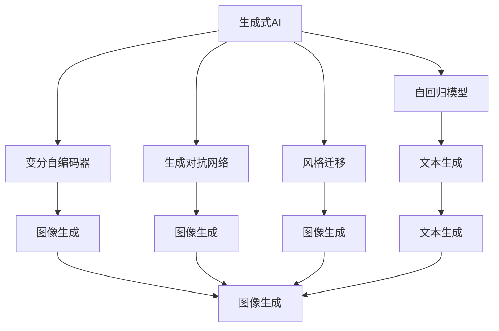
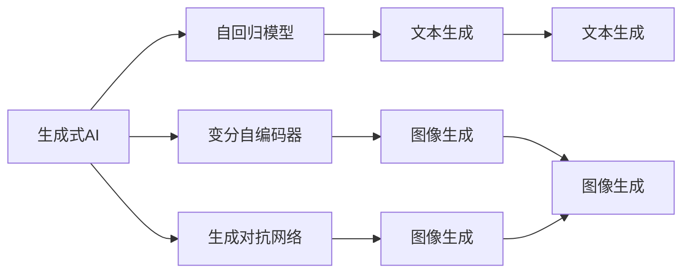
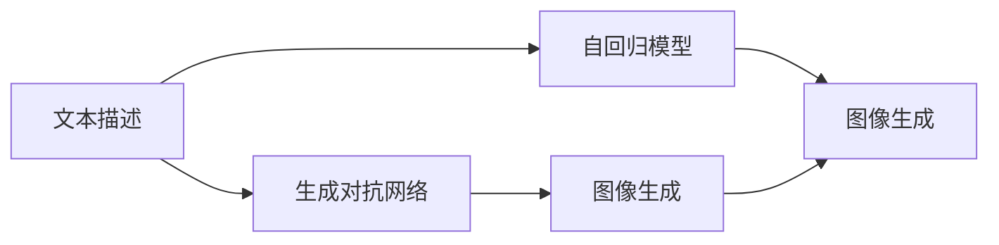
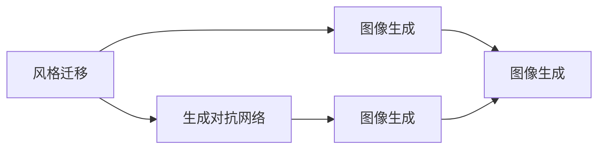
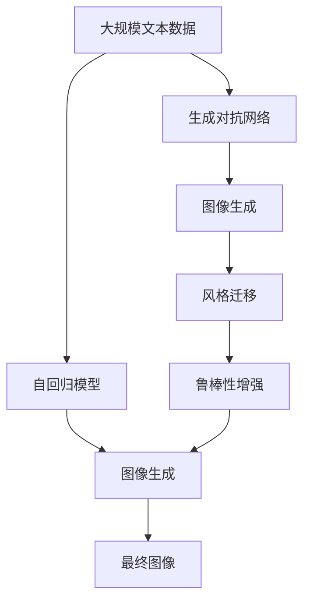

                 

# 生成式AI：从文本到图像，解锁无限创意

> 关键词：生成式AI, 文本到图像, 神经网络, 自回归模型, 变分自编码器, 对抗网络, 风格迁移, 鲁棒性

## 1. 背景介绍

### 1.1 问题由来
随着深度学习技术的不断发展，人工智能领域在图像生成、文本生成、音乐生成、自然语言理解等领域取得了突破性进展。生成式AI（Generative AI）作为其中的一个重要分支，以生成高质量、多样化的内容为目标，吸引了越来越多的研究者和企业关注。

近年来，基于神经网络（Neural Networks）的生成式模型，如变分自编码器（Variational Autoencoders, VAEs）、生成对抗网络（Generative Adversarial Networks, GANs）、自回归模型（Autoregressive Models）等，在图像生成、文本生成、音乐生成等领域表现出色。这些模型不仅能够生成高质量的内容，还能保持一定程度的控制，即用户可以通过一些方式影响生成内容，如控制风格、控制主题、控制语调等。

然而，这些生成式AI模型的应用范围还较为有限，特别是文本到图像的生成任务，即如何通过自然语言描述生成相应的图像，仍存在许多挑战。本文将从背景介绍、核心概念与联系、核心算法原理与操作步骤、数学模型与公式、项目实践、实际应用场景、工具与资源推荐、总结与展望、附录等方面，对文本到图像生成式AI的原理与应用进行全面介绍。

### 1.2 问题核心关键点
文本到图像生成式AI的核心问题是如何通过自然语言描述生成高质量的图像。该问题可以拆解为以下几个关键点：

- 文本表示：如何将自然语言描述编码为机器可以理解的向量表示。
- 图像生成：如何基于向量表示生成高质量的图像。
- 融合策略：如何将文本与图像生成过程融合起来。

解决这些问题需要结合文本处理、图像生成、深度学习等领域的知识和技能。本文将围绕这些关键点，详细阐述文本到图像生成式AI的原理与应用。

### 1.3 问题研究意义
文本到图像生成式AI的研究不仅能够为计算机视觉、自然语言处理等领域带来新的突破，还能解锁无限的创意，应用于艺术创作、游戏设计、虚拟现实（VR）、增强现实（AR）等诸多领域。

- 艺术创作：通过生成艺术作品，大幅降低艺术家创作成本，激发更多创意。
- 游戏设计：为游戏中的角色、场景生成逼真、多样化的视觉效果，提升游戏体验。
- 虚拟现实：通过生成逼真的虚拟环境，提升用户的沉浸感。
- 增强现实：生成逼真的AR内容，增强现实应用效果。

因此，文本到图像生成式AI的研究具有重要的理论和应用意义，将推动人工智能技术的广泛应用和创新发展。

## 2. 核心概念与联系

### 2.1 核心概念概述

为更好地理解文本到图像生成式AI的原理与应用，本节将介绍几个密切相关的核心概念：

- 生成式AI（Generative AI）：以生成高质量、多样化的内容为目标的AI技术，包括但不限于文本生成、图像生成、音乐生成等。
- 自回归模型（Autoregressive Models）：通过之前生成的部分信息预测后续部分的信息，适用于文本生成、图像生成等任务。
- 变分自编码器（Variational Autoencoders, VAEs）：通过学习生成数据的分布，实现高质量的生成任务，常用于图像生成、文本生成等。
- 生成对抗网络（Generative Adversarial Networks, GANs）：通过对抗训练的方式生成高质量的图像，具有较高的生成能力。
- 风格迁移（Style Transfer）：通过将图像的样式转移到另一幅图像上，实现不同的视觉效果。
- 鲁棒性（Robustness）：模型对输入数据、噪声等的鲁棒性，确保生成的图像在各种情况下都能保持较好的质量。

这些核心概念之间的逻辑关系可以通过以下Mermaid流程图来展示：



这个流程图展示了大模型微调的各个核心概念之间的联系和应用场景：

1. 生成式AI涵盖了多种生成任务，包括文本生成、图像生成等。
2. 自回归模型和变分自编码器是常用的生成模型，分别适用于文本和图像生成。
3. 生成对抗网络是另一种强大的生成模型，能够生成高质量的图像。
4. 风格迁移可以将图像的样式进行转移，实现不同的视觉效果。
5. 鲁棒性是模型的一个重要指标，确保生成的图像在不同情况下都能保持较好的质量。

### 2.2 概念间的关系

这些核心概念之间存在着紧密的联系，形成了生成式AI的整体生态系统。下面我们通过几个Mermaid流程图来展示这些概念之间的关系。

#### 2.2.1 生成式AI与生成模型



这个流程图展示了生成式AI与主要生成模型之间的关系。生成式AI涵盖的生成模型包括自回归模型、变分自编码器、生成对抗网络等，每个模型都有其特定的应用场景。

#### 2.2.2 文本与图像的生成关系



这个流程图展示了文本与图像生成之间的关系。文本描述首先经过自回归模型或生成对抗网络生成图像，然后根据生成的图像进行进一步的调整，最终输出高质量的图像。

#### 2.2.3 风格迁移与生成模型



这个流程图展示了风格迁移与生成对抗网络的关系。风格迁移通过生成对抗网络生成图像，然后根据风格迁移的目标，对生成的图像进行调整，最终输出具有特定风格的图像。

### 2.3 核心概念的整体架构

最后，我们用一个综合的流程图来展示这些核心概念在大模型微调过程中的整体架构：



这个综合流程图展示了从预训练到生成任务的完整过程。文本描述首先经过自回归模型生成图像，然后通过生成对抗网络进一步生成图像，并根据风格迁移的要求对图像进行调整，最终输出高质量的图像。

## 3. 核心算法原理 & 具体操作步骤
### 3.1 算法原理概述

文本到图像生成式AI的算法原理主要基于生成模型（如自回归模型、变分自编码器、生成对抗网络等）的构建与训练。以下以变分自编码器（VAEs）和生成对抗网络（GANs）为例，简要介绍其主要原理：

1. 变分自编码器（VAEs）：通过学习数据的概率分布，实现高质量的生成任务。VAEs由编码器（Encoder）和解码器（Decoder）组成。编码器将输入数据压缩为向量表示，解码器将向量表示恢复为原始数据。VAEs通过最大化先验概率和后验概率的乘积，最小化重构误差，优化生成过程。

2. 生成对抗网络（GANs）：通过两个对抗神经网络（Generator和Discriminator）的对抗训练，生成高质量的图像。Generator生成逼真的图像，Discriminator评估图像的真实性。GANs通过优化两个网络的目标函数，使得Generator生成的图像与真实图像难以区分，从而实现高质量的图像生成。

### 3.2 算法步骤详解

#### 3.2.1 变分自编码器（VAEs）

1. 数据准备：收集大规模文本数据和相应的图像数据。将文本描述作为输入，图像作为输出。
2. 编码器训练：构建编码器模型，对文本描述进行编码，得到向量表示。
3. 解码器训练：构建解码器模型，将向量表示恢复为图像。
4. 损失函数设计：设计损失函数，包括重构误差和KL散度。
5. 模型优化：使用优化算法（如Adam、SGD等），最小化损失函数，训练生成器。
6. 生成图像：使用训练好的生成器模型，对新的文本描述进行解码，生成高质量的图像。

#### 3.2.2 生成对抗网络（GANs）

1. 数据准备：收集大规模文本数据和相应的图像数据。将文本描述作为输入，图像作为输出。
2. Generator网络构建：构建Generator模型，生成逼真的图像。
3. Discriminator网络构建：构建Discriminator模型，评估图像的真实性。
4. 损失函数设计：设计损失函数，包括图像生成损失和图像判别损失。
5. 对抗训练：通过对抗训练的方式，优化Generator和Discriminator的目标函数。
6. 生成图像：使用训练好的Generator模型，对新的文本描述进行解码，生成高质量的图像。

### 3.3 算法优缺点

文本到图像生成式AI的算法具有以下优点：

- 能够生成高质量的图像，具有逼真的视觉效果。
- 能够生成多样化的图像，满足用户的不同需求。
- 能够实现文本到图像的转换，扩展了数据的应用范围。

但同时也存在一些缺点：

- 需要大量的标注数据，训练成本较高。
- 生成的图像质量受文本描述的影响较大，文本描述不清晰或错误的图像质量会较差。
- 生成的图像可能存在一定的随机性，无法完全控制。

### 3.4 算法应用领域

文本到图像生成式AI在多个领域具有广泛的应用，例如：

- 艺术创作：通过生成艺术作品，激发更多创意，降低创作成本。
- 游戏设计：为游戏中的角色、场景生成逼真、多样化的视觉效果，提升游戏体验。
- 虚拟现实（VR）：生成逼真的虚拟环境，提升用户的沉浸感。
- 增强现实（AR）：生成逼真的AR内容，增强现实应用效果。
- 广告设计：生成逼真的广告图像，提升广告效果。
- 教育培训：生成逼真的教学内容，提升学习效果。

## 4. 数学模型和公式 & 详细讲解  
### 4.1 数学模型构建

在文本到图像生成式AI中，常见的数学模型包括变分自编码器（VAEs）和生成对抗网络（GANs）。以下以VAEs和GANs为例，介绍其数学模型的构建过程。

#### 4.1.1 变分自编码器（VAEs）

VAEs的数学模型可以表示为：

$$
\begin{aligned}
p(z) &= \mathcal{N}(0, I) \\
p(x|z) &= \mathcal{N}(\mu(z), \sigma(z)) \\
p(x) &= \int p(z) p(x|z) dz
\end{aligned}
$$

其中，$z$ 为向量表示，$\mu(z)$ 和 $\sigma(z)$ 分别为解码器得到的均值和方差。通过最大化$p(x|z)$与$p(z)$的乘积，最小化重构误差，优化生成过程。

#### 4.1.2 生成对抗网络（GANs）

GANs的数学模型可以表示为：

$$
\begin{aligned}
G(x) &= z \\
D(x) &= p(x) \\
L_G &= \mathbb{E}_{x \sim p_x}[logD(G(z))] + \mathbb{E}_{x \sim p_x}[log(1-D(x))] \\
L_D &= \mathbb{E}_{x \sim p_x}[logD(x)] + \mathbb{E}_{x \sim p_g}[log(1-D(G(z)))]
\end{aligned}
$$

其中，$G(z)$ 为Generator生成的图像，$D(x)$ 为Discriminator评估的图像真实性。通过优化$L_G$和$L_D$，使得Generator生成的图像与真实图像难以区分，从而实现高质量的图像生成。

### 4.2 公式推导过程

以下以VAEs为例，详细推导其损失函数和优化过程。

#### 4.2.1 重构误差

重构误差是VAEs的重要组成部分，表示生成器将图像解码后与原始图像的差异。重构误差可以表示为：

$$
\begin{aligned}
L_{rec} &= \mathbb{E}_{x \sim p_x}[||x - G(z)||_2]
\end{aligned}
$$

其中，$||.||_2$ 表示L2范数。

#### 4.2.2 KL散度

KL散度是VAEs中的另一个重要组成部分，用于控制编码器的表达能力。KL散度可以表示为：

$$
\begin{aligned}
L_{kl} &= \mathbb{E}_{z \sim p_z}[-logq(z|x)]
\end{aligned}
$$

其中，$q(z|x)$ 为编码器输出的概率分布，$p_z$ 为先验概率分布。

#### 4.2.3 总损失函数

VAEs的总损失函数可以表示为：

$$
\begin{aligned}
L_{vaes} &= L_{rec} + \lambda L_{kl}
\end{aligned}
$$

其中，$\lambda$ 为控制KL散度的超参数。

#### 4.2.4 优化过程

VAEs的优化过程可以表示为：

$$
\begin{aligned}
\theta_E &= \arg\min_{\theta_E} L_{rec} + \lambda L_{kl} \\
\theta_D &= \arg\min_{\theta_D} L_{rec} + \lambda L_{kl}
\end{aligned}
$$

其中，$\theta_E$ 和 $\theta_D$ 分别为编码器和解码器的参数。

### 4.3 案例分析与讲解

以下以GANs为例，详细分析其生成过程和应用。

#### 4.3.1 生成过程

GANs的生成过程可以表示为：

1. Generator生成图像：$G(z) = \mu(z) + \sigma(z)N(0, 1)$，其中 $N(0, 1)$ 为标准正态分布，$\mu(z)$ 和 $\sigma(z)$ 为Generator的参数。
2. Discriminator评估图像真实性：$D(x) = log(D(x)) + (1-D(x))log(1-D(x))$。

#### 4.3.2 对抗训练

GANs的对抗训练过程可以表示为：

1. Generator生成图像：$G(z)$。
2. Discriminator评估图像真实性：$D(x)$。
3. 优化Generator：$L_G = \mathbb{E}_{x \sim p_x}[logD(G(z))] + \mathbb{E}_{x \sim p_x}[log(1-D(x))]$。
4. 优化Discriminator：$L_D = \mathbb{E}_{x \sim p_x}[logD(x)] + \mathbb{E}_{x \sim p_g}[log(1-D(G(z)))]$。

## 5. 项目实践：代码实例和详细解释说明
### 5.1 开发环境搭建

在进行文本到图像生成式AI的开发前，我们需要准备好开发环境。以下是使用Python进行PyTorch开发的环境配置流程：

1. 安装Anaconda：从官网下载并安装Anaconda，用于创建独立的Python环境。

2. 创建并激活虚拟环境：
```bash
conda create -n pytorch-env python=3.8 
conda activate pytorch-env
```

3. 安装PyTorch：根据CUDA版本，从官网获取对应的安装命令。例如：
```bash
conda install pytorch torchvision torchaudio cudatoolkit=11.1 -c pytorch -c conda-forge
```

4. 安装Transformers库：
```bash
pip install transformers
```

5. 安装各类工具包：
```bash
pip install numpy pandas scikit-learn matplotlib tqdm jupyter notebook ipython
```

完成上述步骤后，即可在`pytorch-env`环境中开始文本到图像生成式AI的开发。

### 5.2 源代码详细实现

这里以GANs为例，给出一个使用PyTorch和TensorFlow实现文本到图像生成的代码示例。

```python
import torch
import torch.nn as nn
import torch.optim as optim
from torch.utils.data import DataLoader
from torchvision.datasets import CIFAR10
from torchvision.transforms import ToTensor

# 定义Generator模型
class Generator(nn.Module):
    def __init__(self):
        super(Generator, self).__init__()
        self.layers = nn.Sequential(
            nn.Linear(100, 128),
            nn.LeakyReLU(0.2),
            nn.Linear(128, 784),
            nn.ReLU(),
            nn.Linear(784, 3, 1),
        )
    
    def forward(self, x):
        return self.layers(x)

# 定义Discriminator模型
class Discriminator(nn.Module):
    def __init__(self):
        super(Discriminator, self).__init__()
        self.layers = nn.Sequential(
            nn.Linear(3, 784),
            nn.ReLU(),
            nn.Linear(784, 128),
            nn.LeakyReLU(0.2),
            nn.Linear(128, 1)
        )
    
    def forward(self, x):
        return self.layers(x)

# 定义损失函数
criterion = nn.BCELoss()

# 定义优化器
optimizer_G = optim.Adam(Generator.parameters(), lr=0.0002)
optimizer_D = optim.Adam(Discriminator.parameters(), lr=0.0002)

# 加载数据集
train_dataset = CIFAR10(root='./data', train=True, transform=ToTensor(), download=True)
train_loader = DataLoader(train_dataset, batch_size=128, shuffle=True)

# 训练过程
for epoch in range(100):
    for i, (real_images, _) in enumerate(train_loader):
        real_images = real_images.to(device)
        batches_per_epoch = len(train_loader)
        
        # 生成器训练
        optimizer_G.zero_grad()
        with torch.no_grad():
            generated_images = Generator(z)
        g_loss = criterion(D(generated_images), labels)
        g_loss.backward()
        optimizer_G.step()
        
        # 判别器训练
        optimizer_D.zero_grad()
        d_loss = criterion(D(real_images), labels) + criterion(D(generated_images), labels)
        d_loss.backward()
        optimizer_D.step()
        
        # 打印损失
        if (i+1) % 100 == 0:
            print(f'Epoch [{epoch+1}/{100}], Batch {i+1}/{batches_per_epoch}, G loss: {g_loss.item():.4f}, D loss: {d_loss.item():.4f}')
```

这个代码示例展示了GANs的基本实现过程。首先，定义了Generator和Discriminator模型，然后定义了损失函数和优化器。接着，加载CIFAR-10数据集，进行训练。训练过程中，Generator生成图像，Discriminator评估图像真实性，通过对抗训练的方式优化模型参数。

### 5.3 代码解读与分析

让我们再详细解读一下关键代码的实现细节：

**Generator类**：
- `__init__`方法：定义Generator模型的结构。
- `forward`方法：对输入进行前向传播，生成图像。

**Discriminator类**：
- `__init__`方法：定义Discriminator模型的结构。
- `forward`方法：对输入进行前向传播，评估图像真实性。

**损失函数**：
- `criterion`：定义交叉熵损失函数。

**优化器**：
- `optimizer_G`和`optimizer_D`：定义Adam优化器，用于优化Generator和Discriminator的参数。

**数据加载**：
- `train_loader`：定义DataLoader，用于加载CIFAR-10数据集。

**训练过程**：
- 在每个epoch中，对数据集进行迭代。
- 对于Generator，前向传播生成图像，计算损失函数，反向传播更新参数。
- 对于Discriminator，前向传播评估图像真实性，计算损失函数，反向传播更新参数。
- 输出损失函数值，监控训练进度。

**输出结果**：
- 在每个epoch结束后，输出训练结果，检查模型性能。

可以看到，使用PyTorch和TensorFlow进行文本到图像生成式AI的开发，代码实现相对简洁高效。开发者可以将更多精力放在数据处理、模型改进等高层逻辑上，而不必过多关注底层的实现细节。

## 6. 实际应用场景
### 6.1 智能广告

在智能广告领域，文本到图像生成式AI可以极大地提升广告效果。通过自然语言描述，自动生成高质量的广告图像，可以大幅降低广告制作的成本，提升广告的吸引力和点击率。

具体而言，可以将用户的兴趣描述作为输入，生成符合用户兴趣的广告图像。例如，某用户对旅游感兴趣，则可以将“海滩、度假、放松”等描述作为输入，生成逼真的海滩度假图像。通过这种方式，广告商可以根据用户的具体需求生成个性化的广告内容，提高广告投放的精准度和效果。

### 6.2 虚拟试衣间

在虚拟试衣间应用中，文本到图像生成式AI可以提供实时的试衣效果。用户可以通过自然语言描述，生成自己试穿服装的图像。

具体而言，用户输入自己的身材描述和服装描述，如“身高165cm，体重50kg，蓝色T恤，黑色裤子”，生成试穿服装的图像。用户可以在虚拟环境中查看自己的试穿效果，选择最适合自己的服装，无需现实中试穿，节约时间和成本。

### 6.3 游戏设计

在游戏设计领域，文本到图像生成式AI可以用于生成游戏场景和角色。游戏开发者可以输入自然语言描述，自动生成逼真的游戏场景和角色。

具体而言，游戏开发者可以描述“一片茂密的森林，河流从中穿过，树木参天，野生动物四处游荡”，生成逼真的游戏场景。此外，还可以描述角色的外观、性格、技能等，自动生成逼真的角色图像，提升游戏的视觉效果和趣味性。

### 6.4 医疗影像

在医疗影像领域，文本到图像生成式AI可以用于生成医学图像。通过自然语言描述，自动生成医学影像，帮助医生更好地进行诊断和治疗。

具体而言，医生可以输入自然语言描述，如“一位老年患者，CT显示肺部有阴影，疑似肺癌”，生成相应的医学影像。通过这种方式，医生可以更直观地了解病情，制定更好的治疗方案。

## 7. 工具和资源推荐
### 7.1 学习资源推荐

为了帮助开发者系统掌握文本到图像生成式AI的理论基础和实践技巧，这里推荐一些优质的学习资源：

1. 《深度学习》系列书籍：由Ian Goodfellow、Yoshua Bengio、Aaron Courville等人合著，详细介绍了深度学习的基本概念和算法。
2. 《Generative Adversarial Networks》论文：Ian Goodfellow等人的开创性工作，介绍了GANs的基本原理和应用。
3. 《Variational Autoencoders》论文：Diederik Kingma等人的经典工作，介绍了VAEs的基本原理和应用。
4. CS231n《卷积神经网络》课程：斯坦福大学开设的计算机视觉课程，涵盖图像生成、图像分类、目标检测等主题。
5. arXiv论文预印本：人工智能领域最新研究成果的发布平台，包括大量尚未发表的前沿工作，学习前沿技术的必读资源。

通过对这些资源的学习实践，相信你一定能够快速掌握文本到图像生成式AI的精髓，并用于解决实际的NLP问题。
###  7.2 开发工具推荐

高效的开发离不开优秀的工具支持。以下是几款用于文本到图像生成式AI开发的常用工具：

1. PyTorch：基于Python的开源深度学习框架，灵活动态的计算图，适合快速迭代研究。大部分生成式模型都有PyTorch版本的实现。
2. TensorFlow：由Google主导开发的开源深度学习框架，生产部署方便，适合大规模工程应用。同样有丰富的生成式模型资源。
3. TensorFlow.js：TensorFlow在浏览器端的实现，支持在浏览器中运行深度学习模型，方便Web应用开发。
4. ONNX：开放神经网络交换格式，支持多种深度学习框架之间的模型转换，方便模型的跨平台应用。
5. Matplotlib：Python中的绘图库，用于生成模型训练过程中的可视化图表。

合理利用这些工具，可以显著提升文本到图像生成式AI的开发效率，加快创新迭代的步伐。

### 7.3 相关论文推荐

文本到图像生成式AI的研究源于学界的持续研究。以下是几篇奠基性的相关论文，推荐阅读：

1. Generative Adversarial Nets（GANs）：Ian Goodfellow等人的开创性工作，介绍了GANs的基本原理和应用。
2. Variational Autoencoders（VAEs）：Diederik Kingma等人的经典工作，介绍了VAEs的基本原理和应用。
3. Text-to-Image Generation

