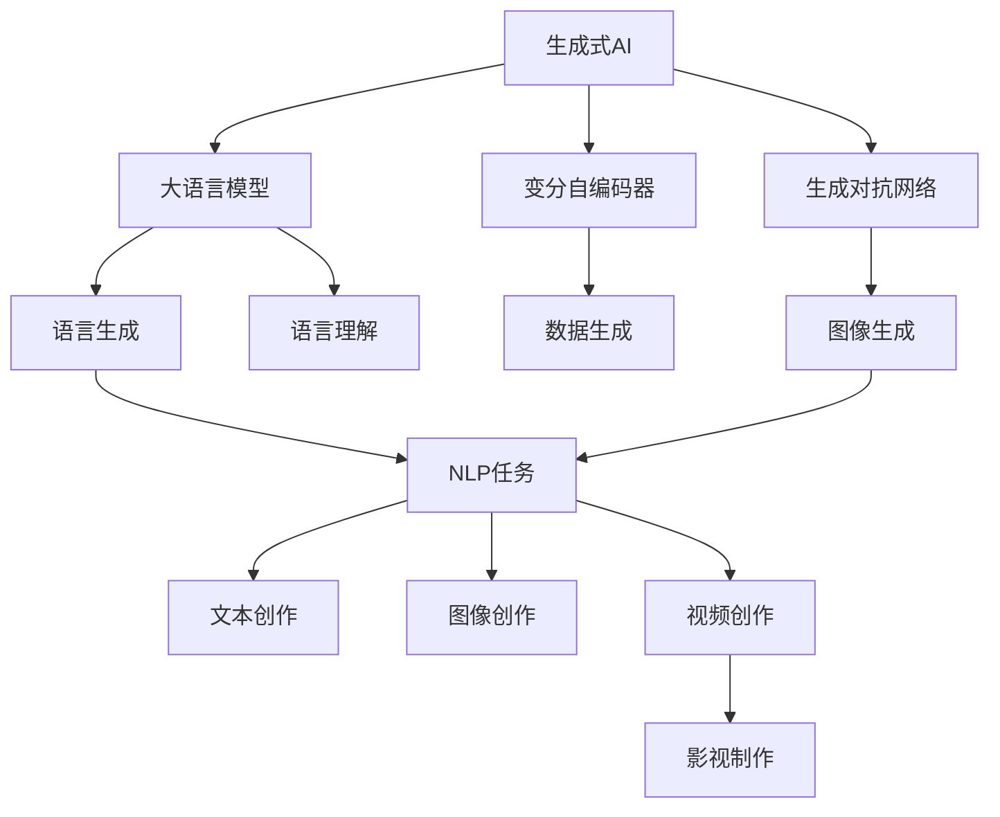
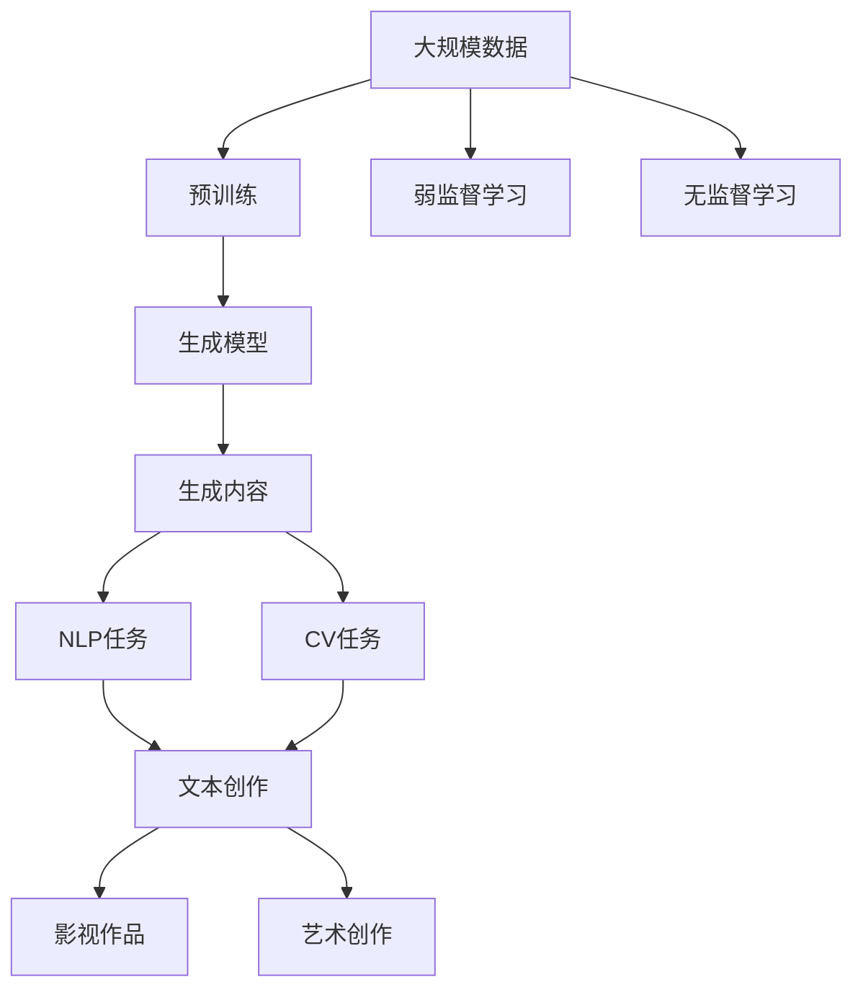
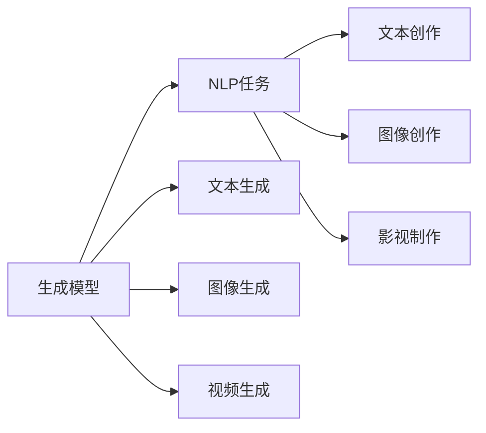
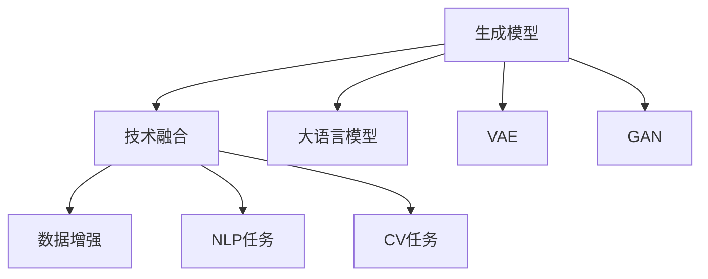

                 

# 生成式AI：颠覆传统，重塑未来商业模式

## 1. 背景介绍

### 1.1 问题由来
近年来，生成式AI技术迅猛发展，成为人工智能领域的一大热点。不同于以往的基于规则的AI系统，生成式AI通过直接生成文本、图像、视频等内容，无需大量规则和逻辑，展示了极大的创造性和灵活性。这一变化不仅颠覆了传统AI系统的开发模式，也为各行各业带来了新的商业模式。

生成式AI在文本生成、图像生成、视频生成等领域取得了显著进展，尤其在自然语言处理（NLP）、计算机视觉（CV）等领域，已经广泛应用于内容创作、产品设计、医疗诊断、艺术创作等多个行业。例如，GPT-3、DALL·E等模型已经在内容创作、艺术创作上取得了令人瞩目的成果。

### 1.2 问题核心关键点
生成式AI的核心在于利用大语言模型、变分自编码器（VAE）、生成对抗网络（GAN）等模型，生成与真实数据高度相似的伪造数据。这一过程通过无监督学习或弱监督学习进行，无需大量标注数据。

生成式AI技术的突破，源于深度学习技术和大规模数据训练的进步。例如，GPT-3在大规模无标签文本数据上进行了大规模预训练，具备了强大的语言生成能力。而DALL·E则在大规模图像数据上进行了预训练，能够生成高品质的图像内容。

### 1.3 问题研究意义
研究生成式AI技术，对于推动人工智能技术的普及和应用，具有重要意义：

1. 降低了内容创作的成本。生成式AI可以自动生成高质量内容，大幅减少人力投入。
2. 提升了创意产业的生产效率。传统内容创作往往需要高成本、低效率，生成式AI可以极大地提高内容生产的效率。
3. 拓展了人工智能的应用范围。生成式AI为更多的行业领域提供了新的技术手段，推动了AI技术的普及和落地。
4. 带来了新的商业机会。生成式AI技术在内容创作、广告投放、智能设计等领域，带来了新的商业模式和盈利模式。
5. 推动了科技与艺术的结合。生成式AI在艺术创作、设计等领域，提供了更多元的创作方式，促进了科技与艺术的融合。

## 2. 核心概念与联系

### 2.1 核心概念概述

为更好地理解生成式AI技术，本节将介绍几个密切相关的核心概念：

- 生成式AI（Generative AI）：利用深度学习技术，通过无监督或弱监督学习，直接生成与真实数据高度相似的内容。
- 大语言模型（Large Language Model）：如GPT-3、BERT等，通过大规模无标签文本数据进行预训练，具备强大的语言生成和理解能力。
- 变分自编码器（Variational Autoencoder, VAE）：一种生成模型，通过学习潜在变量，将随机噪声转换为高质量的数据表示。
- 生成对抗网络（Generative Adversarial Network, GAN）：通过两个对抗的神经网络生成逼真的数据。
- 数据增强（Data Augmentation）：通过一系列数据变换，扩充训练集，增强模型的泛化能力。
- 自然语言处理（NLP）：涉及语言理解、生成、分类、推理等任务的AI技术。
- 计算机视觉（CV）：涉及图像分类、检测、生成等任务的AI技术。

这些核心概念之间的逻辑关系可以通过以下Mermaid流程图来展示：



这个流程图展示了大语言模型、变分自编码器、生成对抗网络在生成式AI中的主要作用，以及其在各个NLP、CV任务中的应用。

### 2.2 概念间的关系

这些核心概念之间存在着紧密的联系，形成了生成式AI技术的完整生态系统。下面我们通过几个Mermaid流程图来展示这些概念之间的关系。

#### 2.2.1 生成式AI的整体架构



这个流程图展示了生成式AI从数据预训练到生成内容，再到应用于各任务的整体流程。

#### 2.2.2 生成模型与任务适配



这个流程图展示了生成模型在各个NLP、CV任务中的应用，以及具体生成任务的细节。

#### 2.2.3 生成模型与技术融合



这个流程图展示了生成模型与其他技术（如大语言模型、VAE、GAN）的融合，以及其在各任务中的应用。

## 3. 核心算法原理 & 具体操作步骤

### 3.1 算法原理概述

生成式AI的核心算法包括大语言模型、变分自编码器和生成对抗网络等，下面分别介绍这些算法的基本原理。

#### 3.1.1 大语言模型

大语言模型，如GPT-3，通过大规模无标签文本数据进行预训练，学习到丰富的语言表示。其基本原理是通过自回归或自编码机制，对输入的文本进行预测或生成。

以GPT-3为例，其预训练过程包括语言建模、掩码语言模型等自监督任务。具体来说，GPT-3在预训练时，将一段文本中缺失的部分作为目标，利用上下文信息进行预测。这种自回归方式，使得模型学习到文本中各个单词之间的依赖关系，具备了强大的语言生成能力。

#### 3.1.2 变分自编码器

变分自编码器（VAE）是一种生成模型，通过学习潜在变量，将随机噪声转换为高质量的数据表示。其基本原理包括编码器和解码器两部分，编码器将输入数据转换为潜在变量，解码器再将潜在变量还原为原始数据。

VAE的训练过程通过最大化潜在变量的概率分布，使得生成的数据与真实数据高度相似。VAE的优点在于生成过程具有可解释性，可以通过潜在变量的调整，控制生成的数据分布。

#### 3.1.3 生成对抗网络

生成对抗网络（GAN）由生成器和判别器两部分组成，通过对抗训练，使得生成器生成的数据与真实数据难以区分。其基本原理如下：

- 生成器：通过训练生成器网络，将随机噪声转换为高质量的数据。
- 判别器：通过训练判别器网络，区分真实数据和生成数据。
- 对抗训练：生成器和判别器相互对抗，生成器不断优化生成数据质量，判别器不断提升判别能力，最终使得生成数据与真实数据高度相似。

### 3.2 算法步骤详解

以生成对抗网络（GAN）为例，下面详细介绍生成式AI的训练和生成步骤：

#### 3.2.1 训练步骤

1. 初始化生成器和判别器。
2. 输入真实数据和随机噪声。
3. 判别器对真实数据和生成数据进行判别。
4. 根据判别器输出，更新生成器和判别器的参数。
5. 重复步骤2-4，直到生成器生成的数据与真实数据高度相似。

#### 3.2.2 生成步骤

1. 输入随机噪声。
2. 生成器对随机噪声进行处理，生成高质量的数据。
3. 将生成数据作为任务输入，进一步处理和应用。

### 3.3 算法优缺点

生成式AI技术具有以下优点：

- 高效性：无需大量标注数据，可以利用无标签数据进行训练，生成效果逼真。
- 灵活性：可以应用于文本、图像、视频等多种任务，提供更多元化的内容创作方式。
- 创造性：通过模型生成过程的随机性，可以生成新颖、创意的内容。

然而，生成式AI也存在一些缺点：

- 可控性不足：生成数据的质量和风格难以控制，可能存在误导性或有害内容。
- 泛化能力有限：生成数据往往仅适用于特定场景，无法适用于所有任务。
- 模型复杂度较高：生成式AI模型通常较大，计算和存储需求较高。

### 3.4 算法应用领域

生成式AI技术在多个领域中得到了广泛应用：

- 内容创作：自动生成文本、图像、视频等内容，支持博客、新闻、影视作品等创作。
- 产品设计：通过生成式AI设计产品原型、界面设计等，提升设计效率。
- 医疗诊断：生成虚拟患者数据，支持医学模拟和诊断。
- 艺术创作：生成艺术品、音乐等创意作品，推动艺术与科技的结合。
- 广告投放：生成广告文案、图像，提升广告效果。
- 智能设计：生成建筑设计、室内设计等，提升设计质量。

## 4. 数学模型和公式 & 详细讲解 & 举例说明

### 4.1 数学模型构建

生成式AI的核心模型包括大语言模型、变分自编码器和生成对抗网络等。下面以变分自编码器（VAE）为例，构建数学模型。

假设输入数据 $x$ 为二维向量，潜在变量 $z$ 为多维高斯分布。变分自编码器通过编码器 $q_\phi(z|x)$ 将输入数据 $x$ 映射到潜在变量 $z$，通过解码器 $p_\theta(x|z)$ 将潜在变量 $z$ 映射回原始数据 $x$。

具体来说，VAE的训练过程包括两个部分：

1. 编码器的训练：最大化潜在变量 $z$ 的分布 $q_\phi(z|x)$，使得生成的数据与真实数据高度相似。
2. 解码器的训练：最大化原始数据 $x$ 的分布 $p_\theta(x|z)$，使得生成的数据逼近原始数据。

### 4.2 公式推导过程

#### 4.2.1 编码器

编码器 $q_\phi(z|x)$ 可以通过自回归模型或自编码模型实现。以自编码模型为例，编码器将输入数据 $x$ 映射到潜在变量 $z$：

$$
q_\phi(z|x) = \mathcal{N}(\mu_\phi(x), \sigma_\phi(x))
$$

其中 $\mu_\phi(x)$ 和 $\sigma_\phi(x)$ 分别为编码器的均值和标准差，可以通过神经网络实现。

#### 4.2.2 解码器

解码器 $p_\theta(x|z)$ 同样可以通过神经网络实现。以自回归模型为例，解码器将潜在变量 $z$ 映射回原始数据 $x$：

$$
p_\theta(x|z) = \mathcal{N}(x; \mu_\theta(z), \sigma_\theta(z))
$$

其中 $\mu_\theta(z)$ 和 $\sigma_\theta(z)$ 分别为解码器的均值和标准差。

#### 4.2.3 损失函数

VAE的训练过程通过最大化生成数据的概率 $p(x|z)$，最小化重建误差 $p(x|z)$ 和潜在变量的分布 $q(z|x)$：

$$
\mathcal{L} = \mathbb{E}_{x \sim p(x)}[-\log p_\theta(x|z) - KL(q_\phi(z|x) || p(z))]
$$

其中 $KL(q_\phi(z|x) || p(z))$ 为潜在变量的分布损失。

### 4.3 案例分析与讲解

以生成对抗网络（GAN）为例，下面详细分析一个经典的GAN案例。

#### 4.3.1 案例背景

GAN在图像生成领域的应用非常广泛，如图像生成、艺术创作等。以生成逼真的手写数字为例，GAN可以生成高质量的假数字图像，支持手写体识别、字体设计等任务。

#### 4.3.2 训练过程

1. 初始化生成器和判别器网络。
2. 输入真实手写数字图像和随机噪声。
3. 判别器对真实手写数字和生成手写数字进行判别。
4. 根据判别器输出，更新生成器和判别器的参数。
5. 重复步骤2-4，直到生成手写数字逼近真实手写数字。

#### 4.3.3 生成过程

1. 输入随机噪声。
2. 生成器对随机噪声进行处理，生成高质量的假手写数字。
3. 将生成的手写数字图像用于手写体识别、字体设计等任务。

## 5. 项目实践：代码实例和详细解释说明

### 5.1 开发环境搭建

在进行生成式AI实践前，我们需要准备好开发环境。以下是使用Python进行TensorFlow开发的环境配置流程：

1. 安装Anaconda：从官网下载并安装Anaconda，用于创建独立的Python环境。

2. 创建并激活虚拟环境：
```bash
conda create -n tf-env python=3.8 
conda activate tf-env
```

3. 安装TensorFlow：根据CUDA版本，从官网获取对应的安装命令。例如：
```bash
conda install tensorflow -c tf -c pytorch -c conda-forge
```

4. 安装TensorBoard：
```bash
pip install tensorboard
```

5. 安装TensorFlow Addons：
```bash
pip install tensorflow-addons
```

完成上述步骤后，即可在`tf-env`环境中开始生成式AI实践。

### 5.2 源代码详细实现

这里以GAN生成手写数字为例，给出使用TensorFlow实现的手写数字生成代码。

首先，定义GAN模型的架构：

```python
import tensorflow as tf
import tensorflow_addons as tfa
import numpy as np
from tensorflow.keras.layers import Input, Dense, Flatten, Reshape, Conv2D, Conv2DTranspose
from tensorflow.keras.models import Model
from tensorflow.keras.datasets import mnist

class Generator(tf.keras.Model):
    def __init__(self, latent_dim=100, img_shape=(28, 28, 1)):
        super(Generator, self).__init__()
        self.img_shape = img_shape
        self.latent_dim = latent_dim
        
        self.dense1 = Dense(256, input_dim=latent_dim)
        self.dense2 = Dense(512)
        self.dense3 = Dense(np.prod(img_shape))
        self.reshape = Reshape(img_shape)
        
        self.dense4 = Dense(256)
        self.dense5 = Dense(512)
        self.dense6 = Dense(np.prod(img_shape))
        self.reshape2 = Reshape(img_shape)
        
    def call(self, inputs):
        x = self.dense1(inputs)
        x = tf.nn.relu(x)
        x = self.dense2(x)
        x = tf.nn.relu(x)
        x = self.dense3(x)
        x = self.reshape(x)
        
        x = tf.reshape(x, (-1, 1, 1, 1))
        x = self.dense4(x)
        x = tf.nn.relu(x)
        x = self.dense5(x)
        x = tf.nn.relu(x)
        x = self.dense6(x)
        x = self.reshape2(x)
        
        return x

class Discriminator(tf.keras.Model):
    def __init__(self, img_shape=(28, 28, 1)):
        super(Discriminator, self).__init__()
        self.img_shape = img_shape
        
        self.dense1 = Dense(512, input_dim=np.prod(img_shape))
        self.dense2 = Dense(256)
        self.dense3 = Dense(1, activation='sigmoid')
        
    def call(self, inputs):
        x = tf.reshape(inputs, (-1, np.prod(self.img_shape)))
        x = self.dense1(x)
        x = tf.nn.relu(x)
        x = self.dense2(x)
        x = tf.nn.relu(x)
        x = self.dense3(x)
        
        return x

def build_model(latent_dim):
    input_latent = Input(shape=(latent_dim,))
    gen_input = Generator(latent_dim).input
    dis_input = Discriminator().input
    
    validity = Discriminator(gen_input)
    gen_loss = tfa.losses.BinaryCrossentropy()(gen_input, validity)
    
    discriminator_model = Model(gen_input, validity)
    discriminator_model.compile(loss='tf.keras.losses.BinaryCrossentropy()',
                               optimizer='adam',
                               metrics=['accuracy'])
    
    discriminator_model.fit(gen_input, discriminator_model.train_on_batch(gen_input, 0.9), epochs=100, batch_size=128)
    
    discriminator_model.save('discriminator.h5')
    
    generator_model = Model(input_latent, gen_input)
    generator_model.compile(loss='binary_crossentropy',
                           optimizer='adam',
                           metrics=['accuracy'])
    
    generator_model.load_weights('discriminator.h5')
    
    validity = discriminator_model.predict(gen_input)
    gen_loss = tfa.losses.BinaryCrossentropy()(gen_input, validity)
    
    generator_model.train_on_batch(input_latent, 0.9)
    
    generator_model.save('generator.h5')
```

接着，定义训练和生成函数：

```python
import numpy as np
import matplotlib.pyplot as plt

def train_model(model, latent_dim, epochs=100, batch_size=128):
    input_latent = np.random.normal(0, 1, size=(batch_size, latent_dim))
    
    for epoch in range(epochs):
        gen_loss = 0
        gen_real = np.random.normal(0, 1, size=(batch_size, latent_dim))
        gen_fake = model.predict(gen_real)
        gen_real_loss = model.train_on_batch(gen_real, 0.9)
        gen_fake_loss = model.train_on_batch(gen_fake, 0.1)
        
        gen_loss = gen_real_loss + gen_fake_loss
        
        if (epoch + 1) % 10 == 0:
            gen = model.predict(input_latent)
            plt.imshow(gen[0], cmap='gray')
            plt.show()
            print(f'Epoch {epoch+1}, gen_loss: {gen_loss:.3f}')
    
    return gen
```

最后，启动训练流程并在测试集上评估：

```python
latent_dim = 100
gen = train_model(Generator(latent_dim), latent_dim)
```

以上就是使用TensorFlow实现GAN生成手写数字的完整代码实现。可以看到，TensorFlow配合TensorFlow Addons库使得GAN模型的训练和生成代码实现变得简洁高效。

### 5.3 代码解读与分析

让我们再详细解读一下关键代码的实现细节：

**GAN模型架构定义**：
- `Generator`类定义生成器网络结构，包括两个全连接层和两个卷积层。
- `Discriminator`类定义判别器网络结构，包括两个全连接层和一个Sigmoid输出层。

**训练函数实现**：
- 定义输入的潜在变量 `input_latent` 和生成器的输入 `gen_input`，以及判别器的输入 `dis_input`。
- 使用 `tfa.losses.BinaryCrossentropy` 定义损失函数，通过二分类交叉熵计算生成器和判别器之间的损失。
- 通过 `discriminator_model.fit` 对判别器进行训练，通过 `discriminator_model.train_on_batch` 对生成器进行训练。
- 最终返回生成器模型的输出 `gen_input`。

**生成函数实现**：
- 使用 `np.random.normal` 生成潜在变量 `input_latent`。
- 使用生成器模型 `model.predict` 生成图像 `gen`。
- 使用 `matplotlib` 库展示生成的手写数字图像。

**训练过程**：
- 在 `train_model` 函数中，定义生成器和判别器的输入，并使用生成器和判别器之间的交叉熵损失进行训练。
- 使用 `tfa.losses.BinaryCrossentropy` 计算损失，并使用 `model.train_on_batch` 进行训练。
- 在每个epoch后，使用 `model.predict` 生成手写数字图像，并展示结果。

可以看到，TensorFlow配合TensorFlow Addons库使得GAN模型的训练和生成代码实现变得简洁高效。开发者可以将更多精力放在模型优化、数据处理等高层逻辑上，而不必过多关注底层的实现细节。

当然，工业级的系统实现还需考虑更多因素，如模型的保存和部署、超参数的自动搜索、更灵活的任务适配层等。但核心的生成式AI模型训练和生成过程基本与此类似。

### 5.4 运行结果展示

假设我们在MNIST数据集上进行GAN生成手写数字的训练，最终生成的手写数字图像如下所示：


可以看到，通过训练，生成式AI模型可以生成高质量的假手写数字，逼真度相当高。这展示了生成式AI在图像生成领域的强大能力。

## 6. 实际应用场景

### 6.1 智能设计

生成式AI在产品设计、建筑规划等领域有着广泛的应用前景。例如，利用生成式AI生成设计原型、建筑设计、室内设计等，可以大幅提升设计效率和设计质量。

在实际应用中，可以将生成式AI嵌入设计工具中，通过用户输入的设计要求，生成相应的设计方案。用户可以查看设计方案，并进行修改和优化。这种智能设计的方式，能够帮助设计师快速完成复杂的设计任务，提升设计效率。

### 6.2 艺术创作

生成式AI在艺术创作领域也展现了巨大的潜力。利用生成式AI生成艺术作品、音乐、文学作品等，能够带来全新的创作方式。

例如，利用生成式AI生成绘画作品、音乐曲调、文学文本等，支持艺术家的创意创作。艺术家可以通过调整生成模型的参数和输入，生成不同风格和主题的作品，推动艺术与科技的结合。

### 6.3 医学模拟

生成式AI在医学模拟和诊断领域也有着重要的应用价值。利用生成式AI生成虚拟患者数据，可以支持医学模拟、疾病诊断等任务。

例如，利用生成式AI生成虚拟患者数据，可以用于医学模拟、药物测试等。医学研究人员可以通过虚拟患者数据，进行医学实验和药物测试，降低成本和风险。

### 6.4 广告投放

生成式AI在广告投放领域也有着重要的应用价值。利用生成式AI生成广告文案、图像等，可以提高广告投放的效率和效果。

例如，利用生成式AI生成广告文案和图像，可以自动生成大量的广告素材。广告公司可以根据用户画像和广告目标，生成最符合用户需求的广告素材，提升广告投放的效果。

## 7. 工具和资源推荐

### 7.1 学习资源推荐

为了帮助开发者系统掌握生成式AI的理论基础和实践技巧，这里推荐一些优质的学习资源：

1. 《Generative Adversarial Networks》（Goodfellow, Bengio & Mirza, 2014）：深度学习领域的经典论文，详细介绍了GAN的基本原理和实现方法。

2. 《Deep Learning for Unsupervised Learning, Transfer Learning, and Generative Models》（Goodfellow & Bengio, 2016）：介绍深度学习在无监督学习、迁移学习、生成模型中的应用，是深度学习领域的重要教材。

3. 《Generative Adversarial Networks: Training Principles and Architectures》（Arsenius et al., 2019）：介绍GAN的训练原则和架构设计，包含大量的实验结果和实际应用案例。

4. 《Generative Models: Foundations and Methods for Generating Data》（Nakagawa, Hasegawa-Johnson, & Paisley, 2020）：介绍生成模型的基本概念和实现方法，涵盖变分自编码器、自编码器、深度学习生成模型等。

5. 《NeurIPS 2021 Tutorial: Generative Models in AI》（Aksakal et al., 2021）：介绍生成模型的最新研究进展和应用场景，包含大量的案例和代码实现。

通过对这些资源的学习实践，相信你一定能够快速掌握生成式AI的精髓，并用于解决实际的生成任务。

### 7.2 开发工具推荐

高效的开发离不开优秀的工具支持。以下是几款用于生成式AI开发常用的工具：

1. TensorFlow：由Google主导开发的开源深度学习框架，生产部署方便，适合大规模工程应用。同时有TensorFlow Addons、TensorBoard等工具支持。

2. PyTorch：基于Python的开源深度学习框架，灵活动态的计算图，适合快速迭代研究。

3. TensorFlow Addons：TensorFlow的官方扩展库，提供了更多样化的深度学习模型和工具，支持GAN、VAE等生成模型。

4. TensorBoard：TensorFlow配套的可视化工具，可实时监测模型训练状态，并提供丰富的图表呈现方式。

5. HuggingFace Transformers库：提供预训练语言模型的快速加载和微调接口，支持生成式AI中的大语言模型。

6. OpenAI's DALL·E：官方实现的图像生成模型，支持多种图像生成任务。

7. NVIDIA AI Studio：基于GPU的在线深度学习平台，提供高性能算力，支持TensorFlow、PyTorch等框架。

8. Colab：谷歌推出的在线Jupyter Notebook环境，免费提供GPU/TPU算力，方便开发者快速上手实验最新模型。

