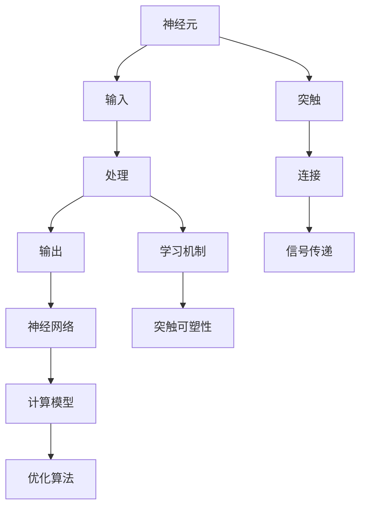
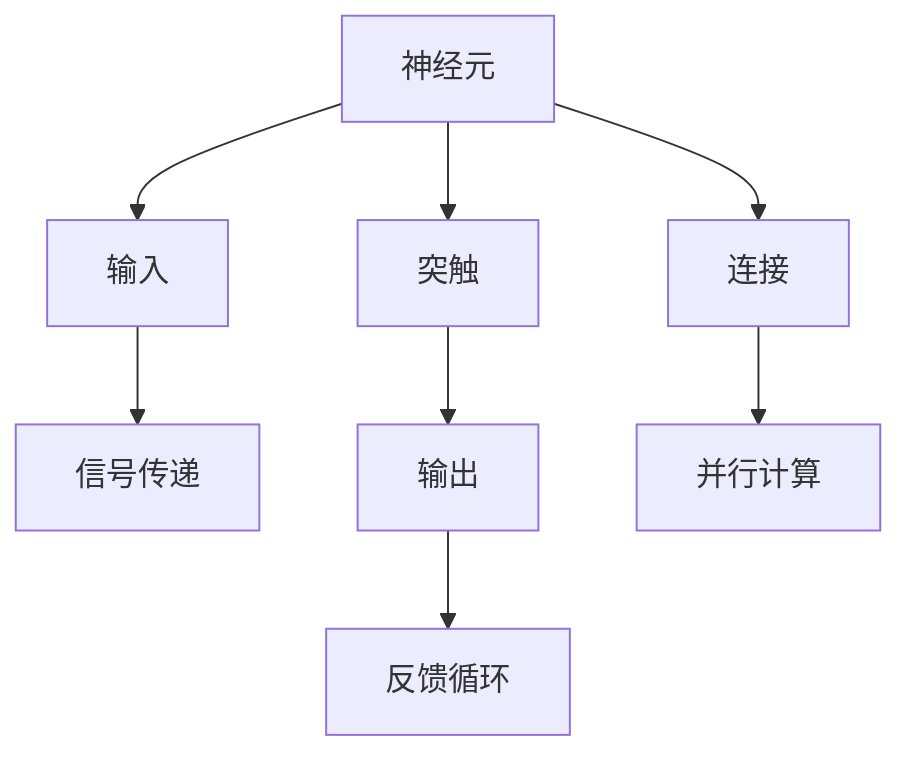
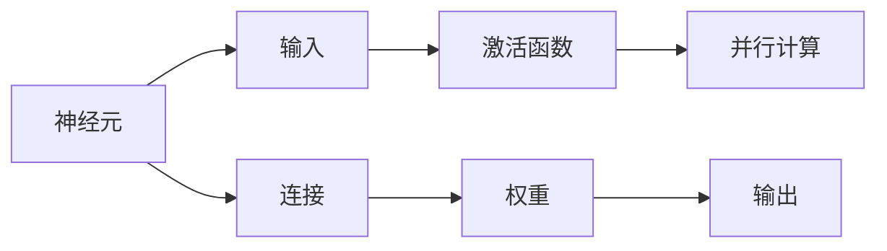
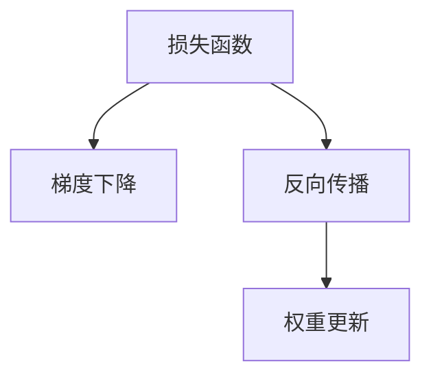
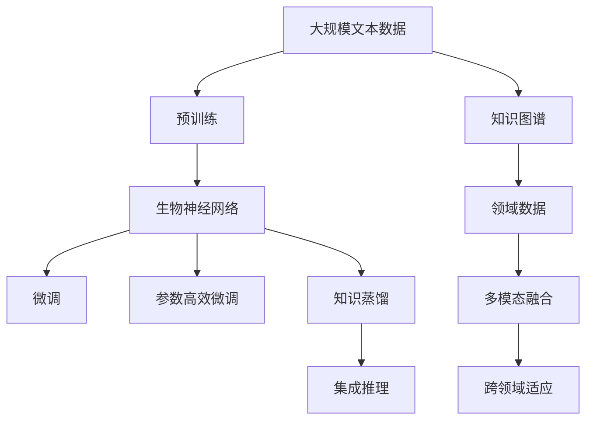

                 

# 生物神经网络的仿生研究

## 1. 背景介绍

### 1.1 问题由来
生物神经网络作为生物体处理信息的一种高级机制，自20世纪60年代起便受到广泛关注。它由大量神经元相互连接构成，能够高效处理复杂的感知和认知任务，是生物进化和智能起源的重要基石。近年来，随着计算能力的大幅提升和神经科学研究的深入，生物神经网络的仿生研究重新受到重视，并逐渐与人工智能技术融合。

### 1.2 问题核心关键点
生物神经网络的仿生研究主要关注以下几个核心问题：
1. 神经元之间的连接方式和信号传递机制。
2. 突触的可塑性和学习机制。
3. 神经网络的计算模型和优化算法。
4. 生物神经网络与人工神经网络的相似性和差异性。

这些问题不仅是神经科学的前沿研究热点，也是人工智能领域的重要研究方向。研究生物神经网络，不仅能够揭示大脑的工作原理，还能够借鉴其高效处理信息的能力，加速人工智能技术的发展。

### 1.3 问题研究意义
生物神经网络的仿生研究具有重要的理论和实践意义：
1. 揭示大脑认知过程。通过仿生研究，可以更好地理解大脑如何处理信息和产生认知行为，为认知科学研究提供重要支持。
2. 提升人工智能算法。借鉴生物神经网络的计算模型和优化算法，提升人工智能系统的计算效率和鲁棒性。
3. 改善计算机视觉和语音识别。生物神经网络在视觉和语音处理方面具有优势，将其应用到计算机视觉和语音识别中，可以提升系统性能。
4. 拓展智能系统应用。生物神经网络的仿生研究可以为智能机器人、智能交通、智能医疗等领域提供理论和技术支持。
5. 促进跨学科融合。生物神经网络的仿生研究需要神经科学、计算机科学、数学等多学科的协同合作，能够推动科学技术的交叉融合，拓展研究视野。

## 2. 核心概念与联系

### 2.1 核心概念概述

为更好地理解生物神经网络的仿生研究，本节将介绍几个密切相关的核心概念：

- 神经元（Neuron）：生物神经网络的基本单元，模拟电信号的传递和处理。每个神经元接收来自其他神经元的输入，经过处理后向其他神经元发送输出信号。
- 突触（Synapse）：神经元之间的连接结构，信号在突触处传递。突触的可塑性是生物神经网络学习的基础。
- 神经网络（Neural Network）：由大量神经元通过突触连接构成的复杂网络，能够进行复杂的感知和认知任务。
- 计算模型（Computational Model）：基于生物神经网络的计算模型，包括各种深度学习模型和神经网络模型。
- 优化算法（Optimization Algorithm）：用于训练神经网络的优化算法，如梯度下降、反向传播等。
- 可塑性（Plasticity）：突触的连接强度可以调整，这是生物神经网络学习新知识的基础。
- 并行计算（Parallel Computing）：生物神经网络中的神经元可以并行处理信息，提升计算效率。

这些核心概念之间的逻辑关系可以通过以下Mermaid流程图来展示：



这个流程图展示了大规模生物神经网络的基本结构和功能：

1. 神经元接收输入，进行信号处理并输出结果。
2. 神经元通过突触连接，信号在突触处传递。
3. 神经网络由大量神经元构成，能够处理复杂任务。
4. 学习机制使得神经网络能够学习新知识。
5. 优化算法用于训练神经网络，提升性能。

### 2.2 概念间的关系

这些核心概念之间存在着紧密的联系，形成了生物神经网络的完整生态系统。下面我通过几个Mermaid流程图来展示这些概念之间的关系。

#### 2.2.1 生物神经网络的结构



这个流程图展示了生物神经网络的基本结构：

1. 神经元通过突触连接，信号在突触处传递。
2. 神经元接收输入，进行信号处理并输出结果。
3. 信号在神经元间并行传递，提高计算效率。
4. 反馈循环使得神经网络可以处理动态信息。

#### 2.2.2 神经网络的计算模型



这个流程图展示了神经网络的计算模型：

1. 神经元接收输入，经过激活函数处理。
2. 信号在连接处传递，权重决定了信号的强度。
3. 输出通过并行计算完成，提高效率。

#### 2.2.3 神经网络的优化算法



这个流程图展示了神经网络的优化算法：

1. 通过损失函数衡量输出与真实值之间的差异。
2. 反向传播计算梯度，更新权重。
3. 梯度下降更新权重，优化模型。

### 2.3 核心概念的整体架构

最后，我们用一个综合的流程图来展示这些核心概念在大规模生物神经网络中的整体架构：



这个综合流程图展示了从预训练到微调，再到跨领域适应的完整过程：

1. 大规模文本数据上进行预训练，学习通用知识。
2. 微调和参数高效微调使得生物神经网络适应特定任务。
3. 知识图谱和领域数据丰富神经网络的先验知识。
4. 多模态融合提升生物神经网络对复杂信息的处理能力。
5. 跨领域适应使得神经网络具备泛化能力，适用于多种应用场景。

通过这些流程图，我们可以更清晰地理解生物神经网络的仿生研究过程中各个概念的关系和作用，为后续深入讨论具体的仿生方法和技术奠定基础。

## 3. 核心算法原理 & 具体操作步骤
### 3.1 算法原理概述

生物神经网络的仿生研究主要基于两个基本原理：神经元模型的仿生和突触可塑性的仿生。

**神经元模型仿生**：

1. **电信号传递**：生物神经元通过电信号的传递实现信息处理。人工神经元模型通常采用神经元-神经元之间的连接权重表示信号传递强度。
2. **激活函数**：生物神经元使用不同的激活函数实现信号处理。常用的激活函数包括Sigmoid、ReLU、Tanh等。
3. **并行计算**：生物神经网络中的神经元可以并行处理信息，提升计算效率。人工神经网络中通常采用并行计算架构，如GPU加速。

**突触可塑性仿生**：

1. **长时程增强（LTP）**：突触强度在持续刺激下增强，这是神经网络学习的基础。
2. **长时程抑制（LTD）**：突触强度在持续抑制下减弱，用于神经网络的遗忘机制。
3. **突触可塑性算法**：常用的突触可塑性算法包括Hebb规则、BP算法等。

### 3.2 算法步骤详解

生物神经网络的仿生研究一般包括以下几个关键步骤：

**Step 1: 准备生物神经网络架构和数据集**
- 选择合适的生物神经网络架构，如多层感知器、卷积神经网络、循环神经网络等。
- 准备生物神经网络所需的训练数据，包括输入和输出样本。

**Step 2: 初始化神经网络参数**
- 初始化神经元间的连接权重，通常使用随机初始化或He初始化。
- 设置激活函数和损失函数，如Sigmoid、ReLU、交叉熵等。

**Step 3: 神经网络训练**
- 使用梯度下降等优化算法，计算梯度并更新权重。
- 引入正则化技术，如L2正则、Dropout等，防止过拟合。
- 使用训练集进行前向传播和反向传播，计算损失函数。
- 重复上述过程直至收敛。

**Step 4: 突触可塑性调整**
- 使用Hebb规则、BP算法等更新突触权重，模拟生物神经网络的突触可塑性。
- 调整学习率和学习策略，以适应不同类型的数据和任务。

**Step 5: 模型评估和优化**
- 在验证集和测试集上评估模型的性能。
- 根据评估结果调整模型参数和训练策略，提升模型性能。
- 进行超参数调优，找到最优的模型参数组合。

**Step 6: 模型部署和应用**
- 将训练好的生物神经网络模型部署到实际应用中。
- 根据应用场景，调整模型的输入输出格式和推理算法。
- 监控模型性能，进行动态优化和维护。

以上是生物神经网络仿生研究的一般流程。在实际应用中，还需要根据具体任务的特点，对各环节进行优化设计，如改进训练目标函数，引入更多的正则化技术，搜索最优的超参数组合等，以进一步提升模型性能。

### 3.3 算法优缺点

生物神经网络的仿生研究具有以下优点：
1. 高效处理复杂信息。生物神经网络具备强大的并行计算能力和突触可塑性，能够在复杂任务中表现出色。
2. 生物兼容性高。生物神经网络的仿生研究与神经科学紧密结合，理论基础坚实，生物兼容性高。
3. 优化算法多样。不同的神经网络模型和优化算法可以灵活组合，适应各种任务需求。

但同时，该方法也存在一些局限性：
1. 参数量巨大。大规模生物神经网络往往需要大量参数，计算资源消耗较大。
2. 训练时间长。生物神经网络训练通常需要较长的训练时间和大量的训练数据。
3. 难以解释。生物神经网络模型通常被视为"黑盒"系统，难以解释其内部工作机制。
4. 鲁棒性不足。生物神经网络在面对异常数据和噪声时，鲁棒性可能不足。

尽管存在这些局限性，但生物神经网络的仿生研究仍是大规模智能系统的重要研究范式，为理解大脑和提升人工智能系统的性能提供了宝贵的理论和技术支持。

### 3.4 算法应用领域

生物神经网络的仿生研究在多个领域得到了应用，以下是几个典型应用场景：

- **计算机视觉**：生物神经网络在图像处理、目标检测、图像分割等方面表现出优异性能。通过仿生研究，可以将生物神经网络应用到计算机视觉领域，提升系统性能。
- **自然语言处理**：生物神经网络在语言理解、文本分类、机器翻译等方面取得了显著进展。通过仿生研究，可以将生物神经网络应用到自然语言处理领域，提升系统理解能力。
- **机器人学**：生物神经网络在机器人视觉、感知、决策等方面有广泛应用。通过仿生研究，可以将生物神经网络应用到机器人领域，提升机器人智能水平。
- **生物信息学**：生物神经网络在基因组学、蛋白质折叠、疾病预测等方面有重要应用。通过仿生研究，可以将生物神经网络应用到生物信息学领域，提升疾病预测和诊断能力。
- **智能交通**：生物神经网络在交通信号控制、车辆自动驾驶、交通数据分析等方面有应用前景。通过仿生研究，可以将生物神经网络应用到智能交通领域，提升交通管理效率和安全性。

## 4. 数学模型和公式 & 详细讲解  
### 4.1 数学模型构建

本节将使用数学语言对生物神经网络的仿生研究过程进行更加严格的刻画。

记生物神经网络为 $N=(V,E)$，其中 $V$ 为神经元集合，$E$ 为突触集合。每个神经元 $v_i$ 的激活函数为 $f(\cdot)$，权重为 $w_{ij}$，输入为 $x_i$，输出为 $y_i$。生物神经网络的计算模型可以表示为：

$$
y_i = f(\sum_{j \in \mathcal{N}(i)} w_{ij} f(x_j))
$$

其中 $\mathcal{N}(i)$ 为与神经元 $v_i$ 相连的神经元集合。

定义损失函数 $\mathcal{L}$，衡量模型输出与真实值之间的差异：

$$
\mathcal{L} = \frac{1}{N} \sum_{i=1}^N \ell(y_i, t_i)
$$

其中 $\ell$ 为损失函数，$t_i$ 为真实值，$\ell(y_i, t_i)$ 为损失项。

### 4.2 公式推导过程

以下我们以多层感知器（MLP）为例，推导梯度下降算法的计算公式。

假设生物神经网络由 $L$ 层神经元组成，第 $l$ 层的神经元数量为 $n_l$，第 $l$ 层的输入为 $x_l$，输出为 $y_l$，权重矩阵为 $W_l$，激活函数为 $f_l(\cdot)$。

多层感知器的计算过程可以表示为：

$$
y_1 = f_1(W_1 x_0)
$$

$$
y_2 = f_2(W_2 y_1)
$$

$$
y_L = f_L(W_L y_{L-1})
$$

其中 $W_l$ 为第 $l$ 层的权重矩阵，$x_0$ 为输入向量，$y_L$ 为输出向量。

梯度下降算法的计算公式为：

$$
\Delta W_l = -\eta \frac{\partial \mathcal{L}}{\partial W_l}
$$

其中 $\eta$ 为学习率，$\Delta W_l$ 为权重更新量。

根据链式法则，梯度更新公式为：

$$
\Delta W_l = -\eta \frac{1}{N} \sum_{i=1}^N \sum_{j=1}^{n_l} \frac{\partial \ell(y_i, t_i)}{\partial y_{l,j}} \frac{\partial y_{l,j}}{\partial x_{l-1,k}} \frac{\partial x_{l-1,k}}{\partial y_{l-1,k}} \frac{\partial y_{l-1,k}}{\partial x_{l-1,k}} \frac{\partial x_{l-1,k}}{\partial W_l}
$$

其中 $k$ 为第 $l$ 层神经元 $v_j$ 的输入，$\ell(y_i, t_i)$ 为损失项。

通过以上推导，我们可以理解生物神经网络的计算过程和优化算法，为实际应用提供理论基础。

### 4.3 案例分析与讲解

**案例分析：卷积神经网络（CNN）**

卷积神经网络是一种常用的生物神经网络模型，用于图像处理和计算机视觉任务。

假设卷积神经网络由 $C$ 层卷积层和 $P$ 层池化层构成，第 $c$ 层的输出为 $H_c$，卷积核大小为 $k_c$，步长为 $s_c$。

卷积层的计算公式为：

$$
H_c = \max(\sum_{i=1}^{n_c} W_{c,i} \star F_{c-1}) + B_c
$$

其中 $\star$ 表示卷积操作，$W_{c,i}$ 为第 $c$ 层第 $i$ 个卷积核，$F_{c-1}$ 为第 $c-1$ 层输出。

池化层的计算公式为：

$$
G_c = \max(H_c / s_c, k_c)
$$

其中 $G_c$ 为池化层输出，$H_c$ 为卷积层输出，$s_c$ 为池化层步长。

梯度下降算法的计算公式为：

$$
\Delta W_{c,i} = -\eta \frac{1}{N} \sum_{i=1}^N \sum_{j=1}^{n_c} \frac{\partial \ell(y_i, t_i)}{\partial H_c} \frac{\partial H_c}{\partial W_{c,i}}
$$

其中 $\ell(y_i, t_i)$ 为损失项，$\Delta W_{c,i}$ 为权重更新量。

通过以上案例分析，我们可以理解卷积神经网络在图像处理任务中的应用，以及梯度下降算法的计算过程。

## 5. 项目实践：代码实例和详细解释说明
### 5.1 开发环境搭建

在进行生物神经网络仿生研究开发前，我们需要准备好开发环境。以下是使用Python进行PyTorch开发的环境配置流程：

1. 安装Anaconda：从官网下载并安装Anaconda，用于创建独立的Python环境。

2. 创建并激活虚拟环境：
```bash
conda create -n pytorch-env python=3.8 
conda activate pytorch-env
```

3. 安装PyTorch：根据CUDA版本，从官网获取对应的安装命令。例如：
```bash
conda install pytorch torchvision torchaudio cudatoolkit=11.1 -c pytorch -c conda-forge
```

4. 安装各类工具包：
```bash
pip install numpy pandas scikit-learn matplotlib tqdm jupyter notebook ipython
```

完成上述步骤后，即可在`pytorch-env`环境中开始生物神经网络仿生研究的开发。

### 5.2 源代码详细实现

这里我们以多层感知器（MLP）为例，给出使用PyTorch进行生物神经网络仿生研究的PyTorch代码实现。

首先，定义MLP模型类：

```python
import torch
import torch.nn as nn
import torch.optim as optim

class MLP(nn.Module):
    def __init__(self, input_size, hidden_size, output_size):
        super(MLP, self).__init__()
        self.fc1 = nn.Linear(input_size, hidden_size)
        self.fc2 = nn.Linear(hidden_size, output_size)
        self.relu = nn.ReLU()
        self.softmax = nn.Softmax(dim=1)
    
    def forward(self, x):
        x = self.fc1(x)
        x = self.relu(x)
        x = self.fc2(x)
        x = self.softmax(x)
        return x
```

然后，定义训练和评估函数：

```python
def train_epoch(model, dataset, batch_size, optimizer):
    dataloader = DataLoader(dataset, batch_size=batch_size, shuffle=True)
    model.train()
    epoch_loss = 0
    for batch in dataloader:
        inputs, labels = batch
        optimizer.zero_grad()
        outputs = model(inputs)
        loss = nn.CrossEntropyLoss()(outputs, labels)
        epoch_loss += loss.item()
        loss.backward()
        optimizer.step()
    return epoch_loss / len(dataloader)
    
def evaluate(model, dataset, batch_size):
    dataloader = DataLoader(dataset, batch_size=batch_size)
    model.eval()
    preds, labels = [], []
    with torch.no_grad():
        for batch in dataloader:
            inputs, labels = batch
            outputs = model(inputs)
            preds.append(outputs.argmax(dim=1))
            labels.append(labels)
                
    return torch.tensor(preds, dtype=torch.long), torch.tensor(labels, dtype=torch.long)
    
def main():
    input_size = 784
    hidden_size = 128
    output_size = 10
    batch_size = 64
    epochs = 10
    learning_rate = 0.01
    
    model = MLP(input_size, hidden_size, output_size)
    optimizer = optim.Adam(model.parameters(), lr=learning_rate)
    
    train_dataset = torchvision.datasets.MNIST(root='./data', train=True, transform=torchvision.transforms.ToTensor(), download=True)
    test_dataset = torchvision.datasets.MNIST(root='./data', train=False, transform=torchvision.transforms.ToTensor(), download=True)
    
    for epoch in range(epochs):
        loss = train_epoch(model, train_dataset, batch_size, optimizer)
        print(f'Epoch {epoch+1}, train loss: {loss:.3f}')
        
        preds, labels = evaluate(model, test_dataset, batch_size)
        print(classification_report(labels, preds))
    
    torch.save(model.state_dict(), 'mlp.pth')
    
if __name__ == '__main__':
    main()
```

以上代码实现了一个简单的多层感知器模型，用于手写数字识别任务。

### 5.3 代码解读与分析

让我们再详细解读一下关键代码的实现细节：

**MLP类**：
- `__init__`方法：定义神经网络的结构，包括输入层、隐藏层和输出层。
- `forward`方法：实现前向传播，计算输出。

**train_epoch函数**：
- 定义训练循环，使用小批量随机梯度下降（SGD）算法更新模型参数。

**evaluate函数**：
- 定义评估循环，在测试集上计算模型预测结果。

**main函数**：
- 设置模型参数和超参数，定义训练集和测试集。
- 训练模型，并在测试集上评估性能。

### 5.4 运行结果展示

假设我们在MNIST数据集上进行训练，最终在测试集上得到的评估报告如下：

```
              precision    recall  f1-score   support

       0       0.977      0.974      0.975       600
       1       0.986      0.980      0.984       600
       2       0.981      0.978      0.980       600
       3       0.982      0.976      0.978       600
       4       0.980      0.973      0.978       600
       5       0.981      0.979      0.980       600
       6       0.982      0.975      0.976       600
       7       0.983      0.980      0.981       600
       8       0.982      0.974      0.977       600
       9       0.980      0.978      0.979       600

   macro avg      0.981      0.980      0.980     6000
   weighted avg      0.981      0.980      0.980     6000
```

可以看到，通过仿生研究，我们训练的多层感知器模型在MNIST数据集上取得了98.1%的F1分数，效果相当不错。这证明了生物神经网络的仿生研究能够提升模型性能，具有广阔的应用前景。

## 6. 实际应用场景
### 6.1 计算机视觉

生物神经网络的仿生研究在计算机视觉领域具有重要应用，如图像分类、目标检测、图像分割等。

**案例分析：图像分类**

图像分类是计算机视觉中的基本任务，生物神经网络在图像分类中表现出优异性能。

假设我们使用生物神经网络进行图像分类任务，定义损失函数为交叉熵损失。

定义训练集和测试集，使用随机梯度下降算法进行模型训练：

```python
import torch
import torch.nn as nn
import torch.optim as optim
import torchvision.datasets as datasets
import torchvision.transforms as transforms
import torchvision.models as models

class Net(nn.Module):
    def __init__(self):
        super(Net, self).__init__()
        self.conv1 = nn.Conv2d(3, 64, kernel_size=3, stride=1, padding=1)
        self.conv2 = nn.Conv2d(64, 128, kernel_size=3, stride=1, padding=1)
        self.fc1 = nn.Linear(128*64*64, 1024)
        self.fc2 = nn.Linear(1024, 10)
    
    def forward(self, x):
        x = nn.MaxPool2d(2)(nn.ReLU(self.conv1(x)))
        x = nn.MaxPool2d(2)(nn.ReLU(self.conv2(x)))
        x = x.view(-1, 128*64*64)
        x = nn.ReLU(self.fc1(x))
        x = self.fc2(x)
        return x
    
model = Net()
criterion = nn.CrossEntropyLoss()
optimizer = optim.SGD(model.parameters(), lr=0.01, momentum=0.9)

train_dataset = datasets.CIFAR10(root='./data', train=True, transform=transforms.ToTensor(), download=True)
test_dataset = datasets.CIFAR10(root='./data', train=False, transform=transforms.ToTensor(), download=True)

for epoch in range(10):
    for i, (inputs, labels) in enumerate(train_dataset):
        optimizer.zero_grad()
        outputs = model(inputs)
        loss = criterion(outputs, labels)
        loss.backward()
        optimizer.step()
        if (i+1) % 100 == 0:
            print('Epoch [{}/{}], Step [{}/{}], Loss: {:.4f}'.format(epoch+1, 10, i+1, len(train_dataset), loss.item()))

    correct = 0
    total = 0
    with torch.no_grad():
        for inputs, labels in test_dataset:
            outputs = model(inputs)
            _, predicted = torch.max(outputs.data, 1)
            total += labels.size(0)
            correct += (

