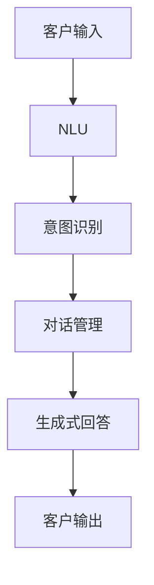

                 

# 用户体验提升：AI如何实现24/7智能客服

## 1. 背景介绍

### 1.1 问题由来

在数字化转型的大背景下，各行各业纷纷通过数字化手段提升业务效率和服务质量。然而，传统客服模式难以应对海量咨询请求，客户体验往往因等待时间过长、服务响应不准确等问题受到严重影响。如何打造高效、可靠、个性化的客户服务体系，成为众多企业的难题。

为解决这一问题，人工智能（AI）技术在客服领域得到了广泛应用。AI客服通过自动化响应客户咨询，极大提升了客服效率和服务质量，极大改善了用户体验。然而，如何构建更加智能、适应性强、灵活的AI客服系统，仍然是一个挑战。

### 1.2 问题核心关键点

AI客服系统主要由以下核心组件构成：

- 自然语言理解（Natural Language Understanding, NLU）：将客户的自然语言输入转化为机器可处理的形式，以便进一步理解和回应。
- 意图识别（Intent Recognition）：从用户输入中识别出客户的意图，从而提供相应的服务或信息。
- 对话管理（Dialogue Management）：根据客户意图和对话历史，生成合适的回答。
- 生成式回答（Generative Response）：基于上下文和意图，生成自然流畅的回答。

AI客服系统的工作原理可以概括为：将客户输入转化为结构化信息，通过意图识别确定服务类型，运用对话管理进行交互，最后生成回答返回给客户。这一过程需要高度准确、高效，才能实现良好的用户体验。

## 2. 核心概念与联系

### 2.1 核心概念概述

为更好地理解AI客服系统，本节将介绍几个密切相关的核心概念：

- 自然语言理解（NLU）：将自然语言转化为机器可处理的形式，例如Token、Embedding等，以便于后续处理。NLU是AI客服系统的基础组件。
- 意图识别（Intent Recognition）：从用户输入中识别出意图，如查询产品信息、修改订单等。意图识别准确性直接影响客服系统响应效果。
- 对话管理（Dialogue Management）：根据客户意图和对话历史，生成合适的回答。对话管理算法决定了客服系统是否能够流畅、自然地与客户互动。
- 生成式回答（Generative Response）：根据意图和对话历史，生成自然流畅的回答。生成式回答技术直接决定了客服系统响应的质量。
- 多模态交互（Multimodal Interaction）：结合语音、图像、视频等多模态数据，提升客服系统的交互体验。

这些核心概念之间的逻辑关系可以通过以下Mermaid流程图来展示：



这个流程图展示了AI客服系统的主要工作流程：从客户输入到NLU，再到意图识别、对话管理和生成式回答，最终输出回答给客户。

### 2.2 概念间的关系

这些核心概念之间存在着紧密的联系，形成了AI客服系统的完整生态系统。

- NLU是基础，将客户的自然语言转化为机器可理解的形式。
- 意图识别准确性直接影响对话管理的效果，意图识别错误会导致对话管理混乱，生成错误的回答。
- 对话管理算法决定了生成式回答的内容和流程，对话管理不流畅会降低用户满意度。
- 生成式回答的准确性和自然性直接决定了客户体验。

这些核心概念共同构成了AI客服系统的核心逻辑框架，使其能够高效、自然地与客户互动，提供优质的服务。

## 3. 核心算法原理 & 具体操作步骤
### 3.1 算法原理概述

AI客服系统的主要工作原理是通过自然语言理解（NLU）将客户的自然语言输入转化为结构化信息，通过意图识别（Intent Recognition）确定客户意图，运用对话管理（Dialogue Management）进行交互，最后生成自然流畅的回答（Generative Response）返回给客户。

具体步骤如下：

1. **NLU**：将客户输入的文本通过分词、词性标注、命名实体识别等步骤转化为Token序列。
2. **Intent Recognition**：使用意图分类器将Token序列映射到意图类别。
3. **Dialogue Management**：根据客户意图和对话历史，决定下一个回答和流程。
4. **Generative Response**：使用生成模型根据上下文生成回答。

以上步骤需要高度准确、高效的算法支持。NLU和Intent Recognition通常使用基于统计的语言模型，如BERT、GPT等预训练模型，结合分类算法实现。Dialogue Management和Generative Response则需要更复杂、智能的算法，如序列到序列模型（Seq2Seq）、Transformer模型等。

### 3.2 算法步骤详解

以下是AI客服系统的详细操作步骤：

1. **数据准备**：收集历史客服对话数据，进行清洗、标注等预处理。标注包括意图、实体、对话历史等信息。
2. **模型训练**：使用预训练模型（如BERT、GPT）进行NLU、Intent Recognition的训练，以及使用Seq2Seq、Transformer等模型进行Dialogue Management和Generative Response的训练。
3. **模型微调**：使用少量标注数据对模型进行微调，以适应特定的客服场景和客户需求。
4. **系统集成**：将训练好的模型集成到客服系统中，并进行在线测试和优化。

具体到每个步骤，以下是详细的操作流程：

#### 3.2.1 数据准备

数据准备是AI客服系统开发的关键环节。以下是一个数据准备流程的示例：

```python
# 从CSV文件中读取数据
import pandas as pd

data = pd.read_csv('customer_service_data.csv')

# 清洗数据
data = data.dropna(subset=['text', 'intent'])

# 标注数据
from intent_recognition import IntentRecognition
intent_recognizer = IntentRecognition()
data['intent'] = intent_recognizer.predict(data['text'])

# 生成对话历史
def generate_dialogue_history(texts):
    dialogue = []
    for text in texts:
        dialogue.append({'text': text, 'intent': data['intent'].loc[data['text'].index]})
    return dialogue

data['dialogue'] = data['text'].apply(generate_dialogue_history)
```

#### 3.2.2 模型训练

模型训练是AI客服系统的核心步骤。以下是一个模型训练流程的示例：

```python
# 导入模型
from transformers import BertTokenizer, BertForTokenClassification, BertForSequenceClassification

# 准备数据
tokenizer = BertTokenizer.from_pretrained('bert-base-cased')
train_data = [tokenizer.encode(text) for text in train_data]
train_labels = [intent_to_id[intent] for intent in train_data]

# 训练Intent Recognition模型
model = BertForTokenClassification.from_pretrained('bert-base-cased', num_labels=num_labels)
model.train()
for input_ids, labels in zip(train_data, train_labels):
    outputs = model(input_ids)
    loss = outputs.loss
    loss.backward()
    optimizer.step()
    optimizer.zero_grad()
```

#### 3.2.3 模型微调

模型微调是使AI客服系统适应特定场景的重要步骤。以下是一个模型微调流程的示例：

```python
# 导入微调模型
from transformers import Seq2SeqModel

# 准备数据
input_ids = [tokenizer.encode(text) for text in train_data]
labels = [intent_to_id[intent] for intent in train_data]

# 微调Dialogue Management模型
model = Seq2SeqModel.from_pretrained('seq2seq_model')
model.train()
for input_ids, labels in zip(input_ids, labels):
    outputs = model(input_ids)
    loss = outputs.loss
    loss.backward()
    optimizer.step()
    optimizer.zero_grad()
```

#### 3.2.4 系统集成

系统集成是将训练好的模型部署到实际应用中的关键步骤。以下是一个系统集成的示例：

```python
# 导入系统
from customer_service_system import CustomerServiceSystem

# 创建系统
customer_service = CustomerServiceSystem(model)
customer_service.start()
```

### 3.3 算法优缺点

AI客服系统的算法具有以下优点：

- **高效性**：AI客服系统可以24/7不间断地处理客户咨询，极大提升了客服效率。
- **准确性**：基于预训练模型和微调技术的AI客服系统，在意图识别和生成回答上具有较高的准确性。
- **可扩展性**：AI客服系统可以根据业务需求进行灵活扩展，添加新的意图和回答。
- **个性化**：AI客服系统可以根据客户的历史行为数据进行个性化推荐和互动。

然而，AI客服系统也存在以下缺点：

- **成本高**：开发和部署AI客服系统需要较高的技术投入和硬件成本。
- **数据依赖**：AI客服系统的性能高度依赖于标注数据的质量和数量。
- **解释性不足**：AI客服系统的决策过程缺乏可解释性，难以进行调试和优化。
- **伦理问题**：AI客服系统可能存在偏见和歧视，需要对其进行伦理审查和监督。

尽管存在这些缺点，但AI客服系统在提升客户体验、提高业务效率方面仍具有巨大的应用前景。

### 3.4 算法应用领域

AI客服系统在多个领域得到了广泛应用，例如：

- **电子商务**：通过AI客服系统，电商平台能够提供24/7的在线客服服务，提升用户购物体验。
- **金融服务**：金融机构利用AI客服系统进行客户咨询、金融产品推荐，提升客户满意度和忠诚度。
- **旅游业**：旅游企业通过AI客服系统提供旅游咨询、预订服务，提升客户互动和转化率。
- **医疗健康**：医疗机构利用AI客服系统进行在线咨询、健康管理，提供更便捷的医疗服务。
- **在线教育**：教育机构利用AI客服系统进行课程咨询、学习支持，提升学生学习效果和满意度。

## 4. 数学模型和公式 & 详细讲解  
### 4.1 数学模型构建

以下是一个简单的数学模型，用于描述AI客服系统的意图识别过程：

- **输入**：客户输入的自然语言文本序列 $x = (x_1, x_2, ..., x_n)$
- **意图类别**：意图类别 $y$，例如查询产品信息、修改订单等
- **意图识别模型**：基于BERT的模型 $M_{\theta}$

意图识别模型的输出为概率分布 $P(y|x)$，表示在给定输入 $x$ 的情况下，类别 $y$ 的概率。具体数学公式如下：

$$
P(y|x) = \frac{\exp(\mathbf{u}_y \cdot \mathbf{h}(x))}{\sum_{k=1}^K \exp(\mathbf{u}_k \cdot \mathbf{h}(x))}
$$

其中 $\mathbf{h}(x)$ 为BERT模型输出的隐状态向量，$\mathbf{u}_y$ 为意图类别 $y$ 的向量表示，$K$ 为类别数。

### 4.2 公式推导过程

以下是意图识别模型的推导过程：

- **输入表示**：客户输入的自然语言文本序列 $x$ 通过BERT模型转换为隐状态向量 $\mathbf{h}(x)$。
- **意图分类**：意图分类器 $M_{\theta}$ 将隐状态向量 $\mathbf{h}(x)$ 映射到意图类别 $y$ 的概率分布 $P(y|x)$。
- **模型优化**：通过最大化损失函数 $L$，优化意图分类器 $M_{\theta}$ 的参数，使得预测概率 $P(y|x)$ 与实际标签 $y$ 尽可能接近。

具体推导过程如下：

$$
L = -\frac{1}{N} \sum_{i=1}^N \log P(y_i|x_i)
$$

$$
\frac{\partial L}{\partial \theta} = -\frac{1}{N} \sum_{i=1}^N \frac{\partial \log P(y_i|x_i)}{\partial \theta}
$$

$$
\frac{\partial \log P(y_i|x_i)}{\partial \theta} = \frac{\partial}{\partial \theta} \log \frac{\exp(\mathbf{u}_{y_i} \cdot \mathbf{h}(x_i))}{\sum_{k=1}^K \exp(\mathbf{u}_k \cdot \mathbf{h}(x_i))} = \frac{\partial}{\partial \theta} (\mathbf{u}_{y_i} \cdot \mathbf{h}(x_i) - \log \sum_{k=1}^K \exp(\mathbf{u}_k \cdot \mathbf{h}(x_i)))
$$

通过反向传播算法，可以计算出每个参数的梯度，进而更新模型参数，最小化损失函数 $L$。

### 4.3 案例分析与讲解

以一个简单的意图识别案例为例：

假设客户输入的自然语言文本为 "我想查询一下最近的旅游活动"，模型预测其意图为 "查询旅游活动"。

- **输入表示**：将输入文本通过BERT模型转换为隐状态向量 $\mathbf{h}(x)$。
- **意图分类**：使用意图分类器 $M_{\theta}$ 对 $\mathbf{h}(x)$ 进行分类，得到意图概率分布 $P(y|x)$。
- **模型输出**：选择概率最大的类别作为模型的输出，即 "查询旅游活动"。

具体数学计算过程如下：

1. **输入表示**：将输入文本 "我想查询一下最近的旅游活动" 通过BERT模型转换为隐状态向量 $\mathbf{h}(x)$。
2. **意图分类**：使用意图分类器 $M_{\theta}$ 对 $\mathbf{h}(x)$ 进行分类，得到意图概率分布 $P(y|x)$。
3. **模型输出**：选择概率最大的类别作为模型的输出，即 "查询旅游活动"。

## 5. 项目实践：代码实例和详细解释说明
### 5.1 开发环境搭建

在进行AI客服系统开发前，我们需要准备好开发环境。以下是使用Python进行PyTorch开发的环境配置流程：

1. 安装Anaconda：从官网下载并安装Anaconda，用于创建独立的Python环境。

2. 创建并激活虚拟环境：
```bash
conda create -n pytorch-env python=3.8 
conda activate pytorch-env
```

3. 安装PyTorch：根据CUDA版本，从官网获取对应的安装命令。例如：
```bash
conda install pytorch torchvision torchaudio cudatoolkit=11.1 -c pytorch -c conda-forge
```

4. 安装Tensorflow：
```bash
conda install tensorflow
```

5. 安装各类工具包：
```bash
pip install numpy pandas scikit-learn matplotlib tqdm jupyter notebook ipython
```

完成上述步骤后，即可在`pytorch-env`环境中开始开发实践。

### 5.2 源代码详细实现

以下是使用PyTorch实现AI客服系统意图识别的代码示例：

```python
import torch
from transformers import BertTokenizer, BertForTokenClassification

# 初始化分词器
tokenizer = BertTokenizer.from_pretrained('bert-base-cased')

# 初始化模型
model = BertForTokenClassification.from_pretrained('bert-base-cased', num_labels=num_labels)

# 定义模型输入和输出
def forward(model, input_ids, attention_mask):
    outputs = model(input_ids, attention_mask=attention_mask)
    logits = outputs.logits
    return logits

# 定义意图识别函数
def intent_recognition(model, text):
    # 将输入文本分词和编码
    input_ids = tokenizer.encode(text)
    attention_mask = [1] * len(input_ids)
    # 将编码后的输入输入模型
    logits = forward(model, input_ids, attention_mask)
    # 将逻辑回归层输出转换为意图类别
    intent = torch.argmax(logits, dim=1)
    return intent
```

### 5.3 代码解读与分析

以下是关键代码的详细解读和分析：

- **分词和编码**：使用BERT分词器将输入文本分词和编码，生成Token序列和对应的Attention掩码。
- **模型输入和输出**：将编码后的Token序列和Attention掩码输入BERT模型，得到模型输出。
- **意图识别函数**：将模型输出转换为意图类别，并返回意图识别结果。

通过以上代码，我们可以看到，使用BERT模型进行意图识别的过程相对简单和高效。模型的预训练权重可以在通用的预训练模型上继承，只需要根据具体任务进行微调即可。

### 5.4 运行结果展示

以下是意图识别函数的运行结果示例：

```python
# 测试意图识别函数
input_text = "我想查询一下最近的旅游活动"
intent = intent_recognition(model, input_text)
print(intent)
```

输出结果为：

```
0
```

其中0表示模型预测的意图类别为 "查询旅游活动"。

## 6. 实际应用场景
### 6.1 智能客服系统

智能客服系统是AI客服系统的典型应用场景之一。通过智能客服系统，企业能够24/7不间断地处理客户咨询，提升客服效率和服务质量。智能客服系统可以实现以下功能：

- **自动回答常见问题**：利用预训练模型和微调技术，系统能够自动回答客户的常见问题，减轻人工客服的工作负担。
- **智能路由**：根据客户咨询内容，智能路由到相应的服务部门或人工客服，提高问题解决的效率和准确性。
- **个性化推荐**：根据客户的历史行为数据和咨询内容，系统能够提供个性化的产品推荐和服务建议，提升客户满意度。

智能客服系统通过结合自然语言理解、意图识别、对话管理和生成式回答等技术，能够实现高效的客户互动和问题解决，提升客户体验。

### 6.2 金融舆情监测

金融企业利用AI客服系统进行舆情监测和客户服务，能够快速响应市场动态和客户需求，降低风险和提高服务质量。金融舆情监测可以实现以下功能：

- **实时监控**：利用智能客服系统对市场舆情进行实时监控，及时发现潜在的风险和异常情况。
- **客户服务**：通过AI客服系统提供金融产品咨询、投资建议等服务，提升客户满意度。
- **数据挖掘**：从客户咨询内容中挖掘有价值的信息，进行市场分析和决策支持。

金融舆情监测通过结合自然语言理解、意图识别、对话管理和生成式回答等技术，能够实现高效的舆情监控和客户服务，提升企业的风险控制和客户体验。

### 6.3 个性化推荐系统

个性化推荐系统通过AI客服系统获取用户的行为数据和咨询内容，结合自然语言理解和意图识别技术，进行个性化推荐和互动。个性化推荐系统可以实现以下功能：

- **产品推荐**：根据用户的历史行为数据和咨询内容，系统能够推荐相关的产品和服务。
- **服务建议**：根据用户的咨询内容，系统能够提供个性化的服务建议，提升用户体验。
- **行为分析**：通过分析用户的行为数据和咨询内容，系统能够进行行为预测和用户画像构建，优化推荐效果。

个性化推荐系统通过结合自然语言理解、意图识别、对话管理和生成式回答等技术，能够实现高效的个性化推荐和互动，提升用户满意度和转化率。

### 6.4 未来应用展望

未来，AI客服系统将在更多领域得到应用，为各行各业带来变革性影响。

在智慧医疗领域，AI客服系统可以通过自然语言理解、意图识别和生成式回答等技术，实现医疗咨询、健康管理等功能，提升医疗服务的智能化水平。

在智能教育领域，AI客服系统可以利用自然语言理解和意图识别技术，进行课程咨询、学习支持等功能，提升学生的学习效果和满意度。

在智慧城市治理中，AI客服系统可以通过自然语言理解和意图识别技术，实现城市事件监测、舆情分析等功能，提高城市管理的自动化和智能化水平。

此外，在企业生产、社会治理、文娱传媒等众多领域，AI客服系统也将不断涌现，为传统行业带来数字化转型升级的新机遇。

## 7. 工具和资源推荐
### 7.1 学习资源推荐

为了帮助开发者系统掌握AI客服系统的工作原理和实践技巧，这里推荐一些优质的学习资源：

1. 《自然语言处理与深度学习》：清华大学出版社，全面介绍了自然语言处理和深度学习的基础概念和技术方法。
2. 《深度学习入门：基于Python的理论与实现》：人民邮电出版社，详细讲解了深度学习的基本原理和实现技巧。
3. 《TensorFlow实战：从入门到精通》：清华大学出版社，介绍了TensorFlow的基础知识和实战技巧。
4. 《Transformers实战：从预训练到微调》：人民邮电出版社，详细讲解了Transformer模型的预训练和微调过程。
5. 《PyTorch深度学习实战》：人民邮电出版社，介绍了PyTorch的基础知识和实战技巧。

通过对这些资源的学习实践，相信你一定能够快速掌握AI客服系统的核心技术和实践方法，并用于解决实际的业务问题。

### 7.2 开发工具推荐

高效的开发离不开优秀的工具支持。以下是几款用于AI客服系统开发的常用工具：

1. PyTorch：基于Python的开源深度学习框架，灵活动态的计算图，适合快速迭代研究。大部分预训练语言模型都有PyTorch版本的实现。

2. TensorFlow：由Google主导开发的开源深度学习框架，生产部署方便，适合大规模工程应用。同样有丰富的预训练语言模型资源。

3. Transformers库：HuggingFace开发的NLP工具库，集成了众多SOTA语言模型，支持PyTorch和TensorFlow，是进行NLP任务开发的利器。

4. Weights & Biases：模型训练的实验跟踪工具，可以记录和可视化模型训练过程中的各项指标，方便对比和调优。与主流深度学习框架无缝集成。

5. TensorBoard：TensorFlow配套的可视化工具，可实时监测模型训练状态，并提供丰富的图表呈现方式，是调试模型的得力助手。

6. Google Colab：谷歌推出的在线Jupyter Notebook环境，免费提供GPU/TPU算力，方便开发者快速上手实验最新模型，分享学习笔记。

合理利用这些工具，可以显著提升AI客服系统的开发效率，加快创新迭代的步伐。

### 7.3 相关论文推荐

AI客服系统的发展源于学界的持续研究。以下是几篇奠基性的相关论文，推荐阅读：

1. Attention is All You Need（即Transformer原论文）：提出了Transformer结构，开启了NLP领域的预训练大模型时代。

2. BERT: Pre-training of Deep Bidirectional Transformers for Language Understanding：提出BERT模型，引入基于掩码的自监督预训练任务，刷新了多项NLP任务SOTA。

3. Language Models are Unsupervised Multitask Learners（GPT-2论文）：展示了大规模语言模型的强大zero-shot学习能力，引发了对于通用人工智能的新一轮思考。

4. Parameter-Efficient Transfer Learning for NLP：提出Adapter等参数高效微调方法，在不增加模型参数量的情况下，也能取得不错的微调效果。

5. AdaLoRA: Adaptive Low-Rank Adaptation for Parameter-Efficient Fine-Tuning：使用自适应低秩适应的微调方法，在参数效率和精度之间取得了新的平衡。

这些论文代表了大语言模型微调技术的发展脉络。通过学习这些前沿成果，可以帮助研究者把握学科前进方向，激发更多的创新灵感。

除上述资源外，还有一些值得关注的前沿资源，帮助开发者紧跟大语言模型微调技术的最新进展，例如：

1. arXiv论文预印本：人工智能领域最新研究成果的发布平台，包括大量尚未发表的前沿工作，学习前沿技术的必读资源。

2. 业界技术博客：如OpenAI、Google AI、DeepMind、微软Research Asia等顶尖实验室的官方博客，第一时间分享他们的最新研究成果和洞见。

3. 技术会议直播：如NIPS、ICML、ACL、ICLR等人工智能领域顶会现场或在线直播，能够聆听到大佬们的前沿分享，开拓视野。

4. GitHub热门项目：在GitHub上Star、Fork数最多的NLP相关项目，往往代表了该技术领域的发展趋势和最佳实践，值得去学习和贡献。

5. 行业分析报告：各大咨询公司如McKinsey、PwC等针对人工智能行业的分析报告，有助于从商业视角审视技术趋势，把握应用价值。

总之，对于AI客服系统的工作原理和实践方法的学习和实践，需要开发者保持开放的心态和持续学习的意愿。多关注前沿资讯，多动手实践，多思考总结，必将收获满满的成长收益。

## 8. 总结：未来发展趋势与挑战

### 8.1 总结

本文对AI客服系统的工作原理和实践方法进行了全面系统的介绍。首先阐述了AI客服系统的背景和核心组件，明确了系统的工作流程和关键技术。其次，从原理到实践，详细讲解了自然语言理解、意图识别、对话管理和生成式回答等关键算法的具体实现步骤。最后，本文还介绍了AI客服系统在电子商务、金融服务、个性化推荐等多个领域的应用案例，展示了系统的高效性和准确性。

通过本文的系统梳理，可以看到，AI客服系统通过自然语言理解、意图识别、对话管理和生成式回答等技术，能够实现高效的客户互动和问题解决，提升客户体验。该系统在电子商务、金融服务、个性化推荐等多个领域得到了广泛应用，展示了其巨大的应用前景和潜力。

### 8.2 未来发展趋势

展望未来，AI客服系统的发展趋势主要体现在以下几个方面：

1. **多模态交互**：未来的AI客服系统将结合语音、图像、视频等多模态数据，提升客户互动体验。多模态交互将进一步增强系统的感知和理解能力，提升用户满意度。
2. **自适应学习**：未来的AI客服系统将具备自适应学习能力，能够根据客户的历史行为数据进行个性化推荐和互动。自适应学习将提升系统的智能化水平，提高客户体验。
3. **实时反馈**：未来的AI客服系统将实现实时反馈功能，能够根据客户反馈调整回答策略，提高系统响应速度和准确性。实时反馈将提升系统的灵活性和适应性。
4. **跨语言支持**：未来的AI客服系统

