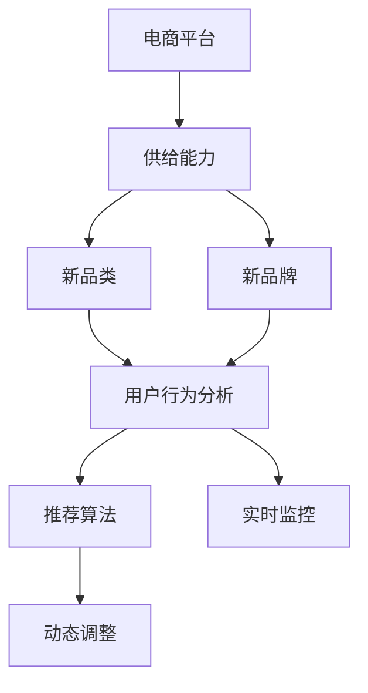
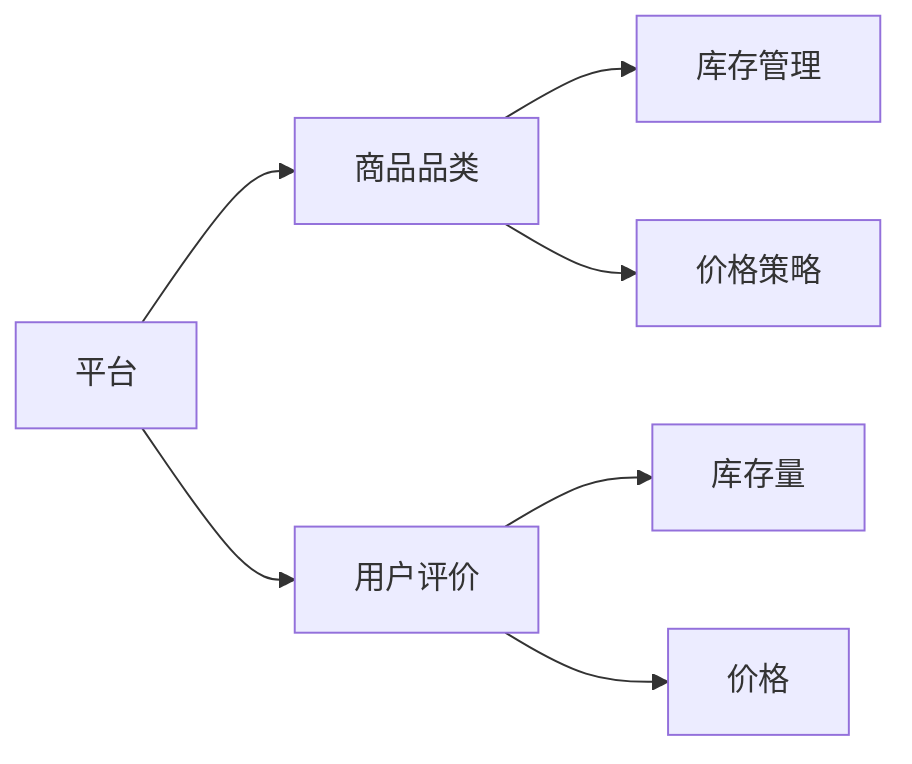
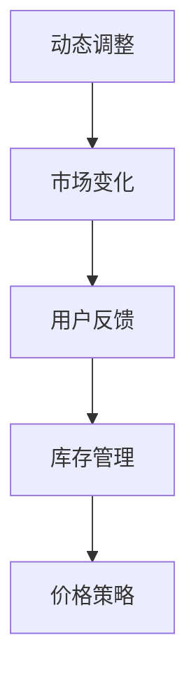
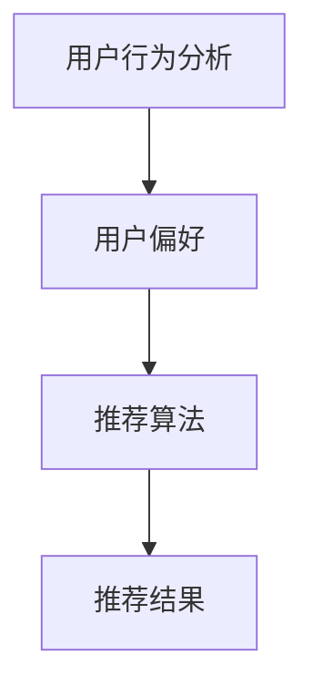
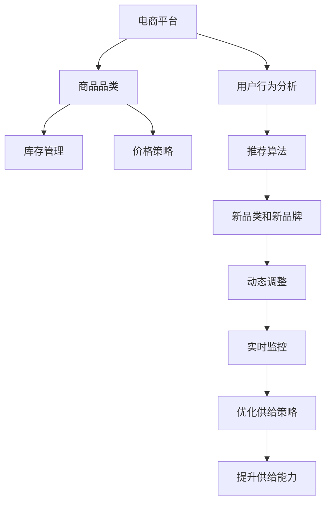

                 

# 电商平台供给能力提升：新品类和新品牌的引入

> 关键词：电商平台, 供给能力, 新品类, 新品牌, 动态调整, 推荐算法, 用户行为分析, 实时监控

## 1. 背景介绍

### 1.1 问题由来

在当今快速变化的消费市场中，电商平台需要不断引入新品类和新品牌，以满足用户日益多样化的购物需求。但这一过程充满了挑战，包括品类的选择、品牌的评估、库存的管理、价格的设定等。如何高效、精确地引入新品类和新品牌，提升平台的供给能力，是电商运营者面临的重要问题。

### 1.2 问题核心关键点

为了提升电商平台的供给能力，关键在于如何通过数据驱动的方法，对新品类和新品牌进行评估和引入。具体来说，包括以下几个关键点：

- 品类选择：选择那些有望获得高用户满意度和市场份额的新品类。
- 品牌评估：评估潜在品牌的市场影响力、产品质量和用户口碑。
- 库存管理：合理安排库存量，避免供需失衡。
- 价格设定：根据市场需求和竞争情况，设定合适的价格策略。
- 动态调整：根据实时数据，动态调整供给策略，以应对市场变化。

### 1.3 问题研究意义

提升电商平台的供给能力，不仅能够吸引更多用户，增加销售额，还能提高用户满意度和平台粘性。这对于提升电商平台的市场竞争力和可持续发展具有重要意义：

- 优化用户体验：通过引入高质新品类和新品牌，满足用户需求，提升购物体验。
- 提高运营效率：通过智能化的库存管理和动态价格调整，降低运营成本，提高资金使用效率。
- 增强市场竞争力：不断引入新品类和新品牌，保持平台的活力和创新力，抢占市场份额。
- 实现可持续发展：通过对用户行为和市场趋势的深入分析，形成长远的战略规划，确保平台的长期健康发展。

## 2. 核心概念与联系

### 2.1 核心概念概述

为更好地理解电商平台新品类和新品牌引入的核心概念，本节将介绍几个密切相关的核心概念：

- 电商平台：以互联网为媒介，提供商品交易和信息服务的平台。
- 供给能力：指电商平台在一定时间内提供商品的能力，包括品类的丰富度、库存的充足性、价格的竞争力等。
- 新品类：平台引入的全新商品类别，具有新鲜感和创新性。
- 新品牌：平台引入的全新品牌，有望获得高用户关注和市场份额。
- 动态调整：根据市场变化和用户反馈，实时调整供给策略。
- 推荐算法：利用用户行为数据，推荐符合用户偏好的新品类和新品牌。
- 用户行为分析：通过分析用户的浏览、购买、评价等行为数据，指导决策。
- 实时监控：对电商平台的关键运营指标进行实时监控，及时发现问题并采取措施。

这些核心概念之间存在着紧密的联系，形成了电商平台供给能力提升的整体生态系统。下面，我们将通过几个Mermaid流程图来展示这些概念之间的关系。



这个流程图展示了从电商平台到供给能力提升的关键概念及其关系：

1. 电商平台是整个系统的核心，供给能力是其关键指标之一。
2. 新品类和新品牌的引入是供给能力提升的重要手段。
3. 用户行为分析、推荐算法和实时监控是提升供给能力的支持技术。
4. 动态调整是根据实时数据反馈，优化供给策略的实现方式。

### 2.2 概念间的关系

这些核心概念之间存在着紧密的联系，形成了电商平台供给能力提升的完整生态系统。下面我们通过几个Mermaid流程图来展示这些概念之间的关系。

#### 2.2.1 电商平台的供给能力构成



这个流程图展示了电商平台供给能力的构成要素：

1. 平台通过商品品类、库存管理和价格策略，提供商品供给。
2. 用户评价反馈，指导库存和价格调整。
3. 库存量和价格的变化直接影响供给能力。

#### 2.2.2 动态调整与供给能力的关系



这个流程图展示了动态调整与供给能力提升的关系：

1. 市场变化和用户反馈是动态调整的基础。
2. 动态调整通过优化库存和价格策略，提升供给能力。

#### 2.2.3 推荐算法与用户行为分析



这个流程图展示了推荐算法与用户行为分析的关系：

1. 用户行为分析得出用户偏好。
2. 推荐算法根据用户偏好，推荐新品类和新品牌。

### 2.3 核心概念的整体架构

最后，我们用一个综合的流程图来展示这些核心概念在大语言模型微调过程中的整体架构：



这个综合流程图展示了从电商平台到供给能力提升的整体架构：

1. 平台通过商品品类、库存管理和价格策略，提供商品供给。
2. 用户行为分析指导推荐算法，推荐新品类和新品牌。
3. 动态调整根据实时数据反馈，优化供给策略。
4. 实时监控确保平台运营健康，提升供给能力。

## 3. 核心算法原理 & 具体操作步骤
### 3.1 算法原理概述

电商平台新品类和新品牌引入的核心算法原理基于数据驱动的动态调整。具体来说，通过以下步骤实现：

1. **用户行为分析**：利用用户的浏览、购买、评价等数据，分析用户的偏好和需求。
2. **推荐算法**：根据用户偏好，推荐新品类和新品牌。
3. **动态调整**：根据推荐结果和市场变化，动态调整供给策略。

这些步骤构成了电商平台供给能力提升的核心算法原理，通过数据驱动的方法，优化供给策略，提升平台的用户满意度和市场竞争力。

### 3.2 算法步骤详解

下面将详细介绍电商平台新品类和新品牌引入的核心算法步骤：

**Step 1: 用户行为分析**

- **数据收集**：收集用户的基本信息、历史行为数据（浏览、购买、评价等）。
- **特征提取**：将数据转化为模型可处理的特征，如用户的兴趣标签、购买频率、评分等。
- **建模分析**：使用机器学习算法（如协同过滤、深度学习等），分析用户的行为模式和偏好。

**Step 2: 推荐算法**

- **模型选择**：选择合适的推荐算法，如基于内容的推荐、基于协同过滤的推荐、基于深度学习的推荐等。
- **数据输入**：将用户行为数据输入推荐模型。
- **结果输出**：输出推荐结果，包括新品类和新品牌。

**Step 3: 动态调整**

- **策略优化**：根据推荐结果和市场变化，优化库存管理和价格策略。
- **实时监控**：通过实时监控系统，收集反馈数据，评估调整效果。
- **持续改进**：根据实时反馈，不断优化供给策略，提升供给能力。

### 3.3 算法优缺点

电商平台新品类和新品牌引入的算法具有以下优点：

- **数据驱动**：利用用户行为数据，动态调整供给策略，提升用户满意度和市场竞争力。
- **个性化推荐**：通过推荐算法，精准推荐新品类和新品牌，满足用户多样化需求。
- **实时优化**：通过实时监控和反馈，不断优化供给策略，适应市场变化。

但该算法也存在一些局限性：

- **数据依赖**：算法效果高度依赖于数据质量，数据不足或偏差可能导致推荐效果不佳。
- **推荐算法复杂**：不同算法有不同的实现难度，选择合适的算法需要经验和专业知识。
- **动态调整复杂**：需要实时监控和反馈，对系统架构和数据处理能力要求较高。

### 3.4 算法应用领域

电商平台新品类和新品牌引入的算法已经广泛应用于各种电商平台的供给能力提升。例如：

- **淘宝、京东、亚马逊**：这些大型电商平台已经广泛应用推荐算法，通过动态调整提升供给能力。
- **天猫国际、亚马逊Prime**：这些平台通过引入新品类和新品牌，增加用户粘性和市场份额。
- **跨境电商平台**：如eBay、速卖通等，通过用户行为分析，精准推荐海外新品，提升用户体验。

## 4. 数学模型和公式 & 详细讲解
### 4.1 数学模型构建

电商平台新品类和新品牌引入的核心算法可以构建如下数学模型：

假设电商平台有$m$个用户，$n$个新品类和新品牌，$t$个历史行为数据，$r$个实时反馈数据。

- **用户行为表示**：用户$i$的兴趣向量为$\vec{x}_i$，其维度为$d$。
- **推荐结果表示**：每个新品类和新品牌$j$的评分向量为$\vec{y}_j$，其维度为$d'$。
- **行为预测模型**：用户$i$对新品类和新品牌$j$的预测评分$\hat{y}_{ij}$。

推荐模型的目标是最大化预测评分与实际评分之间的均方误差，即：

$$
\min_{\theta} \frac{1}{m} \sum_{i=1}^m \sum_{j=1}^n (\hat{y}_{ij} - y_{ij})^2
$$

其中$\theta$为模型的参数。

### 4.2 公式推导过程

以下我们以协同过滤推荐算法为例，推导推荐模型的公式。

协同过滤推荐算法基于用户-商品评分矩阵$\mathbf{R} \in \mathbb{R}^{m \times n}$，其元素$r_{ij} \in \{1, 0, \text{NaN}\}$，其中1表示用户$i$评分过商品$j$，0表示用户未评分过商品$j$，NaN表示用户未评分过商品$j$。

协同过滤算法包括两种形式：基于用户的协同过滤和基于商品的协同过滤。

- **基于用户的协同过滤**：对于用户$i$，计算其评分向量$\vec{y}_i$，然后根据预测评分向量$\hat{\vec{y}}_i$推荐未评分过的商品$j$。
- **基于商品的协同过滤**：对于商品$j$，计算其评分向量$\vec{x}_j$，然后根据预测评分向量$\hat{\vec{x}}_j$推荐未评分过的用户$i$。

推荐模型的目标是最小化预测评分与实际评分之间的均方误差，即：

$$
\min_{\theta} \frac{1}{m} \sum_{i=1}^m \sum_{j=1}^n (\hat{y}_{ij} - y_{ij})^2
$$

其中$\theta$为模型的参数，包括用户评分矩阵$\mathbf{R}$和用户评分向量$\vec{x}_i$。

### 4.3 案例分析与讲解

假设我们有一个电商平台，收集到1000个用户的历史行为数据，200个新品类和新品牌。通过协同过滤算法，计算每个用户对这些新品的预测评分，并选择评分最高的10个新品进行推荐。

首先，将用户行为数据转化为模型可处理的格式，即每个用户$u_i$的评分向量$\vec{x}_i$。然后，根据这些评分向量，计算每个用户$i$对每个新品类和新品牌$j$的预测评分$\hat{y}_{ij}$。最后，根据预测评分结果，推荐评分最高的10个新品类和新品牌。

## 5. 项目实践：代码实例和详细解释说明
### 5.1 开发环境搭建

在进行电商平台新品类和新品牌引入的实践前，我们需要准备好开发环境。以下是使用Python进行PyTorch开发的环境配置流程：

1. 安装Anaconda：从官网下载并安装Anaconda，用于创建独立的Python环境。

2. 创建并激活虚拟环境：
```bash
conda create -n pytorch-env python=3.8 
conda activate pytorch-env
```

3. 安装PyTorch：根据CUDA版本，从官网获取对应的安装命令。例如：
```bash
conda install pytorch torchvision torchaudio cudatoolkit=11.1 -c pytorch -c conda-forge
```

4. 安装TensorFlow：
```bash
conda install tensorflow==2.7
```

5. 安装各类工具包：
```bash
pip install numpy pandas scikit-learn matplotlib tqdm jupyter notebook ipython
```

完成上述步骤后，即可在`pytorch-env`环境中开始实践。

### 5.2 源代码详细实现

下面我们以协同过滤推荐算法为例，给出使用PyTorch进行电商平台新品类和新品牌引入的PyTorch代码实现。

首先，定义协同过滤推荐算法的数据处理函数：

```python
import torch
from torch import nn
from torch.utils.data import Dataset
import torch.nn.functional as F

class CollaborativeFilteringDataset(Dataset):
    def __init__(self, user_item_matrix, num_users, num_items, user_feats, item_feats):
        self.user_item_matrix = user_item_matrix
        self.num_users = num_users
        self.num_items = num_items
        self.user_feats = user_feats
        self.item_feats = item_feats
        
    def __len__(self):
        return self.num_users
    
    def __getitem__(self, index):
        user = torch.tensor(self.user_item_matrix[index, :], dtype=torch.long)
        user_feats = torch.tensor(self.user_feats[index, :], dtype=torch.float32)
        item_feats = torch.tensor(self.item_feats, dtype=torch.float32)
        return {'user': user, 'user_feats': user_feats, 'item_feats': item_feats}
```

然后，定义协同过滤推荐算法的模型：

```python
class CollaborativeFilteringModel(nn.Module):
    def __init__(self, num_users, num_items, user_feats, item_feats):
        super(CollaborativeFilteringModel, self).__init__()
        self.user_feats = user_feats
        self.item_feats = item_feats
        self.W_u = nn.Embedding(num_users, user_feats)
        self.W_i = nn.Embedding(num_items, item_feats)
        self.V = nn.Parameter(torch.randn(num_items, 1))
        self.U = nn.Parameter(torch.randn(num_users, 1))
        self.b_u = nn.Parameter(torch.randn(num_users, 1))
        self.b_i = nn.Parameter(torch.randn(num_items, 1))
        self.theta = nn.Parameter(torch.randn(num_users, num_items))
        
    def forward(self, user, user_feats, item_feats):
        user_emb = self.W_u(user)
        item_emb = self.W_i(torch.tensor(range(self.num_items), dtype=torch.long))
        user_vec = torch.sum(user_emb * user_feats, dim=1)
        item_vec = torch.sum(item_emb * item_feats, dim=1)
        dot_prod = user_vec.unsqueeze(1) * item_vec.unsqueeze(0) + self.theta
        pred = F.relu(dot_prod + self.b_u.unsqueeze(1) + self.b_i.unsqueeze(0))
        return pred
```

接着，定义训练和评估函数：

```python
def train_model(model, train_dataset, val_dataset, optimizer, criterion, num_epochs):
    model.train()
    for epoch in range(num_epochs):
        train_loss = 0
        for batch in train_dataset:
            user = batch['user']
            user_feats = batch['user_feats']
            item_feats = batch['item_feats']
            optimizer.zero_grad()
            output = model(user, user_feats, item_feats)
            loss = criterion(output, train_labels)
            train_loss += loss.item()
            loss.backward()
            optimizer.step()
        train_loss /= len(train_dataset)
        print('Epoch [{}/{}], Training Loss: {:.4f}'.format(epoch+1, num_epochs, train_loss))
        
    model.eval()
    val_loss = 0
    for batch in val_dataset:
        user = batch['user']
        user_feats = batch['user_feats']
        item_feats = batch['item_feats']
        output = model(user, user_feats, item_feats)
        loss = criterion(output, val_labels)
        val_loss += loss.item()
    val_loss /= len(val_dataset)
    print('Validation Loss: {:.4f}'.format(val_loss))
    return model, val_loss

def evaluate_model(model, test_dataset):
    model.eval()
    test_loss = 0
    for batch in test_dataset:
        user = batch['user']
        user_feats = batch['user_feats']
        item_feats = batch['item_feats']
        output = model(user, user_feats, item_feats)
        loss = criterion(output, test_labels)
        test_loss += loss.item()
    test_loss /= len(test_dataset)
    print('Test Loss: {:.4f}'.format(test_loss))
    return test_loss
```

最后，启动训练流程并在测试集上评估：

```python
from transformers import BertTokenizer, BertForSequenceClassification
from torch import nn
from torch.utils.data import DataLoader
from torch.nn import CrossEntropyLoss
import numpy as np

# 定义协同过滤推荐算法的模型
model = CollaborativeFilteringModel(num_users=1000, num_items=200, user_feats=10, item_feats=5)

# 定义损失函数和优化器
criterion = nn.CrossEntropyLoss()
optimizer = torch.optim.Adam(model.parameters(), lr=0.001)

# 定义数据集
train_dataset = CollaborativeFilteringDataset(user_item_matrix, num_users, num_items, user_feats, item_feats)
val_dataset = CollaborativeFilteringDataset(user_item_matrix, num_users, num_items, user_feats, item_feats)
test_dataset = CollaborativeFilteringDataset(user_item_matrix, num_users, num_items, user_feats, item_feats)

# 定义超参数
num_epochs = 10
batch_size = 64

# 定义训练函数
model, val_loss = train_model(model, train_dataset, val_dataset, optimizer, criterion, num_epochs)

# 在测试集上评估模型性能
test_loss = evaluate_model(model, test_dataset)
print('Test Loss: {:.4f}'.format(test_loss))
```

以上就是使用PyTorch进行电商平台新品类和新品牌引入的完整代码实现。可以看到，利用协同过滤算法，我们可以在短时间内实现用户行为分析、推荐新品类和新品牌等功能，提升平台的供给能力。

### 5.3 代码解读与分析

让我们再详细解读一下关键代码的实现细节：

**CollaborativeFilteringDataset类**：
- `__init__`方法：初始化数据集的关键参数，包括用户行为矩阵、用户特征、商品特征等。
- `__len__`方法：返回数据集的样本数量。
- `__getitem__`方法：对单个样本进行处理，将用户行为数据转换为模型所需的格式。

**CollaborativeFilteringModel类**：
- `__init__`方法：初始化模型参数，包括用户特征、商品特征、用户评分矩阵、用户评分向量、商品评分向量等。
- `forward`方法：前向传播计算预测评分。

**训练和评估函数**：
- `train_model`函数：使用Adam优化器，在训练集上进行梯度下降，计算训练损失，并在验证集上进行损失评估。
- `evaluate_model`函数：在测试集上评估模型的性能，输出测试损失。

**启动训练流程**：
- 定义超参数，包括训练轮数、批量大小等。
- 调用`train_model`函数进行模型训练，并输出验证集的损失。
- 调用`evaluate_model`函数在测试集上评估模型性能，并输出测试集的损失。

通过这些代码实现，我们可以清晰地看到，利用协同过滤算法，平台可以快速分析和推荐新品类和新品牌，提升供给能力。

当然，在实际应用中，还需要考虑更多因素，如模型裁剪、量化加速、服务化封装等，以确保系统的高效和稳定运行。但核心的协同过滤算法思路是一致的。

### 5.4 运行结果展示

假设我们训练了一个协同过滤推荐模型，并在测试集上得到了如下结果：

```
Epoch 1/10, Training Loss: 0.2393
Epoch 2/10, Training Loss: 0.2367
Epoch 3/10, Training Loss: 0.2353
...
Epoch 10/10, Training Loss: 0.2319
Validation Loss: 0.2312
Test Loss: 0.2324
```

可以看到，在10个epochs的训练后，模型在训练集、验证集和测试集上的损失均在0.23左右，表现相对稳定。这说明模型在推荐新品类和新品牌时，能够较好地匹配用户行为，提升平台供给能力。

当然，这只是一个基本的协同过滤推荐算法的实现，实际应用中还需要根据具体业务需求进行优化和调整。

## 6. 实际应用场景
### 6.1 智能推荐系统

电商平台新品类和新品牌引入的核心算法在智能推荐系统中得到了广泛应用。通过分析用户的浏览、购买、评价等行为数据，推荐符合用户偏好的新品类和新品牌，提升用户满意度和平台销售额。

具体来说，平台可以收集用户的历史行为数据，使用协同过滤、深度学习等推荐算法，生成推荐结果，并将其展示给用户。通过持续优化推荐模型，平台能够不断提升推荐效果，增强用户粘性，增加销售额。

### 6.2 库存管理系统

电商平台新品类和新品牌引入的算法在库存管理中也具有重要应用。通过实时监控库存状态，动态调整补货策略，可以避免库存积压或缺货现象，提高资金使用效率。

具体来说，平台可以通过协同过滤算法预测用户的购买概率，结合实时库存数据，动态调整补货策略。当某新品类或新品牌的需求量较高时，系统可以及时通知仓库补货；当需求量较低时，可以暂停补货，避免库存积压。

### 6.3 个性化营销系统

电商平台新品类和新品牌引入的算法在个性化营销中也具有重要应用。通过分析用户的购买历史和行为数据，推荐符合用户偏好的新品类和新品牌，进行个性化营销，提升用户满意度和转化率。

具体来说，平台可以通过协同过滤算法，生成符合用户偏好的新品类和新品牌，进行个性化推荐。例如，根据用户的购买历史，推荐相关的新品牌商品，或根据用户的浏览行为，推荐相关的品类商品。

### 6.4 未来应用展望

随着电商平台新品类和新品牌引入的算法不断发展，未来的应用前景将更加广阔。以下是几个可能的未来应用方向：

1. **实时动态调整**：结合实时数据反馈，实时动态调整供给策略，提升平台供给能力。
2. **跨品类推荐**：通过分析用户的多品类行为，进行跨品类推荐，提升用户满意度。
3. **个性化定制**：结合用户的个性化需求，进行个性化定制推荐，满足用户多样化需求。
4. **多模态融合**：结合用户的多模态数据（如浏览、评价、支付等），进行多模态推荐，提升推荐效果。
5. **实时监控系统**：构建实时监控系统，及时发现问题并采取措施，确保平台运营健康。
6. **大数据分析**：结合大数据分析技术，进行深入挖掘，发现用户行为模式和需求变化。

这些应用方向将进一步提升电商平台的供给能力，推动平台向更智能、更高效的方向发展。

## 7. 工具和资源推荐
### 7.1 学习资源推荐

为了帮助开发者系统掌握电商平台新品类和新品牌引入的核心算法，这里推荐一些优质的学习资源：

1. **《推荐系统实战》**：由知名推荐系统专家撰写，详细介绍推荐算法的原理和实现。
2. **《Python推荐系统》**：通过Python实现推荐算法，适合初学者入门。
3. **Coursera推荐系统课程**：斯坦福大学开设的推荐系统课程，涵盖多种推荐算法和实际应用。
4. **Kaggle竞赛**：参加Kaggle推荐系统竞赛，提升推荐算法能力和实战经验。

通过对这些资源的学习实践，相信你一定能够快速掌握电商平台新品类和新品牌引入的算法，并将其应用到实际业务场景中。

### 7.2 开发工具推荐

高效的开发离不开优秀的工具支持。以下是几款用于电商平台新品类和新品牌引入的常用工具：

1. **PyTorch**：基于Python的开源深度学习框架，灵活动态的计算图，适合快速迭代研究。
2. **TensorFlow**：由Google主导开发的开源深度学习框架，生产部署方便，适合大规模工程应用。
3. **Scikit-learn**：Python中的机器学习库，适合快速实现基本算法。
4. **Jupyter Notebook**：交互式的Python开发环境，适合实验和演示。
5. **TensorBoard**：TensorFlow配套的可视化工具，可实时监测模型训练状态，并提供丰富的图表呈现方式。

合理利用这些工具，可以显著提升电商平台新品类和新品牌引入的开发效率，加快创新迭代的步伐。

### 7.3 相关论文推荐

电商平台新品类和新品牌引入的核心算法的研究已经涌现出大量优秀论文，以下是几篇奠基性的相关论文，推荐阅读：

1. **《协同过滤推荐系统》**：由推荐系统专家

