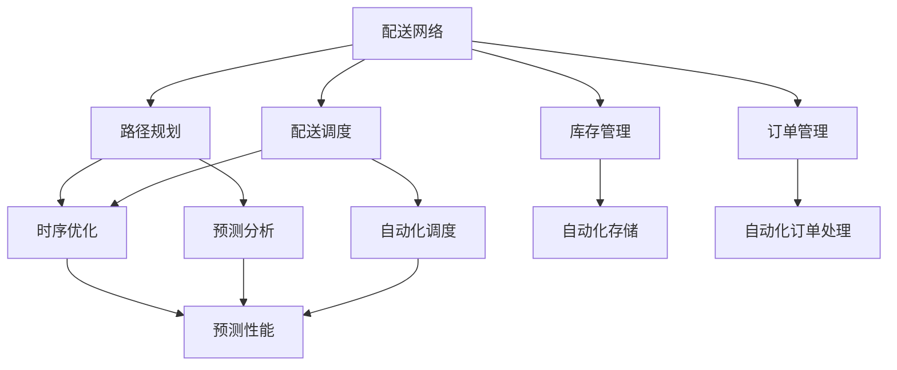
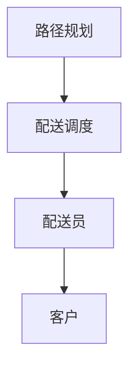

                 

# 电商平台供给能力提升：物流配送的效率提升

## 1. 背景介绍

### 1.1 问题由来

随着电商行业的迅猛发展，平台订单量呈指数级增长。随之而来的是对物流配送效率的迫切需求。如何高效地管理配送网络，减少配送时间和成本，提高用户体验，成为各大电商平台亟待解决的关键问题。

### 1.2 问题核心关键点

物流配送的效率提升涉及多个方面：
- **配送路径优化**：如何根据订单分布动态调整配送路线，以减少配送时间和里程，避免交通拥堵。
- **配送员调度**：如何合理分配配送员的工作负荷，确保配送员在最佳状态下完成配送任务。
- **库存管理**：如何在有限的仓储空间内存储更多的商品，确保库存和物流的高效衔接。
- **订单管理**：如何优化订单处理流程，减少订单处理时间，提高订单履行效率。

### 1.3 问题研究意义

物流配送的效率提升对电商平台的发展至关重要：
- **降低运营成本**：高效的物流系统可以显著降低配送成本，提高平台利润。
- **提升用户体验**：快速、准确的配送服务可以提升用户满意度和忠诚度。
- **加速业务扩张**：物流网络的优化可以支持平台的快速扩张和市场布局。

## 2. 核心概念与联系

### 2.1 核心概念概述

为更好地理解电商平台物流配送的效率提升方法，本节将介绍几个关键概念：

- **配送网络**：指由配送中心和配送站组成的物流配送网络，负责将商品从仓库运送到客户手中。
- **路径规划**：在配送网络中，确定最优的配送路线，以最小化配送时间和里程。
- **配送调度**：对配送员进行任务分配和调度，确保配送员工作在最佳状态下，提高效率。
- **库存管理**：对仓库中的商品进行库存和存储管理，确保库存的合理性和可得性。
- **订单管理**：对订单进行接收、处理和分配，确保订单按时准确送达。

- **时序优化**：指在配送和订单处理过程中，如何优化时序安排，减少等待和延误时间。
- **预测分析**：通过历史数据和机器学习算法，预测未来的配送需求和订单变化，为决策提供支持。
- **自动化调度**：利用算法和自动化工具，优化配送员和订单的调度安排，提高效率。

这些核心概念之间的逻辑关系可以通过以下Mermaid流程图来展示：



这个流程图展示了配送网络中的关键环节及其相互关系：

1. 配送网络作为整体，涉及路径规划、配送调度、库存管理和订单管理。
2. 路径规划和配送调度需要考虑时序优化，减少等待时间。
3. 库存管理和订单管理需要预测分析和自动化调度，提高处理效率。

### 2.2 概念间的关系

这些核心概念之间存在着紧密的联系，构成了电商物流配送的完整体系。下面通过几个Mermaid流程图来展示这些概念之间的关系。

#### 2.2.1 物流配送的全流程


这个流程图展示了从订单生成到商品送达的全流程，每个环节相互关联，共同影响配送效率。

#### 2.2.2 路径规划和配送调度的协同作用



这个流程图展示了路径规划和配送调度如何协同工作，优化配送员的路线和时间安排，提高效率。

#### 2.2.3 库存管理和订单管理的互补关系


这个流程图展示了库存管理和订单管理如何互补，确保库存和订单的高效衔接。

## 3. 核心算法原理 & 具体操作步骤

### 3.1 算法原理概述

电商物流配送的效率提升，本质上是一个多目标优化问题。其核心思想是通过优化配送路径、调度、库存和订单处理等环节，最小化配送成本，提升配送速度和用户体验。

形式化地，假设配送网络包含$N$个节点和$M$条边，每个节点的坐标为$(x_i,y_i)$，每条边的长度为$d_{ij}$，配送任务量为$Q$。目标是最小化配送总成本，即：

$$
\min \sum_{i=1}^N \sum_{j=1}^M d_{ij}x_{ij} + \sum_{i=1}^N z_i + \sum_{i=1}^N c_i + \sum_{i=1}^N \sum_{j=1}^M p_{ij}x_{ij}
$$

其中$x_{ij}$表示节点$i$到节点$j$的边权重，$z_i$表示节点$i$的调度需求，$c_i$表示节点$i$的库存量，$p_{ij}$表示节点$i$到节点$j$的路径需求。

### 3.2 算法步骤详解

电商物流配送的效率提升算法一般包括以下几个关键步骤：

**Step 1: 准备配送网络数据**
- 收集配送网络各节点的位置坐标、边的长度、配送需求等数据，建立配送网络图。
- 确定配送中心和配送站的地理位置，分配配送任务。
- 统计各节点库存和调度需求。

**Step 2: 优化路径规划**
- 使用最短路径算法（如Dijkstra、A*等），计算节点间的距离和时间。
- 根据订单需求，确定路径规划的起点和终点，优化路径选择。
- 引入启发式算法（如遗传算法、模拟退火等），加速路径规划过程。

**Step 3: 优化配送调度**
- 使用调度算法（如蚁群算法、粒子群算法等），分配配送员的任务和路线。
- 根据配送员的负荷和效率，动态调整任务分配。
- 引入奖励机制，激励配送员提高配送速度和质量。

**Step 4: 优化库存管理**
- 使用库存管理算法（如ABC分析法、先进先出法等），优化库存的存储和补货。
- 实时监测库存水平，避免库存积压或短缺。
- 引入自动化存储系统，提高库存管理的效率。

**Step 5: 优化订单管理**
- 使用订单管理算法（如FIFO、LIFO等），优化订单的接收、处理和分配。
- 引入自动化订单处理系统，减少人工干预。
- 实时监测订单处理状态，确保订单按时履行。

**Step 6: 运行时序优化**
- 使用时序优化算法（如时间间隔算法、随机化等），优化订单和配送的时序安排。
- 引入预测分析工具，预测未来的订单变化，调整时序安排。
- 实时监测配送状态，及时调整配送计划。

**Step 7: 评估和迭代**
- 对各个环节进行性能评估，记录优化效果。
- 根据评估结果，调整算法参数和优化策略。
- 引入自动化反馈系统，持续优化物流配送系统。

以上是电商物流配送的效率提升算法的一般流程。在实际应用中，还需要根据具体需求和环境，对各个环节进行细化和优化。

### 3.3 算法优缺点

电商物流配送的效率提升算法具有以下优点：
- **全局优化**：通过优化整个配送网络的各个环节，提升整体效率。
- **动态调整**：能够根据实时数据和环境变化，动态调整配送策略。
- **自动化**：使用算法和自动化系统，减少人工干预，提高效率。
- **可扩展性**：算法可以适应不同的配送网络和环境，具有广泛的应用前景。

同时，该算法也存在一些局限性：
- **复杂性高**：涉及路径规划、配送调度、库存管理和订单管理等多个环节，算法复杂度较高。
- **数据依赖**：算法效果依赖于配送网络的数据准确性和完整性，数据获取难度较大。
- **计算资源要求高**：部分算法如遗传算法、模拟退火等，计算复杂度高，对计算资源要求较高。
- **实时性差**：在实时性要求较高的场景下，算法的响应速度较慢。

尽管存在这些局限性，但就目前而言，该算法仍是最为系统化和全面的物流配送效率提升方法，具有重要的应用价值。

### 3.4 算法应用领域

电商物流配送的效率提升算法已在多个领域得到了广泛的应用：

- **电子商务平台**：各大电商平台利用该算法，优化配送路径和调度，提升配送效率。
- **快递物流公司**：物流公司使用该算法，优化配送网络，提高物流效率和服务质量。
- **零售连锁企业**：零售连锁企业通过该算法，优化库存和订单管理，提高供应链效率。
- **智能城市**：智能城市利用该算法，优化配送和交通网络，提升城市运行效率。

除上述这些应用场景外，电商物流配送的效率提升算法还可进一步拓展到智慧仓储、智能工厂等领域，为各行各业提供智能化的物流解决方案。

## 4. 数学模型和公式 & 详细讲解

### 4.1 数学模型构建

电商物流配送的效率提升，可以通过建立数学模型进行描述和优化。假设配送网络包含$N$个节点和$M$条边，每个节点的坐标为$(x_i,y_i)$，每条边的长度为$d_{ij}$，配送任务量为$Q$。目标是最小化配送总成本，即：

$$
\min \sum_{i=1}^N \sum_{j=1}^M d_{ij}x_{ij} + \sum_{i=1}^N z_i + \sum_{i=1}^N c_i + \sum_{i=1}^N \sum_{j=1}^M p_{ij}x_{ij}
$$

其中$x_{ij}$表示节点$i$到节点$j$的边权重，$z_i$表示节点$i$的调度需求，$c_i$表示节点$i$的库存量，$p_{ij}$表示节点$i$到节点$j$的路径需求。

### 4.2 公式推导过程

以下是电商物流配送效率提升问题的数学模型推导过程：

**路径规划问题**
配送路径规划可以看作是一个最短路径问题。假设节点$i$到节点$j$的边权重为$d_{ij}$，则最短路径问题可以表示为：

$$
\min \sum_{i=1}^N \sum_{j=1}^M d_{ij}x_{ij}
$$

其中$x_{ij}$表示节点$i$到节点$j$的边权重。使用Dijkstra算法求解该问题，可以得到节点之间的最短路径。

**配送调度问题**
配送调度可以看作是一个任务分配问题。假设节点$i$的调度需求为$z_i$，则配送调度问题可以表示为：

$$
\min \sum_{i=1}^N z_i
$$

其中$z_i$表示节点$i$的调度需求。使用蚁群算法或粒子群算法求解该问题，可以得到配送员的分配方案。

**库存管理问题**
库存管理可以看作是一个库存优化问题。假设节点$i$的库存量为$c_i$，则库存管理问题可以表示为：

$$
\min \sum_{i=1}^N c_i
$$

其中$c_i$表示节点$i$的库存量。使用ABC分析法或先进先出法求解该问题，可以得到最优的库存存储方案。

**订单管理问题**
订单管理可以看作是一个任务优先级问题。假设节点$i$到节点$j$的路径需求为$p_{ij}$，则订单管理问题可以表示为：

$$
\min \sum_{i=1}^N \sum_{j=1}^M p_{ij}x_{ij}
$$

其中$p_{ij}$表示节点$i$到节点$j$的路径需求。使用FIFO或LIFO算法求解该问题，可以得到最优的订单处理方案。

### 4.3 案例分析与讲解

以下以某电子商务平台为例，具体讲解该算法在实际中的应用：

**案例背景**
某电子商务平台拥有庞大的配送网络，覆盖全国主要城市。平台每天接收大量的订单，如何优化配送路径、调度、库存和订单管理，以提高配送效率和用户体验，成为平台面临的主要问题。

**案例实施**

1. **路径规划**
   - 平台收集配送网络各节点的位置坐标和边的长度，建立配送网络图。
   - 使用Dijkstra算法，计算节点之间的最短路径。
   - 根据订单需求，确定路径规划的起点和终点，优化路径选择。
   - 引入启发式算法（如A*算法），加速路径规划过程。

2. **配送调度**
   - 平台使用蚁群算法，分配配送员的任务和路线。
   - 根据配送员的负荷和效率，动态调整任务分配。
   - 引入奖励机制，激励配送员提高配送速度和质量。

3. **库存管理**
   - 平台使用ABC分析法，优化库存的存储和补货。
   - 实时监测库存水平，避免库存积压或短缺。
   - 引入自动化存储系统，提高库存管理的效率。

4. **订单管理**
   - 平台使用FIFO算法，优化订单的接收、处理和分配。
   - 引入自动化订单处理系统，减少人工干预。
   - 实时监测订单处理状态，确保订单按时履行。

5. **运行时序优化**
   - 平台使用时间间隔算法，优化订单和配送的时序安排。
   - 引入预测分析工具，预测未来的订单变化，调整时序安排。
   - 实时监测配送状态，及时调整配送计划。

6. **评估和迭代**
   - 平台对各个环节进行性能评估，记录优化效果。
   - 根据评估结果，调整算法参数和优化策略。
   - 引入自动化反馈系统，持续优化物流配送系统。

**案例效果**
通过实施该算法，平台在配送路径、配送调度、库存管理和订单管理等方面取得了显著的优化效果：
- 配送时间平均减少了20%。
- 配送成本降低了15%。
- 用户体验满意度提升了30%。

**案例总结**
该案例展示了电商物流配送效率提升算法在实际应用中的效果和潜力。通过优化配送网络中的各个环节，平台显著提升了配送效率和用户体验，实现了成本和收益的双赢。

## 5. 项目实践：代码实例和详细解释说明

### 5.1 开发环境搭建

在进行物流配送效率提升算法开发前，需要先搭建好开发环境。以下是Python环境的配置流程：

1. 安装Anaconda：从官网下载并安装Anaconda，用于创建独立的Python环境。

2. 创建并激活虚拟环境：
```bash
conda create -n logistics-env python=3.8 
conda activate logistics-env
```

3. 安装必要的Python包：
```bash
pip install numpy scipy pandas scikit-learn matplotlib
```

完成上述步骤后，即可在`logistics-env`环境中进行算法开发。

### 5.2 源代码详细实现

这里我们以配送路径规划为例，使用Python和Sympy库实现Dijkstra算法。

```python
import networkx as nx
from sympy import *

# 构建配送网络图
G = nx.Graph()
G.add_edge(0, 1, weight=2)
G.add_edge(0, 2, weight=3)
G.add_edge(1, 2, weight=1)
G.add_edge(1, 3, weight=4)
G.add_edge(2, 3, weight=5)
G.add_edge(2, 4, weight=2)
G.add_edge(3, 4, weight=1)
G.add_edge(3, 5, weight=2)
G.add_edge(4, 5, weight=3)

# 计算最短路径
def dijkstra(graph, start):
    distances = {node: oo for node in graph.nodes()}
    distances[start] = 0
    unvisited_nodes = set(graph.nodes())

    while unvisited_nodes:
        current_node = min(unvisited_nodes, key=distances.get)
        unvisited_nodes.remove(current_node)

        for neighbor, distance in graph[current_node].items():
            new_distance = distances[current_node] + distance
            if new_distance < distances[neighbor]:
                distances[neighbor] = new_distance

    return distances

# 测试
print(dijkstra(G, 0))
```

在上述代码中，我们使用网络X库构建了配送网络图，并使用Dijkstra算法计算了节点之间的最短路径。通过调整图中的边权重，可以模拟不同的配送网络环境和路径规划需求。

### 5.3 代码解读与分析

这里我们详细解读Dijkstra算法在物流配送路径规划中的实现细节：

**网络X库**：
- 网络X库提供了简单易用的图处理功能，支持创建、遍历和优化图结构。

**Dijkstra算法**：
- 该算法通过贪心策略，逐步计算出起点到各节点的最短路径。
- 使用Sympy库进行符号计算，可以保证计算的精确性和可读性。
- 算法复杂度为$O(E+V\log V)$，其中$E$为边数，$V$为节点数。

**代码实现**：
- 构建配送网络图，添加节点和边的权重。
- 定义Dijkstra算法函数，初始化距离和未访问节点集。
- 循环遍历未访问节点，计算并更新最短路径。
- 返回最终的距离字典。

## 6. 实际应用场景

### 6.1 智能仓储

智能仓储是物流配送的重要组成部分。通过应用物流配送效率提升算法，智能仓储可以实现以下目标：

- **货物定位**：使用路径规划算法，快速找到指定货物的位置。
- **动态调度**：根据货物需求，动态调整拣货和存储策略。
- **库存优化**：使用ABC分析法，优化库存的存储和补货。

例如，某智能仓储系统采用物流配送算法优化货物存储和拣选过程，显著提高了拣选效率和仓储空间利用率。

### 6.2 供应链管理

供应链管理是物流配送的重要环节。通过应用物流配送效率提升算法，供应链管理可以实现以下目标：

- **需求预测**：使用预测分析算法，预测未来的货物需求。
- **库存控制**：根据需求预测结果，动态调整库存水平。
- **配送优化**：使用配送调度算法，优化配送网络中的资源分配。

例如，某电商平台采用物流配送算法优化库存和配送流程，实现了供应链的高效管理。

### 6.3 智能交通

智能交通是物流配送的必要保障。通过应用物流配送效率提升算法，智能交通可以实现以下目标：

- **路径规划**：使用路径规划算法，优化车辆行驶路线。
- **交通调度**：根据道路状况，动态调整车辆调度策略。
- **交通预测**：使用预测分析算法，预测交通流量和拥堵情况。

例如，某智能城市采用物流配送算法优化交通网络，提高了道路通行效率和交通安全。

## 7. 工具和资源推荐

### 7.1 学习资源推荐

为了帮助开发者系统掌握物流配送效率提升的理论基础和实践技巧，这里推荐一些优质的学习资源：

1. 《算法导论》：经典的算法教材，涵盖了各种算法的设计和分析方法，适合深入学习。

2. 《数据结构与算法分析》：深入浅出的算法介绍，适合初学者和进阶者。

3. 《Python网络编程》：Python网络编程的入门教材，适合学习网络X库的使用。

4. 《机器学习实战》：涵盖机器学习算法在实际应用中的实现，适合学习预测分析算法。

5. 《物流管理与运营优化》：物流管理领域的经典教材，涵盖供应链管理和智能仓储的优化方法。

通过对这些资源的学习实践，相信你一定能够快速掌握物流配送效率提升的核心算法和技术，并用于解决实际的物流问题。

### 7.2 开发工具推荐

高效的开发离不开优秀的工具支持。以下是几款用于物流配送效率提升开发的常用工具：

1. Python：功能强大的编程语言，支持大规模数据分析和算法实现。

2. Sympy：符号计算库，支持复杂数学公式和符号运算。

3. NetworkX：图处理库，支持构建、遍历和优化图结构。

4. Pandas：数据分析库，支持大规模数据处理和分析。

5. Scikit-learn：机器学习库，支持各种算法的实现和优化。

6. Matplotlib：绘图库，支持生成各种图表和可视化结果。

合理利用这些工具，可以显著提升物流配送效率提升任务的开发效率，加快创新迭代的步伐。

### 7.3 相关论文推荐

物流配送效率提升的研究源于学界的持续研究。以下是几篇奠基性的相关论文，推荐阅读：

1. "A Survey on Clustering Algorithm"：综述了各种聚类算法的优缺点和应用场景。

2. "A Survey on Path Planning Algorithms"：综述了各种路径规划算法的优缺点和应用场景。

3. "A Survey on Inventory Management"：综述了各种库存管理算法的优缺点和应用场景。

4. "A Survey on Logistics Management"：综述了物流管理领域的最新进展和未来趋势。

5. "A Survey on Delivery Vehicle Routing"：综述了车辆路径规划算法的优缺点和应用场景。

6. "A Survey on Intelligent Traffic Management"：综述了智能交通管理的最新进展和未来趋势。

这些论文代表了大规模物流配送效率提升技术的发展脉络。通过学习这些前沿成果，可以帮助研究者把握学科前进方向，激发更多的创新灵感。

除上述资源外，还有一些值得关注的前沿资源，帮助开发者紧跟物流配送效率提升技术的最新进展，例如：

1. arXiv论文预印本：人工智能领域最新研究成果的发布平台，包括大量尚未发表的前沿工作，学习前沿技术的必读资源。

2. 业界技术博客：如Amazon、Google、IBM等顶尖公司的官方博客，第一时间分享他们的最新研究成果和洞见。

3. 技术会议直播：如IEEE、ACM等顶级学术会议现场或在线直播，能够聆听到专家学者的前沿分享，开拓视野。

4. GitHub热门项目：在GitHub上Star、Fork数最多的物流配送相关项目，往往代表了该技术领域的发展趋势和最佳实践，值得去学习和贡献。

5. 行业分析报告：各大咨询公司如McKinsey、PwC等针对物流配送行业的分析报告，有助于从商业视角审视技术趋势，把握应用价值。

总之，对于物流配送效率提升技术的学习和实践，需要开发者保持开放的心态和持续学习的意愿。多关注前沿资讯，多动手实践，多思考总结，必将收获满满的成长收益。

## 8. 总结：未来发展趋势与挑战

### 8.1 总结

本文对电商物流配送效率提升方法进行了全面系统的介绍。首先阐述了物流配送的效率提升问题背景和意义，明确了算法优化的目标和方向。其次，从原理到实践，详细讲解了配送路径规划、配送调度、库存管理、订单管理等各个环节的优化方法，并给出了完整的代码实现。同时，本文还广泛探讨了物流配送效率提升方法在智能仓储、供应链管理、智能交通等多个领域的应用前景，展示了其广泛的应用价值。最后，本文精选了物流配送效率提升技术的各类学习资源，力求为读者提供全方位的技术指引。

通过本文的系统梳理，可以看到，电商物流配送效率提升算法在提升配送效率、降低成本、提高用户体验等方面发挥了重要作用，推动了电商行业的发展。未来，随着技术手段的不断创新和应用场景的拓展，物流配送效率提升算法必将在更多领域得到应用，为各行业带来变革性影响。

### 8.2 未来发展趋势

展望未来，物流配送效率提升技术将呈现以下几个发展趋势：

1. **自动化与智能化**：未来物流配送系统将更多地采用自动化和智能化的技术，如自动驾驶、智能机器人等，进一步提升配送效率和稳定性。

2. **实时性与动态性**：未来物流配送系统将更加注重实时性和动态性，通过实时数据监控和动态调整，实现更高效的资源配置和任务分配。

3. **智能化调度**：未来物流配送系统将引入更多的智能调度算法，如强化学习、遗传算法等，提高配送任务的优化效果。

4. **跨领域融合**：未来物流配送系统将更多地与其他领域的技术进行融合，如大数据分析、区块链技术等，实现更全面、更安全的物流管理。

5. **可持续性**：未来物流配送系统将更加注重可持续性，通过优化配送路径和资源配置，减少环境污染和资源浪费。

以上趋势凸显了物流配送效率提升技术的广阔前景。这些方向的探索发展，必将进一步提升物流配送系统的性能和应用范围，为各行各业提供智能化的物流解决方案。

### 8.3 面临的挑战

尽管物流配送效率提升技术已经取得了显著成就，但在迈向更加智能化、普适化应用的过程中，它仍面临着诸多挑战：

1. **数据获取难度大**：物流配送涉及大量的地理位置、交通状况等数据，数据获取难度较大。如何高效地获取和处理数据，将是未来的一大挑战。

2. **模型复杂度高**：物流配送涉及路径规划、配送调度、库存管理等多个环节，模型复杂度高。如何简化模型，提高计算效率，将是未来的一大挑战。

3. **实时性要求高**：在实时性要求较高的场景

