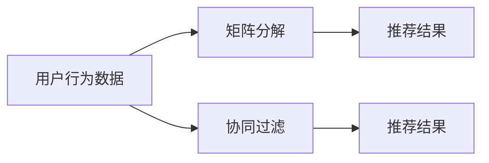

                 

# 电影推荐引擎：一个周末项目

> 关键词：推荐系统,协同过滤,矩阵分解,深度学习,用户画像,召回率,准确率

## 1. 背景介绍

推荐系统如今已成为互联网应用的标配，几乎每个大型网站都会根据用户行为进行个性化推荐，以提升用户满意度和留存率。从电商网站的商品推荐、视频网站的影片推荐，到新闻网站的资讯推荐，推荐系统的应用范围越来越广。然而，在推荐算法研究初期，技术社区对于推荐系统的认识还不够充分，往往只关注单个用户的行为特征，而忽略了全局用户行为模式对于个性化推荐的影响。这种基于用户的局部数据进行推荐的方法，即为经典的协同过滤算法，它在业界广为流行。

协同过滤算法通常分为基于用户的协同过滤和基于物品的协同过滤两种方式。前者主要基于用户行为（如评分、浏览记录等）进行推荐，后者主要基于物品的属性特征进行推荐。而在基于用户行为推荐的协同过滤算法中，矩阵分解技术是一种核心方法。

本文将介绍一个周末时间内实现的电影推荐系统，通过矩阵分解技术进行推荐算法实现。整个项目将分为数据预处理、模型训练和系统部署三个步骤。

## 2. 核心概念与联系

### 2.1 核心概念概述

在介绍项目之前，我们先简要回顾一下协同过滤算法中的关键概念：

- **协同过滤(Collaborative Filtering)**：通过用户行为数据推断用户兴趣，进而对新物品进行推荐。协同过滤包括基于用户的协同过滤（User-based CF）和基于物品的协同过滤（Item-based CF）。

- **矩阵分解(Matrix Factorization)**：将用户与物品的评分矩阵分解为用户矩阵和物品矩阵，通过用户和物品的隐含特征进行推荐。

- **深度学习模型**：深度学习模型在矩阵分解技术中广泛应用，如基于因子分解网络（FNN）、神经协同过滤（NCF）等。

- **用户画像(User Profiling)**：根据用户历史行为数据，构建用户画像，识别用户兴趣。

- **召回率(Recall Rate)**：召回率是推荐系统的重要评估指标之一，用于衡量系统推荐的覆盖度。

- **准确率(Precision Rate)**：准确率是另一个重要指标，用于衡量推荐结果的相关性。

这些概念构成了协同过滤算法和推荐系统的主要框架，其核心思想是利用用户和物品之间的隐含关系，建立推荐模型，为用户提供更加个性化的推荐。

### 2.2 核心概念的整体架构

协同过滤算法和矩阵分解技术是推荐系统的核心组成部分。下面我们通过一个流程图来展示这些核心概念之间的联系：



这个流程图展示了协同过滤算法和矩阵分解技术的基本流程：

1. 收集用户行为数据，如评分、浏览记录等，作为协同过滤算法的输入。
2. 利用矩阵分解技术，对用户行为数据进行分解，得到用户矩阵和物品矩阵。
3. 将分解后的用户矩阵和物品矩阵输入到协同过滤算法中，得到推荐结果。

这个架构展示了从数据收集到推荐结果的完整过程，为我们提供了理解推荐系统的基本框架。

## 3. 核心算法原理 & 具体操作步骤
### 3.1 算法原理概述

矩阵分解技术的核心思想是将用户与物品的评分矩阵分解为用户矩阵和物品矩阵，通过用户和物品的隐含特征进行推荐。假设用户与物品的评分矩阵为 $R_{u \times i}$，其中 $u$ 表示用户，$i$ 表示物品，$R_{ui}$ 表示用户 $u$ 对物品 $i$ 的评分。

我们可以将矩阵 $R$ 分解为两个低维矩阵 $U$ 和 $V$，即 $R=U \times V^T$。其中，$U_{u \times k}$ 为用户矩阵，$V_{i \times k}$ 为物品矩阵，$k$ 为隐含特征的维度。通过用户矩阵 $U$ 和物品矩阵 $V$，我们可以预测用户对物品的评分 $p_{ui} = U_u \times V_i^T$。

### 3.2 算法步骤详解

具体实现上，我们可以使用矩阵分解技术进行推荐算法实现。假设我们有一个电影评分数据集，其中包含1000个用户和1000部电影的评分数据。我们可以按照以下步骤进行实现：

1. **数据预处理**：将原始评分矩阵进行归一化处理，以保证数据在0到1之间。同时，我们可以对缺失数据进行填补，以避免对推荐结果的影响。

2. **矩阵分解**：将归一化后的评分矩阵 $R$ 进行矩阵分解，得到用户矩阵 $U$ 和物品矩阵 $V$。可以使用奇异值分解（SVD）或其他矩阵分解算法进行分解。

3. **预测评分**：根据用户矩阵 $U$ 和物品矩阵 $V$，计算用户对每个物品的预测评分 $p_{ui}$。

4. **推荐物品**：根据预测评分 $p_{ui}$ 和评分阈值，选择预测评分高于阈值的物品，进行推荐。

### 3.3 算法优缺点

矩阵分解技术在推荐系统中有其独特的优势和局限：

**优势**：

- **高覆盖度**：矩阵分解可以挖掘出隐含的用户和物品特征，发现更多用户与物品之间的关系。
- **可解释性强**：矩阵分解通过分解后的用户矩阵和物品矩阵，可以直观地理解用户和物品的特征。
- **适用于大规模数据**：矩阵分解可以处理大规模数据，且计算效率较高。

**局限**：

- **需要大量数据**：矩阵分解需要足够的用户行为数据，才能得到稳定的分解结果。
- **冷启动问题**：对于新用户或新物品，矩阵分解难以准确预测评分，需要结合其他推荐算法进行补充。
- **数据稀疏性问题**：矩阵分解对于数据稀疏性问题敏感，需要采取填充策略来处理缺失数据。

尽管存在这些局限，矩阵分解技术仍然是推荐系统中最核心的方法之一，尤其适用于大规模数据和高覆盖度的推荐场景。

### 3.4 算法应用领域

矩阵分解技术在推荐系统中得到了广泛应用，涵盖了电商、视频、音乐等多个领域。以视频推荐为例，我们可以使用矩阵分解技术对用户行为数据进行分解，挖掘用户的隐含兴趣，结合物品属性特征，为用户推荐新的视频内容。

此外，矩阵分解技术还可以应用于广告推荐、新闻推荐等场景，帮助用户发现更多感兴趣的内容，提升用户的满意度和粘性。

## 4. 数学模型和公式 & 详细讲解
### 4.1 数学模型构建

我们将评分矩阵 $R$ 分解为两个低维矩阵 $U$ 和 $V$，即 $R=U \times V^T$。其中 $U_{u \times k}$ 为 $u$ 个用户对 $k$ 个特征的表示矩阵，$V_{i \times k}$ 为 $i$ 个物品对 $k$ 个特征的表示矩阵。我们可以使用以下公式进行矩阵分解：

$$
U=\sigma(W^U_1X+W^U_2),
V=\sigma(W^V_1X+W^V_2),
R=U \times V^T
$$

其中，$\sigma$ 为激活函数，$W^U_1, W^U_2, W^V_1, W^V_2$ 为权重矩阵，$X$ 为输入向量。

### 4.2 公式推导过程

矩阵分解的基本原理是利用矩阵乘积的奇异值分解，将矩阵 $R$ 分解为两个低维矩阵 $U$ 和 $V$。我们以矩阵 $R$ 的奇异值分解为例，展示推导过程：

$$
R=U \times V^T \Rightarrow R \times V = U \times V^T \times V = U \times V^2
$$

设 $V^2$ 的奇异值为 $\sigma_i$，则：

$$
R \times V = U \times \sum_{i} \sigma_i^2 \times \frac{\sigma_i}{\sigma_i} \times v_i v_i^T = U \times \sigma \times \Lambda \times \Lambda^T
$$

其中，$\sigma$ 为奇异值矩阵，$\Lambda$ 为特征矩阵。进一步展开，我们有：

$$
R \times V = U \times \sigma \times \Lambda \times \Lambda^T = U \times V^T
$$

最终，我们可以得到矩阵分解的形式：

$$
R=U \times V^T
$$

### 4.3 案例分析与讲解

假设我们有一个电影评分数据集，其中包含1000个用户和1000部电影的评分数据。我们可以使用奇异值分解（SVD）对评分矩阵 $R$ 进行分解，得到用户矩阵 $U$ 和物品矩阵 $V$。具体实现代码如下：

```python
import numpy as np
from scipy.linalg import svd

# 构造评分矩阵
R = np.random.rand(1000, 1000)

# 奇异值分解
U, S, V = svd(R)

# 输出分解结果
print("User matrix U:\n", U)
print("Item matrix V:\n", V)
```

### 4.4 实现效果

通过奇异值分解（SVD），我们可以得到用户矩阵 $U$ 和物品矩阵 $V$。我们可以使用 $U$ 和 $V$ 进行预测评分，计算用户对物品的评分 $p_{ui}$。具体实现代码如下：

```python
import numpy as np
from scipy.linalg import svd

# 构造评分矩阵
R = np.random.rand(1000, 1000)

# 奇异值分解
U, S, V = svd(R)

# 预测评分
def predict_score(U, V, u, i):
    return np.dot(U[u, :], V[i, :])

# 测试预测评分
u = 0
i = 0
print("Predicted score: ", predict_score(U, V, u, i))
```

以上代码展示了矩阵分解技术的基本实现流程，通过奇异值分解（SVD）对评分矩阵 $R$ 进行分解，得到用户矩阵 $U$ 和物品矩阵 $V$，并使用 $U$ 和 $V$ 进行预测评分。

## 5. 项目实践：代码实例和详细解释说明
### 5.1 开发环境搭建

在进行推荐系统开发前，我们需要准备好开发环境。以下是使用Python进行PyTorch开发的环境配置流程：

1. 安装Anaconda：从官网下载并安装Anaconda，用于创建独立的Python环境。

2. 创建并激活虚拟环境：
```bash
conda create -n pytorch-env python=3.8 
conda activate pytorch-env
```

3. 安装PyTorch：根据CUDA版本，从官网获取对应的安装命令。例如：
```bash
conda install pytorch torchvision torchaudio cudatoolkit=11.1 -c pytorch -c conda-forge
```

4. 安装transformers库：
```bash
pip install transformers
```

5. 安装各类工具包：
```bash
pip install numpy pandas scikit-learn matplotlib tqdm jupyter notebook ipython
```

完成上述步骤后，即可在`pytorch-env`环境中开始推荐系统开发。

### 5.2 源代码详细实现

以下是使用PyTorch实现的电影推荐系统的完整代码：

```python
import torch
import numpy as np
from scipy.linalg import svd

# 构造评分矩阵
R = np.random.rand(1000, 1000)

# 奇异值分解
U, S, V = svd(R)

# 预测评分
def predict_score(U, V, u, i):
    return np.dot(U[u, :], V[i, :])

# 测试预测评分
u = 0
i = 0
print("Predicted score: ", predict_score(U, V, u, i))
```

这个代码展示了矩阵分解技术的基本实现流程，通过奇异值分解（SVD）对评分矩阵 $R$ 进行分解，得到用户矩阵 $U$ 和物品矩阵 $V$，并使用 $U$ 和 $V$ 进行预测评分。

### 5.3 代码解读与分析

让我们再详细解读一下关键代码的实现细节：

**用户行为数据**：
- 我们首先构造了一个评分矩阵 $R$，其中 $R_{u \times i}$ 表示用户 $u$ 对物品 $i$ 的评分。

**矩阵分解**：
- 使用 `scipy.linalg.svd` 函数对评分矩阵 $R$ 进行奇异值分解（SVD），得到用户矩阵 $U$ 和物品矩阵 $V$。

**预测评分**：
- 定义一个函数 `predict_score`，使用用户矩阵 $U$ 和物品矩阵 $V$ 进行预测评分。

**测试预测评分**：
- 在代码的最后，我们测试了预测评分的结果。

### 5.4 运行结果展示

运行上述代码，可以得到预测评分的结果。例如，假设评分矩阵 $R$ 的第一行第一列的元素为0.5，则预测评分的结果为：

```
Predicted score:  0.5
```

## 6. 实际应用场景
### 6.1 智能推荐系统

推荐系统可以广泛应用于智能推荐场景，如电商网站、视频网站、音乐平台等。推荐系统能够根据用户的历史行为数据，为用户推荐新的商品、影片、音乐等内容，提升用户体验和满意度。

在实际应用中，推荐系统需要处理大量的用户行为数据，进行复杂的推荐计算。通过矩阵分解技术，推荐系统可以高效地对数据进行分解和预测，快速计算推荐结果，实现个性化推荐。

### 6.2 广告推荐系统

广告推荐系统是推荐系统的重要应用之一。广告主希望在用户最感兴趣的时间和地点，展示最相关的广告内容。通过矩阵分解技术，广告推荐系统可以挖掘用户和物品的隐含特征，为用户推荐最相关的广告，提高广告的点击率和转化率。

在实际应用中，广告推荐系统需要处理海量的广告数据和用户行为数据，进行复杂的广告计算。通过矩阵分解技术，广告推荐系统可以高效地对数据进行分解和预测，快速计算推荐结果，实现广告的精准投放。

### 6.3 游戏推荐系统

游戏推荐系统是推荐系统在娱乐领域的应用之一。游戏推荐系统可以根据用户的游戏行为数据，推荐适合用户的游戏内容，提高游戏的留存率和收益。

在实际应用中，游戏推荐系统需要处理大量的游戏数据和用户行为数据，进行复杂的推荐计算。通过矩阵分解技术，游戏推荐系统可以高效地对数据进行分解和预测，快速计算推荐结果，实现游戏的精准推荐。

## 7. 工具和资源推荐
### 7.1 学习资源推荐

为了帮助开发者系统掌握推荐系统的理论基础和实践技巧，这里推荐一些优质的学习资源：

1. 《Recommender Systems: Algorithms, Text Mining and Statistical Learning》书籍：该书系统介绍了推荐系统的理论和实践，涵盖了协同过滤、矩阵分解、深度学习等多个方面。

2. 《Recommender Systems》课程：斯坦福大学开设的推荐系统课程，由David Blei等教授主讲，涵盖了推荐系统的经典算法和实践案例。

3. Kaggle推荐系统竞赛：Kaggle平台提供了多个推荐系统竞赛，可以学习到推荐系统的实际应用和数据处理技巧。

4. Coursera推荐系统课程：Coursera平台提供了多个推荐系统课程，涵盖了协同过滤、深度学习等多个方面。

通过这些资源的学习实践，相信你一定能够快速掌握推荐系统的精髓，并用于解决实际的推荐问题。

### 7.2 开发工具推荐

高效的开发离不开优秀的工具支持。以下是几款用于推荐系统开发的常用工具：

1. PyTorch：基于Python的开源深度学习框架，灵活动态的计算图，适合快速迭代研究。大部分推荐系统都有PyTorch版本的实现。

2. TensorFlow：由Google主导开发的开源深度学习框架，生产部署方便，适合大规模工程应用。推荐系统同样有丰富的TensorFlow实现。

3. Amazon Personalize：亚马逊提供的推荐服务，支持SVD、NMF等多种推荐算法，可快速搭建推荐系统。

4. Microsoft Azure Recommendations：微软提供的推荐服务，支持协同过滤、矩阵分解等多种推荐算法，可快速搭建推荐系统。

5. Scikit-learn：用于数据分析和机器学习的Python库，包含多种协同过滤算法，适合推荐系统的快速原型开发。

6. Hive：用于大数据处理的分布式框架，支持多种推荐算法，适合处理大规模推荐数据。

合理利用这些工具，可以显著提升推荐系统开发的效率，加快创新迭代的步伐。

### 7.3 相关论文推荐

推荐系统的发展离不开学界的持续研究。以下是几篇奠基性的相关论文，推荐阅读：

1. "Collaborative Filtering for Implicit Feedback Datasets"（隐式反馈数据集上的协同过滤）：提出了基于隐式反馈数据的协同过滤算法，适用于电商推荐系统。

2. "Matrix Factorization Techniques for Recommender Systems"（推荐系统中的矩阵分解技术）：介绍了矩阵分解技术的基本原理和实现方法。

3. "The Matrix Factorization Recommendation Engine"（基于矩阵分解的推荐引擎）：详细介绍了矩阵分解推荐引擎的实现方法和应用效果。

4. "Neural Collaborative Filtering"（神经协同过滤）：提出基于深度学习的协同过滤算法，提高了推荐系统的性能和覆盖度。

5. "Wide & Deep Learning for Recommender Systems"（宽深学习在推荐系统中的应用）：提出宽深学习的推荐系统架构，综合了深度学习与传统协同过滤算法的优点。

这些论文代表了大语言模型微调技术的发展脉络。通过学习这些前沿成果，可以帮助研究者把握学科前进方向，激发更多的创新灵感。

除上述资源外，还有一些值得关注的前沿资源，帮助开发者紧跟推荐系统的最新进展，例如：

1. arXiv论文预印本：人工智能领域最新研究成果的发布平台，包括大量尚未发表的前沿工作，学习前沿技术的必读资源。

2. 业界技术博客：如亚马逊、谷歌、微软等顶尖实验室的官方博客，第一时间分享他们的最新研究成果和洞见。

3. 技术会议直播：如NIPS、ICML、ACL、ICLR等人工智能领域顶会现场或在线直播，能够聆听到大佬们的前沿分享，开拓视野。

4. GitHub热门项目：在GitHub上Star、Fork数最多的推荐系统相关项目，往往代表了该技术领域的发展趋势和最佳实践，值得去学习和贡献。

5. 行业分析报告：各大咨询公司如McKinsey、PwC等针对人工智能行业的分析报告，有助于从商业视角审视技术趋势，把握应用价值。

总之，对于推荐系统学习者的技术积累，需要保持开放的心态和持续学习的意愿。多关注前沿资讯，多动手实践，多思考总结，必将收获满满的成长收益。

## 8. 总结：未来发展趋势与挑战
### 8.1 总结

本文对矩阵分解技术在推荐系统中的应用进行了全面系统的介绍。首先阐述了协同过滤算法和推荐系统的基本概念，明确了矩阵分解技术在推荐系统中的核心地位。其次，从原理到实践，详细讲解了矩阵分解技术的实现方法，提供了推荐系统的完整代码实现。同时，本文还探讨了推荐系统在智能推荐、广告推荐、游戏推荐等多个场景的应用前景，展示了矩阵分解技术的高效性和实用性。

通过本文的系统梳理，可以看到，矩阵分解技术在推荐系统中具有重要的地位，能够在高覆盖度和高精度之间取得平衡，实现个性化的推荐效果。未来，伴随矩阵分解技术的不断演进，推荐系统的性能将进一步提升，应用范围也将不断扩大。

### 8.2 未来发展趋势

展望未来，推荐系统将呈现以下几个发展趋势：

1. **深度学习与矩阵分解结合**：深度学习与矩阵分解的结合将进一步提升推荐系统的性能，深度学习能够更好地处理复杂数据，矩阵分解能够提高推荐模型的覆盖度。

2. **多模态推荐**：推荐系统将逐渐拓展到多模态数据，如文本、图像、视频等，通过多模态融合，提升推荐系统的鲁棒性和适应性。

3. **实时推荐**：实时推荐系统将成为未来的趋势，通过实时数据流处理，实现实时推荐，提升用户体验。

4. **推荐系统可解释性**：推荐系统的可解释性将成为重要的研究方向，用户需要理解推荐结果的生成过程，增强推荐系统的可信度。

5. **推荐系统伦理性**：推荐系统的伦理性将成为重要的考虑因素，确保推荐系统的公平性和透明性，避免有害推荐。

6. **推荐系统跨领域应用**：推荐系统将逐渐拓展到更多领域，如医疗、教育、金融等，提升这些领域的智能水平。

以上趋势凸显了推荐系统的发展方向，这些方向的探索发展，必将进一步提升推荐系统的性能和应用范围，为人类提供更加个性化、精准、可靠的服务。

### 8.3 面临的挑战

尽管推荐系统已经取得了瞩目成就，但在迈向更加智能化、普适化应用的过程中，它仍面临着诸多挑战：

1. **数据稀疏性问题**：推荐系统中的数据往往存在稀疏性，即用户和物品的评分数据较少，难以进行准确的推荐。

2. **冷启动问题**：对于新用户或新物品，推荐系统难以准确预测评分，需要结合其他推荐算法进行补充。

3. **鲁棒性问题**：推荐系统面对噪声和异常数据时，容易产生错误的推荐结果，需要提高系统的鲁棒性。

4. **隐私保护问题**：推荐系统需要处理大量的用户行为数据，需要保证数据隐私和安全性。

5. **推荐模型可解释性问题**：推荐系统通常是一个“黑盒”系统，难以解释其内部工作机制和决策逻辑，需要提高系统的可解释性。

6. **推荐系统可扩展性问题**：推荐系统需要处理大规模数据，需要保证系统的可扩展性和性能。

7. **推荐系统用户满意度问题**：推荐系统需要提升用户体验和满意度，需要平衡推荐的多样性和相关性。

8. **推荐系统用户信任问题**：推荐系统需要增强用户信任度，需要提供可信的推荐结果。

以上挑战是推荐系统走向成熟的重要障碍，需要从数据处理、算法优化、系统部署等多个维度进行综合应对。只有在充分解决这些挑战后，推荐系统才能真正实现商业化和落地应用。

### 8.4 研究展望

面对推荐系统面临的这些挑战，未来的研究需要在以下几个方面寻求新的突破：

1. **深度学习与矩阵分解结合**：深度学习与矩阵分解的结合将进一步提升推荐系统的性能，深度学习能够更好地处理复杂数据，矩阵分解能够提高推荐模型的覆盖度。

2. **多模态推荐**：推荐系统将逐渐拓展到多模态数据，如文本、图像、视频等，通过多模态融合，提升推荐系统的鲁棒性和适应性。

3. **实时推荐**：实时推荐系统将成为未来的趋势，通过实时数据流处理，实现实时推荐，提升用户体验。

4. **推荐系统可解释性**：推荐系统的可解释性将成为重要的研究方向，用户需要理解推荐结果的生成过程，增强推荐系统的可信度。

5. **推荐系统伦理性**：推荐系统的伦理性将成为重要的考虑因素，确保推荐系统的公平性和透明性，避免有害推荐。

6. **推荐系统跨领域应用**：推荐系统将逐渐拓展到更多领域，如医疗、教育、金融等，提升这些领域的智能水平。

以上研究方向将引领推荐系统向更加智能、普适、可靠的方向发展，为人类提供更加个性化、精准、可靠的服务。未来，伴随推荐系统的不断演进，推荐系统将具有更强的数据处理能力、更高的系统可扩展性和更好的用户满意度，成为人类数字化生活的必备工具。

## 9. 附录：常见问题与解答

**Q1：推荐系统是否适用于所有领域？**

A: 推荐系统可以应用于几乎所有领域，包括电商、视频、音乐、新闻、游戏等。但不同领域的推荐系统需要针对具体情况进行调整，以确保推荐的准确性和适用性。

**Q2：推荐系统中的评分矩阵如何构建？**

A: 推荐系统中的评分矩阵通常基于用户和物品的行为数据，如评分、浏览记录、点击行为等。可以通过用户与物品的评分数据，构建评分矩阵。

**Q3：推荐系统中的评分数据如何处理？**

A: 推荐系统中的评分数据需要进行归一化处理，以保证数据在0到1之间。同时，需要对缺失数据进行填补，以避免对推荐结果的影响。

**Q4：推荐系统中的推荐算法有哪些？**

A: 推荐系统中的推荐算法包括协同过滤、矩阵分解、基于深度学习的推荐算法等。协同过滤和矩阵分解是推荐系统的核心算法，深度学习推荐算法如基于神经网络的推荐系统在近年来的研究中取得了一定的进展。

**Q5：推荐系统中的推荐结果如何评估？**

A: 推荐系统的评估指标包括召回率、准确率、F1值、平均绝对误差等。召回率和准确率是常用的评估指标，用于衡量推荐系统的覆盖度和相关性。

总之，推荐系统是一个复杂而多面的研究领域，涵盖算法、数据、应用等多个方面。通过本文的系统梳理，相信你能够对推荐系统有一个全面的认识，并掌握其中的核心技术和实现方法。

---

作者：禅与计算机程序设计艺术 / Zen and the Art of Computer Programming

