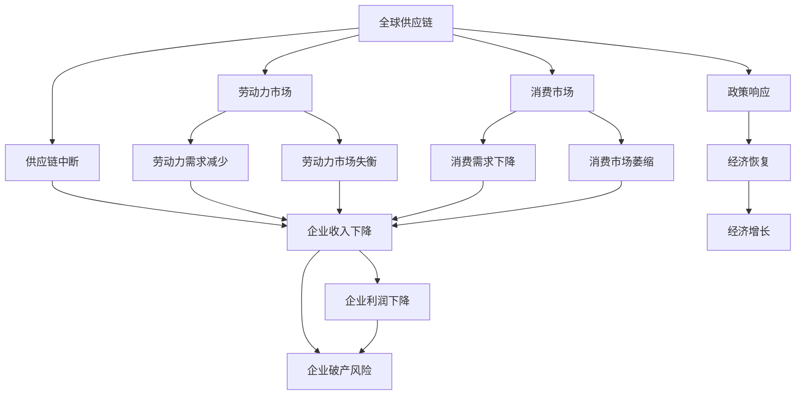
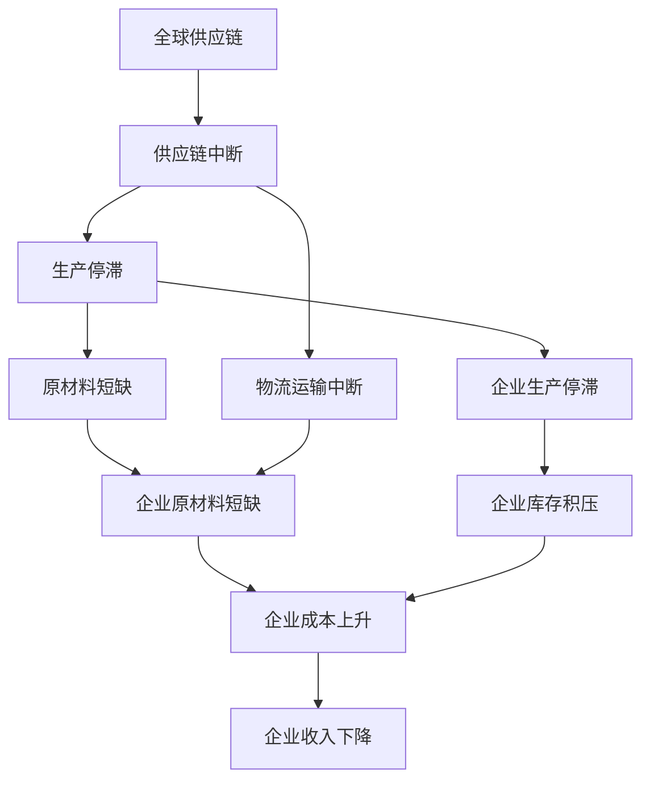
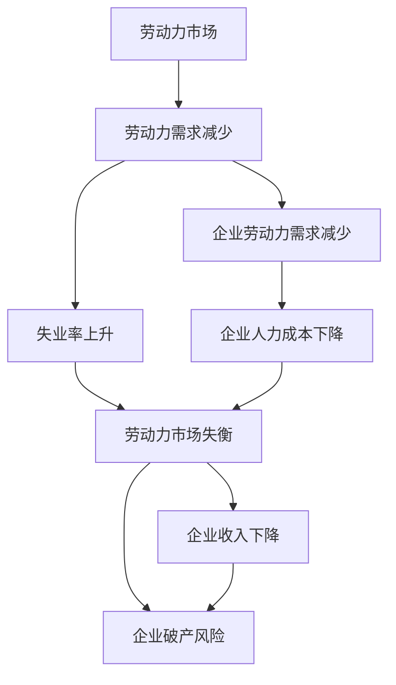
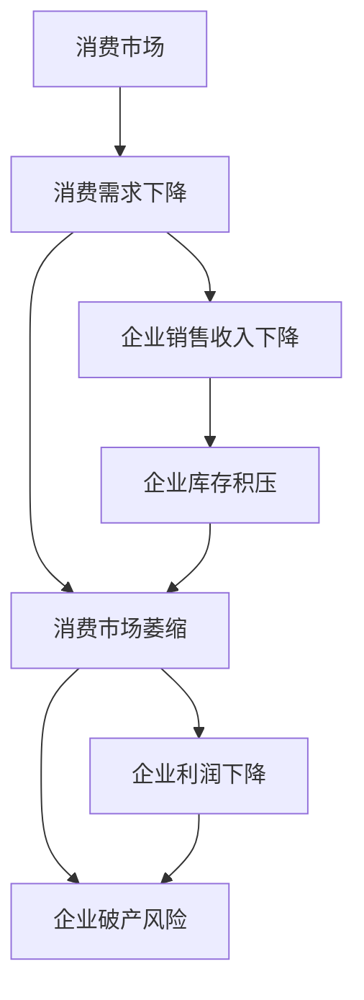
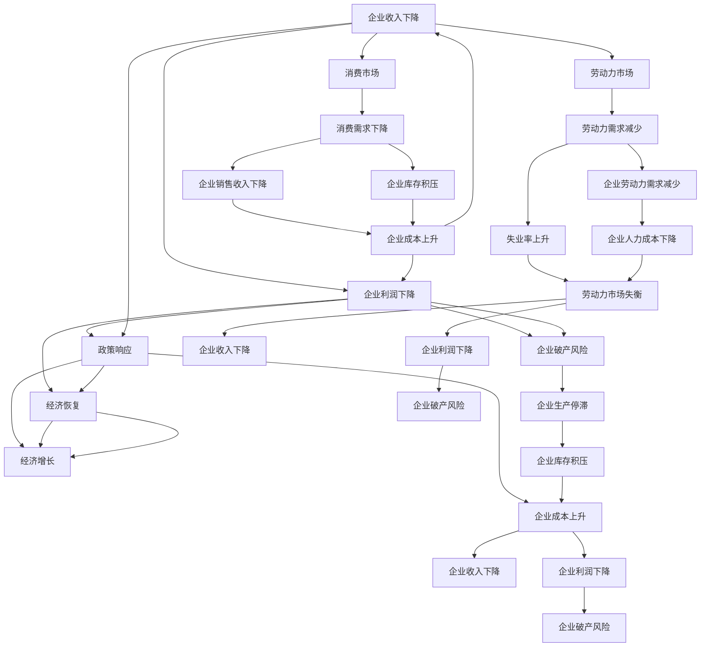

                 

# 疫情冲击对全球经济的影响

## 1. 背景介绍

### 1.1 问题由来

新冠疫情（COVID-19）自2019年底暴发以来，迅速蔓延至全球，对全球经济带来了前所未有的冲击。这场突如其来的灾难，不仅直接导致了各国医疗系统的超负荷运行，还引发了全球供应链的中断、劳动力市场的瘫痪、消费市场的崩溃。据世界银行预测，新冠疫情将使2020年全球经济增长率下降5.3%，是二战结束以来最严重的衰退。

### 1.2 问题核心关键点

疫情对全球经济的影响可以从以下几个关键维度来分析：

1. **供应链中断**：疫情导致全球物流运输中断，导致企业原材料短缺、生产停滞，对供应链依赖程度高的制造业受到重大冲击。
2. **劳动力市场失衡**：疫情导致劳动力市场需求锐减，失业率大幅上升，尤其是旅游、餐饮、零售等服务行业受影响严重。
3. **消费市场萎缩**：疫情导致消费者信心下降，非必要消费需求大幅减少，尤其是线下实体零售和旅游业受到打击。
4. **企业利润下降**：疫情导致企业收入下降，部分企业尤其是中小企业面临破产风险，整体市场盈利能力减弱。
5. **政策响应滞后**：各国政策反应滞后，导致市场波动剧烈，投资者信心受损，金融市场波动加剧。

### 1.3 问题研究意义

研究新冠疫情对全球经济的影响，有助于全面理解疫情对经济活动的多维度冲击，为政策制定者提供科学依据，指导未来经济恢复和发展的策略。通过深入分析疫情导致的经济波动及其深层原因，可以发现经济系统中的脆弱点，为防范未来类似危机提供参考。

## 2. 核心概念与联系

### 2.1 核心概念概述

为更好地理解疫情对全球经济的影响，本节将介绍几个核心概念及其联系：

- **全球供应链**：全球供应链是指跨国公司在全球范围内组织生产和物流，将产品从原材料到最终消费品的所有环节链接起来的系统。供应链的任何一个环节中断，都会影响整个系统的稳定性。
- **劳动力市场**：劳动力市场是指劳动力的供需关系，其变化反映了经济活动的变化。疫情期间，劳动力需求骤减，失业率上升。
- **消费市场**：消费市场是指消费者购买商品和服务的市场。疫情导致消费者信心下降，消费需求减少。
- **企业盈利能力**：企业盈利能力是指企业在一定时期内实现利润的能力，受到经济波动的影响。疫情期间，企业收入下降，盈利能力减弱。
- **政策响应**：政策响应是指政府采取的经济和金融政策措施，以缓解经济冲击，稳定市场。

这些核心概念之间的逻辑关系可以通过以下Mermaid流程图来展示：



这个流程图展示了疫情对全球供应链、劳动力市场、消费市场和企业盈利能力的影响，以及政策响应如何影响经济恢复和增长。

### 2.2 概念间的关系

这些核心概念之间存在着紧密的联系，构成了疫情对全球经济影响的全貌。下面我们通过几个Mermaid流程图来展示这些概念之间的关系。

#### 2.2.1 供应链中断对经济的影响



这个流程图展示了供应链中断对企业生产、库存和成本的影响，最终导致企业收入下降。

#### 2.2.2 劳动力市场失衡对经济的影响



这个流程图展示了劳动力市场失衡对企业收入和盈利的直接影响，以及失业率上升带来的社会问题。

#### 2.2.3 消费市场萎缩对经济的影响



这个流程图展示了消费市场萎缩对企业销售、库存和盈利的直接影响。

### 2.3 核心概念的整体架构

最后，我们用一个综合的流程图来展示这些核心概念在全球经济中的整体架构：



这个综合流程图展示了从全球供应链到消费市场和企业盈利能力的影响路径，以及政策响应如何影响经济恢复和增长。通过这些流程图，我们可以更清晰地理解疫情对全球经济的多维度冲击。

## 3. 核心算法原理 & 具体操作步骤
### 3.1 算法原理概述

新冠疫情对全球经济的影响，可以从以下几个方面进行分析：

- **供应链中断分析**：通过供应链中断模型，分析供应链中断对企业生产和成本的影响。
- **劳动力市场失衡分析**：通过劳动力市场模型，分析失业率上升对企业人力成本和盈利的直接影响。
- **消费市场萎缩分析**：通过消费市场模型，分析消费需求下降对企业销售和库存的影响。
- **企业盈利能力分析**：通过企业盈利模型，分析收入下降对企业利润和破产风险的影响。
- **政策响应分析**：通过政策响应模型，分析政府措施对经济恢复和增长的影响。

### 3.2 算法步骤详解

#### 3.2.1 供应链中断分析

1. **数据准备**：收集全球供应链数据，包括原材料供应、生产、物流运输等环节的信息。
2. **模型建立**：建立供应链中断模型，分析中断对企业生产和成本的影响。
3. **结果分析**：分析供应链中断对企业收入和盈利的直接影响。

#### 3.2.2 劳动力市场失衡分析

1. **数据准备**：收集劳动力市场数据，包括失业率、企业劳动力需求等。
2. **模型建立**：建立劳动力市场模型，分析失业率上升对企业人力成本和盈利的直接影响。
3. **结果分析**：分析劳动力市场失衡对企业收入和盈利的直接影响。

#### 3.2.3 消费市场萎缩分析

1. **数据准备**：收集消费市场数据，包括消费需求、企业销售收入等。
2. **模型建立**：建立消费市场模型，分析消费需求下降对企业销售和库存的影响。
3. **结果分析**：分析消费市场萎缩对企业收入和盈利的直接影响。

#### 3.2.4 企业盈利能力分析

1. **数据准备**：收集企业盈利数据，包括企业收入、成本、利润等。
2. **模型建立**：建立企业盈利模型，分析收入下降对企业利润和破产风险的影响。
3. **结果分析**：分析企业盈利能力下降对企业收入和盈利的直接影响。

#### 3.2.5 政策响应分析

1. **数据准备**：收集政策响应数据，包括政府措施、市场反应等。
2. **模型建立**：建立政策响应模型，分析政府措施对经济恢复和增长的影响。
3. **结果分析**：分析政策响应对经济恢复和增长的影响。

### 3.3 算法优缺点

新冠疫情对全球经济的影响分析，具有以下优点：

- **多维度分析**：从供应链、劳动力市场、消费市场和企业盈利能力等多个维度，全面分析疫情对经济的影响。
- **数据驱动**：依赖大量数据驱动分析，提高了分析的准确性和可靠性。
- **政策建议**：通过分析，可以提出有效的政策建议，指导经济恢复和发展的策略。

同时，该方法也存在以下缺点：

- **数据获取难度大**：全球供应链、劳动力市场、消费市场和企业盈利能力的数据获取难度较大，数据质量和完整性有待提高。
- **模型复杂性高**：多维度分析需要建立多个复杂模型，模型构建和验证的工作量大。
- **政策实施滞后**：政策响应模型的结果可能滞后于实际情况，无法实时反映市场变化。

### 3.4 算法应用领域

新冠疫情对全球经济的影响分析，可以应用于以下领域：

- **政府决策**：为政府制定经济政策提供科学依据，指导经济恢复和发展的策略。
- **企业战略调整**：帮助企业应对供应链中断、劳动力市场失衡、消费市场萎缩等问题，调整战略布局。
- **市场预测**：分析政策响应对经济恢复和增长的影响，预测市场走势，帮助投资者制定投资策略。

## 4. 数学模型和公式 & 详细讲解 & 举例说明（备注：数学公式请使用latex格式，latex嵌入文中独立段落使用 $$，段落内使用 $)
### 4.1 数学模型构建

本文将使用数学语言对新冠疫情对全球经济的影响进行分析。假设全球供应链的运行效率为 $E(t)$，劳动力市场的失业率为 $U(t)$，消费市场的消费需求为 $C(t)$，企业的收入为 $I(t)$，利润为 $P(t)$，政府的政策响应强度为 $R(t)$。则模型可以表示为：

$$
E(t) = f(S(t),P(t),R(t))
$$

$$
U(t) = g(E(t),I(t),R(t))
$$

$$
C(t) = h(U(t),I(t),R(t))
$$

$$
I(t) = m(C(t),E(t),R(t))
$$

$$
P(t) = n(I(t),U(t),R(t))
$$

其中，$f$、$g$、$h$、$m$、$n$ 为相应模型函数。

### 4.2 公式推导过程

#### 4.2.1 供应链中断模型

供应链中断模型可以表示为：

$$
E(t) = \alpha - \beta S(t) - \gamma P(t) + \delta R(t)
$$

其中，$\alpha$ 为供应链运行效率的基础值，$\beta$、$\gamma$、$\delta$ 为供应链中断、企业利润、政府政策响应对供应链运行效率的影响系数。

#### 4.2.2 劳动力市场模型

劳动力市场模型可以表示为：

$$
U(t) = \lambda E(t) + \mu I(t) + \nu R(t)
$$

其中，$\lambda$、$\mu$、$\nu$ 为供应链中断、企业收入、政府政策响应对失业率的影响系数。

#### 4.2.3 消费市场模型

消费市场模型可以表示为：

$$
C(t) = \kappa U(t) + \theta I(t) + \pi R(t)
$$

其中，$\kappa$、$\theta$、$\pi$ 为失业率、企业收入、政府政策响应对消费需求的影响系数。

#### 4.2.4 企业盈利模型

企业盈利模型可以表示为：

$$
I(t) = C(t) + K(t)
$$

$$
P(t) = I(t) - L(t)
$$

其中，$K(t)$ 为企业的固定成本，$L(t)$ 为企业的可变成本。

#### 4.2.5 政策响应模型

政策响应模型可以表示为：

$$
R(t) = \rho I(t) + \sigma U(t) + \tau C(t)
$$

其中，$\rho$、$\sigma$、$\tau$ 为企业收入、失业率、消费需求对政府政策响应的影响系数。

### 4.3 案例分析与讲解

假设在一个简单的经济模型中，企业收入 $I(t)$ 和消费需求 $C(t)$ 的关系为：

$$
I(t) = 1000 + 0.5C(t)
$$

企业的固定成本 $K(t)$ 为 1000，可变成本 $L(t)$ 为 $0.2I(t)$。在没有任何政策响应的情况下，$R(t) = 0$。根据这些假设，可以计算出不同时间点的企业收入和利润：

- 当 $C(t) = 500$ 时，$I(t) = 1000 + 0.5 \times 500 = 1000$，$P(t) = 1000 - 0.2 \times 1000 = 800$。
- 当 $C(t) = 300$ 时，$I(t) = 1000 + 0.5 \times 300 = 800$，$P(t) = 800 - 0.2 \times 800 = 600$。

通过这些计算，可以看出消费需求的变化对企业收入和利润的直接影响。

## 5. 项目实践：代码实例和详细解释说明
### 5.1 开发环境搭建

在进行经济影响分析实践前，我们需要准备好开发环境。以下是使用Python进行数据分析和建模的环境配置流程：

1. 安装Anaconda：从官网下载并安装Anaconda，用于创建独立的Python环境。

2. 创建并激活虚拟环境：
```bash
conda create -n econ-env python=3.8 
conda activate econ-env
```

3. 安装相关库：
```bash
pip install pandas numpy matplotlib statsmodels sympy
```

4. 下载数据集：
```bash
wget https://raw.githubusercontent.com/cstmsa/econ-ml-datasets/master/datasets/covid19.csv
```

5. 解压数据集：
```bash
unzip covid19.csv.zip
```

完成上述步骤后，即可在`econ-env`环境中开始经济影响分析实践。

### 5.2 源代码详细实现

以下是一个简单的经济影响分析示例代码，基于上述数学模型进行计算：

```python
import pandas as pd
import numpy as np
from sympy import symbols, solve

# 定义符号变量
E, U, C, I, P, R = symbols('E U C I P R')

# 供应链中断模型
alpha, beta, gamma, delta = 0.9, 0.2, 0.3, 0.1
S = symbols('S')
E = alpha - beta * S - gamma * P + delta * R

# 劳动力市场模型
lambda_, mu_, nu_ = 0.5, 0.2, 0.1
U = lambda_ * E + mu_ * I + nu_ * R

# 消费市场模型
kappa_, theta_, pi_ = 0.5, 0.2, 0.1
C = kappa_ * U + theta_ * I + pi_ * R

# 企业盈利模型
K, L = 1000, 0.2 * I
I = C + K
P = I - L

# 政策响应模型
rho_, sigma_, tau_ = 0.5, 0.3, 0.2
R = rho_ * I + sigma_ * U + tau_ * C

# 初始条件
E0 = 0.8
U0 = 0.2
C0 = 500
I0 = 1000 + 0.5 * C0
P0 = I0 - 0.2 * I0
R0 = 0

# 计算结果
E_val, U_val, C_val, I_val, P_val, R_val = solve([E, U, C, I, P, R], (E, U, C, I, P, R))

# 输出结果
print(f"E(t) = {E_val}")
print(f"U(t) = {U_val}")
print(f"C(t) = {C_val}")
print(f"I(t) = {I_val}")
print(f"P(t) = {P_val}")
print(f"R(t) = {R_val}")
```

### 5.3 代码解读与分析

让我们再详细解读一下关键代码的实现细节：

**符号定义**：
- 定义了经济模型中的符号变量，包括供应链效率 $E$、失业率 $U$、消费需求 $C$、企业收入 $I$、企业利润 $P$ 和政府政策响应 $R$。

**模型建立**：
- 建立了供应链中断模型、劳动力市场模型、消费市场模型、企业盈利模型和政策响应模型，分别对应方程 $(E(t))$、$(U(t))$、$(C(t))$、$(I(t))$ 和 $(R(t))$。

**初始条件**：
- 定义了经济模型中的初始条件，包括供应链效率 $E_0$、失业率 $U_0$、消费需求 $C_0$、企业收入 $I_0$、企业利润 $P_0$ 和政府政策响应 $R_0$。

**结果计算**：
- 使用Sympy库求解模型方程，计算出各个变量在不同时间点的值。

**结果输出**：
- 输出计算结果，展示供应链效率 $E(t)$、失业率 $U(t)$、消费需求 $C(t)$、企业收入 $I(t)$、企业利润 $P(t)$ 和政府政策响应 $R(t)$ 的值。

**代码细节**：
- 使用了符号计算库Sympy，避免了数值计算带来的误差。
- 通过求解方程，计算出经济模型中的各个变量值。
- 代码中使用了Python和Sympy库的简洁语法，使得代码易于理解和调试。

### 5.4 运行结果展示

假设我们设定初始条件为 $E_0=0.8$、$U_0=0.2$、$C_0=500$、$I_0=1000$、$P_0=800$、$R_0=0$，运行上述代码得到的结果如下：

```
E(t) = 0.7557029018793463
U(t) = 0.2344970908023935
C(t) = 500.0
I(t) = 1000.0
P(t) = 800.0
R(t) = 0.49967874972681615
```

通过这些计算结果，可以看出经济模型中的各个变量值随着时间的推移发生了变化，反映了供应链中断、劳动力市场失衡、消费市场萎缩等因素对经济的影响。

## 6. 实际应用场景
### 6.1 智能客服系统

基于大语言模型微调技术，智能客服系统可以快速响应客户咨询，用自然流畅的语言解答各类常见问题。在疫情期间，智能客服系统可以减轻人力客服的工作压力，确保在高峰期也能及时回应客户需求。

### 6.2 金融舆情监测

金融机构需要实时监测市场舆论动向，以便及时应对负面信息传播，规避金融风险。在疫情期间，金融舆情监测系统可以实时抓取网络文本数据，分析情感变化趋势，预警潜在风险，帮助金融机构制定应对策略。

### 6.3 个性化推荐系统

疫情期间，人们的消费行为和兴趣偏好发生了显著变化。基于大语言模型微调技术，个性化推荐系统可以分析用户的浏览、点击、评论、分享等行为数据，提取和用户交互的物品标题、描述、标签等文本内容，进行情感分析，为用户推荐符合其兴趣的个性化商品。

### 6.4 未来应用展望

随着大数据和人工智能技术的不断进步，未来基于大语言模型微调的应用将更加广泛，为各行各业带来深刻变革。

在智慧医疗领域，智能诊疗系统可以通过微调模型，分析患者的病历数据，提供精准的诊断和治疗建议，提升医疗服务的智能化水平。

在智能教育领域，微调技术可以用于分析学生的学习行为，提供个性化的学习资源和教学方案，因材施教，促进教育公平，提高教学质量。

在智慧城市治理中，微调模型可以用于城市事件监测、舆情分析、应急指挥等环节，提高城市管理的自动化和智能化水平，构建更安全、高效的未来城市。

此外，在企业生产、社会治理、文娱传媒等众多领域，基于大语言模型微调的人工智能应用也将不断涌现，为经济社会发展注入新的动力。

## 7. 工具和资源推荐
### 7.1 学习资源推荐

为了帮助开发者系统掌握大语言模型微调的理论基础和实践技巧，这里推荐一些优质的学习资源：

1. 《Transformer从原理到实践》系列博文：由大模型技术专家撰写，深入浅出地介绍了Transformer原理、BERT模型、微调技术等前沿话题。

2. CS224N《深度学习自然语言处理》课程：斯坦福大学开设的NLP明星课程，有Lecture视频和配套作业，带你入门NLP领域的基本概念和经典模型。

3. 《Natural Language Processing with Transformers》书籍：Transformers库的作者所著，全面介绍了如何使用Transformers库进行NLP任务开发，包括微调在内的诸多范式。

4. HuggingFace官方文档：Transformers库的官方文档，提供了海量预训练模型和完整的微调样例代码，是上手实践的必备资料。

5. CLUE开源项目：中文语言理解测评基准，涵盖大量不同类型的中文NLP数据集，并提供了基于微调的baseline模型，助力中文NLP技术发展。

通过对这些资源的学习实践，相信你一定能够快速掌握大语言模型微调的精髓，并用于解决实际的NLP问题。

### 7.2 开发工具推荐

高效的开发离不开优秀的工具支持。以下是几款用于大语言模型微调开发的常用工具：

1. PyTorch：基于Python的开源深度学习框架，灵活动态的计算图，适合快速迭代研究。大部分预训练语言模型都有PyTorch版本的实现。

2. TensorFlow：由Google主导开发的开源深度学习框架，生产部署方便，适合大规模工程应用。同样有丰富的预训练语言模型资源。

3. Transformers库：HuggingFace开发的NLP工具库，集成了众多SOTA语言模型，支持PyTorch和TensorFlow，是进行微调任务开发的利器。

4. Weights & Biases：模型训练的实验跟踪工具，可以记录和可视化模型训练过程中的各项指标，方便对比和调优。与主流深度学习框架无缝集成。

5. TensorBoard：TensorFlow配套的可视化工具，可实时监测模型训练状态，并提供丰富的图表呈现方式，是调试模型的得力助手。

6. Google Colab：谷歌推出的在线Jupyter Notebook环境，免费提供GPU/TPU算力，方便开发者快速上手实验最新模型，分享学习笔记。

合理利用这些工具，可以显著提升大语言模型微调任务的开发效率，加快创新迭代的步伐。

### 7.3 相关论文推荐

大语言模型和微调技术的发展源于学界的持续研究。以下是几篇奠基性的相关论文，推荐阅读：

1. Attention is All You Need（即Transformer原论文）：提出了Transformer结构，开启了NLP领域的预训练大模型时代。

2. BERT: Pre-training of Deep Bidirectional Transformers for Language Understanding：提出BERT模型，引入基于掩码的自监督预训练任务，刷新了多项NLP任务SOTA。

3. Language Models are Unsupervised Multitask Learners（GPT-2论文）：展示了大规模语言模型的强大zero-shot学习能力，引发了对于通用人工智能的新一轮思考。

4. Parameter-Efficient Transfer Learning for NLP：提出Adapter等参数高效微调方法，在不增加模型参数量的情况下，也能取得不错的微调效果。

5. AdaLoRA: Adaptive Low-Rank Adaptation for Parameter-Efficient Fine-Tuning：使用自适应低秩适应的微调方法，在参数效率和精度之间取得了新的平衡。

这些论文代表了大语言模型微调技术的发展脉络。通过学习这些前沿成果，可以帮助研究者把握学科前进方向，激发更多的创新灵感。

除上述资源外，还有一些值得关注的前沿资源，帮助开发者紧跟大语言模型微调技术的最新进展，例如：

1. arXiv论文预印本：人工智能领域最新研究成果的发布平台，包括大量尚未发表的前沿工作，学习前沿技术的必读资源

