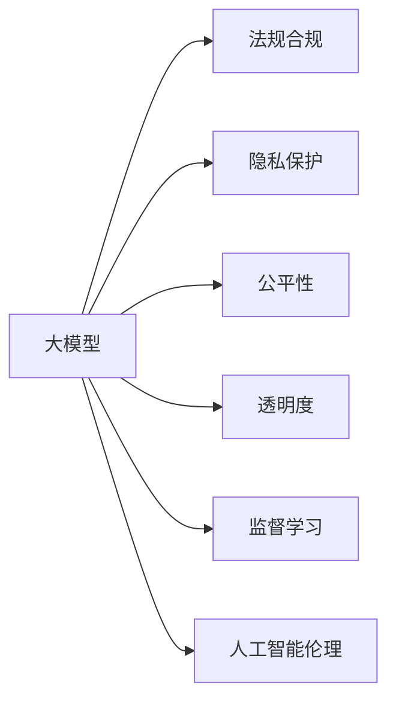

                 

# 监管机构如何规范大模型行业的发展?

> 关键词：大模型, 法规合规, 隐私保护, 公平性, 透明度, 监督学习, 人工智能伦理

## 1. 背景介绍

随着人工智能技术的迅速发展，大模型（Large Models）成为了推动AI应用落地的一大核心力量。大模型通常指那些具有大规模参数量，能够进行复杂数据建模和任务处理的神经网络模型。它们在自然语言处理、计算机视觉、语音识别等领域展现了卓越的性能，正逐步改变着我们生活和工作的方式。

然而，随着大模型应用的普及，其带来的挑战和风险也越来越显著。隐私保护、公平性、透明度、伦理等问题成为监管机构关注的重点。如何在促进大模型发展的同时，保障社会利益和公平正义，是监管机构需要面对的重要课题。本文将从法规合规、隐私保护、公平性、透明度、伦理等多个角度，探讨监管机构如何规范大模型行业的发展。

## 2. 核心概念与联系

### 2.1 核心概念概述

- **大模型**：指的是那些参数量巨大的深度学习模型，如BERT、GPT-3、T5等，它们在大规模数据上进行预训练，具备强大的语言理解、生成能力。
- **法规合规**：指在开发和应用大模型时，遵守国家法律法规，包括但不限于数据保护法、反垄断法等。
- **隐私保护**：保障个人隐私不被侵犯，特别是处理敏感数据时需遵守GDPR等隐私保护法规。
- **公平性**：确保算法模型在不同群体之间不存在偏见，避免对特定群体产生歧视。
- **透明度**：要求模型和算法的决策过程清晰可解释，便于审查和监督。
- **监督学习**：一种机器学习方法，通过标注数据训练模型，使其具备特定任务能力。
- **人工智能伦理**：涉及AI在技术、社会、法律等多个层面的伦理问题，包括但不限于隐私、安全、责任归属等。

这些核心概念之间的联系可通过以下Mermaid流程图来展示：



这个流程图展示了在大模型开发和应用过程中，各项规范和原则之间的相互联系。

### 2.2 概念间的关系

- **法规合规**是大模型应用的前提，确保开发和应用过程中的合法性。
- **隐私保护**关注个人数据的处理，确保数据使用透明、安全，符合法律法规。
- **公平性**关注模型决策的公正性，避免对特定群体的歧视。
- **透明度**要求模型的决策过程可解释，便于审查和监督。
- **监督学习**是大模型训练的基础，需要遵循数据标注、模型训练等规范。
- **人工智能伦理**是指导大模型开发和应用的高层次原则，涉及技术与社会的关系。

## 3. 核心算法原理 & 具体操作步骤

### 3.1 算法原理概述

大模型的微调过程是基于监督学习的。其核心思想是：使用少量标注数据，在预训练模型基础上，通过有监督学习优化模型，使其在特定任务上表现优异。这一过程需要遵循一系列的规范和原则，包括但不限于：

1. **数据标注规范**：标注数据需高质量、多样性、代表性。
2. **模型训练规范**：学习率、批量大小、迭代次数等需合理设置。
3. **模型评估规范**：需定期评估模型性能，避免过拟合。
4. **公平性规范**：确保模型在所有群体上的公平性，避免偏见。
5. **隐私保护规范**：确保数据处理过程符合隐私保护法规，如GDPR。

### 3.2 算法步骤详解

大模型的微调步骤包括数据准备、模型加载、模型微调、评估和发布等。以下是详细步骤：

1. **数据准备**：收集高质量标注数据，确保数据多样性和代表性。
2. **模型加载**：选择合适的预训练模型，如BERT、GPT-3等，进行加载。
3. **模型微调**：定义任务适配层，选择合适的损失函数，设置优化器和超参数，进行模型微调。
4. **评估**：在验证集上评估模型性能，检查公平性和隐私保护。
5. **发布**：发布模型到生产环境，持续监测模型性能，并根据反馈进行迭代优化。

### 3.3 算法优缺点

大模型微调具有以下优点：

- **高效性**：通过少量标注数据，即可大幅提升模型性能。
- **通用性**：可用于各种NLP任务，如问答、翻译、情感分析等。
- **灵活性**：通过微调，可适应特定领域的任务需求。

但同时，也存在以下缺点：

- **过拟合风险**：小样本情况下，容易过拟合训练数据。
- **公平性问题**：模型可能对特定群体存在偏见。
- **隐私风险**：数据泄露和滥用风险。

### 3.4 算法应用领域

大模型微调在NLP、计算机视觉、语音识别等领域广泛应用。例如：

- **NLP**：命名实体识别、情感分析、机器翻译等任务。
- **计算机视觉**：图像分类、目标检测、图像生成等任务。
- **语音识别**：语音转文本、语音情感分析等任务。

## 4. 数学模型和公式 & 详细讲解

### 4.1 数学模型构建

假设预训练模型为 $M_{\theta}$，微调任务为分类任务，训练数据为 $\{(x_i, y_i)\}_{i=1}^N$，其中 $x_i$ 为输入，$y_i$ 为标签。定义损失函数为交叉熵损失：

$$
\mathcal{L}(\theta) = -\frac{1}{N} \sum_{i=1}^N y_i \log M_{\theta}(x_i) + (1-y_i) \log (1-M_{\theta}(x_i))
$$

在模型微调过程中，通过梯度下降法优化损失函数：

$$
\theta \leftarrow \theta - \eta \nabla_{\theta} \mathcal{L}(\theta)
$$

其中 $\eta$ 为学习率。

### 4.2 公式推导过程

以分类任务为例，推导交叉熵损失函数和梯度更新公式。

定义模型在输入 $x$ 上的输出为 $\hat{y}=M_{\theta}(x)$，表示样本属于正类的概率。真实标签 $y \in \{0,1\}$。则交叉熵损失函数定义为：

$$
\ell(M_{\theta}(x),y) = -[y\log \hat{y} + (1-y)\log (1-\hat{y})]
$$

将其代入经验风险公式：

$$
\mathcal{L}(\theta) = -\frac{1}{N} \sum_{i=1}^N [y_i\log M_{\theta}(x_i)+(1-y_i)\log(1-M_{\theta}(x_i))]
$$

根据链式法则，损失函数对参数 $\theta_k$ 的梯度为：

$$
\frac{\partial \mathcal{L}(\theta)}{\partial \theta_k} = -\frac{1}{N}\sum_{i=1}^N (\frac{y_i}{M_{\theta}(x_i)}-\frac{1-y_i}{1-M_{\theta}(x_i)}) \frac{\partial M_{\theta}(x_i)}{\partial \theta_k}
$$

其中 $\frac{\partial M_{\theta}(x_i)}{\partial \theta_k}$ 可进一步递归展开，利用自动微分技术完成计算。

### 4.3 案例分析与讲解

以情感分析任务为例，训练集包含电影评论及其情感标签。模型预训练步骤为：

1. 收集大量电影评论数据。
2. 使用BERT模型进行预训练，学习语言表示。
3. 设计情感分类器，包括线性分类器和交叉熵损失函数。
4. 使用少量标注数据进行微调，调整分类器权重。
5. 在验证集上评估模型性能，调整超参数。
6. 发布模型，持续监测模型表现，并根据反馈进行迭代优化。

## 5. 项目实践：代码实例和详细解释说明

### 5.1 开发环境搭建

在使用PyTorch进行大模型微调时，首先需要准备好开发环境。以下是配置流程：

1. 安装Anaconda：从官网下载并安装Anaconda，用于创建独立的Python环境。
2. 创建并激活虚拟环境：
```bash
conda create -n pytorch-env python=3.8 
conda activate pytorch-env
```

3. 安装PyTorch：根据CUDA版本，从官网获取对应的安装命令。例如：
```bash
conda install pytorch torchvision torchaudio cudatoolkit=11.1 -c pytorch -c conda-forge
```

4. 安装Transformers库：
```bash
pip install transformers
```

5. 安装各类工具包：
```bash
pip install numpy pandas scikit-learn matplotlib tqdm jupyter notebook ipython
```

完成上述步骤后，即可在`pytorch-env`环境中开始微调实践。

### 5.2 源代码详细实现

以下是一个使用PyTorch进行情感分析任务的大模型微调代码实现。

首先，定义数据处理函数：

```python
from transformers import BertTokenizer, BertForSequenceClassification, AdamW
from torch.utils.data import DataLoader
import torch

class DataProcessor:
    def __init__(self, tokenizer, max_len=128):
        self.tokenizer = tokenizer
        self.max_len = max_len

    def tokenize(self, text):
        return self.tokenizer.encode_plus(
            text,
            add_special_tokens=True,
            max_length=self.max_len,
            padding='max_length',
            return_tensors='pt'
        )
        
    def prepare_dataset(self, texts, labels):
        tokenized_texts = [self.tokenize(text) for text in texts]
        return DataLoader(list(zip(tokenized_texts, labels)), batch_size=16, shuffle=True)
```

然后，定义模型和优化器：

```python
tokenizer = BertTokenizer.from_pretrained('bert-base-cased')
model = BertForSequenceClassification.from_pretrained('bert-base-cased', num_labels=2)

optimizer = AdamW(model.parameters(), lr=2e-5)
```

接着，定义训练和评估函数：

```python
def train(model, dataloader, optimizer, device):
    model.train()
    total_loss = 0
    for batch in dataloader:
        input_ids = batch[0]['input_ids'].to(device)
        attention_mask = batch[0]['attention_mask'].to(device)
        labels = batch[1].to(device)
        model.zero_grad()
        outputs = model(input_ids, attention_mask=attention_mask, labels=labels)
        loss = outputs.loss
        total_loss += loss.item()
        loss.backward()
        optimizer.step()
    return total_loss / len(dataloader)

def evaluate(model, dataloader, device):
    model.eval()
    preds, labels = [], []
    with torch.no_grad():
        for batch in dataloader:
            input_ids = batch[0]['input_ids'].to(device)
            attention_mask = batch[0]['attention_mask'].to(device)
            labels = batch[1].to(device)
            outputs = model(input_ids, attention_mask=attention_mask)
            preds.append(outputs.logits.argmax(dim=1).tolist())
            labels.append(labels.tolist())
    return preds, labels
```

最后，启动训练流程并在测试集上评估：

```python
epochs = 5
batch_size = 16
device = torch.device('cuda') if torch.cuda.is_available() else torch.device('cpu')

for epoch in range(epochs):
    loss = train(model, train_dataset, optimizer, device)
    print(f"Epoch {epoch+1}, train loss: {loss:.3f}")

    print(f"Epoch {epoch+1}, dev results:")
    preds, labels = evaluate(model, dev_dataset, device)
    print(classification_report(labels, preds))

print("Test results:")
preds, labels = evaluate(model, test_dataset, device)
print(classification_report(labels, preds))
```

以上就是使用PyTorch对BERT进行情感分析任务微调的完整代码实现。可以看到，得益于Transformers库的强大封装，我们可以用相对简洁的代码完成BERT模型的加载和微调。

### 5.3 代码解读与分析

让我们再详细解读一下关键代码的实现细节：

**DataProcessor类**：
- `__init__`方法：初始化分词器和其他参数。
- `tokenize`方法：对单个样本进行分词和编码。
- `prepare_dataset`方法：对整个数据集进行批处理，并转化为模型输入。

**训练和评估函数**：
- `train`函数：在训练集上迭代训练模型，返回总损失。
- `evaluate`函数：在验证集和测试集上评估模型性能，并打印分类指标。

**训练流程**：
- 定义总的epoch数和batch size，开始循环迭代。
- 每个epoch内，先在训练集上训练，输出平均loss。
- 在验证集上评估，输出分类指标。
- 所有epoch结束后，在测试集上评估，给出最终测试结果。

可以看到，PyTorch配合Transformers库使得BERT微调的代码实现变得简洁高效。开发者可以将更多精力放在数据处理、模型改进等高层逻辑上，而不必过多关注底层的实现细节。

## 6. 实际应用场景

### 6.1 智能客服系统

基于大语言模型微调的对话技术，可以广泛应用于智能客服系统的构建。传统客服往往需要配备大量人力，高峰期响应缓慢，且一致性和专业性难以保证。而使用微调后的对话模型，可以7x24小时不间断服务，快速响应客户咨询，用自然流畅的语言解答各类常见问题。

在技术实现上，可以收集企业内部的历史客服对话记录，将问题和最佳答复构建成监督数据，在此基础上对预训练对话模型进行微调。微调后的对话模型能够自动理解用户意图，匹配最合适的答案模板进行回复。对于客户提出的新问题，还可以接入检索系统实时搜索相关内容，动态组织生成回答。如此构建的智能客服系统，能大幅提升客户咨询体验和问题解决效率。

### 6.2 金融舆情监测

金融机构需要实时监测市场舆论动向，以便及时应对负面信息传播，规避金融风险。传统的人工监测方式成本高、效率低，难以应对网络时代海量信息爆发的挑战。基于大语言模型微调的文本分类和情感分析技术，为金融舆情监测提供了新的解决方案。

具体而言，可以收集金融领域相关的新闻、报道、评论等文本数据，并对其进行主题标注和情感标注。在此基础上对预训练语言模型进行微调，使其能够自动判断文本属于何种主题，情感倾向是正面、中性还是负面。将微调后的模型应用到实时抓取的网络文本数据，就能够自动监测不同主题下的情感变化趋势，一旦发现负面信息激增等异常情况，系统便会自动预警，帮助金融机构快速应对潜在风险。

### 6.3 个性化推荐系统

当前的推荐系统往往只依赖用户的历史行为数据进行物品推荐，无法深入理解用户的真实兴趣偏好。基于大语言模型微调技术，个性化推荐系统可以更好地挖掘用户行为背后的语义信息，从而提供更精准、多样的推荐内容。

在实践中，可以收集用户浏览、点击、评论、分享等行为数据，提取和用户交互的物品标题、描述、标签等文本内容。将文本内容作为模型输入，用户的后续行为（如是否点击、购买等）作为监督信号，在此基础上微调预训练语言模型。微调后的模型能够从文本内容中准确把握用户的兴趣点。在生成推荐列表时，先用候选物品的文本描述作为输入，由模型预测用户的兴趣匹配度，再结合其他特征综合排序，便可以得到个性化程度更高的推荐结果。

### 6.4 未来应用展望

随着大语言模型微调技术的发展，其应用范围将不断扩大，为更多行业带来变革性影响。

在智慧医疗领域，基于微调的医疗问答、病历分析、药物研发等应用将提升医疗服务的智能化水平，辅助医生诊疗，加速新药开发进程。

在智能教育领域，微调技术可应用于作业批改、学情分析、知识推荐等方面，因材施教，促进教育公平，提高教学质量。

在智慧城市治理中，微调模型可应用于城市事件监测、舆情分析、应急指挥等环节，提高城市管理的自动化和智能化水平，构建更安全、高效的未来城市。

此外，在企业生产、社会治理、文娱传媒等众多领域，基于大模型微调的人工智能应用也将不断涌现，为经济社会发展注入新的动力。

## 7. 工具和资源推荐

### 7.1 学习资源推荐

为了帮助开发者系统掌握大语言模型微调的理论基础和实践技巧，这里推荐一些优质的学习资源：

1. 《Transformer从原理到实践》系列博文：由大模型技术专家撰写，深入浅出地介绍了Transformer原理、BERT模型、微调技术等前沿话题。

2. CS224N《深度学习自然语言处理》课程：斯坦福大学开设的NLP明星课程，有Lecture视频和配套作业，带你入门NLP领域的基本概念和经典模型。

3. 《Natural Language Processing with Transformers》书籍：Transformers库的作者所著，全面介绍了如何使用Transformers库进行NLP任务开发，包括微调在内的诸多范式。

4. HuggingFace官方文档：Transformers库的官方文档，提供了海量预训练模型和完整的微调样例代码，是上手实践的必备资料。

5. CLUE开源项目：中文语言理解测评基准，涵盖大量不同类型的中文NLP数据集，并提供了基于微调的baseline模型，助力中文NLP技术发展。

通过对这些资源的学习实践，相信你一定能够快速掌握大语言模型微调的精髓，并用于解决实际的NLP问题。

### 7.2 开发工具推荐

高效的开发离不开优秀的工具支持。以下是几款用于大语言模型微调开发的常用工具：

1. PyTorch：基于Python的开源深度学习框架，灵活动态的计算图，适合快速迭代研究。大部分预训练语言模型都有PyTorch版本的实现。

2. TensorFlow：由Google主导开发的开源深度学习框架，生产部署方便，适合大规模工程应用。同样有丰富的预训练语言模型资源。

3. Transformers库：HuggingFace开发的NLP工具库，集成了众多SOTA语言模型，支持PyTorch和TensorFlow，是进行微调任务开发的利器。

4. Weights & Biases：模型训练的实验跟踪工具，可以记录和可视化模型训练过程中的各项指标，方便对比和调优。与主流深度学习框架无缝集成。

5. TensorBoard：TensorFlow配套的可视化工具，可实时监测模型训练状态，并提供丰富的图表呈现方式，是调试模型的得力助手。

6. Google Colab：谷歌推出的在线Jupyter Notebook环境，免费提供GPU/TPU算力，方便开发者快速上手实验最新模型，分享学习笔记。

合理利用这些工具，可以显著提升大语言模型微调任务的开发效率，加快创新迭代的步伐。

### 7.3 相关论文推荐

大语言模型和微调技术的发展源于学界的持续研究。以下是几篇奠基性的相关论文，推荐阅读：

1. Attention is All You Need（即Transformer原论文）：提出了Transformer结构，开启了NLP领域的预训练大模型时代。

2. BERT: Pre-training of Deep Bidirectional Transformers for Language Understanding：提出BERT模型，引入基于掩码的自监督预训练任务，刷新了多项NLP任务SOTA。

3. Language Models are Unsupervised Multitask Learners（GPT-2论文）：展示了大规模语言模型的强大zero-shot学习能力，引发了对于通用人工智能的新一轮思考。

4. Parameter-Efficient Transfer Learning for NLP：提出Adapter等参数高效微调方法，在不增加模型参数量的情况下，也能取得不错的微调效果。

5. Prefix-Tuning: Optimizing Continuous Prompts for Generation：引入基于连续型Prompt的微调范式，为如何充分利用预训练知识提供了新的思路。

6. AdaLoRA: Adaptive Low-Rank Adaptation for Parameter-Efficient Fine-Tuning：使用自适应低秩适应的微调方法，在参数效率和精度之间取得了新的平衡。

这些论文代表了大语言模型微调技术的发展脉络。通过学习这些前沿成果，可以帮助研究者把握学科前进方向，激发更多的创新灵感。

除上述资源外，还有一些值得关注的前沿资源，帮助开发者紧跟大语言模型微调技术的最新进展，例如：

1. arXiv论文预印本：人工智能领域最新研究成果的发布平台，包括大量尚未发表的前沿工作，学习前沿技术的必读资源。

2. 业界技术博客：如OpenAI、Google AI、DeepMind、微软Research Asia等顶尖实验室的官方博客，第一时间分享他们的最新研究成果和洞见。

3. 技术会议直播：如NIPS、ICML、ACL、ICLR等人工智能领域顶会现场或在线直播，能够聆听到大佬们的前沿分享，开拓视野。

4. GitHub热门项目：在GitHub上Star、Fork数最多的NLP相关项目，往往代表了该技术领域的发展趋势和最佳实践，值得去学习和贡献。

5. 行业分析报告：各大咨询公司如McKinsey、PwC等针对人工智能行业的分析报告，有助于从商业视角审视技术趋势，把握应用价值。

总之，对于大语言模型微调技术的学习和实践，需要开发者保持开放的心态和持续学习的意愿。多关注前沿资讯，多动手实践，多思考总结，必将收获满满的成长收益。

## 8. 总结：未来发展趋势与挑战

### 8.1 总结

本文对大语言模型微调的法规合规、隐私保护、公平性、透明度、伦理等多个方面进行了系统介绍。从法规框架到具体算法原理，再到实际项目实践，全方位解析了大模型微调的技术细节和应用场景。通过深入剖析，我们了解到在促进大模型发展的同时，如何保障社会利益和公平正义，是监管机构和开发者共同面临的重要课题。

通过本文的系统梳理，可以看到，大语言模型微调技术在NLP领域的应用前景广阔，但同时也面临着诸多挑战。只有在遵守法规、保护隐私、确保公平、提高透明、遵循伦理等多方面同步推进，才能使大模型微调技术健康、可持续地发展。

### 8.2 未来发展趋势

展望未来，大语言模型微调技术将呈现以下几个发展趋势：

1. **法规合规要求更高**：随着AI技术的发展，相关法规和政策将更加严格，大模型开发和应用过程中需更多地考虑合规问题。

2. **隐私保护更加重视**：数据隐私保护将进一步加强，大模型在处理敏感数据时需要更加谨慎。

3. **公平性和透明性成为核心**：模型偏见和不可解释性问题将受到更多关注，公平性、透明性成为模型开发和应用的关键。

4. **多模态微调兴起**：大模型微调将更多地应用于多模态数据，如视觉、语音等，实现跨模态信息融合。

5. **参数高效和计算高效成为重要目标**：在保证微调效果的前提下，参数高效和计算高效将成为未来的重要方向。

6. **人工智能伦理成为重要课题**：随着AI技术的广泛应用，伦理问题将更加凸显，需要更多的理论研究和实践探索。

以上趋势凸显了大语言模型微调技术的广阔前景，这些方向的探索发展，必将进一步提升NLP系统的性能和应用范围，为人类认知智能的进化带来深远影响。

### 8.3 面临的挑战

尽管大语言模型微调技术已经取得了瞩目成就，但在迈向更加智能化、普适化应用的过程中，它仍面临着诸多挑战：

1. **法规合规的复杂性**：不同国家和地区的法规政策不同，大模型开发者需要灵活应对。
2. **隐私保护的挑战**：在保护隐私的前提下，如何利用数据进行高效的模型训练。
3. **公平性的难题**：大模型在处理不同群体数据时可能存在偏见，如何消除偏见是挑战之一。
4. **透明性和可解释性的不足**：大模型的决策过程往往难以解释，如何提高透明度和可解释性。
5. **计算资源的限制**：大模型的训练和推理需要高性能计算资源，如何降低成本是一个重要问题。
6. **伦理和安全性的担忧**：大模型可能被用于有害目的，如何确保其安全性。

正视这些挑战，积极应对并寻求突破，将是大语言模型微调走向成熟的必由之路。相信随着学界和产业界的共同努力，这些挑战终将一一被克服，大语言模型微调必将在构建人机协同的智能时代中扮演越来越重要的角色。

### 8.4 研究展望

面对大语言模型微调所面临的诸多挑战，未来的研究需要在以下几个方面寻求新的突破：

1. **法规合规的智能化**：开发合规性检查工具，自动评估模型是否符合法律法规。
2. **隐私保护的先进技术**：研究差分隐私、联邦学习等技术，保护数据隐私的同时，保证模型性能。
3. **公平性和透明性的提升**：研究公平性检测算法和透明性增强方法，确保模型公平性和透明性。
4. **多模态融合的创新**：探索多模态数据融合技术，实现跨模态信息的高效利用。
5. **参数高效和计算高效的优化**：研究新的参数高效微调方法，提高模型训练和推理效率。
6. **人工智能伦理的深入研究**：研究AI伦理理论和技术，确保大模型应用的公平性、透明性和安全性。

这些研究方向的探索，必将引领大语言模型微调技术迈向更高的台阶，为构建安全、可靠、可解释、可控的智能系统铺平道路。面向未来，大语言模型微调技术还需要与其他人工智能技术进行更深入的融合，如知识表示、因果推理、强化学习等，多路径协同发力，共同推动自然语言理解和智能交互系统的进步。只有勇于

