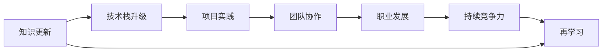
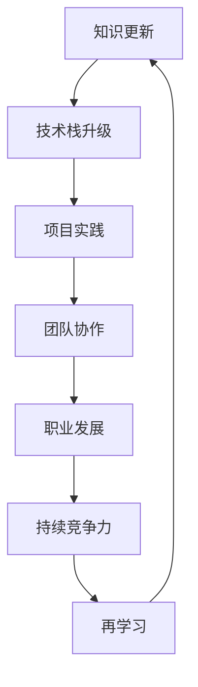

                 

# 知识更新与个人核心竞争力

> 关键词：知识更新, 个人核心竞争力, 终身学习, 技术栈升级, 项目实践, 团队协作, 职业发展

## 1. 背景介绍

### 1.1 问题由来

在信息技术高速发展的时代，技术和知识更新的速度越来越快，个人若不主动学习新知识、新技能，便有被淘汰的风险。特别是在快速变化和竞争激烈的IT行业，个人核心竞争力的持续提升显得尤为重要。本文旨在探讨知识更新对个人核心竞争力的影响，提供实用的策略和方法，帮助IT从业者不断提升自身的技术和市场竞争力。

### 1.2 问题核心关键点

个人核心竞争力(Core Competency)指的是个体在某一专业领域或行业中所具备的独特且难以模仿的能力，包括技术能力、沟通能力、解决问题能力等。在信息技术领域，持续的知识更新和技能提升是维持和提升核心竞争力的关键。

### 1.3 问题研究意义

对于IT从业者而言，随着技术的迭代更新，保持持续的知识更新和技能提升，才能在激烈的市场竞争中保持优势。本文将帮助读者理解知识更新与个人核心竞争力提升之间的关系，并提出具体策略，使读者能够在职场中脱颖而出，实现职业发展的可持续性。

## 2. 核心概念与联系

### 2.1 核心概念概述

- **知识更新**：指个体通过学习新知识、新技术，以及应用新方法来适应快速变化的职业环境的过程。
- **个人核心竞争力**：指个体在特定领域内所具有的独特且难以替代的能力。
- **终身学习**：指个体在整个职业生涯中持续进行学习，不断更新知识和技能，以适应职业生涯的发展变化。
- **技术栈升级**：指个体不断学习和掌握新的编程语言、框架和工具，提升自身技术水平的过程。
- **项目实践**：指通过实际项目开发，验证和应用所学知识，提升实践能力。
- **团队协作**：指在团队中，通过有效沟通和合作，共同完成项目任务，提升团队整体能力。
- **职业发展**：指通过不断学习和实践，提升自身能力和价值，实现职业生涯的不断进步。

### 2.2 概念间的关系

知识更新与个人核心竞争力的提升密切相关，具体关系可通过以下Mermaid流程图来展示：



此图展示了从知识更新到职业发展的整体流程：

1. 个体通过持续学习新知识（A），不断提升自己的技术栈（B）。
2. 在实际项目中应用所学知识（C），提升个人实践能力。
3. 在团队中与他人协作，增强团队整体能力（D）。
4. 职业不断进步，获得更高的职位和更大的影响力（E）。
5. 具备持续竞争力（F），继续学习和提升（G），形成良性循环。

### 2.3 核心概念的整体架构

最后，用一张综合的流程图来展示这些核心概念的关联：



此图展示了知识更新与个人核心竞争力提升的整体架构：

1. 知识更新驱动技术栈升级，提升项目实践能力。
2. 项目实践能力通过团队协作得到进一步提升。
3. 职业发展带来更高的职责和影响力。
4. 具备持续竞争力，持续学习和更新知识，形成良性循环。

## 3. 核心算法原理 & 具体操作步骤
### 3.1 算法原理概述

知识更新的核心在于不断学习新知识和新技能，并将其应用到实际项目中，从而提升个人核心竞争力。算法原理主要包括三个方面：

1. **学习算法**：通过监督学习和强化学习等算法，不断从数据中学习，获得新知识。
2. **技能迁移**：将新学到的知识迁移到现有项目或任务中，提升实践能力。
3. **持续反馈**：通过项目实践和团队协作获得反馈，不断优化学习过程。

### 3.2 算法步骤详解

知识更新的算法步骤主要包括以下几个关键步骤：

**Step 1: 制定学习计划**
- 确定当前所处领域的关键技术栈和未来发展方向。
- 设置学习目标和里程碑，比如掌握新技术、完成项目开发等。
- 划分时间表，定期评估学习进度。

**Step 2: 选择合适的学习资源**
- 确定需要学习的技术栈，如编程语言、框架、工具等。
- 选择相应的学习资料，包括书籍、在线课程、视频教程等。
- 找到相关的社区和论坛，获取最新的技术动态和交流经验。

**Step 3: 实施学习策略**
- 制定学习路径，按照由浅入深的顺序进行学习。
- 采取主动学习的方式，通过实际项目或模拟环境练习所学技能。
- 设置学习周期，定期复盘所学内容，巩固知识。

**Step 4: 项目实践应用**
- 选择适当的项目，将所学知识应用到实际开发中。
- 与团队成员协作，分享学习成果，共同解决问题。
- 持续迭代项目，不断优化和提升技能。

**Step 5: 反馈和改进**
- 通过项目实践和团队协作获取反馈。
- 分析问题，识别学习中的不足，制定改进措施。
- 调整学习计划，优化学习策略，提升学习效果。

### 3.3 算法优缺点

知识更新算法具有以下优点：
1. **灵活性**：能够快速适应技术变化，及时更新知识和技能。
2. **实践导向**：通过项目实践，将所学知识转化为实际能力。
3. **系统性**：设定学习目标和里程碑，有条不紊地提升技能。

同时，该算法也存在以下缺点：
1. **时间成本高**：需要大量时间和精力进行学习和实践。
2. **质量难以保证**：如果学习策略不当或反馈不足，可能导致学习效果不佳。
3. **个体差异**：不同人在知识更新过程中存在个体差异，效率和效果可能不同。

### 3.4 算法应用领域

知识更新算法适用于多个领域，如软件开发、数据分析、人工智能等。具体应用场景包括：

- **软件开发**：通过学习新技术、框架，提升编程能力，适应项目需求。
- **数据分析**：学习数据科学和机器学习技术，提高数据分析和挖掘能力。
- **人工智能**：通过学习深度学习、自然语言处理等技术，提升算法设计和应用能力。

## 4. 数学模型和公式 & 详细讲解  
### 4.1 数学模型构建

知识更新可以通过数学模型来表示，具体为：

$$
U = F(\theta)
$$

其中，$U$表示知识更新，$F$表示学习函数，$\theta$表示当前技能水平。

### 4.2 公式推导过程

知识更新过程的数学推导主要涉及以下公式：

**公式一**：监督学习模型

$$
\theta' = \theta + \alpha\sum_{i=1}^n(y_i-\hat{y}_i)(\frac{\partial\hat{y}_i}{\partial\theta})
$$

其中，$\theta'$表示更新后的技能水平，$\alpha$表示学习率，$n$表示样本数量，$y_i$表示真实标签，$\hat{y}_i$表示预测值。

**公式二**：强化学习模型

$$
\theta' = \theta + \alpha\sum_{t=1}^T\gamma^t\sum_{s_t,a_t}Q(s_t,a_t)
$$

其中，$\theta'$表示更新后的技能水平，$\alpha$表示学习率，$T$表示时间步长，$\gamma$表示折扣因子，$s_t$表示状态，$a_t$表示动作，$Q(s_t,a_t)$表示状态动作值。

### 4.3 案例分析与讲解

**案例一：Python编程语言的学习**
- 学习目标：掌握Python编程语言，包括基本语法、标准库、框架等。
- 学习资源：Python官方文档、在线课程（如Coursera、Udemy）、书籍（如《Python编程：从入门到实践》）。
- 学习路径：先学习基本语法和标准库，再学习Django、Flask等Web框架。
- 项目实践：构建一个简单的Web应用，实现用户登录、注册等功能。
- 反馈和改进：通过项目开发，发现问题，查找资料解决，不断优化代码。

**案例二：机器学习算法学习**
- 学习目标：掌握机器学习算法，如回归、分类、聚类等。
- 学习资源：在线课程（如Coursera、edX）、书籍（如《机器学习实战》）。
- 学习路径：先学习基础算法，再学习深度学习、强化学习等高级算法。
- 项目实践：使用机器学习算法解决实际问题，如客户流失预测、推荐系统设计等。
- 反馈和改进：通过项目开发和数据分析，获取反馈，优化算法模型。

## 5. 项目实践：代码实例和详细解释说明
### 5.1 开发环境搭建

要进行知识更新和项目实践，首先需要搭建开发环境。以下是基于Python的开发环境搭建步骤：

1. **安装Python**：从官网下载并安装Python 3.x版本。
2. **安装虚拟环境**：使用virtualenv创建虚拟环境，用于隔离不同项目的环境。
3. **安装必要的库**：安装常用的Python库，如NumPy、Pandas、scikit-learn等。
4. **配置IDE**：配置Python开发环境，如PyCharm、Jupyter Notebook等。

### 5.2 源代码详细实现

以下是一个Python编程语言的简单实现，具体步骤为：

1. **安装Django框架**：使用pip安装Django。
2. **创建Django项目**：使用Django的startproject命令创建项目。
3. **编写模型和视图**：在Django项目中，编写模型和视图代码，实现用户登录、注册等功能。
4. **运行项目**：使用Django的runserver命令运行项目。

### 5.3 代码解读与分析

**Django模型代码**：

```python
from django.db import models

class User(models.Model):
    username = models.CharField(max_length=50)
    password = models.CharField(max_length=50)

    def __str__(self):
        return self.username
```

**Django视图代码**：

```python
from django.http import HttpResponse

def login(request):
    username = request.POST.get('username')
    password = request.POST.get('password')
    # 查询数据库中是否存在该用户
    user = User.objects.filter(username=username, password=password).first()
    if user:
        return HttpResponse("Login successful!")
    else:
        return HttpResponse("Invalid username or password!")
```

**代码解读**：

- **Django模型**：定义了用户模型，包括用户名和密码字段。
- **Django视图**：实现了用户登录功能，通过POST请求获取用户名和密码，查询数据库验证用户信息，并返回登录结果。
- **代码分析**：代码简洁明了，易于理解和维护，体现了Python和Django的快速开发能力。

### 5.4 运行结果展示

运行上述代码后，可以在浏览器中访问Django项目，并进行用户登录和注册操作。

## 6. 实际应用场景
### 6.1 软件开发
知识更新在软件开发中的应用，可以帮助开发人员掌握新语言、框架和工具，提升开发效率和代码质量。例如：

- **学习Java编程语言**：通过学习Java语法和标准库，掌握多线程编程、网络编程等高级技能。
- **学习Spring框架**：通过学习Spring框架，掌握依赖注入、事务管理等核心功能。
- **学习Git版本控制**：通过学习Git，掌握版本管理、代码协作等技能。

### 6.2 数据分析
在数据分析领域，通过学习新的数据分析工具和技术，可以提升数据处理和挖掘能力，帮助企业进行决策支持。例如：

- **学习SQL语言**：通过学习SQL，掌握数据查询和处理技能。
- **学习Pandas库**：通过学习Pandas，掌握数据清洗、分析、可视化等技能。
- **学习机器学习算法**：通过学习机器学习算法，掌握模型训练、特征工程等技能。

### 6.3 人工智能
在人工智能领域，通过学习深度学习、自然语言处理等技术，可以提升算法设计和应用能力，推动企业智能化转型。例如：

- **学习深度学习框架**：通过学习TensorFlow、PyTorch等框架，掌握深度学习模型的设计和训练。
- **学习自然语言处理技术**：通过学习BERT、GPT等模型，提升文本分析和生成能力。
- **学习强化学习算法**：通过学习AlphaGo等算法，掌握智能决策和策略优化技能。

## 7. 工具和资源推荐
### 7.1 学习资源推荐

以下是一些推荐的学习资源，帮助读者系统地掌握知识更新和技能提升：

1. **在线课程**：如Coursera、edX、Udacity等平台提供大量的在线课程，涵盖各种技术栈和领域。
2. **书籍**：经典技术书籍如《深入浅出Python》、《机器学习实战》等，提供了深入的理论和实践指导。
3. **技术博客**：如Medium、CSDN等平台上的技术博客，提供了最新的技术动态和实战经验。
4. **社区和论坛**：如Stack Overflow、GitHub等社区，可以获取技术交流和项目分享。
5. **在线学习平台**：如Codecademy、Khan Academy等平台，提供了互动式的学习体验。

### 7.2 开发工具推荐

以下是一些推荐的软件工具，帮助读者提高开发效率和学习效果：

1. **IDE（集成开发环境）**：如PyCharm、Visual Studio Code等，提供了代码编辑、调试、版本控制等功能。
2. **版本控制工具**：如Git、SVN等，提供了版本管理和协作功能。
3. **代码分析工具**：如Pylint、SonarQube等，提供了代码质量和性能分析功能。
4. **项目管理工具**：如Jira、Trello等，提供了任务管理和协作功能。
5. **代码测试工具**：如JUnit、pytest等，提供了自动化测试功能。

### 7.3 相关论文推荐

以下是几篇推荐的相关论文，帮助读者深入理解知识更新和技能提升：

1. **深度学习在软件开发中的应用**：探讨深度学习如何应用于软件开发中的模型训练、代码生成等任务。
2. **终身学习在数据分析中的应用**：介绍终身学习如何帮助数据分析师不断更新知识，提升数据处理和挖掘能力。
3. **智能学习系统在人工智能中的应用**：探讨智能学习系统如何通过学习新知识，提升人工智能模型的性能和泛化能力。

## 8. 总结：未来发展趋势与挑战
### 8.1 总结

本文对知识更新与个人核心竞争力提升之间的关系进行了详细阐述。通过学习新技术、新知识，并在实际项目中应用所学内容，提升个人的技术水平和实践能力，从而增强核心竞争力。本文从理论到实践，系统地介绍了知识更新的关键步骤和方法，并通过具体案例进行讲解。

### 8.2 未来发展趋势

未来，知识更新将呈现以下几个发展趋势：

1. **自动化学习**：通过机器学习和人工智能技术，实现自动化学习和知识发现，提高学习效率。
2. **跨领域学习**：不同领域的技术和知识将深度融合，推动跨学科学习的发展。
3. **个性化学习**：根据学习者的兴趣和能力，提供个性化的学习路径和资源，提升学习效果。
4. **虚拟现实学习**：通过虚拟现实技术，提供沉浸式学习体验，提升学习效果。
5. **知识图谱**：通过知识图谱技术，构建知识体系，帮助学习者系统地掌握相关知识。

### 8.3 面临的挑战

尽管知识更新在提升个人核心竞争力方面具有重要意义，但也面临一些挑战：

1. **信息过载**：海量信息使得学习者难以筛选和利用有用知识。
2. **时间和精力限制**：学习需要大量时间和精力，容易产生倦怠感。
3. **知识迁移难度**：新知识难以迁移到现有项目中，导致学习效果不佳。
4. **技能差异**：学习者的技能水平和认知能力存在差异，影响学习效果。

### 8.4 研究展望

未来的研究应在以下几个方面进行探索：

1. **知识图谱和语义搜索**：通过知识图谱和语义搜索技术，构建知识体系，帮助学习者快速获取相关知识。
2. **跨领域学习**：通过跨学科学习，提升学习者的综合能力和创新能力。
3. **个性化学习**：通过个性化学习路径和资源，提升学习者的学习效果。
4. **自动化学习**：通过自动化学习算法，提高学习效率和学习效果。

## 9. 附录：常见问题与解答
### 9.1 常见问题

**Q1: 如何选择合适的学习资源？**

A: 选择学习资源时，需要考虑以下几个方面：
1. 目标明确：根据学习目标选择相应的资源，如掌握编程语言、框架、算法等。
2. 权威性：选择权威的资源，如知名大学、行业领袖等提供的课程和书籍。
3. 实用性：选择实用的资源，如实践案例、在线项目等。
4. 互动性：选择互动性强的资源，如论坛、社区等，便于交流和解决问题。

**Q2: 如何有效地应用所学知识？**

A: 应用所学知识时，需要考虑以下几个方面：
1. 项目实践：选择适当的项目，将所学知识应用到实际开发中。
2. 团队协作：与团队成员协作，共同完成项目任务，提升团队整体能力。
3. 持续反馈：通过项目开发和团队协作获取反馈，不断优化学习过程。
4. 知识更新：持续学习新知识，保持技术栈的前沿性。

**Q3: 如何平衡工作和学习？**

A: 平衡工作和学习时，需要考虑以下几个方面：
1. 时间管理：制定合理的时间表，合理安排工作和学习的比例。
2. 优先级排序：根据工作和学习的优先级，合理安排时间和精力。
3. 工作融合：将学习和工作相结合，在工作中应用所学知识，提升工作效率。
4. 心理调节：保持良好的心态，避免过度疲劳和压力，保证学习和工作的可持续发展。

---

作者：禅与计算机程序设计艺术 / Zen and the Art of Computer Programming

