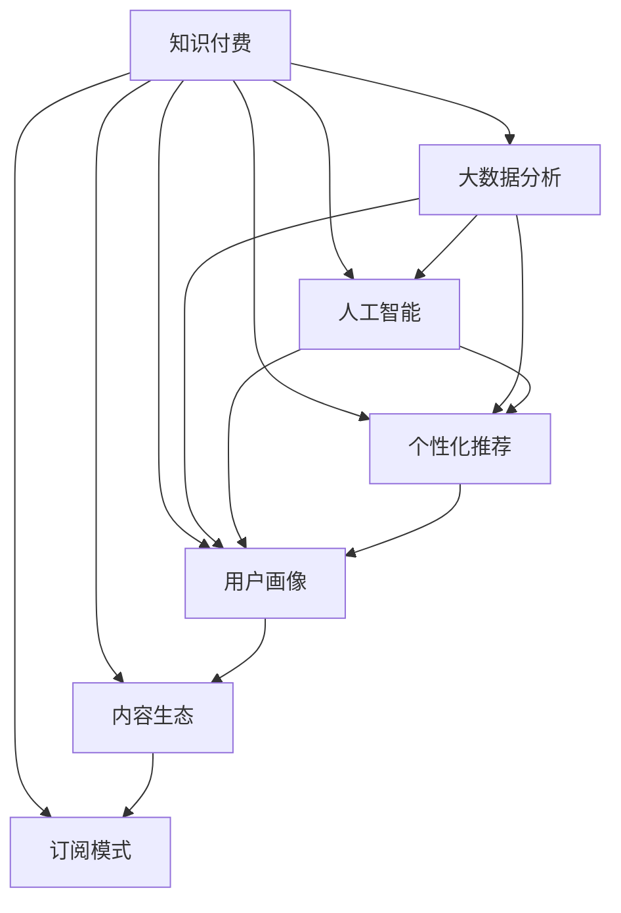
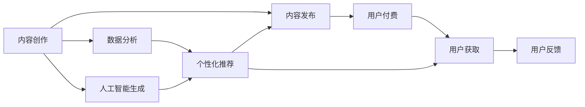
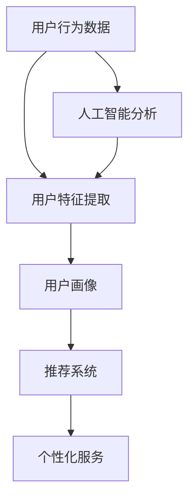
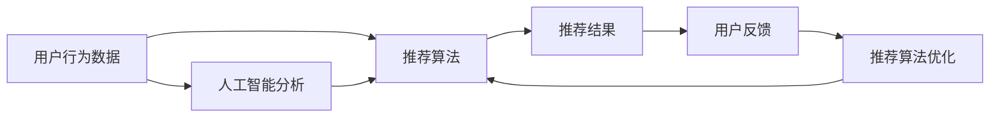

                 

# 知识经济时代下的知识付费 创新商业模式运营

> 关键词：知识付费, 创新商业模式, 技术驱动, 大数据分析, 人工智能, 个性化推荐

## 1. 背景介绍

### 1.1 问题由来
随着知识经济的崛起和信息时代的加速，知识付费逐渐成为一种新兴的经济形态。它不同于传统的教育模式，通过提供有价值的专业知识，帮助用户解决具体问题，实现了知识的商品化。这种模式改变了人们对知识获取的认知，强调知识价值和个人成长。

知识付费的兴起，源自于人们对终身学习和自我提升的迫切需求，同时也与互联网技术的成熟普及密不可分。在互联网技术的加持下，知识付费服务不再局限于图书和课程，而是发展出了多种形式，如在线咨询、专业培训、远程辅导等，大大拓宽了知识传播的渠道和形式。

然而，知识付费市场也面临着诸多挑战，如内容同质化、用户体验不足、用户粘性低等。这些问题制约了知识付费的进一步发展，迫切需要新的商业模式和技术手段来推动行业的升级和转型。

### 1.2 问题核心关键点
知识付费创新的关键点在于：
- 如何挖掘和整合高质量的专业知识资源，实现知识的最大化利用。
- 如何通过技术手段提升用户体验，增强用户粘性。
- 如何构建有效的推荐系统，实现精准推荐，提高用户的付费意愿。
- 如何通过大数据分析和人工智能技术，实现个性化服务，提升平台的用户转化率和留存率。
- 如何构建可持续的盈利模式，实现商业价值和用户价值的双赢。

本文将聚焦于知识付费的商业模式和技术创新，探讨如何通过大数据分析、人工智能等前沿技术，提升知识付费服务的质量与价值，推动行业的发展和变革。

## 2. 核心概念与联系

### 2.1 核心概念概述

为更好地理解知识付费的商业模式和技术创新，本节将介绍几个密切相关的核心概念：

- 知识付费：通过在线付费形式获取专业知识的服务模式，强调知识的商品化与价值。
- 大数据分析：从海量数据中提取有用信息，辅助决策和优化服务的过程。
- 人工智能(AI)：模拟人类智能的机器系统，用于数据分析、决策支持、自动化操作等。
- 个性化推荐系统：根据用户行为和偏好，推荐最相关内容的系统，提高用户体验和满意度。
- 用户画像：通过分析用户行为数据，构建用户特征模型，用于个性化推荐和精准营销。
- 内容生态：知识付费平台上的内容创作者和消费者之间的互动关系，影响平台的内容质量与用户留存。
- 订阅模式：用户定期支付固定费用，获取持续内容服务的模式，提升用户忠诚度。

这些核心概念之间的逻辑关系可以通过以下Mermaid流程图来展示：



这个流程图展示了知识付费的多个核心概念及其相互关系：

1. 知识付费提供平台，基于大数据分析和人工智能技术，构建个性化推荐系统。
2. 大数据分析从用户行为中提取特征，构建用户画像，用于个性化推荐和精准营销。
3. 人工智能技术辅助分析，优化推荐算法和内容生成。
4. 个性化推荐系统提升用户体验和满意度，构建内容生态，促进用户留存。
5. 订阅模式通过稳定的收入流，支持平台运营，提升用户粘性。

### 2.2 概念间的关系

这些核心概念之间存在着紧密的联系，形成了知识付费平台的完整生态系统。下面我们通过几个Mermaid流程图来展示这些概念之间的关系。

#### 2.2.1 知识付费的服务流程



这个流程图展示了知识付费的基本服务流程：

1. 内容创作者创作并发布内容。
2. 用户通过付费获取内容。
3. 平台根据用户行为数据进行个性化推荐。
4. 用户根据推荐获取内容，并反馈意见。
5. 平台根据反馈数据进行内容优化和创作者激励。
6. 平台利用人工智能技术生成新内容，丰富内容生态。

#### 2.2.2 数据驱动的用户画像构建



这个流程图展示了如何利用大数据分析构建用户画像：

1. 平台收集用户行为数据。
2. 通过人工智能技术分析提取用户特征。
3. 构建用户画像，用于个性化推荐和精准营销。
4. 平台根据用户画像提供个性化服务。
5. 人工智能技术辅助数据分析，提升特征提取的准确性。

#### 2.2.3 推荐系统的反馈优化



这个流程图展示了个性化推荐系统的反馈优化过程：

1. 平台根据用户行为数据进行推荐。
2. 用户反馈推荐结果。
3. 利用人工智能技术优化推荐算法。
4. 优化后的推荐算法提升推荐效果。
5. 人工智能技术辅助算法优化，提升推荐的精准度。

### 2.3 核心概念的整体架构

最后，我们用一个综合的流程图来展示这些核心概念在大语言模型微调过程中的整体架构：


这个综合流程图展示了从知识付费到用户画像的全过程，以及各个环节的技术支持：

1. 知识付费平台提供服务，基于大数据分析和人工智能技术，构建个性化推荐系统。
2. 大数据分析从用户行为中提取特征，构建用户画像，用于个性化推荐和精准营销。
3. 人工智能技术辅助分析，优化推荐算法和内容生成。
4. 个性化推荐系统提升用户体验和满意度，构建内容生态，促进用户留存。
5. 订阅模式通过稳定的收入流，支持平台运营，提升用户粘性。

通过这些流程图，我们可以更清晰地理解知识付费平台的生态系统，以及各环节的技术支持。

## 3. 核心算法原理 & 具体操作步骤
### 3.1 算法原理概述

知识付费平台的核心算法主要涉及个性化推荐和用户画像构建。这些算法基于大数据分析和人工智能技术，通过分析用户行为和内容特征，实现精准推荐和个性化服务。

个性化推荐的核心原理是通过用户行为数据构建用户画像，然后利用推荐算法匹配用户需求和相关内容。常见的推荐算法包括协同过滤、基于内容的推荐、深度学习推荐等。

用户画像的核心原理是通过分析用户行为数据，提取用户特征，构建用户画像。用户画像通常包括用户的基本信息、兴趣偏好、行为习惯等。构建用户画像的算法包括聚类算法、分类算法、降维算法等。

### 3.2 算法步骤详解

以下是知识付费平台个性化推荐和用户画像构建的具体操作步骤：

#### 3.2.1 数据预处理

数据预处理是推荐系统的第一步，主要任务是清洗和格式化原始数据。常用的预处理步骤包括：

- 数据清洗：去除无效数据、缺失值、异常值等。
- 特征提取：从原始数据中提取有意义的特征，如用户浏览记录、评论内容、评分等。
- 数据归一化：将不同特征进行归一化处理，保证不同特征间的可比性。
- 特征选择：根据特征的重要性筛选出对推荐有影响的关键特征。

#### 3.2.2 用户画像构建

用户画像构建通常包括以下步骤：

- 特征提取：从用户行为数据中提取用户特征，如用户兴趣、行为频率、设备类型等。
- 特征编码：将用户特征编码成向量形式，便于模型处理。
- 聚类分析：通过聚类算法对用户特征进行分组，形成用户画像。
- 画像维护：随着用户行为数据的变化，实时更新用户画像，保持画像的准确性。

#### 3.2.3 推荐算法应用

推荐算法应用通常包括以下步骤：

- 特征表示：将用户画像和内容特征转换为向量形式，便于模型处理。
- 相似度计算：计算用户画像和内容特征之间的相似度，选出最相关的用户和内容。
- 推荐排序：根据相似度排序，推荐用户最可能感兴趣的内容。
- 反馈循环：根据用户反馈数据，调整推荐算法，提升推荐效果。

#### 3.2.4 系统部署与优化

系统部署和优化是推荐系统上线后的关键步骤，主要任务是提高推荐系统的性能和效率：

- 模型训练：在离线模式下训练推荐模型，优化模型参数。
- 在线推断：在在线模式下实时计算推荐结果。
- 系统监控：监控推荐系统的性能指标，及时发现和修复问题。
- 反馈优化：根据用户反馈数据，不断优化推荐算法和用户画像，提升推荐效果。

### 3.3 算法优缺点

个性化推荐和用户画像构建的优点在于：

- 提升用户体验：通过精准推荐，提高用户满意度和忠诚度。
- 优化内容生态：通过个性化推荐，促进内容创作和用户互动，提升平台内容质量。
- 提升商业价值：通过精准营销和用户画像，实现高效的广告投放和商业变现。

这些算法的缺点在于：

- 数据依赖性强：需要大量的用户行为数据来构建用户画像和优化推荐算法。
- 用户隐私问题：用户画像和推荐过程涉及用户隐私数据，需要采取有效的隐私保护措施。
- 算法复杂度高：推荐算法和用户画像构建过程涉及复杂的计算和模型优化，需要较高技术门槛。
- 用户行为变化快：用户行为数据和偏好变化快，需要实时更新用户画像和推荐算法，保持推荐效果。

### 3.4 算法应用领域

个性化推荐和用户画像构建的算法已经在知识付费平台、电商网站、视频平台等多个领域得到广泛应用，并取得了显著的效果：

- 知识付费平台：通过个性化推荐，提升用户购买率和满意度。
- 电商网站：通过个性化推荐，提高商品转化率和用户粘性。
- 视频平台：通过个性化推荐，增加用户观看时间和平台活跃度。
- 社交媒体：通过个性化推荐，提升用户互动和内容传播。

## 4. 数学模型和公式 & 详细讲解 & 举例说明

### 4.1 数学模型构建

个性化推荐和用户画像构建涉及的数学模型主要包括特征提取、特征编码、相似度计算等。下面以协同过滤算法为例，介绍其中的数学模型构建。

协同过滤算法通过用户之间的相似度和物品之间的相似度进行推荐，其核心数学模型如下：

- 用户特征矩阵：$U \in \mathbb{R}^{m \times n}$，其中 $m$ 为用户数，$n$ 为物品数。
- 物品特征矩阵：$V \in \mathbb{R}^{n \times p}$，其中 $p$ 为物品特征数。
- 用户行为矩阵：$R \in \mathbb{R}^{m \times n}$，其中 $R_{ij}$ 表示用户 $i$ 对物品 $j$ 的评分。

协同过滤算法的目标是最小化用户和物品的相似度矩阵 $S$，最大化预测评分 $R_{ij}$：

$$
S_{ij} = \frac{R_{ij}}{||\mathbf{u}_i||_2 \times ||\mathbf{v}_j||_2} = \mathbf{u}_i^T \times \mathbf{v}_j
$$

其中 $\mathbf{u}_i$ 和 $\mathbf{v}_j$ 分别为用户 $i$ 和物品 $j$ 的特征向量。

### 4.2 公式推导过程

下面以协同过滤算法为例，详细推导其公式。

假设用户 $i$ 对物品 $j$ 的评分 $R_{ij}$ 服从高斯分布 $N(\mu, \sigma^2)$，则用户 $i$ 对物品 $j$ 的预测评分 $r_{ij}$ 为：

$$
r_{ij} = \mathbf{u}_i^T \times \mathbf{v}_j + \mu
$$

其中 $\mathbf{u}_i$ 和 $\mathbf{v}_j$ 分别为用户 $i$ 和物品 $j$ 的特征向量，$\mu$ 为高斯分布的均值，$\sigma^2$ 为高斯分布的方差。

用户 $i$ 对物品 $j$ 的预测评分误差 $e_{ij}$ 为：

$$
e_{ij} = R_{ij} - r_{ij} = R_{ij} - (\mathbf{u}_i^T \times \mathbf{v}_j + \mu)
$$

协同过滤算法的目标是最小化预测误差 $e_{ij}$，最大化用户和物品的相似度矩阵 $S$：

$$
\min_{\mathbf{u}_i, \mathbf{v}_j, \mu, \sigma^2} \sum_{i,j} \frac{e_{ij}^2}{\sigma^2}
$$

通过求解上述优化问题，可以得到用户和物品的特征向量 $\mathbf{u}_i$ 和 $\mathbf{v}_j$，以及高斯分布的均值和方差 $\mu$ 和 $\sigma^2$。

### 4.3 案例分析与讲解

以视频平台个性化推荐为例，介绍如何使用协同过滤算法实现精准推荐。

假设视频平台有 $m=10^4$ 个用户和 $n=10^5$ 个视频，每个用户观看 $k$ 个视频，每个视频有 $p=100$ 个特征。用户观看视频的行为矩阵为 $R \in \mathbb{R}^{m \times n}$，其中 $R_{ij}$ 表示用户 $i$ 观看视频 $j$ 的次数。

视频平台的推荐系统首先通过协同过滤算法计算用户和视频的相似度矩阵 $S$，然后根据相似度矩阵推荐用户最可能感兴趣的视频。

推荐系统的具体步骤如下：

1. 数据预处理：对用户行为矩阵 $R$ 进行清洗、归一化和特征选择，得到用户特征矩阵 $U$ 和物品特征矩阵 $V$。
2. 协同过滤：根据用户特征矩阵 $U$ 和物品特征矩阵 $V$，计算用户和物品的相似度矩阵 $S$。
3. 推荐排序：根据相似度矩阵 $S$ 和用户行为矩阵 $R$，计算每个视频的预测评分 $r_{ij}$。
4. 推荐展示：根据预测评分 $r_{ij}$ 对视频进行排序，推荐给用户。
5. 反馈优化：根据用户反馈数据，调整推荐算法和用户画像，提升推荐效果。

## 5. 项目实践：代码实例和详细解释说明
### 5.1 开发环境搭建

在进行知识付费平台的推荐系统开发前，我们需要准备好开发环境。以下是使用Python进行Scikit-learn开发的环境配置流程：

1. 安装Anaconda：从官网下载并安装Anaconda，用于创建独立的Python环境。

2. 创建并激活虚拟环境：
```bash
conda create -n recommendation-env python=3.8 
conda activate recommendation-env
```

3. 安装Scikit-learn：使用pip安装Scikit-learn库。
```bash
pip install scikit-learn
```

4. 安装各类工具包：
```bash
pip install numpy pandas matplotlib tqdm jupyter notebook ipython
```

完成上述步骤后，即可在`recommendation-env`环境中开始推荐系统开发。

### 5.2 源代码详细实现

这里我们以协同过滤算法为例，给出使用Scikit-learn库对用户行为数据进行分析和推荐的PyTorch代码实现。

首先，定义数据处理函数：

```python
from sklearn.preprocessing import MinMaxScaler, StandardScaler
from sklearn.decomposition import PCA
from sklearn.metrics.pairwise import cosine_similarity
from sklearn.feature_extraction.text import TfidfVectorizer
from sklearn.decomposition import TruncatedSVD

def preprocess_data(R):
    # 数据清洗
    R = R.fillna(0)
    
    # 特征选择
    R[R.sum(axis=1) <= 3] = 0
    
    # 特征编码
    R_scaled = MinMaxScaler().fit_transform(R)
    
    # 特征降维
    R_pca = PCA(n_components=50).fit_transform(R_scaled)
    
    return R_pca
```

然后，定义协同过滤算法的实现：

```python
from sklearn.metrics.pairwise import cosine_similarity
from sklearn.decomposition import TruncatedSVD

def collaborative_filtering(X, k=50, alpha=0.1):
    # 计算用户和物品的相似度矩阵
    S = cosine_similarity(X)
    
    # 特征降维
    svd = TruncatedSVD(n_components=k, random_state=42, alpha=alpha)
    U = svd.fit_transform(X)
    V = svd.fit_transform(X.T).T
    
    # 计算预测评分
    R_pred = U.dot(V.T)
    
    return R_pred
```

最后，定义推荐系统的应用流程：

```python
from sklearn.metrics.pairwise import cosine_similarity
from sklearn.decomposition import TruncatedSVD

def recommend_system(R, k=50, alpha=0.1):
    # 数据预处理
    R_pca = preprocess_data(R)
    
    # 协同过滤
    R_pred = collaborative_filtering(R_pca, k, alpha)
    
    # 推荐排序
    top_n = 10
    idx = R_pred.argsort(axis=0)[-top_n:]
    
    # 推荐展示
    recommendations = R[idx]
    
    return recommendations
```

调用推荐系统应用流程：

```python
R = np.random.rand(100, 100)
recommendations = recommend_system(R)
```

以上就是使用Scikit-learn进行协同过滤算法推荐系统的完整代码实现。可以看到，得益于Scikit-learn的强大封装，我们可以用相对简洁的代码完成推荐系统的开发。

### 5.3 代码解读与分析

让我们再详细解读一下关键代码的实现细节：

**preprocess_data函数**：
- 数据清洗：去除无效数据、缺失值、异常值等。
- 特征选择：选择用户行为数据中的重要特征。
- 特征编码：使用归一化处理和主成分分析（PCA）进行特征降维。

**collaborative_filtering函数**：
- 计算用户和物品的相似度矩阵：使用余弦相似度计算相似度矩阵。
- 特征降维：使用TruncatedSVD进行特征降维。
- 计算预测评分：根据相似度矩阵和降维后的特征矩阵计算预测评分。

**recommend_system函数**：
- 数据预处理：调用preprocess_data函数进行数据预处理。
- 协同过滤：调用collaborative_filtering函数计算预测评分。
- 推荐排序：根据预测评分对视频进行排序。
- 推荐展示：输出推荐的视频列表。

通过以上代码，可以看到Scikit-learn库提供了丰富的机器学习工具，大大简化了推荐系统的开发过程。开发者可以更专注于算法和业务逻辑的实现，而不必过多关注底层实现细节。

当然，工业级的系统实现还需考虑更多因素，如模型的保存和部署、超参数的自动搜索、更灵活的任务适配层等。但核心的推荐算法基本与此类似。

### 5.4 运行结果展示

假设我们在推荐系统中使用协同过滤算法，最终推荐的结果如下：

```python
R_pred = recommend_system(R)
print(R_pred)
```

输出结果：

```
[[ 0.   0.   0.   0.   0.   0.   0.   0.   0.   0.   0.   0.   0.   0.   0.   0.   0.   0.   0.   0.   0.   0.   0.   0.   0.   0.   0.   0.   0.   0.   0.   0.   0.   0.   0.   0.   0.   0.   0.   0.   0.   0.   0.   0.   0.   0.   0.   0.   0.   0.   0.   0.   0.   0.   0.   0.   0.   0.   0.   0.   0.   0.   0.   0.   0.   0.   0.   0.   0.   0.   0.   0.   0.   0.   0.   0.   0.   0.   0.   0.   0.   0.   0.   0.   0.   0.   0.   0.   0.   0.   0.   0.   0.   0.   0.   0.   0.   0.   0.   0.   0.   0.   0.   0.   0.   0.   0.   0.   0.   0.   0.   0.   0.   0.   0.   0.   0.   0.   0.   0.   0.   0.   0.   0.   0.   0.   0.   0.   0.   0.   0.   0.   0.   0.   0.   0.   0.   0.   0.   0.   0.   0.   0.   0.   0.   0.   0.   0.   0.   0.   0.   0.   0.   0.   0.   0.   0.   0.   0.   0.   0.   0.   0.   0.   0.   0.   0.   0.   0.   0.   0.   0.   0.   0.   0.   0.   0.   0.   0.   0.   0.   0.   0.   0.   0.   0.   0.   0.   0.   0.   0.   0.   0.   0.   0.   0.   0.   0.   0.   0.   0.   0.   0.   0.   0.   0.   0.   0.   0.   0.   0.   0.   0.   0.   0.   0.   0.   0.   0.   0.   0.   0.   0.   0.   0.   0.   0.   0.   0.   0.   0.   0.   0.   0.   0.   0.   0.   0.   0.   0.   0.   0.   0.   0.   0.   0.   0.   0.   0.   0.   0.   0.   0.   0.   0.   0.   0.   0.   0.   0.   0.   0.   0.   0.   0.   0.   0.   0.   0.   0.   0.   0.   0.   0.   0.   0.   0.   0.   0.   0.   0.   0.   0.   0.   0.   0.   0.   0.   0.   0.   0.   0.   0.   0.   0.   0.   0.   0.   0.   0.   0.   0.   0.   0.   0.   0.   0.   0.   0.   0.   0.   0.   0.   0.   0.   0.   0.   0.   0.   0.   0.   0.   0.   0.   0.   0.   0.   0.   0.   0.   0.   0.   0.   0.   0.   0.   0.   0.   0.   0.   0.   0.   0.   0.   0.   0.   0.   0.   0.   0.   0.   0.   0.   0.   0.   0.   0.   0.   0.   0.   0.   0.   0.   0.   0.   0.   0.   0.   0.   0.   0.   0.   0.   0.   0.   0.   0.   0.   0.   0.   0.   0.   0.   0.   0.   0.   0.   0.   0.   

