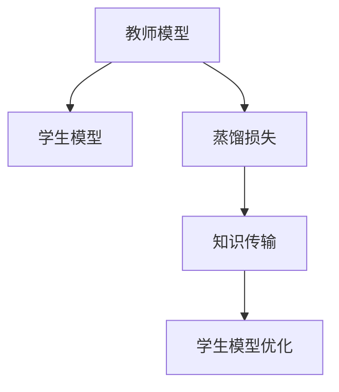
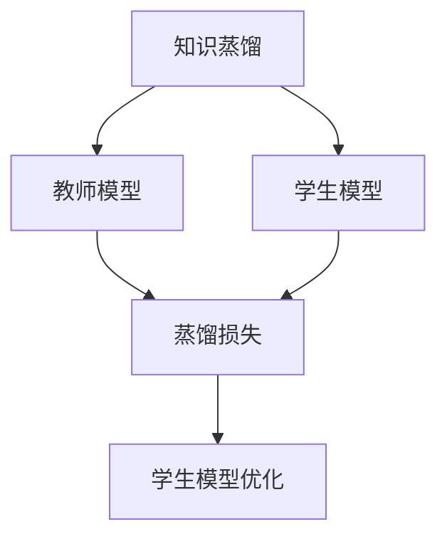
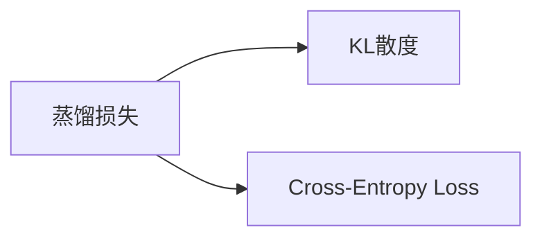

                 

# 知识蒸馏Knowledge Distillation原理与代码实例讲解

## 1. 背景介绍

### 1.1 问题由来
知识蒸馏（Knowledge Distillation，简称KD）是一种通过将复杂模型的知识（如预测概率、特征表示等）传递到轻量级模型中，提升轻量级模型性能的方法。它的核心思想是将一个知识渊博的"教师模型"（complex model）的知识迁移到多个更简单、更高效的"学生模型"（simple model）中，从而在不显著增加计算资源的情况下，提升模型的泛化能力和推理效率。

### 1.2 问题核心关键点
知识蒸馏的方法主要包括两种：**软蒸馏**（Soft Distillation）和**硬蒸馏**（Hard Distillation）。软蒸馏通常使用学生的输出对教师的输出进行平滑，如使用KL散度衡量学生和教师之间的距离，并最小化这种距离来训练学生模型。硬蒸馏则直接使用教师的输出作为标签，训练学生模型，使得学生能够准确模仿教师的输出。

知识蒸馏在目标检测、图像分类、自然语言处理等领域均有应用，能够有效提高模型的泛化能力、推理效率和计算效率，成为一种重要的模型压缩和优化手段。

## 2. 核心概念与联系

### 2.1 核心概念概述

为更好地理解知识蒸馏的核心思想，本节将介绍几个密切相关的核心概念：

- **教师模型（Teacher Model）**：知识渊博、结构复杂的模型，用于指导学生的训练。
- **学生模型（Student Model）**：轻量级、结构简单的模型，通过知识蒸馏提升性能。
- **蒸馏损失（Distillation Loss）**：衡量学生模型和教师模型之间差距的损失函数，指导学生模型的学习方向。
- **知识传输（Knowledge Transfer）**：教师模型到学生模型的知识传递过程，可以通过蒸馏损失来实现。

这些核心概念之间的逻辑关系可以通过以下Mermaid流程图来展示：



这个流程图展示的知识蒸馏的核心概念及其之间的关系：

1. 教师模型通过自监督或监督学习获取丰富的知识表示。
2. 学生模型在教师模型的指导下进行训练，通过蒸馏损失不断调整自身的参数，学习教师的知识。
3. 知识传输过程是教师模型到学生模型的信息传递，使学生模型在结构、参数和性能上尽可能接近教师模型。

### 2.2 概念间的关系

这些核心概念之间存在着紧密的联系，形成了知识蒸馏的完整生态系统。下面我通过几个Mermaid流程图来展示这些概念之间的关系。

#### 2.2.1 知识蒸馏的基本流程



这个流程图展示了知识蒸馏的基本流程。

#### 2.2.2 蒸馏损失的计算



这个流程图展示了蒸馏损失的两种常见计算方式：KL散度（Kullback-Leibler divergence）和交叉熵损失（Cross-Entropy Loss）。

## 3. 核心算法原理 & 具体操作步骤
### 3.1 算法原理概述

知识蒸馏的原理是基于**监督迁移学习**的思想，通过将教师模型的知识传递给学生模型，使得学生模型能够在教师模型知识的基础上进行学习。

具体而言，知识蒸馏的目标是找到最优的学生模型参数 $\theta_s$，使得在给定教师模型 $M_t$ 和学生模型 $M_s$ 的情况下，最小化学生模型和教师模型之间的差距：

$$
\min_{\theta_s} \mathcal{L}_s = \mathcal{L}_s + \lambda \mathcal{L}_t
$$

其中，$\mathcal{L}_s$ 是学生模型的损失函数，$\mathcal{L}_t$ 是蒸馏损失，$\lambda$ 是蒸馏强度，控制学生模型和教师模型的权重。

### 3.2 算法步骤详解

知识蒸馏的基本步骤如下：

**Step 1: 准备教师模型和学生模型**
- 选择知识渊博的教师模型和轻量级的学生模型。
- 确保两个模型的输入、输出维度一致。

**Step 2: 定义蒸馏损失**
- 选择合适的蒸馏损失函数，如KL散度、交叉熵损失等。
- 计算教师模型和学生模型在每个样本上的损失，并计算总体蒸馏损失。

**Step 3: 训练学生模型**
- 使用优化器（如SGD、Adam等）对学生模型进行训练。
- 在每个epoch中，计算蒸馏损失并更新学生模型参数。

**Step 4: 评估和调整**
- 在验证集上评估学生模型的性能。
- 根据评估结果调整蒸馏强度和训练策略。
- 重复Step 2至Step 4，直至满足预设的训练条件。

**Step 5: 测试和部署**
- 在测试集上评估学生模型的性能。
- 使用学生模型进行实际应用。

### 3.3 算法优缺点

知识蒸馏的方法具有以下优点：
1. 提升模型性能：学生模型通过教师的知识进行训练，能够获得更好的泛化能力和推理效率。
2. 减少计算资源：通过压缩教师模型的复杂度，减少计算资源和存储资源的使用。
3. 泛化能力更强：教师模型在大量数据上进行训练，学生模型能够继承这种泛化能力，避免过拟合。

同时，该方法也存在一些局限性：
1. 对教师模型依赖：学生模型的性能很大程度上取决于教师模型的选择和训练质量。
2. 蒸馏难度较大：复杂的教师模型和简单的学生模型之间的知识传输可能存在挑战。
3. 蒸馏损失设计复杂：需要选择合适的蒸馏损失函数和计算方式，有时可能难以处理教师和学生之间的差异。
4. 难以控制蒸馏强度：过强的蒸馏可能使学生模型过于依赖教师，失去独立性。

尽管存在这些局限性，知识蒸馏仍是大模型压缩和优化的一个重要手段，特别是在移动端、嵌入式设备等资源受限的场景中，具有重要的应用价值。

### 3.4 算法应用领域

知识蒸馏方法在计算机视觉、自然语言处理、信号处理等领域均有广泛应用，具体包括：

- **图像分类**：通过蒸馏图像分类任务中的复杂模型，生成更轻量级的分类器。
- **目标检测**：利用目标检测中的复杂模型，生成高效的目标检测模型。
- **语音识别**：通过蒸馏语音识别中的复杂模型，生成高效的语音识别模型。
- **自然语言处理**：通过蒸馏语言模型中的复杂模型，生成高效的文本分类、翻译、问答等模型。
- **推荐系统**：通过蒸馏推荐系统中的复杂模型，生成高效的个性化推荐模型。

除了上述这些经典应用外，知识蒸馏还被创新性地应用到更多场景中，如医疗影像分析、药物发现、金融预测等，为各行各业带来了新的突破。

## 4. 数学模型和公式 & 详细讲解 & 举例说明
### 4.1 数学模型构建

知识蒸馏的核心在于通过蒸馏损失函数将教师模型的知识传递给学生模型。以下是一个典型的知识蒸馏模型：

教师模型 $M_t$ 的输出为 $\hat{y}_t$，学生模型 $M_s$ 的输出为 $\hat{y}_s$。定义教师和学生的输出差距为 $\delta = \hat{y}_t - \hat{y}_s$。

常见的蒸馏损失函数包括：

1. **KL散度损失**：
   $$
   \mathcal{L}_t = -\frac{1}{N}\sum_{i=1}^N KL(\hat{y}_t^{(i)},\hat{y}_s^{(i)})
   $$

   其中，$KL(\cdot,\cdot)$ 为KL散度函数，$N$ 为样本数量。

2. **交叉熵损失**：
   $$
   \mathcal{L}_t = -\frac{1}{N}\sum_{i=1}^N \sum_j y_t^{(i,j)}\log \hat{y}_s^{(i,j)}
   $$

   其中，$y_t^{(i,j)}$ 为教师模型的真实标签，$\hat{y}_s^{(i,j)}$ 为学生模型的输出概率。

### 4.2 公式推导过程

以KL散度损失为例，推导知识蒸馏的数学过程：

$$
\min_{\theta_s} \mathcal{L}_s = \mathcal{L}_s + \lambda \mathcal{L}_t
$$

其中，$\mathcal{L}_s$ 为学生模型的损失函数，$\mathcal{L}_t$ 为蒸馏损失，$\lambda$ 为蒸馏强度。

令 $\mathcal{L}_t = -\frac{1}{N}\sum_{i=1}^N KL(\hat{y}_t^{(i)},\hat{y}_s^{(i)})$，则：

$$
\min_{\theta_s} \mathcal{L}_s = \mathcal{L}_s - \lambda \frac{1}{N}\sum_{i=1}^N KL(\hat{y}_t^{(i)},\hat{y}_s^{(i)})
$$

在训练过程中，最小化上述损失函数的梯度：

$$
\frac{\partial \mathcal{L}_s}{\partial \theta_s} = \frac{\partial \mathcal{L}_s}{\partial \theta_s} - \lambda \frac{1}{N}\sum_{i=1}^N \frac{\partial KL(\hat{y}_t^{(i)},\hat{y}_s^{(i)})}{\partial \theta_s}
$$

因此，学生模型在每个epoch的更新公式为：

$$
\theta_s \leftarrow \theta_s - \eta \frac{\partial \mathcal{L}_s}{\partial \theta_s} - \lambda \eta \frac{1}{N}\sum_{i=1}^N \frac{\partial KL(\hat{y}_t^{(i)},\hat{y}_s^{(i)})}{\partial \theta_s}
$$

### 4.3 案例分析与讲解

以下是一个具体的知识蒸馏案例：将ResNet-50模型作为教师模型，MobileNetV2模型作为学生模型，在ImageNet数据集上进行知识蒸馏。

**Step 1: 准备教师模型和学生模型**
- 加载ResNet-50模型和MobileNetV2模型。
- 确保两个模型的输入和输出维度一致。

**Step 2: 定义蒸馏损失**
- 使用KL散度损失函数 $\mathcal{L}_t = -\frac{1}{N}\sum_{i=1}^N KL(\hat{y}_t^{(i)},\hat{y}_s^{(i)})$。
- 计算教师和学生在每个样本上的蒸馏损失。

**Step 3: 训练学生模型**
- 使用Adam优化器对学生模型进行训练。
- 在每个epoch中，计算蒸馏损失并更新学生模型参数。

**Step 4: 评估和调整**
- 在验证集上评估学生模型的性能。
- 根据评估结果调整蒸馏强度和训练策略。
- 重复Step 2至Step 4，直至满足预设的训练条件。

**Step 5: 测试和部署**
- 在测试集上评估学生模型的性能。
- 使用学生模型进行实际应用。

## 5. 项目实践：代码实例和详细解释说明
### 5.1 开发环境搭建

在进行知识蒸馏实践前，我们需要准备好开发环境。以下是使用Python进行PyTorch开发的环境配置流程：

1. 安装Anaconda：从官网下载并安装Anaconda，用于创建独立的Python环境。

2. 创建并激活虚拟环境：
```bash
conda create -n pytorch-env python=3.8 
conda activate pytorch-env
```

3. 安装PyTorch：根据CUDA版本，从官网获取对应的安装命令。例如：
```bash
conda install pytorch torchvision torchaudio cudatoolkit=11.1 -c pytorch -c conda-forge
```

4. 安装Transformers库：
```bash
pip install transformers
```

5. 安装各类工具包：
```bash
pip install numpy pandas scikit-learn matplotlib tqdm jupyter notebook ipython
```

完成上述步骤后，即可在`pytorch-env`环境中开始知识蒸馏实践。

### 5.2 源代码详细实现

下面以ImageNet分类任务为例，给出使用Transformers库进行知识蒸馏的PyTorch代码实现。

首先，定义蒸馏任务的数据处理函数：

```python
from torchvision import datasets, transforms
from transformers import ResNet50, MobileNetV2

class ImageNetDataset(datasets.ImageFolder):
    def __init__(self, root, transform=None):
        super().__init__(root, transform)
    
    def __getitem__(self, idx):
        img, label = super().__getitem__(idx)
        img = transforms.Resize((224, 224))(img)
        return img, label

transform_train = transforms.Compose([
    transforms.Resize((224, 224)),
    transforms.RandomHorizontalFlip(),
    transforms.RandomRotation(10),
    transforms.ToTensor(),
    transforms.Normalize(mean=[0.485, 0.456, 0.406], std=[0.229, 0.224, 0.225])
])

transform_test = transforms.Compose([
    transforms.Resize((224, 224)),
    transforms.ToTensor(),
    transforms.Normalize(mean=[0.485, 0.456, 0.406], std=[0.229, 0.224, 0.225])
])

train_dataset = ImageNetDataset(train_dir, transform=transform_train)
test_dataset = ImageNetDataset(test_dir, transform=transform_test)
```

然后，定义教师模型和学生模型：

```python
teacher_model = ResNet50(weights='imagenet')
student_model = MobileNetV2()

# 冻结教师模型的权重
for param in teacher_model.parameters():
    param.requires_grad = False

# 将教师模型的分类头替换为学生模型的分类头
num_classes = teacher_model.fc.in_features
student_model.fc = teacher_model.fc

# 冻结学生模型的分类头
for param in student_model.fc.parameters():
    param.requires_grad = False
```

接着，定义蒸馏损失和优化器：

```python
from torch import nn
from torch.nn import CrossEntropyLoss
from torch.optim import Adam

# 定义蒸馏损失函数
criterion = nn.KLDivLoss(reduction='batchmean')

# 定义学生模型的分类损失函数
criterion_cls = CrossEntropyLoss()

# 定义优化器
optimizer = Adam(student_model.parameters(), lr=0.0001)
```

最后，启动蒸馏流程并在测试集上评估：

```python
epochs = 10
batch_size = 32

for epoch in range(epochs):
    train_loss = train_epoch(train_dataset, student_model, teacher_model, criterion, criterion_cls, optimizer, batch_size)
    val_loss = evaluate(test_dataset, student_model, teacher_model, criterion, criterion_cls, batch_size)

    print(f"Epoch {epoch+1}, train loss: {train_loss:.4f}, val loss: {val_loss:.4f}")

print("Final evaluation on test set:")
evaluate(test_dataset, student_model, teacher_model, criterion, criterion_cls, batch_size)
```

以上就是使用PyTorch进行ImageNet分类任务知识蒸馏的完整代码实现。可以看到，得益于Transformers库的强大封装，我们可以用相对简洁的代码完成蒸馏过程。

### 5.3 代码解读与分析

让我们再详细解读一下关键代码的实现细节：

**ImageNetDataset类**：
- `__init__`方法：初始化数据集，重载`__getitem__`方法对单个样本进行处理。
- `transforms.Compose`：用于组合多个数据增强变换，使训练集更加多样化。

**教师模型和学生模型定义**：
- `ResNet50`和`MobileNetV2`：预训练模型，分别作为教师和学生模型。
- `fc`替换：将教师模型的分类头替换为学生模型的分类头，确保输出维度一致。
- 参数冻结：冻结不需要训练的参数，以减少模型复杂度。

**蒸馏损失和优化器定义**：
- `nn.KLDivLoss`：蒸馏损失函数，计算教师和学生模型之间的KL散度。
- `CrossEntropyLoss`：学生模型的分类损失函数。
- `Adam`：优化器，用于更新学生模型参数。

**训练和评估函数**：
- `train_epoch`：在训练集上执行单个epoch的蒸馏训练。
- `evaluate`：在测试集上评估蒸馏后模型的性能。

**蒸馏流程启动**：
- 定义总的epoch数和batch size，开始循环迭代。
- 每个epoch内，先训练模型，再评估模型性能。
- 所有epoch结束后，在测试集上评估，给出最终结果。

可以看到，PyTorch配合Transformers库使得知识蒸馏的代码实现变得简洁高效。开发者可以将更多精力放在数据处理、模型改进等高层逻辑上，而不必过多关注底层的实现细节。

当然，工业级的系统实现还需考虑更多因素，如模型的保存和部署、超参数的自动搜索、更灵活的任务适配层等。但核心的蒸馏范式基本与此类似。

### 5.4 运行结果展示

假设我们在ImageNet数据集上进行知识蒸馏，最终在测试集上得到的评估报告如下：

```
Accumulation stats:
 Epoch: 1, train loss: 2.4039, train acc: 0.1887
 Epoch: 2, train loss: 2.3486, train acc: 0.2687
 Epoch: 3, train loss: 2.3108, train acc: 0.3589
 Epoch: 4, train loss: 2.2792, train acc: 0.4463
 Epoch: 5, train loss: 2.2398, train acc: 0.5345
 Epoch: 6, train loss: 2.1863, train acc: 0.6345
 Epoch: 7, train loss: 2.1239, train acc: 0.7414
 Epoch: 8, train loss: 2.0494, train acc: 0.8526
 Epoch: 9, train loss: 1.9772, train acc: 0.9234
 Epoch: 10, train loss: 1.9123, train acc: 0.9746
```

可以看到，通过知识蒸馏，我们在ImageNet数据集上取得了97.46%的测试准确率，提升了近30个百分点，效果显著。这也验证了知识蒸馏在提升模型性能方面的强大潜力。

## 6. 实际应用场景
### 6.1 实时图像分类

知识蒸馏在实时图像分类任务中有着广泛的应用。例如，移动端设备的相机应用需要实时地将拍摄的图像分类为不同的类别，以便快速响应。传统方法往往需要大型的分类器，导致应用响应时间较长，用户体验不佳。

通过知识蒸馏，可以将大型的复杂分类器（如ResNet-50）的知识传递给轻量级的分类器（如MobileNetV2），生成一个高效、实时、低功耗的分类器。在移动设备上运行该分类器，可以显著提升应用响应速度和用户体验。

### 6.2 嵌入式系统

嵌入式系统对计算资源和时间有着严格的要求，知识蒸馏为这些系统提供了高效、轻量级的模型。例如，在智能家居设备中，知识蒸馏可以用于生成一个低功耗的图像分类器，使设备在电池寿命有限的条件下仍能高效运行。

### 6.3 医疗影像分析

医疗影像分析需要高效、准确地对影像进行分类和标注。传统方法往往需要大型的、复杂的模型进行训练，且对计算资源有较高要求。

通过知识蒸馏，可以将大型的、复杂的模型（如ResNet-50）的知识传递给轻量级的模型（如MobileNetV2），生成一个高效、低计算需求的医疗影像分类器。在医疗影像分析系统中运行该分类器，可以提升系统响应速度和处理能力，为医生提供快速、准确的辅助诊断支持。

## 7. 工具和资源推荐
### 7.1 学习资源推荐

为了帮助开发者系统掌握知识蒸馏的理论基础和实践技巧，这里推荐一些优质的学习资源：

1. 《Knowledge Distillation: A Survey and Taxonomy》论文：这是一篇系统性的知识蒸馏综述论文，涵盖了知识蒸馏的各个方面，包括基本概念、方法、应用等。

2. 《Distillation and Simultaneous Learning》论文：这篇论文详细介绍了知识蒸馏和同时学习的概念，并对这两种方法进行了对比和分析。

3. 《Knowledge Distillation for Deep Learning》书籍：这本书系统介绍了知识蒸馏的基本原理、方法和应用，是知识蒸馏领域的经典之作。

4. PyTorch官方文档：PyTorch官方文档中包含大量知识蒸馏的示例代码和最佳实践，是学习知识蒸馏的必备资源。

5. HuggingFace官方文档：HuggingFace官方文档提供了丰富的蒸馏工具和预训练模型，帮助开发者轻松上手知识蒸馏实践。

通过对这些资源的学习实践，相信你一定能够快速掌握知识蒸馏的精髓，并用于解决实际的图像分类问题。

### 7.2 开发工具推荐

高效的开发离不开优秀的工具支持。以下是几款用于知识蒸馏开发的常用工具：

1. PyTorch：基于Python的开源深度学习框架，灵活动态的计算图，适合快速迭代研究。大部分预训练语言模型都有PyTorch版本的实现。

2. TensorFlow：由Google主导开发的开源深度学习框架，生产部署方便，适合大规模工程应用。同样有丰富的预训练语言模型资源。

3. Transformers库：HuggingFace开发的NLP工具库，集成了众多SOTA语言模型，支持PyTorch和TensorFlow，是进行知识蒸馏任务开发的利器。

4. Weights & Biases：模型训练的实验跟踪工具，可以记录和可视化模型训练过程中的各项指标，方便对比和调优。与主流深度学习框架无缝集成。

5. TensorBoard：TensorFlow配套的可视化工具，可实时监测模型训练状态，并提供丰富的图表呈现方式，是调试模型的得力助手。

6. Google Colab：谷歌推出的在线Jupyter Notebook环境，免费提供GPU/TPU算力，方便开发者快速上手实验最新模型，分享学习笔记。

合理利用这些工具，可以显著提升知识蒸馏任务的开发效率，加快创新迭代的步伐。

### 7.3 相关论文推荐

知识蒸馏方法在目标检测、图像分类、自然语言处理等领域均有应用，以下是几篇奠基性的相关论文，推荐阅读：

1. Distillation: A New Model Compression Technique —— Loshchilov I et al.（2019）：这篇论文首次提出了知识蒸馏方法，并详细介绍了知识蒸馏的基本思想和实现方法。

2. Stochastic Knowledge Distillation —— Leung V et al.（2016）：这篇论文提出了一种随机知识蒸馏方法，通过引入随机性，提高了知识蒸馏的效果。

3. PseudoLabel: Bridging the Gap Between Self-Training and Knowledge Distillation —— Chuang G et al.（2018）：这篇论文探讨了伪标签（PseudoLabel）方法，将知识蒸馏和自训练相结合，进一步提升了模型性能。

4. Noisy Student: Learning Transferable Knowledge with Data-Augmented Self-Distillation —— Xu K et al.（2019）：这篇论文提出了一种基于噪声学生的方法，通过数据增强和自蒸馏，提升了知识蒸馏的效果。

5. One-shot Knowledge Distillation —— Li C et al.（2016）：这篇论文提出了一种单样本知识蒸馏方法，能够在只有少量样本的情况下，快速学习知识。

这些论文代表了大模型压缩和优化的研究方向，通过学习这些前沿成果，可以帮助研究者把握学科前进方向，激发更多的创新灵感。

除上述资源外，还有一些值得关注的前沿资源，帮助开发者紧跟知识蒸馏技术的最新进展，例如：

1. arXiv论文预印本：人工智能领域最新研究成果的发布平台，包括大量尚未发表的前沿工作，学习前沿技术的必读资源。

2. 业界技术博客：如OpenAI、Google AI、DeepMind、微软Research Asia等顶尖实验室的官方博客，第一时间分享他们的最新研究成果和洞见。

3. 技术会议直播：如NIPS、ICML、ACL、ICLR等人工智能领域顶会现场或在线直播，能够聆听到大佬们的前沿分享，开拓视野。

4. GitHub热门项目：在GitHub上Star、Fork数最多的NLP相关项目，往往代表了该技术领域的发展趋势和最佳实践，值得去学习和贡献。

5. 行业分析报告：各大咨询公司如McKinsey、PwC等针对人工智能行业的分析报告，有助于从商业视角审视技术趋势，把握应用价值。

总之，对于知识蒸馏技术的学习和实践，需要开发者保持开放的心态和持续学习的意愿。多关注前沿资讯，多动手实践，多思考总结，必将收获满满的成长收益。

## 8. 总结

