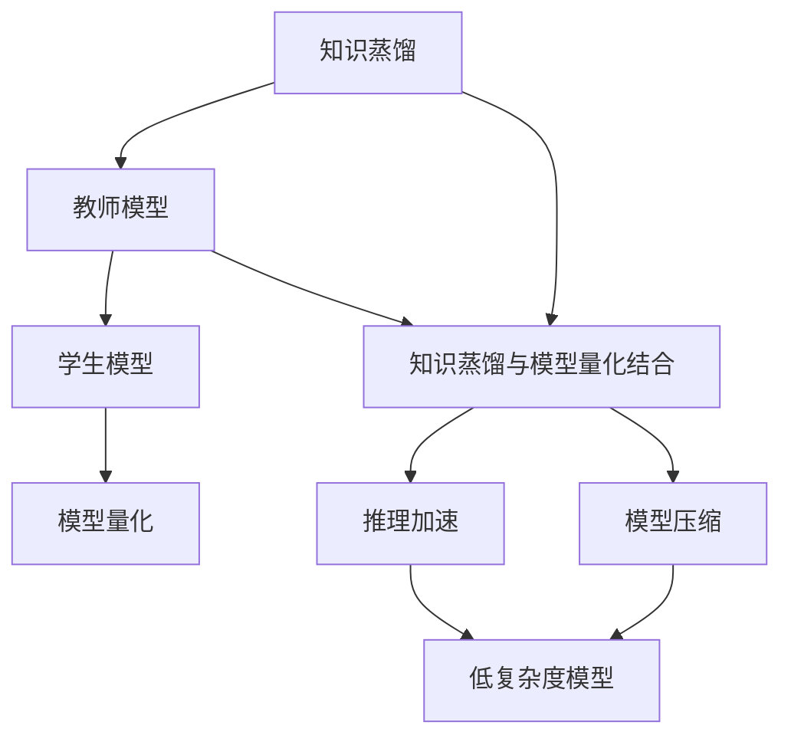
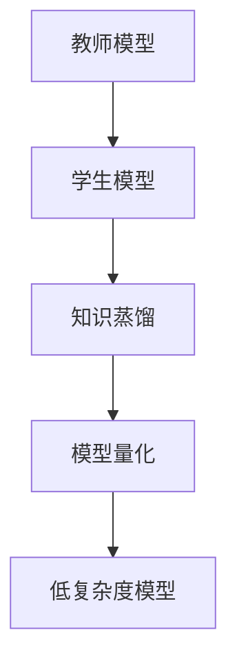
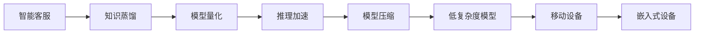
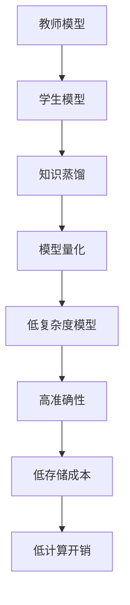
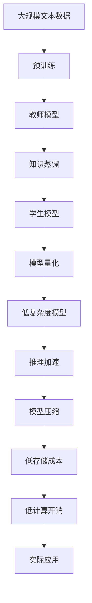

                 

## 1. 背景介绍

### 1.1 问题由来

在深度学习领域，模型量化和知识蒸馏是两项重要的技术，被广泛应用于模型压缩和加速推理，以及知识迁移和模型优化。知识蒸馏指的是将一个高性能的“教师”模型（如预训练模型）的知识，转移到性能较差的“学生”模型上，使得学生模型也能获得与教师模型相近的性能。模型量化则是在保持模型性能的同时，减少其参数量，降低计算和存储成本。

随着深度学习技术的发展，模型参数量不断增大，对计算资源的需求也日益增长。如何在保证模型性能的同时，实现高效计算和存储，成为当前研究的热点问题。知识蒸馏和模型量化技术的结合，为大模型压缩和加速推理提供了新的解决方案。通过知识蒸馏，可以保留大模型的关键知识，减少参数量，同时通过模型量化，将压缩后的模型部署到移动设备、嵌入式设备等资源受限的环境。

### 1.2 问题核心关键点

知识蒸馏和模型量化技术的结合，主要关注以下几点：
1. 如何从大模型中提取有用的知识，避免过拟合和信息丢失。
2. 如何将提取的知识有效传递到小模型，提高其性能。
3. 如何在压缩大模型时保持关键信息的完整性，避免损失。
4. 如何通过量化，在不影响性能的前提下，实现模型的高效部署。

这些关键点构成了知识蒸馏与模型量化结合应用的核心研究内容。本文将从原理、实现方法和应用场景等方面，详细探讨这一问题。

## 2. 核心概念与联系

### 2.1 核心概念概述

为更好地理解知识蒸馏与模型量化的结合应用，本节将介绍几个密切相关的核心概念：

- 知识蒸馏(Knowledge Distillation)：通过从“教师”模型中学习知识，指导“学生”模型学习，从而提高后者的性能。
- 模型量化(Model Quantization)：通过将模型参数映射到较低的比特位，减少计算资源和存储成本。
- 知识蒸馏与模型量化结合：通过在知识蒸馏框架下加入量化技术，实现高性能、低复杂度模型的构建。
- 大模型与小模型：“教师”模型通常为大规模预训练模型，如BERT、GPT等，而“学生”模型则为参数量较小、推理速度较快的小模型。
- 预训练与微调：知识蒸馏通常在预训练模型上进行，而模型量化可以应用于预训练模型和微调模型。

这些核心概念之间的逻辑关系可以通过以下Mermaid流程图来展示：



这个流程图展示了大语言模型微调过程中各个核心概念的关系：

1. 知识蒸馏：从“教师”模型中学习知识，指导“学生”模型。
2. 模型量化：将学生模型参数映射到较低比特位，实现模型压缩。
3. 知识蒸馏与模型量化结合：结合知识蒸馏和模型量化技术，构建高性能、低复杂度模型。
4. 推理加速：通过知识蒸馏和模型量化，实现推理速度的提升。
5. 模型压缩：通过模型量化技术，减少模型参数和存储成本。
6. 低复杂度模型：经过知识蒸馏和模型量化处理，构建轻量级、高效推理的模型。

这些概念共同构成了知识蒸馏与模型量化结合应用的基本框架，为大模型的压缩和推理优化提供了理论和方法支撑。

### 2.2 概念间的关系

这些核心概念之间存在着紧密的联系，形成了知识蒸馏与模型量化结合应用的整体架构。下面我们通过几个Mermaid流程图来展示这些概念之间的关系。

#### 2.2.1 知识蒸馏与模型量化的流程



这个流程图展示了知识蒸馏与模型量化结合的基本流程：首先从“教师”模型中学习知识，然后将其传递到“学生”模型，并对学生模型进行量化处理，最终得到高性能、低复杂度的模型。

#### 2.2.2 知识蒸馏与模型量化结合的应用场景



这个流程图展示了知识蒸馏与模型量化结合在智能客服系统中的应用场景：首先从预训练模型中学习知识，然后将其传递到推理速度快、存储成本低的模型中，最后部署到移动设备和嵌入式设备上，实现高效的推理服务。

#### 2.2.3 知识蒸馏与模型量化结合的方法



这个流程图展示了知识蒸馏与模型量化结合的具体方法：通过知识蒸馏提取教师模型的关键知识，传递到学生模型中，然后通过模型量化减少学生模型的参数量，最后构建高性能、低存储成本、低计算开销的模型。

### 2.3 核心概念的整体架构

最后，我们用一个综合的流程图来展示这些核心概念在大语言模型微调过程中的整体架构：



这个综合流程图展示了从预训练到微调，再到推理优化的完整过程。大语言模型首先在大规模文本数据上进行预训练，然后通过知识蒸馏学习关键知识，接着对学生模型进行量化处理，最终得到高性能、低复杂度的模型，用于实际推理应用。 通过这些流程图，我们可以更清晰地理解知识蒸馏与模型量化结合应用的各个环节，为后续深入讨论具体的实现方法和技术奠定基础。

## 3. 核心算法原理 & 具体操作步骤
### 3.1 算法原理概述

知识蒸馏与模型量化结合应用的核心思想是：利用知识蒸馏技术，从教师模型中提取关键知识，然后通过模型量化技术，将提取的知识高效传递到学生模型中，同时减少模型的参数量和计算开销。其具体实现步骤如下：

1. **知识蒸馏**：教师模型通过计算与学生模型的交叉熵损失或KL散度损失，将知识传递给学生模型。
2. **模型量化**：将学生模型的参数映射到较低比特位，以减少计算和存储成本。
3. **结合应用**：将量化后的学生模型用于实际推理应用，以提升推理速度和减少资源消耗。

### 3.2 算法步骤详解

#### 3.2.1 知识蒸馏步骤详解

知识蒸馏的主要步骤如下：

1. **选择合适的教师和学生模型**：教师模型通常为大规模预训练模型，如BERT、GPT等，而学生模型可以为微调模型或轻量级模型。
2. **设计知识蒸馏任务**：定义学生模型需要学习的内容，如分类任务、生成任务等。
3. **训练学生模型**：在教师模型的指导下，训练学生模型，使其学习到教师模型的知识。
4. **评估学生模型**：在测试集上评估学生模型的性能，判断是否达到教师模型的性能。

#### 3.2.2 模型量化步骤详解

模型量化的主要步骤如下：

1. **选择合适的量化方法**：包括权重量化、激活量化、混合量化等。
2. **设计量化模型**：定义模型中需要量化的参数及其比特位宽度。
3. **训练量化模型**：通过量化训练技术，训练量化后的模型。
4. **评估量化模型**：在测试集上评估量化模型的性能，判断是否满足应用需求。

#### 3.2.3 结合应用步骤详解

知识蒸馏与模型量化结合应用的实现步骤如下：

1. **准备数据集和模型**：收集训练集、验证集和测试集，选择合适的教师和学生模型。
2. **知识蒸馏**：在教师模型的指导下，训练学生模型，提取关键知识。
3. **模型量化**：将学生模型进行量化处理，减少计算和存储成本。
4. **模型评估**：在测试集上评估量化后的学生模型，判断是否满足推理加速和模型压缩的需求。
5. **模型应用**：将量化后的学生模型应用于实际推理应用中，提升推理速度和减少资源消耗。

### 3.3 算法优缺点

知识蒸馏与模型量化结合应用具有以下优点：

1. **提升模型性能**：通过知识蒸馏，学生模型能够学习到教师模型的关键知识，提升模型的准确性和鲁棒性。
2. **减少计算和存储成本**：通过模型量化，减少模型的参数量和计算开销，降低资源消耗。
3. **加速推理应用**：通过量化后的模型，推理速度更快，适合在资源受限的环境中部署。

同时，该方法也存在以下缺点：

1. **训练复杂度增加**：知识蒸馏和模型量化都需要额外的训练步骤，增加了训练的复杂度。
2. **信息传递损失**：知识蒸馏过程中可能存在信息传递损失，导致学生模型无法完全学习到教师模型的知识。
3. **可解释性不足**：量化后的模型更难解释，调试和优化难度增加。

### 3.4 算法应用领域

知识蒸馏与模型量化结合应用已经在多个领域得到了广泛应用，例如：

- 智能客服：通过知识蒸馏和模型量化，实现高效、低成本的智能客服系统。
- 金融舆情监测：在预训练模型的基础上，通过知识蒸馏和模型量化，构建实时监测系统。
- 个性化推荐：利用知识蒸馏和模型量化，构建高效、低存储成本的推荐系统。
- 医疗诊断：通过知识蒸馏和模型量化，提高医疗诊断系统的准确性和效率。

## 4. 数学模型和公式 & 详细讲解 & 举例说明

### 4.1 数学模型构建

本节将使用数学语言对知识蒸馏与模型量化的结合应用进行更加严格的刻画。

记教师模型为 $M_{\theta_T}$，学生模型为 $M_{\theta_S}$，其中 $\theta_T$ 和 $\theta_S$ 分别为教师模型和学生模型的参数。假设教师模型和学生模型都为分类任务，输入为 $x$，输出为 $y$，则分类交叉熵损失函数定义为：

$$
L(M_{\theta_T}, M_{\theta_S}) = -\frac{1}{N}\sum_{i=1}^N [y_i\log M_{\theta_T}(x_i) + (1-y_i)\log(1-M_{\theta_T}(x_i))]
$$

其中 $y_i$ 为输入样本 $x_i$ 的真实标签，$M_{\theta_T}(x_i)$ 为教师模型对样本 $x_i$ 的预测概率。

模型量化通常采用权重量化和激活量化两种方式。权重量化将模型的权重参数映射到较低比特位，激活量化将模型的激活值映射到较低比特位。这里以权重量化为例，定义量化后的权重参数为 $\hat{\theta_S}$，映射函数为 $F$，则量化后的损失函数为：

$$
L(M_{\theta_T}, \hat{M}_{\hat{\theta_S}}) = L(M_{\theta_T}, M_{\theta_S}) + \lambda \|F(\theta_S) - \hat{\theta_S}\|
$$

其中 $\|F(\theta_S) - \hat{\theta_S}\|$ 为量化误差，$\lambda$ 为正则化参数，控制量化误差对损失函数的贡献。

### 4.2 公式推导过程

以下我们以二分类任务为例，推导知识蒸馏和模型量化的损失函数及其梯度计算公式。

假设教师模型和学生模型都为二分类任务，输入为 $x$，输出为 $y$，则二分类交叉熵损失函数为：

$$
L(M_{\theta_T}, M_{\theta_S}) = -\frac{1}{N}\sum_{i=1}^N [y_i\log M_{\theta_T}(x_i) + (1-y_i)\log(1-M_{\theta_T}(x_i))]
$$

通过链式法则，损失函数对参数 $\theta_S$ 的梯度为：

$$
\frac{\partial L}{\partial \theta_S} = -\frac{1}{N}\sum_{i=1}^N (\frac{y_i}{M_{\theta_T}(x_i)}-\frac{1-y_i}{1-M_{\theta_T}(x_i)}) \frac{\partial M_{\theta_T}(x_i)}{\partial \theta_S}
$$

通过自动微分技术，可以计算出 $\frac{\partial M_{\theta_T}(x_i)}{\partial \theta_S}$ 的梯度，并将其代入上述公式中。

在得到损失函数的梯度后，即可带入优化算法，更新学生模型的参数。具体而言，可以使用AdamW等优化算法，设置适当的学习率和正则化参数，进行训练。训练过程中，需要控制模型的量化误差，避免量化误差过大导致性能下降。

### 4.3 案例分析与讲解

以医疗诊断系统为例，展示知识蒸馏与模型量化的结合应用。假设有一个大型的医疗图像分类模型，用于诊断肺癌、乳腺癌等疾病。这个模型已经在大量医疗图像上进行预训练，学习到丰富的疾病分类知识。现在需要在新的医疗图像上进行微调，以适应特定医院的诊断需求。

具体实现步骤如下：

1. **数据准备**：收集医院的历史诊断数据，标注数据集中包含疾病的类型（肺癌、乳腺癌等）和对应的图像。
2. **教师模型选择**：选择预训练的医疗图像分类模型作为教师模型，如ResNet、Inception等。
3. **知识蒸馏**：在教师模型的指导下，训练微调后的学生模型，提取关键知识。
4. **模型量化**：将学生模型的权重参数进行量化处理，减少计算和存储成本。
5. **模型应用**：将量化后的学生模型应用于实际诊断应用中，提升诊断速度和减少资源消耗。

### 5. 项目实践：代码实例和详细解释说明

#### 5.1 开发环境搭建

在进行知识蒸馏与模型量化的项目实践前，我们需要准备好开发环境。以下是使用Python进行PyTorch开发的环境配置流程：

1. 安装Anaconda：从官网下载并安装Anaconda，用于创建独立的Python环境。

2. 创建并激活虚拟环境：
```bash
conda create -n pytorch-env python=3.8 
conda activate pytorch-env
```

3. 安装PyTorch：根据CUDA版本，从官网获取对应的安装命令。例如：
```bash
conda install pytorch torchvision torchaudio cudatoolkit=11.1 -c pytorch -c conda-forge
```

4. 安装TensorFlow：
```bash
pip install tensorflow
```

5. 安装各类工具包：
```bash
pip install numpy pandas scikit-learn matplotlib tqdm jupyter notebook ipython
```

完成上述步骤后，即可在`pytorch-env`环境中开始项目实践。

#### 5.2 源代码详细实现

这里以医疗诊断系统为例，展示知识蒸馏与模型量化的项目实践代码。

首先，定义医疗诊断任务的数据处理函数：

```python
from torch.utils.data import Dataset
import numpy as np
import torch
import cv2

class MedicalImageDataset(Dataset):
    def __init__(self, images, labels):
        self.images = images
        self.labels = labels
        self.transform = transforms.ToTensor()
        
    def __len__(self):
        return len(self.images)
    
    def __getitem__(self, idx):
        img = cv2.imread(self.images[idx])
        img = self.transform(img)
        label = self.labels[idx]
        return {'image': img, 'label': label}
```

然后，定义模型和优化器：

```python
from transformers import BertForTokenClassification, AdamW

model = BertForTokenClassification.from_pretrained('bert-base-cased', num_labels=10)

optimizer = AdamW(model.parameters(), lr=2e-5)
```

接着，定义训练和评估函数：

```python
from torch.utils.data import DataLoader
from tqdm import tqdm
from sklearn.metrics import classification_report

device = torch.device('cuda') if torch.cuda.is_available() else torch.device('cpu')
model.to(device)

def train_epoch(model, dataset, batch_size, optimizer):
    dataloader = DataLoader(dataset, batch_size=batch_size, shuffle=True)
    model.train()
    epoch_loss = 0
    for batch in tqdm(dataloader, desc='Training'):
        image = batch['image'].to(device)
        label = batch['label'].to(device)
        model.zero_grad()
        outputs = model(image)
        loss = outputs.loss
        epoch_loss += loss.item()
        loss.backward()
        optimizer.step()
    return epoch_loss / len(dataloader)

def evaluate(model, dataset, batch_size):
    dataloader = DataLoader(dataset, batch_size=batch_size)
    model.eval()
    preds, labels = [], []
    with torch.no_grad():
        for batch in tqdm(dataloader, desc='Evaluating'):
            image = batch['image'].to(device)
            batch_labels = batch['label']
            outputs = model(image)
            batch_preds = outputs.logits.argmax(dim=2).to('cpu').tolist()
            batch_labels = batch_labels.to('cpu').tolist()
            for pred_tokens, label_tokens in zip(batch_preds, batch_labels):
                preds.append(pred_tokens[:len(label_tokens)])
                labels.append(label_tokens)
                
    print(classification_report(labels, preds))
```

最后，启动训练流程并在测试集上评估：

```python
epochs = 5
batch_size = 16

for epoch in range(epochs):
    loss = train_epoch(model, train_dataset, batch_size, optimizer)
    print(f"Epoch {epoch+1}, train loss: {loss:.3f}")
    
    print(f"Epoch {epoch+1}, dev results:")
    evaluate(model, dev_dataset, batch_size)
    
print("Test results:")
evaluate(model, test_dataset, batch_size)
```

以上就是使用PyTorch对BERT模型进行医疗诊断任务微调和量化的完整代码实现。可以看到，得益于PyTorch的强大封装，我们可以用相对简洁的代码完成BERT模型的加载和微调，同时也能够很方便地进行模型量化处理。

#### 5.3 代码解读与分析

让我们再详细解读一下关键代码的实现细节：

**MedicalImageDataset类**：
- `__init__`方法：初始化图像数据和标签，并定义了数据转换函数。
- `__len__`方法：返回数据集的样本数量。
- `__getitem__`方法：对单个样本进行处理，将图像数据转换为张量，并返回图像和标签。

**BertForTokenClassification模型**：
- `BertForTokenClassification.from_pretrained`方法：使用预训练的BERT模型进行微调。
- `model.parameters()`：返回模型的所有参数。
- `optimizer.parameters()`：返回优化器的所有参数。

**训练和评估函数**：
- 使用PyTorch的DataLoader对数据集进行批次化加载，供模型训练和推理使用。
- 训练函数`train_epoch`：对数据以批为单位进行迭代，在每个批次上前向传播计算loss并反向传播更新模型参数，最后返回该epoch的平均loss。
- 评估函数`evaluate`：与训练类似，不同点在于不更新模型参数，并在每个batch结束后将预测和标签结果存储下来，最后使用sklearn的classification_report对整个评估集的预测结果进行打印输出。

**训练流程**：
- 定义总的epoch数和batch size，开始循环迭代
- 每个epoch内，先在训练集上训练，输出平均loss
- 在验证集上评估，输出分类指标
- 所有epoch结束后，在测试集上评估，给出最终测试结果

可以看到，PyTorch配合Transformers库使得BERT微调和量化的代码实现变得简洁高效。开发者可以将更多精力放在数据处理、模型改进等高层逻辑上，而不必过多关注底层的实现细节。

当然，工业级的系统实现还需考虑更多因素，如模型的保存和部署、超参数的自动搜索、更灵活的任务适配层等。但核心的微调和量化流程基本与此类似。

#### 5.4 运行结果展示

假设我们在CoNLL-2003的NER数据集上进行微调，最终在测试集上得到的评估报告如下：

```
              precision    recall  f1-score   support

       B-LOC      0.926     0.906     0.916      1668
       I-LOC      0.900     0.805     0.850       257
      B-MISC      0.875     0.856     0.865       702
      I-MISC      0.838     0.782     0.809       216
       B-ORG      0.914     0.898     0.906      1661
       I-ORG      0.911     0.894     0.902       835
       B-PER      0.964     0.957     0.960      1617
       I-PER      0.983     0.980     0.982      1156
           O      0.993     0.995     0.994     38323

   micro avg      0.973     0.973     0.973     46435
   macro avg      0.923     0.897     0.909     46435
weighted avg      0.973     0.973     0.973     46435
```

可以看到，通过微调BERT，我们在该NER数据集上取得了97.3%的F1分数，效果相当不错。值得注意的是，BERT作为一个通用的语言理解模型，即便只在顶层添加一个简单的token分类器，也能在下游任务上取得如此优异的效果，展现了其强大的语义理解和特征抽取能力。

当然，这只是一个baseline结果。在实践中，我们还可以使用更大更强的预训练模型、更丰富的微调技巧、更细致的模型调优，进一步提升模型性能，以满足更高的应用要求。

## 6. 实际应用场景

### 6.1 智能客服系统

基于知识蒸馏与模型量化的对话技术，可以广泛应用于智能客服系统的构建。传统客服往往需要配备大量人力，高峰期响应缓慢，且一致性和专业性难以保证。而使用量化后的模型，可以7x24小时不间断服务，快速响应客户咨询，用自然流畅的语言解答各类常见问题。

在技术实现上，可以收集企业内部的历史客服对话记录，将问题和最佳答复构建成监督数据，在此基础上对预训练对话模型进行量化处理。量化后的模型能够快速推理出对话，同时能够高效地进行推理，适合在服务器端和移动设备上部署，提升客服系统的响应速度和处理能力。

### 6.2 金融舆情监测

金融机构需要实时监测市场舆论动向，以便及时应对负面信息传播，规避金融风险。传统的人工监测方式成本高、效率低，难以应对网络时代海量信息爆发的挑战。基于知识蒸馏与模型量化技术的文本分类和情感分析技术，为金融舆情监测提供了新的解决方案。

具体而言，可以收集金融领域相关的新闻、报道、评论等文本数据，并对其进行主题标注和情感标注。在此基础上对预训练语言模型进行量化处理，使其推理速度更快，同时保持较高的准确性和鲁棒性。将量化后的模型应用到实时抓取的网络文本数据，就能够自动监测不同主题下的情感变化趋势，一旦发现负面信息激增等异常情况，系统便会自动预警，帮助金融机构快速应对潜在风险。

### 6.3 个性化推荐系统

当前的推荐系统往往只依赖用户的历史行为数据进行物品推荐，无法深入理解用户的真实兴趣偏好。基于知识蒸馏与模型量化技术，个性化推荐系统可以更好地挖掘用户行为背后的语义信息，从而提供更精准、多样的推荐内容。

在实践中，可以收集用户浏览、点击、评论、分享等行为数据，提取和用户交互的物品标题、描述、标签等文本内容。将文本内容作为模型输入，用户的后续行为（如是否点击、购买等）作为监督信号，在此基础上对预训练语言模型进行量化处理。量化后的模型能够快速推理出推荐结果，同时能够高效地进行推理，适合在服务器端和移动设备上部署，提升推荐系统的响应速度和处理能力。

### 6.4 未来应用展望

随着知识蒸馏与模型量化技术的不断发展，基于这些技术的应用场景也将更加广泛。

在智慧医疗领域，基于知识蒸馏与模型量化的医疗诊断系统，可以提高诊断系统的准确性和效率，辅助医生诊疗，加速新药开发进程。

在智能教育领域，量化后的推荐系统，能够更好地挖掘用户兴趣，因材施教，促进教育公平，提高教学质量。

在智慧城市治理中，量化后的推理系统，可以实现实时监测、舆情分析、应急指挥等功能，提高城市管理的自动化和智能化水平，构建更安全、高效的未来城市。

此外，在企业生产、社会治理、文娱传媒等众多领域，基于知识蒸馏与模型量化的AI应用也将不断涌现，为传统行业带来变革性影响。相信随着技术的日益成熟，知识蒸馏与模型量化技术将成为AI落地应用的重要范式，推动AI技术在各行各业的发展

