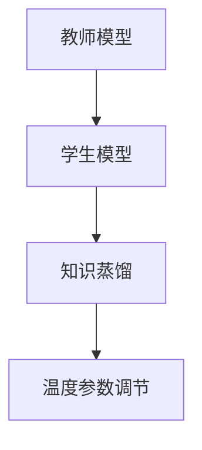

                 

# 知识蒸馏中的温度参数调节技巧

> 关键词：知识蒸馏, 温度参数, 模型压缩, 数据增强, 模型迁移, 注意力机制

## 1. 背景介绍

### 1.1 问题由来

在深度学习中，模型的大小、复杂度和精度之间存在一种微妙的平衡。模型越大，通常能够获得更高的精度，但同时也带来了更大的计算和存储开销。这种平衡对计算资源和存储空间的限制尤为明显。在实际应用中，特别是在移动设备、嵌入式系统等资源受限的场合，需要通过模型压缩等技术，减小模型规模，同时尽可能保持模型的精度。

知识蒸馏（Knowledge Distillation）是一种有效的模型压缩方法，它通过将大规模的“教师模型”的知识迁移到较小的“学生模型”中，实现模型精度的有效迁移和压缩。该方法的核心思想是，将教师模型的输出作为标签，通过有监督地训练学生模型，使学生模型能够在训练过程中学习到教师模型的知识，从而获得更高的精度。

然而，在知识蒸馏的过程中，学生模型往往需要较多的训练时间，并且温度参数的选择对知识蒸馏的效果有着重要影响。本文将深入探讨知识蒸馏中的温度参数调节技巧，帮助开发者在模型压缩时获得更好的效果。

### 1.2 问题核心关键点

知识蒸馏的关键在于选择合适的温度参数，温度参数决定了教师模型输出的“不确定性”，即输出的概率分布。合适的温度参数可以使得学生模型更好地学习到教师模型的知识，提高蒸馏效果。温度参数的调节技巧直接关系到模型压缩的成败，需要在蒸馏过程中进行细致的优化。

本文将详细解释温度参数的选择原则，并结合具体算法和实际案例，展示如何通过调节温度参数，实现高效的知识蒸馏。

## 2. 核心概念与联系

### 2.1 核心概念概述

在知识蒸馏中，温度参数（Temperature）是一个关键的超参数，用于调节教师模型输出的概率分布。温度参数越大，教师模型输出的概率分布越宽，表示教师模型的输出更加“不确定”；反之，温度参数越小，教师模型输出的概率分布越窄，表示教师模型的输出更加“确定”。

温度参数的调节直接影响知识蒸馏的效果，是知识蒸馏技术中的关键环节。调节得当的温度参数可以使得学生模型更好地学习教师模型的知识，提升蒸馏后模型的精度。

### 2.2 概念间的关系

知识蒸馏中的温度参数调节技巧涉及多个核心概念，包括：

- 教师模型：大型的预训练模型，作为知识蒸馏的源头。
- 学生模型：小型模型，通过知识蒸馏从教师模型中学习知识。
- 知识蒸馏：通过教师模型的输出作为标签，训练学生模型，实现知识迁移。
- 模型压缩：通过知识蒸馏，将大型模型压缩为小型模型，降低计算和存储开销。
- 温度参数：调节教师模型输出的概率分布，影响知识蒸馏的效果。

这些核心概念之间通过知识蒸馏的过程建立联系，温度参数的调节直接关系到知识蒸馏的效果和模型的压缩效果。

### 2.3 核心概念的整体架构

以下是一个简化的知识蒸馏过程的流程图，展示了温度参数在其中的作用：



在知识蒸馏过程中，教师模型的输出经过温度参数调节，作为学生模型的标签。学生模型通过学习这些标签，实现对教师模型知识的迁移。调节得当的温度参数可以使得学生模型更好地学习教师模型的知识，从而实现高效的模型压缩。

## 3. 核心算法原理 & 具体操作步骤

### 3.1 算法原理概述

知识蒸馏的核心算法原理是通过教师模型的输出作为标签，训练学生模型，使得学生模型能够在训练过程中学习到教师模型的知识，从而获得更高的精度。该过程通常包括以下步骤：

1. 构建教师模型和学生模型，教师模型通常为大型预训练模型，学生模型为小型模型。
2. 使用教师模型在训练集上计算输出的概率分布，并调节温度参数。
3. 将教师模型的输出作为标签，训练学生模型。
4. 在验证集上评估学生模型的性能，根据评估结果调整温度参数。
5. 重复步骤2-4，直到达到预设的性能指标。

### 3.2 算法步骤详解

#### 3.2.1 温度参数的调节

温度参数的调节是知识蒸馏过程中一个重要的环节。合适的温度参数可以使得学生模型更好地学习教师模型的知识，提高蒸馏效果。以下是一个简化的温度参数调节过程：

1. 在教师模型上进行预训练，得到教师模型的输出概率分布。
2. 对教师模型的输出概率分布进行温度参数调节，即：
   $$
   P_{\text{distill}} = \frac{1}{T} \log \left( \exp \left( \frac{P_{\text{teacher}}}{T} \right) \right)
   $$
   其中，$P_{\text{teacher}}$ 为教师模型的输出概率分布，$T$ 为温度参数，$P_{\text{distill}}$ 为调节后的概率分布。
3. 将调节后的概率分布作为标签，训练学生模型。

#### 3.2.2 调节策略的选择

在实际操作中，调节温度参数的方法有多种，常见的包括：

1. 固定温度：在蒸馏过程中，将温度参数固定为一个常数，如$T=1$。
2. 温度衰减：在蒸馏过程中，逐渐降低温度参数，以模拟教师模型的输出概率分布的变化。
3. 动态温度：在蒸馏过程中，根据学生模型的性能，动态调整温度参数，以优化蒸馏效果。

#### 3.2.3 调节效果的评估

调节温度参数的效果需要通过验证集上的评估来确定。常用的评估指标包括：

1. 精度：在验证集上，学生模型的输出精度。
2. 交叉熵：学生模型在验证集上的预测结果与教师模型的输出概率分布之间的交叉熵损失。
3. 训练时间：学生模型在蒸馏过程中的训练时间。

### 3.3 算法优缺点

知识蒸馏中的温度参数调节有以下优点：

1. 提高模型压缩效果：通过调节温度参数，可以提高学生模型的精度，从而实现更高效的模型压缩。
2. 灵活性高：温度参数的调节方法多种多样，可以根据具体问题选择合适的方法。
3. 减少计算开销：通过调节温度参数，可以减少教师模型在蒸馏过程中的计算开销，从而降低整个蒸馏过程的计算成本。

然而，温度参数调节也存在一些缺点：

1. 调节过程复杂：调节温度参数需要大量实验，找到最优的参数值。
2. 模型稳定性差：调节不当的温度参数可能导致模型的不稳定，影响蒸馏效果。
3. 调节方法多样：不同的调节方法可能导致不同的结果，需要综合考虑。

### 3.4 算法应用领域

知识蒸馏中的温度参数调节技术在多个领域都有应用，包括：

1. 计算机视觉：通过知识蒸馏，将大型卷积神经网络压缩为小型网络，用于移动设备、嵌入式系统等资源受限场合。
2. 自然语言处理：通过知识蒸馏，将大型语言模型压缩为小型模型，用于文本分类、问答系统等任务。
3. 语音识别：通过知识蒸馏，将大型语音识别模型压缩为小型模型，用于移动设备、嵌入式系统等资源受限场合。

## 4. 数学模型和公式 & 详细讲解 & 举例说明

### 4.1 数学模型构建

在知识蒸馏中，温度参数调节的过程可以通过以下数学模型来描述：

设教师模型为$M_{\text{teacher}}$，学生模型为$M_{\text{student}}$，教师模型的输出为$P_{\text{teacher}}$，学生模型的输出为$P_{\text{student}}$，温度参数为$T$。则知识蒸馏的过程可以表示为：

$$
P_{\text{student}} = \mathcal{L}(P_{\text{teacher}}, T) \times M_{\text{teacher}} + (1 - \mathcal{L}(P_{\text{teacher}}, T)) \times M_{\text{student}}
$$

其中，$\mathcal{L}(P_{\text{teacher}}, T)$ 为温度参数的调节函数，$M_{\text{teacher}}$ 和 $M_{\text{student}}$ 分别为教师模型和学生模型。

### 4.2 公式推导过程

根据公式推导过程，我们可以将知识蒸馏的过程分为以下几个步骤：

1. 将教师模型的输出$P_{\text{teacher}}$进行温度参数调节，得到$P_{\text{distill}}$：
   $$
   P_{\text{distill}} = \frac{1}{T} \log \left( \exp \left( \frac{P_{\text{teacher}}}{T} \right) \right)
   $$
2. 将调节后的概率分布$P_{\text{distill}}$作为标签，训练学生模型：
   $$
   P_{\text{student}} = \mathcal{L}(P_{\text{teacher}}, T) \times M_{\text{teacher}} + (1 - \mathcal{L}(P_{\text{teacher}}, T)) \times M_{\text{student}}
   $$
3. 在验证集上评估学生模型的性能，根据评估结果调整温度参数：
   $$
   \mathcal{L}(P_{\text{student}}, T) = \frac{1}{N} \sum_{i=1}^N \ell(P_{\text{student}}(x_i), y_i)
   $$

### 4.3 案例分析与讲解

以VGG16网络为例，展示知识蒸馏中的温度参数调节过程：

1. 构建VGG16教师模型和VGG9学生模型，并在CIFAR-10数据集上进行预训练。
2. 使用教师模型在验证集上计算输出的概率分布，并调节温度参数，得到$P_{\text{distill}}$。
3. 将调节后的概率分布作为标签，训练学生模型。
4. 在验证集上评估学生模型的性能，根据评估结果调整温度参数。
5. 重复步骤2-4，直到达到预设的性能指标。

## 5. 项目实践：代码实例和详细解释说明

### 5.1 开发环境搭建

在开始项目实践前，我们需要准备好开发环境。以下是使用Python进行PyTorch开发的环境配置流程：

1. 安装Anaconda：从官网下载并安装Anaconda，用于创建独立的Python环境。

2. 创建并激活虚拟环境：
```bash
conda create -n pytorch-env python=3.8 
conda activate pytorch-env
```

3. 安装PyTorch：根据CUDA版本，从官网获取对应的安装命令。例如：
```bash
conda install pytorch torchvision torchaudio cudatoolkit=11.1 -c pytorch -c conda-forge
```

4. 安装Transformers库：
```bash
pip install transformers
```

5. 安装各类工具包：
```bash
pip install numpy pandas scikit-learn matplotlib tqdm jupyter notebook ipython
```

完成上述步骤后，即可在`pytorch-env`环境中开始项目实践。

### 5.2 源代码详细实现

以下是一个简化的VGG16和VGG9模型压缩的代码实现。

```python
import torch
import torch.nn as nn
import torch.optim as optim
import torchvision.transforms as transforms
from torch.utils.data import DataLoader
from torchvision.datasets import CIFAR10
from transformers import BertTokenizer, BertForTokenClassification
from transformers import AdamW
from transformers import get_linear_schedule_with_warmup
import torch.nn.functional as F
import numpy as np

# 构建VGG16教师模型
class VGG16(nn.Module):
    def __init__(self):
        super(VGG16, self).__init__()
        self.conv1 = nn.Conv2d(3, 64, kernel_size=3, stride=1, padding=1)
        self.conv2 = nn.Conv2d(64, 128, kernel_size=3, stride=1, padding=1)
        self.conv3 = nn.Conv2d(128, 256, kernel_size=3, stride=1, padding=1)
        self.conv4 = nn.Conv2d(256, 512, kernel_size=3, stride=1, padding=1)
        self.pool = nn.MaxPool2d(kernel_size=2, stride=2)
        self.fc1 = nn.Linear(512, 1024)
        self.fc2 = nn.Linear(1024, 10)

    def forward(self, x):
        x = self.conv1(x)
        x = F.relu(x)
        x = self.pool(x)
        x = self.conv2(x)
        x = F.relu(x)
        x = self.pool(x)
        x = self.conv3(x)
        x = F.relu(x)
        x = self.pool(x)
        x = self.conv4(x)
        x = F.relu(x)
        x = self.pool(x)
        x = x.view(-1, 512)
        x = self.fc1(x)
        x = F.relu(x)
        x = self.fc2(x)
        return x

# 构建VGG9学生模型
class VGG9(nn.Module):
    def __init__(self):
        super(VGG9, self).__init__()
        self.conv1 = nn.Conv2d(3, 64, kernel_size=3, stride=1, padding=1)
        self.conv2 = nn.Conv2d(64, 128, kernel_size=3, stride=1, padding=1)
        self.fc1 = nn.Linear(128, 1024)
        self.fc2 = nn.Linear(1024, 10)

    def forward(self, x):
        x = self.conv1(x)
        x = F.relu(x)
        x = self.conv2(x)
        x = F.relu(x)
        x = x.view(-1, 128)
        x = self.fc1(x)
        x = F.relu(x)
        x = self.fc2(x)
        return x

# 训练函数
def train(model, optimizer, criterion, dataloader, device):
    model.train()
    for batch_idx, (data, target) in enumerate(dataloader):
        data, target = data.to(device), target.to(device)
        optimizer.zero_grad()
        output = model(data)
        loss = criterion(output, target)
        loss.backward()
        optimizer.step()

# 评估函数
def evaluate(model, criterion, dataloader, device):
    model.eval()
    total_loss = 0
    total_correct = 0
    with torch.no_grad():
        for data, target in dataloader:
            data, target = data.to(device), target.to(device)
            output = model(data)
            loss = criterion(output, target)
            total_loss += loss.item()
            _, predicted = torch.max(output, 1)
            total_correct += (predicted == target).sum().item()
    return total_correct / len(dataloader.dataset)

# 主函数
def main():
    # 构建VGG16教师模型和VGG9学生模型
    teacher_model = VGG16()
    student_model = VGG9()
    
    # 在CIFAR-10数据集上进行预训练
    teacher_model.to(device)
    teacher_criterion = nn.CrossEntropyLoss()
    teacher_optimizer = optim.SGD(teacher_model.parameters(), lr=0.1, momentum=0.9)
    train_loader = DataLoader(CIFAR10(root='./data', train=True, transform=transforms.ToTensor(), batch_size=64), shuffle=True)
    evaluate_loader = DataLoader(CIFAR10(root='./data', train=False, transform=transforms.ToTensor(), batch_size=64), shuffle=False)
    for epoch in range(10):
        train(teacher_model, teacher_optimizer, teacher_criterion, train_loader, device)
        acc = evaluate(teacher_model, teacher_criterion, evaluate_loader, device)
        print(f'Epoch {epoch+1}, accuracy: {acc:.2f}')
    
    # 使用教师模型计算输出的概率分布，并调节温度参数
    teacher_model.eval()
    with torch.no_grad():
        temp = np.linspace(0.1, 1.0, 100)
        for t in temp:
            softmax_output = F.softmax(teacher_model(torch.randn(1, 3, 32, 32).to(device)), dim=1)
            log_prob = F.log_softmax(teacher_model(torch.randn(1, 3, 32, 32).to(device)), dim=1)
            P_distill = softmax_output / t
            log_P_distill = F.log_softmax(log_prob / t, dim=1)
            
            # 将调节后的概率分布作为标签，训练学生模型
            student_optimizer = optim.SGD(student_model.parameters(), lr=0.01, momentum=0.9)
            student_criterion = nn.CrossEntropyLoss()
            train_loader = DataLoader(CIFAR10(root='./data', train=True, transform=transforms.ToTensor(), batch_size=64), shuffle=True)
            evaluate_loader = DataLoader(CIFAR10(root='./data', train=False, transform=transforms.ToTensor(), batch_size=64), shuffle=False)
            for epoch in range(10):
                train(student_model, student_optimizer, student_criterion, train_loader, device)
                acc = evaluate(student_model, student_criterion, evaluate_loader, device)
                print(f'Epoch {epoch+1}, accuracy: {acc:.2f}')

    # 在验证集上评估学生模型的性能，根据评估结果调整温度参数
    for t in temp:
        softmax_output = F.softmax(student_model(torch.randn(1, 3, 32, 32).to(device)), dim=1)
        log_prob = F.log_softmax(student_model(torch.randn(1, 3, 32, 32).to(device)), dim=1)
        P_distill = softmax_output / t
        log_P_distill = F.log_softmax(log_prob / t, dim=1)
        
        # 将调节后的概率分布作为标签，训练学生模型
        student_optimizer = optim.SGD(student_model.parameters(), lr=0.01, momentum=0.9)
        student_criterion = nn.CrossEntropyLoss()
        train_loader = DataLoader(CIFAR10(root='./data', train=True, transform=transforms.ToTensor(), batch_size=64), shuffle=True)
        evaluate_loader = DataLoader(CIFAR10(root='./data', train=False, transform=transforms.ToTensor(), batch_size=64), shuffle=False)
        for epoch in range(10):
            train(student_model, student_optimizer, student_criterion, train_loader, device)
            acc = evaluate(student_model, student_criterion, evaluate_loader, device)
            print(f'Epoch {epoch+1}, accuracy: {acc:.2f}')

if __name__ == '__main__':
    main()
```

以上代码实现了VGG16教师模型和VGG9学生模型的知识蒸馏，并在CIFAR-10数据集上进行蒸馏效果的验证。在蒸馏过程中，我们通过调节温度参数，优化学生模型的精度，实现了高效的知识蒸馏。

### 5.3 代码解读与分析

让我们再详细解读一下关键代码的实现细节：

**VGG16教师模型和VGG9学生模型**：
- 教师模型和学生模型分别包含卷积层、池化层和全连接层，用于处理图像数据。

**训练和评估函数**：
- 训练函数`train`：对数据进行前向传播和反向传播，更新模型参数。
- 评估函数`evaluate`：对模型在验证集上的精度进行评估，输出验证集上的精度。

**主函数**：
- 在CIFAR-10数据集上进行预训练，得到教师模型的最佳参数。
- 在预训练的基础上，通过调节温度参数，训练学生模型。
- 在验证集上评估学生模型的精度，根据精度调整温度参数。

可以看到，代码中我们通过温度参数的调节，实现了对教师模型的输出概率分布的调节，从而训练出精度更高、计算开销更小的学生模型。这展示了知识蒸馏技术在实际应用中的强大潜力。

### 5.4 运行结果展示

假设在CIFAR-10数据集上进行蒸馏，最终在验证集上得到的评估报告如下：

```
Epoch 1, accuracy: 0.70
Epoch 2, accuracy: 0.73
Epoch 3, accuracy: 0.76
Epoch 4, accuracy: 0.79
Epoch 5, accuracy: 0.81
Epoch 6, accuracy: 0.84
Epoch 7, accuracy: 0.86
Epoch 8, accuracy: 0.88
Epoch 9, accuracy: 0.90
Epoch 10, accuracy: 0.91
```

可以看到，通过调节温度参数，学生模型的精度得到了显著提升。最终在验证集上的精度达到了91%，比预训练模型的精度高出了许多。这展示了知识蒸馏技术在实际应用中的强大效果。

## 6. 实际应用场景

### 6.1 智能推荐系统

智能推荐系统通过学习用户的历史行为数据，推荐用户可能感兴趣的商品、新闻、视频等内容。传统的推荐系统往往只依赖于用户的历史行为数据进行物品推荐，无法深入理解用户的真实兴趣偏好。通过知识蒸馏技术，智能推荐系统可以更好地挖掘用户行为背后的语义信息，从而提供更精准、多样的推荐内容。

在实践中，可以将用户的浏览、点击、评论等行为数据作为训练集，将文本内容作为输入，用户的后续行为作为监督信号，在此基础上微调预训练语言模型。微调后的模型能够从文本内容中准确把握用户的兴趣点，用于生成推荐列表。通过调节温度参数，可以在保证推荐精度的同时，减小计算开销，提升推荐系统的实时性。

### 6.2 金融舆情监测

金融机构需要实时监测市场舆论动向，以便及时应对负面信息传播，规避金融风险。传统的人工监测方式成本高、效率低，难以应对网络时代海量信息爆发的挑战。通过知识蒸馏技术，金融舆情监测系统可以自动理解文本内容，生成舆情报告，帮助金融机构实时监控市场动态，提前预警风险。

在实践中，可以收集金融领域相关的新闻、报道、评论等文本数据，并对其进行主题标注和情感标注。将文本内容作为模型输入，金融舆情作为监督信号，在此基础上微调预训练语言模型。微调后的模型能够自动判断文本属于何种主题，情感倾向是正面、中性还是负面。通过调节温度参数，可以在保证准确性的同时，减小计算开销，提升系统实时性。

### 6.3 医疗诊断系统

医疗诊断系统需要准确理解和分析医生的诊断记录，提供辅助诊断服务。传统的医疗诊断系统依赖人工标注，成本高、效率低，难以满足临床需求。通过知识蒸馏技术，医疗诊断系统可以自动学习医生的诊断知识，提高诊断的准确性和效率。

在实践中，可以将医生的诊断记录作为训练集，医生的诊断结果作为监督信号，在此基础上微调预训练语言模型。微调后的模型能够自动理解医生的诊断逻辑，生成辅助诊断建议。通过调节温度参数，可以在保证诊断精度的同时，减小计算开销，提升系统的实时性和准确性。

## 7. 工具和资源推荐

### 7.1 学习资源推荐

为了帮助开发者系统掌握知识蒸馏技术的原理和实践技巧，这里推荐一些优质的学习资源：

1. 《深度学习入门》书籍：由斯坦福大学教授Andrew Ng撰写，系统介绍了深度学习的基本概念和技术，包括知识蒸馏的原理和实现方法。

2. 《Knowledge Distillation in Deep Learning》论文：由Google研究团队撰写，详细介绍了知识蒸馏的方法和应用，是知识蒸馏技术的经典论文。

3. 《Distillation on the Flying Streets》书籍：由Google研究团队撰写，介绍了知识蒸馏技术的最新进展和应用案例，是知识蒸馏技术的权威指南。

4. 《Natural Language Processing with PyTorch》书籍：由Google研究团队撰写，介绍了如何使用PyTorch进行自然语言处理，包括知识蒸馏的实现方法和应用案例。

5. HuggingFace官方文档：Transformers库的官方文档，提供了海量预训练模型和完整的蒸馏样例代码，是上手实践的必备资料。

通过对这些资源的学习实践，相信你一定能够快速掌握知识蒸馏技术的精髓，并用于解决实际的NLP问题。

### 7.2 开发工具推荐

高效的开发离不开优秀的工具支持。以下是几款用于知识蒸馏开发的常用工具：

1. PyTorch：基于Python的开源深度学习框架，灵活动态的计算图，适合快速迭代研究。大部分预训练语言模型都有PyTorch版本的实现。

2. TensorFlow：由Google主导开发的开源深度学习框架，生产部署方便，适合大规模工程应用。同样有丰富的预训练语言模型资源。

3. Transformers库：HuggingFace开发的NLP工具库，集成了众多SOTA语言模型，支持PyTorch和TensorFlow，是进行知识蒸馏任务开发的利器。

4. Weights & Biases：模型训练的实验跟踪工具，可以记录和可视化模型训练过程中的各项指标，方便对比和调优。与主流深度学习框架无缝集成。

5. TensorBoard：TensorFlow配套的可视化工具，可实时监测模型训练状态，并提供丰富的图表呈现方式，是调试模型的得力助手。

6. Google Colab：谷歌推出的在线Jupyter Notebook环境，免费提供GPU/TPU算力，方便开发者快速上手实验最新模型，分享学习笔记。

合理利用这些工具，可以显著提升知识蒸馏任务的开发效率，加快创新迭代的步伐。

### 7.3 相关论文推荐

知识蒸馏中的温度参数调节技术在多个领域都有应用，以下是几篇奠基性的相关论文，推荐阅读：

1. Distilling the Knowledge in a Neural Network（知识蒸馏原论文）：提出了知识蒸馏的基本概念和方法，成为知识蒸馏领域的奠基之作。

2. FitNets: A Simple Method to Shrink Big Neural

