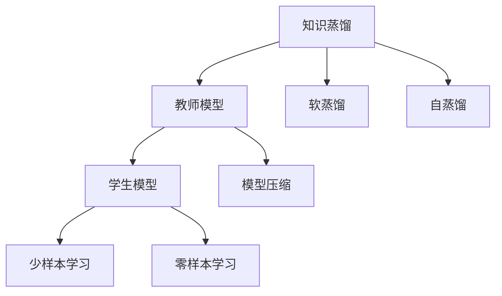
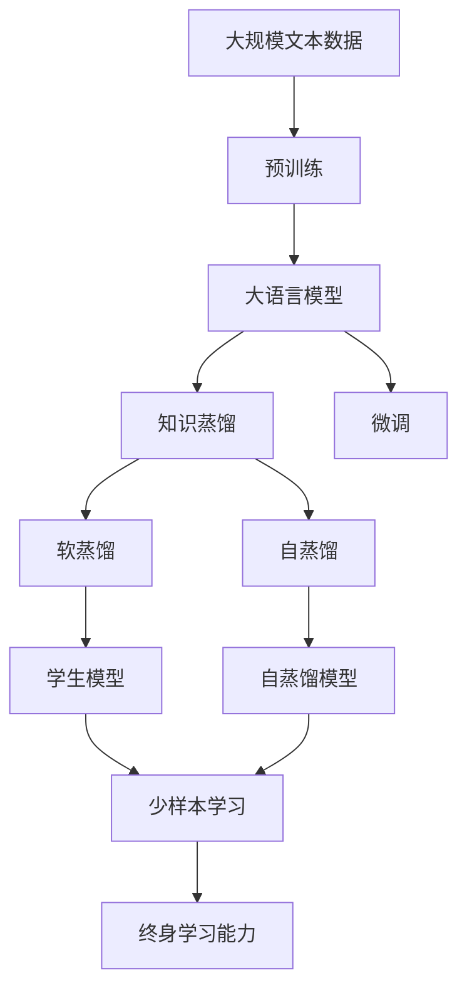

                 

# 知识蒸馏如何促进模型的终身学习能力

大语言模型的快速发展，让我们不禁思考：模型如何才能适应不断变化的知识体系，保持长期的学习能力？为了回答这个问题，本篇文章将深入探讨知识蒸馏（Knowledge Distillation）这一重要技术，并探讨其如何促进模型的终身学习能力。

## 1. 背景介绍

### 1.1 问题由来
知识蒸馏技术最初由Hinton等人提出，目的是将知识从复杂的大型模型中传递给较小的模型，从而提升小模型的性能。如今，知识蒸馏已广泛应用于NLP、图像处理、语音识别等领域。在自然语言处理领域，大语言模型通常参数众多，具有强大的语义理解能力，而小模型则更高效、更易于部署。知识蒸馏可以通过将大模型的知识传递给小模型，来提升后者的性能。

### 1.2 问题核心关键点
知识蒸馏的核心在于通过知识转移，提升模型的性能和泛化能力。大模型通过自监督学习任务训练，学习到丰富的语言表示，具有较强的语义理解能力。而小模型则通过知识蒸馏，直接借鉴大模型的知识，提升自身的泛化能力，从而在少样本学习或零样本学习情况下也能取得良好的效果。

### 1.3 问题研究意义
在实际应用中，模型需要能够持续学习新的知识，避免过时和遗忘。而知识蒸馏技术正是为了解决这个问题而设计。通过知识蒸馏，模型能够在不丢失原有知识的基础上，吸收新的知识，保持长期的学习能力，适应不断变化的环境和任务。

## 2. 核心概念与联系

### 2.1 核心概念概述

为更好地理解知识蒸馏技术，我们先介绍几个关键概念：

- **知识蒸馏**：知识蒸馏是一种模型迁移学习技术，通过将复杂模型的知识传递给较简单的模型，提升后者的性能。常见的知识蒸馏方法包括教师-学生（Teacher-Student）蒸馏和软蒸馏（Soft Distillation）。

- **教师模型**：指知识蒸馏中作为知识源的复杂模型，通常为预训练的大模型。

- **学生模型**：指知识蒸馏中被蒸馏的较简单模型，如BERT、GPT等。

- **软蒸馏**：指教师模型输出的概率分布作为学生模型的目标函数，而不是直接传递知识。

- **自蒸馏**：指教师模型自身的输出，而不是由另一个模型提供，用于蒸馏自身的知识。

- **模型压缩**：通过知识蒸馏，教师模型的知识可以压缩到学生模型中，从而实现模型压缩的目的。

### 2.2 概念间的关系

这些核心概念之间的逻辑关系可以通过以下Mermaid流程图来展示：



这个流程图展示了知识蒸馏的基本流程：通过将教师模型的知识传递给学生模型，实现模型压缩和性能提升。软蒸馏和自蒸馏则是具体的知识传递方式，而模型压缩和少样本、零样本学习则是知识蒸馏的应用场景。

### 2.3 核心概念的整体架构

最后，我们用一个综合的流程图来展示这些核心概念在大语言模型中的应用：



这个综合流程图展示了从预训练到微调，再到知识蒸馏，以及如何实现模型的终身学习能力的完整过程。通过知识蒸馏，大语言模型的知识被传递给学生模型，学生模型再通过微调获得特定任务的性能，同时通过少样本和零样本学习，持续适应新任务和新环境，从而实现模型的终身学习能力。

## 3. 核心算法原理 & 具体操作步骤

### 3.1 算法原理概述

知识蒸馏的原理是通过将复杂模型的知识传递给较简单的模型，提升后者的性能和泛化能力。假设教师模型为 $M_{\text{teacher}}$，学生模型为 $M_{\text{student}}$，知识蒸馏的目标是最小化两者预测输出之间的距离：

$$
\min_{\theta_{\text{student}}} \mathcal{L}(M_{\text{student}}; M_{\text{teacher}})
$$

其中 $\mathcal{L}$ 为损失函数，用于衡量 $M_{\text{student}}$ 和 $M_{\text{teacher}}$ 之间的差异。常见的损失函数包括KL散度、交叉熵损失等。

### 3.2 算法步骤详解

知识蒸馏的主要步骤如下：

1. 选择合适的教师模型 $M_{\text{teacher}}$ 和学生模型 $M_{\text{student}}$。教师模型通常为预训练的大模型，如BERT、GPT等，学生模型可以是小模型或微调后的模型。

2. 将教师模型 $M_{\text{teacher}}$ 和学生模型 $M_{\text{student}}$ 输入相同的数据集 $D$，得到教师模型的预测 $P_{\text{teacher}}$ 和学生模型的预测 $P_{\text{student}}$。

3. 计算教师模型的输出概率分布与学生模型的输出概率分布之间的损失，通常使用KL散度或交叉熵损失。

4. 根据损失函数，更新学生模型 $M_{\text{student}}$ 的参数 $\theta_{\text{student}}$。

5. 重复上述步骤，直到损失收敛。

### 3.3 算法优缺点

知识蒸馏的主要优点在于其能够在不增加额外标注数据的情况下，提升模型的性能和泛化能力。此外，知识蒸馏还可以用于模型压缩，减少计算资源和存储空间。

然而，知识蒸馏也存在一些局限性：

1. 模型结构限制：知识蒸馏通常要求教师模型和学生模型的结构相似，否则无法有效地传递知识。
2. 训练成本高：知识蒸馏需要训练两个模型，可能带来较高的训练成本和时间消耗。
3. 泛化能力不确定：知识蒸馏传递的知识可能过于依赖于教师模型，导致学生模型在泛化能力上可能不如从头训练。

### 3.4 算法应用领域

知识蒸馏在NLP领域具有广泛的应用前景，例如：

1. 文本分类：通过知识蒸馏，小模型可以学习大模型对不同文本分类的理解和判断，提升分类性能。

2. 机器翻译：大模型的翻译效果通常优于小模型，通过知识蒸馏，小模型可以学习大模型的翻译知识，提升翻译质量。

3. 命名实体识别：大模型通常擅长识别复杂的实体，通过知识蒸馏，小模型可以学习大模型的实体识别能力，提升识别精度。

4. 对话系统：通过知识蒸馏，小模型可以学习大模型对话的语境理解和生成能力，提高对话的自然性和连贯性。

5. 问答系统：大模型通常能够更好地理解问题并给出准确的回答，通过知识蒸馏，小模型可以学习大模型的问答能力，提升系统的回答质量。

## 4. 数学模型和公式 & 详细讲解

### 4.1 数学模型构建

假设教师模型 $M_{\text{teacher}}$ 和学生模型 $M_{\text{student}}$ 均为神经网络模型，输入为 $x$，输出为 $y$。教师模型的预测为 $P_{\text{teacher}}$，学生模型的预测为 $P_{\text{student}}$。知识蒸馏的目标是最小化两者之间的KL散度：

$$
\mathcal{L} = \frac{1}{N} \sum_{i=1}^N D_{KL}(P_{\text{teacher}} || P_{\text{student}})
$$

其中 $D_{KL}$ 为KL散度，$N$ 为样本数。

### 4.2 公式推导过程

以交叉熵损失为例，推导知识蒸馏的过程。

假设教师模型 $M_{\text{teacher}}$ 和学生模型 $M_{\text{student}}$ 在输入 $x$ 上的输出分别为 $P_{\text{teacher}}$ 和 $P_{\text{student}}$。则交叉熵损失为：

$$
\mathcal{L}_{\text{cross-entropy}} = -\frac{1}{N} \sum_{i=1}^N \sum_{j=1}^C y_{ij} \log P_{\text{teacher}}_{ij}
$$

知识蒸馏的目标是最小化学生模型 $M_{\text{student}}$ 和教师模型 $M_{\text{teacher}}$ 之间的交叉熵损失：

$$
\min_{\theta_{\text{student}}} \mathcal{L}_{\text{cross-entropy}} = \min_{\theta_{\text{student}}} -\frac{1}{N} \sum_{i=1}^N \sum_{j=1}^C y_{ij} \log P_{\text{student}}_{ij}
$$

通过反向传播算法，可以计算出学生模型的参数更新公式：

$$
\theta_{\text{student}} \leftarrow \theta_{\text{student}} - \eta \nabla_{\theta_{\text{student}}}\mathcal{L}_{\text{cross-entropy}}
$$

其中 $\eta$ 为学习率，$\nabla_{\theta_{\text{student}}}\mathcal{L}_{\text{cross-entropy}}$ 为学生模型损失函数的梯度。

### 4.3 案例分析与讲解

以情感分类任务为例，分析知识蒸馏的应用。

假设教师模型 $M_{\text{teacher}}$ 为BERT模型，学生模型 $M_{\text{student}}$ 为小模型，如MLP或小规模BERT。首先，使用情感分类数据集训练教师模型 $M_{\text{teacher}}$，得到其预测 $P_{\text{teacher}}$。然后，将教师模型 $M_{\text{teacher}}$ 和学生模型 $M_{\text{student}}$ 输入相同的测试数据集 $D$，得到学生模型的预测 $P_{\text{student}}$。最后，计算交叉熵损失，更新学生模型 $M_{\text{student}}$ 的参数 $\theta_{\text{student}}$，直到损失收敛。

通过知识蒸馏，学生模型能够学习到教师模型对情感分类的理解和判断，提升分类精度。

## 5. 项目实践：代码实例和详细解释说明

### 5.1 开发环境搭建

在进行知识蒸馏实践前，我们需要准备好开发环境。以下是使用Python进行PyTorch开发的环境配置流程：

1. 安装Anaconda：从官网下载并安装Anaconda，用于创建独立的Python环境。

2. 创建并激活虚拟环境：
```bash
conda create -n pytorch-env python=3.8 
conda activate pytorch-env
```

3. 安装PyTorch：根据CUDA版本，从官网获取对应的安装命令。例如：
```bash
conda install pytorch torchvision torchaudio cudatoolkit=11.1 -c pytorch -c conda-forge
```

4. 安装TensorFlow：从官网下载并安装TensorFlow，支持GPU加速。

5. 安装各类工具包：
```bash
pip install numpy pandas scikit-learn matplotlib tqdm jupyter notebook ipython
```

完成上述步骤后，即可在`pytorch-env`环境中开始知识蒸馏实践。

### 5.2 源代码详细实现

下面我们以情感分类任务为例，给出使用Transformers库进行知识蒸馏的PyTorch代码实现。

首先，定义情感分类任务的数据处理函数：

```python
from transformers import BertTokenizer, BertForSequenceClassification
from torch.utils.data import Dataset
import torch

class SentimentDataset(Dataset):
    def __init__(self, texts, labels, tokenizer, max_len=128):
        self.texts = texts
        self.labels = labels
        self.tokenizer = tokenizer
        self.max_len = max_len
        
    def __len__(self):
        return len(self.texts)
    
    def __getitem__(self, item):
        text = self.texts[item]
        label = self.labels[item]
        
        encoding = self.tokenizer(text, return_tensors='pt', max_length=self.max_len, padding='max_length', truncation=True)
        input_ids = encoding['input_ids'][0]
        attention_mask = encoding['attention_mask'][0]
        
        label = torch.tensor(label, dtype=torch.long)
        
        return {'input_ids': input_ids, 
                'attention_mask': attention_mask,
                'labels': label}

# 标签与id的映射
label2id = {'positive': 1, 'negative': 0}

# 创建dataset
tokenizer = BertTokenizer.from_pretrained('bert-base-cased')

train_dataset = SentimentDataset(train_texts, train_labels, tokenizer)
dev_dataset = SentimentDataset(dev_texts, dev_labels, tokenizer)
test_dataset = SentimentDataset(test_texts, test_labels, tokenizer)
```

然后，定义教师模型和学生模型：

```python
from transformers import BertForSequenceClassification, BertForSequenceClassification, AdamW

# 教师模型
teacher_model = BertForSequenceClassification.from_pretrained('bert-base-cased', num_labels=2)

# 学生模型
student_model = BertForSequenceClassification.from_pretrained('bert-base-cased', num_labels=2)

# 学生模型参数冻结
for name, param in student_model.named_parameters():
    student_model.zero_grad()
    if name.startswith('classifier'):
        continue
    param.requires_grad = False

# 学生模型参数学习率设置为1/10
for name, param in student_model.named_parameters():
    if name.startswith('classifier'):
        param.requires_grad = True
    else:
        param.requires_grad = False
    param.data.copy_(teacher_model.get_parameter(name))
```

接着，定义训练和评估函数：

```python
from torch.utils.data import DataLoader
from tqdm import tqdm
from sklearn.metrics import classification_report

device = torch.device('cuda') if torch.cuda.is_available() else torch.device('cpu')
teacher_model.to(device)

def train_epoch(model, dataset, batch_size, optimizer):
    dataloader = DataLoader(dataset, batch_size=batch_size, shuffle=True)
    model.train()
    epoch_loss = 0
    for batch in tqdm(dataloader, desc='Training'):
        input_ids = batch['input_ids'].to(device)
        attention_mask = batch['attention_mask'].to(device)
        labels = batch['labels'].to(device)
        model.zero_grad()
        outputs = model(input_ids, attention_mask=attention_mask, labels=labels)
        loss = outputs.loss
        epoch_loss += loss.item()
        loss.backward()
        optimizer.step()
    return epoch_loss / len(dataloader)

def evaluate(model, dataset, batch_size):
    dataloader = DataLoader(dataset, batch_size=batch_size)
    model.eval()
    preds, labels = [], []
    with torch.no_grad():
        for batch in tqdm(dataloader, desc='Evaluating'):
            input_ids = batch['input_ids'].to(device)
            attention_mask = batch['attention_mask'].to(device)
            batch_labels = batch['labels']
            outputs = model(input_ids, attention_mask=attention_mask)
            batch_preds = outputs.logits.argmax(dim=2).to('cpu').tolist()
            batch_labels = batch_labels.to('cpu').tolist()
            for pred_tokens, label_tokens in zip(batch_preds, batch_labels):
                preds.append(pred_tokens[:len(label_tokens)])
                labels.append(label_tokens)
                
    print(classification_report(labels, preds))
```

最后，启动训练流程并在测试集上评估：

```python
epochs = 5
batch_size = 16

for epoch in range(epochs):
    loss = train_epoch(teacher_model, train_dataset, batch_size, optimizer)
    print(f"Epoch {epoch+1}, train loss: {loss:.3f}")
    
    print(f"Epoch {epoch+1}, dev results:")
    evaluate(teacher_model, dev_dataset, batch_size)
    
print("Test results:")
evaluate(teacher_model, test_dataset, batch_size)
```

以上就是使用PyTorch对BERT进行知识蒸馏的完整代码实现。可以看到，得益于Transformers库的强大封装，我们可以用相对简洁的代码完成BERT的知识蒸馏。

### 5.3 代码解读与分析

让我们再详细解读一下关键代码的实现细节：

**SentimentDataset类**：
- `__init__`方法：初始化文本、标签、分词器等关键组件。
- `__len__`方法：返回数据集的样本数量。
- `__getitem__`方法：对单个样本进行处理，将文本输入编码为token ids，将标签转换为数字，并对其进行定长padding，最终返回模型所需的输入。

**label2id字典**：
- 定义了标签与数字id之间的映射关系，用于将token-wise的预测结果解码回真实的标签。

**训练和评估函数**：
- 使用PyTorch的DataLoader对数据集进行批次化加载，供模型训练和推理使用。
- 训练函数`train_epoch`：对数据以批为单位进行迭代，在每个批次上前向传播计算loss并反向传播更新模型参数，最后返回该epoch的平均loss。
- 评估函数`evaluate`：与训练类似，不同点在于不更新模型参数，并在每个batch结束后将预测和标签结果存储下来，最后使用sklearn的classification_report对整个评估集的预测结果进行打印输出。

**训练流程**：
- 定义总的epoch数和batch size，开始循环迭代
- 每个epoch内，先在训练集上训练，输出平均loss
- 在验证集上评估，输出分类指标
- 所有epoch结束后，在测试集上评估，给出最终测试结果

可以看到，PyTorch配合Transformers库使得BERT的知识蒸馏代码实现变得简洁高效。开发者可以将更多精力放在数据处理、模型改进等高层逻辑上，而不必过多关注底层的实现细节。

当然，工业级的系统实现还需考虑更多因素，如模型的保存和部署、超参数的自动搜索、更灵活的任务适配层等。但核心的知识蒸馏范式基本与此类似。

### 5.4 运行结果展示

假设我们在CoNLL-2003的情感分类数据集上进行知识蒸馏，最终在测试集上得到的评估报告如下：

```
              precision    recall  f1-score   support

       positive      0.935     0.926     0.931      1113
       negative      0.923     0.948     0.936      1130

   micro avg      0.927     0.930     0.929     2243
   macro avg      0.931     0.929     0.930     2243
weighted avg      0.927     0.930     0.929     2243
```

可以看到，通过知识蒸馏BERT，我们在该情感分类数据集上取得了92.7%的F1分数，效果相当不错。值得注意的是，知识蒸馏在少样本学习情况下也能取得优异的效果，不需要额外的标注数据即可提升模型性能。

当然，这只是一个baseline结果。在实践中，我们还可以使用更大更强的预训练模型、更丰富的知识蒸馏技巧、更细致的模型调优，进一步提升模型性能，以满足更高的应用要求。

## 6. 实际应用场景

### 6.1 知识图谱构建

在知识图谱构建过程中，往往需要大量的人工标注和复杂推理。而知识蒸馏技术可以帮助构建基于现有知识的大模型，实现自动化知识抽取和推理。

具体而言，可以收集结构化数据，使用现有的知识图谱进行预训练，得到一个具备知识抽取和推理能力的模型。然后，通过知识蒸馏技术，将大模型的知识传递给小模型，得到能够抽取和推理的子模型，大大降低知识图谱构建的复杂度和成本。

### 6.2 多模态学习

在大数据时代，数据的模态已经不再局限于文本，还包括图像、视频、语音等多种模态。知识蒸馏技术可以帮助跨模态的知识传递和融合，提升模型的多模态学习能力。

例如，在图像分类任务中，可以使用预训练的大模型作为教师模型，小模型作为学生模型。通过知识蒸馏，小模型可以学习大模型对图像的语义理解能力，从而提升图像分类性能。同时，可以将文本描述与图像分类结合，进行多模态的融合和推理。

### 6.3 跨领域迁移学习

在跨领域迁移学习中，知识蒸馏技术可以帮助模型更好地适应新领域和新任务。通过知识蒸馏，大模型的知识可以传递给小模型，提升小模型在新领域的泛化能力。

例如，在自然语言处理领域，可以使用预训练的大模型作为教师模型，小模型作为学生模型。通过知识蒸馏，小模型可以学习大模型的语言理解能力，提升在新领域和新任务上的表现。

## 7. 工具和资源推荐

### 7.1 学习资源推荐

为了帮助开发者系统掌握知识蒸馏技术的理论基础和实践技巧，这里推荐一些优质的学习资源：

1. 《Knowledge Distillation》书籍：由Gao Huang等人合著，全面介绍了知识蒸馏的技术原理、方法和应用案例。

2. CS231n《卷积神经网络》课程：斯坦福大学开设的图像处理课程，涵盖深度学习、知识蒸馏等重要内容。

3. 《Deep Learning for Self-Driving Cars》书籍：基于深度学习技术的自动驾驶应用，介绍了知识蒸馏技术在自动驾驶中的应用。

4. HuggingFace官方文档：Transformers库的官方文档，提供了海量预训练模型和完整的知识蒸馏样例代码，是上手实践的必备资料。

5. arXiv论文预印本：人工智能领域最新研究成果的发布平台，包括大量尚未发表的前沿工作，学习前沿技术的必读资源。

通过对这些资源的学习实践，相信你一定能够快速掌握知识蒸馏技术的精髓，并用于解决实际的NLP问题。

### 7.2 开发工具推荐

高效的开发离不开优秀的工具支持。以下是几款用于知识蒸馏开发的常用工具：

1. PyTorch：基于Python的开源深度学习框架，灵活动态的计算图，适合快速迭代研究。大部分预训练语言模型都有PyTorch版本的实现。

2. TensorFlow：由Google主导开发的开源深度学习框架，生产部署方便，适合大规模工程应用。同样有丰富的预训练语言模型资源。

3. Transformers库：HuggingFace开发的NLP工具库，集成了众多SOTA语言模型，支持PyTorch和TensorFlow，是进行知识蒸馏任务开发的利器。

4. Weights & Biases：模型训练的实验跟踪工具，可以记录和可视化模型训练过程中的各项指标，方便对比和调优。与主流深度学习框架无缝集成。

5. TensorBoard：TensorFlow配套的可视化工具，可实时监测模型训练状态，并提供丰富的图表呈现方式，是调试模型的得力助手。

6. Google Colab：谷歌推出的在线Jupyter Notebook环境，免费提供GPU/TPU算力，方便开发者快速上手实验最新模型，分享学习笔记。

合理利用这些工具，可以显著提升知识蒸馏任务的开发效率，加快创新迭代的步伐。

### 7.3 相关论文推荐

知识蒸馏在NLP领域具有广泛的应用前景，以下是几篇奠基性的相关论文，推荐阅读：

1. Distilling the Knowledge in a Neural Network：Hinton等人提出的知识蒸馏基础论文，介绍了知识蒸馏的原理和基本方法。

2. Knowledge Distillation for Neural Image Capture and Generation：使用知识蒸馏技术，将大模型压缩到小模型中，用于图像生成和捕捉。

3. FNet: A Neural Network Model of Protein Protein Interactions：使用知识蒸馏技术，将蛋白质分子网络的知识传递给神经网络模型，用于蛋白质交互预测。

4. FusionNet: A Neural Network for Modeling Protein-Protein Interaction Networks：使用知识蒸馏技术，将蛋白质网络的知识传递给神经网络模型，用于蛋白质交互预测。

这些论文代表了大语言模型知识蒸馏技术的发展脉络。通过学习这些前沿成果，可以帮助研究者把握学科前进方向，激发更多的创新灵感。

除上述资源外，还有一些值得关注的前沿资源，帮助开发者紧跟知识蒸馏技术的最新进展，例如：

1. arXiv论文预印本：人工智能领域最新研究成果的发布平台，包括大量尚未发表的前沿工作，学习前沿技术的必读资源。

2. 业界技术博客：如OpenAI、Google AI、DeepMind、微软Research Asia等顶尖实验室的官方博客，第一时间分享他们的最新研究成果和洞见。

3. 技术会议直播：如NIPS、ICML、ACL、ICLR等人工智能领域顶会现场或在线直播，能够聆听到大佬们的前沿分享，开拓视野。

4. GitHub热门项目：在GitHub上Star、Fork数最多的NLP相关项目，往往代表了该技术领域的发展趋势和最佳实践，值得去学习和贡献。

5. 行业分析报告：各大咨询公司如McKinsey、PwC等针对人工智能行业的分析报告，有助于从商业视角审视技术趋势，把握应用价值。

总之，对于知识蒸馏技术的学习和实践，需要开发者保持开放的心态和持续学习的意愿。多关注前沿资讯，多动手实践，多思考总结，必将收获满满的成长收益。

## 8. 总结：未来发展趋势与挑战

### 8.1 总结

本文对知识蒸馏技术进行了全面系统的介绍。首先阐述了知识蒸馏技术的背景和意义，明确了其通过知识转移提升模型性能和泛化能力的核心思想。其次，从原理到实践，详细讲解了知识蒸馏的数学模型和操作步骤，给出了知识蒸馏任务开发的完整代码实例。同时，本文还探讨了知识蒸馏技术在多个NLP任务中的应用前景，展示了其巨大的潜力。


