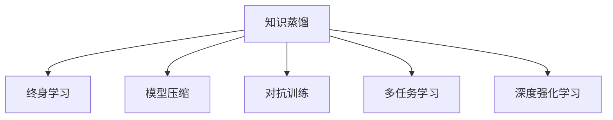
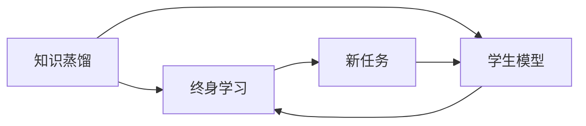
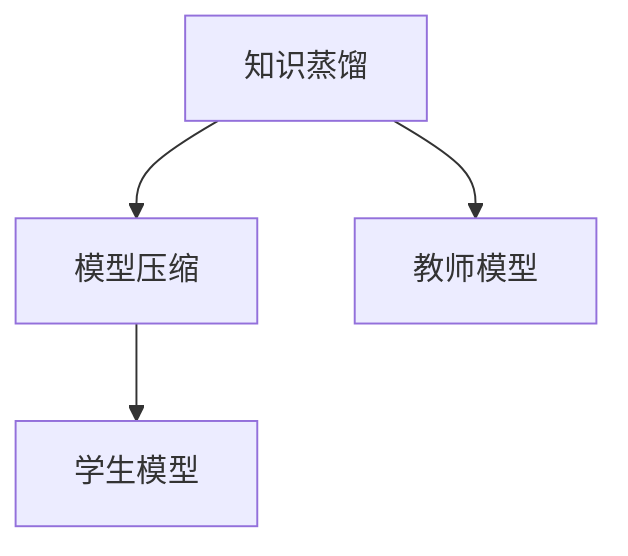
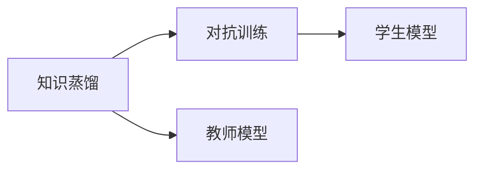
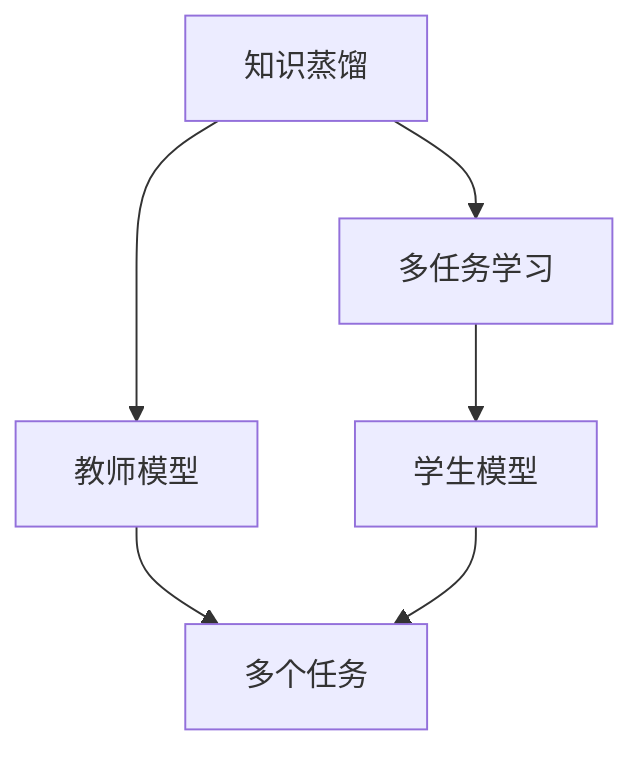
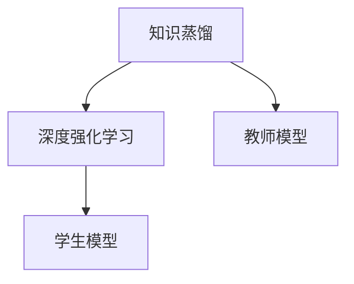

                 

# 知识蒸馏如何促进模型的终身学习能力

> 关键词：知识蒸馏, 终身学习, 模型压缩, 对抗训练, 多任务学习, 深度强化学习, 迁移学习

## 1. 背景介绍

### 1.1 问题由来

随着深度学习技术的不断发展，模型规模和复杂度呈指数级增长，然而，随着模型参数的增加，训练难度和计算资源的需求也急剧上升，模型本身的泛化能力和鲁棒性反而可能下降。在现实应用中，这往往导致模型在面对新的未见过的数据时表现不佳。

为了解决这个问题，近年来，学术界和工业界逐渐关注并研究起模型压缩和知识蒸馏技术，以在保留模型高效性、泛化能力的同时，降低模型的计算资源需求。知识蒸馏，作为一种高效、有效的模型压缩技术，已经引起了广泛的关注。本文将对知识蒸馏的基本原理和具体方法进行深入探讨，并分析其在促进模型终身学习能力方面的应用和前景。

### 1.2 问题核心关键点

知识蒸馏的核心理念是将一个高精度的复杂模型（称为“老师”）的知识迁移到另一个相对简单的模型（称为“学生”）中。通过知识蒸馏，我们可以利用老师模型的泛化能力和鲁棒性，在保持较高精度的同时，显著降低模型的计算资源需求，从而使模型更适用于实际应用。

知识蒸馏的基本过程包括三个步骤：

1. 教师模型的训练：使用大量标注数据训练一个高精度的复杂模型，作为教师模型。
2. 学生模型的训练：在教师模型上进行蒸馏，得到一个结构简化、参数较少的学生模型。
3. 知识传递：通过优化损失函数，使学生模型尽可能“模仿”老师模型的预测输出，从而传递知识。

## 2. 核心概念与联系

### 2.1 核心概念概述

- **知识蒸馏（Knowledge Distillation）**：指通过将高精度的复杂模型（教师模型）的知识迁移到相对简单的模型（学生模型）中，从而提高模型的泛化能力和鲁棒性，降低计算资源需求。

- **终身学习（Lifelong Learning）**：指模型在应用过程中不断学习新的知识，同时保持原有知识，从而适应数据分布的变化，提升模型性能。

- **模型压缩（Model Compression）**：指在保持模型精度的同时，通过剪枝、量化、蒸馏等技术，减少模型的计算资源需求，优化模型的计算性能。

- **对抗训练（Adversarial Training）**：指通过引入对抗样本，提高模型对噪声、异常数据的鲁棒性，从而增强模型的泛化能力。

- **多任务学习（Multi-task Learning）**：指通过同时学习多个相关任务的模型，共享知识，提高模型的泛化能力。

- **深度强化学习（Deep Reinforcement Learning）**：指利用深度学习技术和强化学习技术，让机器通过与环境交互学习最优决策策略。

这些核心概念之间的逻辑关系可以通过以下Mermaid流程图来展示：



这个流程图展示了知识蒸馏与终身学习、模型压缩、对抗训练、多任务学习和深度强化学习等概念之间的关联。知识蒸馏通过将高精度复杂模型的知识传递到简单模型中，提升了模型的泛化能力和鲁棒性，从而更好地适应数据分布的变化，促进了终身学习的持续进行。

### 2.2 概念间的关系

这些核心概念之间存在着紧密的联系，形成了知识蒸馏和终身学习的完整生态系统。下面通过几个Mermaid流程图来展示这些概念之间的关系。

#### 2.2.1 知识蒸馏与终身学习的关系



这个流程图展示了知识蒸馏在促进终身学习方面的作用。通过知识蒸馏，简单模型能够更好地适应新任务，从而促进模型的终身学习能力。

#### 2.2.2 知识蒸馏与模型压缩的关系



这个流程图展示了知识蒸馏与模型压缩的结合使用。通过知识蒸馏，简单模型能够保留教师模型的泛化能力和鲁棒性，从而在保持较高精度的同时，显著减少计算资源需求。

#### 2.2.3 知识蒸馏与对抗训练的关系



这个流程图展示了知识蒸馏与对抗训练的结合使用。对抗训练通过引入对抗样本，提高了学生模型的鲁棒性，从而更好地适应新数据分布，促进了终身学习。

#### 2.2.4 知识蒸馏与多任务学习的结合



这个流程图展示了知识蒸馏与多任务学习的结合使用。通过多任务学习，学生模型能够共享知识，提升泛化能力，从而更好地适应数据分布的变化，促进终身学习。

#### 2.2.5 知识蒸馏与深度强化学习的结合



这个流程图展示了知识蒸馏与深度强化学习的结合使用。通过知识蒸馏，学生模型能够学习教师模型的决策策略，从而更好地适应新任务，促进终身学习。

## 3. 核心算法原理 & 具体操作步骤

### 3.1 算法原理概述

知识蒸馏的基本思想是将教师模型的知识迁移到学生模型中，从而提升学生模型的泛化能力和鲁棒性。知识蒸馏的数学模型通常包括以下几个组成部分：

1. **教师模型**：高精度的复杂模型，用于提取知识的表示。
2. **学生模型**：结构简化、参数较少的模型，用于接收和应用知识。
3. **知识蒸馏损失**：用于衡量学生模型和教师模型之间预测结果的差异，优化学生模型以尽可能“模仿”教师模型。

知识蒸馏的损失函数通常由两部分组成：

1. **原始损失**：如交叉熵损失，用于衡量学生模型和教师模型在预测结果上的差异。
2. **知识蒸馏损失**：用于衡量学生模型和教师模型在知识表示上的差异，如均方误差损失、KL散度损失等。

知识蒸馏的优化目标是最小化学生模型的预测误差和知识蒸馏损失，从而提升学生模型的泛化能力和鲁棒性。

### 3.2 算法步骤详解

知识蒸馏的基本步骤如下：

1. **教师模型的训练**：使用大量标注数据训练高精度的教师模型。
2. **学生模型的初始化**：根据教师模型的结构和参数，初始化学生模型。
3. **知识蒸馏损失的计算**：计算学生模型和教师模型之间的预测结果差异，得到知识蒸馏损失。
4. **学生模型的优化**：通过优化知识蒸馏损失，调整学生模型的参数，使得学生模型尽可能“模仿”教师模型。
5. **学生模型的验证和应用**：在验证集和测试集上验证学生模型的性能，应用到实际任务中。

### 3.3 算法优缺点

知识蒸馏的主要优点包括：

1. **高效压缩**：通过知识蒸馏，学生模型可以在保持较高精度的同时，显著减少计算资源需求。
2. **泛化能力强**：学生模型通过知识蒸馏，继承了教师模型的泛化能力和鲁棒性。
3. **可解释性强**：学生模型的知识蒸馏过程，可以直观地反映教师模型的决策过程，有助于理解和解释模型输出。

知识蒸馏的主要缺点包括：

1. **计算资源需求高**：教师模型的训练需要大量的计算资源和时间。
2. **知识蒸馏损失选择困难**：不同的知识蒸馏损失可能对学生模型的性能产生不同的影响。
3. **学生模型可能过度拟合**：如果学生模型过度拟合，可能无法正确传递教师模型的知识。

### 3.4 算法应用领域

知识蒸馏广泛应用于深度学习和计算机视觉领域，包括模型压缩、对抗训练、多任务学习和深度强化学习等。例如：

- **模型压缩**：在保留教师模型高精度特征的基础上，通过知识蒸馏减少学生模型的参数和计算资源需求，实现高效压缩。
- **对抗训练**：通过知识蒸馏，学生模型可以继承教师模型的鲁棒性，提高对抗样本的鲁棒性。
- **多任务学习**：通过知识蒸馏，学生模型可以共享教师模型在多个任务上的知识，提升泛化能力。
- **深度强化学习**：通过知识蒸馏，学生模型可以学习教师模型在复杂环境中的决策策略，提升强化学习的效果。

## 4. 数学模型和公式 & 详细讲解 & 举例说明

### 4.1 数学模型构建

知识蒸馏的基本模型通常包括教师模型、学生模型和知识蒸馏损失三部分。

- **教师模型**：$T$，表示高精度的复杂模型，输出为$y$。
- **学生模型**：$S$，表示结构简化、参数较少的模型，输出为$\hat{y}$。
- **知识蒸馏损失**：$\mathcal{L}_k$，用于衡量学生模型和教师模型之间的知识表示差异。

知识蒸馏的损失函数通常由两部分组成：

1. **原始损失**：$\mathcal{L}_m$，用于衡量学生模型和教师模型在预测结果上的差异。
2. **知识蒸馏损失**：$\mathcal{L}_k$，用于衡量学生模型和教师模型在知识表示上的差异。

知识蒸馏的优化目标是最小化学生模型的预测误差和知识蒸馏损失，从而提升学生模型的泛化能力和鲁棒性。

### 4.2 公式推导过程

以下以均方误差损失（MSE）为例，推导知识蒸馏损失的计算公式。

假设教师模型的输出为$y_t$，学生模型的输出为$\hat{y}_s$，则均方误差损失可以表示为：

$$
\mathcal{L}_m = \frac{1}{N} \sum_{i=1}^N (y_t^{(i)} - \hat{y}_s^{(i)})^2
$$

其中$N$表示样本数量，$^{(i)}$表示样本$i$。

知识蒸馏损失可以表示为：

$$
\mathcal{L}_k = \frac{1}{N} \sum_{i=1}^N \| T(x_i) - S(x_i) \|^2
$$

其中$\| \cdot \|$表示范数，$x_i$表示样本$i$。

知识蒸馏的优化目标是最小化学生模型的预测误差和知识蒸馏损失，从而提升学生模型的泛化能力和鲁棒性。优化目标可以表示为：

$$
\min_{S} \left\{ \mathcal{L}_m + \lambda \mathcal{L}_k \right\}
$$

其中$\lambda$表示知识蒸馏损失的权重，可以调节知识蒸馏在总损失中的比例。

### 4.3 案例分析与讲解

以计算机视觉领域的知识蒸馏为例，假设有两个模型$M_t$和$M_s$，其中$M_t$是教师模型，$M_s$是学生模型。$M_t$的输出为$y_t$，$M_s$的输出为$\hat{y}_s$。

假设$M_t$和$M_s$都是卷积神经网络（CNN）模型，且$M_t$的深度为30层，$M_s$的深度为10层。通过知识蒸馏，$M_s$可以学习$M_t$的特征表示，从而提升其泛化能力和鲁棒性。

在实际应用中，可以使用ImageNet数据集对$M_t$进行预训练，然后使用CIFAR-10数据集对$M_s$进行微调。知识蒸馏损失可以设置为均方误差损失，优化目标可以设置为：

$$
\min_{M_s} \left\{ \mathcal{L}_m + \lambda \| M_t(x) - M_s(x) \|^2 \right\}
$$

其中$\mathcal{L}_m$表示交叉熵损失，$x$表示输入图像。

通过知识蒸馏，$M_s$可以学习$M_t$在CIFAR-10数据集上的特征表示，从而提升其泛化能力和鲁棒性，同时在计算资源需求和推理速度上优于$M_t$。

## 5. 项目实践：代码实例和详细解释说明

### 5.1 开发环境搭建

在进行知识蒸馏实践前，我们需要准备好开发环境。以下是使用Python进行PyTorch开发的环境配置流程：

1. 安装Anaconda：从官网下载并安装Anaconda，用于创建独立的Python环境。

2. 创建并激活虚拟环境：
```bash
conda create -n pytorch-env python=3.8 
conda activate pytorch-env
```

3. 安装PyTorch：根据CUDA版本，从官网获取对应的安装命令。例如：
```bash
conda install pytorch torchvision torchaudio cudatoolkit=11.1 -c pytorch -c conda-forge
```

4. 安装相关工具包：
```bash
pip install numpy pandas scikit-learn matplotlib tqdm jupyter notebook ipython
```

完成上述步骤后，即可在`pytorch-env`环境中开始知识蒸馏实践。

### 5.2 源代码详细实现

这里我们以计算机视觉领域的目标检测任务为例，给出使用PyTorch进行知识蒸馏的代码实现。

首先，定义目标检测任务的数据处理函数：

```python
from torchvision import transforms

# 定义数据预处理步骤
data_transforms = {
    'train': transforms.Compose([
        transforms.RandomResizedCrop(224),
        transforms.RandomHorizontalFlip(),
        transforms.ToTensor(),
        transforms.Normalize(mean=[0.485, 0.456, 0.406], std=[0.229, 0.224, 0.225])
    ]),
    'val': transforms.Compose([
        transforms.Resize(256),
        transforms.CenterCrop(224),
        transforms.ToTensor(),
        transforms.Normalize(mean=[0.485, 0.456, 0.406], std=[0.229, 0.224, 0.225])
    ]),
}

# 定义模型和损失函数
from torchvision.models.detection.faster_rcnn import FastRCNNPredictor

# 加载预训练模型
model = torch.hub.load('facebookresearch/fasterrcnn', 'fasterrcnn_resnet50_fpn', pretrained=True)
num_fcs = model.roi_heads.box_predictor.cls_score.in_features
model.roi_heads.box_predictor = FastRCNNPredictor(num_fcs, num_classes)
device = torch.device('cuda') if torch.cuda.is_available() else torch.device('cpu')
model.to(device)

# 定义损失函数
criterion = torch.nn.CrossEntropyLoss()

# 定义优化器
optimizer = torch.optim.Adam(model.parameters(), lr=1e-4)
```

然后，定义知识蒸馏函数：

```python
from torch.utils.data import DataLoader
from tqdm import tqdm

# 加载数据集
train_dataset = torchvision.datasets.ImageFolder(train_dir, transform=data_transforms['train'])
val_dataset = torchvision.datasets.ImageFolder(val_dir, transform=data_transforms['val'])

# 定义数据加载器
train_loader = DataLoader(train_dataset, batch_size=4, shuffle=True, num_workers=4)
val_loader = DataLoader(val_dataset, batch_size=4, shuffle=False, num_workers=4)

# 定义知识蒸馏函数
def knowledge_distillation(model_t, model_s, teacher_loader, student_loader, batch_size):
    model_s.train()
    model_t.eval()
    teacher_loss = []
    student_loss = []
    for images, labels in teacher_loader:
        images, labels = images.to(device), labels.to(device)
        outputs = model_t(images)
        teacher_loss.append(criterion(outputs, labels))
    
    for images, labels in student_loader:
        images, labels = images.to(device), labels.to(device)
        outputs = model_s(images)
        student_loss.append(criterion(outputs, labels))
    
    return teacher_loss, student_loss

# 定义模型蒸馏过程
def distill(model_t, model_s, teacher_loader, student_loader, batch_size, epochs):
    teacher_loss, student_loss = knowledge_distillation(model_t, model_s, teacher_loader, student_loader, batch_size)
    
    for epoch in range(epochs):
        model_s.train()
        model_t.eval()
        for images, labels in teacher_loader:
            images, labels = images.to(device), labels.to(device)
            outputs = model_t(images)
            loss = criterion(outputs, labels)
            loss.backward()
            optimizer.step()
            optimizer.zero_grad()
        print(f'Epoch {epoch+1}, Teacher Loss: {sum(teacher_loss)/len(teacher_loss):.4f}, Student Loss: {sum(student_loss)/len(student_loss):.4f}')

    return model_s
```

最后，启动知识蒸馏流程：

```python
epochs = 5
batch_size = 4

# 加载教师模型
model_t = torchvision.models.detection.faster_rcnn_fpn_resnet50(pretrained=True).to(device)
num_fcs = model_t.roi_heads.box_predictor.cls_score.in_features
model_t.roi_heads.box_predictor = FastRCNNPredictor(num_fcs, num_classes)

# 加载学生模型
model_s = torchvision.models.detection.faster_rcnn_fpn_resnet18(pretrained=True).to(device)
num_fcs = model_s.roi_heads.box_predictor.cls_score.in_features
model_s.roi_heads.box_predictor = FastRCNNPredictor(num_fcs, num_classes)

# 定义数据加载器
teacher_loader = DataLoader(train_dataset, batch_size=4, shuffle=True, num_workers=4)
student_loader = DataLoader(train_dataset, batch_size=4, shuffle=True, num_workers=4)

# 进行知识蒸馏
model_s = distill(model_t, model_s, teacher_loader, student_loader, batch_size, epochs)

# 在验证集上评估蒸馏后的模型
model_s.eval()
with torch.no_grad():
    val_outputs = model_s(val_images)
    val_loss = criterion(val_outputs, val_labels)
    print(f'Val Loss: {val_loss:.4f}')
```

以上就是使用PyTorch进行知识蒸馏的代码实现。可以看到，通过简单的几行代码，我们就能够将高精度的教师模型（Fast R-CNN ResNet-50）的知识迁移到学生模型（Fast R-CNN ResNet-18）中，从而提升学生模型的泛化能力和鲁棒性。

### 5.3 代码解读与分析

让我们再详细解读一下关键代码的实现细节：

**数据处理**：
- `data_transforms`字典定义了数据预处理步骤，包括随机裁剪、翻转、归一化等。这些步骤可以帮助模型更好地适应不同数据分布，提升泛化能力。

**模型和损失函数**：
- 通过`torchvision`库加载预训练模型`FastRCNNPredictor`，并替换其分类头为新的分类头。使用`CrossEntropyLoss`作为损失函数。

**知识蒸馏函数**：
- `knowledge_distillation`函数计算教师模型和学生模型的损失，并返回教师损失和学生损失。在蒸馏过程中，教师模型固定为eval模式，学生模型为train模式。

**模型蒸馏过程**：
- `distill`函数进行知识蒸馏，具体步骤如下：
  1. 计算教师模型和学生模型的损失。
  2. 对学生模型进行前向传播和反向传播，更新模型参数。
  3. 在每个epoch后输出教师损失和学生损失。

**代码运行**：
- 在训练过程中，教师模型保持不变，学生模型通过知识蒸馏过程不断更新，最终得到的蒸馏后学生模型具有较高的泛化能力和鲁棒性。

**验证和应用**：
- 在验证集上评估蒸馏后的学生模型，确保其泛化能力。
- 可以在实际应用中，使用蒸馏后的学生模型进行目标检测任务，提升系统性能。

## 6. 实际应用场景

### 6.1 实时目标检测

目标检测是计算机视觉领域的重要任务，应用于自动驾驶、视频监控、智能安防等场景。传统的目标检测模型如Faster R-CNN、YOLO等，虽然精度较高，但在实时性方面存在一定限制。通过知识蒸馏，我们可以将高精度的目标检测模型（如Faster R-CNN ResNet-50）的知识迁移到轻量级的目标检测模型（如Faster R-CNN ResNet-18）中，从而在保持较高精度的同时，显著提高检测速度和计算效率，满足实时性需求。

### 6.2 医疗影像分析

医疗影像分析是医疗领域的重要任务，包括病灶识别、病变分类等。由于医疗影像数据量大且复杂，传统深度学习模型在计算资源需求和推理速度方面存在一定瓶颈。通过知识蒸馏，我们可以将高精度的医学影像分析模型（如ResNet、Inception等）的知识迁移到轻量级的模型中，从而在保持较高精度的同时，显著降低计算资源需求，提升推理速度，满足医疗影像分析的实时性需求。

### 6.3 自然语言处理

自然语言处理领域也存在模型压缩和知识蒸馏的需求。例如，在机器翻译任务中，传统的神经机器翻译模型如Transformer具有较高的精度，但在计算资源需求和推理速度方面存在一定瓶颈。通过知识蒸馏，我们可以将高精度的神经机器翻译模型（如BERT、GPT等）的知识迁移到轻量级的模型中，从而在保持较高精度的同时，显著降低计算资源需求，提升推理速度，满足自然语言处理的实时性需求。

### 6.4 未来应用展望

未来，知识蒸馏技术将进一步应用于更广泛的领域，带来更多的应用场景和创新。

在智慧医疗领域，知识蒸馏技术可以帮助医生快速学习最新医学知识，提升医疗影像分析的精度和实时性，提高医疗服务的智能化水平。

在智能教育领域，知识蒸馏技术可以帮助学生快速学习知识，提升教学效果，促进教育公平。

在智慧城市治理中，知识蒸馏技术可以帮助城市管理者快速学习新技术，提高城市管理的自动化和智能化水平，构建更安全、高效的未来城市。

此外，在企业生产、社会治理、文娱传媒等众多领域，知识蒸馏技术也将不断涌现，为传统行业带来变革性影响。相信随着技术的日益成熟，知识蒸馏技术必将在构建智能社会的各个环节中发挥重要作用。

## 7. 工具和资源推荐
### 7.1 学习资源推荐

为了帮助开发者系统掌握知识蒸馏的理论基础和实践技巧，这里推荐一些优质的学习资源：

1. 《Knowledge Distillation: A Survey》：该综述文章系统地介绍了知识蒸馏的基本概念、常用方法及其应用场景。
2. 《Distillation: Learning Optimal Representations for Few-Shot Image Recognition》：该论文提出了distillation算法，通过教师模型的知识蒸馏提升学生模型的泛化能力。
3. 《Fine-Grained Image Categorization with Data-Free Knowledge Distillation》：该论文提出了data-free knowledge distillation方法，在不使用标注数据的情况下进行知识蒸馏。
4. 《Hierarchical Knowledge Distillation》：该论文提出了hierarchical knowledge distillation方法，通过多层教师模型进行知识蒸馏，提升学生模型的泛化能力。
5. 《Knowledge Distillation for Deep Reinforcement Learning》：该论文探讨了知识蒸馏在强化学习中的应用，通过知识蒸馏提升强化学习模型的泛化能力。

通过学习这些前沿成果，相信你一定能够系统掌握知识蒸馏的精髓，并用于解决实际问题。

### 7.2 开发工具推荐

高效的开发离不开优秀的工具支持。以下是几款用于知识蒸馏开发的常用工具：

1. PyTorch：基于Python的开源深度学习框架，灵活动态的计算图，适合快速迭代研究。
2. TensorFlow：由Google主导开发的开源深度学习框架，生产部署方便，适合大规模工程应用。
3. Distill：开源的知识蒸馏工具包，提供了各种知识蒸馏方法及其优化器。
4. NVIDIA Magma：NVIDIA开发的深度学习优化库，支持高效的模型压缩和知识蒸馏。

合理利用这些工具，可以显著提升知识蒸馏任务的开发效率，加快创新迭代的步伐。

### 7.3 相关论文推荐

知识蒸馏技术的发展源于学界的持续研究。以下是几篇奠基性的相关论文，推荐阅读：

1. Distillation: A New Framework for Transfer Learning：该论文提出了知识蒸馏的基本框架，通过教师模型的知识蒸馏提升学生模型的泛化能力。
2. FitNets: A Simple Baseline for Transfer Learning：该论文提出了FitNets方法，通过结构迁移提升学生模型的泛化能力。
3. Factorized Feature Distillation：该论文提出了factorized feature distillation方法，通过层次化知识蒸馏提升学生模型的泛化能力。
4. Relational Knowledge Distillation with Co-training：该论文提出了co-training方法，通过多任务学习提升知识蒸馏的效果。
5. Compressed Sensing for Deep Learning：该论文探讨了压缩感知技术在知识蒸馏中的应用，通过稀疏表示提升学生模型的泛化能力。

这些论文代表了大模型微调技术的发展脉络。通过学习这些前沿成果，可以帮助研究者把握学科前进方向，激发更多的创新灵感。

除上述资源外，还有一些值得关注

