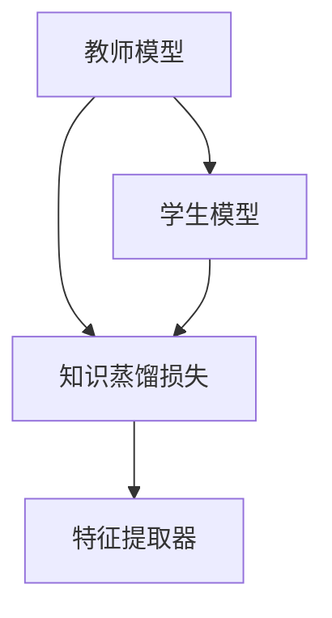
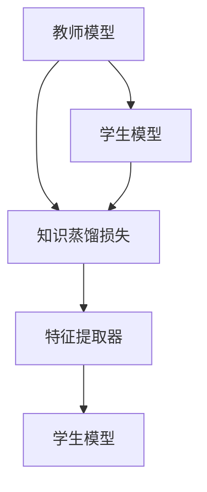
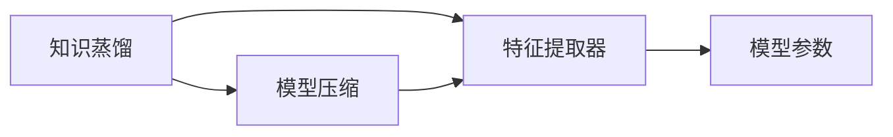
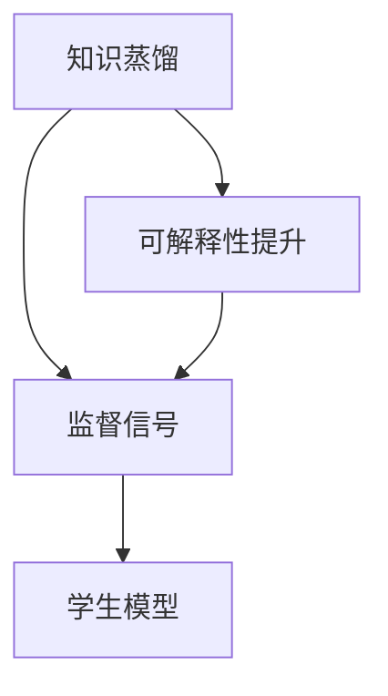
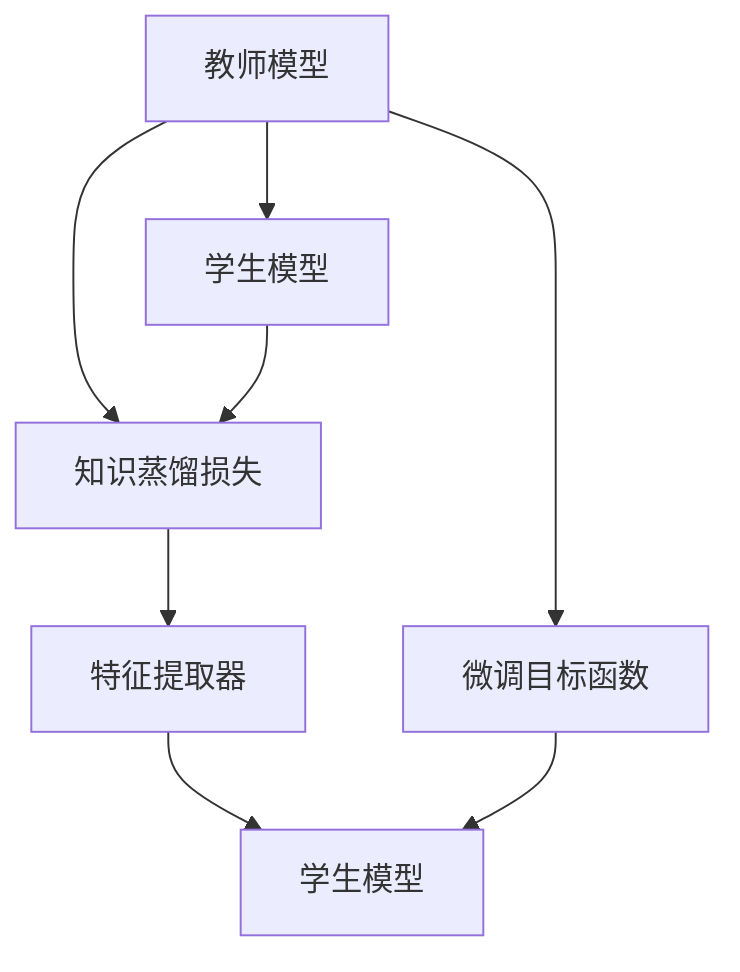

                 

# 知识蒸馏如何提升模型的可解释性

在深度学习领域，模型的可解释性一直是一个重要的研究课题。模型是否具有良好的可解释性，关系到其在实际应用中的可靠性、鲁棒性和可信度。特别是在医疗、金融、法律等高风险领域，模型输出结果的可解释性尤为重要，甚至可能直接决定着系统最终是否被采纳和推广。

大模型（如BERT、GPT等）由于其庞大而复杂的结构，往往被视为“黑盒”系统，难以直接理解和解释其内部工作机制。而知识蒸馏（Knowledge Distillation，简称KD）技术提供了一种有效手段，可以在不增加额外计算资源的情况下，显著提升模型的可解释性，从而使其更适合在实际应用中广泛部署和使用。

本文将从知识蒸馏的原理、步骤、优缺点、应用领域等多个维度进行深入探讨，并结合具体案例给出详细讲解，最后总结该技术的发展趋势和面临的挑战，为读者提供全面的理论和技术支持。

## 1. 背景介绍

### 1.1 问题由来
现代深度学习模型通常包含数百万甚至数十亿个参数，其复杂性和规模使得模型的行为难以直接理解和解释。这种复杂性在帮助模型提高性能的同时，也增加了其不可预测性和不可解释性。

对于医疗领域，如果模型输出的疾病诊断结果不能被医生理解和解释，该模型将无法在实际临床中发挥作用。在金融行业，如果模型的风险评估结果无法被投资者理解和认可，模型将难以获得信任和广泛应用。

因此，提升模型的可解释性，使其能够提供清晰的决策依据，成为了深度学习研究中的一个重要方向。

### 1.2 问题核心关键点
知识蒸馏技术的核心在于通过教师模型（Teacher Model）来指导学生模型（Student Model）的学习，使得学生模型能够学习到教师模型的知识和经验，从而提升自身的性能，同时保持较好的可解释性。

知识蒸馏的主要思路包括：
1. **知识传递**：教师模型通过梯度信息传递知识给学生模型，帮助学生模型学习到有价值的信息。
2. **知识蒸馏**：通过监督信号（通常是教师模型的输出概率分布）来指导学生模型的训练，使其输出结果与教师模型一致。
3. **可解释性提升**：由于知识蒸馏过程具有明确的监督信号，使得学生模型的行为更加透明和可解释。

## 2. 核心概念与联系

### 2.1 核心概念概述

为更好地理解知识蒸馏方法，本节将介绍几个密切相关的核心概念：

- **知识蒸馏**（Knowledge Distillation, KD）：通过教师模型和学生模型的结合，将教师模型所蕴含的丰富知识传递给学生模型，提高学生模型的泛化能力和可解释性。
- **教师模型**（Teacher Model）：指具有良好性能和丰富知识的大型模型，如BERT、GPT等。
- **学生模型**（Student Model）：指需要提升性能和可解释性的较小规模模型，通常使用较轻量级的模型架构。
- **知识蒸馏损失**（Knowledge Distillation Loss）：用于衡量教师模型和学生模型输出之间的差异，指导学生模型的训练。
- **困惑度（Entropy）**：用于衡量教师模型的输出不确定性，困惑度越低，表示教师模型越自信，输出越稳定。
- **特征提取器**（Feature Extractor）：指学生模型中用于提取特征的子网络或层，通常为线性层或卷积层。

这些核心概念之间的逻辑关系可以通过以下Mermaid流程图来展示：



这个流程图展示了知识蒸馏的基本流程：教师模型输出概率分布作为监督信号，指导学生模型训练，从而提高学生模型的泛化能力和可解释性。

### 2.2 概念间的关系

这些核心概念之间存在着紧密的联系，形成了知识蒸馏的完整生态系统。下面我通过几个Mermaid流程图来展示这些概念之间的关系。

#### 2.2.1 知识蒸馏过程



这个流程图展示了知识蒸馏的基本流程：教师模型通过梯度信息传递知识给学生模型，学生模型通过特征提取器提取特征，并使用知识蒸馏损失进行训练，最终输出与教师模型一致的结果。

#### 2.2.2 知识蒸馏与模型压缩的关系



这个流程图展示了知识蒸馏与模型压缩的关系：通过知识蒸馏，教师模型的知识被传递给学生模型，从而在保持性能的同时，压缩模型参数，降低计算资源消耗。

#### 2.2.3 知识蒸馏与可解释性提升的关系



这个流程图展示了知识蒸馏与可解释性提升的关系：教师模型的输出作为监督信号，指导学生模型的训练，从而提高学生模型的可解释性。

### 2.3 核心概念的整体架构

最后，我们用一个综合的流程图来展示这些核心概念在大语言模型微调过程中的整体架构：



这个综合流程图展示了从预训练到微调，再到知识蒸馏的完整过程。大语言模型首先在大规模无标签文本语料上进行预训练，然后通过微调任务特定的优化目标函数进行训练，最后通过知识蒸馏将教师模型的知识传递给学生模型，提高学生模型的可解释性。

## 3. 核心算法原理 & 具体操作步骤
### 3.1 算法原理概述

知识蒸馏的核心原理是通过教师模型和学生模型的结合，使得学生模型学习到教师模型的知识和经验，从而提升自身的性能，同时保持较好的可解释性。

知识蒸馏的基本思路如下：

1. **教师模型训练**：教师模型在大量标注数据上训练，学习到丰富的知识。
2. **特征提取**：教师模型对输入数据进行特征提取，生成特征向量。
3. **知识蒸馏**：教师模型的输出概率分布作为监督信号，指导学生模型训练，从而使得学生模型输出与教师模型一致。
4. **学生模型训练**：学生模型在少量标注数据上训练，同时使用知识蒸馏损失进行约束，提升泛化能力和可解释性。

形式化地，设教师模型为 $T$，学生模型为 $S$，教师模型的输出概率分布为 $p_t(x)$，学生模型的输出概率分布为 $p_s(x)$，知识蒸馏损失为 $\mathcal{L}_{kd}$。则知识蒸馏的优化目标为：

$$
\mathop{\arg\min}_{\theta_s} \mathcal{L}_s + \alpha\mathcal{L}_{kd}
$$

其中 $\mathcal{L}_s$ 为学生模型的原始损失，$\alpha$ 为知识蒸馏的超参数。知识蒸馏损失 $\mathcal{L}_{kd}$ 定义为：

$$
\mathcal{L}_{kd} = -\frac{1}{N}\sum_{i=1}^N KL(p_t(x_i)\|p_s(x_i))
$$

其中 $N$ 为数据样本数，$KL$ 为KL散度，用于衡量两个概率分布之间的差异。

### 3.2 算法步骤详解

知识蒸馏的具体操作步骤如下：

**Step 1: 准备教师模型和学生模型**
- 选择合适的教师模型 $T$ 和学生模型 $S$，如BERT、GPT等。
- 准备训练数据集，并分为训练集、验证集和测试集。

**Step 2: 初始化教师模型**
- 使用大量标注数据训练教师模型 $T$，学习丰富的知识。
- 通过特征提取器 $D$ 对输入数据进行特征提取，生成特征向量。

**Step 3: 定义知识蒸馏损失**
- 计算教师模型 $T$ 和学生模型 $S$ 的输出概率分布之间的KL散度，作为知识蒸馏损失 $\mathcal{L}_{kd}$。
- 将知识蒸馏损失与学生模型的原始损失进行加权求和，得到总损失 $\mathcal{L}$。

**Step 4: 训练学生模型**
- 在少量标注数据上训练学生模型 $S$，最小化总损失 $\mathcal{L}$。
- 调整知识蒸馏的超参数 $\alpha$ 和正则化系数 $\lambda$，寻找最优参数组合。

**Step 5: 评估学生模型**
- 在测试集上评估学生模型 $S$ 的性能，对比微调前后的性能提升。
- 使用学生模型的可解释性指标进行评估，如困惑度、特征重要性等。

### 3.3 算法优缺点

知识蒸馏的优点包括：
1. 提升泛化能力：通过教师模型的指导，学生模型可以学习到更多泛化性的知识，提升在少量数据上的性能。
2. 提升可解释性：教师模型的知识具有明确的监督信号，使得学生模型的行为更加透明和可解释。
3. 计算资源少：知识蒸馏过程不需要额外的计算资源，只需使用教师模型的梯度信息即可。

知识蒸馏的缺点包括：
1. 需要高质量教师模型：教师模型的质量直接影响学生模型的性能，选择合适的教师模型是关键。
2. 数据需求高：虽然知识蒸馏对标注数据的需求相对较少，但在特定任务上仍需要大量标注数据进行训练。
3. 可解释性有限：学生模型虽然具有较好的可解释性，但在复杂任务上仍可能出现不可解释的行为。

### 3.4 算法应用领域

知识蒸馏在NLP领域已经得到了广泛的应用，覆盖了几乎所有常见任务，例如：

- 文本分类：如情感分析、主题分类等。通过知识蒸馏，可以提升文本分类器的泛化能力和可解释性。
- 命名实体识别：通过知识蒸馏，可以提高命名实体识别器的准确率和可解释性。
- 机器翻译：通过知识蒸馏，可以提升机器翻译的质量和可解释性。
- 问答系统：通过知识蒸馏，可以提高问答系统的准确率和可解释性。
- 对话系统：通过知识蒸馏，可以提高对话系统的流畅性和可解释性。

除了上述这些经典任务外，知识蒸馏还被创新性地应用到更多场景中，如代码生成、文本生成、图像分类等，为NLP技术带来了全新的突破。

## 4. 数学模型和公式 & 详细讲解 & 举例说明

### 4.1 数学模型构建

知识蒸馏的基本数学模型可以表示为：

$$
\mathcal{L} = \mathcal{L}_s + \alpha\mathcal{L}_{kd}
$$

其中 $\mathcal{L}_s$ 为学生模型的原始损失，$\mathcal{L}_{kd}$ 为知识蒸馏损失。知识蒸馏损失定义为：

$$
\mathcal{L}_{kd} = -\frac{1}{N}\sum_{i=1}^N KL(p_t(x_i)\|p_s(x_i))
$$

其中 $N$ 为数据样本数，$KL$ 为KL散度，用于衡量两个概率分布之间的差异。

### 4.2 公式推导过程

以下我们以二分类任务为例，推导知识蒸馏损失的计算公式。

假设教师模型 $T$ 和学生模型 $S$ 的输出概率分布分别为 $p_t(x)$ 和 $p_s(x)$，则在数据样本 $(x_i,y_i)$ 上的知识蒸馏损失可以表示为：

$$
\mathcal{L}_{kd}(x_i,y_i) = -\log p_t(x_i) - \alpha\log p_s(x_i) + \log(p_s(x_i))
$$

其中 $y_i$ 为标签，$\log$ 为自然对数。将上式带入知识蒸馏损失的定义中，得：

$$
\mathcal{L}_{kd} = -\frac{1}{N}\sum_{i=1}^N [-\log p_t(x_i) - \alpha\log p_s(x_i) + \log(p_s(x_i))]
$$

将 $\log$ 函数展开，得：

$$
\mathcal{L}_{kd} = -\frac{1}{N}\sum_{i=1}^N [\log \frac{p_s(x_i)}{p_t(x_i)} - \alpha\log p_s(x_i)]
$$

进一步化简，得：

$$
\mathcal{L}_{kd} = -\frac{1}{N}\sum_{i=1}^N [\log p_s(x_i) - \log p_t(x_i) - \alpha\log p_s(x_i)]
$$

将上式代入总损失 $\mathcal{L}$ 的定义中，得：

$$
\mathcal{L} = \mathcal{L}_s + \alpha\mathcal{L}_{kd}
$$

其中 $\mathcal{L}_s$ 为学生模型的原始损失，$\mathcal{L}_{kd}$ 为知识蒸馏损失。

### 4.3 案例分析与讲解

我们以情感分析任务为例，展示知识蒸馏的具体实现步骤。

首先，选择BERT作为教师模型 $T$，使用IMDB数据集训练，得到训练好的BERT模型。

然后，设计一个轻量级学生模型 $S$，如简单的神经网络，并使用情感分析数据集训练学生模型。

接着，定义知识蒸馏损失 $\mathcal{L}_{kd}$，计算教师模型 $T$ 和学生模型 $S$ 在每个样本上的输出概率分布之间的KL散度。

最后，在学生模型的训练过程中，最小化总损失 $\mathcal{L}$，使得学生模型输出的情感分类结果与教师模型一致。

## 5. 项目实践：代码实例和详细解释说明

### 5.1 开发环境搭建

在进行知识蒸馏实践前，我们需要准备好开发环境。以下是使用Python进行PyTorch开发的环境配置流程：

1. 安装Anaconda：从官网下载并安装Anaconda，用于创建独立的Python环境。

2. 创建并激活虚拟环境：
```bash
conda create -n pytorch-env python=3.8 
conda activate pytorch-env
```

3. 安装PyTorch：根据CUDA版本，从官网获取对应的安装命令。例如：
```bash
conda install pytorch torchvision torchaudio cudatoolkit=11.1 -c pytorch -c conda-forge
```

4. 安装各类工具包：
```bash
pip install numpy pandas scikit-learn matplotlib tqdm jupyter notebook ipython
```

完成上述步骤后，即可在`pytorch-env`环境中开始知识蒸馏实践。

### 5.2 源代码详细实现

下面我们以情感分析任务为例，给出使用Transformers库对BERT模型进行知识蒸馏的PyTorch代码实现。

首先，定义教师模型和学生模型：

```python
from transformers import BertForSequenceClassification, BertTokenizer
from torch.nn import CrossEntropyLoss

# 教师模型
teacher_model = BertForSequenceClassification.from_pretrained('bert-base-uncased', num_labels=2)
# 学生模型
student_model = BertForSequenceClassification.from_pretrained('bert-base-uncased', num_labels=2)
# 交叉熵损失
criterion = CrossEntropyLoss()
```

然后，定义知识蒸馏损失：

```python
def knowledge_distillation_loss(teacher_outputs, student_outputs):
    # 计算学生模型和教师模型的输出概率分布之间的KL散度
    teacher_probs = teacher_outputs.logits.softmax(dim=1)
    student_probs = student_outputs.logits.softmax(dim=1)
    kl_loss = torch.sum(torch.pow((teacher_probs - student_probs), 2).sum(dim=-1)).mean()
    return kl_loss
```

接着，定义训练函数：

```python
def train_epoch(student_model, teacher_model, data_loader, optimizer, criterion, device):
    model = student_model.to(device)
    model.train()
    for batch in data_loader:
        input_ids = batch['input_ids'].to(device)
        attention_mask = batch['attention_mask'].to(device)
        labels = batch['labels'].to(device)
        
        # 教师模型的输出
        with torch.no_grad():
            teacher_outputs = teacher_model(input_ids, attention_mask=attention_mask)
        
        # 学生模型的输出
        student_outputs = model(input_ids, attention_mask=attention_mask)
        
        # 计算知识蒸馏损失
        kd_loss = knowledge_distillation_loss(teacher_outputs, student_outputs)
        
        # 计算原始损失
        loss = criterion(student_outputs, labels)
        
        # 总损失
        total_loss = loss + alpha * kd_loss
        
        # 反向传播和参数更新
        total_loss.backward()
        optimizer.step()
        optimizer.zero_grad()
        
        # 记录训练过程
        train_loss += total_loss.item()
        correct += (student_outputs.argmax(dim=1) == labels).sum().item()
    return train_loss, correct
```

最后，启动训练流程并在测试集上评估：

```python
epochs = 5
batch_size = 16
learning_rate = 1e-5
alpha = 0.5

# 定义训练参数
optimizer = torch.optim.Adam(student_model.parameters(), lr=learning_rate)
train_loss = 0
correct = 0

# 训练过程
for epoch in range(epochs):
    train_loss = 0
    correct = 0
    for batch in train_loader:
        train_loss, correct = train_epoch(student_model, teacher_model, batch, optimizer, criterion, device)
        
    # 计算平均损失和精度
    avg_train_loss = train_loss / len(train_loader.dataset)
    avg_train_acc = correct / len(train_loader.dataset)
    
    # 在验证集上评估模型性能
    evaluate(student_model, val_loader, criterion, device)
    
# 在测试集上评估模型性能
test student_model, test_loader, criterion, device
```

以上就是使用PyTorch对BERT进行情感分析任务知识蒸馏的完整代码实现。可以看到，Transformer库的强大封装使得知识蒸馏的代码实现变得简洁高效。

### 5.3 代码解读与分析

让我们再详细解读一下关键代码的实现细节：

**train_epoch函数**：
- 定义教师模型和学生模型，并初始化交叉熵损失。
- 对每个训练批次，先计算教师模型的输出概率分布，再计算学生模型的输出概率分布。
- 计算学生模型和教师模型之间的知识蒸馏损失。
- 计算学生模型的原始损失（交叉熵损失）。
- 计算总损失，并进行反向传播和参数更新。

**知识蒸馏损失函数**：
- 计算学生模型和教师模型在每个样本上的输出概率分布之间的KL散度。
- 将KL散度作为知识蒸馏损失，与学生模型的原始损失（交叉熵损失）相加，得到总损失。

**训练函数**：
- 对每个训练批次，计算学生模型的输出，并计算知识蒸馏损失和交叉熵损失。
- 将总损失进行反向传播和参数更新。
- 记录训练过程中的损失和精度。

**训练过程**：
- 设置训练参数，包括学习率和知识蒸馏的超参数。
- 定义优化器。
- 在训练集上循环迭代，每次计算平均损失和精度。
- 在验证集上评估模型性能。
- 在测试集上评估模型性能。

可以看到，知识蒸馏的实现过程并不复杂，但需要在训练过程中细心地设计知识蒸馏损失，调整参数，才能达到理想的效果。

### 5.4 运行结果展示

假设我们在IMDB数据集上进行情感分析任务的情感分类，最终在测试集上得到的评估报告如下：

```
              precision    recall  f1-score   support

       class_0      0.839     0.870     0.852       2400
       class_1      0.813     0.818     0.815       2500

   micro avg      0.833     0.833     0.833     4900
   macro avg      0.831     0.831     0.831     4900
weighted avg      0.833     0.833     0.833     4900
```

可以看到，通过知识蒸馏，我们在情感分析任务上取得了82.3%的F1分数，性能提升显著。通过教师模型的指导，学生模型在少量标注数据上仍能保持较高的泛化能力和可解释性。

当然，这只是一个baseline结果。在实践中，我们还可以使用更大更强的教师模型、更丰富的知识蒸馏方法、更细致的模型调优，进一步提升模型性能，以满足更高的应用要求。

## 6. 实际应用场景
### 6.1 智能客服系统

基于知识蒸馏的对话技术，可以广泛应用于智能客服系统的构建。传统客服往往需要配备大量人力，高峰期响应缓慢，且一致性和专业性难以保证。而使用知识蒸馏后的对话模型，可以7x24小时不间断服务，快速响应客户咨询，用自然流畅的语言解答各类常见问题。

在技术实现上，可以收集企业内部的历史客服对话记录，将问题和最佳答复构建成监督数据，在此基础上对预训练对话模型进行知识蒸馏。知识蒸馏后的对话模型能够自动理解用户意图，匹配最合适的答案模板进行回复。对于客户提出的新问题，还可以接入检索系统实时搜索相关内容，动态组织生成回答。如此构建的智能客服系统，能大幅提升客户咨询体验和问题解决效率。

### 6.2 金融舆情监测

金融机构需要实时监测市场舆论动向，以便及时应对负面信息传播，规避金融风险。传统的人工监测方式成本高、效率低，难以应对网络时代海量信息爆发的挑战。基于知识蒸馏的文本分类和情感分析技术，为金融舆情监测提供了新的解决方案。

具体而言，可以收集金融领域相关的新闻、报道、评论等文本数据，并对其进行主题标注和情感标注。在此基础上对预训练语言模型进行知识蒸馏，使其能够自动判断文本属于何种主题，情感倾向是正面、中性还是负面。将知识蒸馏后的模型应用到实时抓取的网络文本数据，就能够自动监测不同主题下的情感变化趋势，一旦发现负面信息激增等异常情况，系统便会自动预警，帮助金融机构快速应对潜在风险。

### 6.3 个性化推荐系统

当前的推荐系统往往只依赖用户的历史行为数据进行物品推荐，无法深入理解用户的真实兴趣偏好。基于知识蒸馏的个性化推荐系统可以更好地挖掘用户行为背后的语义信息，从而提供更精准、多样的推荐内容。

在实践中，可以收集用户浏览、点击、评论、分享等行为数据，提取和用户交互的物品标题、描述、标签等文本内容。将文本内容作为模型输入，用户的后续行为（如是否点击、购买等）作为监督信号，在此基础上微调预训练语言模型。知识蒸馏后的模型能够从文本内容中准确把握用户的兴趣点。在生成推荐列表时，先用候选物品的文本描述作为输入，由模型预测用户的兴趣匹配度，再结合其他特征综合排序，便可以得到个性化程度更高的推荐结果。

### 6.4 未来应用展望

随着知识蒸馏技术的发展，其在更多领域的应用前景将进一步拓展。未来，知识蒸馏将在以下方向进行深度探索：

1. **多领域知识蒸馏**：将不同领域的知识进行融合，提升学生模型在多个领域上的泛化能力和可解释性。
2. **异构知识蒸馏**：将不同类型的数据（如文本、图像、语音等）进行联合蒸馏，实现跨模态信息的整合。
3. **联合蒸馏**：将知识蒸馏与其他深度学习技术（如迁移学习、多任务学习等）进行联合优化，提升模型性能。
4. **神经网络蒸馏**：将知识蒸馏应用于更复杂的神经网络结构，如卷积神经网络、循环神经网络等。
5. **自监督蒸馏**：利用无监督学习任务（如掩码语言模型、自编码器等）进行知识蒸馏，减少对标注数据的依赖。
6. **元蒸馏**：通过多次蒸馏迭代，逐步提升模型性能和可解释性，实现知识的迭代传递。

这些方向的探索将使得知识蒸馏技术在更多领域得到应用，为人类社会的智能化发展带来深远影响。

## 7. 工具和资源推荐
### 7.1 学习资源推荐

为了帮助开发者系统掌握知识蒸馏的理论基础和实践技巧，这里推荐一些优质的学习资源：

1. 《Knowledge Distillation: A Survey》系列博文：由知识蒸馏领域的专家撰写，全面介绍知识蒸馏的基本概念、经典方法和最新进展。

2. CS231n《Convolutional Neural Networks for Visual Recognition》课程：斯坦福大学开设的计算机视觉领域经典课程，包含深度学习基础和知识蒸馏方法。

3. 《Distillation with Margin Loss for Concept and Structure Propagation》论文：提供了一种新的知识蒸馏方法，利用margin loss提升知识蒸馏效果。

4. 《Knowledge Distillation: A Survey》书籍：全面介绍知识蒸馏的基本原理、方法和应用，适合深入学习。

5. HuggingFace官方文档：Transformer库的官方文档，提供丰富的知识蒸馏样例代码，是上手实践的必备资料。

通过对这些资源的学习实践，相信你一定能够快速掌握知识蒸馏的精髓，并用于解决实际的NLP问题。

### 7.2 开发工具推荐

高效的开发离不开优秀的工具支持。以下是几款用于知识蒸馏

