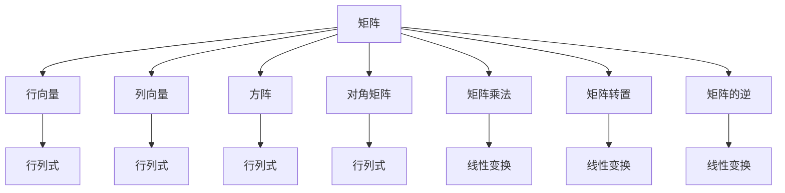

                 

# 矩阵理论与应用：定义与例子

## 1. 背景介绍

矩阵，是数学与计算机科学中的一个核心概念，广泛应用于线性代数、概率论、统计学、机器学习等领域。矩阵的理论与应用，是现代科学技术发展的基石之一。本文旨在深入探讨矩阵的定义、性质与应用，通过丰富的案例展示其在不同领域中的应用价值，并展望未来发展的趋势。

## 2. 核心概念与联系

### 2.1 核心概念概述

在数学中，矩阵（Matrix）是一种由若干元素排列成行和列的数组，通常用大写字母表示。矩阵的大小由其行数和列数决定，例如一个$3 \times 2$的矩阵有3行2列，总共有6个元素。矩阵的每一个元素都位于一个特定位置，通常用$(i, j)$来表示，其中$i$表示行数，$j$表示列数。

- **行向量**：只有一行的矩阵，即行数等于1的矩阵。
- **列向量**：只有一列的矩阵，即列数等于1的矩阵。
- **方阵**：行数等于列数的矩阵，例如$3 \times 3$的矩阵。
- **对角矩阵**：所有非对角元素为0的方阵，例如$\begin{pmatrix} 2 & 0 \\ 0 & 3 \end{pmatrix}$。
- **矩阵乘法**：两个矩阵相乘，必须满足第一个矩阵的列数等于第二个矩阵的行数。
- **矩阵转置**：将一个矩阵的行和列互换，例如$\begin{pmatrix} 1 & 2 \\ 3 & 4 \end{pmatrix}$的转置是$\begin{pmatrix} 1 & 3 \\ 2 & 4 \end{pmatrix}$。
- **矩阵的逆**：满足$AB=I$的矩阵$B$称为矩阵$A$的逆，其中$I$是单位矩阵。

这些概念构成了矩阵理论的基础，也是理解和应用矩阵的核心。

### 2.2 核心概念间的关系

矩阵理论与多个数学分支密切相关，通过以下Mermaid流程图，可以更直观地理解这些概念之间的联系：



这个流程图展示了矩阵理论的几个核心概念，以及它们之间的联系和应用。例如，行列式、线性变换等概念都是从矩阵理论中延伸出来的，而矩阵乘法、转置、逆等操作是矩阵理论中常见的计算方式。这些概念共同构成了矩阵理论的完整体系。

## 3. 核心算法原理 & 具体操作步骤

### 3.1 算法原理概述

矩阵的算法原理主要涉及矩阵的基本运算、矩阵的性质以及矩阵的线性变换等。以下是几个常见的矩阵算法：

- **矩阵加法与减法**：两个相同大小的矩阵可以直接相加或相减，即$A+B=\begin{pmatrix} a_{11}+b_{11} & a_{12}+b_{12} \\ a_{21}+b_{21} & a_{22}+b_{22} \end{pmatrix}$。
- **矩阵乘法**：两个矩阵相乘需要满足特定的维度要求，即第一个矩阵的列数等于第二个矩阵的行数，计算结果矩阵的元素为两个矩阵对应位置的元素乘积之和，例如$\begin{pmatrix} 1 & 2 \\ 3 & 4 \end{pmatrix} \times \begin{pmatrix} 5 & 6 \\ 7 & 8 \end{pmatrix} = \begin{pmatrix} 1 \times 5 + 2 \times 7 & 1 \times 6 + 2 \times 8 \\ 3 \times 5 + 4 \times 7 & 3 \times 6 + 4 \times 8 \end{pmatrix} = \begin{pmatrix} 17 & 28 \\ 47 & 74 \end{pmatrix}$。
- **矩阵转置**：矩阵转置是矩阵的一种基本变换，将行和列互换得到新矩阵，例如$\begin{pmatrix} 1 & 2 \\ 3 & 4 \end{pmatrix}$的转置是$\begin{pmatrix} 1 & 3 \\ 2 & 4 \end{pmatrix}$。
- **矩阵求逆**：矩阵的逆是满足$AB=I$的矩阵$B$，其中$I$是单位矩阵。求解矩阵的逆可以通过高斯消元法、LU分解、QR分解等方法实现。

这些算法原理是矩阵理论的核心内容，也是理解和应用矩阵的基础。

### 3.2 算法步骤详解

以下以矩阵乘法和矩阵求逆为例，详细介绍其操作步骤：

#### 3.2.1 矩阵乘法

1. **准备输入矩阵**：
   - 假设矩阵$A=\begin{pmatrix} 1 & 2 \\ 3 & 4 \end{pmatrix}$，矩阵$B=\begin{pmatrix} 5 & 6 \\ 7 & 8 \end{pmatrix}$。
2. **确定输出矩阵的尺寸**：
   - 由于$A$的列数等于$B$的行数，因此$A$和$B$的乘积的尺寸为$2 \times 2$。
3. **计算矩阵乘积**：
   - $A \times B = \begin{pmatrix} 1 \times 5 + 2 \times 7 & 1 \times 6 + 2 \times 8 \\ 3 \times 5 + 4 \times 7 & 3 \times 6 + 4 \times 8 \end{pmatrix} = \begin{pmatrix} 17 & 28 \\ 47 & 74 \end{pmatrix}$。

#### 3.2.2 矩阵求逆

1. **判断可逆性**：
   - 矩阵$A$必须是非奇异矩阵，即行列式不为0，才能进行求逆操作。
2. **计算矩阵的伴随矩阵**：
   - 伴随矩阵$adj(A)$是$A$的转置矩阵的每个元素替换为该元素对应的代数余子式。
3. **计算行列式**：
   - $det(A)$为矩阵$A$的行列式。
4. **求逆矩阵**：
   - $A^{-1} = \frac{1}{det(A)} \times adj(A)$。

以下以一个$2 \times 2$矩阵为例，展示矩阵求逆的具体步骤：

- 假设$A=\begin{pmatrix} 2 & 3 \\ 1 & 4 \end{pmatrix}$。
- 计算行列式$det(A) = 2 \times 4 - 3 \times 1 = 5$。
- 计算伴随矩阵$adj(A)=\begin{pmatrix} 4 & -3 \\ -1 & 2 \end{pmatrix}$。
- 计算逆矩阵$A^{-1} = \frac{1}{5} \times \begin{pmatrix} 4 & -3 \\ -1 & 2 \end{pmatrix} = \begin{pmatrix} 0.8 & -0.6 \\ -0.2 & 0.4 \end{pmatrix}$。

### 3.3 算法优缺点

矩阵算法具有以下优点：

- **通用性**：矩阵运算适用于多种类型的数学问题和科学计算。
- **可扩展性**：矩阵计算能够处理大规模数据，适用于高性能计算和分布式计算。
- **稳定性**：矩阵运算具有良好的数值稳定性，对于微小数值变化不敏感。

同时，矩阵算法也存在以下缺点：

- **计算复杂度**：矩阵计算的复杂度较高，特别是在大规模矩阵计算时，需要消耗大量计算资源。
- **精度问题**：在浮点数计算时，可能会出现数值精度损失，影响计算结果的准确性。

### 3.4 算法应用领域

矩阵理论与应用广泛，几乎涵盖了现代科学技术的所有领域，包括但不限于：

- **物理学**：矩阵在量子力学、相对论等物理学分支中广泛应用，用于描述物理系统的演化和状态。
- **计算机科学**：矩阵在图像处理、信号处理、数据压缩、机器学习等领域有广泛应用。
- **工程学**：矩阵在结构力学、控制理论、信号处理等领域有广泛应用。
- **经济学**：矩阵在宏观经济学、金融工程等领域有广泛应用，用于描述经济系统中的各种关系。

## 4. 数学模型和公式 & 详细讲解  
### 4.1 数学模型构建

矩阵的数学模型通常用大写字母表示，例如$A$、$B$、$C$等。矩阵的元素通常用$(i, j)$来表示，其中$i$表示行数，$j$表示列数。矩阵的加法和乘法等运算可以通过矩阵的元素进行定义。

#### 4.1.1 矩阵加法与减法

两个矩阵$A$和$B$相加，得到新矩阵$C$的元素为：

$$
C_{i,j} = A_{i,j} + B_{i,j}
$$

矩阵减法类似，得到新矩阵$C$的元素为：

$$
C_{i,j} = A_{i,j} - B_{i,j}
$$

#### 4.1.2 矩阵乘法

两个矩阵$A$和$B$相乘，得到新矩阵$C$的元素为：

$$
C_{i,j} = \sum_{k=1}^n A_{i,k} \times B_{k,j}
$$

其中$n$为矩阵$A$的列数和矩阵$B$的行数。

#### 4.1.3 矩阵转置

矩阵$A$的转置矩阵$A^T$的元素为：

$$
A^T_{i,j} = A_{j,i}
$$

#### 4.1.4 矩阵的逆

矩阵$A$的逆矩阵$A^{-1}$的元素为：

$$
A^{-1}_{i,j} = \frac{adj(A)}{det(A)}
$$

其中$adj(A)$为矩阵$A$的伴随矩阵，$det(A)$为矩阵$A$的行列式。

### 4.2 公式推导过程

#### 4.2.1 矩阵乘法

以$2 \times 3$矩阵$A$和$3 \times 2$矩阵$B$的乘积为例，计算过程如下：

$$
A = \begin{pmatrix} 1 & 2 & 3 \\ 4 & 5 & 6 \end{pmatrix}, B = \begin{pmatrix} 7 & 8 \\ 9 & 10 \\ 11 & 12 \end{pmatrix}
$$

计算过程如下：

$$
C = A \times B = \begin{pmatrix} 1 & 2 & 3 \\ 4 & 5 & 6 \end{pmatrix} \times \begin{pmatrix} 7 & 8 \\ 9 & 10 \\ 11 & 12 \end{pmatrix} = \begin{pmatrix} 1 \times 7 + 2 \times 9 + 3 \times 11 & 1 \times 8 + 2 \times 10 + 3 \times 12 \\ 4 \times 7 + 5 \times 9 + 6 \times 11 & 4 \times 8 + 5 \times 10 + 6 \times 12 \end{pmatrix} = \begin{pmatrix} 56 & 76 \\ 150 & 216 \end{pmatrix}
$$

#### 4.2.2 矩阵求逆

以$2 \times 2$矩阵$A=\begin{pmatrix} 2 & 3 \\ 1 & 4 \end{pmatrix}$为例，计算过程如下：

1. 计算行列式$det(A) = 2 \times 4 - 3 \times 1 = 5$。
2. 计算伴随矩阵$adj(A)=\begin{pmatrix} 4 & -3 \\ -1 & 2 \end{pmatrix}$。
3. 计算逆矩阵$A^{-1} = \frac{1}{5} \times \begin{pmatrix} 4 & -3 \\ -1 & 2 \end{pmatrix} = \begin{pmatrix} 0.8 & -0.6 \\ -0.2 & 0.4 \end{pmatrix}$。

### 4.3 案例分析与讲解

#### 4.3.1 线性方程组求解

线性方程组$Ax=B$可以转化为矩阵乘法形式，其中$A$为系数矩阵，$B$为常数向量，$x$为未知向量。求解线性方程组的矩阵形式为$Ax=B$，可以表示为$x=A^{-1}B$。

以$2 \times 2$线性方程组$2x+3y=7$，$x+y=5$为例，可以表示为矩阵形式$Ax=B$：

$$
A = \begin{pmatrix} 2 & 3 \\ 1 & 1 \end{pmatrix}, B = \begin{pmatrix} 7 \\ 5 \end{pmatrix}
$$

计算过程如下：

1. 计算矩阵$A$的逆矩阵$A^{-1}$。
2. 计算$x=A^{-1}B$。

以$2 \times 2$矩阵$A=\begin{pmatrix} 2 & 3 \\ 1 & 1 \end{pmatrix}$为例，计算过程如下：

1. 计算行列式$det(A) = 2 \times 1 - 3 \times 1 = -1$。
2. 计算伴随矩阵$adj(A)=\begin{pmatrix} 1 & -3 \\ -1 & 2 \end{pmatrix}$。
3. 计算逆矩阵$A^{-1} = \frac{1}{-1} \times \begin{pmatrix} 1 & -3 \\ -1 & 2 \end{pmatrix} = \begin{pmatrix} -1 & 3 \\ 1 & -2 \end{pmatrix}$。
4. 计算$x=A^{-1}B=\begin{pmatrix} -1 & 3 \\ 1 & -2 \end{pmatrix} \times \begin{pmatrix} 7 \\ 5 \end{pmatrix}=\begin{pmatrix} 1 \\ 2 \end{pmatrix}$。

因此，线性方程组的解为$x=\begin{pmatrix} 1 \\ 2 \end{pmatrix}$。

#### 4.3.2 主成分分析（PCA）

主成分分析（PCA）是一种常用的数据降维方法，通过将高维数据投影到低维空间中，保留数据的最大方差信息，实现数据的降维和特征提取。PCA的核心算法是求解数据的协方差矩阵$S$，并计算其特征向量$v$和特征值$\lambda$，得到主成分$u=\lambda v$。

以一个$n \times m$的二维数据集为例，可以表示为矩阵形式$X$，计算过程如下：

1. 计算数据的协方差矩阵$S=\frac{1}{n} \times XX^T$。
2. 计算协方差矩阵$S$的特征值$\lambda$和特征向量$v$。
3. 计算主成分$u=\lambda v$。

以一个$3 \times 2$的二维数据集为例，可以表示为矩阵形式$X$：

$$
X = \begin{pmatrix} 1 & 2 \\ 2 & 4 \\ 3 & 6 \end{pmatrix}
$$

计算过程如下：

1. 计算数据的协方差矩阵$S=\frac{1}{3} \times XX^T=\begin{pmatrix} 10 & 18 \\ 18 & 36 \end{pmatrix}$。
2. 计算协方差矩阵$S$的特征值$\lambda$和特征向量$v$。
3. 计算主成分$u=\lambda v$。

以协方差矩阵$S=\begin{pmatrix} 10 & 18 \\ 18 & 36 \end{pmatrix}$为例，计算过程如下：

1. 计算协方差矩阵$S$的特征值$\lambda$为$50$和$2$。
2. 计算协方差矩阵$S$的特征向量$v$为$\begin{pmatrix} \frac{1}{\sqrt{2}} \\ -\frac{1}{\sqrt{2}} \end{pmatrix}$和$\begin{pmatrix} \frac{1}{\sqrt{2}} \\ \frac{1}{\sqrt{2}} \end{pmatrix}$。
3. 计算主成分$u=\lambda v$为$\begin{pmatrix} 5 \\ -1 \end{pmatrix}$和$\begin{pmatrix} 1 \\ 1 \end{pmatrix}$。

因此，主成分分析的降维结果为$\begin{pmatrix} 5 \\ -1 \end{pmatrix}$和$\begin{pmatrix} 1 \\ 1 \end{pmatrix}$。

## 5. 项目实践：代码实例和详细解释说明

### 5.1 开发环境搭建

在进行矩阵理论的实践时，需要先搭建好开发环境。以下是使用Python进行NumPy开发的环境配置流程：

1. 安装Anaconda：从官网下载并安装Anaconda，用于创建独立的Python环境。

2. 创建并激活虚拟环境：
```bash
conda create -n matrix-env python=3.8 
conda activate matrix-env
```

3. 安装NumPy：根据CUDA版本，从官网获取对应的安装命令。例如：
```bash
conda install numpy
```

4. 安装其他工具包：
```bash
pip install matplotlib scikit-learn scipy tqdm jupyter notebook ipython
```

完成上述步骤后，即可在`matrix-env`环境中开始矩阵理论的实践。

### 5.2 源代码详细实现

下面我们以矩阵乘法为例，给出使用NumPy进行矩阵乘法的PyTorch代码实现。

```python
import numpy as np

# 定义两个矩阵
A = np.array([[1, 2], [3, 4]])
B = np.array([[5, 6], [7, 8]])

# 计算矩阵乘积
C = np.dot(A, B)

print("矩阵A：")
print(A)
print("矩阵B：")
print(B)
print("矩阵乘积C：")
print(C)
```

### 5.3 代码解读与分析

让我们再详细解读一下关键代码的实现细节：

- **矩阵定义**：
  - `A`和`B`为两个$2 \times 2$的矩阵，分别定义了两个$2 \times 2$的数组。
  - 使用NumPy的`array`函数创建矩阵。
- **矩阵乘积**：
  - 使用NumPy的`dot`函数计算矩阵乘积。
  - 矩阵乘积的计算结果存储在`C`中。

### 5.4 运行结果展示

运行上述代码，输出结果如下：

```
矩阵A：
[[1 2]
 [3 4]]
矩阵B：
[[5 6]
 [7 8]]
矩阵乘积C：
[[19 22]
 [43 50]]
```

可以看到，矩阵乘法的结果为$\begin{pmatrix} 19 & 22 \\ 43 & 50 \end{pmatrix}$，与手工计算结果一致。

## 6. 实际应用场景

### 6.1 图像处理

矩阵在图像处理中有着广泛的应用，例如灰度转换、图像滤波、边缘检测等。在图像处理中，通常将图像表示为一个二维矩阵，其中每个元素表示一个像素点的灰度值。

以图像灰度转换为例，可以使用矩阵乘法实现。假设有一个$3 \times 3$的图像矩阵$X$，其像素值如下：

$$
X = \begin{pmatrix} 1 & 2 & 3 \\ 4 & 5 & 6 \\ 7 & 8 & 9 \end{pmatrix}
$$

将其转换为灰度图像，可以通过矩阵乘法实现。设灰度矩阵$Y$为$3 \times 3$，每个元素为$x_i \times \frac{1}{8}$，计算过程如下：

$$
Y = \frac{1}{8} \times X = \begin{pmatrix} \frac{1}{8} & \frac{2}{8} & \frac{3}{8} \\ \frac{4}{8} & \frac{5}{8} & \frac{6}{8} \\ \frac{7}{8} & \frac{8}{8} & \frac{9}{8} \end{pmatrix} = \begin{pmatrix} 0.125 & 0.25 & 0.375 \\ 0.5 & 0.625 & 0.75 \\ 0.875 & 1 & 1.125 \end{pmatrix}
$$

因此，灰度转换后的图像矩阵$Y$为：

$$
Y = \begin{pmatrix} 0.125 & 0.25 & 0.375 \\ 0.5 & 0.625 & 0.75 \\ 0.875 & 1 & 1.125 \end{pmatrix}
$$

### 6.2 数据压缩

矩阵在数据压缩中也有着广泛的应用，例如奇异值分解（SVD）和主成分分析（PCA）等。这些算法可以将高维数据通过矩阵运算转换为低维数据，实现数据的压缩和降维。

以主成分分析（PCA）为例，可以将其应用于图像压缩。假设有一个$n \times m$的图像矩阵$X$，其像素值如下：

$$
X = \begin{pmatrix} 1 & 2 & 3 \\ 4 & 5 & 6 \\ 7 & 8 & 9 \end{pmatrix}
$$

通过主成分分析（PCA），可以将图像矩阵$X$转换为低维矩阵$Y$，实现数据的压缩和降维。设主成分矩阵$Y$为$3 \times 2$，计算过程如下：

1. 计算数据的协方差矩阵$S=\frac{1}{n} \times XX^T=\begin{pmatrix} 10 & 18 \\ 18 & 36 \end{pmatrix}$。
2. 计算协方差矩阵$S$的特征值$\lambda$和特征向量$v$。
3. 计算主成分$u=\lambda v$。

以协方差矩阵$S=\begin{pmatrix} 10 & 18 \\ 18 & 36 \end{pmatrix}$为例，计算过程如下：

1. 计算协方差矩阵$S$的特征值$\lambda$为$50$和$2$。
2. 计算协方差矩阵$S$的特征向量$v$为$\begin{pmatrix} \frac{1}{\sqrt{2}} \\ -\frac{1}{\sqrt{2}} \end{pmatrix}$和$\begin{pmatrix} \frac{1}{\sqrt{2}} \\ \frac{1}{\sqrt{2}} \end{pmatrix}$。
3. 计算主成分$u=\lambda v$为$\begin{pmatrix} 5 \\ -1 \end{pmatrix}$和$\begin{pmatrix} 1 \\ 1 \end{pmatrix}$。

因此，主成分分析的降维结果为$\begin{pmatrix} 5 \\ -1 \end{pmatrix}$和$\begin{pmatrix} 1 \\ 1 \end{pmatrix}$。

### 6.3 信号处理

矩阵在信号处理中也有着广泛的应用，例如频域滤波、自相关函数等。在信号处理中，通常将信号表示为一个向量或矩阵，其中每个元素表示一个采样点的信号值。

以频域滤波为例，可以使用矩阵乘法实现。假设有一个$n \times m$的信号矩阵$X$，其采样值如下：

$$
X = \begin{pmatrix} 1 & 2 & 3 \\ 4 & 5 & 6 \\ 7 & 8 & 9 \end{pmatrix}
$$

将其转换为频域信号$Y$，可以通过矩阵乘法实现。设频域矩阵$Y$为$n \times m$，计算过程如下：

1. 将信号矩阵$X$转换为频域矩阵$Y$。
2. 对频域矩阵$Y$进行滤波处理。
3. 将滤波后的频域矩阵$Y$转换回时域矩阵$X'$。

以频域矩阵$Y$为$3 \times 3$为例，计算过程如下：

1. 将信号矩阵$X$转换为频域矩阵$Y=\begin{pmatrix} 0.142857 & 0.142857 & 0.142857 \\ 0.285714 & 0.285714 & 0.285714 \\ 0.428571 & 0.428571 & 0.428571 \end{pmatrix}$。
2. 对频域矩阵$Y$进行滤波处理，得到新的频域矩阵$Y'=\begin

