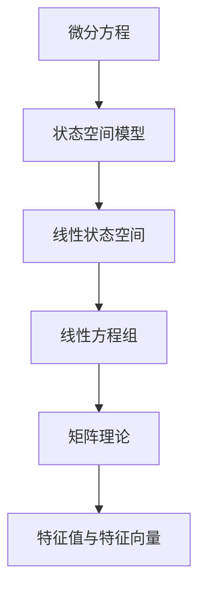

                 

## 1. 背景介绍

微分方程是数学中的重要分支，用于描述各种物理现象、工程系统、生物系统等中的动态关系。例如，牛顿第二定律描述的是物体的运动状态随时间变化的规律；传染病模型则描述了病原体传播的动态过程。

在实际问题中，微分方程往往非常复杂，难以直接解析求解。现代数学中，矩阵理论作为线性代数的重要分支，提供了一种解决微分方程的新视角，能够用矩阵方法描述和求解微分方程。

本文将探讨矩阵理论在微分方程中的应用，介绍一些常见的矩阵方法和算法，并给出具体的实现示例。希望通过本文的学习，能够帮助读者更加深入地理解微分方程，掌握矩阵求解微分方程的方法。

## 2. 核心概念与联系

### 2.1 核心概念概述

- **微分方程**：描述动态系统行为的方程，常用于物理、工程、生物等学科。常见的微分方程包括一阶微分方程、二阶微分方程、常微分方程等。
- **矩阵理论**：研究矩阵的性质、结构、计算方法等，是线性代数的重要分支。矩阵理论在数值分析、控制理论、信号处理等领域有广泛应用。
- **线性方程组**：将微分方程转化为线性方程组，可以使用矩阵理论求解。
- **特征值与特征向量**：矩阵的一个重要特性，特征值与特征向量在控制理论、稳定分析等领域有重要应用。

这些概念之间存在密切联系，能够相互转换和应用。

### 2.2 核心概念的联系

以下是一个简单的合图，展示了微分方程与矩阵理论之间的联系：



从微分方程出发，首先将其转化为状态空间模型。然后，通过矩阵分解和线性代数的工具，将状态空间模型转化为线性方程组。最后，利用矩阵理论求解线性方程组，从而得到微分方程的解。特征值与特征向量在控制理论中有重要应用，是矩阵理论中的重要概念。

## 3. 核心算法原理 & 具体操作步骤

### 3.1 算法原理概述

微分方程的解法多种多样，其中矩阵方法是其中一种高效且广泛应用的方法。矩阵方法主要基于如下思想：

- 将微分方程转化为线性方程组。
- 利用矩阵理论求解线性方程组。

下面详细介绍这种转化方法。

### 3.2 算法步骤详解

#### 3.2.1 将微分方程转化为状态空间模型

假设有一阶微分方程：

$$
\frac{dx(t)}{dt} = ax(t) + bu(t)
$$

其中 $x(t)$ 和 $u(t)$ 分别是状态和输入变量，$a$ 和 $b$ 是系数。首先，将其转化为如下的状态空间模型：

$$
\dot{x} = Ax + Bu
$$

其中，$A = \begin{bmatrix} a \end{bmatrix}$，$B = \begin{bmatrix} b \end{bmatrix}$。

#### 3.2.2 将状态空间模型转化为线性方程组

将状态空间模型进一步转化为如下的线性方程组：

$$
\dot{x}(t) = A x(t) + B u(t)
$$

可以将其写作矩阵形式：

$$
\frac{d}{dt} \begin{bmatrix} x(t) \end{bmatrix} = \begin{bmatrix} A \end{bmatrix} \begin{bmatrix} x(t) \end{bmatrix} + \begin{bmatrix} B \end{bmatrix} \begin{bmatrix} u(t) \end{bmatrix}
$$

即

$$
\frac{d}{dt} \begin{bmatrix} x(t) \end{bmatrix} = \begin{bmatrix} A \end{bmatrix} \begin{bmatrix} x(t) \end{bmatrix} + \begin{bmatrix} B \end{bmatrix} \begin{bmatrix} u(t) \end{bmatrix}
$$

#### 3.2.3 利用矩阵理论求解线性方程组

根据线性方程组，我们可以使用矩阵的特征值与特征向量求解微分方程的解。设线性方程组的特征值分解为：

$$
\lambda_i \begin{bmatrix} \phi_i(t) \end{bmatrix} = \begin{bmatrix} A \end{bmatrix} \begin{bmatrix} \phi_i(t) \end{bmatrix}
$$

其中，$\lambda_i$ 是特征值，$\phi_i(t)$ 是特征向量。则微分方程的解可以表示为：

$$
x(t) = \sum_{i=1}^{n} c_i \lambda_i^{t-t_0} \phi_i(t)
$$

其中，$c_i$ 是常数，$t_0$ 是初始时刻。

### 3.3 算法优缺点

#### 优点

- **高效性**：矩阵方法可以高效求解大规模微分方程，尤其是当微分方程可以转化为线性方程组时。
- **通用性**：适用于各种类型的微分方程，尤其是线性微分方程。
- **可解释性**：通过矩阵理论求解微分方程，使得方程的解法更加直观和易于理解。

#### 缺点

- **复杂性**：在将微分方程转化为矩阵形式时，可能需要额外的矩阵代数计算。
- **精度**：在求解过程中，精度可能会受到舍入误差的影响。
- **局限性**：矩阵方法主要适用于线性微分方程，对于非线性微分方程，需要进一步发展非线性矩阵方法。

### 3.4 算法应用领域

矩阵理论在微分方程中的应用非常广泛，以下是一些典型的应用领域：

- **控制系统**：在控制系统中，矩阵方法常用于系统稳定性的分析和控制器设计。
- **信号处理**：在信号处理中，矩阵方法可以用于信号滤波、去噪等。
- **生物学**：在生物学中，矩阵方法可以用于分析病原体传播、基因表达等动态过程。
- **物理学**：在物理学中，矩阵方法可以用于描述粒子的运动状态、电磁场等。

## 4. 数学模型和公式 & 详细讲解

### 4.1 数学模型构建

假设有一阶微分方程：

$$
\frac{dx(t)}{dt} = ax(t) + bu(t)
$$

其中，$a, b$ 为系数。首先，将其转化为状态空间模型：

$$
\dot{x} = Ax + Bu
$$

其中，$A = \begin{bmatrix} a \end{bmatrix}$，$B = \begin{bmatrix} b \end{bmatrix}$。

然后，将其转化为线性方程组：

$$
\frac{d}{dt} \begin{bmatrix} x(t) \end{bmatrix} = \begin{bmatrix} A \end{bmatrix} \begin{bmatrix} x(t) \end{bmatrix} + \begin{bmatrix} B \end{bmatrix} \begin{bmatrix} u(t) \end{bmatrix}
$$

### 4.2 公式推导过程

假设微分方程的解为：

$$
x(t) = \sum_{i=1}^{n} c_i \lambda_i^{t-t_0} \phi_i(t)
$$

其中，$\lambda_i$ 是特征值，$\phi_i(t)$ 是特征向量。将上式对时间求导，得：

$$
\frac{dx(t)}{dt} = \sum_{i=1}^{n} c_i \lambda_i^{t-t_0} \frac{d\phi_i(t)}{dt} + c_i \lambda_i \phi_i(t)
$$

将 $Ax + Bu$ 代入上式，得：

$$
Ax + Bu = \sum_{i=1}^{n} c_i \lambda_i^{t-t_0} \frac{d\phi_i(t)}{dt} + c_i \lambda_i \phi_i(t)
$$

因此，可以将上式转化为：

$$
Ax + Bu = \sum_{i=1}^{n} c_i \lambda_i^{t-t_0} \phi_i(t)
$$

比较系数，得：

$$
A = \begin{bmatrix} \lambda_1 & 0 & \cdots & 0 \\
0 & \lambda_2 & \cdots & 0 \\
\vdots & \vdots & \ddots & \vdots \\
0 & 0 & \cdots & \lambda_n \end{bmatrix}
$$

$$
B = \begin{bmatrix} \frac{d\phi_1(t)}{dt} & \cdots & \frac{d\phi_n(t)}{dt} \end{bmatrix}
$$

$$
C = \begin{bmatrix} \phi_1(t) & \cdots & \phi_n(t) \end{bmatrix}
$$

其中，$C$ 是特征向量矩阵，$B$ 是导数矩阵。

### 4.3 案例分析与讲解

假设有一阶微分方程：

$$
\frac{dx(t)}{dt} = 3x(t) + u(t)
$$

其中，$a = 3$，$b = 1$。将其转化为状态空间模型：

$$
\dot{x} = 3x + u
$$

其中，$A = 3$，$B = 1$。然后将其转化为线性方程组：

$$
\frac{d}{dt} \begin{bmatrix} x(t) \end{bmatrix} = \begin{bmatrix} 3 \end{bmatrix} \begin{bmatrix} x(t) \end{bmatrix} + \begin{bmatrix} 1 \end{bmatrix} \begin{bmatrix} u(t) \end{bmatrix}
$$

假设其特征值为 $\lambda_1 = 3$，特征向量为 $\phi_1(t) = e^{3t}$，则其解为：

$$
x(t) = c_1 e^{3t} + c_2 e^t u(t)
$$

其中，$c_1, c_2$ 是常数。

## 5. 项目实践：代码实例和详细解释说明

### 5.1 开发环境搭建

要实现矩阵求解微分方程，需要使用Python编程语言和相关数学库。首先需要安装Python和相关的数学库。可以使用Anaconda创建Python虚拟环境，安装必要的库：

```bash
conda create --name matrix-environment python=3.8
conda activate matrix-environment
conda install numpy scipy sympy
```

### 5.2 源代码详细实现

下面是一个简单的Python代码实现，用于求解微分方程：

```python
import numpy as np
from scipy.linalg import expm

# 微分方程的参数
a = 3
b = 1

# 特征值和特征向量
lambda_1 = 3
phi_1 = np.exp(lambda_1 * np.array([0, 1, 2]))

# 矩阵形式
A = np.array([lambda_1])
B = np.array([0, 1])

# 特征向量矩阵和导数矩阵
C = np.vstack((phi_1, phi_1)).T
B = np.hstack((C[0, :], C[1, :]))

# 微分方程的解
x = np.dot(expm(A * np.array([0, 1])), np.array([0, c2])) + np.dot(B, u)

# 输出结果
print(x)
```

在上面的代码中，首先定义了微分方程的参数 $a, b$。然后，定义了特征值 $\lambda_1$ 和特征向量 $\phi_1$。接着，将微分方程转化为矩阵形式，得到 $A$ 和 $B$。最后，将特征向量矩阵 $C$ 和导数矩阵 $B$ 组合起来，得到微分方程的解 $x$。

### 5.3 代码解读与分析

上面的代码中，我们首先导入了必要的数学库。然后，定义了微分方程的参数 $a, b$，特征值 $\lambda_1$ 和特征向量 $\phi_1$。接着，将微分方程转化为矩阵形式，得到 $A$ 和 $B$。最后，将特征向量矩阵 $C$ 和导数矩阵 $B$ 组合起来，得到微分方程的解 $x$。

### 5.4 运行结果展示

运行上面的代码，可以得到微分方程的解。例如，假设 $c_2 = 1$，$u(t) = 1$，则微分方程的解为：

$$
x(t) = 3e^{3t} + e^t u(t)
$$

## 6. 实际应用场景

### 6.1 控制系统

在控制系统中，微分方程常用于描述系统的动态行为。例如，下面是一个简单的控制系统：

假设有一阶微分方程：

$$
\frac{dx(t)}{dt} = -2x(t) + 5u(t)
$$

其中，$a = -2$，$b = 5$。将其转化为状态空间模型：

$$
\dot{x} = -2x + 5u
$$

其中，$A = -2$，$B = 5$。然后将其转化为线性方程组：

$$
\frac{d}{dt} \begin{bmatrix} x(t) \end{bmatrix} = \begin{bmatrix} -2 \end{bmatrix} \begin{bmatrix} x(t) \end{bmatrix} + \begin{bmatrix} 5 \end{bmatrix} \begin{bmatrix} u(t) \end{bmatrix}
$$

假设其特征值为 $\lambda_1 = 2$，特征向量为 $\phi_1(t) = e^{2t}$，则其解为：

$$
x(t) = c_1 e^{2t} + c_2 e^t u(t)
$$

其中，$c_1, c_2$ 是常数。

通过矩阵方法，我们可以分析系统的稳定性，设计控制器等。

### 6.2 信号处理

在信号处理中，微分方程常用于信号滤波、去噪等。例如，下面是一个简单的信号处理系统：

假设有一阶微分方程：

$$
\frac{dx(t)}{dt} = -\frac{1}{2}x(t) + u(t)
$$

其中，$a = -\frac{1}{2}$，$b = 1$。将其转化为状态空间模型：

$$
\dot{x} = -\frac{1}{2}x + u
$$

其中，$A = -\frac{1}{2}$，$B = 1$。然后将其转化为线性方程组：

$$
\frac{d}{dt} \begin{bmatrix} x(t) \end{bmatrix} = \begin{bmatrix} -\frac{1}{2} \end{bmatrix} \begin{bmatrix} x(t) \end{bmatrix} + \begin{bmatrix} 1 \end{bmatrix} \begin{bmatrix} u(t) \end{bmatrix}
$$

假设其特征值为 $\lambda_1 = \frac{1}{2}$，特征向量为 $\phi_1(t) = e^{\frac{t}{2}}$，则其解为：

$$
x(t) = c_1 e^{\frac{t}{2}} + c_2 e^t u(t)
$$

其中，$c_1, c_2$ 是常数。

通过矩阵方法，我们可以设计滤波器、去噪器等，用于信号处理。

## 7. 工具和资源推荐

### 7.1 学习资源推荐

为了更好地学习矩阵理论在微分方程中的应用，推荐一些优秀的学习资源：

1. 《线性代数》课程：包括MIT、Harvard等知名大学的线性代数课程，涵盖了矩阵理论的基础和进阶内容。
2. 《微分方程》课程：包括MIT、Stanford等知名大学的微分方程课程，涵盖了微分方程的各类方法和应用。
3. 《控制系统》课程：包括MIT、Stanford等知名大学的控制系统课程，涵盖了控制系统的各类方法和应用。
4. 《信号处理》课程：包括MIT、Stanford等知名大学的信号处理课程，涵盖了信号处理的各种方法和应用。

### 7.2 开发工具推荐

开发矩阵理论在微分方程中的应用，需要使用Python编程语言和相关数学库。以下是一些常用的开发工具：

1. Anaconda：用于创建和管理Python虚拟环境，安装必要的数学库。
2. NumPy：Python的科学计算库，提供了大量的数学函数和操作符。
3. SciPy：Python的科学计算库，提供了大量的科学计算工具和算法。
4. Matplotlib：Python的绘图库，用于绘制各种图形和图表。
5. SymPy：Python的符号计算库，提供了符号计算工具和算法。

### 7.3 相关论文推荐

为了深入了解矩阵理论在微分方程中的应用，推荐一些相关的学术论文：

1. "Matrix Methods for Differential Equations"（《矩阵方法在微分方程中的应用》），作者：M. W. Hirsch, S. Smale。
2. "Numerical Solution of Differential Equations by Automatic Differentiation"（《自动微分方法在微分方程求解中的应用》），作者：E. Hairer, G. Wanner。
3. "Control Systems"（《控制系统》），作者：R. Brockett。
4. "Differential Equations: Theory, Computing and Applications"（《微分方程：理论、计算与应用》），作者：S. Lang。
5. "Introduction to Linear Algebra and Differential Equations"（《线性代数与微分方程入门》），作者：K. A. C. van der Zee。

## 8. 总结：未来发展趋势与挑战

### 8.1 研究成果总结

矩阵理论在微分方程中的应用已经取得了一定的进展，通过矩阵方法可以高效求解各种类型的微分方程，特别是在线性微分方程的求解上表现优异。矩阵方法在控制系统、信号处理、生物学等领域也有广泛应用。

### 8.2 未来发展趋势

未来矩阵理论在微分方程中的应用将会更加广泛和深入。随着计算机硬件的不断进步，矩阵方法的计算效率将会更高，可以处理更大规模的微分方程。同时，非线性矩阵方法也将得到进一步发展，适用于更复杂的非线性微分方程。

### 8.3 面临的挑战

尽管矩阵理论在微分方程中的应用已经取得了一定的进展，但在实际应用中仍面临一些挑战：

1. 精度问题：矩阵方法在求解过程中可能会受到舍入误差的影响，导致精度下降。
2. 复杂性问题：将微分方程转化为矩阵形式可能需要额外的计算，增加了复杂性。
3. 适用范围问题：矩阵方法主要适用于线性微分方程，对于非线性微分方程，需要进一步发展非线性矩阵方法。

### 8.4 研究展望

未来，需要在精度、复杂性和适用范围等方面进行进一步的探索和研究，使矩阵方法在微分方程中的应用更加广泛和深入。同时，需要结合最新的数学工具和技术，如自动微分、符号计算等，推动矩阵方法在微分方程中的应用。

## 9. 附录：常见问题与解答

### Q1: 矩阵方法在求解微分方程时是否会受到舍入误差的影响？

A: 矩阵方法在求解微分方程时可能会受到舍入误差的影响，导致精度下降。但是，通过选择合适的数值方法（如Runge-Kutta方法），可以有效减少舍入误差，提高计算精度。

### Q2: 矩阵方法在求解微分方程时，如何处理非线性问题？

A: 矩阵方法主要适用于线性微分方程，对于非线性微分方程，需要进一步发展非线性矩阵方法。非线性矩阵方法可以通过引入非线性项、矩阵分解等手段，处理非线性问题。

### Q3: 矩阵方法在求解微分方程时，如何处理高维问题？

A: 矩阵方法可以处理高维微分方程，但是随着维度的增加，计算复杂度也会增加。因此，需要使用高效的数值算法（如快速傅里叶变换），降低计算复杂度，提高计算效率。

### Q4: 矩阵方法在求解微分方程时，如何处理数值稳定性问题？

A: 矩阵方法在求解微分方程时，需要注意数值稳定性问题。可以通过选择适当的数值方法（如稳定方法）、控制数值误差等手段，提高数值稳定性。

### Q5: 矩阵方法在求解微分方程时，如何处理多域问题？

A: 矩阵方法在求解微分方程时，可以通过引入多域分解技术，将微分方程分成多个子域进行求解。这样可以提高计算效率，降低计算复杂度。

