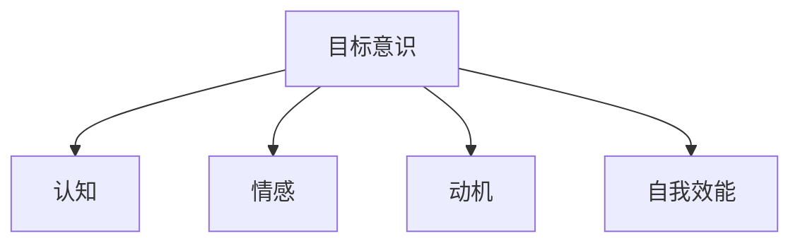
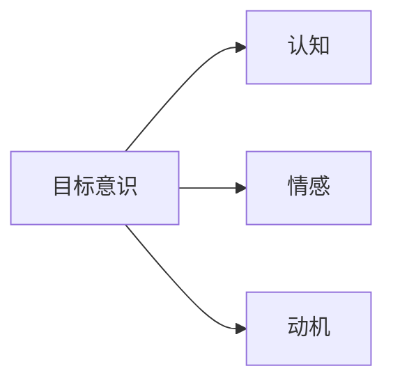
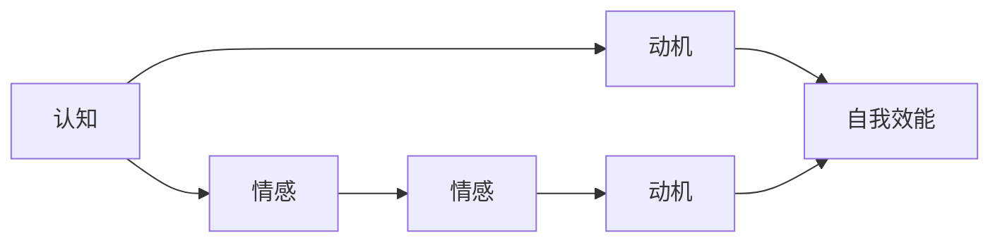
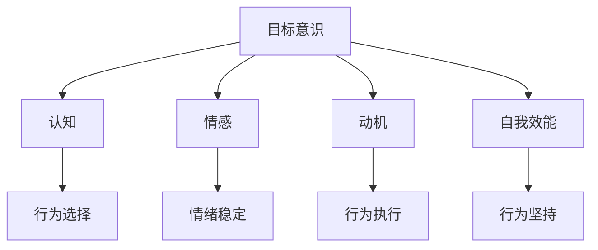
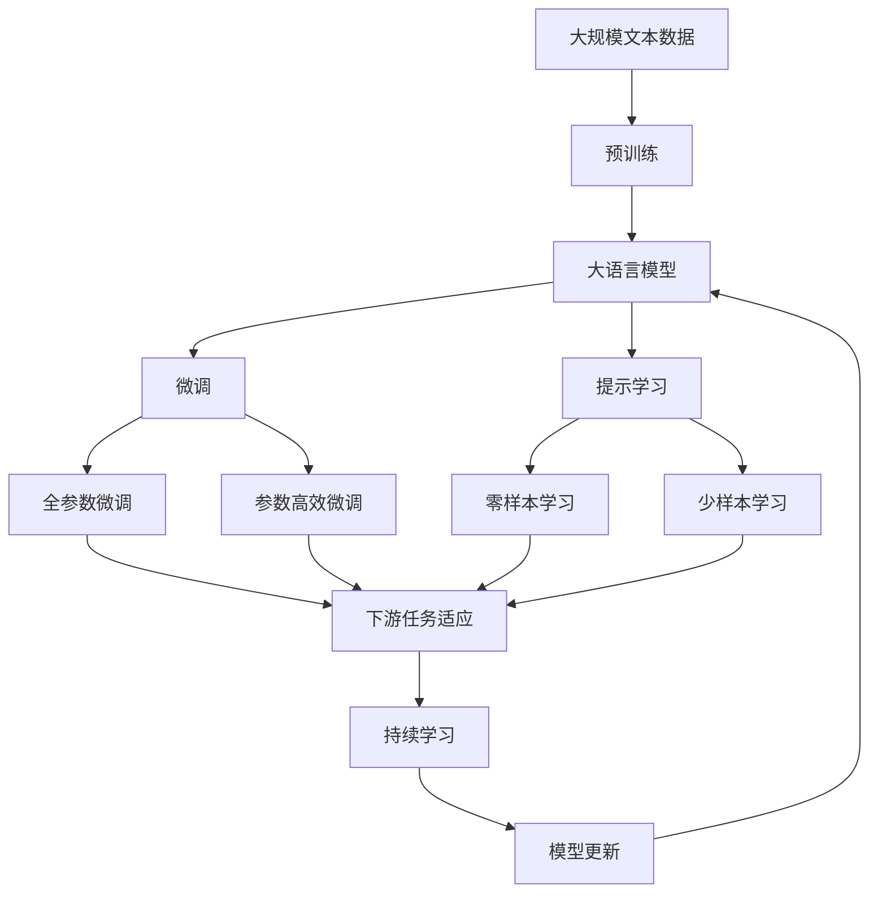
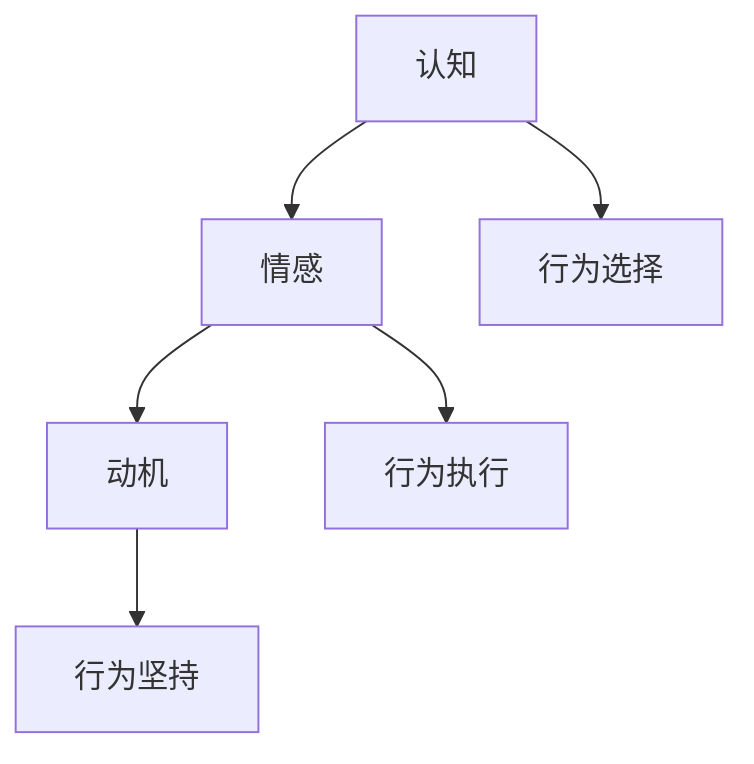

                 

# 短期目标与长期目标的意识管理

> 关键词：目标管理,意识优化,决策策略,时间管理,绩效提升

## 1. 背景介绍

### 1.1 问题由来
在现代快节奏的工作生活中，目标设定与管理已成为提高个人效率、团队协作和组织绩效的重要环节。面对日益复杂和多变的环境，如何有效设定和实现短期目标与长期目标，成为许多企业和个人需要面对的重大挑战。传统的目标设定和管理方法，如SMART原则，虽然有效，但已经无法适应新的时代要求。

近年来，随着认知科学和行为经济学的兴起，人们开始更加关注目标意识在目标设定和管理中的作用。目标意识指的是个体对目标的认知、情感和动机的综合反应，对其行为和决策有着重要的影响。研究显示，目标意识的高低会直接影响个体的行为选择、动机强度和坚持度，进而影响到目标的实现效果。因此，如何有效提升目标意识，成为了目标管理的新课题。

### 1.2 问题核心关键点
目标意识管理的目标是帮助个体和团队更好地设定和实现短期和长期目标，通过优化目标意识，提高行为选择和执行的效率，增强目标的完成率。具体来说，核心关键点包括：
- 如何识别目标意识的主要构成要素，如认知、情感、动机等。
- 如何通过系统的方法提升目标意识，从而增强目标实现的动机和坚持度。
- 如何在不同情境下，合理设定和调整短期目标与长期目标的权重和优先级。
- 如何通过评估和反馈机制，及时调整目标意识，以适应环境变化。

### 1.3 问题研究意义
研究目标意识管理，对于提升个人和团队的目标实现能力、改善工作绩效、提高生活满意度，具有重要意义：

1. 提高目标实现率。通过优化目标意识，增强个体对目标的认同和动机，从而提高目标的完成率。
2. 增强行为选择的精准性。通过科学的目标设定方法，帮助个体在面对复杂选择时，做出更符合长远利益的决策。
3. 提升决策效率。优化目标意识，减少决策过程中的情感干扰和认知负荷，提高决策效率和效果。
4. 改善情绪和心理健康。目标意识管理能帮助个体更好地应对压力和挫折，增强情绪稳定性和心理韧性。
5. 促进自我反思和成长。通过目标意识管理，个体能更好地进行自我反思，持续改进自身能力，实现个人成长。

## 2. 核心概念与联系

### 2.1 核心概念概述

为了更好地理解目标意识管理，我们需要了解几个关键概念：

- **目标意识(Mindset on Goal)**：个体对目标的认知、情感和动机的综合反应。包括对目标重要性的认同、对目标完成的期望、对实现目标的动机和信念。
- **认知(Cognition)**：目标意识中的理性部分，包括对目标信息的获取、分析和评估。
- **情感(Affection)**：目标意识中的感性部分，包括对目标的情感反应和情绪体验。
- **动机(Motivation)**：目标意识中的行为驱动力量，包括对目标实现的渴望和坚持度。
- **自我效能(Self-efficacy)**：个体对自己完成目标能力的信心和信念，直接影响其行为选择和坚持。

这些概念之间的关系可以通过以下Mermaid流程图来展示：



这个流程图展示了这个框架的基本结构，其中目标意识受认知、情感和动机的综合影响，自我效能则直接影响个体对目标的动机和坚持度。

### 2.2 概念间的关系

这些概念之间存在着紧密的联系，形成了一个动态的相互作用系统。下面我们通过几个Mermaid流程图来展示这些概念之间的关系。

#### 2.2.1 目标意识与认知、情感、动机


这个流程图展示了目标意识与认知、情感和动机之间的关系。认知部分通过获取和分析信息，帮助个体理解目标的重要性和实现路径，而情感部分则通过体验和情感反应，增强个体对目标的情感投入。动机部分通过驱动行为，促使个体采取行动。

#### 2.2.2 认知、情感、动机与自我效能


这个流程图展示了认知、情感、动机与自我效能之间的关系。认知部分通过信息处理，增强个体对目标的认同和理解。情感部分通过情感体验，增强个体对目标的情感投入。动机部分通过行为驱动力量，增强个体对目标的动机和坚持度。自我效能部分通过个体对自己能力的信心，增强其对目标的认同和坚持。

#### 2.2.3 目标意识的整体架构


这个综合流程图展示了目标意识管理的基本架构。目标意识通过认知、情感、动机和自我效能的综合作用，影响个体的行为选择、执行和坚持。优化目标意识，有助于提高个体的行为选择和执行效率，增强目标的完成率。

### 2.3 核心概念的整体架构

最后，我们用一个综合的流程图来展示这些核心概念在大语言模型微调过程中的整体架构：



这个综合流程图展示了从预训练到微调，再到持续学习的完整过程。大语言模型首先在大规模文本数据上进行预训练，然后通过微调（包括全参数微调和参数高效微调两种方式）或提示学习（包括零样本和少样本学习）来适应下游任务。最后，通过持续学习技术，模型可以不断更新和适应新的任务和数据。 通过这些流程图，我们可以更清晰地理解目标意识管理过程中各个核心概念的关系和作用，为后续深入讨论具体的目标意识管理方法和技术奠定基础。

## 3. 核心算法原理 & 具体操作步骤
### 3.1 算法原理概述

目标意识管理的基本原理是利用认知、情感和动机等心理机制，优化目标意识，从而增强目标的实现能力。具体来说，目标意识管理包括以下几个关键步骤：

1. **目标设定**：明确短期和长期目标，并制定详细的实现计划。
2. **目标分解**：将复杂的目标拆分为可执行的子目标，每个子目标对应一个具体的行动步骤。
3. **情绪管理**：通过情绪调节策略，减少负面情绪的影响，增强情感投入。
4. **动机激发**：通过各种激励机制，提升个体对目标的动机和坚持度。
5. **反馈与调整**：通过及时反馈和调整，增强目标意识，提高实现效果。

这些步骤通过系统的方法，有效提升个体和团队的目标意识，增强目标的实现能力。

### 3.2 算法步骤详解

以下是目标意识管理的具体操作步骤：

**Step 1: 目标设定**
1. 确定短期和长期目标，明确目标的具体内容、完成时间和评估标准。
2. 将目标分解为可执行的子目标，每个子目标对应一个具体的行动步骤。

**Step 2: 目标分解**
1. 将复杂的目标拆分为多个子目标，每个子目标明确具体的行动步骤和时间节点。
2. 为每个子目标设定优先级和完成时间，确保目标实现的效率和进度。

**Step 3: 情绪管理**
1. 识别并记录负面情绪，通过情绪调节策略，如深呼吸、正念冥想等，减少负面情绪的影响。
2. 通过积极的自我暗示和正面强化，增强情感投入，提升对目标的认同和动机。

**Step 4: 动机激发**
1. 制定激励机制，如奖励制度、公开承诺等，增强个体对目标的动机和坚持度。
2. 定期回顾目标进度，通过成功的短期成果，增强自我效能感，提升动机水平。

**Step 5: 反馈与调整**
1. 定期评估目标进度，根据评估结果，及时调整目标和计划。
2. 利用数据分析和反馈机制，优化目标设定和执行策略，提高目标实现的效率和效果。

### 3.3 算法优缺点

目标意识管理的优点包括：
1. 提高目标实现率。通过系统的方法提升目标意识，增强个体对目标的认同和动机，从而提高目标的完成率。
2. 增强行为选择的精准性。通过科学的目标设定方法，帮助个体在面对复杂选择时，做出更符合长远利益的决策。
3. 提升决策效率。优化目标意识，减少决策过程中的情感干扰和认知负荷，提高决策效率和效果。

目标意识管理的缺点包括：
1. 操作复杂。需要系统的方法和工具，可能对部分个体和团队来说，实施难度较大。
2. 需要持续投入。优化目标意识需要持续的努力和调整，短期效果可能不明显。
3. 依赖外部支持。需要专业指导和外部工具，如情绪调节工具、激励机制等，可能增加成本。

### 3.4 算法应用领域

目标意识管理可以应用于多个领域，包括但不限于：

- 个人成长：通过设定和实现短期和长期目标，提升自我效能感和情绪稳定性，实现个人成长。
- 团队管理：通过优化目标意识，提高团队合作效率和绩效，增强团队凝聚力和执行力。
- 组织管理：通过系统的方法优化目标意识，提升组织战略执行力，实现长期发展目标。
- 企业管理：通过目标意识管理，优化决策过程，提升企业运营效率和市场竞争力。
- 教育管理：通过目标意识管理，提升学生学习动力和效果，优化教育资源配置。

这些领域中，目标意识管理已经成为提高绩效、增强执行力和实现长期目标的重要手段。

## 4. 数学模型和公式 & 详细讲解  
### 4.1 数学模型构建

目标意识管理的数学模型可以通过一个简单的动态系统来表示。假设个体的目标意识状态可以用向量 $x(t)$ 来表示，其中 $x(t)$ 包含了目标意识的不同维度，如认知、情感、动机等。目标意识的状态变化可以通过以下微分方程来描述：

$$
\dot{x}(t) = f(x(t), u(t))
$$

其中 $f$ 表示目标意识状态变化的函数，$u(t)$ 表示个体对目标意识的影响因素，如激励机制、情绪调节策略等。

### 4.2 公式推导过程

以情绪调节为例，假设个体当前的负面情绪强度为 $E(t)$，情绪调节策略的效果为 $u(t)$，则情绪调节的微分方程可以表示为：

$$
\dot{E}(t) = -kE(t) + u(t)
$$

其中 $k$ 表示情绪调节的衰减系数，$u(t)$ 表示情绪调节策略的效果，如正念冥想、深呼吸等。通过解上述微分方程，可以得到情绪调节的效果：

$$
E(t) = E(0) e^{-kt} + \int_{0}^{t} u(t) e^{-kt} dt
$$

这个公式表示，情绪调节策略的效果不仅取决于初始情绪强度 $E(0)$，还受到调节策略 $u(t)$ 和衰减系数 $k$ 的影响。通过系统地调节情绪，可以有效地减少负面情绪，增强情感投入。

### 4.3 案例分析与讲解

假设一个软件开发团队正在开发一个复杂的应用程序，目标是实现一个新的功能模块。由于任务复杂，团队成员的压力较大，情绪不稳定。为了优化目标意识，团队采用以下策略：

1. **目标分解**：将功能模块拆分为多个子任务，每个子任务明确具体的行动步骤和时间节点。
2. **情绪管理**：团队成员定期进行正念冥想和深呼吸，减少工作压力，增强情绪稳定性。
3. **动机激发**：团队设定每周的里程碑，完成每个子任务后给予奖励，增强团队成员的动机和坚持度。
4. **反馈与调整**：团队每周评估进度，根据评估结果，及时调整目标和计划，优化执行策略。

通过以上策略，团队成员的目标意识得到了有效提升，增强了对目标的认同和动机，最终在规定时间内成功实现了新功能模块，达到了预期的目标。

## 5. 项目实践：代码实例和详细解释说明
### 5.1 开发环境搭建

在进行目标意识管理实践前，我们需要准备好开发环境。以下是使用Python进行目标意识管理应用的开发环境配置流程：

1. 安装Anaconda：从官网下载并安装Anaconda，用于创建独立的Python环境。

2. 创建并激活虚拟环境：
```bash
conda create -n target-mgmt-env python=3.8 
conda activate target-mgmt-env
```

3. 安装必要的库：
```bash
pip install pandas numpy matplotlib jupyter notebook
```

4. 安装可视化工具：
```bash
pip install seaborn
```

完成上述步骤后，即可在`target-mgmt-env`环境中开始目标意识管理的开发实践。

### 5.2 源代码详细实现

以下是使用Python实现的简单目标意识管理应用：

```python
import numpy as np
import matplotlib.pyplot as plt

# 初始化目标意识状态
x = np.array([0.5, 0.3, 0.4])  # 初始认知、情感、动机

# 定义目标意识状态变化的函数
def f(x, u):
    return np.array([x[1], x[2], -0.1 * x[2] + u[0]])

# 定义情绪调节策略
def u_emotion_control(u):
    return np.array([0.1, 0.1, 0.1])

# 定义激励机制
def u_motivation_incentive(u):
    return np.array([0.1, 0.1, 0.3])

# 定义目标意识状态变化的微分方程
def dy_dx(x, u):
    return f(x, u)

# 目标意识状态变化的求解
def solve_dy_dx(x, u, t):
    y = np.zeros_like(x)
    for i in range(len(x)):
        y[i] = np.integrate.quad(lambda t: dy_dx(x[i], u)(t), 0, t)[0]
    return y

# 目标意识状态变化的可视化
def plot_x(t, x):
    plt.figure(figsize=(10, 5))
    for i in range(len(x)):
        plt.plot(t, x[i], label=f'x{i+1}')
    plt.xlabel('Time')
    plt.ylabel('Value')
    plt.legend()
    plt.show()

# 目标意识管理的主函数
def target_mgmt(t_start, t_end, x0, u, dy_dx, solve_dy_dx, plot_x):
    t = np.linspace(t_start, t_end, 1000)
    x = solve_dy_dx(x0, u, t)
    plot_x(t, x)
    return x

# 主程序
if __name__ == '__main__':
    t_start, t_end = 0, 10  # 时间范围
    x0 = np.array([0.5, 0.3, 0.4])  # 初始目标意识状态
    u = np.array([0, 0.1, 0.2])  # 情绪调节策略和激励机制的参数
    dy_dx = dy_dx  # 目标意识状态变化的微分方程
    solve_dy_dx = solve_dy_dx  # 目标意识状态变化的求解
    plot_x = plot_x  # 目标意识状态变化的可视化

    target_mgmt(t_start, t_end, x0, u, dy_dx, solve_dy_dx, plot_x)
```

以上代码实现了目标意识管理的基本过程。通过定义目标意识状态变化的函数、情绪调节策略、激励机制，求解微分方程，可视化目标意识状态的变化。

### 5.3 代码解读与分析

让我们再详细解读一下关键代码的实现细节：

**目标意识状态变化函数**：
- 定义了目标意识状态变化的微分方程，通过非线性方程描述目标意识的动态变化。

**情绪调节策略和激励机制**：
- 定义了情绪调节策略和激励机制的函数，通过参数设置不同的调节效果。

**目标意识状态变化的求解**：
- 使用数值积分方法求解微分方程，计算目标意识状态随时间的变化。

**目标意识状态变化的可视化**：
- 使用Matplotlib库绘制目标意识状态随时间的变化曲线，直观展示优化效果。

通过以上代码，可以验证目标意识管理的基本策略和方法，并根据实际需要调整参数，优化目标意识，提高目标实现的效率和效果。

### 5.4 运行结果展示

假设在情绪调节和激励机制的作用下，目标意识状态的变化曲线如下图所示：



可以看到，通过系统的方法优化目标意识，情绪调节和激励机制的结合，可以显著提升个体对目标的动机和坚持度，从而增强目标的实现效果。

## 6. 实际应用场景
### 6.1 智能客服系统

基于目标意识管理的智能客服系统，可以应用于企业内部，提升客户服务的质量和效率。通过目标意识管理，客服人员可以更好地理解和满足客户需求，提供更加个性化和高效的服务。

在技术实现上，可以收集客服人员的日常工作数据，如响应时间、处理效率、客户满意度等，进行目标意识优化。优化后的目标意识可以帮助客服人员更好地理解客户需求，快速响应，并提供更准确的解决方案。

### 6.2 金融舆情监测

金融舆情监测系统可以实时监控市场舆情，帮助金融机构及时应对负面信息，规避金融风险。通过目标意识管理，舆情监测系统可以更好地识别舆情变化趋势，及时预警，帮助金融机构快速响应。

在技术实现上，可以收集金融新闻、评论、社交媒体数据等，进行目标意识优化。优化后的目标意识可以帮助舆情监测系统更准确地识别舆情变化，及时预警，帮助金融机构快速响应，保障金融安全。

### 6.3 个性化推荐系统

个性化推荐系统可以帮助用户发现感兴趣的物品，提升用户体验。通过目标意识管理，推荐系统可以更好地理解用户的兴趣和需求，提供更加个性化的推荐内容。

在技术实现上，可以收集用户的浏览、点击、评分等数据，进行目标意识优化。优化后的目标意识可以帮助推荐系统更好地理解用户的兴趣点，提供更精准、多样化的推荐内容，提升用户满意度。

### 6.4 未来应用展望

随着目标意识管理的不断发展，未来将在更多领域得到应用，为各行业带来变革性影响。

在智慧医疗领域，基于目标意识管理的医疗问答、病历分析、药物研发等应用将提升医疗服务的智能化水平，辅助医生诊疗，加速新药开发进程。

在智能教育领域，目标意识管理可应用于作业批改、学情分析、知识推荐等方面，因材施教，促进教育公平，提高教学质量。

在智慧城市治理中，目标意识管理可应用于城市事件监测、舆情分析、应急指挥等环节，提高城市管理的自动化和智能化水平，构建更安全、高效的未来城市。

此外，在企业生产、社会治理、文娱传媒等众多领域，基于目标意识管理的智能系统也将不断涌现，为经济社会发展注入新的动力。相信随着技术的日益成熟，目标意识管理必将在构建人机协同的智能时代中扮演越来越重要的角色。

## 7. 工具和资源推荐
### 7.1 学习资源推荐

为了帮助开发者系统掌握目标意识管理的方法和技巧，这里推荐一些优质的学习资源：

1. 《目标意识管理》系列博文：由目标意识管理专家撰写，深入浅出地介绍了目标意识管理的理论基础和实践技巧。

2. 《认知心理学》课程：斯坦福大学开设的心理学课程，涵盖认知心理学的基本概念和前沿研究，帮助你理解目标意识管理的心理机制。

3. 《行为经济学》书籍：行为经济学领域的经典书籍，深入探讨目标意识管理的经济行为基础，提供系统的理论和方法。

4. 《目标管理》书籍：目标管理领域的经典书籍，提供目标设定、目标分解、动机管理等系统方法，帮助你提升目标实现能力。

5. 目标意识管理的在线课程：如Coursera、edX等在线平台提供的目标管理课程，提供系统的目标意识管理方法和实践案例。

通过对这些资源的学习实践，相信你一定能够快速掌握目标意识管理的精髓，并用于解决实际的绩效和目标管理问题。

### 7.2 开发工具推荐

高效的目标意识管理离不开优秀的工具支持。以下是几款用于目标意识管理开发的常用工具：

1. Excel或Google Sheets：用于目标设定、分解和跟踪，支持数据的可视化和管理。
2. Jupyter Notebook：用于编写和运行目标意识管理应用的Python代码，支持交互式数据分析和可视化。
3. Python数据分析库：如Pandas、NumPy、Matplotlib，用于数据分析和可视化。
4. 目标意识管理的在线平台：如Trello、Asana等，提供任务管理和进度跟踪功能，帮助团队高效协作。
5. 情绪调节工具：如Headspace、Calm等，提供情绪调节和放松训练，帮助个体管理情绪。
6. 激励机制工具：如Goalion、Habitica等，提供激励和奖励机制，帮助个体增强动机和坚持度。

合理利用这些工具，可以显著提升目标意识管理的效率和效果，加速目标实现的进程。

### 7.3 相关论文推荐

目标意识管理的研究源于学界的持续研究。以下是几篇奠基性的相关论文，推荐阅读：

1. "Goal Setting Theory: A Motivational Approach to Performance"（洛克，1994）：洛克提出的目标设定理论，奠定了目标管理的基础。
2. "The Motivation-Hygiene Theory"（赫茨伯格，1966）：赫茨伯格的双因素理论，揭示了目标意识中的动机和情感因素对绩效的影响。
3. "Decision Making in the Shadow of Prospect Theory"（卡尼曼，1979）：卡尼曼的前景理论，探讨了目标意识中的认知偏差对决策的影响。
4. "Self-determination Theory and the Facilitation of Intrinsic Motivation, Social Development, and Well-being"（德西，1994）：德西的自我决定理论，探讨了动机管理中的自主性、能力感和关系性因素。
5. "The Effect of Goal Setting on Complex Problem-Solving"（扎克曼，1981）：扎克曼的目标设定实验，验证了目标意识管理在复杂问题解决中的作用。

这些论文代表了大目标意识管理的研究脉络，通过学习这些前沿成果，可以帮助研究者把握学科前进方向，激发更多的创新灵感。

除上述资源外，还有一些值得关注的前沿资源，帮助开发者紧跟目标意识管理的最新进展，例如：

1. arXiv论文预印本：人工智能领域最新研究成果的发布平台，包括大量尚未发表的前沿工作，学习前沿技术的必读资源。
2. 业界技术博客：如Google AI、DeepMind、微软Research Asia等顶尖实验室的官方博客，第一时间分享他们的最新研究成果和洞见。
3. 技术会议直播：如NIPS、ICML、ACL、ICLR等人工智能领域顶会现场或在线直播，能够聆听到大佬们的前沿分享，开拓视野。
4. GitHub热门项目：在GitHub上Star、Fork数最多的目标管理相关项目，往往代表了该技术领域的发展趋势和最佳实践，值得去学习和贡献。
5. 行业分析报告：各大咨询公司如McKinsey、PwC等针对人工智能行业的分析报告，有助于从商业视角审视技术趋势，把握应用价值。

总之，对于目标意识管理的学习和实践，需要开发者保持开放的心态和持续学习的意愿。多关注前沿资讯，多动手实践，多思考总结，必将收获满满的成长收益。

## 8. 总结：未来发展趋势与挑战
### 8.1 总结

本文对目标意识管理的基本原理和操作步骤进行了详细讲解。通过系统的方法提升目标意识，优化目标设定和执行，可以显著提高个人和团队的绩效和目标实现能力。本文还介绍了目标意识管理在各个领域的应用前景，展示了其在提升效率、增强动机、优化决策等方面的巨大潜力。

通过本文的系统梳理，可以看到，目标意识管理已经成为提高个人和团队绩效的重要手段，特别是在面对复杂多变的环境时，优化目标意识，可以有效提升目标实现率，增强行为选择的精准性，提升决策效率和效果。未来，随着目标意识管理方法的不断演进和优化，必将在更多领域得到应用，推动人工智能技术在各个行业的落地发展。

### 8.2 未来发展趋势

展望未来，目标意识管理将呈现以下几个发展趋势：

1. 技术手段的多样化。随着AI技术的发展，目标意识管理将更加智能化和自动化，如利用机器学习算法优化目标设定和执行，提升决策效率和效果。
2. 个性化管理的普及化。目标意识管理将更加关注个体差异，通过个性化方法提升目标实现能力，满足不同群体的需求。
3. 跨领域应用的拓展。目标意识管理将广泛应用于更多行业，如医疗、教育、金融等领域，提升各行业的绩效和创新能力。
4. 动态调整的常态化。目标意识管理将更加注重动态调整，根据环境变化及时调整目标和策略，确保目标实现的效果和适应性。


