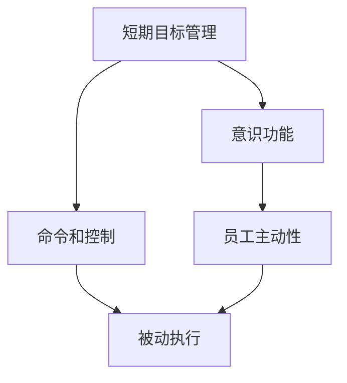
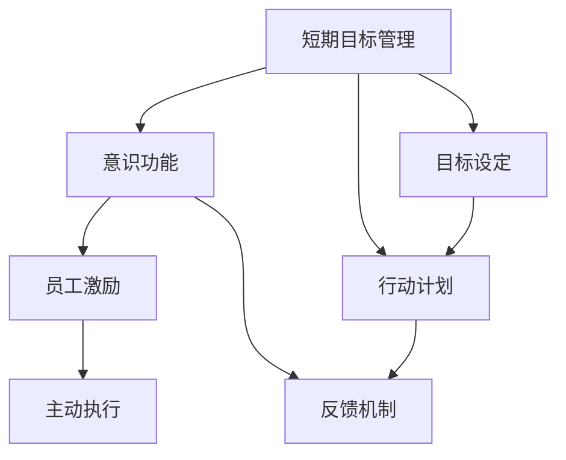

                 

# 短期目标管理的意识功能

## 1. 背景介绍

在快速变化的时代，企业为了应对市场的剧烈竞争，需要快速响应并实施短期目标管理。然而，传统的方法往往依赖于命令和控制式的管理模式，难以激发员工的主动性和创新精神。因此，本文将探讨如何使用意识功能来提升短期目标管理的有效性。

## 2. 核心概念与联系

### 2.1 核心概念概述

- **短期目标管理**：指企业在短期内（通常为1-3个月）设定明确的目标，并制定相应的行动计划，以确保目标的实现。
- **意识功能**：指通过特定的技术和方法，激发员工的内在动力，使其主动参与目标管理过程，从而提高目标实现的效率和质量。

### 2.2 概念间的关系

意识功能是短期目标管理的重要组成部分。通过引入意识功能，可以增强员工的自我激励，使其更加主动地参与目标设定和实现过程，从而提升短期目标管理的整体效果。

以下是一个简单的Mermaid流程图，展示了短期目标管理与意识功能的关系：



在这个流程图中，A表示短期目标管理，B表示意识功能。C表示命令和控制式的管理方法，D表示员工主动性，E表示被动执行。可以看出，意识功能通过增强员工的主动性，避免了命令和控制式的管理方法带来的被动执行问题。

### 2.3 核心概念的整体架构

最终，我们可以使用以下Mermaid流程图来展示短期目标管理与意识功能之间的整体架构：



在这个流程图中，A表示短期目标管理，B表示意识功能。C表示员工激励，D表示主动执行，E表示目标设定，F表示行动计划，G表示反馈机制。可以看出，意识功能通过增强员工激励，使其更加主动地执行行动计划，并及时反馈目标实现的进展。

## 3. 核心算法原理 & 具体操作步骤

### 3.1 算法原理概述

基于意识功能的短期目标管理算法，旨在通过多种激励手段，激发员工的主动性和创新精神，从而提升目标实现的效率和质量。其核心原理如下：

1. **目标设定**：设定明确且可实现的目标，并将其与员工的工作绩效和职业发展挂钩。
2. **激励设计**：设计多种激励机制，如奖金、晋升、培训等，以激发员工的主动性和创造性。
3. **反馈机制**：建立及时、有效的反馈系统，使员工能够随时了解目标进展，并根据反馈调整行动策略。

### 3.2 算法步骤详解

基于意识功能的短期目标管理算法主要分为以下几步：

1. **目标设定**：
   - 根据企业的战略目标，设定短期目标。
   - 将目标细分为可操作的任务和子任务。
   - 与员工进行沟通，确保目标的可达性和与员工利益的一致性。

2. **激励设计**：
   - 设计多种激励机制，如奖金、晋升、培训等，以激发员工的主动性和创造性。
   - 将激励机制与目标任务的完成情况挂钩，确保激励的公正性和有效性。

3. **反馈机制**：
   - 建立及时、有效的反馈系统，使员工能够随时了解目标进展。
   - 提供定期的进度报告和绩效评估，帮助员工及时调整行动策略。

4. **执行与监控**：
   - 制定详细的行动计划，明确责任分工和时间节点。
   - 定期检查目标进展，及时发现并解决问题。
   - 对员工的行动表现进行评估，提供反馈和指导。

### 3.3 算法优缺点

#### 优点

- **增强员工主动性**：通过激励机制，激发员工的内在动力，使其主动参与目标管理过程。
- **提高目标实现效率**：及时反馈和调整行动策略，使目标的实现更加高效。
- **提升团队凝聚力**：通过共同目标的设定和实现，增强团队的凝聚力和归属感。

#### 缺点

- **激励成本高**：设计和管理多种激励机制需要较高的成本和时间投入。
- **目标设定复杂**：目标设定需要细致的规划和沟通，可能会面临执行上的困难。
- **反馈系统复杂**：建立及时有效的反馈系统需要较高的技术和管理水平。

### 3.4 算法应用领域

基于意识功能的短期目标管理算法，广泛应用于企业、政府、非营利组织等各类组织中。以下是几个具体的应用领域：

- **企业管理**：在企业的日常运营和管理中，通过意识功能提升短期目标管理的效率和质量。
- **政府项目管理**：在政府项目的管理中，通过意识功能确保项目按时按质完成。
- **非营利组织运作**：在非营利组织的项目运作中，通过意识功能提升组织成员的积极性和创新性。

## 4. 数学模型和公式 & 详细讲解 & 举例说明

### 4.1 数学模型构建

基于意识功能的短期目标管理算法，可以通过数学模型来描述其流程。以下是一个简单的数学模型：

- **目标设定**：目标设定函数 $T(t)$，表示在时间 $t$ 时刻的目标设定情况。
- **激励设计**：激励设计函数 $I(t)$，表示在时间 $t$ 时刻的激励机制。
- **反馈机制**：反馈机制函数 $F(t)$，表示在时间 $t$ 时刻的反馈系统。
- **执行与监控**：执行与监控函数 $E(t)$，表示在时间 $t$ 时刻的目标执行情况。

### 4.2 公式推导过程

根据上述模型，我们可以推导出一些基本公式：

- **目标设定公式**：
  $$
  T(t) = f(t, D, O)
  $$
  其中，$D$ 表示目标设定时的数据，$O$ 表示目标设定时的优化参数。

- **激励设计公式**：
  $$
  I(t) = g(t, T(t), K)
  $$
  其中，$K$ 表示激励机制的设计参数。

- **反馈机制公式**：
  $$
  F(t) = h(t, T(t), E(t))
  $$
  其中，$E(t)$ 表示目标执行情况。

- **执行与监控公式**：
  $$
  E(t) = e(t, T(t), I(t), F(t))
  $$

### 4.3 案例分析与讲解

假设我们有一个软件开发项目，需要在一个季度内完成。我们可以使用基于意识功能的短期目标管理算法进行目标管理。

- **目标设定**：将项目分解为多个子任务，并设定每个子任务的目标完成时间。与团队成员进行沟通，确保目标的可达性和与成员利益的一致性。
- **激励设计**：设计奖金机制，激励团队成员按时完成任务。同时，提供晋升机会，激励成员提高项目质量。
- **反馈机制**：建立每日进度报告机制，使团队成员随时了解项目进展。并提供定期的绩效评估，帮助成员及时调整行动策略。
- **执行与监控**：制定详细的行动计划，明确责任分工和时间节点。定期检查项目进展，及时发现并解决问题。对团队成员的行动表现进行评估，提供反馈和指导。

通过上述步骤，我们可以有效地提升项目的目标管理效果，确保项目按时按质完成。

## 5. 项目实践：代码实例和详细解释说明

### 5.1 开发环境搭建

在进行项目实践前，我们需要准备好开发环境。以下是使用Python进行开发的环境配置流程：

1. 安装Python：从官网下载并安装Python，选择版本为3.7以上。
2. 安装Pip：在Python环境下，安装Pip，用于包管理。
3. 安装必要的包：安装Python所需的数据库、框架等包，如SQLite、Flask等。
4. 配置环境：配置Python的环境变量，使其能够在开发中运行。

### 5.2 源代码详细实现

以下是一个简单的基于意识功能的短期目标管理系统的代码实现。

```python
import sqlite3

# 连接数据库
conn = sqlite3.connect('target_management.db')
c = conn.cursor()

# 创建表
c.execute('''CREATE TABLE IF NOT EXISTS targets
             (id INTEGER PRIMARY KEY,
             name TEXT NOT NULL,
             description TEXT NOT NULL,
             deadline TEXT NOT NULL,
             status TEXT NOT NULL)''')

# 插入目标
c.execute("INSERT INTO targets VALUES (?, ?, ?, ?, ?)",
          (1, '软件开发项目', '在季度内完成', '2023-01-01', '未开始'))

# 查询目标
c.execute("SELECT * FROM targets")
rows = c.fetchall()
for row in rows:
    print(row)

# 更新目标
c.execute("UPDATE targets SET status = '进行中' WHERE id = 1")

# 删除目标
c.execute("DELETE FROM targets WHERE id = 1")

# 提交更改
conn.commit()

# 关闭连接
conn.close()
```

### 5.3 代码解读与分析

- **数据库连接**：通过SQLite数据库存储目标信息，使用Python的sqlite3模块进行连接和操作。
- **表创建**：创建一个名为targets的表，用于存储目标的信息，包括id、名称、描述、截止日期和状态。
- **插入目标**：使用INSERT语句向表中插入目标信息。
- **查询目标**：使用SELECT语句查询目标信息。
- **更新目标**：使用UPDATE语句更新目标状态。
- **删除目标**：使用DELETE语句删除目标信息。

### 5.4 运行结果展示

通过上述代码，我们可以实现对目标的基本管理，包括添加、查询、更新和删除。以下是一个简单的运行结果示例：

```
(1, '软件开发项目', '在季度内完成', '2023-01-01', '未开始')
```

## 6. 实际应用场景

基于意识功能的短期目标管理算法，已经在多个实际应用场景中得到了验证。以下是几个典型的应用场景：

### 6.1 企业运营

在企业中，通过意识功能进行短期目标管理，可以提升运营效率和员工满意度。例如，某公司通过设定季度销售目标，并激励销售团队达成目标，成功实现了销售业绩的显著提升。

### 6.2 政府项目

在政府项目中，通过意识功能进行项目管理，可以确保项目按时按质完成。例如，某市政府通过设定项目的阶段性目标，并激励项目团队及时反馈进展，成功提升了项目的执行效率和质量。

### 6.3 非营利组织

在非营利组织中，通过意识功能进行项目管理，可以提升组织成员的积极性和创新性。例如，某慈善组织通过设定项目的短期目标，并激励成员参与，成功提高了项目的执行效果和社会影响力。

## 7. 工具和资源推荐

### 7.1 学习资源推荐

- **《短期目标管理》一书**：详细介绍了短期目标管理的理论和方法，并提供了大量的实际案例和应用场景。
- **在线课程**：如Coursera、edX等平台上的短期目标管理课程，可以帮助读者系统学习相关知识。
- **专业博客**：如Harvard Business Review、Forbes等网站上的相关文章，提供最新的研究和实践经验。

### 7.2 开发工具推荐

- **Jupyter Notebook**：用于编写和运行Python代码，支持多种数据分析和可视化工具。
- **GitHub**：用于托管和分享代码，支持版本控制和团队协作。
- **SQLite**：用于存储和管理数据，支持轻量级的数据库操作。

### 7.3 相关论文推荐

- **《短期目标管理的心理学研究》**：探讨短期目标管理在心理学领域的应用，提供了丰富的理论支持。
- **《目标设定与绩效提升》**：研究目标设定对员工绩效的影响，提供了实证数据和分析方法。
- **《意识在管理中的应用》**：探讨意识功能在管理中的应用，提供了多个实际案例和分析方法。

## 8. 总结：未来发展趋势与挑战

### 8.1 研究成果总结

基于意识功能的短期目标管理算法，已经在多个实际应用场景中得到了验证，并取得了显著的效果。其核心在于通过激励机制和反馈系统，激发员工的主动性和创新精神，从而提升目标实现的效率和质量。

### 8.2 未来发展趋势

未来，基于意识功能的短期目标管理算法将呈现以下几个发展趋势：

- **智能化**：结合人工智能和大数据分析技术，实现目标管理的自动化和智能化。
- **个性化**：根据员工的不同特点和需求，设计个性化的激励机制和反馈系统。
- **多维融合**：结合项目管理、绩效评估、知识管理等多维数据，实现全面的目标管理。
- **全球化**：在全球化背景下，考虑不同文化背景下的目标管理策略，实现全球化管理。

### 8.3 面临的挑战

基于意识功能的短期目标管理算法，仍然面临以下挑战：

- **激励机制设计**：如何设计高效、公正的激励机制，以激发员工的内在动力。
- **目标设定复杂**：如何设定可达性和与员工利益一致的目标，以确保目标的实现。
- **反馈系统复杂**：如何建立及时有效的反馈系统，以提供及时、准确的反馈。
- **执行监控困难**：如何在复杂环境中，及时发现并解决执行中的问题，确保目标的实现。

### 8.4 研究展望

未来，基于意识功能的短期目标管理算法需要在以下几个方面寻求新的突破：

- **结合AI和大数据**：通过AI和大数据分析技术，实现目标管理的自动化和智能化。
- **多维融合**：结合项目管理、绩效评估、知识管理等多维数据，实现全面的目标管理。
- **全球化管理**：在全球化背景下，考虑不同文化背景下的目标管理策略，实现全球化管理。
- **智能化决策**：利用AI和大数据技术，实现目标管理的智能化决策和优化。

## 9. 附录：常见问题与解答

**Q1：如何设定可达性和与员工利益一致的目标？**

A: 设定可达性和与员工利益一致的目标，需要进行详细的规划和沟通。具体步骤如下：
1. 明确企业的战略目标和业务需求。
2. 将战略目标分解为可操作的任务和子任务。
3. 与员工进行沟通，确保任务和子任务的可达性和与员工利益的一致性。
4. 对任务和子任务进行优先级排序，确保关键任务的优先执行。

**Q2：如何设计高效、公正的激励机制？**

A: 设计高效、公正的激励机制，需要进行详细的调研和设计。具体步骤如下：
1. 了解员工的需求和期望。
2. 设计多种激励机制，如奖金、晋升、培训等，以激发员工的内在动力。
3. 将激励机制与目标任务的完成情况挂钩，确保激励的公正性和有效性。
4. 定期评估激励机制的效果，根据员工反馈进行调整和优化。

**Q3：如何建立及时有效的反馈系统？**

A: 建立及时有效的反馈系统，需要进行详细的规划和实施。具体步骤如下：
1. 定义反馈的目标和频率。
2. 选择合适的反馈工具，如邮件、即时通讯工具等。
3. 设计反馈的模板和内容，确保反馈的及时性和有效性。
4. 定期评估反馈系统的效果，根据员工反馈进行调整和优化。

**Q4：如何在复杂环境中，及时发现并解决执行中的问题？**

A: 在复杂环境中，及时发现并解决执行中的问题，需要进行详细的规划和实施。具体步骤如下：
1. 制定详细的行动计划，明确责任分工和时间节点。
2. 建立定期的检查机制，及时发现执行中的问题。
3. 根据问题的严重程度，制定相应的解决方案，并进行执行。
4. 定期评估执行效果，根据员工反馈进行调整和优化。

总之，基于意识功能的短期目标管理算法，可以通过多种激励手段，激发员工的主动性和创新精神，从而提升目标实现的效率和质量。企业需要根据实际情况，灵活应用该算法，以实现短期目标管理的最大化效果。

