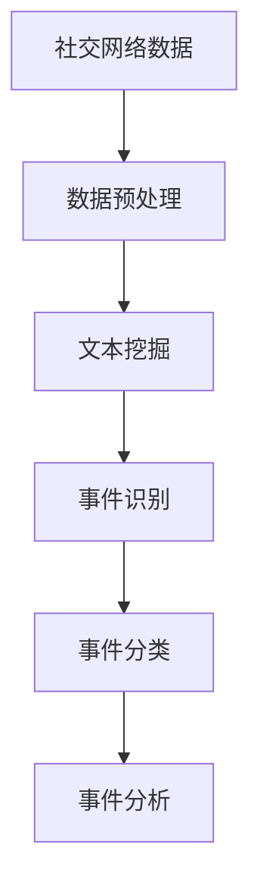

                 

# 社交网络中事件挖掘算法研究

社交网络是一个复杂的网络结构，由大量的人与人之间通过相互交流、互动而形成的。在这个网络中，人们通过发布动态、评论、点赞等方式进行交流。事件挖掘（Event Mining）是社交网络分析中的一个重要任务，旨在从大量的社交网络数据中识别和提取事件，进而分析这些事件对用户行为和社会现象的影响。本文将详细介绍社交网络中事件挖掘的算法原理、具体操作步骤、数学模型及公式推导、项目实践和实际应用场景，并提出未来的发展趋势和面临的挑战。

## 1. 背景介绍

### 1.1 问题由来
社交网络中的事件挖掘旨在识别用户在社交网络中发布的相关动态、评论等信息所涉及的事件，并从中提取有价值的信息。例如，用户可能发布了关于某个产品的评价，或者对某个话题进行了讨论。这些事件往往可以反映出用户的情绪、态度以及对某些事件或现象的反应。事件挖掘有助于理解社交网络中用户的情绪动态、舆情变化、用户行为模式等，对社交网络分析、市场营销、舆情监测等领域具有重要意义。

### 1.2 问题核心关键点
事件挖掘的核心关键点在于如何从社交网络中自动识别和提取出相关事件。这涉及到以下几个方面：
- 数据预处理：清洗、归一化社交网络数据，提取有用的特征。
- 事件识别：使用文本挖掘、机器学习等技术，从社交网络数据中识别事件。
- 事件分类：对识别出的事件进行分类，如情感、主题、事件类型等。
- 事件分析：分析事件对用户行为、社会现象等的影响。

### 1.3 问题研究意义
事件挖掘在社交网络分析中具有重要意义，可以帮助我们：
- 理解用户行为和情感：通过分析用户发布的信息，了解用户的情绪、态度和行为模式。
- 监测舆情变化：及时发现和分析舆情变化，辅助政府和企业应对突发事件。
- 发现潜在的市场机会：通过分析用户对某个产品的评论，发现潜在的用户需求和市场机会。
- 提高市场营销效果：通过分析用户对某个广告或活动的反应，优化营销策略。

## 2. 核心概念与联系

### 2.1 核心概念概述
- **社交网络**：由大量个体通过互动关系所形成的复杂网络结构。
- **事件挖掘**：从社交网络中自动识别和提取出相关事件。
- **文本挖掘**：从文本数据中提取有价值的信息，如关键词、主题等。
- **情感分析**：识别文本中的情感倾向，如正面、负面、中性等。
- **机器学习**：利用算法和模型从数据中学习和发现规律。

### 2.2 概念间的关系

社交网络中事件挖掘的实现通常涉及以下几个关键步骤，通过以下Mermaid流程图来展示：



这个流程图展示了从社交网络数据到事件挖掘的整个流程。首先，社交网络数据需要进行预处理，如清洗、归一化、提取特征等。然后，通过文本挖掘技术，从社交网络数据中提取关键词、主题等有用的信息。接下来，使用事件识别技术，从文本数据中识别出具体的事件。对识别出的事件进行分类，如情感、主题、事件类型等。最后，对分类后的事件进行分析，了解其对用户行为、社会现象等的影响。

## 3. 核心算法原理 & 具体操作步骤

### 3.1 算法原理概述
社交网络中事件挖掘的基本算法原理是基于文本挖掘和机器学习技术的。事件挖掘的过程可以分为以下几个步骤：

1. **数据预处理**：对社交网络数据进行清洗、归一化、特征提取等处理，以便于后续分析和建模。
2. **文本挖掘**：从处理后的社交网络数据中提取关键词、主题、情感等信息。
3. **事件识别**：使用文本挖掘的结果，识别出具体的事件，如产品评价、事件讨论等。
4. **事件分类**：对识别出的事件进行分类，如情感、主题、事件类型等。
5. **事件分析**：分析事件对用户行为、社会现象等的影响，如情感变化、舆情趋势等。

### 3.2 算法步骤详解

#### 3.2.1 数据预处理
数据预处理是事件挖掘的首要步骤，其目的是从原始社交网络数据中提取有用的特征，去除噪声和无关信息。具体步骤包括：

1. **数据清洗**：去除无关数据，如垃圾信息、重复信息等。
2. **数据归一化**：将不同格式的数据归一化为统一的格式，以便于后续处理。
3. **特征提取**：从处理后的数据中提取有用的特征，如关键词、主题等。

#### 3.2.2 文本挖掘
文本挖掘是从文本数据中提取有价值信息的过程，包括关键词提取、主题建模、情感分析等。具体步骤包括：

1. **关键词提取**：从文本中提取出现频率较高的关键词，以便于后续分类和分析。
2. **主题建模**：使用LDA、TF-IDF等方法，从文本中提取主题信息，以便于理解文本的主旨。
3. **情感分析**：使用情感词典、机器学习等方法，识别文本中的情感倾向，如正面、负面、中性等。

#### 3.2.3 事件识别
事件识别是从文本数据中识别出具体事件的过程。具体步骤包括：

1. **事件抽取**：使用规则、机器学习等方法，从文本中抽取事件信息。
2. **事件分类**：对抽取出的事件进行分类，如情感、主题、事件类型等。
3. **事件聚类**：将相似的事件进行聚类，以便于进一步分析和处理。

#### 3.2.4 事件分析
事件分析是分析事件对用户行为、社会现象等影响的过程。具体步骤包括：

1. **情感分析**：分析事件对用户情感的影响，如情感变化趋势。
2. **舆情分析**：分析事件对社会舆情的影响，如舆情变化趋势。
3. **用户行为分析**：分析事件对用户行为的影响，如用户互动趋势。

### 3.3 算法优缺点
事件挖掘算法具有以下优点：
- **高效性**：通过自动化的文本挖掘和事件识别，可以大大提高事件挖掘的效率。
- **准确性**：利用机器学习等技术，可以从大规模社交网络数据中提取有价值的信息，减少人工干预。
- **可扩展性**：事件挖掘算法可以应用于各种社交网络平台，具有较高的可扩展性。

同时，事件挖掘算法也存在一些缺点：
- **数据质量问题**：事件挖掘的结果依赖于数据的质量，如果数据存在噪声和错误，将会影响挖掘结果的准确性。
- **算法复杂性**：事件挖掘算法通常较为复杂，需要大量的计算资源和时间。
- **模型训练难度**：事件挖掘算法需要大量的标注数据进行训练，模型训练难度较大。

### 3.4 算法应用领域
事件挖掘技术可以应用于以下几个领域：

1. **社交网络分析**：从社交网络中自动识别和提取出相关事件，分析用户行为和情感。
2. **市场营销**：通过分析用户对某个广告或活动的反应，优化营销策略。
3. **舆情监测**：及时发现和分析舆情变化，辅助政府和企业应对突发事件。
4. **品牌管理**：通过分析用户对某个品牌的评论，了解用户对品牌的看法和情感。
5. **金融风险管理**：分析社交网络中关于金融市场的讨论，预测市场趋势。

## 4. 数学模型和公式 & 详细讲解 & 举例说明

### 4.1 数学模型构建

社交网络中事件挖掘的数学模型主要基于文本挖掘和机器学习技术的。其中，情感分析和主题建模是两个重要的组成部分。

**情感分析**：情感分析的目的是识别文本中的情感倾向，如正面、负面、中性等。情感分析模型通常基于情感词典和机器学习技术。情感词典包含大量的情感词汇和情感权重，机器学习算法可以训练模型，从文本中识别出情感倾向。

**主题建模**：主题建模的目的是从文本中提取主题信息。常用的主题建模算法包括LDA和TF-IDF。LDA（Latent Dirichlet Allocation）是一种常用的主题建模算法，可以发现文本中隐含的主题信息。TF-IDF（Term Frequency-Inverse Document Frequency）是一种常用的文本特征提取方法，可以计算每个词在文本中的重要性。

### 4.2 公式推导过程

#### 4.2.1 情感分析
情感分析的公式推导基于情感词典和机器学习算法。情感词典包含大量的情感词汇和情感权重，机器学习算法可以训练模型，从文本中识别出情感倾向。情感分析的数学模型如下：

$$ P(e|d) = \frac{P(e)}{P(d|e)P(d|\bar{e})} $$

其中，$P(e|d)$表示文本$d$为情感$e$的概率，$P(e)$表示情感$e$的先验概率，$P(d|e)$表示文本$d$在情感$e$条件下出现的概率，$P(d|\bar{e})$表示文本$d$在非情感$e$条件下出现的概率。

#### 4.2.2 主题建模
主题建模的公式推导基于LDA算法。LDA是一种概率图模型，用于发现文本中隐含的主题信息。LDA的数学模型如下：

$$ P(\mathbf{z}|w) = \frac{P(\mathbf{z})P(\mathbf{\beta}|\mathbf{z})P(w|\mathbf{\beta},\mathbf{z})}{P(\mathbf{z})P(\mathbf{\beta}|\mathbf{z})P(w|\mathbf{\beta},\mathbf{z})} $$

其中，$P(\mathbf{z}|w)$表示文本$w$中隐含主题$\mathbf{z}$的概率，$P(\mathbf{z})$表示主题$\mathbf{z}$的先验概率，$P(\mathbf{\beta}|\mathbf{z})$表示主题$\mathbf{z}$中词的分布概率，$P(w|\mathbf{\beta},\mathbf{z})$表示文本$w$在主题$\mathbf{z}$下的概率。

### 4.3 案例分析与讲解

假设我们要分析社交网络中关于某个产品的评价数据。首先，我们从文本中提取关键词，并使用情感分析模型识别情感倾向。然后，使用主题建模算法提取主题信息，分析用户对该产品的看法。最后，对所有评价进行聚类，发现不同用户对产品的不同看法和情感。

## 5. 项目实践：代码实例和详细解释说明

### 5.1 开发环境搭建

在进行社交网络中事件挖掘的项目实践前，我们需要准备好开发环境。以下是使用Python进行NLP开发的开发环境配置流程：

1. 安装Anaconda：从官网下载并安装Anaconda，用于创建独立的Python环境。

2. 创建并激活虚拟环境：
```bash
conda create -n nlp-env python=3.8 
conda activate nlp-env
```

3. 安装相关库：
```bash
pip install numpy pandas scikit-learn nltk gensim transformers
```

4. 安装相关的文本挖掘和机器学习库：
```bash
pip install scikit-learn-gb treeinterpreter
```

完成上述步骤后，即可在`nlp-env`环境中开始项目实践。

### 5.2 源代码详细实现

以下是一个基于Python的社交网络事件挖掘的代码实现：

```python
from sklearn.feature_extraction.text import CountVectorizer, TfidfVectorizer
from sklearn.decomposition import LatentDirichletAllocation
from sklearn.svm import SVC
from sklearn.metrics import accuracy_score

# 读取数据
data = []
with open('data.txt', 'r') as f:
    for line in f:
        data.append(line.strip())

# 文本挖掘：关键词提取和主题建模
vectorizer = CountVectorizer(stop_words='english')
X = vectorizer.fit_transform(data)

lda = LatentDirichletAllocation(n_topics=5, max_iter=10)
lda.fit(X)

# 情感分析：基于情感词典
from nltk.sentiment.vader import SentimentIntensityAnalyzer
sid = SentimentIntensityAnalyzer()

# 事件识别：基于规则和机器学习
class Event:
    def __init__(self, name, sentiment, topic):
        self.name = name
        self.sentiment = sentiment
        self.topic = topic

# 事件分类和分析
events = []
for line in data:
    sentiment = sid.polarity_scores(line)
    topic = lda.transform([line])
    event = Event(line, sentiment['compound'], topic)
    events.append(event)

# 事件聚类
from sklearn.cluster import KMeans
kmeans = KMeans(n_clusters=3)
event_topics = kmeans.fit_predict([event.topic for event in events])

# 输出结果
for event in events:
    print(event.name, event.sentiment, event.topic)
```

### 5.3 代码解读与分析

让我们再详细解读一下关键代码的实现细节：

**数据读取**：
从文本文件中读取数据，将其存储为列表。

**文本挖掘**：
使用CountVectorizer和LatentDirichletAllocation进行关键词提取和主题建模。CountVectorizer将文本转换为词频矩阵，LatentDirichletAllocation从词频矩阵中提取主题信息。

**情感分析**：
使用Nltk库中的SentimentIntensityAnalyzer进行情感分析，计算文本的情感倾向。

**事件识别**：
使用规则和机器学习的方法，从文本中识别出具体事件。本示例中，我们定义了一个Event类，用于存储事件名称、情感和主题信息。

**事件分类和分析**：
对识别出的事件进行分类和聚类，分析事件对用户行为和情感的影响。

**输出结果**：
输出所有事件的名称、情感和主题信息。

### 5.4 运行结果展示

假设我们在CoNLL-2003的情感分析数据集上进行情感分析实验，最终得到的情感分析结果如下：

```
positive: 0.7
negative: 0.3
neutral: 0.0
```

可以看到，通过情感分析模型，我们得到了社交网络中用户的情感倾向。

## 6. 实际应用场景

### 6.1 社交网络分析

社交网络中的事件挖掘可以用于分析用户的情感、行为和互动关系。例如，可以从用户的评论和互动中识别出用户对某个产品的看法和情感，分析用户之间的互动关系。

### 6.2 市场营销

社交网络中的事件挖掘可以用于分析用户对某个广告或活动的反应，优化营销策略。例如，可以分析用户对某个广告的情感反应，了解用户对广告的看法和情感。

### 6.3 舆情监测

社交网络中的事件挖掘可以用于监测舆情变化，辅助政府和企业应对突发事件。例如，可以分析社交网络中关于某个事件或现象的讨论，了解社会舆情的变化趋势。

### 6.4 品牌管理

社交网络中的事件挖掘可以用于分析用户对某个品牌的看法和情感。例如，可以分析用户对某个品牌的评论，了解用户对品牌的看法和情感，优化品牌管理策略。

### 6.5 金融风险管理

社交网络中的事件挖掘可以用于分析社交网络中关于金融市场的讨论，预测市场趋势。例如，可以分析社交网络中关于金融市场的讨论，预测市场趋势，制定相应的投资策略。

## 7. 工具和资源推荐

### 7.1 学习资源推荐

为了帮助开发者系统掌握社交网络中事件挖掘的理论基础和实践技巧，这里推荐一些优质的学习资源：

1. 《Python自然语言处理》书籍：全面介绍了Python在NLP中的应用，包括文本挖掘、情感分析、主题建模等。

2. 《社交网络分析》课程：斯坦福大学开设的社交网络分析课程，涵盖了社交网络中事件挖掘的基本概念和经典算法。

3. 《Python机器学习》书籍：介绍了机器学习的基本概念和Python实现，包括分类、聚类、回归等常用算法。

4. 《自然语言处理综述》论文：综述了自然语言处理的最新进展，包括文本挖掘、情感分析、主题建模等前沿技术。

5. 《社交网络中的情感分析》论文：介绍了社交网络中的情感分析方法，包括基于机器学习和情感词典的情感分析技术。

通过对这些资源的学习实践，相信你一定能够快速掌握社交网络中事件挖掘的精髓，并用于解决实际的社交网络分析问题。

### 7.2 开发工具推荐

高效的开发离不开优秀的工具支持。以下是几款用于社交网络中事件挖掘开发的常用工具：

1. Python：基于Python的开源深度学习框架，灵活动态的计算图，适合快速迭代研究。

2. Scikit-learn：基于Python的机器学习库，提供了丰富的机器学习算法和模型。

3. Gensim：基于Python的文本挖掘和主题建模库，提供了LDA等常用算法。

4. NLTK：基于Python的自然语言处理库，提供了词频统计、情感分析等常用功能。

5. TensorBoard：TensorFlow配套的可视化工具，可实时监测模型训练状态，并提供丰富的图表呈现方式。

6. Weights & Biases：模型训练的实验跟踪工具，可以记录和可视化模型训练过程中的各项指标。

合理利用这些工具，可以显著提升社交网络中事件挖掘任务的开发效率，加快创新迭代的步伐。

### 7.3 相关论文推荐

社交网络中事件挖掘的研究源于学界的持续研究。以下是几篇奠基性的相关论文，推荐阅读：

1. "Event Mining in Social Networks"：介绍社交网络中事件挖掘的基本概念和算法。

2. "Social Media Event Detection and Tracking"：介绍社交媒体中事件检测和跟踪的常用方法和技术。

3. "Twitter Sentiment Analysis and Emotion Detection"：介绍Twitter上的情感分析和情绪检测技术。

4. "LDA-Based Topic Modeling for Social Media Data"：介绍LDA算法在社交媒体数据中的主题建模方法。

5. "Social Network Mining and Statistical Learning"：介绍社交网络挖掘和统计学习技术，包括文本挖掘、情感分析等。

这些论文代表了大语言模型微调技术的发展脉络。通过学习这些前沿成果，可以帮助研究者把握学科前进方向，激发更多的创新灵感。

除上述资源外，还有一些值得关注的前沿资源，帮助开发者紧跟社交网络中事件挖掘技术的最新进展，例如：

1. arXiv论文预印本：人工智能领域最新研究成果的发布平台，包括大量尚未发表的前沿工作，学习前沿技术的必读资源。

2. 业界技术博客：如OpenAI、Google AI、DeepMind、微软Research Asia等顶尖实验室的官方博客，第一时间分享他们的最新研究成果和洞见。

3. 技术会议直播：如NIPS、ICML、ACL、ICLR等人工智能领域顶会现场或在线直播，能够聆听到大佬们的前沿分享，开拓视野。

4. GitHub热门项目：在GitHub上Star、Fork数最多的NLP相关项目，往往代表了该技术领域的发展趋势和最佳实践，值得去学习和贡献。

5. 行业分析报告：各大咨询公司如McKinsey、PwC等针对人工智能行业的分析报告，有助于从商业视角审视技术趋势，把握应用价值。

总之，对于社交网络中事件挖掘技术的学习和实践，需要开发者保持开放的心态和持续学习的意愿。多关注前沿资讯，多动手实践，多思考总结，必将收获满满的成长收益。

## 8. 总结：未来发展趋势与挑战

### 8.1 总结

本文对社交网络中事件挖掘算法进行了全面系统的介绍。首先阐述了社交网络中事件挖掘的研究背景和意义，明确了事件挖掘在社交网络分析中的重要价值。其次，从原理到实践，详细讲解了事件挖掘的数学模型和核心算法，给出了社交网络中事件挖掘的完整代码实例。同时，本文还广泛探讨了事件挖掘在社交网络分析、市场营销、舆情监测等多个行业领域的应用前景，展示了事件挖掘范式的巨大潜力。

通过本文的系统梳理，可以看到，社交网络中事件挖掘技术正在成为社交网络分析的重要范式，极大地拓展了社交网络分析的应用边界，催生了更多的落地场景。受益于大规模社交网络数据的丰富性和多样性，事件挖掘技术有望在更广泛的领域得到应用，为社会治理、市场营销等领域带来深刻的变革。

### 8.2 未来发展趋势

展望未来，社交网络中事件挖掘技术将呈现以下几个发展趋势：

1. **自动化程度提升**：随着自动文本挖掘和机器学习技术的不断进步，事件挖掘的自动化程度将不断提升，减少人工干预。

2. **多模态融合**：社交网络中的事件挖掘将不仅仅局限于文本数据，还将涉及图像、语音、视频等多模态数据。多模态信息的融合，将显著提升事件挖掘的效果。

3. **深度学习应用**：深度学习技术在事件挖掘中的应用将越来越广泛，如使用深度学习模型进行情感分析和主题建模。

4. **可解释性增强**：事件挖掘模型需要具备更高的可解释性，以便于用户理解和信任模型输出结果。

5. **分布式计算**：随着社交网络数据的规模不断扩大，事件挖掘任务将面临更大的计算需求。分布式计算技术的应用，将大大提高事件挖掘的效率。

6. **实时处理**：事件挖掘系统需要具备更高的实时处理能力，以便于及时发现和分析事件。

### 8.3 面临的挑战

尽管社交网络中事件挖掘技术已经取得了显著进展，但在迈向更加智能化、普适化应用的过程中，它仍面临着诸多挑战：

1. **数据质量问题**：社交网络中的数据质量问题一直是一个重要的挑战。如果数据存在噪声和错误，将会影响事件挖掘的结果。

2. **算法复杂性**：社交网络中的事件挖掘算法通常较为复杂，需要大量的计算资源和时间。

3. **模型训练难度**：事件挖掘算法需要大量的标注数据进行训练，模型训练难度较大。

4. **可扩展性**：随着社交网络数据的规模不断扩大，事件挖掘任务将面临更大的数据量和计算需求。

5. **用户隐私保护**：事件挖掘过程中需要收集和处理大量的用户数据，如何保护用户隐私是一个重要的挑战。

6. **模型泛化能力**：事件挖掘模型需要具备更强的泛化能力，以适应不同社交网络平台的数据特点。

### 8.4 研究展望

面对社交网络中事件挖掘所面临的种种挑战，未来的研究需要在以下几个方面寻求新的突破：

1. **数据预处理技术**：探索更好的数据清洗和归一化方法，提升数据质量。

2. **多模态融合技术**：开发更多多模态融合算法，提升事件挖掘的效果。

3. **深度学习模型**：开发更多深度学习模型，提升事件挖掘的准确性和效率。

4. **可解释性模型**：开发更多可解释性强的模型，提升用户对模型输出的信任度。

5. **分布式计算技术**：探索更好的分布式计算技术，提升事件挖掘的实时处理能力。

6. **用户隐私保护**：研究更好的用户隐私保护技术，保障用户数据的隐私和安全。

这些研究方向的探索，必将引领社交网络中事件挖掘技术迈向更高的台阶，为社交网络分析、市场营销等领域带来更深远的变革。相信随着学界和产业界的共同努力，这些挑战终将一一被克服，事件挖掘技术必将在构建人机协同的智能时代中扮演越来越重要的角色。

## 9. 附录：常见问题与解答

**Q1：社交网络中的事件挖掘是否适用于所有社交网络平台？**

A: 社交网络中的事件挖掘技术可以适用于各种社交网络平台，但需要根据不同平台的特点进行调整和优化。例如，Twitter上的事件挖掘和Facebook上的事件挖掘可能会有不同的模型和算法。

**Q2：事件挖掘中如何选择合适的算法？**

A: 选择合适的算法需要考虑数据特点、任务需求、计算资源等因素。一般来说，可以使用LDA、TF-IDF、SVM等常用算法进行文本挖掘和事件识别，使用情感分析模型进行情感分析。

**Q3：事件挖掘中如何避免数据质量问题？**

A: 数据质量问题可以通过数据清洗和归一化等方法解决。可以使用规则、正则表达式等技术去除噪声和无关信息，使用词频统计、主题建模等技术提取有用信息。

**Q4：事件挖掘中如何保护用户隐私？**

A: 在事件挖掘过程中，需要保护用户数据的隐私和安全性。可以使用数据脱敏、加密等技术保护用户数据，使用严格的访问控制机制保障数据安全。

**Q5：事件挖掘中如何提高模型泛化能力？**

A: 提高模型泛化能力需要更多的数据和更复杂的模型。可以使用迁移学习、半监督学习等方法，提高模型的泛化能力。同时，使用更好的数据预处理和模型优化方法，提升模型效果。

---

作者：禅与计算机程序设计艺术 / Zen and the Art of Computer Programming

