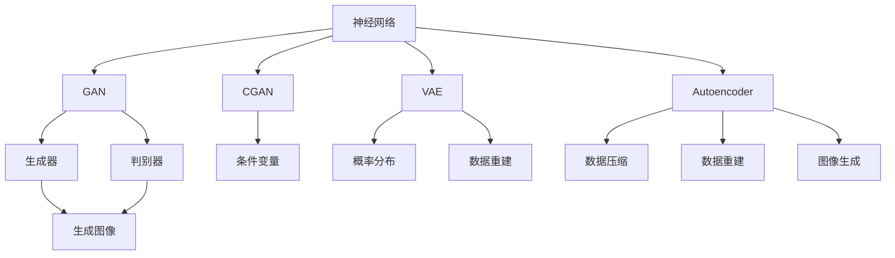

                 

## 1. 背景介绍

### 1.1 问题由来
神经网络自问世以来，在图像生成领域取得了显著的进展。最初，神经网络主要应用于图像分类和检测任务。但随着生成对抗网络（GAN）的提出，神经网络开始尝试生成全新的图像，开启了图像生成的新纪元。

### 1.2 问题核心关键点
当前，神经网络在图像生成领域的主要挑战包括：如何生成高质量、多样化的图像，如何有效控制生成过程，如何提升生成速度等。这些问题需要通过优化生成网络、控制噪声、引入指导信息等方式来解决。

### 1.3 问题研究意义
研究神经网络在图像生成中的应用，对于提升图像生成质量、推动图像生成技术的产业化进程、拓展神经网络的应用边界具有重要意义。此外，图像生成技术还可以用于娱乐、艺术创作、广告设计等多个领域，为社会生活带来丰富和新颖的视觉体验。

## 2. 核心概念与联系

### 2.1 核心概念概述

为了更好地理解神经网络在图像生成中的应用，本节将介绍几个核心概念：

- 神经网络（Neural Network, NN）：一种由多层神经元组成的计算模型，用于处理复杂的数据和任务。神经网络通过反向传播算法进行训练，优化模型的参数，使得模型能够学习到数据的规律和特征。

- 生成对抗网络（Generative Adversarial Network, GAN）：一种特殊的神经网络，由生成器和判别器两部分组成。生成器尝试生成逼真的假图像，而判别器则试图区分真实图像和生成图像。通过对抗训练，生成器和判别器不断优化，最终生成高质量的图像。

- 条件生成对抗网络（Conditional GAN, CGAN）：在GAN的基础上，引入条件变量，如文本描述、类别标签等，指导生成器生成符合条件的图像。条件变量可以提供更多生成信息，使生成过程更加可控。

- 变分自编码器（Variational Autoencoder, VAE）：一种生成模型，通过学习数据的概率分布，进行数据重建和生成。VAE能够生成具有一定分布特性的图像，但生成的图像质量相对较低。

- 自编码器（Autoencoder）：一种无监督学习模型，通过学习输入数据的压缩和重建，实现数据的降维和生成。自编码器可以用于生成具有一定规律的图像，但生成过程相对简单，难以控制。

- 变分生成对抗网络（Variational Generative Adversarial Network, VGAN）：结合了GAN和VAE的优点，生成器使用变分推理进行参数优化，提升生成图像的质量和多样性。

### 2.2 概念间的关系

这些核心概念之间的逻辑关系可以通过以下Mermaid流程图来展示：



这个流程图展示了大语言模型的核心概念及其之间的关系：

1. 神经网络通过反向传播算法进行训练，优化模型的参数，使其能够学习到数据的规律和特征。
2. GAN由生成器和判别器两部分组成，通过对抗训练，生成高质量的图像。
3. CGAN在GAN的基础上，引入条件变量，指导生成器生成符合条件的图像。
4. VAE通过学习数据的概率分布，实现数据的重建和生成。
5. Autoencoder通过学习输入数据的压缩和重建，实现数据的降维和生成。
6. VGAN结合了GAN和VAE的优点，生成器使用变分推理进行参数优化，提升生成图像的质量和多样性。

这些概念共同构成了神经网络在图像生成中的应用框架，使其能够在各种场景下发挥强大的生成能力。通过理解这些核心概念，我们可以更好地把握神经网络在图像生成中的工作原理和优化方向。

## 3. 核心算法原理 & 具体操作步骤

### 3.1 算法原理概述

神经网络在图像生成中的应用，主要基于生成对抗网络（GAN）和变分生成对抗网络（VGAN）的框架。其核心思想是：通过训练一个生成器和判别器，使生成器能够生成逼真的假图像，而判别器能够区分真实图像和生成图像。

形式化地，设生成器为 $G$，判别器为 $D$，目标函数为 $\mathcal{L}$，训练过程的优化目标是：

$$
\min_G \max_D \mathcal{L}(G, D)
$$

其中 $\mathcal{L}(G, D)$ 为生成器和判别器的联合损失函数。对于GAN，常见的损失函数包括均方误差损失、交叉熵损失等。

### 3.2 算法步骤详解

神经网络在图像生成中的应用一般包括以下几个关键步骤：

**Step 1: 准备训练数据集**
- 收集和整理用于图像生成的数据集，确保数据的质量和多样性。
- 将数据集划分为训练集、验证集和测试集，并使用数据增强技术扩充训练数据。

**Step 2: 设计生成器和判别器**
- 设计生成器 $G$ 的神经网络结构，通常使用卷积神经网络（CNN）进行图像生成。
- 设计判别器 $D$ 的神经网络结构，也使用CNN进行图像判别。

**Step 3: 设置优化器和超参数**
- 选择合适的优化算法，如Adam、SGD等，并设置学习率、批大小等超参数。
- 设置对抗训练的轮数，以及生成器和判别器的迭代次数。

**Step 4: 执行对抗训练**
- 在每个轮次中，生成器 $G$ 尝试生成假图像 $x_g$，判别器 $D$ 尝试判断图像的真假。
- 生成器根据判别器的反馈，优化生成的假图像。
- 判别器根据生成的假图像，优化判别能力。

**Step 5: 评估和调整**
- 在验证集上评估生成器 $G$ 和判别器 $D$ 的性能，调整模型参数和超参数。
- 重复上述步骤，直至模型收敛。

**Step 6: 生成新图像**
- 使用训练好的生成器 $G$ 生成新的图像，可以用于娱乐、艺术创作、广告设计等场景。

### 3.3 算法优缺点

神经网络在图像生成中的应用，具有以下优点：
1. 生成逼真的图像。通过对抗训练，生成器能够生成高质量的假图像，难以区分真伪。
2. 灵活性高。可以根据不同的任务需求，设计和调整生成器的结构，生成多样化、个性化的图像。
3. 可控性较强。通过引入条件变量，如文本描述、类别标签等，可以控制生成过程，生成符合条件的图像。
4. 应用广泛。图像生成技术可以应用于娱乐、艺术创作、广告设计等多个领域，为社会生活带来丰富和新颖的视觉体验。

同时，该方法也存在一定的局限性：
1. 生成过程不稳定。对抗训练过程中，生成器容易陷入不稳定状态，导致生成图像质量波动。
2. 数据需求较高。训练GAN需要大量的高质量数据，获取和标注数据的成本较高。
3. 可解释性不足。GAN生成的图像过程复杂，难以解释生成过程和生成图像的特征。
4. 计算资源消耗大。GAN的训练和生成过程需要大量的计算资源，训练时间较长。

尽管存在这些局限性，但神经网络在图像生成中的应用依然具有广阔的发展前景，正在成为图像生成领域的重要技术手段。

### 3.4 算法应用领域

神经网络在图像生成中的应用，已经在娱乐、艺术创作、广告设计等多个领域得到了广泛应用，以下是几个典型的应用场景：

**娱乐和艺术创作**
- 使用GAN生成逼真的虚拟场景和角色，用于游戏和虚拟现实应用。
- 生成逼真的艺术作品，如绘画、雕塑等，提升艺术创作的效率和创意。

**广告设计**
- 使用GAN生成逼真的产品广告图像，提升广告的吸引力和效果。
- 生成多版本的广告图像，进行A/B测试，选择最优方案。

**个性化推荐**
- 使用GAN生成个性化的商品图像，提升用户的购物体验和满意度。
- 生成个性化推荐结果，匹配用户的喜好和需求。

除了上述这些应用场景外，神经网络在图像生成中的应用还在不断拓展，未来将有更多创新和突破。

## 4. 数学模型和公式 & 详细讲解  
### 4.1 数学模型构建

本节将使用数学语言对神经网络在图像生成中的应用进行更加严格的刻画。

记生成器为 $G$，判别器为 $D$，输入为 $z$，目标函数为 $\mathcal{L}$。假设输入 $z$ 为高斯分布 $z \sim \mathcal{N}(0, 1)$。生成器的输出为图像 $x$，判别器的输出为判别概率 $y$。则GAN的目标函数可以表示为：

$$
\mathcal{L}(G, D) = \mathbb{E}_{z}[\log D(G(z))] + \mathbb{E}_{x}[\log (1 - D(x))]
$$

其中 $\mathbb{E}_{z}$ 和 $\mathbb{E}_{x}$ 分别表示对生成器和判别器输出的期望。

对于变分生成对抗网络（VGAN），生成器的输出为随机变量 $z$ 和网络参数 $\theta$ 的联合分布 $p_{G}(z|\theta)$，判别器的输出为判别概率 $y$。则VGAN的目标函数可以表示为：

$$
\mathcal{L}(G, D) = \mathbb{E}_{z}[\log D(G(z))] + \mathbb{E}_{x}[\log (1 - D(x))] + \mathbb{E}_{z}[\log p_{G}(z)]
$$

其中 $p_{G}(z)$ 表示生成器输出的随机变量 $z$ 的分布。

### 4.2 公式推导过程

以下我们以GAN为例，推导生成器和判别器的联合损失函数及其梯度的计算公式。

设生成器 $G$ 的输入为噪声 $z \sim \mathcal{N}(0, 1)$，输出为图像 $x$。判别器 $D$ 的输入为图像 $x$，输出为判别概率 $y \in [0, 1]$。则生成器 $G$ 和判别器 $D$ 的联合损失函数为：

$$
\mathcal{L}(G, D) = \mathbb{E}_{z}[\log D(G(z))] + \mathbb{E}_{x}[\log (1 - D(x))]
$$

根据链式法则，生成器 $G$ 和判别器 $D$ 的损失函数对各自参数的梯度为：

$$
\frac{\partial \mathcal{L}}{\partial \theta_G} = \frac{\partial}{\partial \theta_G} \mathbb{E}_{z}[\log D(G(z))] + \frac{\partial}{\partial \theta_G} \mathbb{E}_{x}[\log (1 - D(x))]
$$

$$
\frac{\partial \mathcal{L}}{\partial \theta_D} = \frac{\partial}{\partial \theta_D} \mathbb{E}_{z}[\log D(G(z))] + \frac{\partial}{\partial \theta_D} \mathbb{E}_{x}[\log (1 - D(x))]
$$

其中 $\theta_G$ 和 $\theta_D$ 分别为生成器 $G$ 和判别器 $D$ 的参数。

在得到损失函数的梯度后，即可带入优化器进行模型训练。使用梯度下降等优化算法，迭代更新生成器和判别器的参数，直至模型收敛。

### 4.3 案例分析与讲解

以GAN生成手写数字为例，分析模型的训练过程和效果。

首先，收集手写数字数据集MNIST，将数据集划分为训练集、验证集和测试集。然后，设计生成器 $G$ 和判别器 $D$ 的神经网络结构，通常使用卷积神经网络（CNN）进行图像生成。生成器 $G$ 将噪声 $z \sim \mathcal{N}(0, 1)$ 作为输入，生成手写数字图像 $x$。判别器 $D$ 将图像 $x$ 作为输入，输出判别概率 $y$。

接着，设置优化器和超参数，选择合适的优化算法，如Adam、SGD等，并设置学习率、批大小等超参数。训练过程中，生成器 $G$ 试图生成逼真的手写数字图像，而判别器 $D$ 试图区分生成图像和真实图像。

在每个轮次中，生成器 $G$ 和判别器 $D$ 进行对抗训练，生成器 $G$ 根据判别器的反馈，优化生成的手写数字图像。判别器 $D$ 根据生成的手写数字图像，优化判别能力。重复上述步骤，直至模型收敛。

最后，在测试集上评估生成器 $G$ 的性能，输出生成的手写数字图像，可以用于娱乐、艺术创作、广告设计等场景。

## 5. 项目实践：代码实例和详细解释说明
### 5.1 开发环境搭建

在进行图像生成实践前，我们需要准备好开发环境。以下是使用Python进行TensorFlow开发的环境配置流程：

1. 安装Anaconda：从官网下载并安装Anaconda，用于创建独立的Python环境。

2. 创建并激活虚拟环境：
```bash
conda create -n tensorflow-env python=3.8 
conda activate tensorflow-env
```

3. 安装TensorFlow：根据CUDA版本，从官网获取对应的安装命令。例如：
```bash
conda install tensorflow tensorflow-gpu=cuda11.1 -c pytorch -c conda-forge
```

4. 安装相关工具包：
```bash
pip install numpy matplotlib scikit-learn
```

5. 安装TensorBoard：用于可视化模型训练过程和评估结果。
```bash
pip install tensorboard
```

完成上述步骤后，即可在`tensorflow-env`环境中开始图像生成实践。

### 5.2 源代码详细实现

这里我们以GAN生成手写数字为例，给出使用TensorFlow实现的手写数字生成代码。

首先，定义手写数字生成器和判别器的神经网络结构：

```python
import tensorflow as tf
from tensorflow.keras.layers import Dense, Reshape, Flatten, Dropout
from tensorflow.keras.layers import Conv2DTranspose, Conv2D, LeakyReLU, BatchNormalization

class Generator(tf.keras.Model):
    def __init__(self, latent_dim=100, img_shape=(28, 28, 1)):
        super(Generator, self).__init__()
        self.img_shape = img_shape
        self.latent_dim = latent_dim
        self.dense1 = Dense(256)
        self.dense2 = Dense(512)
        self.dense3 = Dense(np.prod(img_shape))
        self.reshape = Reshape(img_shape)
        
    def call(self, inputs):
        x = tf.reshape(inputs, (-1, self.latent_dim))
        x = LeakyReLU(alpha=0.2)(self.dense1(x))
        x = BatchNormalization()(x)
        x = LeakyReLU(alpha=0.2)(self.dense2(x))
        x = BatchNormalization()(x)
        x = LeakyReLU(alpha=0.2)(self.dense3(x))
        x = BatchNormalization()(x)
        x = tf.reshape(x, (-1, 28, 28, 1))
        return x

class Discriminator(tf.keras.Model):
    def __init__(self, img_shape=(28, 28, 1)):
        super(Discriminator, self).__init__()
        self.img_shape = img_shape
        self.dense1 = Dense(512)
        self.dense2 = Dense(256)
        self.dense3 = Dense(1)
        
    def call(self, inputs):
        x = Flatten()(inputs)
        x = LeakyReLU(alpha=0.2)(self.dense1(x))
        x = Dropout(0.5)(x)
        x = LeakyReLU(alpha=0.2)(self.dense2(x))
        x = Dropout(0.5)(x)
        return self.dense3(x)
```

然后，定义训练函数：

```python
@tf.function
def train_step(images):
    noise = tf.random.normal([batch_size, latent_dim])
    with tf.GradientTape() as gen_tape, tf.GradientTape() as disc_tape:
        generated_images = generator(noise, training=True)
        real_output = discriminator(images, training=True)
        fake_output = discriminator(generated_images, training=True)
        
        gen_loss = generator_loss(fake_output)
        disc_loss = discriminator_loss(real_output, fake_output)
    
    gradients_of_gen = gen_tape.gradient(gen_loss, generator.trainable_variables)
    gradients_of_disc = disc_tape.gradient(disc_loss, discriminator.trainable_variables)
    
    optimizer.apply_gradients(zip(gradients_of_gen, generator.trainable_variables))
    optimizer.apply_gradients(zip(gradients_of_disc, discriminator.trainable_variables))
```

最后，启动训练流程：

```python
epochs = 50
batch_size = 128
latent_dim = 100

# 创建生成器和判别器
generator = Generator(latent_dim)
discriminator = Discriminator()

# 创建优化器
optimizer = tf.keras.optimizers.Adam(learning_rate=0.0002)

# 定义损失函数
generator_loss = tf.keras.losses.BinaryCrossentropy(from_logits=True)
discriminator_loss = tf.keras.losses.BinaryCrossentropy(from_logits=True)

# 加载数据集
mnist = tf.keras.datasets.mnist
(train_images, train_labels), (_, _) = mnist.load_data()
train_images = train_images / 255.0
train_images = train_images.reshape(-1, 28, 28, 1)
train_images = train_images / 2.0 + 0.5

# 准备训练数据
train_dataset = tf.data.Dataset.from_tensor_slices(train_images).shuffle(buffer_size=1024).batch(batch_size)

# 训练模型
for epoch in range(epochs):
    for batch in train_dataset:
        train_step(batch)
    
    # 评估模型性能
    generated_images = generator(tf.random.normal([batch_size, latent_dim]))
    real_images = train_images[:batch_size]
    fakes = real_images.copy()
    fakes[0] = generated_images[0]
    fig = tf.keras.preprocessing.image.save_img('generated.png', fakes[0], scale=255)
    plt.imshow(fig)
    plt.show()
```

以上就是使用TensorFlow实现的手写数字生成代码。可以看到，使用TensorFlow实现GAN生成手写数字的过程相对简单，通过定义生成器和判别器的神经网络结构，设置优化器和超参数，进行对抗训练，就可以生成逼真的手写数字图像。

### 5.3 代码解读与分析

让我们再详细解读一下关键代码的实现细节：

**手写数字生成器**：
- `Generator`类定义了手写数字生成器的神经网络结构，包括输入噪声层、全连接层、激活函数和归一化层等。
- `call`方法实现了生成器的前向传播过程，将噪声 $z$ 转换为手写数字图像 $x$。

**手写数字判别器**：
- `Discriminator`类定义了手写数字判别器的神经网络结构，包括输入图像层、全连接层、激活函数和Dropout层等。
- `call`方法实现了判别器的前向传播过程，将图像 $x$ 转换为判别概率 $y$。

**训练函数**：
- `train_step`函数定义了训练过程的详细实现。在每个batch中，生成器生成手写数字图像，判别器对图像进行判别，计算生成器和判别器的损失函数，并使用优化器进行梯度更新。
- 使用`tf.GradientTape`进行梯度计算，提升代码效率。
- 使用`tf.keras.losses.BinaryCrossentropy`作为损失函数，适用于二分类问题。
- 使用`optimizer.apply_gradients`更新模型参数。

**训练流程**：
- 定义总epoch数、batch size和隐空间维度。
- 创建生成器和判别器，并设置优化器和损失函数。
- 加载MNIST数据集，并准备好训练数据。
- 循环迭代进行训练，并在每个epoch结束时展示生成的手写数字图像。

可以看到，TensorFlow提供了强大的深度学习框架，使得图像生成过程变得简单高效。通过使用TensorFlow，开发者可以快速实现各种复杂的深度学习模型，并进行大规模训练和推理。

## 6. 实际应用场景

### 6.1 娱乐和艺术创作

GAN在娱乐和艺术创作领域有着广泛的应用。通过GAN生成逼真的虚拟场景和角色，可以用于游戏和虚拟现实应用。例如，使用GAN生成逼真的虚拟场景，用于虚拟现实体验，提升用户的沉浸感和交互体验。

此外，GAN还可以用于生成艺术作品，如绘画、雕塑等，提升艺术创作的效率和创意。例如，使用GAN生成逼真的艺术作品，用于艺术展览和展示，展示艺术家的创意和技巧。

### 6.2 广告设计

GAN在广告设计领域也有着广泛的应用。通过GAN生成逼真的产品广告图像，可以提升广告的吸引力和效果。例如，使用GAN生成逼真的产品广告图像，用于电商平台的推荐广告，提升用户的点击率和转化率。

此外，GAN还可以用于生成多版本的广告图像，进行A/B测试，选择最优方案。例如，使用GAN生成多个版本的广告图像，进行A/B测试，比较不同版本的广告效果，选择效果最好的版本。

### 6.3 个性化推荐

GAN在个性化推荐领域也有着广泛的应用。通过GAN生成个性化的商品图像，可以提升用户的购物体验和满意度。例如，使用GAN生成个性化的商品图像，用于电商平台的商品推荐，提升用户的购物体验和满意度。

此外，GAN还可以用于生成个性化的推荐结果，匹配用户的喜好和需求。例如，使用GAN生成个性化的推荐结果，用于社交媒体平台的内容推荐，提升用户的粘性和互动率。

除了上述这些应用场景外，GAN在图像生成领域还在不断拓展，未来将有更多创新和突破。

## 7. 工具和资源推荐

### 7.1 学习资源推荐

为了帮助开发者系统掌握神经网络在图像生成中的应用，这里推荐一些优质的学习资源：

1. 《深度学习基础》：由深度学习领域专家撰写，深入浅出地介绍了深度学习的基本概念和经典模型。

2. 《GAN入门与实践》：详细讲解了GAN的基本原理、实现方法和应用场景，适合初学者入门。

3. 《神经网络与深度学习》：由深度学习领域权威教材，系统介绍了神经网络的基本原理和深度学习的经典算法。

4. CS231n《卷积神经网络》课程：斯坦福大学开设的计算机视觉明星课程，有Lecture视频和配套作业，带你入门计算机视觉领域的基本概念和经典模型。

5. DeepLearning.AI《深度学习专项课程》：由深度学习领域权威课程，系统介绍了深度学习的基本原理和经典算法，适合进阶学习。

6. PyTorch官方文档：PyTorch的官方文档，提供了海量深度学习模型的实现代码和示例，是上手实践的必备资料。

通过对这些资源的学习实践，相信你一定能够快速掌握神经网络在图像生成中的应用，并用于解决实际的图像生成问题。

### 7.2 开发工具推荐

高效的开发离不开优秀的工具支持。以下是几款用于神经网络图像生成开发的常用工具：

1. PyTorch：基于Python的开源深度学习框架，灵活动态的计算图，适合快速迭代研究。大部分深度学习模型都有PyTorch版本的实现。

2. TensorFlow：由Google主导开发的开源深度学习框架，生产部署方便，适合大规模工程应用。同样有丰富的深度学习模型资源。

3. Keras：基于Python的深度学习框架，易于使用，适合快速搭建原型模型。

4. Weights & Biases：模型训练的实验跟踪工具，可以记录和可视化模型训练过程中的各项指标，方便对比和调优。与主流深度学习框架无缝集成。

5. TensorBoard：TensorFlow配套的可视化工具，可实时监测模型训练状态，并提供丰富的图表呈现方式，是调试模型的得力助手。

6. Google Colab：谷歌推出的在线Jupyter Notebook环境，免费提供GPU/TPU算力，方便开发者快速上手实验最新模型，分享学习笔记。

合理利用这些工具，可以显著提升神经网络图像生成任务的开发效率，加快创新迭代的步伐。

### 7.3 相关论文推荐

神经网络在图像生成领域的发展源于学界的持续研究。以下是几篇奠基性的相关论文，推荐阅读：

1. Generative Adversarial Nets（GAN论文）：提出了生成对抗网络，使得神经网络在图像生成领域取得了重大突破。

2. Improved Techniques for Training GANs（WGAN论文）：提出了变分生成对抗网络（VGAN），进一步提升了生成图像的质量和多样性。

3. Unsupervised Learning of Image Patch Density and Adversarial Examples（VQGAN论文）：提出了一种基于向量量化生成对抗网络（VQGAN），将生成图像的质量和多样性提升到了一个新的高度。

4. Progressive Growing of GANs for Improved Quality, Stability, and Variation（PGGAN论文）：提出了一种渐进式增长的生成对抗网络（PGGAN），进一步提升了生成图像的质量和稳定性。

5. Attentive Adversarial Networks（AA-GAN论文）：提出了一种注意力机制的生成对抗网络（AA-GAN），提升了生成图像的可解释性和多样性。

这些论文代表了大语言模型微调技术的发展脉络。通过学习这些前沿成果，可以帮助研究者把握学科前进方向，激发更多的创新灵感。

除上述资源外

