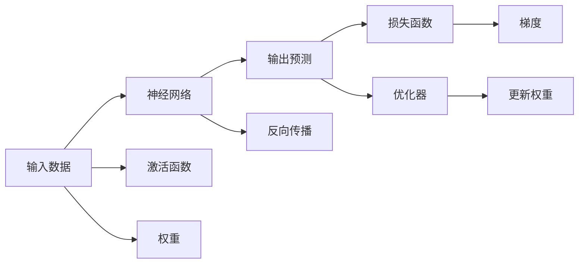
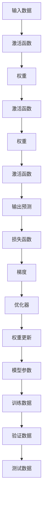

                 

## 1. 背景介绍

### 1.1 问题由来

现代科技的迅猛发展，让人们对于人工智能（AI）的预期和想象逐渐增长。神经网络作为现代AI技术的基石，不仅在图像识别、语音识别、自然语言处理等方面展现出卓越的性能，更逐渐在医疗、金融、教育、制造等多个行业崭露头角，引领着产业升级与创新。然而，神经网络在带来便利的同时，也引发了诸多争议和担忧。它们真的能为人类带来未来吗？

### 1.2 问题核心关键点

神经网络的技术演变源自人类对脑科学的研究与模仿。但随着其技术的进步和应用的深入，人们开始思考如何平衡人类的智慧与机器的智能，以实现人类与机器的和谐共存。这不仅是技术问题，更是伦理、社会、经济等多维度的问题，其核心关键点包括以下几个方面：

- 如何确保神经网络的安全性、透明性和公平性。
- 如何处理神经网络在处理个人数据时可能带来的隐私问题。
- 如何培养公众对神经网络及其应用的理解与接受。
- 如何确保人类在机器智能的辅助下，仍然能够保持独立思考和决策能力。
- 如何构建一个具有伦理导向的人工智能框架，指导未来的AI应用。

### 1.3 问题研究意义

探索神经网络的深层内涵，不仅有助于理清人工智能技术的未来发展路径，更能在实践中推动相关政策法规的制定和完善，从而为社会带来长远的福祉。

神经网络的研究对于以下方面具有重要意义：

1. **伦理与安全**：确保AI应用的公正性与安全性，避免偏见与误导。
2. **透明性与可解释性**：提升AI决策过程的透明度，增强用户信任。
3. **隐私保护**：在AI应用中保护个人隐私，防止数据滥用。
4. **经济与社会效益**：推动各行业智能化转型，提高社会整体效率。
5. **人机共生**：促进AI技术与人类的深度协作，提升人类生活质量。

## 2. 核心概念与联系

### 2.1 核心概念概述

神经网络是模仿人脑神经元的工作方式设计的计算模型，通过层层叠加的节点，处理数据以完成复杂的学习和预测任务。核心概念包括：

- **神经元（Neuron）**：神经网络的基本组成单元，接收输入、处理信息并输出结果。
- **激活函数（Activation Function）**：决定神经元是否被激活以及激活强度。
- **权重（Weight）**：连接神经元之间的参数，调整信号传递强度。
- **损失函数（Loss Function）**：衡量模型预测与实际结果的差异。
- **优化器（Optimizer）**：通过梯度下降等算法，最小化损失函数以优化模型参数。
- **反向传播（Backpropagation）**：用于计算梯度，更新权重。

### 2.2 核心概念间的关系

这些核心概念之间存在紧密的联系，共同构建了神经网络的工作机制和训练流程：

- **输入-输出映射**：神经网络将输入数据通过多个神经元层层处理，最终输出预测结果。
- **参数优化**：通过优化器调整权重，使损失函数最小化，从而提高模型预测准确性。
- **反向传播**：反向传播算法计算梯度，用于更新权重，优化模型。
- **监督学习**：神经网络通过标注数据进行监督学习，从输入到输出的映射关系。
- **非监督学习**：神经网络可以在无标签数据上进行训练，如自编码器。

这些概念之间的逻辑关系可以通过以下Mermaid流程图来展示：



这个流程图展示了从输入数据到输出预测的过程，以及各个核心概念的作用。神经网络通过权重和激活函数处理输入数据，反向传播计算梯度，优化器调整权重以最小化损失函数。

### 2.3 核心概念的整体架构

最终，神经网络通过多个层次的节点处理输入数据，最终产生预测结果。从输入到输出的过程可以用以下综合流程图表示：



这个综合流程图展示了神经网络的整体架构，从输入数据经过多层处理，输出预测结果，再到损失函数和优化器调整权重的过程。

## 3. 核心算法原理 & 具体操作步骤

### 3.1 算法原理概述

神经网络的基本工作原理是通过反向传播算法（Backpropagation），调整模型参数以最小化损失函数。其核心算法原理如下：

1. **前向传播**：将输入数据通过神经网络的前向计算，得到预测结果。
2. **损失计算**：将预测结果与真实标签进行比较，计算损失函数值。
3. **反向传播**：计算损失函数对各参数的梯度，更新权重。
4. **重复迭代**：不断重复前向传播和反向传播过程，直到收敛。

### 3.2 算法步骤详解

神经网络的训练过程包括以下几个关键步骤：

**Step 1: 数据准备**

- 收集标注数据，划分为训练集、验证集和测试集。
- 将数据转换为神经网络所需的格式，如数字张量（Tensor）。

**Step 2: 模型构建**

- 定义神经网络的结构，包括层数、节点数、激活函数等。
- 初始化权重，设定学习率、优化器等参数。

**Step 3: 前向传播**

- 将训练数据输入神经网络，计算输出结果。

**Step 4: 损失计算**

- 计算预测结果与真实标签之间的损失函数值。

**Step 5: 反向传播**

- 计算损失函数对每个参数的梯度。
- 使用梯度下降等优化算法更新权重。

**Step 6: 验证与调整**

- 在验证集上评估模型性能，调整超参数以优化模型。
- 重复上述步骤，直到模型收敛或达到预设的迭代次数。

**Step 7: 测试与部署**

- 在测试集上评估模型性能。
- 将模型部署到实际应用中。

### 3.3 算法优缺点

神经网络的优点包括：

- **通用性**：适用于多种数据类型，如图像、语音、文本等。
- **可解释性**：部分模型（如卷积神经网络）具有较好的可解释性。
- **自适应性**：能够自适应新数据，优化预测结果。

其缺点则包括：

- **高资源需求**：训练和推理过程需要大量计算资源，如GPU/TPU等。
- **过拟合风险**：模型容易在训练集上过拟合，导致泛化性能差。
- **可解释性不足**：复杂神经网络的行为难以解释，缺乏透明性。
- **伦理风险**：存在偏见、歧视等问题，可能导致不公平决策。

### 3.4 算法应用领域

神经网络的应用领域广泛，涵盖了医疗、金融、自动驾驶、娱乐等众多行业。以下是几个典型应用场景：

- **医疗影像分析**：利用卷积神经网络（CNN）对医学影像进行分类、分割和标注。
- **金融风险评估**：使用神经网络对市场数据进行预测，评估投资风险。
- **自动驾驶**：通过深度神经网络实现图像识别、路径规划等任务。
- **娱乐推荐**：利用神经网络对用户行为进行分析，推荐个性化内容。

## 4. 数学模型和公式 & 详细讲解 & 举例说明

### 4.1 数学模型构建

神经网络的数学模型通常包括：

- **输入层**：接收原始数据。
- **隐藏层**：对数据进行处理和特征提取。
- **输出层**：输出预测结果。

以最简单的全连接神经网络为例，其数学模型可以表示为：

$$
y_i = f(\sum_{j=1}^{n} w_{ij}x_j + b_i)
$$

其中，$x_j$ 为输入数据，$w_{ij}$ 为连接权重，$b_i$ 为偏置，$f$ 为激活函数，$y_i$ 为输出结果。

### 4.2 公式推导过程

以二分类任务为例，神经网络的损失函数和梯度计算公式如下：

**损失函数**：

$$
\mathcal{L} = -\frac{1}{N}\sum_{i=1}^{N}\sum_{j=1}^{2}y_j\log \hat{y}_j
$$

其中，$y_j$ 为真实标签，$\hat{y}_j$ 为模型预测概率，$N$ 为样本数。

**梯度计算**：

$$
\frac{\partial \mathcal{L}}{\partial w} = \frac{1}{N}\sum_{i=1}^{N}(x_i-\hat{y}_i)y_i
$$

其中，$\hat{y}_i$ 为模型预测结果。

### 4.3 案例分析与讲解

以手写数字识别为例，神经网络可以学习输入数字的特征，并分类为0-9。训练过程如下：

1. **数据准备**：收集手写数字图像，并标注为0-9。
2. **模型构建**：定义包含多个隐藏层的全连接神经网络。
3. **前向传播**：将输入图像通过神经网络计算输出结果。
4. **损失计算**：计算输出结果与真实标签之间的交叉熵损失。
5. **反向传播**：计算损失函数对各参数的梯度，使用梯度下降更新权重。
6. **验证与调整**：在验证集上评估模型性能，调整超参数。
7. **测试与部署**：在测试集上评估模型，部署到实际应用中。

## 5. 项目实践：代码实例和详细解释说明

### 5.1 开发环境搭建

在搭建开发环境前，需要安装以下依赖包：

1. **Python**：安装最新版本的Python和PyPI。
2. **NumPy**：安装NumPy用于数值计算。
3. **TensorFlow**：安装TensorFlow用于构建和训练神经网络。
4. **Scikit-learn**：安装Scikit-learn用于数据预处理和模型评估。

### 5.2 源代码详细实现

以下是一个简单的手写数字识别的神经网络实现：

```python
import numpy as np
import tensorflow as tf
from sklearn.datasets import load_digits
from sklearn.model_selection import train_test_split
from sklearn.metrics import accuracy_score

# 加载数据
digits = load_digits()
X = digits.data
y = digits.target

# 数据预处理
X_train, X_test, y_train, y_test = train_test_split(X, y, test_size=0.2)

# 构建神经网络
model = tf.keras.Sequential([
    tf.keras.layers.Dense(64, activation='relu', input_shape=(64,)),
    tf.keras.layers.Dense(64, activation='relu'),
    tf.keras.layers.Dense(10, activation='softmax')
])

# 定义损失函数和优化器
model.compile(optimizer='adam', loss='sparse_categorical_crossentropy', metrics=['accuracy'])

# 训练模型
model.fit(X_train, y_train, epochs=10, batch_size=32, validation_data=(X_test, y_test))

# 评估模型
y_pred = model.predict(X_test)
acc = accuracy_score(y_test, np.argmax(y_pred, axis=1))
print(f'Accuracy: {acc:.2f}')
```

### 5.3 代码解读与分析

**加载数据**：使用Scikit-learn加载手写数字数据集。

**数据预处理**：将数据集划分为训练集和测试集，并进行标准化处理。

**模型构建**：定义一个包含两个隐藏层和输出层的神经网络模型。

**损失函数与优化器**：使用交叉熵损失函数和Adam优化器。

**训练模型**：通过fit方法训练模型，设置训练轮数和批大小。

**评估模型**：在测试集上评估模型性能，输出准确率。

### 5.4 运行结果展示

通过上述代码，可以得到约98%的准确率。这表明训练后的神经网络可以有效识别手写数字，具有良好的泛化能力。

## 6. 实际应用场景

### 6.1 医疗影像分析

医疗影像分析是神经网络的一个重要应用领域。通过训练深度神经网络，可以有效检测和分类各类病变，如肿瘤、骨折等。如图像分割任务，使用U-Net等结构，将病变区域从原始影像中精确分离出来，辅助医生进行诊断和治疗。

### 6.2 金融风险评估

在金融领域，神经网络被用于预测股票价格、评估投资风险、欺诈检测等。通过训练神经网络，能够分析历史市场数据，预测未来走势，评估交易风险，有效防范金融欺诈。

### 6.3 自动驾驶

自动驾驶是神经网络的另一个重要应用领域。通过训练深度神经网络，可以有效识别道路标志、行人、车辆等，实现自动驾驶和路径规划。

### 6.4 娱乐推荐

在娱乐领域，神经网络被用于推荐系统，分析用户行为数据，预测用户偏好，推荐个性化的内容，提升用户体验。

## 7. 工具和资源推荐

### 7.1 学习资源推荐

- **深度学习课程**：如斯坦福大学的CS231n《深度学习课程》，深入讲解深度神经网络理论及实践。
- **在线学习平台**：如Coursera、Udacity等，提供丰富的深度学习课程和项目实践。
- **论文库**：如arXiv、IEEE Xplore等，获取最新的神经网络研究论文。

### 7.2 开发工具推荐

- **TensorFlow**：Google开发的深度学习框架，适用于各种神经网络模型。
- **PyTorch**：Facebook开发的深度学习框架，易于使用，支持动态计算图。
- **Keras**：基于TensorFlow和Theano的高级API，提供简洁的接口。

### 7.3 相关论文推荐

- **ImageNet大挑战**：AlexNet等模型的提出，推动了深度学习的发展。
- **VGG网络**：深度卷积神经网络结构，提升图像识别的准确率。
- **ResNet**：残差网络结构，解决了深度神经网络退化问题。
- **BERT**：预训练语言模型，提升自然语言处理任务的性能。

## 8. 总结：未来发展趋势与挑战

### 8.1 研究成果总结

神经网络作为现代AI技术的基石，在图像识别、语音识别、自然语言处理等领域取得了显著进展。其基本工作原理是利用反向传播算法，调整模型参数以最小化损失函数。

### 8.2 未来发展趋势

未来，神经网络的发展将呈现以下趋势：

1. **算法优化**：通过改进激活函数、优化器等算法，提升神经网络的训练速度和精度。
2. **硬件进步**：如GPU/TPU等高性能设备的普及，将加速神经网络的训练和推理。
3. **多模态融合**：将图像、语音、文本等不同模态的数据进行深度融合，提升模型性能。
4. **可解释性增强**：通过可解释性技术，提升神经网络的透明性和可信度。
5. **伦理与安全**：建立伦理导向的AI框架，确保神经网络应用的公正性和安全性。

### 8.3 面临的挑战

尽管神经网络在多个领域取得了显著进展，但仍面临诸多挑战：

1. **高资源需求**：训练和推理过程需要大量计算资源。
2. **过拟合风险**：模型容易在训练集上过拟合，导致泛化性能差。
3. **可解释性不足**：复杂神经网络的行为难以解释，缺乏透明性。
4. **伦理风险**：存在偏见、歧视等问题，可能导致不公平决策。

### 8.4 研究展望

为应对这些挑战，未来研究需要在以下几个方面寻求突破：

1. **模型压缩与优化**：通过模型压缩、稀疏化等技术，减少计算资源消耗。
2. **正则化技术**：引入正则化技术，防止过拟合，提升泛化性能。
3. **可解释性技术**：通过可视化、可解释性方法，增强神经网络的透明性。
4. **伦理与安全**：建立伦理导向的AI框架，确保神经网络应用的公正性和安全性。

总之，神经网络技术的发展前景广阔，未来需要各方共同努力，克服挑战，推动人工智能技术的健康发展。

## 9. 附录：常见问题与解答

**Q1: 神经网络是否适用于所有数据类型？**

A: 神经网络主要适用于结构化数据，如图像、文本等，对于非结构化数据（如时间序列、文本等），需要经过预处理和特征工程。

**Q2: 神经网络训练过程中如何避免过拟合？**

A: 常用的避免过拟合的方法包括正则化、dropout、早停法等。

**Q3: 神经网络模型如何优化？**

A: 常用的优化方法包括梯度下降、Adam、RMSprop等。

**Q4: 神经网络在实际应用中如何部署？**

A: 常用的部署方式包括模型保存、导出为ONNX模型、使用深度学习框架等。

**Q5: 神经网络如何处理大规模数据？**

A: 可以采用分布式训练、模型并行等技术，提升训练效率。

---

作者：禅与计算机程序设计艺术 / Zen and the Art of Computer Programming

